# Linux运维教程：P61：Rsync+Inotify数据增量备份 📁

在本节课中，我们将要学习如何使用 Rsync 工具进行高效的数据备份与同步，并了解如何结合 Inotify 实现实时增量备份。我们将从基本概念讲起，逐步深入到本地同步、远程同步以及自动化脚本的编写。

---

## 什么是 Rsync？🤔

Rsync 是一个开源的、快速的、多功能的数据同步工具。它可以实现本地或远程主机之间的数据同步与增量备份。其主要应用领域是数据备份和数据同步。

### 传统备份方式的不足

上一节我们介绍了 Rsync 的基本概念，本节中我们来看看传统备份方式的问题。例如，使用 `cp` 或 `tar` 命令进行备份时，每次都会完整复制所有文件，即使文件内容只有少量变化。这会导致备份数据中存在大量重复内容，浪费存储空间。

**增量备份的优势**：Rsync 采用增量同步机制。它只会同步发生变化的数据部分，不会重复备份未变化的内容，从而极大地节约了存储空间。

---


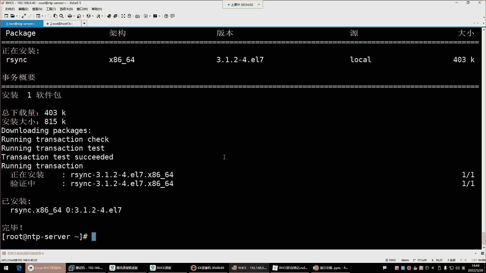

## 安装 Rsync 🔧


Rsync 是一个命令行工具，没有后台服务。使用前需要确保系统已安装该软件包。

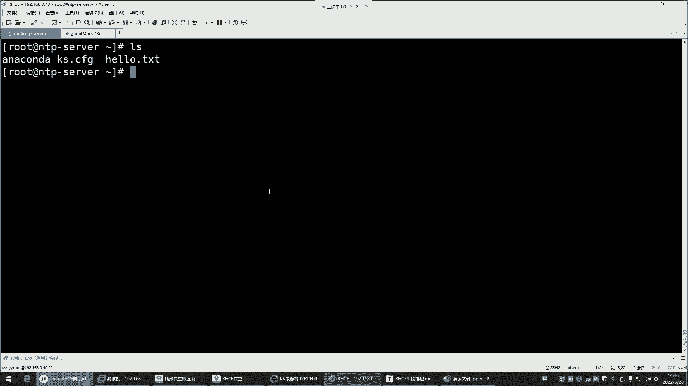


以下是安装步骤：

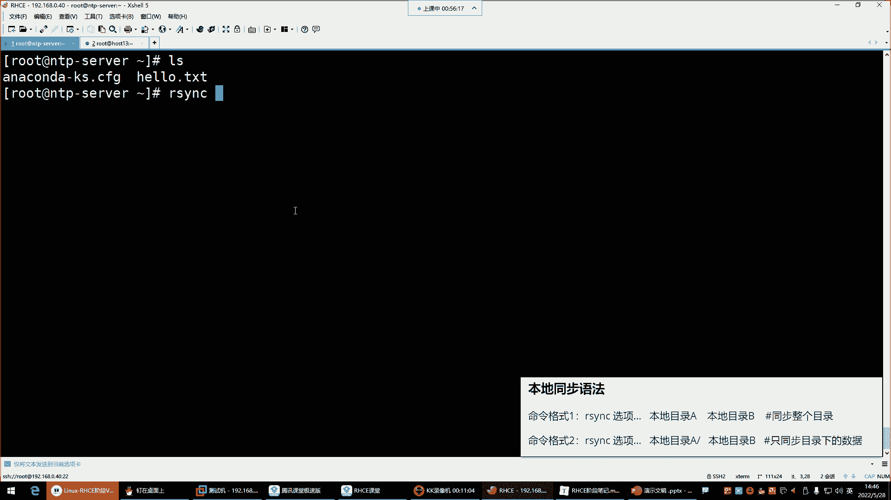

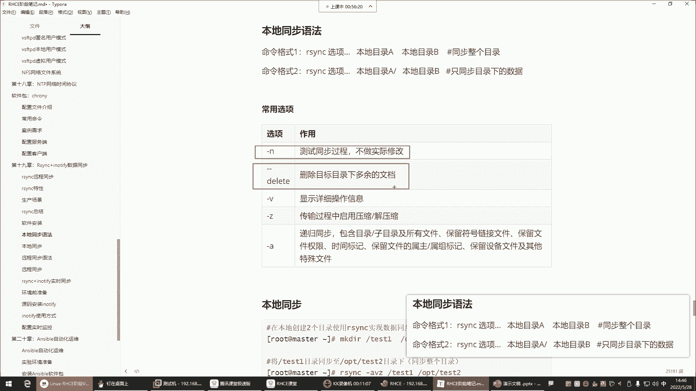

1.  检查是否已安装 Rsync：
    ```bash
    rpm -q rsync
    ```
2.  如果未安装，使用 YUM 包管理器进行安装：
    ```bash
    yum -y install rsync
    ```


---

## Rsync 本地同步 📂

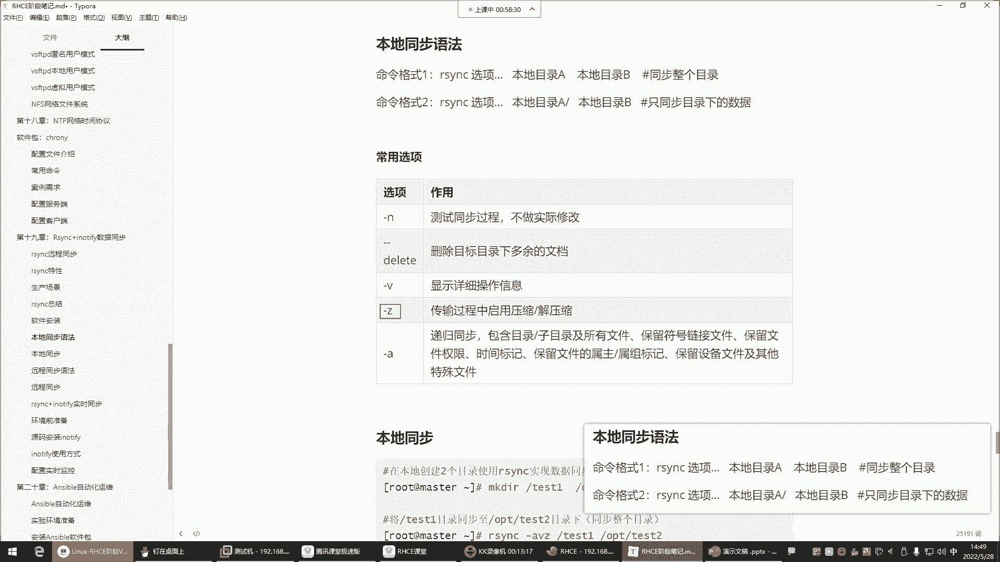

本地同步是指在同一台主机内的不同目录之间进行数据同步。

### 命令格式与核心选项

Rsync 有两种主要的命令格式，区别在于源目录路径后是否添加斜杠 (`/`)：

*   **格式一（同步整个目录）**：`rsync [选项] 源目录 目标目录`
    *   源目录后**不加**斜杠，会将源目录本身同步到目标位置。
*   **格式二（同步目录内容）**：`rsync [选项] 源目录/ 目标目录`
    *   源目录后**添加**斜杠，只会同步源目录下的所有文件和子目录到目标位置。

以下是 Rsync 的一些核心选项：

*   `-n`：测试运行，显示将要执行的操作但不实际执行。
*   `--delete`：删除目标目录中源目录没有的多余文件，以保持两端完全一致。（**使用需谨慎**）
*   `-v`：显示详细的同步过程信息。
*   `-z`：在传输过程中进行压缩，以提高传输效率。
*   `-a`：归档模式，相当于 `-rlptgoD`，能保持文件的所有属性（如权限、时间戳、符号链接等）。

### 本地同步演示

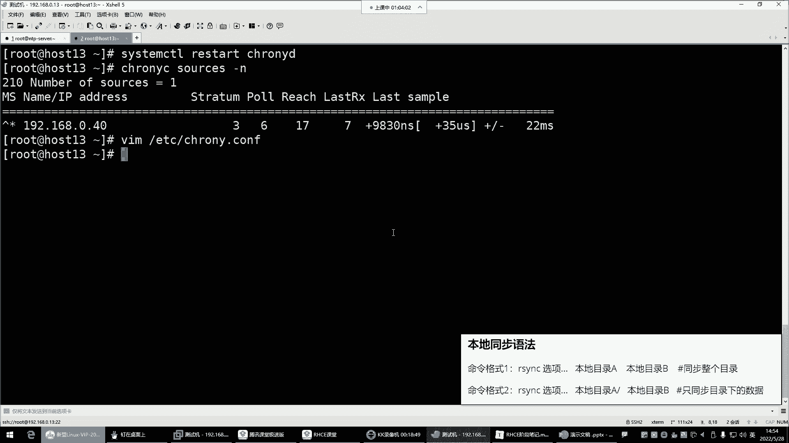


1.  **同步整个目录**（不加 `/`）：
    ```bash
    rsync -av /root /rsync_backup
    ```
    执行后，目标位置 `/rsync_backup` 下会有一个 `root` 目录。

2.  **同步目录内容**（加 `/`）：
    ```bash
    rsync -av /root/ /rsync_backup
    ```
    执行后，`/root` 目录下的所有文件会被同步到 `/rsync_backup` 目录下，而不会创建 `root` 子目录。

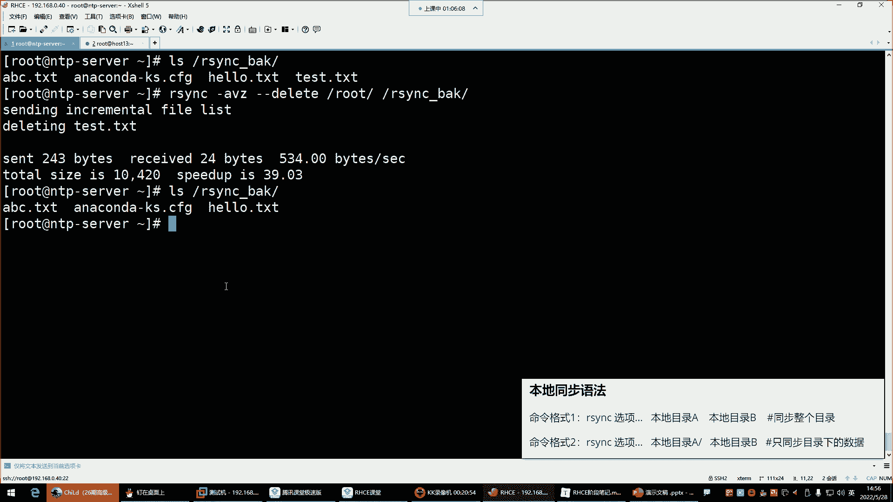

3.  **验证增量同步**：
    *   修改源目录（如 `/root`）下的某个文件内容。
    *   再次执行同步命令。
    *   观察输出，Rsync 只会同步发生变化的文件，未变化的文件不会被重复处理。

4.  **`--delete` 选项演示**：
    *   在目标目录（如 `/rsync_backup`）中手动创建一个源目录没有的文件。
    *   使用 `rsync -av --delete /root/ /rsync_backup` 命令同步。
    *   目标目录中那个多余的文件会被自动删除，以确保与源目录内容严格一致。

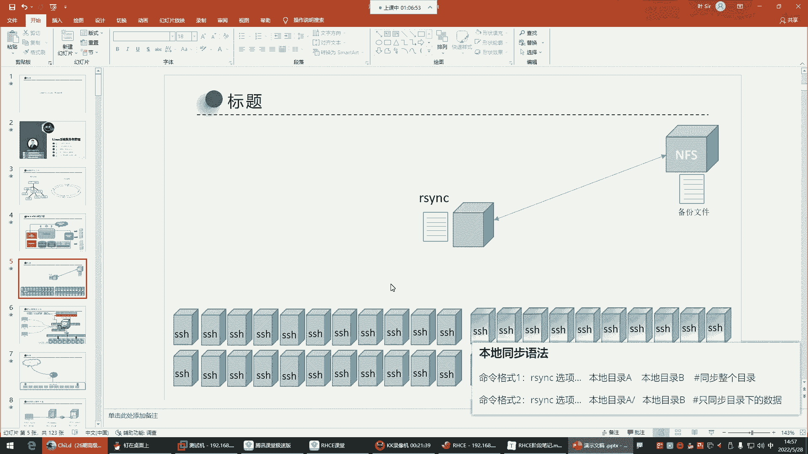


---


## Rsync 远程同步 🌐


远程同步是指在不同主机之间进行数据同步，其命令格式与本地同步类似，只需在目标路径前指定远程主机的用户名和地址。


### 远程同步语法

基本命令格式为：
```bash
rsync [选项] 本地路径 用户名@远程主机IP:远程路径
```
或反向从远程同步到本地：
```bash
rsync [选项] 用户名@远程主机IP:远程路径 本地路径
```

### 远程同步演示与配置免密登录

1.  **基本远程同步**：
    ```bash
    rsync -av /root/ root@192.168.0.13:/opt/
    ```
    此命令会将本机 `/root/` 目录下的内容同步到 `192.168.0.13` 主机的 `/opt/` 目录下。首次连接需要输入远程主机的密码。
    > **注意**：远程主机也必须安装 Rsync 工具。

2.  **配置 SSH 免密登录**（推荐）：
    为了避免每次同步都输入密码，可以配置 SSH 密钥对。
    *   在本地生成密钥对（如果尚未生成）：
        ```bash
        ssh-keygen
        ```
    *   将公钥复制到远程主机：
        ```bash
        ssh-copy-id root@192.168.0.13
        ```
    配置完成后，再进行 Rsync 远程同步就无需输入密码了。

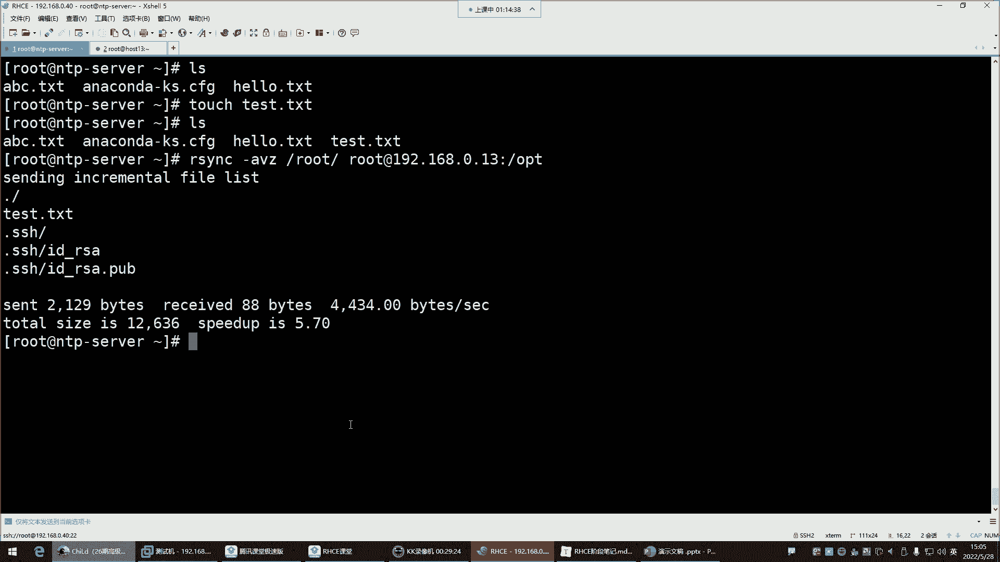

---


## Rsync + Inotify 实现实时同步 ⚡

上一节我们介绍了如何手动或定时执行 Rsync 命令，本节中我们来看看如何实现数据的实时自动同步。Inotify 是 Linux 内核的一个特性，用于监控文件系统的变化（如创建、修改、删除文件）。结合 Rsync 和 Inotify，可以实现一旦源目录发生变化，就立即自动同步到目标目录。

### Inotify 的安装与配置


由于 Inotify-tools 不是标准 YUM 源中的软件包，通常需要源码编译安装。

以下是安装步骤：


1.  从官网下载源码包（例如 `inotify-tools-3.13.tar.gz`）。
2.  安装编译依赖（如 `gcc`）：
    ```bash
    yum -y install gcc
    ```
3.  解压并编译安装源码包：
    ```bash
    tar -zxf inotify-tools-3.13.tar.gz
    cd inotify-tools-3.13
    ./configure --prefix=/usr/local/inotify
    make && make install
    ```
4.  创建命令软链接，方便全局调用：
    ```bash
    ln -s /usr/local/inotify/bin/inotifywait /usr/sbin/inotifywait
    ```

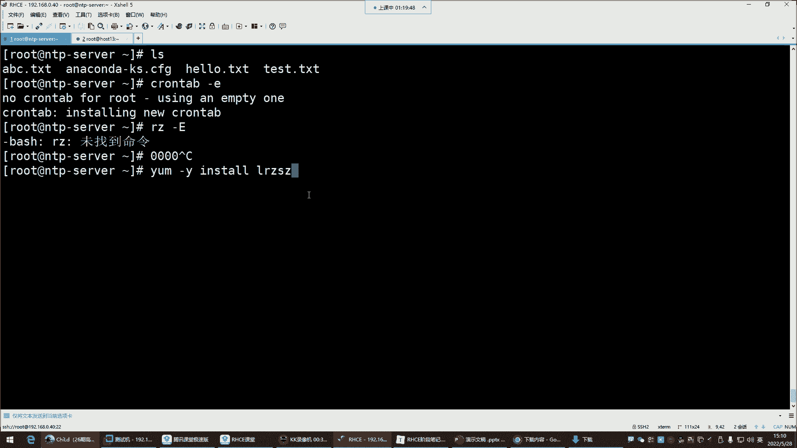

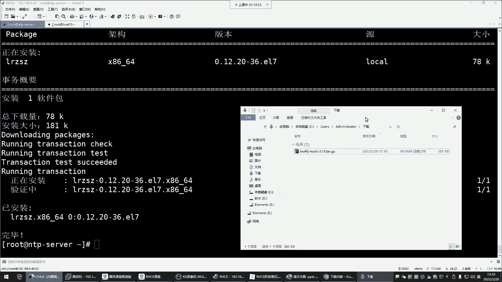


### 编写实时同步脚本


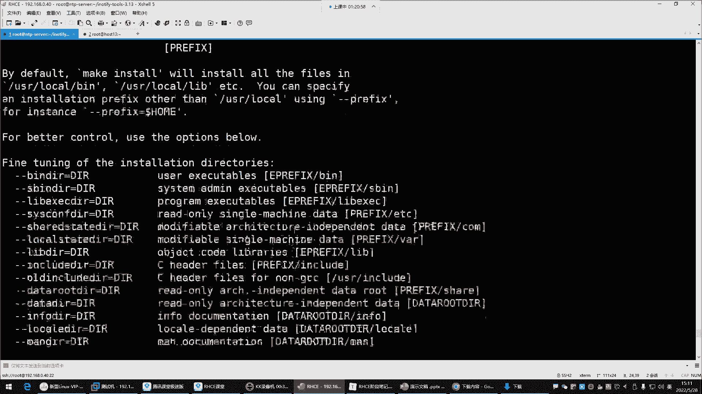

我们可以编写一个 Shell 脚本，利用 `inotifywait` 命令监控目录，并在事件发生时触发 `rsync` 同步。


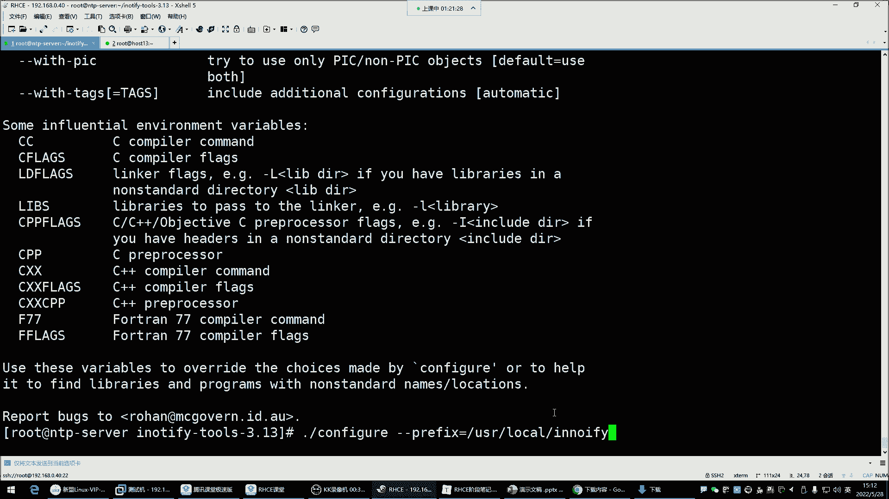

以下是一个示例脚本 `rsync_inotify.sh`：

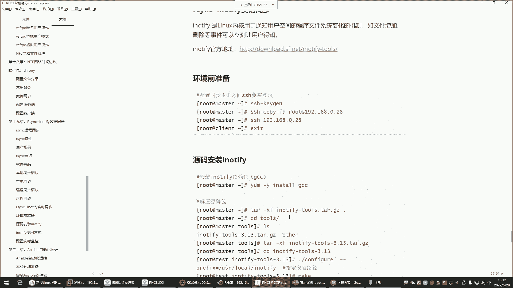

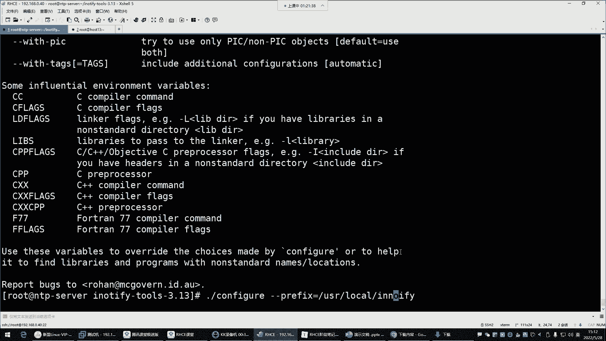

```bash
#!/bin/bash
# 定义要监控的本地目录和远程目标
SRC_DIR="/root/"
DST_HOST="root@192.168.0.13"
DST_DIR="/opt/"

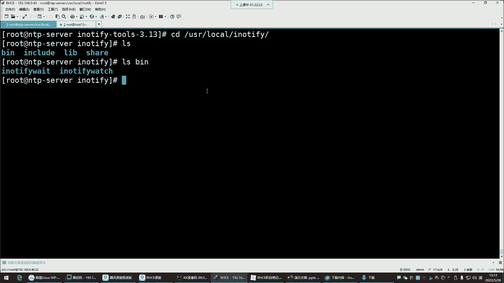


# 使用 inotifywait 持续监控 SRC_DIR 目录
/usr/sbin/inotifywait -mrq -e modify,create,delete ${SRC_DIR} | while read event
do
    # 当监控到事件时，执行 rsync 同步
    rsync -avz --delete ${SRC_DIR} ${DST_HOST}:${DST_DIR}
done
```

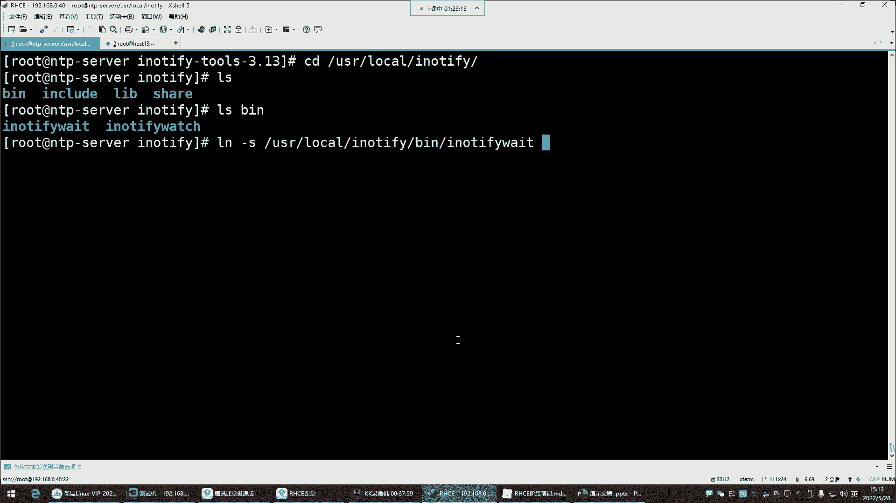

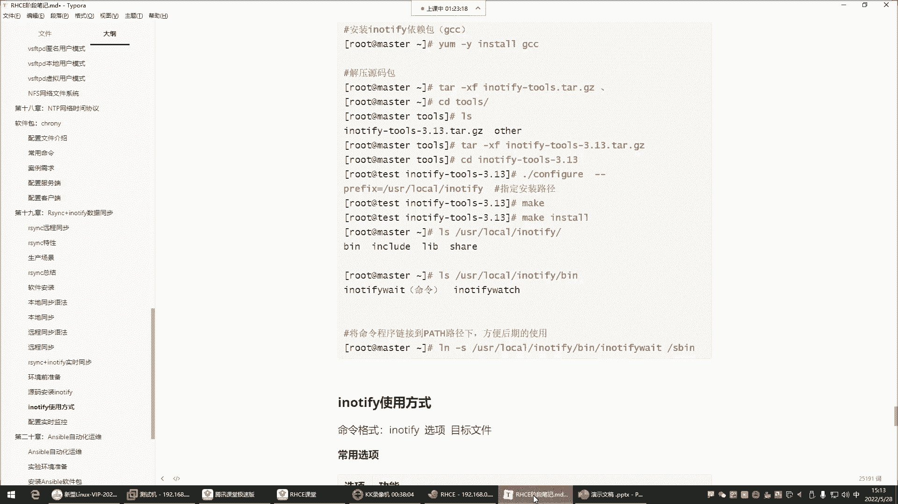

**脚本说明**：
*   `inotifywait -mrq`：`-m` 持续监控，`-r` 递归监控子目录，`-q` 减少不必要输出。
*   `-e modify,create,delete`：指定要监控的事件类型（修改、创建、删除）。
*   `rsync -avz --delete`：同步命令，`--delete` 选项会删除目标端多余的文件（根据需求决定是否添加）。


**运行脚本**：
1.  给脚本添加执行权限：`chmod +x rsync_inotify.sh`
2.  在后台运行脚本：`./rsync_inotify.sh &`
3.  此时，在 `/root/` 目录下进行任何文件操作，脚本都会自动将其同步到远程主机。

> **注意**：`inotifywait` 持续监控会消耗一定的系统资源（CPU 和内存）。在生产环境中，更常见的做法是使用 `crontab` 设置定时任务来周期性地执行 Rsync 备份脚本，而非实时监控。


---

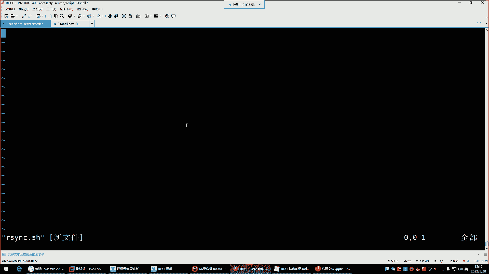


## 总结 📝

本节课中我们一起学习了 Linux 下强大的数据同步工具 Rsync。

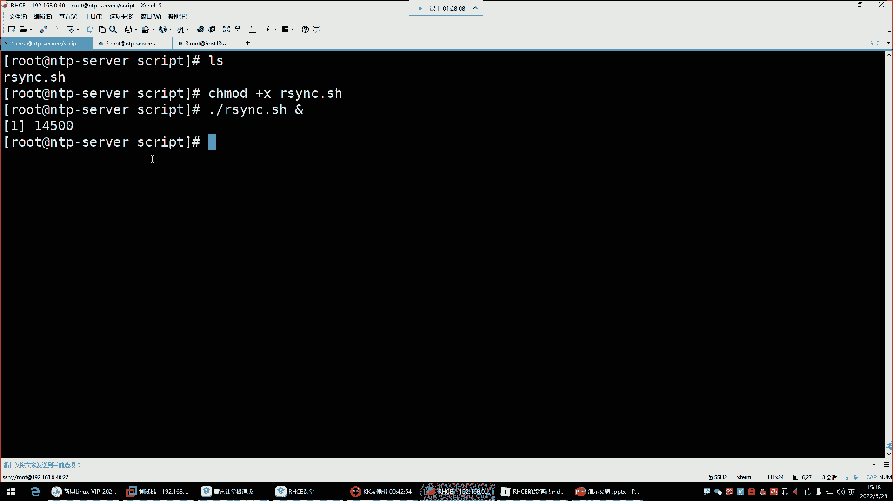


*   我们首先了解了 **Rsync 增量备份** 的原理及其相对于传统备份方式的优势。
*   接着，我们学习了如何进行 **本地同步**，掌握了两种命令格式以及 `-a`、`-v`、`--delete` 等关键选项的用法。
*   然后，我们探索了 **远程同步** 的配置，并介绍了通过 SSH 免密登录来简化操作的方法。
*   最后，我们介绍了如何结合 **Inotify** 工具实现数据的实时自动同步，并给出了一个简单的监控脚本示例，同时也指出了其资源消耗问题，提出了使用 `crontab` 定时任务作为生产环境更优的替代方案。


通过本章学习，你应该能够根据实际需求，选择合适的方式来实现高效、可靠的数据备份与同步。