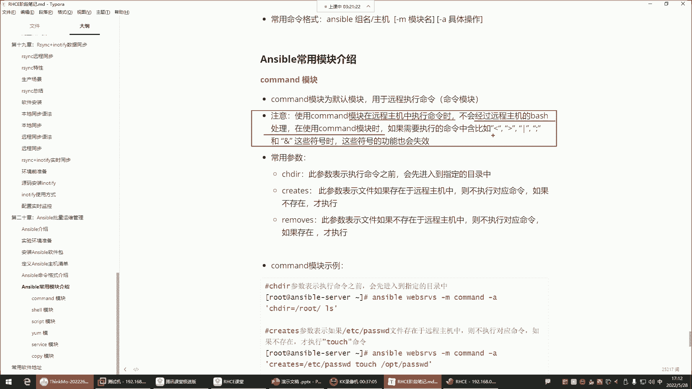
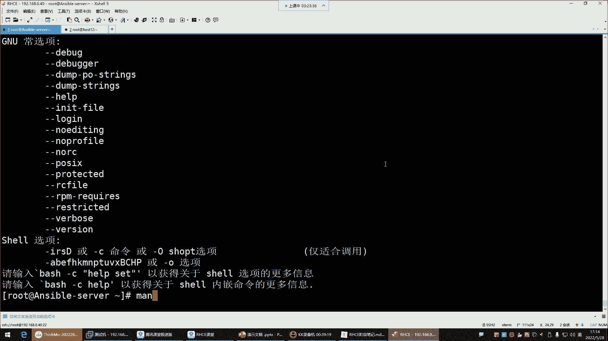
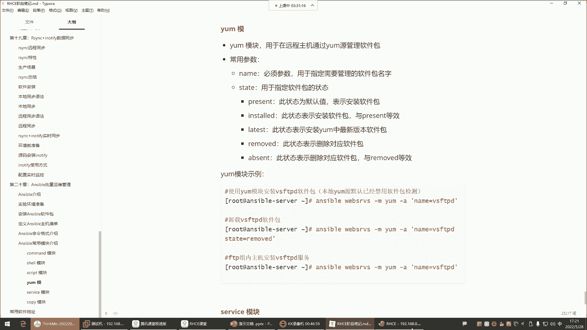
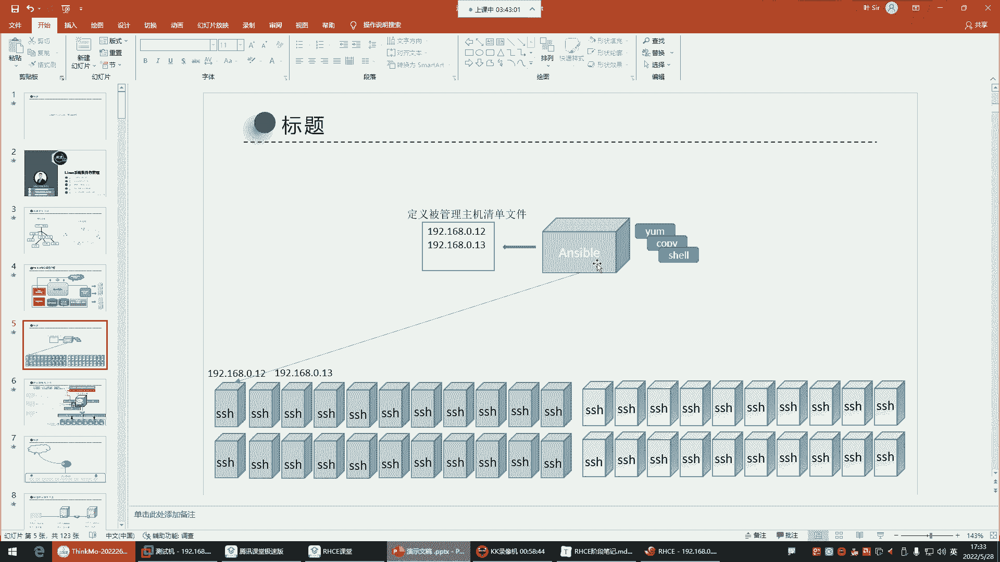
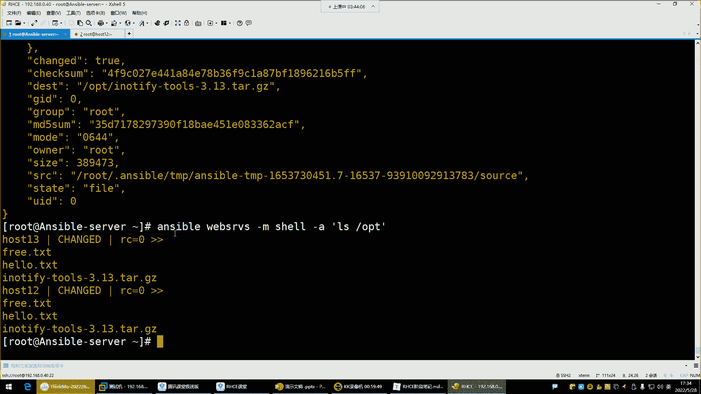

# 【小白入门 通俗易懂】全网最全RHCSA+RHCE教程，一周快速进阶Linux运维 - P63：红帽RHCE-26.Ansible模块使用 - 网工小程立志不加班 - BV1PN4y1R7uU

喂喂喂，我们说一下啊，我看你们是，自动化没怎么听懂是吧，其实啊这样哈，你们别把它理解成是自动化了，你就把它理解成是一个批量的运维工具就行了，就是一个批量的管理工具，批量的什么呢，运维管理工具。

这样能不能听懂了，如果我们换个词汇，大家能不能理解了，它就是一个运维工具，能够让你实现对服务器的一个批量管理，唉这现在有没有问题，没有问题的，给我刷个一唉，这个应该好理解了吧，对别别去理解的太复杂。

什么这个自动化之类的是吧，所以呢就这样的话呢，就让我们能够对它有一个更清晰的认知行，那接下来呢咱们就定义好主机列表了，我们也是这个怎么定义的呢，是不是很多种方法呀。

那这多种方法的话，etc ensable host的四，我们各种姿势都定义了。

这种姿势是最终比较给力的是吧，这种唉放在这，前面省略，然后列出组内主机列表，OK那这是第一种，这个是不是方式一，定义主机方式一方式一是什么呢，就是比较保守的方式哈，这样，host的11。

然后呢host12，第二种就是，定义主机方式二，但是一般呢嗯看情况看情况看情况定义都行，那接下来呢咱们就开始来学习它的模块了哈，来学习模块的第一个命令叫ensable doc。

那ensable dog这个命令呢干嘛的呢，叫模块文档命令，什么叫模块文档安保都是模块化设计，本身功能比较弱，都是通过模块来实现诸多的功能，所以它的模块非常重要。

那模块的话我们可以先这样通过这个ansport doc。

用杠L选项列出所有的模块，来看哈，Unstable gun dog，然后你可以杠个help，简单获得帮助，然后它这里面呢我看看啊，请参阅什么手册啊，这个不是看看前面的介绍，前面的也没有什么介绍。

在这里面并没有介绍嗯，没有介绍算了吧，没有介绍的话，那我们就不管它了哈，然后他有两个选项，一个是杠，一个是杠S，第一个杠叫什么，列出什么available plugins，什么列出插件是吧。

不是就列出它的模块，然后呢就这样，你就answer doc干嘛呢，先杠L回车，你看这就是它的模块了，它的模块在左边是它的模块名字，右边是具体模块的描述信息，那这模块多少个呀。

我们先Q退出自己过滤一下管道，给WC统计一下3387个，3000多个模块，那这个对于我们来讲可以说是非常的多了，你就把它理解成是系统里的3000多条命令吧，什么IOSCD这些命令拷贝MV3000多个。

哼那这时候应该慌了吧，为什么慌呢，这么多模块怎么学呀，是不是你看看这么多模块，这怎么学，往下翻吧，3000多个，那我告诉大家，我告诉你们这么多的模块的话呢。

我们常用的其实不可能都用得到这个answer啊，它这个功能非常之强大，对各种云平台也提供了专门的模块，对于各种各样的应用也提供了专门的模块，比如说如果你是搞数据库的，我们右斜线下面搜索一个。

比如你是搞数据库的MYSQL的，搜MYSQL回车，你看看那个模块，他说这是获取什么either mysql防火墙规则的，什么叫either mysql呢，either是微软的那个云平台。

然后呢这个微软的云平台上面有MYSQL数据库啊，所以说这个模块是针对于微软的那个云平台的，MYSQL去干嘛呢，去针对于防火墙的一些配置的模块，那你用你能用得到吗，是不是你用不到，对，跟命令一样。

咱就记常用的，你看看我们在学习这个LINUX系统的时候，大家我们学的什么iOS CD cat是吧，常用的这些命令，那这个系统也3000多条常用命令呢，你能都去学一学吗，不可能吧，就学常用的。

能够我们去学这些能够让我们及时变现的，什么叫及时变现呢，就是学完以后到企业里面能用得着的，未来的再牛逼的，在眼前用不上，那都没用，是不是啊，就眼前能够让我们变现的，这就是好的东西。

好那下面所以说对这个模块的，大家就别从这儿看了，因为你从这看也没啥用，大多数模块是跟你无关的，知道吧，好接着呢就退出Q就行了哈。

常用的模块给大家讲几个，能够满足我们的工作需求就行了，只讲一部分，现在现在先讲一部分啊，然后还有一个杠S叫查看模块的帮助信息，这个杠S的话呢，我们就是有，比如说我现在知道有一个模块叫拼模块。

这个P模块呢。

你可以看看这个P模块具体是干嘛用的，那这时候你就按SDK杠S跟上拼回车，他就告诉你了，你看啊，他这有一些描述，他说尝试连接到主机，验证一个可用的Python并在成功时返回喷。

那他是不是告诉你这个P模块的功能了呀，他告诉你说这个模块可以去，说白了就是测试主机之间的连通性，测试什么呢，就测试远程主机的Python环境，如果远程主机有Python环境，他就给你返回一个P能力了吧。

呃对这是跟其他机器去测试的这个哈，所以我们现在对安四部的模块学习的话呢，杠S是可以让你获取到模块的具体帮助，那你看我现在知道这个模块了是吧，那下面这是模块名字，那这个data是什么呢。

这个data是叫模块的参数，这个模块的参数大家这么去理解，模块就是unstable的命令，知道吧，参数就是模块的选项，就像我们学习系统命令一样，IOS是命令以光纤rs4功能有限。

但是rs4你想让它变得更加强大，我可以加选项，是不是安是不是也一样，安是不是给你提供的模块，你就把它看成是一个一个的命令，unstable的这个参数就是命令的一个一个的选项，专门调整模块的功能的。

就这么去理解就行了，知道吧，但是有，但是有的模块是不需要去使用这些参数的，为什么呢，就像我们在执行某些某些命令的时候，也不需要加参加选项一样，知道吧，就比如像CD我就想切换个路径，是不是啊。

所以说这有些模块是不需要选项的，但是人家给你提供了，那你说CD没选项吗，CD有你看看CD，你刚刚hero的时候，你以为人家没有选项吗，有是不是，只不过没有必要而已嗯。

好另一台地址呃，咱们前面不是定义了清单了吗，不是在清单文件里面指定的那个主机信息吗，嗯在清单文件里面定义哈，然后到时候自动去读这个清单文件路径下，这个清单文件读完以后呢，它就能够什么呢。

我们就通过组名去对这个组内的主机，去做操作了哈。

嗯好接下来我现在知道有个P模块了，拼模块怎么用呢，Enerable，然后先指定组名，就是你得告诉对哪个组去操作SRVS，这个组一定是你在清单文件里面定义的，那个组好，然后接下来你想调用模块，注意啊。

我要对这个组去执行操作，是不是得通过通过模块啊，怎么调用模块呢，杠M杠M跟上模块名就调用模块了。

杠M就是model的意思，就是model的意思，但是就直接杠M就行了，杠M调P模块，拼谁呀，这个P模块跟谁测试啊，是跟这个组测试唉，他就去拼这个组的所有主机，好会说，回收，好有一个主机没拼通看哈。

有一个后41，他说什么了呢，菲尔他失败了，看看啊，他说通过SSH连接主机失败，s h host的11，host11啊或者12啊啊12呵呵，那我们定义错了哈，etc answer ver host的四。

那是不是就是12~13，12~13，再拼一下，好可以了，看哈看这颜色了吗，红色就报错，绿色就成功，绿色这是一种比较幸福的颜色，就成功了，告诉你，所以说有有有的时候我们的这个生活。

跟着跟这个技术领域的都得需要这种绿色好，他会让让他会让我们变得更加幸福一些，那接下来呢我们来看看它这个返回的信息，就是我们每次通过安SP对这些主机操作的时候，他为了明显的告诉你它的执行成功还是失败了。

他会有一些什么呢，唉它会有一些返回信息，比如说后42看了吗，后42是谁啊，是不是这个组内的主机，后43是不是也是这组内的主机，啊啊啊后面告诉你success，success是不是成功的意思啊。

唉有人说安踏这条命令执行成功了，拼这两拼这个组内的主机，这个主机的环境是可用的，都有Python环境，然后呢他告诉你他调用了N次的什么呢，那个Python解释器这个路径下是Python解释器哈。

因为这个模块都用Python写出来的，得通过Python解释器去干嘛呢，执行这个模块，所以这是他执行模块的Python路径好，那这些信息呢倒不是什么重要的嗯，主要就看后面就行了。

这个位置success的告诉你成功就行了，能理解吧，别的信息没什么太多可讲的，其实这些信息也没有什么太多可讲的。

干嘛呢，看颜色，注意安色的命令，返回值的颜色，这是可以清楚的告诉你，这个命令的成功与失败的，就像刚刚咱们这些见红了。

这建红的话，用后脚跟想，你都知道他可能是失败了，是不是啊，所以说非常的贱明之意。

红色代表你的命令执行失败或者有异常，反正就错误了，绿色呢代表对远程节点不进行相应修改，没有发生改变，命令执行成功了，这句话无法理解是吧。

我再给你们来一波操作，我换个模块，调用一个是哪个模块呢，SHI模块杠A指定模块参数。

四个模块我要执行一些命令，我得通过杠一来指定杠A指定模块参数，那如果如当然我们一会再说这个具体的模块哈。

接下来我们看我杠A，指定我具体的模块的操作了。

那这个操作啊，其实准确来说杠A是叫指定具体的操作嗯，模块参数也可以叫嗯具体的操作。

那接下来杠A看哈，用引号引起来你的操作，你的操作要放在引号里面，不让它有语法错误，比如我现在干嘛呢，我先touch touch一个文件在哪呢，在远程主机的OP t目录建一个hello。

点TT我这条命令注意哈，我的这条命令是不是对这个组去执行啊，调用的是另外一个模块，这个模块一会儿再讲，杠A是指定具体模块的操作，那在这里边我干嘛了呀，touch系统的命令创建文件的，创建什么文件呢。

在OT建个hello点，别hello了，换个文件啊，或者说我直接删除，RM rf清空OT的目录，回头来看看哈，这条命令啊有两种颜色，返回两个颜色哈，第一个颜色呢是一个警告，看了吗，有一个警告。

警告什么呢，他说让你考虑使用这样的方式的文件模块，而不是直接运行RM好，有说他不建议直接去执行这样的命令，它有单独的这种什么呢，唉这种方式可以帮你去做一些删除的操作啊，但这种警告就像现在警告年轻人一样。

少熬夜，别打游戏，多学习一样，知道吧，你完全可以给它忽略掉，那下边看黄色，黄色就是什么呢，首先呢你看后面就称着称着就改变了，是不是哎你看这个绿色是success，成功了，看到了吗。

那你发现这个黄色和绿色之间。

他们两个的意义是什么呢，就是都是代表你的命令是成功了，绿色，把这个第二个就行了，命令执行成功了，代表命令执行成功了，代表命令执行成功了，好但是它的区别是什么呢，区别是绿色对远程节点不进行啊。

就是对远程节点不会造成改变，不会造成改变的，对远程节点造成了改变，这样的话就比较好理解了，首先呢粉色是你命令执行以后发出的警告，给我们一些建议，你可以忽略唉这个，而这个黄色呢是都是命令执行成功了。

跟绿色这两种颜色啊，你只要看到甭管是绿色还是黄色，你的命令都是执行成功了，但是这个绿色说对远程节点不造成改变。

这个就像我干嘛呢，我拼host12一样，我拼的，那我拼这个主机，这个主机会发生一些变化吗，会吗不会嗯，对我看他说的这个只看不做，是不是啊，成功了就绿对，连看该做完事了，就黄摸都没摸，连碰都没碰就红了。

这个哈就是说你就拼这个主机，这个主机是不会有任何的改变的，而我为什么这个命令它是黄色的呢，因为我这个命令是他妈的删了他文件了，你看我直接把远程主机的OP t目录，下的所有东西给它删了。

那你想想那远程主机这两台机器的OPD目录，那文件突然间就没了，是不是完整性就发生变化了呀，哎这就是我们所说的什么呢，就造成改变了，能理解吧，所以我们以后对于安斯来讲，哎这几个颜色是不是都给大家试了呀。

红色一看报错，绿色一看成功是吧，粉色一看警告就警告年轻人别搞对象是吧，应该多学习就警告你，是不是啊，但你也没听啊，是不是啊。

黄色也是成功了，所以就通过颜色判断就行，CSER哈，通过颜色判断是不是比看那些结果要强呢，现在就分手啊，可以啊，我们支持你，我们永远都是你背后的这个，这个什么叫精神支柱，好了。

那命令的返回值给大家说清楚了，接下来给大家讲第一个模块，Command，command是安SP的默认模块，这个模块是用于远程执行命令的，好这个模块啊。

怎么说呢，unstable杠doc，然后杠S1下，command一下，回车看吧，模块的介绍告诉你在目标上执行命令，有时候我想执行一些普通的命令，用这个模块就可以了，那这个模块的支持的参数都有哪些呢。

其实就像它的选项一样，它有非常多的选项，那这么多的选项我们对于命令模块来讲，其实大多数用不到用不到哈，我假设啊来给你们演示演示，比如比较典型的这种模块，什么衬着DR，趁着DR他说在运行该命令之前。

请切换到该目录啊，这是他给的解释是吧，那就是说我如果想用参数的话，就这样ENSABLE，看看指定组名web service杠M调用commander模块，它是默认模块，那如果是默认模块，你可以不用指。

直接杠A就行了，杠A指定我执行的具体操作就行了啊，我的操作里面会调用一个参数，叫趁着DR啊，参数后边用等于号来指定具体你参数的值好，那我的参数参数的值是opt目录好，接下来还来回车，大家看一下就知道了。

这个趁着DR是什么意思呢，就是我现在想执行一条IOS命令，我的L4是对谁执行的呢，你的乘着DR切换到哪个目录，我就在哪个目录敲个L，所以他现在给我列出来的是IOS的目录，什么都没有空的。

为什么前面被我给删了是吧，那你看我再看看效果，我切换什么呢，root你看就是说这个参数是干嘛的呢，就是帮助我们切换到某一个目录，再去执行具体命令的，这叫趁着DR。

那现在看的就是root目录下的一些文件了，看到了吗，两个文件，OK这远程主机的信息是吧，所以这些参数有必要吗，你们可能觉得有必要，那我告诉你，这有点脱裤子放屁了，这些alice root不好吗。

直接直接在SOPT不好吗，是不是啊，这不好吗，有必要非得去记一个参数嘛，是不是。

还有一些其他的参数，什么科瑞特斯，此参数表示文件如果存在于远程主机，则不执行这个命令，如果不存在才执行。

还有那个你看看create，这儿呢哈create，啊什么文件名，从2。0开始啊，如果它已经存在了，这一步不会运行，其实解释的也比较清楚哈，他说如果它已经存在了，这一步不会执行，什么意思呢，我想建文件。

它是它类似于一个判断，ENSABLE指定组名y service杠A已经具体的操作了，CRIS等于指定个文件什么文件呢，比如说指定一个OP t下的hello。

点TT后面命令touch OP t下的hello点TT，来看我的这个操作是什么呢，就是我用create这个参数指定了一个值，这个值是OP t下的一个文件，那这个CURREDIS他会帮我去干嘛呢。

去看这个路径有没有这个文件，如果这个路径有这个文件，后边的命令就不执行了，因为他说了，如果存在，则什么呢，是不是啊，这不就一个衣服判断吗，衣服判断啊啊如果它已经存在了，这一步就不会运行了，能理解吧。

所以我们看看回车唉，执行成功了，看到了吗，他又他又给我提示了是吧，他说你可以这样，start等于touch tt等于touch，就是你还得用它的参数。

在这再加个参数叫start等于touch o p p下的hello，点TTABC点TT吧，ABCC点TT，AABC点TT，这啊怎么还是出现这个警告了呢，看一下啊，我都已经按照他的这个方法做了呀。

就他建议你这样去执行，这不是告诉你了吗，建议你starter等于touch，然后跟上后面的路径和文件去创建，不是直接使用touch，然后他也给你报错，给你警告了，警告就警告吧，我我我们也不管他，好。

那我们看看阿拉斯远程的，是不是两个文件都出来了，都出来了吧，好那如果都出来以后，你现在在执行命令回车诶，变绿了唉变绿了哈，他为什么变绿了呢，为什么呢，他告诉你他跳过了，你看这哈，他说他跳过了，跳过了。

看到吧，他说因为因为什么呢，他说因为OPT有这个ABC的TT，所以他退出了，啊目标存在看了吗，目标存在，所以他跳过了，所以你说这玩意是不是一个义务判断呢，判断这个路径有没有这个文件，如果有呢。

那后面命令就，直接什么呢，直接就跳过，不执行了，只有没有的时候他才去执行后边的命令，因为我们第一遍的时候是不是没有这个文件，第一遍执行成功了，第二遍呢就失败了是吧，没事不用去理会他啊。

警告警告你理会他干嘛呀，我告诉你，你别搞对象，你听吗，你好好学习是吧，你听吗，你也不听啊是吧，不是警告吗。

好接下来呢我给大家演示了两个参数了是吧，第三个remove，这个参数的话其实也是一个if判断。

啊，这呢remove也是一个判断，看到什么呢，如果它已经存在了，这一步将运行诶，他俩恰恰相反了，看到了吗，前面是存在了，不执行这个事儿，如果存在则跳过这个呢，如果存在则执行，你发现他俩对着干，是不是啊。

哎那这个呢是什么意思呢，就是你在做一些，比如说我现在这个路径已经已经有文件了，是不是在远程主机的OPT目录，好那现在我想把这把这个文件给它移走，给他移动走，那这时候就可以用那个remove命令拿过来哈。

把这个curse换成REMO，如果远程的OPT目录有ABC的TT，那就别touch了，touch不就重了吗，干嘛啊，移动MV移动到哪呢，root目录移动谁呀，移动OP t下的ABC点TT导入目录。

能理解吧，先看这个文件在不在，是不是啊，那如果在呢，在他就执行呗，执行谁执行，后边命令，MV移动OPT的ABC的TT到root回车，唉执行失败了，不是执行成功了是吧，执行成功了，那你看看。

来自OP好ABC点TT没了，是不是啊，哎他就是给你做个判断，那如果你再把这个命令再翻过来执行一遍呢，他又说了，看到了又给你跳过了是吧，跳过了，因为什么呢，因为在这个路径这个文件它没有找到。

不存在不存在就跳过了，所以这玩意儿是不是一个衣服判断呢，没错哈，但是用得上吗。

用不上，我只是大体给你们演示一下。

给你们演示一下，就像我前面给你们所说的有些模块，那就像系统的那些PWDCD，这些命令是一个道理，你会用到它的选项吗，是不是用不到就用模块本身，所以这个也一样，我们用也是用它的本身。

比如我现在对它做一些操作，那命令模块，看它内存free杠H，因为正常执行命令不就行了吗，他既然是叫命令模块，你想想那几乎所有的命令都能帮你执行，这不就是远程主机的它的内存吗，总内存以使用内存剩余内存。

是不是啊，下面也一样，然后看它的磁盘，阿拉4block回车，两台主机的磁盘，这个主机的是吧，磁盘的大小，磁盘的类型是吧，看每个分区的空间利用率，Sd 1sd2，我想看看，DF杠H。

是不是SSD1这个分区，SD2内分区域，这儿呢这儿呢没有，第二哈，你看每个分区的一个空间利用率是吧，总容量以及使用的还可以使用的百分比，看到了吗，嗯嗯这些怎么不绿哈。

这问题问得好哈，他咋不绿呢。

是不是就是它为什么它不绿呢，正常来讲，你说我也就是看看，那也不会对他造成一些改变呢，是不是啊，那为什么不绿呢，来给你们演示个细节，Lo hello，点TT，你看这个时间，你看这个文件，现在的时间是14：

58分吧是吧，Cat hello，在TT回车再看文件，他这时间怎么没有变化呢，14。58分，不是哈14。58分，这文件怎么一点变化没有呢，看看啊，cat test011点TT回车，这有问题啊。

啊这看时间没有变化，但是改的话它就发生变化了，但目录的时间会发生变化，注意哈，不如果说我们做一些操作的话。

目录会会发生变化的，为什么呢，就是我们拿windows来给你们举个例子啊，LINUX看不出来，你建议文件夹右击属性，嗯还建文件呢，属性哈哈其实它是有这个时间的，他有这个时间哈。

只不过这个时间并没有给你显示，所以你看不出来，你看我们对于windows来讲，这文件有什么叫创建时间，有修改时间，有访问时间，但是在LINUX里边，他是不是创建时间没有给你显示，访问时间没有给你显示啊。

但你以为他没有吗，他真有，只不过他就在那儿没有给你显示啊，它只给你显示修改时间了，就你这文件你什么时候改过，他给你放到这个文件的详细信息里面了，但是其实你每次看文件的话，他这是也会有变化的，知道吧。

属性也会发生变化的。

所以它为什么是黄色的呢，就是因为它真的是发生变化了，能理解吧，这位置啊就是有点太细节了哈，这抠的太细了，这有点你们这有点为难我了哈哈，那接下来我们这个再继续哈。

那这些参数是不是没有必要去用它呀。

所以这就我们所说的什么呢，就直接用命令本身就行了，unstable web service啊，就直接调用，我想看什么呢，我想看CPU负载，Up time，看了看CPU的负载量，每台机器的。

但是这不能执行vim哈，我跟你们讲，不能VM哈，你说我VM一个文件行吗，Vm，root下的那个hello点TT可以吗，注意你如果这样的话，你就卡在这儿了，然后你说那那难道他是往往里往里面写。

让我们往文件里面写内容吗，不是你在这，你是对远程主机操作不了的，但是当你连到远程主机的时候呢，我们看一眼去啊，我们干嘛呢，PSAUX过滤一下进程，过滤谁呢，VM你看在这个主机。

它真的是有一个VM在打开这个hello的TT文件，看到了吗，对它不能交互的哈，但是他确实真的是调用你这个主机的VM了，帮你打开这个文件了，但你怎么编辑啊，是不是，你在这是编辑不了的哈。

所以这种交互的命令就不能用了，包括设置密码什么的都不行啊，就你就像我们前面所说，交互设命令按自本没有办法把你去去执行，知道吧，Ctrl c，退出了退出了。

对不能交互哈行了，这是可怕的命令，是不是就是执行想执行什么命令就可以了呀，然后这命令有一些小缺点，小缺点是什么，就是在使用common的模块，在远程主机中执行命令的时候。

不会经过远程主机的batch处理，它是SSH连上去就执行操作了，那你SSH连上去操作，那像有些特殊符号。

它用不了这套符号啊，它都不行，比如说比较典型的，我想看个文件的内容，看什么呢，我想看内存free杠H但我要把内存给它保存起来，保存到OPT下边放，放在什么呢，放在free点TT。

啊你看他把这个信息给我返回回来了是吧，那返回过来的话，那他真的是执行成功了吗，这个有free的TXT的文件吗，没有没有free的贴贴啊，这叫hello，点贴贴，我们前面是干嘛呢。

给它保存到FREEDER贴贴了是吧，这文件没有没有，你比如说我再结合一些，比如我再结合一些管道，加个管道，结合管道过滤M1M，没用失效了，这个管道prep回车是不是失效了呀。

啊死SPA是不是也给你显示出来了呀，我就想过滤这个M1M失效了嗯，失效了哈啊还还有一些特殊符号都不行，拉斯OP t下的星看到了吗，是不是报错了吧，为啥呢，因为这个模块它无法，它根本就无法去解析。

这些特殊符号到底是什么意思，因为这些特殊符号怎么来的呢，这特殊符号是by时代的，by是能解释，你better half的时候，我说你，这个慢半式的时候。

你看到他帮助的时候，这里边。

你看这那BT天生就具备这些特殊符号的支持，包括tab键，看到了吗，看到了吗，这头符号，唉所以说这些你看了吗，我们现在对于可慢的模块。

大家了解一下就行，接下来要学学谁呢，shell模块效模块也是远程执行命令的，跟command呀是类似的，但是有区别，区别在于show模块是通过batch去解释命令，那办事，我们现在所有的命令。

不是都不都通过办事解释吗，什么alex cat之类的是吧，什么阿拉斯星不都是by是给你解释的吗，就是对于我们来说就是一个福音福音，大多数的命令被这个shell都能都能帮你实现。

它支持的参数也都是command的，那些差不多的参数它都支持都支持哈啊，所以说这些shell中的那些参数，作用与command中的作用是相同的。

咱就不再举例了，那接下来怎么用也都是一样，只不过就换个模块而已，我现在想换show模块，你得用杠M调用了哈，不然它默认是command，能理解吧，我现在杠M指定调用show模块，杠a iOS OP星。

你看可不可以，是不是可以，但是你用command就不行了，还有前面的那个，比如说free杠H给他把这个结果写入到OP t下，放到什么福瑞点TT，你看这个结果没有输出到我们的屏幕吧。

那你看那个文件就知道了，你看这个文件里面，是不是给你保留了这些信息类啊，管道符，管道服，换管道符加grape m e m，是不是只显示MEM的行啊，别的时候没有显示啊，唉所以说这个功能就都一样了。

只不过特殊符号的话就得用shift了，如果你说我执行这个命令，里面没有什么特殊符号。

那没啥区别，没有什么区别哈，所以这些大家搞清楚，那这是社会模块。

这就没有什么太没有什么太多可讲的了吧，安包可不可以啊，安个包1arm杠y in10号，安装一个vs FTP t，安装完毕了吧，卡住了哈，不支持哈嗯他不支持vim，这是猴子的13，现在安包的。

这后面的12兽没有亚美元呢，啊正在运行着呢，啊有亚美云安装好了，应该是安装好了哈，两台机器都安装好了，看到了吗，你看信息host的13，是不是已安装完成啊，然后42下边是不是也已安装完成啊。

安包想卸载前面学过的命令，直接用rpm gue vs FTP t谢了，想查询杠q v vs ftvt没有，他说你未安装，是不是啊，未安装就他没找到，他报错了，啊我这对没错哈，不。

我现在所有操作并没有是对我的安色主机操作。

注意啊，我现在所有操作是不是都在uncle，上面去执行的命令啊，但是这个命令可不是对我本机去执行的，本机不安装啊，是给这两台机器在安装的，知道吧，不是给本机啊，这个别搞混了。

现在所有的操作都是对远程主机去去，去去执行的，本机没有安装包哈，本机啥也没干，本机就执行命令就行了啊，然后这SHIVE模块也说清楚了是吧，那script模块唉，说完shift模块。

我再给大家对比一个这个压模块，为什么会会什么呢，先给讲亚目呢，因为YM模块就是专门用于在主机中去安装。

软件包的，所以我们前面在安包的时候发现他给你个警告，他的警告，你按包的时候，他也有，他说你应该什么呢，又是这警告他说你应该考虑使用压模块，而不是直接运行压缩命令，能理解吧，他有专门的压模块啊。

如果你需要使用命令，因为亚目是不足的，你可以添加什么啊，什么任务之类的哈，好那没关系，安上就行了，安顺行哈，那接下来我们说说压模模块。

压模块呢怎么用呢，要么模块这些参数我来给你们说说哈。

怎么用，第一呢就是安包吗，不就是命令翻出来换个模块，换成样本模块，杠A模块的参数，比如说我的对模块的调用的具体的操作。

第一呢要么里面有一个name是必须的参数，用于指定角管理的报名，这玩意就是你安装什么包。

你得name等于指定vs FTP d，这是我安装的包好，那接下来你再指定对这个包，到底是安装还是卸载呀。

哎它有具体的参数，比如说像这个第一个默认的参数，就是表示安装软件包，那下面这个参数基金套也是干嘛呢，表示安装了眼包跟上面那个默认的参数等效，那你说这个有必要记吗，如果你想安装这两个都不用记，为什么呢。

你就直接回车就行了，它name等于VSFTBT。

它就知道它自动帮你安了，因为默认参数不就安装吗是吧，你指定个名，你用这个name指定个名，它默认就是给你安装了，所以这时候你看他就给你安了。

只不过他这样安的话，信息就有点让我们看不懂了哈，摸不着头脑了，安装成功了吗，成功了，黄色的你看颜色就知道了，就不用看那些返回的信息了，肯定安装成功了，啊杠q vs FTP d，哎这怎么办，我这么多错呀。

啊嘿嘿，不是压迫模块干的事，哈哈是不是是不是成了，是不是有好，所以你看这麻不麻烦，我问你们麻不麻烦，那想卸载怎么办，指定报名写内蒙好，指定包名叫vs FTP t。

我想卸载了那STATETT等于卸载的操作。

卸载叫remove，也可以用这个，这两个呢都表示卸载，表示删除与上面那个吕布是一样的。

哎这时候指定水木回车就卸载好了，那你们发现麻烦吗。

麻不麻烦麻烦吧，是不是还得去单独记记样貌，模块的具体的参数啊，是不是啊呵呵。

那你知道我们要shell是不是非常简单直接哎，这个你怎么就这记怎么记得住是吗。

就是啊，这这怎么记得住啊，所以这玩意，你说是不是就完全可以给它作为了解内容，就行了呀，没有必要掌握它是不是啊，哎没有必要掌握了哈，所以大家这个作为了解哈，嗯show模块能干的事尽量就用它干了。

实在不能干的，比如像像这种事情，script那shell就无法代替了哈，script这个东西非常给力，执行脚本的这个模块，它的难点不在于模块的用法。

它的难点，比如说你有一脚本嗯，比如说我们随便搞个脚本啊，叫这个VM，Hello，点s h echo一个hello word保存退出啊，我现在有个脚本，这脚本本本干嘛的，那接下来呢。

比如说这脚本是对远程主机做一些拼做，做一些这个环境初始化的好，那这个脚本有了以后，answer组名杠M调用script模块杠A干嘛呢，指定root下的hello，点SH回车回车啊，未找到命令。

IBL回车执行了吗，执行了，默认不卸载依赖，现在不卸载依赖了哈，依依赖不会被卸载，你用哪个方式卸载都不卸载依赖了，然后现在来看看哈，就是他把你执行脚本了，看到了吗，那你说这个模块它有什么难度系数吗。

没有男的在哪儿呢，男的在脚本就是你要干嘛，你得先有个脚本，有的脚本你调用它就行了。

这脚本是放在哪的呢，脚本是放在ANCIP的主机的协议脚本，或者直接上上传一脚本，放的这个什么呢，放到uncle主机ENCIL，直接执行这个脚本，这个脚本对谁呢，对远程主机生效。

也就是说脚本就一份不用拷贝到每个主机去，就在我本地执行脚本，然后这脚本就直接对远程主义生效了，是不给力，哎对脚本不用传到每个机器哈，不用拷贝过去，直接就在本地，就一个一执行好，那其他主机就全都什么呢。

全都生效，不用写BG了，那BH我不是说了吗，默认他不就调用BH解释器吗，呵呵呵呵呵呵呵嗯好，这个能理解了吧，所以难点不在于模块吧，这模块是不是script，我们前面建了多少次目录了。

每次我说咱们写脚本建个目录吧，跟一下建一个script是不是啊，这名字应该都记住了，啊这是SQUIP模块，就专门用执行脚本的，然后他也都支持这些参数，我们也不再啰嗦了哈。

所以这个模块就没有什么太多可讲的，就是脚本，你比如说你自己去写一个搭建亚目仓库的脚本，你让他帮你执行就行了，脚本有了以后就让他帮你执行就完事了，就没有什么能哼没有，主要是你有脚本就行，不用给真行权限。

好样本模块也完事儿了是吧，service模块也是作为一个了解的给大家说说，service也是一个了解的内容哈，为什么呢，service是用于管理远程主机服务的启动服务，关闭服务，看服务状态嗯。

那这个跟YM一样，这个44的功能我们用shell也可以来实现，比如说在44里边，你想去干嘛呢，你想启动服务，你来看一下，这大家看一下就行了哈，这样看一下就行了，就是你呢得先干嘛呢。

用杠A指定你对哪个服务去启动，start等于start后面加个D，这叫起此状态用于启动服务的，那也就是说明明看哈。

我就想把那个vs ftd那个服务起来，我用shell模块看哈，我用shell模块我就直接怎么玩了呢，我们前面学过的系统命令system start，然后vs FTP，这嗯说包装给卸了呀，按一下按一下。

要么杠y install vs FTP d，接下来再把刚刚刚命令拿过来，我想起服务回车起来了吧，是不是起来了嗯，起来了好，再给它关掉stop，好服务关了，那如果换成service呢，就这样。

Service，然后杠A这里边就是首先得指定哪个服务哎，name等于服务名，然后塔等于什么状态呢，启动服务starter d回车模块错了是吧，service回车回车好了起来了起来了哈。

还给你返回好多信息哈，这边看了吗，啊我想关闭服务，那就stop s t o p e d回车，服务关了关了哈。

应该是少一个P少一个P。

呵呵STOPPED看到吗，会说这样把服务关掉啊，那你说我们对对呀，那你说我们对于这个模块来讲，是不是就感觉他有点儿啥呢，没有shift好用了呀。

我想起伏我们我们前面最熟悉的是不是system start，是不是服务名，这多好用啊。

是不是，所以这玩意是不是也就了解一下就行了呀，这俩模块了解一下就行了哈，这个模块也用也用不到，shell模块最常用copy模块呢也也常用，所以copy模块是这样子的，对这个script是很的这个模块哈。

shell模块也非常吊啊，copy模块它们用于将文件复制到远程主机，那这个一般的话呢，比如说我想实现一个批量拷贝啊，批量拷贝的话呢，靠背模块非常的给力，就是看哈。

我现在就比如说，我想把这个压缩包拷贝到其他的主机，那我们试这个考考压缩包吗，别考压缩包了，考这个hello的TT吧，因为我们稍后要对这个文件做修改，所以考这压缩包，你你改不了它好。

那接下来呢咱们就这个拿这个文件来说吧，这个文件我想给它拷贝到远程主机，杠m copy模块，杠A指定在这里边啊，SRC叫他的全名叫source，圆的意思，什么叫语言呢，就是你的要拷贝的那个文件是谁。

叫源文件，SRC等于root下的谁呢，Hello，点TT，这是我要拷贝的文件，这叫原文件，好拷贝到哪里，啊全名叫destination，叫目标的意思，目考到目标的哪个目录呢，好它的mt目录回头失败了哈。

啊他说模块拷贝在配置的模块路径找不到，copy模块CPI敲错了是吧，CPY回车嗯，好拷贝过去了，拷贝过去了哈，告诉你目标看到吗，目标是mt的，hello的TT好，那接下来看一眼，用小模块看一眼就知道了。

看mt，有吗有是不是有过去了，没错，这就是远程拷贝，唉我想拷贝什么文件。

我想我想拷贝什么文件，这文件我就直接一条命令，直接对远程主机直接就批量拷贝了，嗯对就是有模块。

com模块非常给力，我要给他们，我要给每台主机下发一些什么文件，或者说压缩包，软件包就直接拷贝过去，能理解吧，比如我现在把那个压缩包给他拷过去，那个包名叫这么长的一个名字是吧，拷过去。

root下载这个压缩包，拷贝到远程主义的OPTOPT，卡过去了吗，过去了，对就把主机的文件拷贝到那些被管理的主机，看了一下背包的主机OP目，是不是压缩包过去了，那以后这两台主机想按这个包。

是不是直接就安了呀，是不是是不是给力就算给力哈。

然后copy模块下面还有一些参数，大家下去可以自己去干嘛呢，练练一练练一练哈，这些参数的话呢是也是做一些判断的，大家下去可以去尝试尝试这些哈，然后还有一些常用的软件包的地址在这里边。

到时候呢什么时候需要的话，翻翻这个笔记看看，如果真的是有你需要的地址，就直接从这找了，OK这这里面地址非常多，看了吧啊，几乎是涵盖了我们平时学习或者说工作的，常用的地址了行了。

那我们这个还有uncle的学习文档，uncle的学习文档，这个里面写的比较全啊，大家呢到时候后期如果说想去深入学习，你想怎么说呢，就是有时间的话，你可以自己去看看这个文档，这哥们儿写的还挺详细的哈。

好那我们的第二阶段呢，今天就是最后一节课了啊，然后大家如果说你前两个阶段，第一阶段，第二阶段，你说老师啊，我这个学的没学太明白，我想再跟一轮，可以大家就去进新班，可以再跟着复习一遍。

可以吧啊但是就是怎么说呢，就是，可以用摄影模块拷贝，不行，射模块没有，没有办法帮你远程拷贝哈，你看什么时候，给你远程拷贝个文件呢，行，然后你们如果觉得前两个阶段嗯，明天开始。

明天就是你们明天开始就第三阶段了哈。

