# 【小白入门 通俗易懂】全网最全RHCSA+RHCE教程，一周快速进阶Linux运维 - P6：红帽RHCSA-6.ls查看文件命令、命令行编辑技巧、学习方法 - 网工小程立志不加班 - BV1PN4y1R7uU

大家都回来了吗？回来的话给我刷个一，我们继续啊开始要开始卷起来了哈。我们说这个学习嘛啊学习就是要么呢你。😊，把他给什么呢？要么你就一直卷他，要么你就被他卷死，反正就是现在人嘛就是这样子的。

所以我们呢也继续卷，我们不能停下来的哈。😊，接下来呢我们这个讲什么呢？讲这个命令行的编辑技巧。那命令行的编辑技巧这。就是很多的我们说叫快捷操作吧啊可以理解成叫快捷操作。先来说第一个啊。

键盘的咱们拿过来哈。

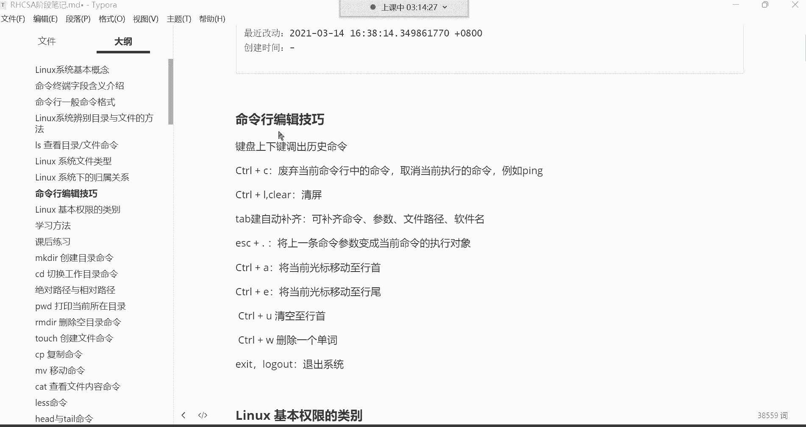

命令行的编辑技巧。啊，一个一个来演示一下。

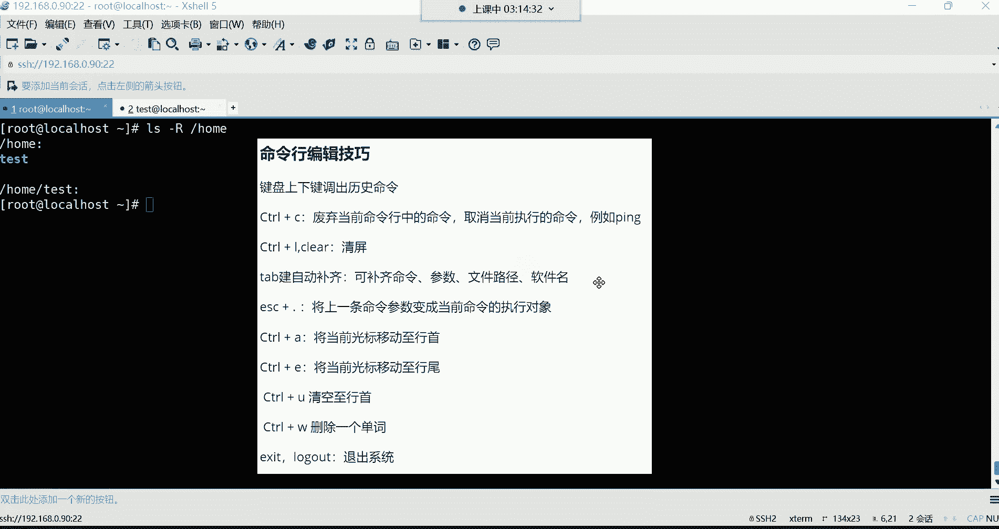

好，咱们先说第一个这个我我先conttrorlL哈，清个屏。😊，我们先说一下这个键盘上下键调出历史命令。嗯，就是我曾经啊，比如说我执行过哪些命令，我现在呢还想再去什么呢？再去重复的执行一下。

比如说上一条命令啊，我是这样看的后目目录是吧，回车。然后呢，我还想再什么呢？再执行一遍，那上剑啊就再翻上来啊，就又执行了一遍。但有的时候呢，你说我想执行过曾经的。某一条命令啊。

就是不是说刚刚执行过的这一条，而是曾经执行过的那你可以一直往上翻，注意哈，是一直往上翻。😊，那这个你可以一直翻到多少条呢？1000条。啊，你可以一直往上翻到1000条啊。但是呃我们啊下键就往回翻。

上键就一直翻你的命令历史命令历史啊。OK就上下来回翻啊，可以看看你曾经执行过的哪些命令。😊，那后期那么我们也会讲一条命令，怎么去调出所有的历史命令啊，但是现在你先不用去管，反正上下线呢。

我们一般会翻几条呢，最多三条。啊，最多翻三条，为什么呀？因为如果说你比如说你曾经执行过的某条命令，你这个什么呢？呃，就是可能说啊在这个前面的好几十条里边，那你说你还有必要去一直往上翻吗？没有必要了。

为什么你还不如直接敲一遍了，是不是？那来的多省劲儿啊啊，所以说这个键盘上下键呢，我们一般只翻什么呢？三条以内的命令啊，不会去翻太多，知道一下就好O键盘上下键。

然后还有一个是contrl Cconttrol C的话呢，是废弃当前命令行中的命令。😊，啊，也可以取消当前执行的命令。什么意思呢？比如说我现在敲一条命令LS。我想看ETC这个目录。但是呢我又不想看了啊。

我现在又不想执行这条命令了。😡，那怎么呢？啊，可以按ctrl。摁住cttrol的时候再按C啊，先按cttrorl再按C连着摁就可以了哈。那这时候呢我的当前我的这条命令就被我给废弃掉了，看到了吗？

废弃掉以后呢，它就会再重新帮我再生成一个新的命令终端啊，让我在这个终端，在新的终端里面呢，再继续敲别的命令。比如我现在想看OPT的。哎，是这个意思，能理解吧。😊，好。

那还有一个功能ctrol C呢还可以取消当前正在执行的这个命令。你比如说我现在想干嘛呢？我现在啊有一条命令叫拼啊，这个拼的话呢不陌生，就是拼数据包的，拼谁呢？比如我想拼百度啊，3W点儿百度点儿com啊。

我想看看这个百度，我这个机器能不能访问百度回撤。啊，如果能够看到你看这个64比特就是6呃64个字节，看到了吗？然后这个地址呢是百度的IP地址，就是我们现在往百度发送64个字节。😊，然后呢。

百度呢也给我回了啊，然后后边呢是一些相关的一些反回信息，你先不用管它，总之是拼通了。注意哈啊总之是拼通。好，那拼通了的话呢，现在拼这条命令哈。😊，他停不下来。你们看哈对，通了，它停不下来。啊。

就是一直在拼着呢。什么时候能停下来呢？就是要么你死了，要么你把百度给拼死了。总之。😊，得什么呢？得死一方啊，这个拼才能结束。但是如果我这个机器一直属于正常的运行状态，你看它一直拼一直拼啊，但我想结束啊。

😡，我想用我的终端呢，我现在敲不了命令了呀，是不是？😊，那怎么办呢？哎，这个时候。然后。Ctrorl C。哎，ctrl C就可以干嘛？取消当前执行的命令。按ctrl键 C的时候，哎，好结束了。看到吗？

啊，结束了哈。😊，看到了吗？啊，这个。木兰老师来啊。检查考勤了是吧？嗯，我看一下哈，赵峰是吧，咱们这个课呃，咱咱们这个课堂里面赵峰同学在吗？在的话呃，你得回木兰老师一下啊，他可能是来找你有什么事儿。😊。

给他回一个一哈。或者说你回个在也行，要是不在的话呢。具体有具体你也不用回了啊。啊，在是吗？啊，你就是赵峰是吧？行，那这个莫囊老师他可能找你呢哈。OK行，那我们继续哈继续。然后。😊。

现在这个ctrl C知道可以干什么用了吗？啊，两个功能。第一呢废弃当前。命令行里的命令。第二呢，取消当前正在执行的命令OK那，controrl L清屏啊，clear这个呢已经讲过了是吧？

我现在摁ctrl thenL好，我的屏幕就变得非常干净了啊，这是清屏。啊，那下边一个非常好用的功能叫t键啊，t键自动补齐。

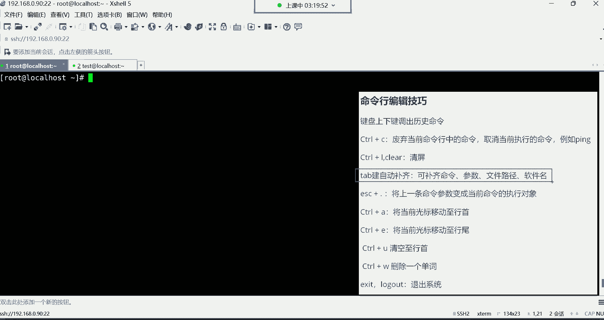

补齐什么东西呢？😡，啊，退不进。这个TAB键呢，它可以帮我们补齐很多东西啊，比如说补齐命令，补齐命令的参数。这个参数无非就是你比如说文件路径啊、软件报名啊，都可以帮你补齐。你看现在在这个系统当中啊。

有一个路径非常的长，哪个路径呢？

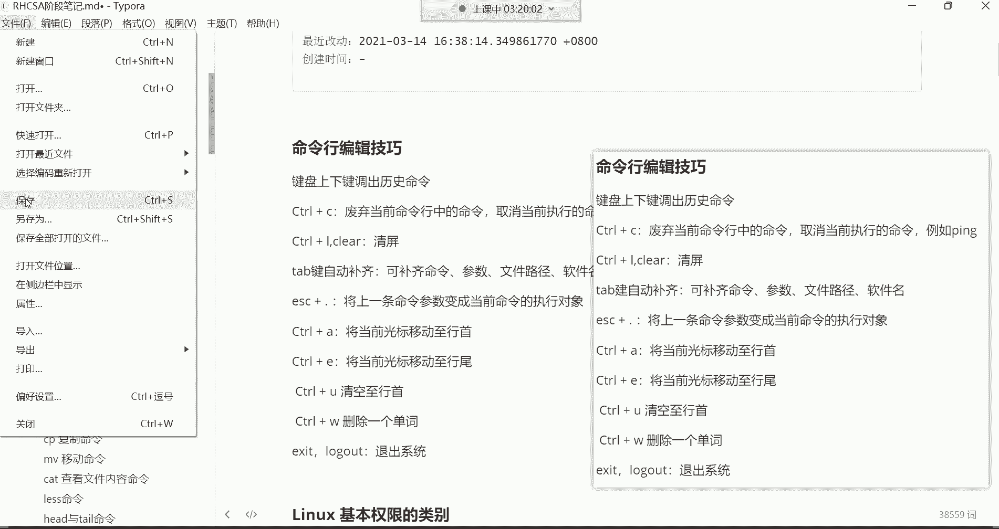

那阿拉斯在ETC下边有个ss confi格。这个路径，然后呢，在这个路径下边呢，还有一个叫nightwork杠qui这个路径。嗯这个路径哈，你看我打开以后呢，这里边啊有我们什么呢？

有我们当前系统的这个网卡文件啊，叫这个名字叫EFCFGENS32。以后，比如说我想对我这个机器，我要修改它的IP地址的话，到时候我得去打开这个文件去修改。但是首先我们得干嘛呀？我们得跑到这个路径。😊。

哎，得来到这个路径才能打开这个文件才能去修改它。那现在问题来了，这个路径这么的不好记，这么长的一个路径。是吧你看。多长啊，不好系吧。😡，那怎么办呢？呃，这推不见的可以帮你去干嘛呀，帮你去补齐。

它补齐的特点是这样子的，你看RS你只需要记什么呀？比如说啊我这个目录在哪一个目录的下边，首先你可以这样记，你记你先这样记哈，就这个我想改网卡的时候，这网卡的文件是在ETC目录。😊。

然后在ETC目录下面有一个非常长的路径，但是这个路径的完完整的名字我记不住。😊，那怎么办呢？哎，我只记比如说这个目录的开头的几个字母就行。那首先呢这个目录在ETC下边是不是啊啊，斜线路径分割符。好。

那ETC下边。😊，在哪个ETC下边的哪个目录呢？啊，有一个目录叫ss confi。但是现在呢。我记不住完整的名字，我只记住啊是SYS开头的。没错，那这个时候看看SYS开头。好，那现在后边记不住了吧。

记不住怎么办？按一下你的键盘的t键，t键在哪啊？t键在你键盘左上角，从上往下数。第三个键。啊，第三个键哈。😊，然后按一下T不见。摁一下，你发现摁一下它没有反应。注意，我现在已经摁了一下了，它没有反应。

那就再摁一下。😡，啊，摁两下就有反应了。为什么说摁一下的时候没有反应呢？😡，是因为呀。以这种SYS开头的在ETC这个目录下边。有很多，您看看。这个是也是以SYS开头的，这个呢也是以这种SYS开头的。

这个也是以这种SYS开头的，没错吧。啊，就是相同的名字啊太多了。太多了。所以呢我们在用table键让帮我们自动补齐的时候，它不知道你想补齐的到底是哪一个路径。啊。

哪一个目录他不知道怎么应该帮你补齐哪一个。所以呢你按两下的时候，他就帮你干嘛呀？把所有以这种SYS开头的，甭管是文件还是目录都给你列出来了，那你自己去选哎，那这个时候你是不是就能够清楚的看到啊。

我想找的是哪个呢？是这个啊s飞格没错吧。好，那这个时候你干嘛呀啊，自己补齐，自己再去补齐不就可以了吗？😡，C次config没错吧，然后再什么呢？再来个路径分割符。好，那在这个s confi格下边。😊。

还有一个目录名字。啊，因为这个文件呢藏的比较深是吧？但是呢我记不住完整的名字了，我只记住哎呀，那个名字是以这种NET开头的。😊，啊，innet开头的那我就再干嘛呢？啊，再来一个net。😊，后边记不住了。

那怎么办？😡，我先清个屏啊，我先ctr来清个屏。后面也记不住了，摁一下推不见。你发现摁一下的时候还是没有反应啊，再摁一下来了。😡，帮你列出来了。好，在这个ss configurefi这个目录里边。

以这个net开头的。有3个。那你到底要补齐哪一个呀啊，我想补齐的是啊，这个叫nightwork杠script。我想补齐这个，那这时候。你干嘛呀？你后边来一个W。OK然后呢。你发现后面我不想敲了。

不想敲还可以补齐吗？可以啊啊，你再按听不见。😡，你发现摁一下还是没有反应是吧？那再摁一下，哎，为什么说这个还得摁两下，是因为你这个network以以这个network开头的。你发现也有两个。

你看这个是一个文件。😊，啊，是个文件哈，你说我怎么知道是这个它是个文件呢？因为右边没有这根斜线，注意哈。😊，在这个系统里边，你再查看一个目录的时候，目录跟文件你最好的区分方法。如果你发现它没有颜色的话。

那怎么办呢？就是看后边有没有这根斜线，这根如果有斜线，就代表它是一个目录。如果没有斜线，就代表这是一个文件，好吧？OK但是呢同名了是吧？你看开头都是network开头的。😊，所以这时候啊。

你想让这个系统能够清楚的明白你的意思，你想补齐的是这个，那怎么办呢？哎，后边是不是就不一样了呀，后边不一样吧，来个小横杠。😡，然后再按一下T不键不行了。为什么呢？

因为这个以这个nwork横杠开头的那可只有一个，所以系统就知道你的意思了啊。原来你想补齐的是。这个路径。他也把你补齐了，然后回车就给你打开了。好，那你发现这一波操作下来感觉还。挺费劲的是吧？

我跟你一点不费劲，看我现在给你们再重新演示一遍。好，我想打我想修改我的网卡，那就是LS，我知道我的网卡是在ETC下边。😊，那ETC这边啊那个还有一个目录是ss开头的那t键两下。

然后叫什么名字叫s confi格，我自己补齐一下confi格，然后再摁一下t键，哎，又帮我补齐了两个，是不是啊，为什么呢？因为s confi格后边。😊，就什么呢？就没有同名的了啊，他知道了。

就帮你补齐了。然后呢，那在这个目录下面还有一个名字叫network啊NETW啊，特别键补齐。哎，你看你放W的时候，他帮他帮你补齐了。如果你不加W呢，因为以net开头的有3个，所以你加W以后，哎。

知道了有一个了，看到了吧？net work。😊，okK但是我不想补齐这个，我想补齐的是这个是不是？那就net work杠就行了，然后t别点补齐。😊，啊，这样就可以了。那如果速度快的话呢，就这样。啊。

ETC然后呢s configurefit键补齐，然后net wt键补齐杠t键补齐啊，这样就可以了，看到了吗？所以说这个t件的话呢，它可以。😊，主要哈我们应用的场景就是补齐什么呀？

补齐文件路径跟软件包名啊，我们后期在学习软件包的时候，那一个软件包的名字非常长。😊，有包名，有版本，还有软件包相关的各种什么CPU架构等等等等。一个软件包，一个软件包的名字非常长。

我们不可能去记住这个软件包的名字的，我们不可能去记住它的名字哈，但是不可能记住我还想去安装这个软件包怎么办呢？😊，你安装的时候，你得指定这个软件包的一个完整的名字。😡，那这时候配不进。😡。

他的应用场景就。你就感觉啊他真的是好用。啊，然后也可以补齐命令啊，可以补齐命令哈，但是这个比较少。因为对于这个系统来讲，命令其实都比较好记。因为命令呢都是单词的缩写。

你比如说阿S这条命令两个字母你还记不住吗？是不是？你还补齐个什么呀啊，所以就不需要去补齐命令啊，命令自己记入就可以了。主要是补齐什么呀？叫路径跟软件报名啊，这是比较常用的。好用是吧？好然后ESC加点儿。

那这个呢也是会频繁用得到的，t键也会频繁用得到。就比如说我前面在看DTC下边有一个文件叫那个什么呢？叫serviceSER后边我记不住了，t键补齐service。是吧。

那这个时候我现在我想看这个文件的什么呢？我想看这个文件的。😊，详细信息。如果这样看的话，只显示这个文件的名字以及这个文件所在的路径了。好，我想看文件的详细信息。那这个时候啊命令翻上来。分了以后呢。

我是不是得加选项啊，得加L选项吧。那这时候我的光标是不是得往左移啊？没错吧，往左移注意啊，有个快捷操作啊，叫cttrorl A。😊，要将当前光标移动至杭首。按ctrl再NA啊，你看我的光标。

跑到哪儿了呀？跑到杭首来了，是不是？然后再往右边移两下空格补个L。回车好，那现在就是显示了这个文件的详细信息。但是我现在还想干嘛呢？我现在还想。😊，以这种人性化的方式显示文件的大小。

那是不是LS空格杠FH啊，补个H选项，说H是不是人性化的显示啊，K着记的去显示它的大小。😊，那这时候怎么办呢？空格哎。是吧ESA加点儿啊，将上一条命令的参数给它调过来呀。变成我这个命令的执行对象啊。

ESA加点。看到了吗？哎，人性化的显示文件的大小，你发现这一波操作下来。都是什么都是用上了快捷操作。没事吧。俗称懒人用法。然后还有一个conttrol一叫将当前光标移动至行尾。啊。

这个用的比较少一些哈比较少一些。嗯，比如说我这个命令翻过来以后呢，你看我cttrol A移动到行首了是吧？然后呢，ctrl E呢就又跑回去了啊，cttrol A又回来了，ctrol E就又过去了啊。

非常的隐性是哈，没错。😊，OK然后controrl u啊contrl u叫清空制行首。这个的话呢，比如说啊我现在这个命令我又不想执行它了，我现在又不想执行这条命令了哈。

那么是不是可以contrl C给它废弃掉啊，没错吧，你也可以这样。😊，control u。啊，就直接把这命命令行的给你清空了。但是它这清空是这样子的哈，你看我们再翻上来。😊，如果我的光标在哪呢？在这儿。

在这儿，那我再按cttrolU的话。哎，你看它清空的是哪儿呢？它清空的是光标。往左没错吧。就从当前光标。再给你清空这行手，你光标在哪？我光标，比如说在这儿。😡，好，我再按ctrolU。哎。

你看就从当前光标开始清，是吧，一直清空的行首，没错吧。啊，所以说你如果有这种需求的话啊，你可以用conttrol去清空。啊，就比如说前面咱们敲个LS是吧？然后呢，我要看ETC下的service补齐。

k不键补齐啊，补齐了。但这时候呢我想干嘛呀？😊，我想那个。换条命令啊，那这候你可以直接换啊，或也我我们也可以这样啊把光标放这儿啊，cttrol u这样ctrorlU啊，换条命令。😊，可以哈。好。

那这就是我们所说的这个conttrorl有用的不多啊，用的不多哈啊，但是看情况吧哈，如果我们想不想执行这条命令，我们一把controrl C给它废弃掉啊，废弃掉。

那还有一个controrlW要删除一个单词啊，我前面执行过一个操作，哪个操作呢？😊，啊，ctrorlL清个屏哈，我这样LS杠LH，然后呢，我把ETC下的service特别键补齐啊补齐了。是吧执行完以后。

我是不是用L空格杠L。空格我给它调取过来了呀。那啊有行啊清空行为有吗？啊，也有啊也有哈。然后我们说一说哈呃我现在我想干嘛呢？我想这个。😊，只把这个路径给他清空。注意啊，只把路径给他清空。

我想换一个什么呢？换一个别的路径，我想看看别的文件，那这怎么办呢？你按cttrorlW的时候。诶，你看。他只把什么呢？只把这个路径给你清空了，以及那个文件给你清空了。没错吧，为什么呢？因为它识别到了。

😡，他们中间有个空格，你看我再给你们ESC给你调取过来，ESC加点，又把这个路径调取过来了是吧？啊，我这再按ctrlW，你看它清空到哪儿啊，这中间是不是有个空格啊？😡，这是有个空格的哈，你看这。😊。

controrlW，你看它清空到空格这儿了，所以说它在清空的时候，你看它是删除一个单词，什么叫一个单词啊？😡，你比如说我叉叉叉叉啊ABC啊，1234。我每次conttrolW。看到吗？

遇到空格就是一个单词，遇到空格就一个单词，遇到空格就一个单词。是这样子。所以你看这些都是快捷操作。所以到时候呃你如果嗯你用习惯的话。这种快捷操作呢就能够帮你提升你的一个什么的一个。就是工作的效率吧。

功效率O。然后下边我们在呃当然我给你讲讲我们最常用的。啊，因为什么呢？因为我跟你们讲那么多，你们不可能一股脑全都记得住。我先给你讲，你必须要掌握的。😡，上下键就不用说了啊，这个一般呢你往上最多翻三条啊。

如果翻不上，就自己手敲去好吧。然后ctrl C呢，这个必须得什么呢？必须得掌握，得记得住啊。因为这是我们常用的。然后清屏的话呢记一个就行。cttrorl加L呢比较方便一些快捷键。

然后呢t键这个必须也得什么呢？也得要熟练的去使用它啊，因为能够什么呢？能够提升我们工作的一个幸福指数啊然后ES加点，这个必须也得什么呢？也得熟练的去频繁使用它，因为可以确实是可以提高我们的一个什么呢？

一个。😊，学习的一个速度啊，或者说这个呃管理的速度。那下边。这几个你比如什么ctrol A controltrol e controltrol U controltrol W这些呢大家不需要去什么呢？

就完全掌握。你可以对他有一个了解就行。那前面我给你框起了这些。啊，就前边这几个是必须要掌握的哈，因为他确实是。很好用啊，还有这个。退出系统啊，这个你也得掌握两条命令，一个是X，一个是log out。

都可以帮我们退出系统。什么叫退出啊？你那我现在root已经登录了是吧？那现在我想把这个账号给它退出去X的回车。那现在我们就登出系统了，看到了吗？就登出了哈啊，这也一样，那log out呢就是效果一样。

log out。你看这个t账号我也想让它登出系统回车啊也登出了。😊，啊，功能是反正最终的实现的功能都是退出系统。然后我再想登录上去呢，SSH空格指定IP地址192。168。0。

90回车输入用户名root回车密码一回车啊，现在又登录上了，但是这屏幕太花了是吧？啊，ctrl L清屏。那这命令行的编译技巧，大家掌握的是不是就是这几个，还有这里面记一个就行了，X的比是比较常用一些啊。

所以记这几个就行。没有吧。

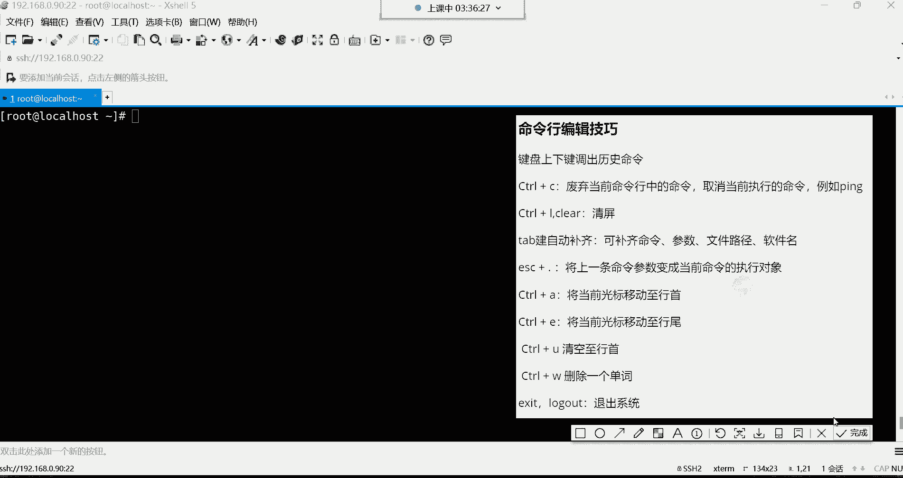

好了，那以上就是命令行的一些快捷的操作。嗯。那我们。来说一说哈。呃，下面还有一些学习方法，还有一些课后练习。呃，这个的话呢。我们今天就我看一下哈。😊，我们今天不行就讲这么多吧。你们。

今天是不是就讲是不是就讲完了？呃，没有啊，我们今天才正式开始，那下面还有很多命令需要我们去学习呢，看到了吗？有非常多的命令需要我们去学习。😊，非常多哈，只不过这些命令的话呢，得一步一个脚去学习啊。

也不能急。但是我觉得今天啊大家掌握的东西啊，从系统的基本概念一直到命令终端的含义解释，还有命令行的格式，怎么去敲命令，辨别目录文件的方法，阿拉S这条命令啊，以及它的一些常用的选项，还有这个文件。

但是文件类型大家作为了解就行哈。文件类型不需要你完全给它背下来，知道吧？啊不需要完全背了。我给你讲讲哈，你们今天这咱们今天学习的内容，你们需要什么呢？需要去重点去学习哪些东西。😊，第一，系统的基本概念。

这些都是了解的啊，你只需要知道就行。因为什么呢？因为这种东西不需要去死记硬背。因为当有一天你在听别人给你说什么叫多用户，什么叫多任务的时候，最起码你心里清楚这代表是什么意思。😡，能理解吧。

还有什么扩展名，还有什么叫根目录啊，这些呢别人一说的时候，你自己内心就知道了。😡，啊，所以不需要你去死记硬背啊，这种东西了解就行。那命令终端字段含义解释这个呢你得知道啊，我们这个一个命令行里边这每个。

😊，每一部分分别代表什么含义？这个你得。给它记下来哈，然后还有命行的格式。这个格式的话呢，一般你不需要去死记硬背它。因为你要根据具体的命令去呃什么呢？去。😊，做一些灵活的一个运用啊。

所以不是死记硬味的东西。所以这个呢你先知道一下，就是先知道什么是命令，什么是选项，什么是参数就行了。以及这个短选项与长选项的区别然后然后就可以了就可以了哈。然后下边呢这个辨别与目录文件的方法。

这个颜色呢，这你得记住。因为毕竟我们学习这个系统，这系统里面都是文件我们在区别这个文件的时候，大多数通过颜色我就知道这个文件到底是什么类型的了啊，这个得掌握啊，然后还有这个阿拉斯命令。

这个命令里面的选项呢啊，这三个选项得掌握。😊，然后还有这个文件类型，这个作为了解就行哈，这个不是什么重点内容知道就行。然后下面归属关系现在也是作为了解就行啊。因为我后面会有一个单独阶段去讲它的。

然后命令行编辑技巧，这编辑技巧里边前边这几个是不是啊？还有这个退出系统的，其中选一条命令去记就行了。😊，然后那基本权限类别这个你也不需要去什么呢？去现在去研究它，只需要知道有这么回事儿就行了。

因为有有单独阶段去学习的啊，所以需要掌握到有哪些呢命令终端，是不是？然后这个辨别目录与文件的方法，那命令格式呢是比较灵活。大家呢就是现在先知道一下，那阿S斯这条命令。😊，还有呢呃命令行的编辑技巧里面啊。

所以这是你们今天什么呢？要。这节课哈就是要重点复习的。好，那这一大章大概讲多久？一呃，这大章的话，我们论周的话呃，具体是哎我看看啊。得讲几周呢嗯。讲四周。啊，我们是讲四周哈四周。行了，今天就讲那么多吧。

然后明天呢今天回去好好干嘛呢？好好去休息休息，明天我们要开始学习这些命令了。因为明天我们就是前边的基本概念，大家一都已经差不多了啊，所以明天咱们这些命令就开始啊卷他们了。😊，我们就开始卷它们了哈。然后。

😊，整个讲完要多久？整个讲完五个半月啊，整个讲完是5个半月哈。😊，啊，下节课的PPT啊，我不是下节课的PPT是我一会儿把这所有的PPT啊，我都会发到今天的。课程链接里边。啊，是所有的哈。

所以呢你们可以提前预习。啊为这种东西呢，如果你们有时间的话哈，这个位置就可以提前去多多预习啊。多多预习的话呢，到时候呃我再给你讲的时候，你就非常方便了，是吧啊，对全套课程5个半月的时间。😊。

然后下边呢这儿还有一些练课后练习啊，以及学习方法啊，学习方法我要给大家说一说哈，就是大家在什么呢？在学习的时候遇到问题肯定是经常啊常有的事啊，就等于是家常便饭了，遇到问题。那遇到问题呢。

前期呢大家也不需要有什么排错的能力。毕竟前期呃你连怎么排错，或者说这个问题怎么产生的，你自己心里都不知道啊，所以说呢前期呢有问题呢，就问老师就行了。😊，啊，咱们群里面有专门的答疑老师呃。

咱们这个群里面的答疑老师啊，给你们说一说哈。😊，啊，这个磊神老师是咱们这边的答疑老师。然后我的话呢呃你们有问题呢，你们也可以在群里面艾特我。但是呢我一般平时课比较多。

我可能说这个没有办法及时的回复给你们。所以说到时候呢你们嗯如果我没有回，如果我没有及时的回给你们呢，你们就问咱们这边的答疑老师啊，在群里面直接艾特他，然后把问题呢，直接发到群里面，对吧？

如果他没回你多艾特几遍，OK吧啊。😊，嗯，然后在这个学习的过程中，如果遇到什么呃，全全套都是我讲嘛。不是啊，咱们都是一个阶段一个阶段的，哪有人能够带全套课程啊，累死了。😊，然后咱们说一说哈。

呃咱们都是轮班，呃，就是每个阶段一轮每个阶段一轮的哈。😊，然后呃是这样子的哈，就是如如果你们在这个。在这个比如说我们这个课上遇到一些呃像一些这个。其他的问题就不是技术相关的问题。

你们就找你们对应的报名老师就行了。你们跟谁报，你们跟谁报的名啊，你就找谁，然后班主任是这个。😡，班主任是这个哈木木老师，就是他是什么呢？就是每次咱们这边，比如说有嗯有什么这个教学方面的问题。

或者说你有有有什么相关的建议啊，你可以跟他去提。然后呢，包括咱们有什么放假通知啊啊，到时候都是他去那个什么呢，给你们去发放这些通知消息，好吧。😊，呃，公开课现在还需要学吗？公开课不要学了哈。

不要再听公开课了哈。呃，为什么呢？因为公开课的话，现在对于你们来讲呢，你们不太适合去听公开课了啊，把时间要放在哪儿呢？要放在系统班的课程上边。毕竟公开课是什么呢？是。😊。

跳跳着讲哈跳着讲不太适合你们现在这种系统化的去学习了。好了，那然后下边呢还有在后期遇到问题的时候呢，就思考思考自己呀，能不能把这问题给它解决掉。别到时候呃，已经什么呢？已经不是一个小白了啊，已经入门了。

然后再遇到问题的时候呢，哎呀自己就啊就想马上我就得去找老师，就艾特老师。😊，这就不行了。毕竟咱说这个你在学习的时候，有有人能够帮你解决问题是吧？但如果你到企业里面工作怎么办呢？是不是你遇到问题。

你不能说我还去想着去问老师帮帮我去解决吧。是不是？这人总要成长，总要长大，所以你还不如趁着现在这么好的一个机会啊，就是你现在刚刚入门的时候，可能会遇到各种各样的问题。

你就要自己去锻炼你自己的一个解决问题的能力，这就是运维嘛，是吧？运维的话，80%的工作就是解决问题。😡，哈哈。😊，所以说呢你如果在学习的时候，你就能够培养好自己，能够去把问题。比如说我去遇到问题。

我先去百度百度啊，谷歌谷歌啊去搜一搜，然后呢。如果真的是感觉自己无能为力了，解决不了了，最后再去问老师。😡，能理解吧？哎，你如果在学习的时候，就把自己的这个习惯培养好了以后，你到工作中。

你解决问题的能力你也是非常强的。你想想我们运维这个行业啊，都已经好几十年了这个岗位。在整个这个运维领域，你们遇到的问题。那其实大多数别人都已经什么呢？已经遇到过了。所以说呢你像百度、谷歌之类的，呃。

你只要是会百度，会谷歌，哎，其实能解决大部分的问题。是是这样子哈。所以说呢要锻炼自己解决问题的能力。我说的这个解决问题能力不是说你自己啊知道啊，我去遇到问题，去百度搜一搜就可以了。而是什么呢？

而是培养自己。😡，百度跟谷歌的能力为什么会这么说呢？因为。在百度是有技术含量的。不是什么人都会百度的。😡，知道吗？同一个问题，你去百度跟。别人百度，你发现得出的结果它不太一样。为什么呢？就是需要你锻炼。

怎么去问一个问题。没错啊，就是这个问问题的这个表达方式是非常重要的。就你遇到一个问题，你能够给他。😡，怎么说呢？清晰明了的。😡，问那给它表达出来啊，给它写到百度的那个什么的那个搜索栏上边。

你发现哎你得到的答案就非常的清晰。如果你遇到个问题，你发现自己都描述的含糊不清，你问百度也没用。😡，知道吧？所以说我咱们说解决问题的能力是什么？就是我们怎么去呃描述自己所遇到的问题。😡，CSDN怎么样？

CSDN不是解决问题的地方啊，CSDN是让可以让你去什么呢？去看一看别人写的文章的一个地方。K。好，然后呢下边呢就是在学习的时候呢，培养自己主动学习，不要被动学习。什么叫主动学习呢？就是。

比如说我今天交了你1个LS命令。好。那我教你LS命令以后呢，你觉得啊你已经把老师教的这些啊都已经什么都已经啊熟练的掌握了。那。你可以再去什么呢？在基础上再去扩展扩展啊，比如说哎呀。

那阿S命令除了老师给我讲的这些功能以外，还有没有别的一些功能啊，哎，可以再去额外的扩展一下。你不能说老师给我讲这几个选项，我就学这就学这几个选项。那老师没有给我讲的，我也不学了，我也不去扩展了。

其实这样不是一个好的学习态度啊，这就属于叫被动学习了，知道吧？教什么学什么。😊，而但是呢我们说这个学习比较难受是吧？呃，主动学习呢你想想谁不愿意去，哎呀，谁不说白了谁也不愿意去学习，谁都喜欢。😊，呃。

这个放纵自己啊，听个歌，看电影，打个游戏是吧，出去逛个街啥的，嗯，能够让自己心情愉悦的啊这种活动谁也不愿意学习，学习头疼啊，是不是啊学着学着脑瓜子就疼，学着学着就。就感觉自己就突然间就犯困了是吧？啊。

但是没有办法啊，我们整个学习阶段你要知道，其实。😊，总共就5个半月时间。你们要自己好好想一想，就5个半月的时间。😡，这怎么就不能坚持了呢？嗯，就当这5个半月时间，我们出家了，我们呃怎么说呢？呃。

就是对于这个社会当中的那些所谓的什么爱恨情仇是吧？肤白貌美的那些什么呃，这个女孩子啊，咱们都给他杜绝掉5个半月时间。😊，啊，闭关修炼。等等你把这5个半月坚持下来，学完以后啊，你找到份工作。😡。

对你找到一份工作，你。😡，拿到了薪资啊，你的收入变高了。那个时候你再去干嘛呀，再去做你。😡，曾经想做的事情。哎，对，用5个半月的时间给自己。换取未来啊几十年的一个好的一个。一个方向。或者说一个高的收入。

你们想想。这不值得吗？是不是这不值吗？嗯，就5个半月嘛，是不是啊？嗯，又不能让你怎么样，时间过得也很快。😡，既然想改变，咱们说人就得要拿出那个劲儿，知道吧？要拿出那个劲儿哈。

你如果说你总觉得哎呀这个抱着这种就是就是可学可不学的态度去面对这种事情的时候，最终你也不会有一个好的结果。😊，啊，就是也不能说天天看课哈，也不能说天天看。但是尽量哈呢就是要干嘛要。😊。

你想想这5个半月是你非常重要的一个阶段。😡，非常重要一个阶段哈。就把那些没有用的一些无无效的社交就能给他断了就断了，没有意义，知道吧？没有意义哈。😡，有有什么用呢，是不是啊？所以说呢这个学习这个东西呢。

人就是要什么呢？要在某一个阶段啊，在那个阶段你要卯足了劲儿。如果这个阶段你不卯足不卯足的劲儿，我告诉你人有惰性，有疲劳期。你一旦。这个惰性跟疲劳期一上来，这东西你根本就坚持不下去了。😡，啊。

根本就坚持不下去啊。所以要趁着现在啊，你还什么还有这一腔热血啊，你还有这股劲儿。😊，你就是要什么呢？我们说叫给自己扒层皮。啊，八层皮哈。不八层皮。你是想在一个行业里边想有点成就。那是不可能的。嗯。

不要觉得呃能够轻轻松松就把技术给他学到手，轻轻松松就能够月入过万。如果。在这个社会当中，什么事情都能够。让你轻轻松松的就能够呃得到好的结果的话。那这个社会上就不会有那些啊。

就是我们说就是就那种低收入的人群了。啊，什么叫低收入的人群呢？就是。呃，那些没有什么技能，但是呢还挣不了多少钱的，天天就想着什么呢？就是小钱不愿挣，大钱挣不来的这种人群啊，就不会有这就不会有这种人群了。

所以现在这个社会就是就是这样子的，脚踏实地的。Yeah。好了哈，这是然后下边呢在学习的时候呃，不要死磕一个记录点。😊，不要死磕一个记录点的意思就是。低头拉车的时候嗯。不要忘了抬头看路，什么意思呢？

就是你现在学习的时候，你可能会遇到很多问题。那你这个问题是在你这个阶段，就根本是解决不了的问题。😡，啊，根本解决不了的问题。那这个问题有可能是在未来某一个什么呢？某一个技术点上就能够让你豁然开朗的。

所以如果你在学习的时候，你发现你现在遇到的问题，你解决不了了，没关系，你把这问题放一放啊，继续往后边学。😊，继续往后边写哈。学着学着呢，你发现哎，突然间。那就跟前面呢给他什么的关联上了。

这问题就自然而然就解开了。😡，能列吧，所以这叫做啊低头拉车的时候，不要忘了抬头看路，你一直低头拉车，前面遇到墙，你也不知道光撞上去了，是不是？😡，你不得看看前前面这个路畅不畅通吗？😡，所以学习也一样。

咱是死磕一个技入点。😡，啊，这个问题解决不了，我后边我就不学了。😡，必须得解决。😡，那不等于撞墙一样了嘛，是吧？😊，啊，这是这个学习方法哈OK。好了嗯呃，可以。

拿my circlecle阶段的录屏跟笔记是吧？呃，如果你想学my circlecle的话呢，也行啊。嗯，可以哈可以，但是你要依据你当前的情况去学。如果你现在基础都没有的话呢。

我也不建议你去学习mesco。如果你说这个我有基础是吧，我就想提前往前学一学这个关于数据库的内容也行啊，也可以，也没有任何问题。啊，如果需要的话，到时候可以这个私聊我啊。

你们也是啊有什么这个比如说这个需要啊，需要这个什么学习资料之类的哈，都可以私聊我，好吧。😊。

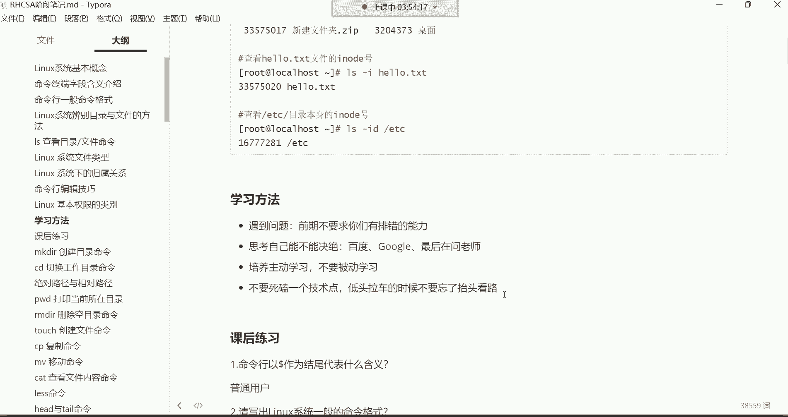

先关机啊，怎么关机呢？

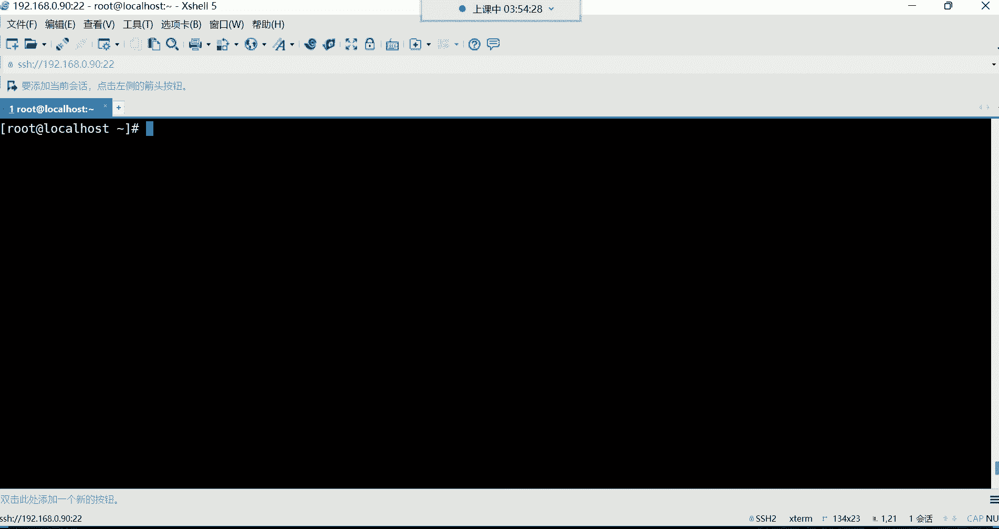

啊，这不是虚拟机吗？看了吗？想关机的话呢，找到我们这个虚拟机，然后这儿右击看到吗？这是这里面是不是有电源哎，电源里面看到了吗？有关闭客户机啊，选择关闭客户机就可以了，这就关机了。😊。

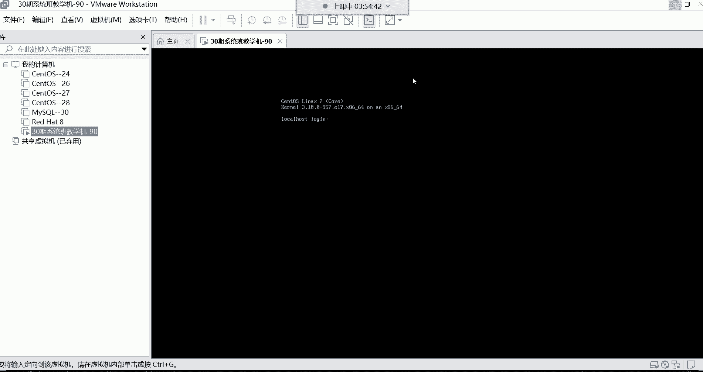

OK关机了是吧？

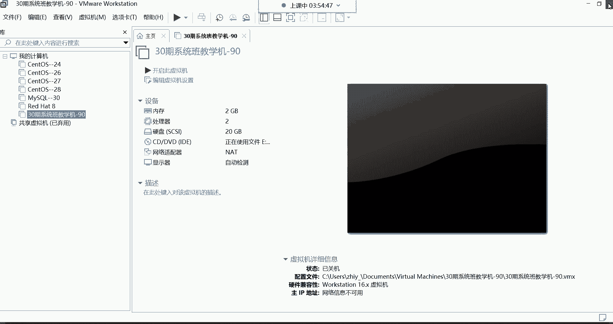

好，结束掉了。然后一关机这边就断了哈，然后这边就关掉就可以了，关掉。😊。

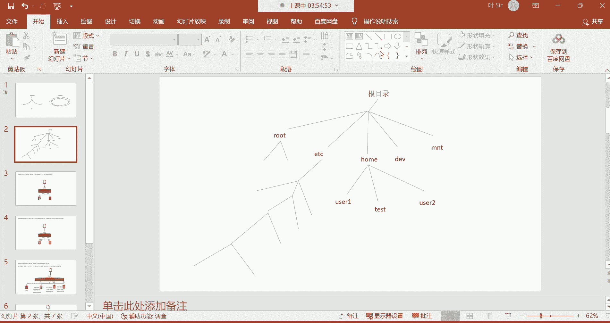

然后这个笔记哈，我先把这删掉哈，这个笔记。😊，我会上传到我们以前的那个网盘里边。啊，笔记软件大礼包啊。这个笔记软件呢。

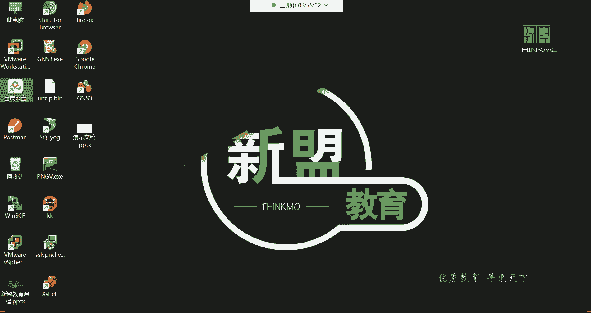

在哪儿呢哈，一会儿我给你们找一找哈。😊。

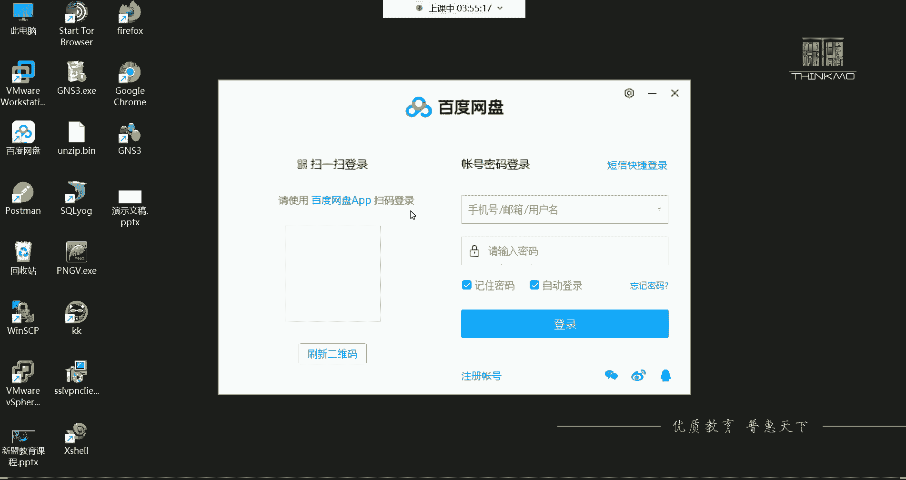

这个笔记软件在这个各种软件商店里面都有啊，各种软件商店里面都有。

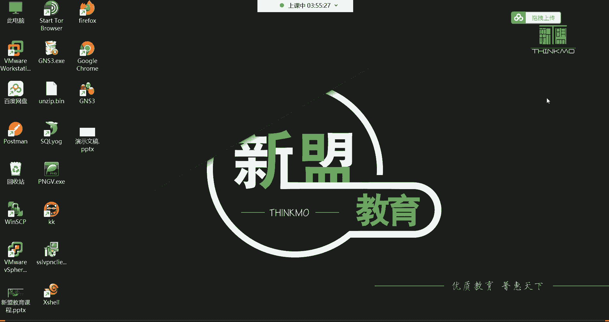

呃，学完3分之1的课程就找不到工作了怎么办？那就先工作呗，然后边工作边学习呗，也不影响啊，是吧？

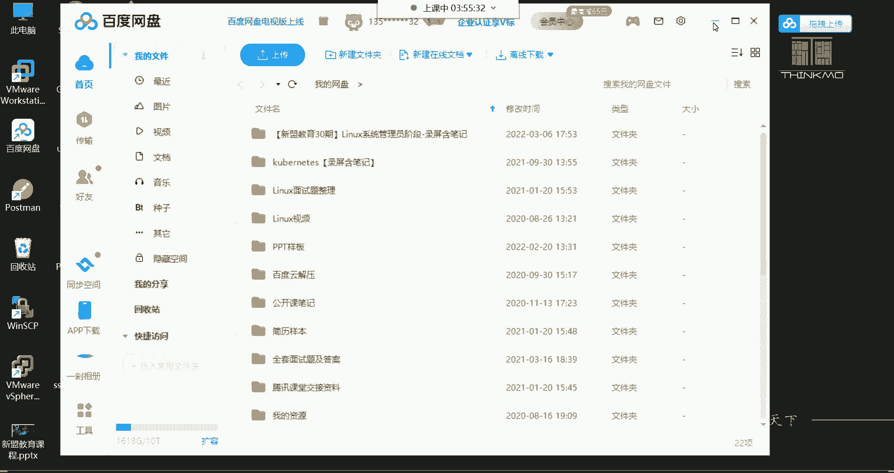

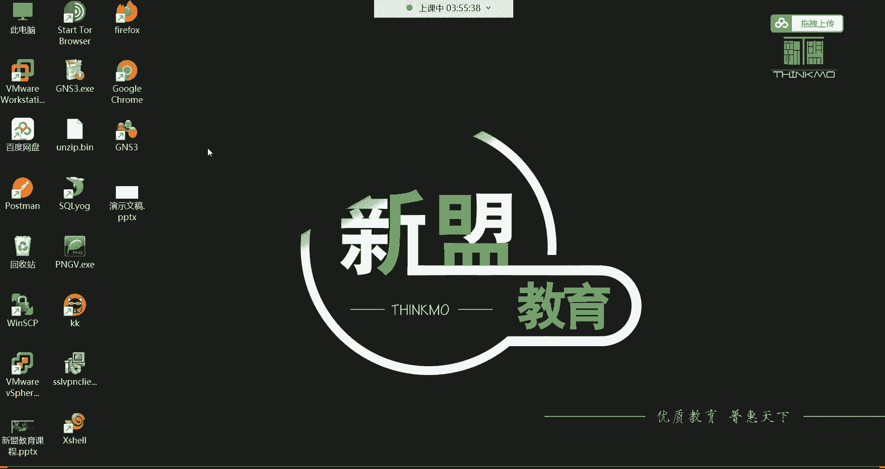

那你就属于带薪学习了，这还不好吗？嗯，我给你们找找哈，我看在VIP大礼包里面有没有我们这个。😊，像。K。啊，没有那个笔记软件是吧？啊，没有笔记软件。这里边啊。你们看哈这边这里边有一个什么呢？有一个叫做。

😊，lininux系统常见的英文单词表。知道这个干什么用的吗？常见的英文单词表，就是我们在学习这个系统的时候。😡，你可能会遇到什么呢？遇到一些这个单词啊，这单词你可能这个不理解。比如说你的英语不好。

你不知道这单词什么意思是吧？😊，这个表里边就是。啊，这是我们在整个运维的学习当中，遇到一些常见的单词，以以及它的中文的解释啊，其实这就是常见的英文单词表。看到了吗？就是每个单词啊代表是什么意思？😊，啊。

这是所谓的单词表看了，什么stop是停止，看到了吗？啊，re star代表着重启之类的。啊，反正我觉得现在这简单的单词大家应该都都能认识，是不是都能认识。😡，好，然后笔记软件等一下哈。

我先说说我们看看这波是咱们系统包的一个这个录屏跟笔记的一个存放位置吗？这里边我把笔记放在哪儿呢？咱们这个整个。系统管理员阶段用到的笔记我都会上传到这个里边。看到了吗？这里边就是。系统班。

这里边有一个叫RHCSA阶段的笔记，看了吗？HCSA阶段哈，我给它上传上去，这个是原码的笔记。😊，这是原码笔记哈，就是你们可以像我一样，比如说自己对这个笔记呢下载下来以后，自己可以加一些修改啊。

源码嘛啊原码都给你了。然后第二个是什么呢？第二个是这种PDF版。😊，PHCIPDF版的。这个PDF版呢是可以放到手机里边，你把这个东西啊就是放到保存到你的手机里边。然后呢，没事呢，记不住的时候。

用手机去看一看咱们的笔记，能理解吧？PDF版的非也非常的清晰。看到吗？非常的清晰啊，在这里边，但是你下载到你的手机里面看就非常清晰了。由于这个百度网盘啊，它有些问题。😊，看了吗？这里面哈。

这是我们前面讲过的都在这儿。OK都在这里边哈。😊，看到了吗？哎，所以到时候呢你们没事的时候，比如说坐车的时候感觉无聊了是吧，把手机拿过来可以看一看这个笔记啊，复习也比较方便啊。

这个到时候呢有什么自己一些需求。比如说哎呀，我自己想给这个笔记里面加一些内容啊，变成一份自己的笔记，那你就改这个啊，这是MD格式的那这个MD格式的笔记用哪个软件打开呢？这个软件的下载地址。😊。

你跑到任何一个软件商店都可以下。在这里边搜叫typeshop。抬不着。看到了吗？然后这里边有1个64位的。😊，点进去。就下载这个就可以了哈。😊，选择普通下载。普通下载哈，别选高速。

高速下载会有一些捆绑软件。然后这个地址我给他放到哪儿呢？我给他放到我们的群里面。看好这个群里边群公告里边。我给你发布上去。然后呢，我发布一个新的公告，这里边就是。拍不照。笔记。软件下载。链接。好。

看了吗？发布一下。就是你们如果没有这个笔记软件的话，就从这个地址把这个笔记给它下载下来。那如果有的同学可能是HCE阶段呢，你们是在这个群里面是吧？啊，你们如果在这个HCE阶段群里面。

这里面就有这里面就有哈。😊，在下边。看到了吗？嗯。我这翻一翻哈。笔记软件的。嗯，笔记软件下载链接，我记得我放那个群公告里面了。这儿哈那课堂笔记下载链接，我再重新编辑一下啊，T不上。笔记软件。下载链接。

OK一样的哈一样的。都在里面。然后如果是HCSA的话呢，这里边也有啊，都在你们这个群公告里边。看到吗？笔记软件下载链接都在这里边哈。O。然后到时候呢你们到时候把这个软件下载到电脑里边。

就可以用这个软件打开我们的这个什么呢？课堂的这个MD格式的笔记了。

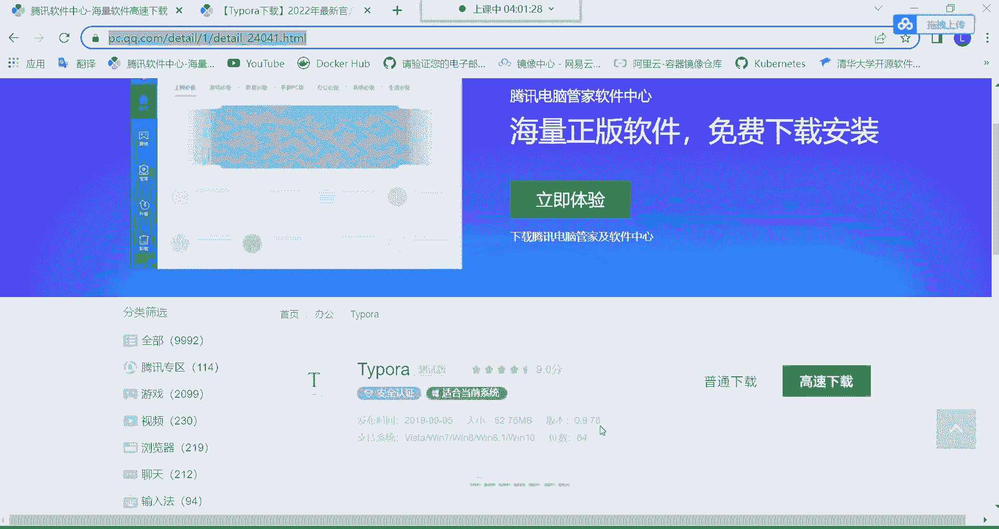

好吧。呃，然后一会儿呢我再新建一个文件夹，这是我们这个37啊第。呃，算是第二节课吧啊，第二节课的一个文件夹，到时候我会把录屏放到我们这个。第二天的文件夹里边好吧，然后。😊，这个链接是不是都在咱们群公告。

是不是这个链接都在群公告里面，到时候你们就等我发群通知，我会告诉你们，我说录屏笔记已上传，到时候你们可以去呃这个链接啊就去下载就可以了啊，保存到自己的网盘里边。

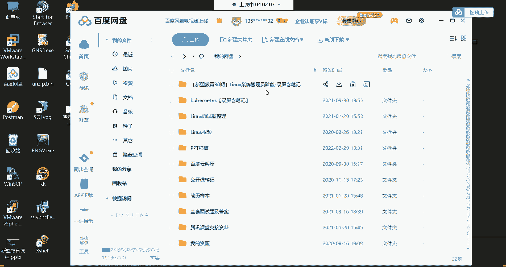

行了，那。

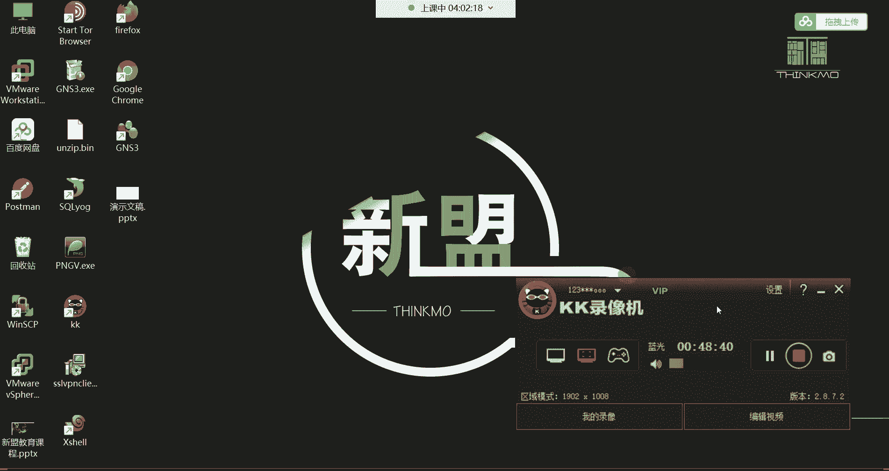

啊，这是。我们今天的内容就完事儿了。