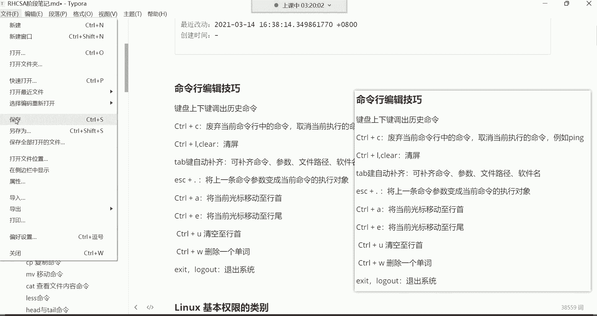
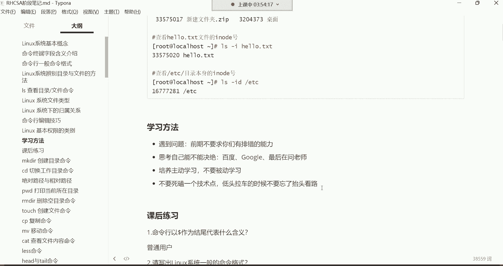
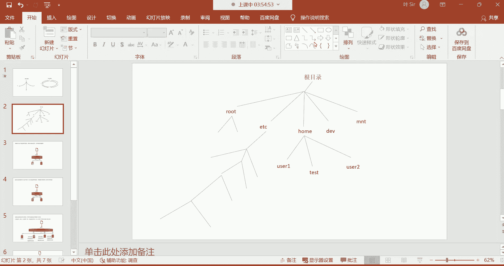
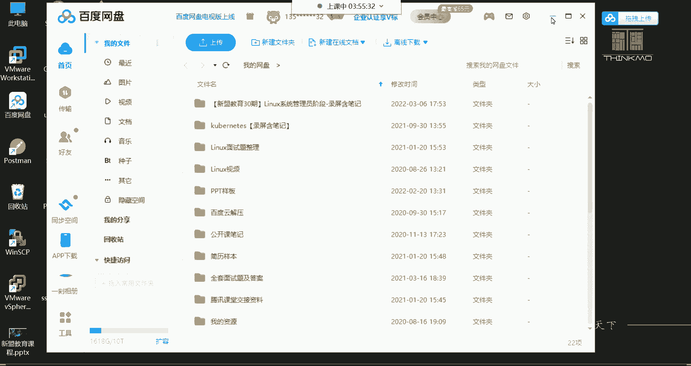
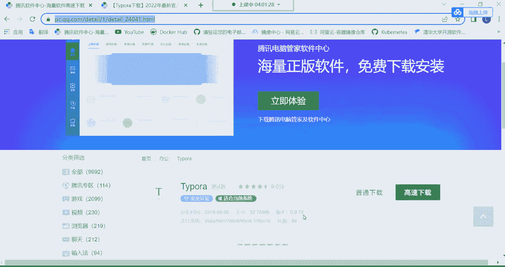
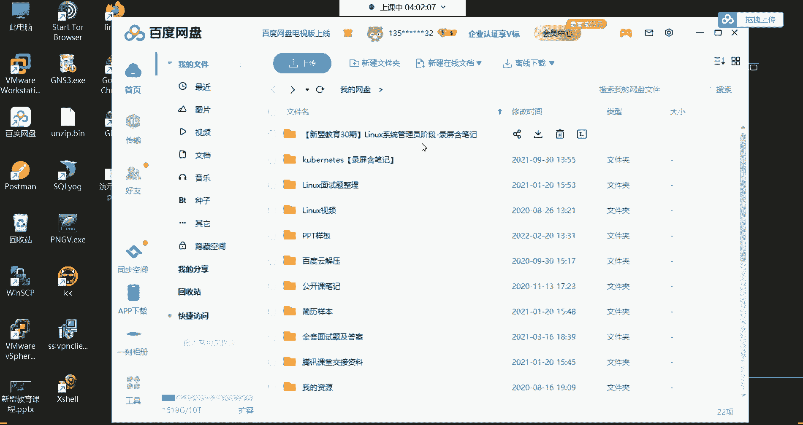

# Linux运维入门：P6：ls查看文件命令、命令行编辑技巧、学习方法


## 概述

在本节课中，我们将学习Linux系统中查看文件的基础命令`ls`，掌握一系列高效的命令行编辑技巧，并了解一些有效的学习方法，帮助你更顺畅地开始Linux运维学习之旅。

---

## 命令行编辑技巧 🚀




上一节我们介绍了命令行的基本格式，本节中我们来看看如何通过一些快捷操作来提升命令行的使用效率。

### 调出历史命令

键盘的上下方向键可以调出曾经执行过的命令。按上方向键可以查看并重新执行上一条命令，一直按可以向上翻阅最多1000条历史记录。下方向键则用于向下翻阅。通常我们只翻阅最近的三条命令，因为翻阅太多不如直接重新输入命令。

### 废弃或取消命令

`Ctrl + C` 组合键有两个主要功能：
1.  废弃当前命令行中已输入但未执行的命令。
2.  取消当前正在执行的命令（例如，终止一个长时间运行的 `ping` 命令）。

### 清屏

`Ctrl + L` 组合键可以快速清空当前终端屏幕，效果与输入 `clear` 命令相同。

### 自动补齐

`Tab` 键是一个非常高效的工具，它可以自动补齐命令、文件路径或软件包名。

**工作原理**：
*   按一次 `Tab` 键：如果只有一个可能的匹配项，系统会自动补齐。
*   按两次 `Tab` 键：如果有多个可能的匹配项，系统会列出所有选项供你选择。

**应用场景**：主要用于补齐**长文件路径**和**复杂的软件包名**。

**示例**：要进入路径 `/etc/sysconfig/network-scripts/`，可以这样操作：
```bash
cd /etc/sys<Tab><Tab>   # 列出所有以‘sys’开头的目录
cd /etc/sysconfig/      # 手动输入‘config’后按Tab补齐斜杠
cd /etc/sysconfig/net<Tab><Tab> # 列出所有以‘net’开头的目录
cd /etc/sysconfig/network-<Tab> # 自动补齐‘scripts/’
```

### 调取上条命令参数

`Esc + .`（先按Esc键，再按点号）可以快速将上一条命令的最后一个参数插入到当前光标位置。这在需要重复使用长路径或文件名时非常方便。


**示例**：
```bash
ls -l /etc/sysconfig/network-scripts/ifcfg-ens32  # 查看文件详情
cat <Esc>+<.>                                       # 自动填入‘/etc/.../ifcfg-ens32’，然后查看文件内容
```

### 其他编辑快捷键

以下是其他一些有用的快捷键，了解即可：
*   `Ctrl + A`：将光标移动到行首。
*   `Ctrl + E`：将光标移动到行尾。
*   `Ctrl + U`：清空从光标位置到行首的所有内容。
*   `Ctrl + W`：删除光标前的一个单词（以空格为分隔）。

### 退出系统

可以使用以下两条命令之一来退出当前登录的会话：
*   `exit`
*   `logout`

---

## 核心命令回顾与学习方法 📚

上一节我们掌握了许多快捷操作，本节我们来总结需要重点掌握的知识点，并探讨高效的学习方法。

### 本节课重点总结

以下是本节课你需要重点掌握和了解的内容：

**需要掌握的核心内容**：
1.  **命令终端字段含义**：理解命令行提示符中每一部分的含义。
2.  **辨别目录与文件的方法**：主要通过颜色区分，蓝色通常代表目录，白色通常代表普通文件。
3.  **`ls` 命令及其常用选项**：
    *   `ls -l`：以长格式显示文件详细信息。
    *   `ls -a`：显示所有文件，包括隐藏文件（以点`.`开头）。
    *   `ls -h`：以人性化的单位（K, M, G）显示文件大小。
4.  **命令行编辑技巧**：
    *   上下键调历史命令。
    *   `Ctrl + C` 取消命令。
    *   `Ctrl + L` 清屏。
    *   `Tab` 键自动补齐。
    *   `Esc + .` 调取上条命令参数。
    *   `exit` 退出系统。

**需要了解的内容**：
1.  **系统基本概念**：如多用户、多任务、根目录等，理解即可。
2.  **命令行格式**：知道命令、选项、参数的概念，灵活运用。
3.  **文件类型与归属关系**：后续会有专门章节讲解。
4.  **其他快捷键**：如 `Ctrl+A/E/U/W`，知道其功能，不必强记。

### 高效学习方法建议

学习过程中遇到问题是常态，以下方法可以帮助你更好地成长：




**1. 合理利用资源解决问题**：
*   **初期**：遇到问题可直接在课程群内提问，有专门的答疑老师（如磊神老师）和班主任（木木老师）提供帮助。
*   **后期**：应主动培养独立解决问题的能力。尝试先通过搜索引擎（百度、谷歌）寻找答案。**如何精准地描述问题**是搜索的关键技能。




**2. 保持主动学习的态度**：
*   不要局限于课堂所教。例如，学了 `ls` 命令后，可以主动查看手册 (`man ls`) 了解其他选项。
*   学习是投资。集中精力投入5个半月的系统学习，为未来的职业发展打下坚实基础，这份付出是值得的。




**3. 避免钻牛角尖**：
*   遇到当前阶段无法解决的难题，可以先记录下来，继续后续的学习。很多时候，前面的问题会在学习后面的知识后豁然开朗。
*   “低头拉车，也要抬头看路”，不要因为一个难点卡住整个学习进度。

**4. 利用好学习资料**：
*   课程录屏、笔记（提供源码MD格式和PDF格式）会上传至网盘，群公告会发布链接。
*   可以使用 `Typora` 等软件打开和编辑MD格式的笔记，打造属于自己的知识库。
*   利用碎片时间（如通勤时）通过手机复习PDF笔记。

---

## 总结






本节课我们一起学习了Linux中查看文件的`ls`命令及其常用选项，掌握了一系列能极大提升操作效率的命令行编辑技巧，并探讨了在运维学习道路上如何采用正确的方法，保持积极心态，高效利用资源。记住，扎实的基础和良好的学习习惯是通往熟练运维工程师的必经之路。下节课我们将开始学习更多的Linux核心命令。