# Linux运维入门：第1章：云计算与Linux系统介绍

在本节课中，我们将要学习云计算的基本概念、Linux系统的起源与核心知识，以及它们在现代IT行业中的角色和关系。通过本课，你将清晰地理解云计算是什么、Linux是什么，以及它们如何共同构成了当今互联网服务的基础。

## 什么是云计算？☁️

云计算并非一个虚无缥缈的概念。简单来说，**云计算的本质是网络资源的出租**。

这类似于生活中的租房或去网吧上网。云厂商（如阿里云、亚马逊AWS）投入巨资建设大型数据中心，购置服务器、网络、电力等基础设施。用户无需自己购买和维护这些昂贵的物理设备，只需按需租用云厂商提供的虚拟资源（如云主机），并按使用量或包年包月付费即可。

这种模式极大地降低了企业和个人使用计算资源的门槛和成本。

## 云计算的服务模式

云计算主要提供三种服务模式，以满足不同用户的需求。

以下是三种主要的云计算服务模式：

1.  **IaaS（基础设施即服务）**
    *   **含义**：为用户提供最基础的计算资源，如虚拟的CPU、内存、硬盘和网络。
    *   **类比**：就像你买了一台“裸机”电脑，只有硬件，需要自己安装操作系统和所有软件。
    *   **用户责任**：用户需要自己管理操作系统、中间件、运行时环境和应用程序。

2.  **PaaS（平台即服务）**
    *   **含义**：在IaaS的基础上，为用户提供一个现成的平台环境，如特定的开发框架、数据库或运维监控工具。
    *   **类比**：就像买了一台预装了Windows操作系统的电脑，你可以在上面直接安装和使用各种应用软件。
    *   **用户责任**：用户只需专注于自己的应用程序开发和数据管理，无需操心底层平台和环境。

3.  **SaaS（软件即服务）**
    *   **含义**：为用户提供完整的、可直接使用的软件服务。云厂商负责软件的前期部署、后期维护和所有技术支持。
    *   **类比**：就像入住五星级酒店，你只需“拎包入住”，享受服务，所有清洁、维护工作都由酒店完成。
    *   **用户责任**：用户只需使用软件，其他一切均由服务提供商负责。

上一节我们介绍了云计算的核心概念，本节中我们来看看另一个基石——Linux系统。

## 什么是Linux？🐧

Linux是一个**类Unix的操作系统内核**。内核是计算机系统的核心，如同人的大脑，负责管理计算机的所有硬件（如CPU、内存、磁盘）和软件资源（如进程、文件系统）。

*   **读音**：`/ˈlɪnəks/` (林纳克斯) 或 `/ˈlɪnʊks/` (李纽克斯) 均可，无严格标准。
*   **起源**：由林纳斯·托瓦兹于1991年开发。它继承了Unix的许多特性，但关键区别在于Linux是**免费且开源**的。
*   **吉祥物**：一只名为Tux的企鹅。选择企鹅象征着Linux像南极一样，不属于任何商业公司，是全世界共享的自由软件。

一个完整的Linux操作系统发行版，是由Linux内核加上GNU项目提供的众多软件工具共同组成的，因此也常被称为“GNU/Linux”。

## 常见的Linux发行版

基于Linux内核，全球开发了数百种不同的操作系统发行版，适用于各种场景。

以下是几个主流的Linux发行版分类：

*   **Red Hat Enterprise Linux (RHEL)**
    *   **特点**：红帽公司推出的**企业级收费**发行版。用户支付的是**服务和支持费用**，可获得包括安全更新、补丁和技术支持在内的专业服务。
    *   **应用领域**：广泛应用于对稳定性和服务有高要求的企业服务器领域。

*   **CentOS**
    *   **特点**：RHEL的**社区免费克隆版**。它移除RHEL的商标和专有软件，但保持高度的二进制兼容性。**CentOS Stream**是其滚动更新版本。
    *   **应用领域**：同样用于服务器领域，是许多企业和个人学习、搭建服务的首选。

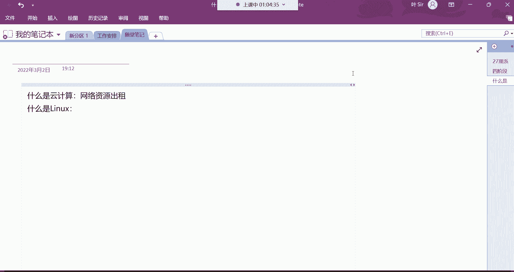

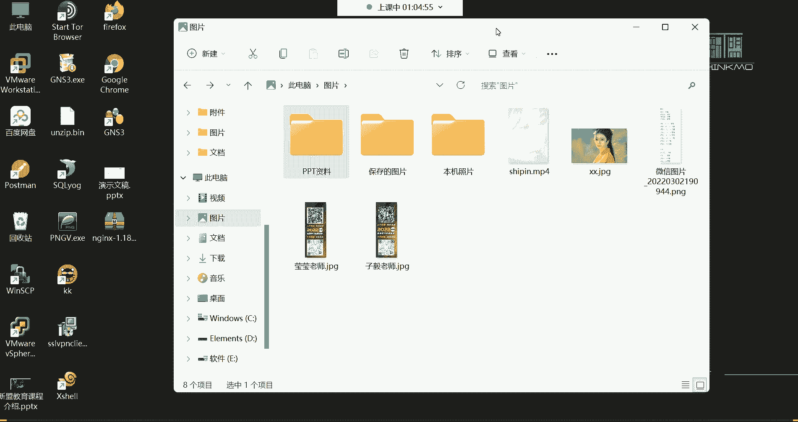

*   **Fedora**
    *   **特点**：红帽赞助的社区发行版，以**技术前沿**著称。许多新特性会先在Fedora上测试，稳定后再引入RHEL。
    *   **应用领域**：适合开发者和技术爱好者体验最新技术。

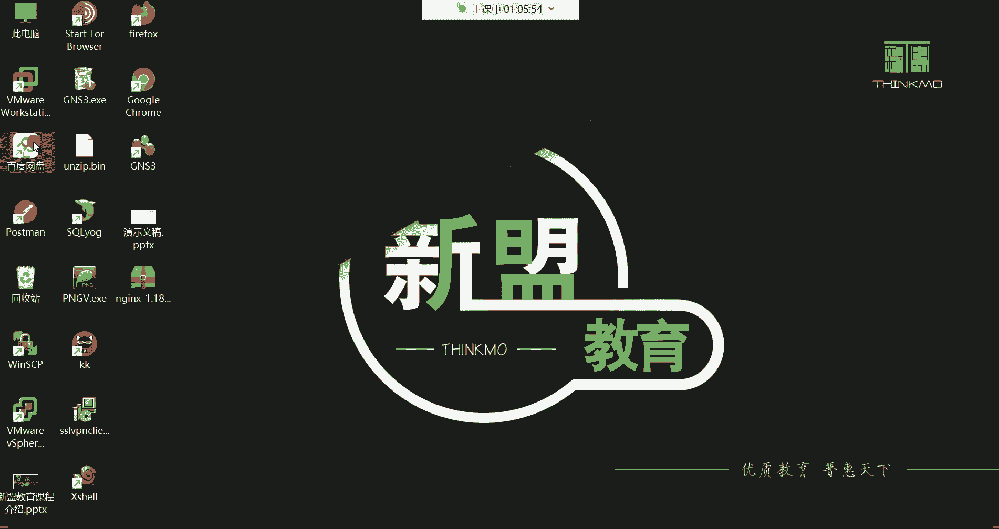

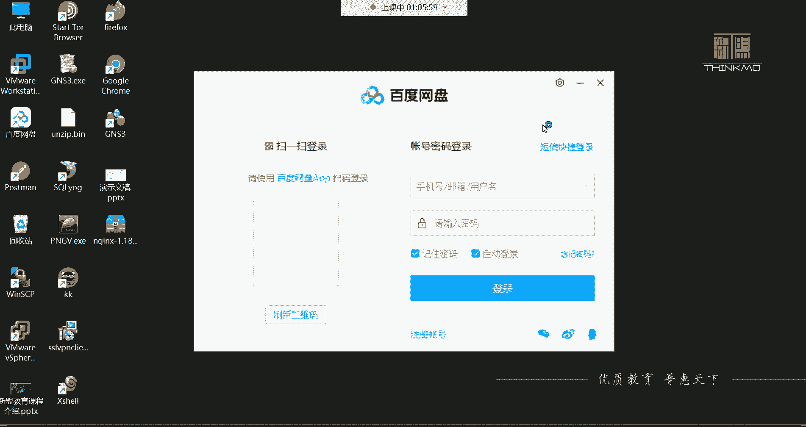

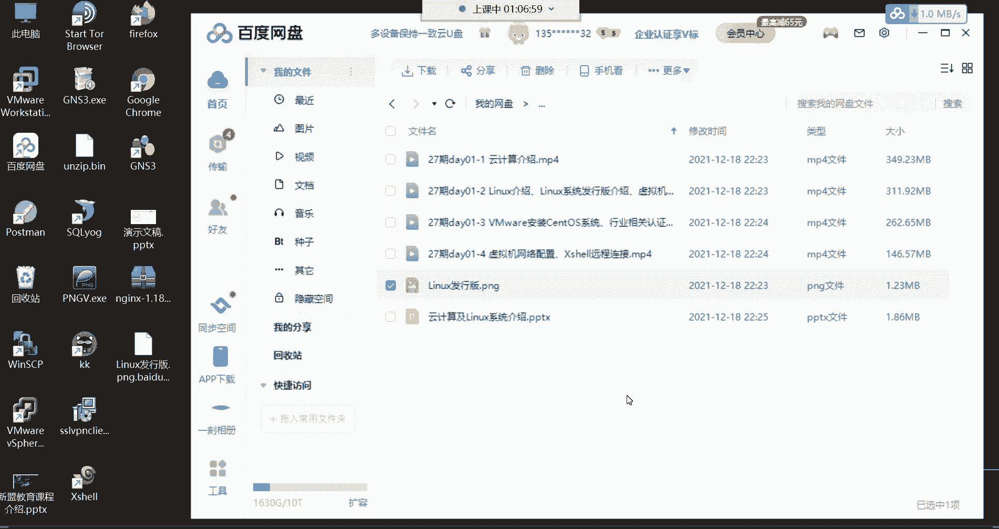

*   **Ubuntu**
    *   **特点**：基于Debian，拥有**极其友好的桌面环境**，易于上手。
    *   **应用领域**：在个人桌面、开发环境和嵌入式领域非常流行。但其桌面环境消耗资源较多，**较少用于生产环境的服务器**。

*   **openSUSE / Debian**
    *   **特点**：都是历史悠久的社区发行版，拥有强大的软件包管理系统和活跃的社区。
    *   **应用领域**：既可用于桌面，也可用于服务器。在欧洲，openSUSE有较高的占有率。

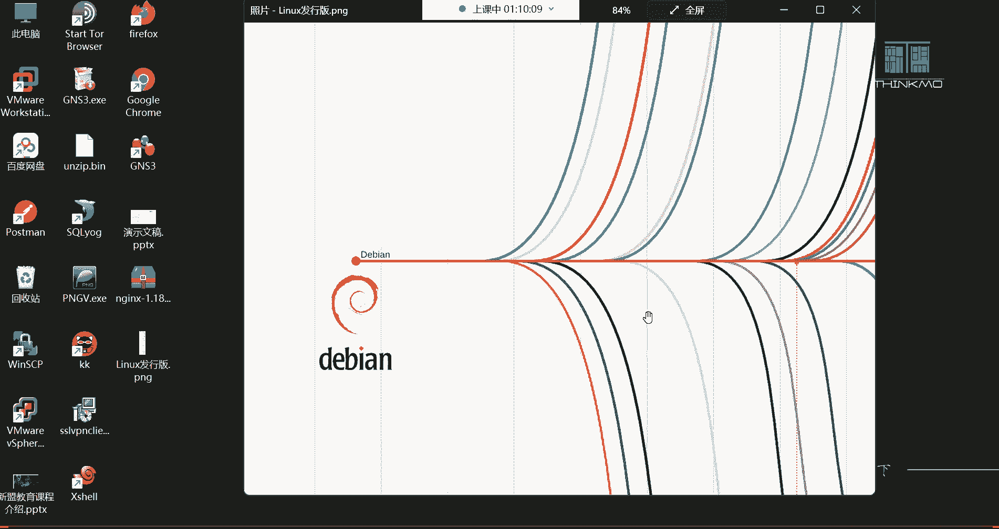

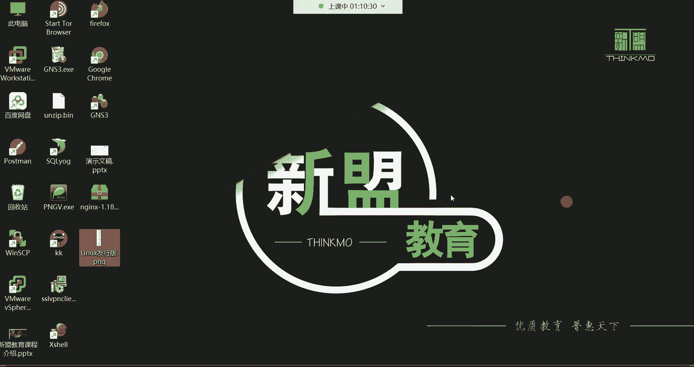

对于运维工作，我们主要学习和使用像**CentOS/RHEL**这样的服务器发行版。它们通常不安装图形桌面，绝大部分管理工作通过**命令行**完成，这样能最大程度保证服务器的**稳定性**和**资源利用效率**。

## 云计算与Linux的关系

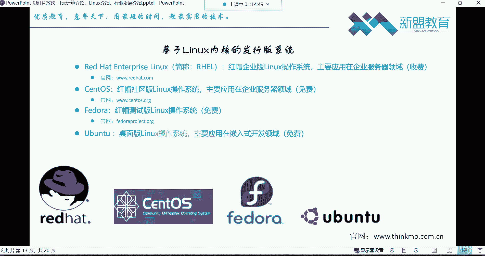

云计算和Linux是相辅相成的。绝大多数云服务（如阿里云的ECS云主机）的底层操作系统都是Linux。当你租用一台云主机时，通常就是在租用一台运行着CentOS、Ubuntu Server等Linux系统的虚拟机。

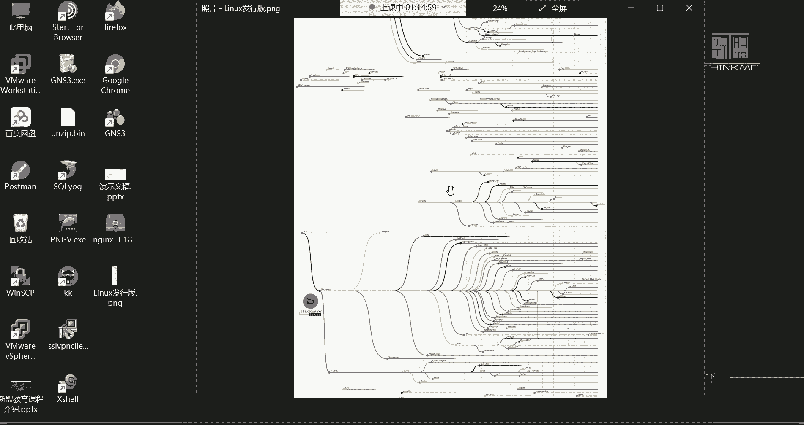

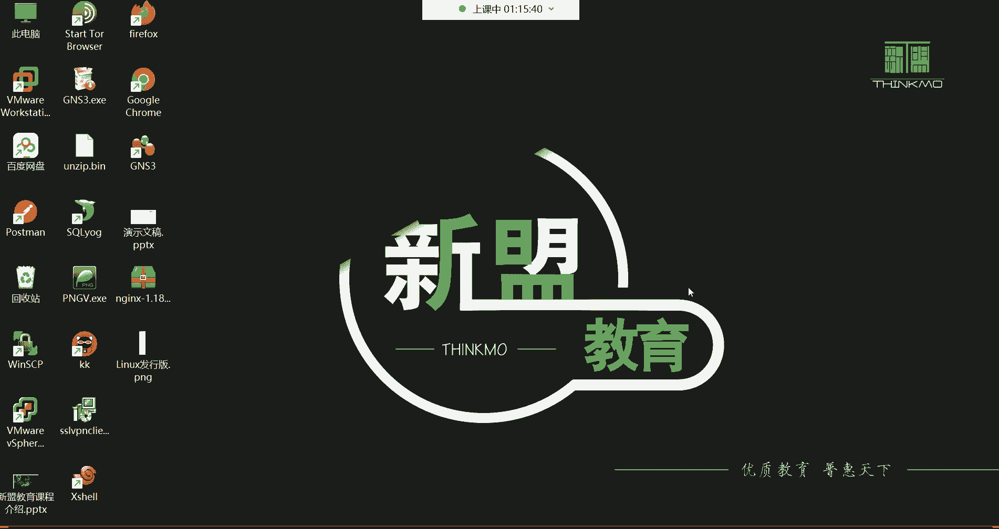

因此，学习Linux系统管理，是掌握云计算运维技能的基石。无论是管理本地服务器还是云上资源，Linux命令行操作都是核心能力。

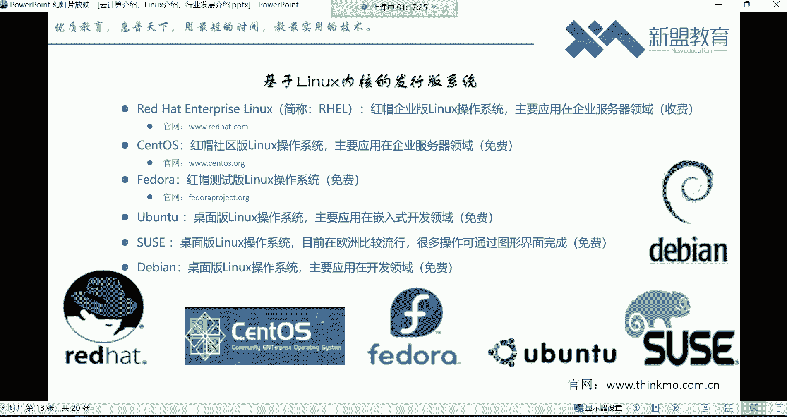

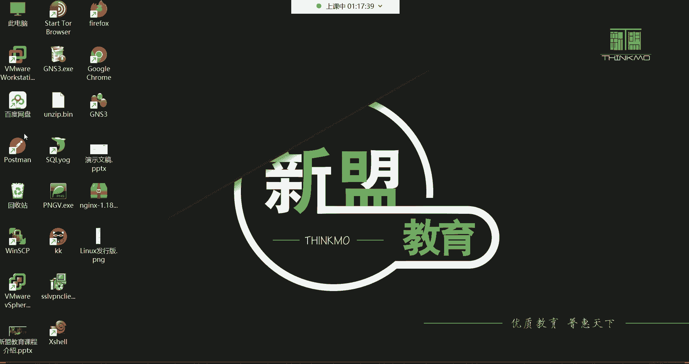

---

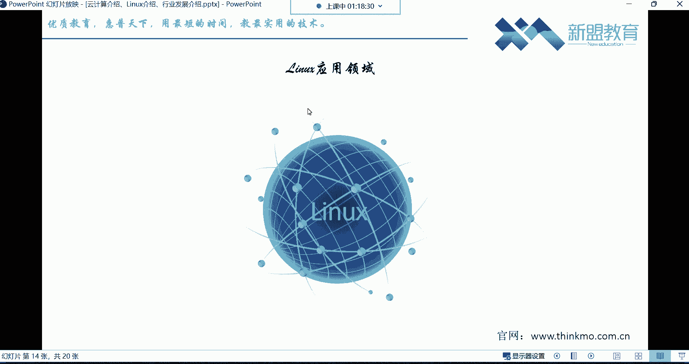

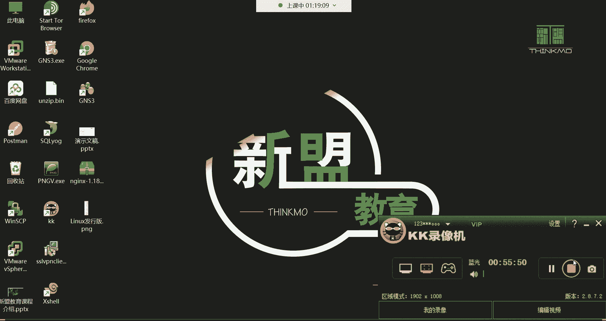

本节课中我们一起学习了云计算的定义与三种服务模式，了解了Linux内核的起源、特点以及主流发行版的区别，并厘清了云计算与Linux之间密不可分的关系。掌握这些基础知识，将为你后续深入学习Linux运维和云计算技术打下坚实的根基。