# Linux运维进阶：P20：常用特殊符号与grep文件内容过滤 📚

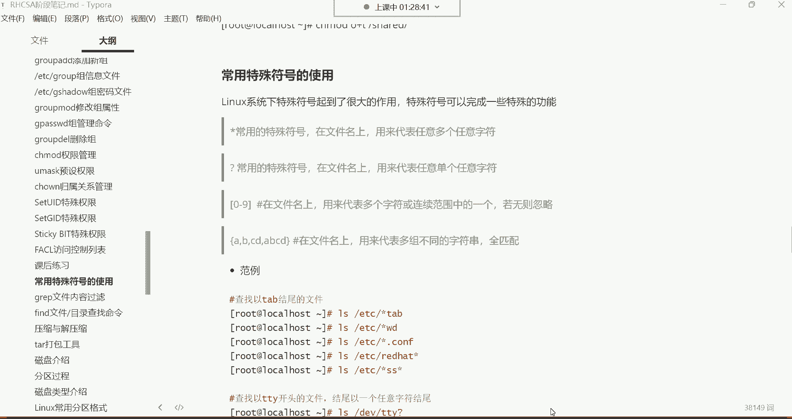

在本节课中，我们将学习Linux系统中几个常用的特殊符号（通配符）以及`grep`命令。特殊符号能帮助我们高效地匹配文件名，而`grep`命令则用于在文件内容中快速查找特定字符串。掌握它们是提升Linux操作效率的关键。

## 特殊符号（通配符）🔤

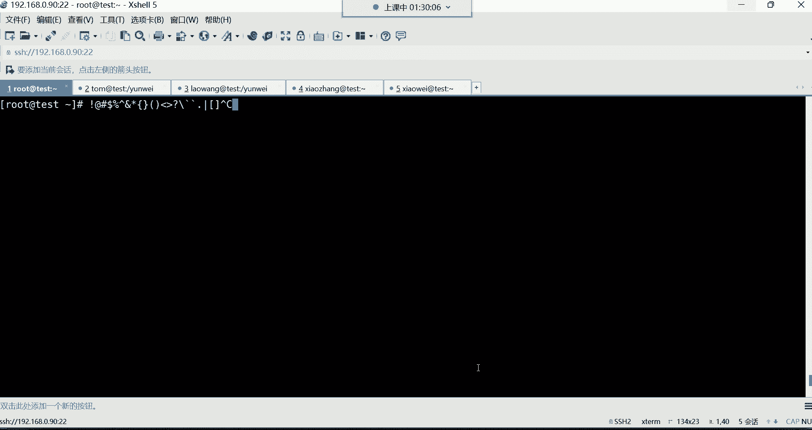

在Linux系统中，键盘上的许多符号（如`!`、`@`、`#`、`$`、`%`、`^`、`&`、`*`、`()`、`{}`、`<>`、`?`、`/`、`\`、`` ` ``、`.`等）都具有特殊功能，被称为特殊符号。本节我们重点学习四个在文件名匹配中常用的符号：`*`、`{}`、`?`和`[]`。

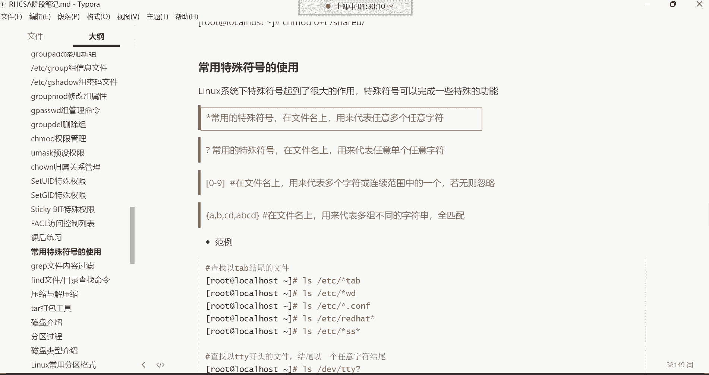

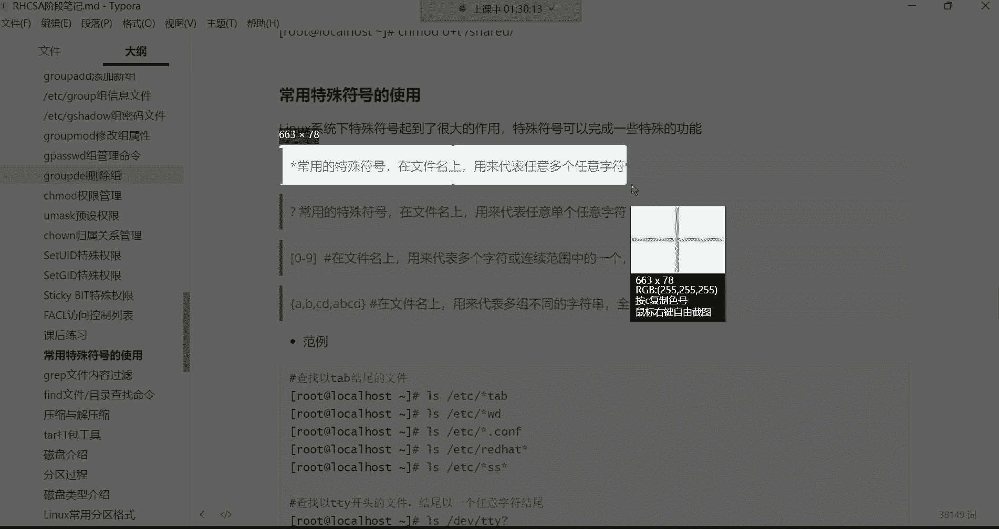

### 星号 `*` ✨

星号 `*` 用于在文件名中代表**任意多个任意字符**。这意味着它可以匹配任何长度、由任何字符（字母、数字、符号等）组成的字符串。

**公式：** `*` 匹配零个或多个任意字符。

它常被用于文件搜索或批量操作。例如：
*   `ls /etc/pass*`：列出`/etc`目录下所有以`pass`开头的文件。
*   `cp /var/log/*.log /opt`：将`/var/log`目录下所有以`.log`结尾的文件复制到`/opt`目录。
*   `rm -rf /*`：这是一个危险命令，`*`匹配根目录下的所有内容，会导致系统被删除。

**示例：**
```bash
# 搜索/etc下以pass开头的文件
ls /etc/pass*

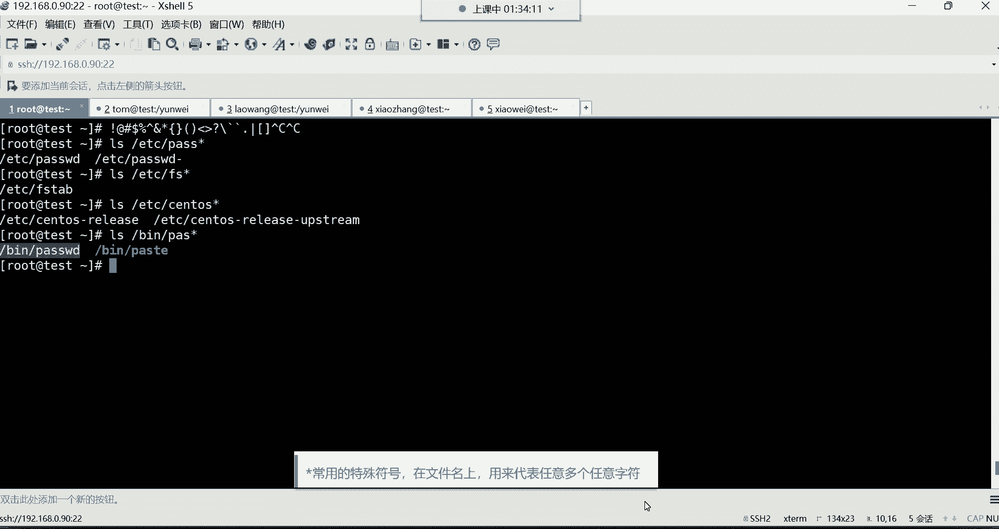

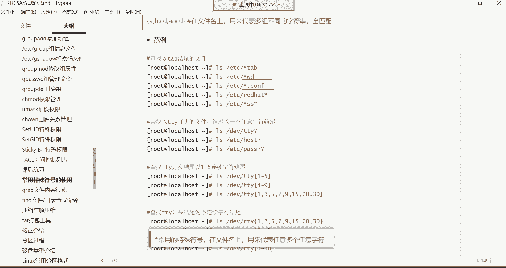

# 搜索/bin下以ps开头的文件
ls /bin/ps*
```
星号可以放在文件名开头、结尾或中间，非常灵活，是我们最常用的通配符。

### 问号 `?` ❓

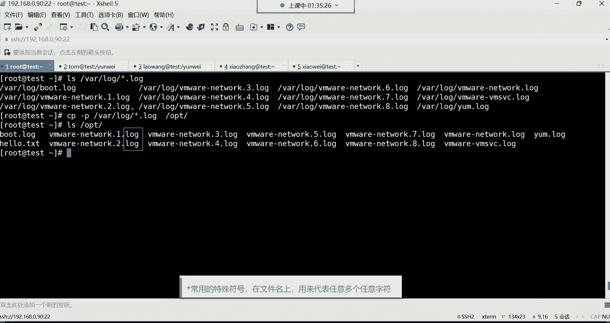

问号 `?` 用于在文件名中代表**任意单个字符**。它只匹配一个字符的位置，但该字符可以是任意内容。

**公式：** `?` 匹配一个任意字符。

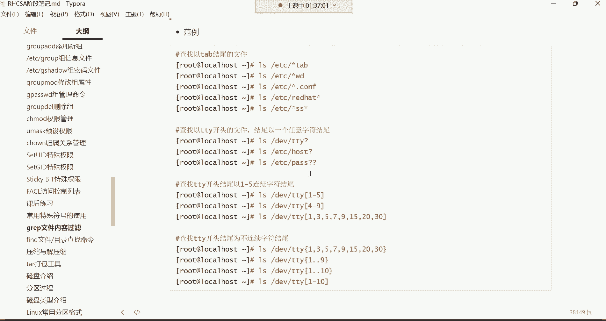

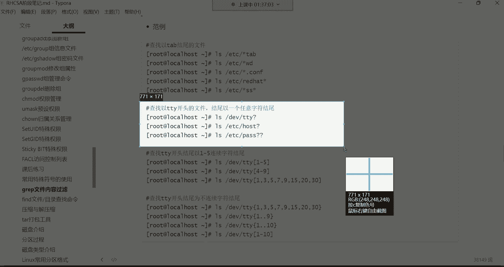

它通常用于匹配文件名长度固定但个别字符不确定的情况。例如，`ls /dev/tty?` 会列出`/dev`目录下像`tty0`、`tty1`、`ttyA`这样以`tty`开头且后面紧跟**一个字符**的设备文件。

**示例：**
```bash
# 搜索/dev下以tty开头，且后面紧跟两个字符的文件
ls /dev/tty??
```

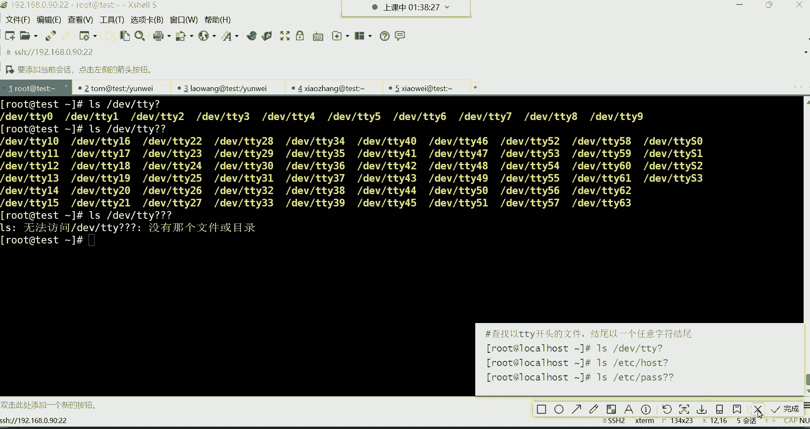

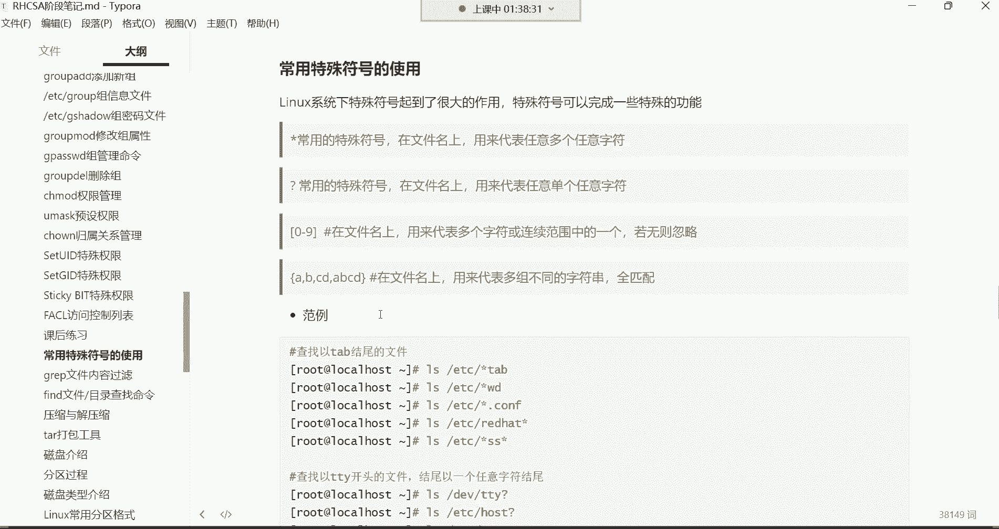

### 中括号 `[]` 🧮

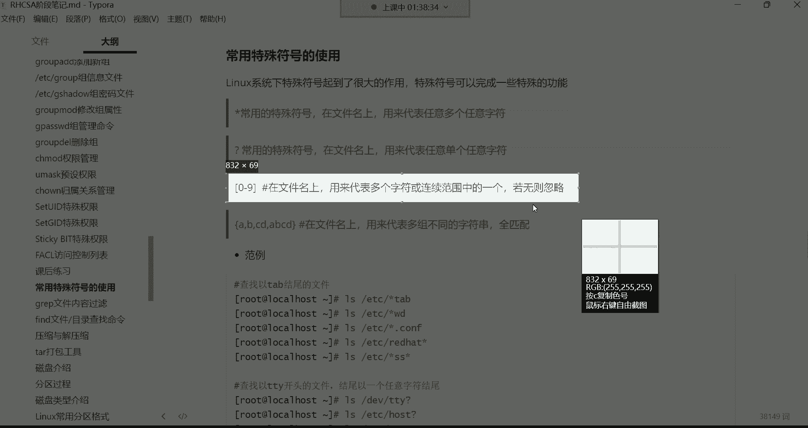

中括号 `[]` 用于匹配**括号内指定范围中的任意一个字符**。通常用于匹配数字或字母的连续范围。

**公式：** `[范围]` 匹配指定范围内的一个字符。

例如：
*   `[0-9]` 匹配任意一个数字。
*   `[a-z]` 匹配任意一个小写字母。
*   `[A-Z]` 匹配任意一个大写字母。
*   `[abc]` 匹配字符`a`、`b`或`c`中的任意一个。

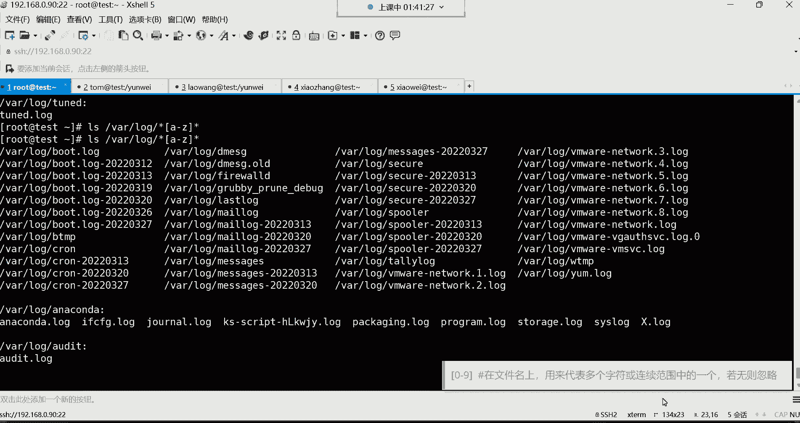

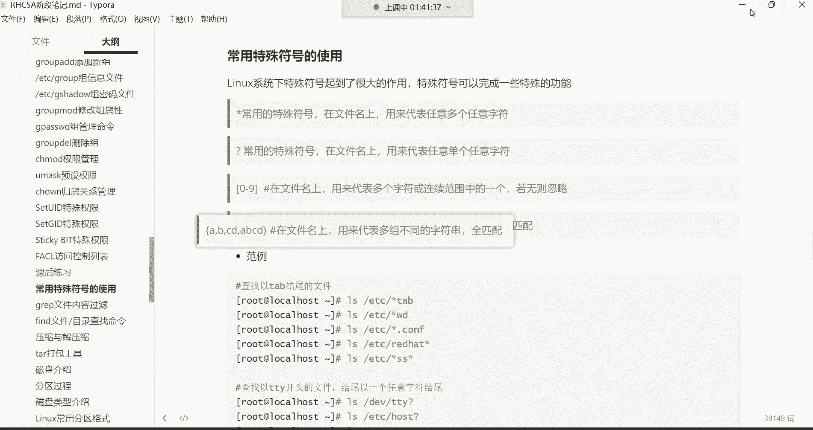

**示例：**
```bash
# 列出/var/log目录下文件名中包含数字的文件
ls /var/log/*[0-9]*

# 列出/dev目录下以tty开头，第二个字符是0到9之间数字的文件
ls /dev/tty[0-9]
```
需要注意的是，`[]`通常用于匹配单个字符的特定选择。

### 大括号 `{}` 🔢

大括号 `{}` 功能强大，常用于生成一个**序列**或匹配**多组不同的字符串**，尤其在处理数字序列时非常方便。

**公式：** `{起点..终点}` 生成从起点到终点的连续序列。

它最常见的用法是快速创建或删除一批有规律的文件。

**示例：**
```bash
# 在/opt目录下快速创建test1到test100这100个文件
touch /opt/test{1..100}

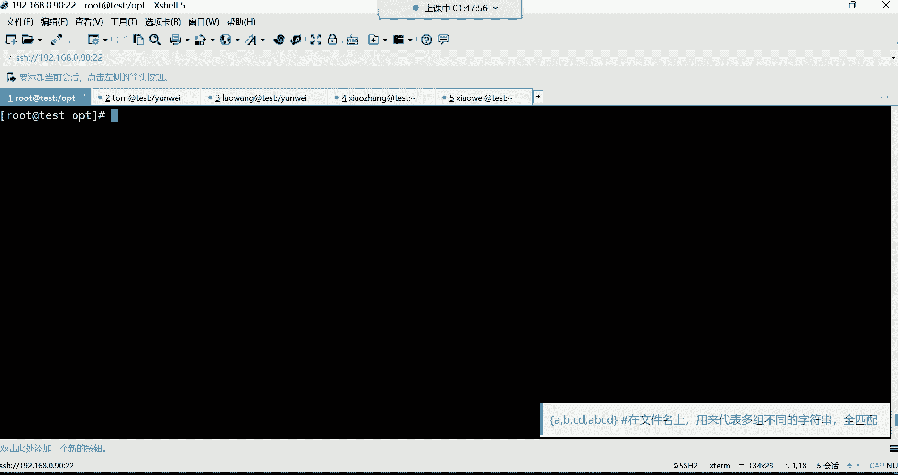

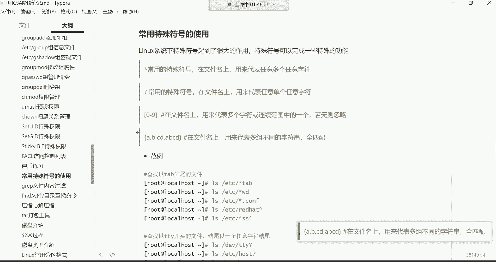

# 删除/opt目录下test1到test50这50个文件
rm -rf /opt/test{1..50}

# 匹配多个特定字符串（不连续）
ls /etc/*{a,b,c,d}*
```

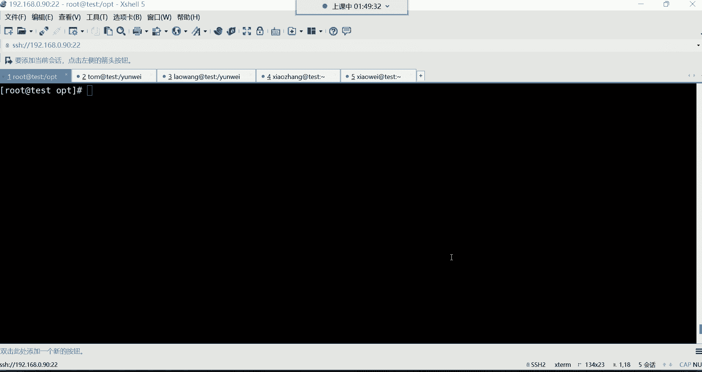

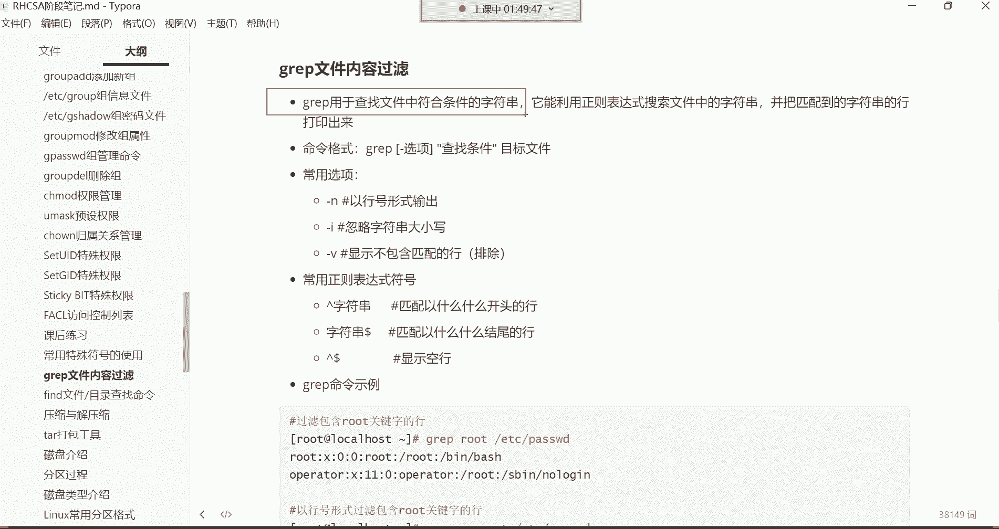

**总结：** 在以上四个特殊符号中，`*`（任意多个字符）和`{}`（生成序列）是**最常用**和**必须掌握**的。`?`（单个字符）和`[]`（字符范围）了解其用法即可。

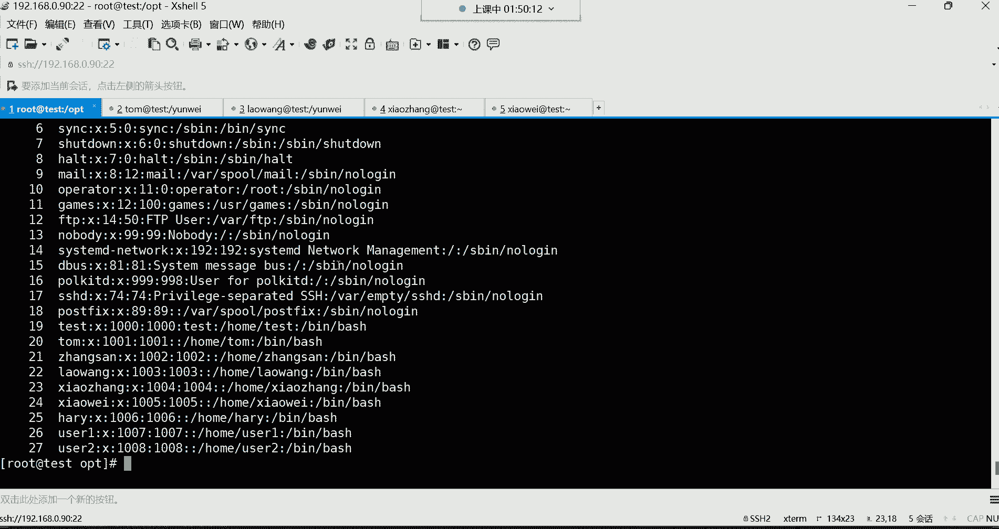

---

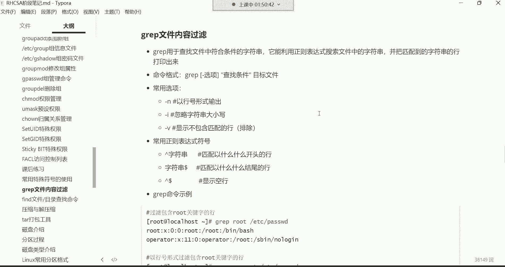

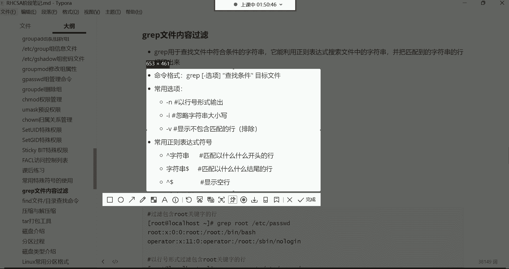

上一节我们学习了如何在文件名上进行匹配和筛选，接下来我们将目光转向文件内部，学习如何快速查找文件中的特定内容。

## grep文件内容过滤命令 🔍

`grep`命令用于在**一个或多个文件**中搜索并输出包含指定**字符串**或**模式**的行。当文件内容很多时，使用`grep`可以快速定位信息，无需人工逐行查看。

**基本语法：**
```bash
grep [选项] “搜索字符串” 文件名
```

### 基本用法

最直接的用法是指定要查找的字符串和目标文件。

**示例：**
```bash
# 在/etc/passwd文件中查找包含“tom”的行
grep "tom" /etc/passwd

# 显示行号（-n 选项）
grep -n "tom" /etc/passwd
```
执行后，`grep`只会输出包含“tom”的文本行，其他内容将被过滤掉。

### 常用选项

`grep`命令有一些实用的选项来增强其功能：

*   **`-n`**：显示匹配行在文件中的行号。
    ```bash
    grep -n "root" /etc/passwd
    ```

*   **`-i`**：忽略大小写进行匹配。
    ```bash
    # 匹配“user”、“USER”、“User”等
    grep -i "user" /etc/passwd
    ```

*   **`-v`**：反向选择，即输出**不包含**匹配字符串的所有行。
    ```bash
    # 输出/etc/passwd中不包含“root”的行
    grep -v "root" /etc/passwd
    ```

### 结合正则表达式

`grep`可以结合更强大的正则表达式符号进行精确匹配：

*   **`^`**：匹配以指定字符串**开头**的行。
    ```bash
    # 匹配以“root”开头的行
    grep "^root" /etc/passwd
    ```

*   **`$`**：匹配以指定字符串**结尾**的行。
    ```bash
    # 匹配以“/bin/bash”结尾的行（可登录系统的普通用户）
    grep "/bin/bash$" /etc/passwd
    # 匹配以“/sbin/nologin”结尾的行（不可登录系统的用户）
    grep "/sbin/nologin$" /etc/passwd
    ```

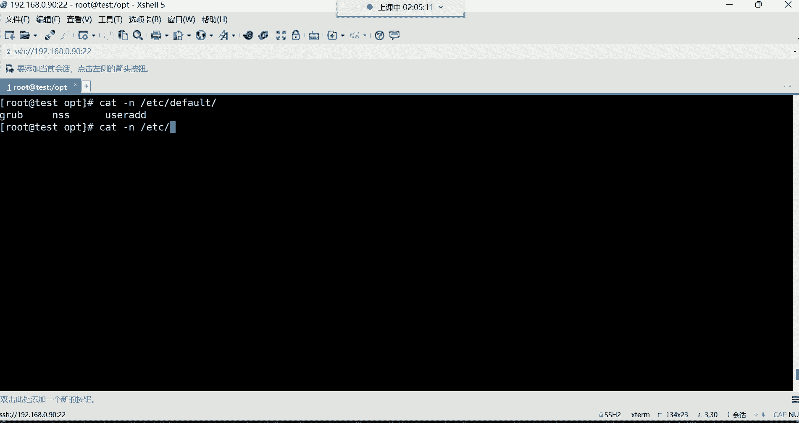

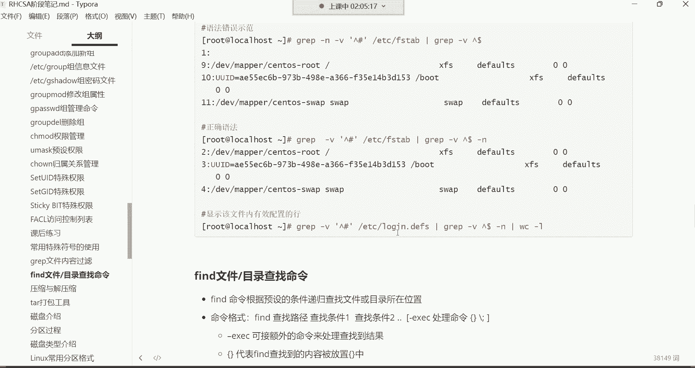

*   **`^$`**：匹配空行（开头紧接着结尾）。
    ```bash
    # 统计/etc/login.defs文件中的空行数
    grep "^$" /etc/login.defs | wc -l
    ```

### 高级组合应用

`grep`的强大之处在于可以与其他命令通过管道符`|`结合，对前一个命令的输出结果进行过滤。

**示例：**
```bash
# 查看内存信息，并只显示包含“Mem”的行
free -h | grep "Mem"

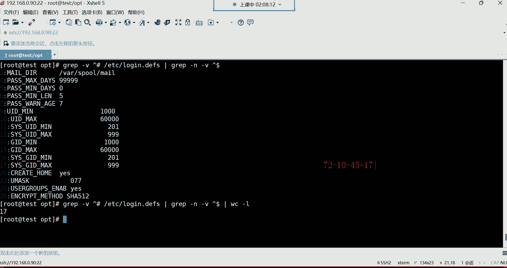

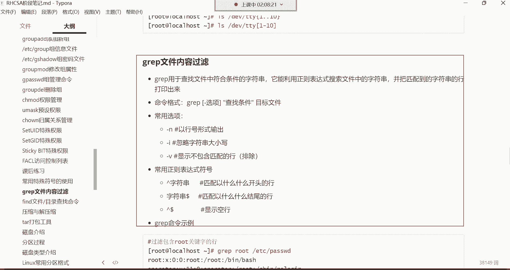

# 查看磁盘分区信息，并只显示包含“/dev/sda”的行
df -h | grep "/dev/sda"

# 复杂过滤：先排除注释行（以#开头），再排除空行，最后显示有效配置及行号
grep -v "^#" /etc/login.defs | grep -v "^$" | grep -n "."
```
通过管道串联多个`grep`命令，可以层层过滤，精确提取出所需信息。

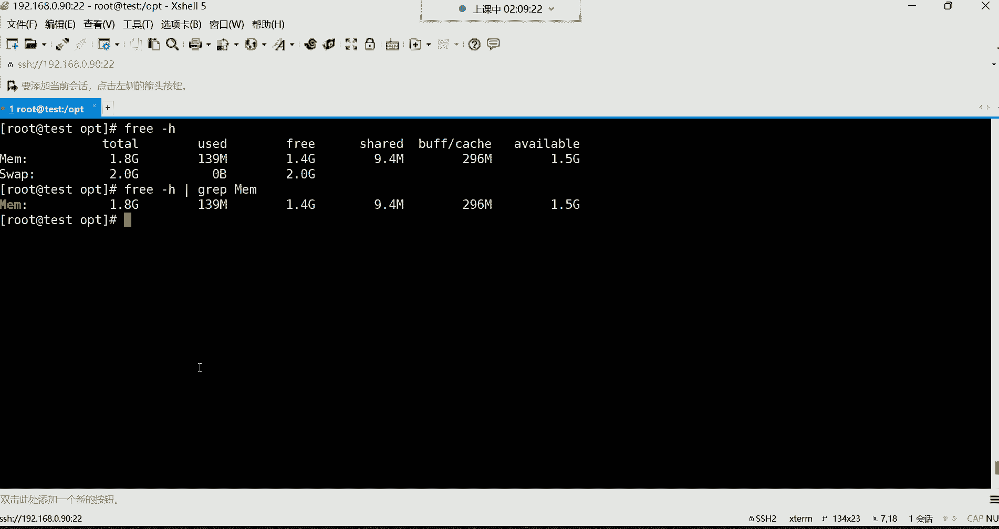

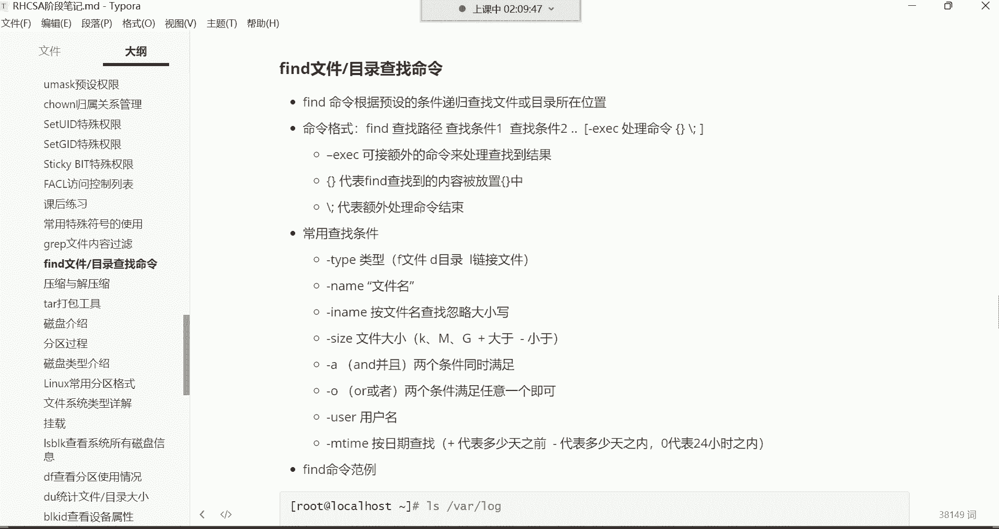

---

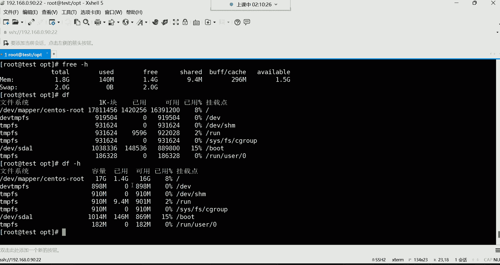

本节课中我们一起学习了Linux中常用的特殊符号和`grep`命令。
*   **特殊符号**：`*`和`{}`是核心，用于高效匹配和生成文件名序列。
*   **`grep`命令**：是文本内容过滤的利器，通过`-n`、`-i`、`-v`等选项以及`^`、`$`等正则符号，可以快速定位文件内的关键信息，并能与其他命令灵活组合使用。

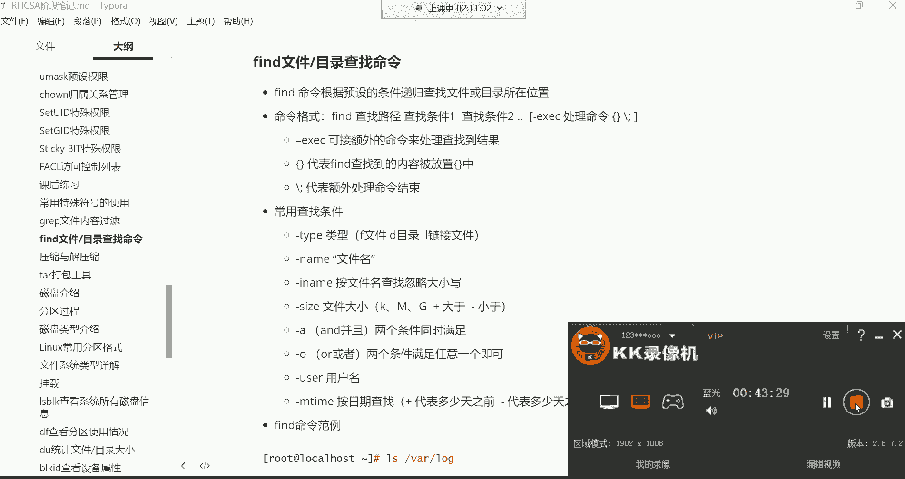

熟练掌握这些工具，将极大提升你在Linux系统下的操作和排错效率。