# Linux运维进阶：P21：find文件查找命令详解 🔍

在本节课中，我们将要学习Linux系统中一个非常强大且常用的命令——`find`。`find`命令用于在指定目录下查找符合特定条件的文件。我们将从基本语法开始，逐步学习各种查找条件，并了解如何对查找结果进行进一步处理。通过本教程，你将能够熟练使用`find`命令来定位和管理系统中的文件。

## 命令格式与基本概念

`find`命令的基本格式如下：

```
find [查找路径] [查找条件] [额外操作]
```

*   **查找路径**：告诉`find`命令从哪个目录开始搜索。
*   **查找条件**：定义你要查找的文件需要满足什么特性，例如类型、名称、大小等。
*   **额外操作**：对查找到的文件执行的操作，例如复制、移动、删除等。

`find`命令的一个核心特点是**递归查找**。这意味着当你指定一个起始路径后，`find`不仅会搜索该路径下的文件，还会深入其下的所有子目录进行搜索。

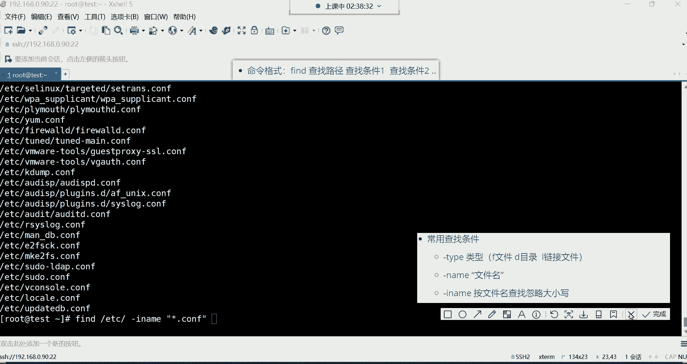

## 按文件类型查找

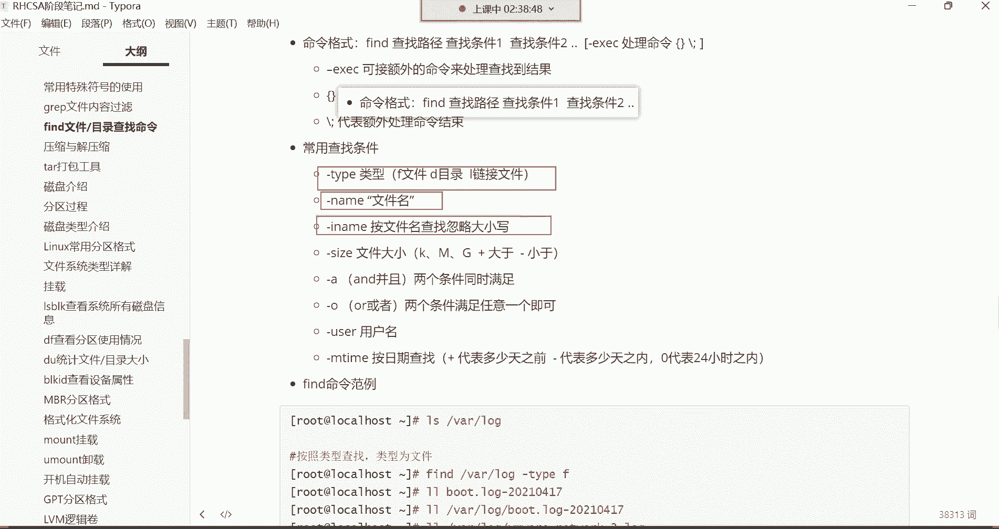

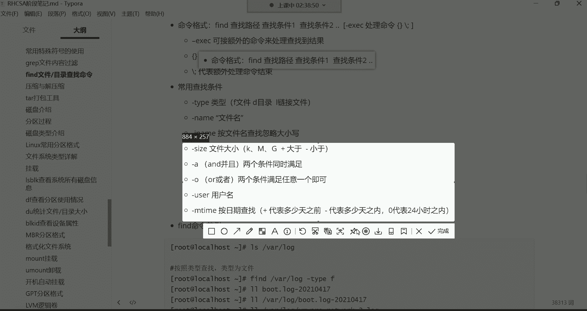

上一节我们介绍了`find`命令的基本格式，本节中我们来看看第一个常用的查找条件：按文件类型查找。

使用 `-type` 选项可以指定要查找的文件类型。常见的类型标识符有：
*   `f`：代表普通文件。
*   `d`：代表目录。
*   `l`：代表符号链接文件。

以下是具体用法示例：

*   查找 `/var/log` 目录下的所有普通文件：
    ```bash
    find /var/log -type f
    ```
*   查找 `/var/log` 目录下的所有目录：
    ```bash
    find /var/log -type d
    ```
*   查找 `/etc` 目录下的所有符号链接文件：
    ```bash
    find /etc -type l
    ```

## 按文件名查找

除了按类型，我们更常需要根据文件名来查找文件。`-name` 选项可以实现这一功能。

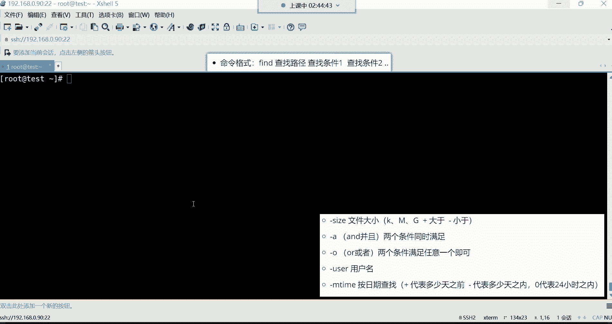

以下是按文件名查找的几种方式：

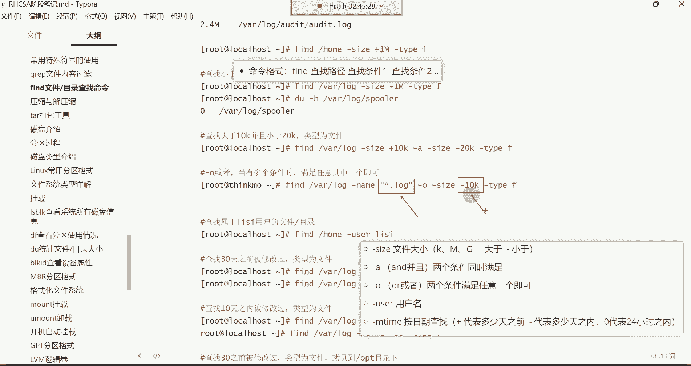

*   精确查找名为 `message` 的文件：
    ```bash
    find /var/log -name “message”
    ```
*   使用通配符 `*` 进行模糊匹配，查找所有以 `.log` 结尾的文件：
    ```bash
    find /var/log -name “*.log”
    ```
*   查找时忽略文件名的大小写，使用 `-iname` 选项：
    ```bash
    find /var/log -iname “*.LOG”
    ```

**注意**：`find -name` 与 `ls` 命令在通配符查找时有重要区别。`ls` 只搜索当前目录层，而 `find` 会进行递归搜索。例如，`ls /etc/*.conf` 和 `find /etc -name “*.conf”` 的结果范围是不同的。

## 按文件大小查找

当需要管理磁盘空间或查找特定大小的文件时，可以使用 `-size` 选项。

该选项后接的数字可以使用单位：`c`（字节），`k`（千字节），`M`（兆字节），`G`（吉字节）。使用 `+` 表示“大于”，使用 `-` 表示“小于”。

以下是按文件大小查找的示例：

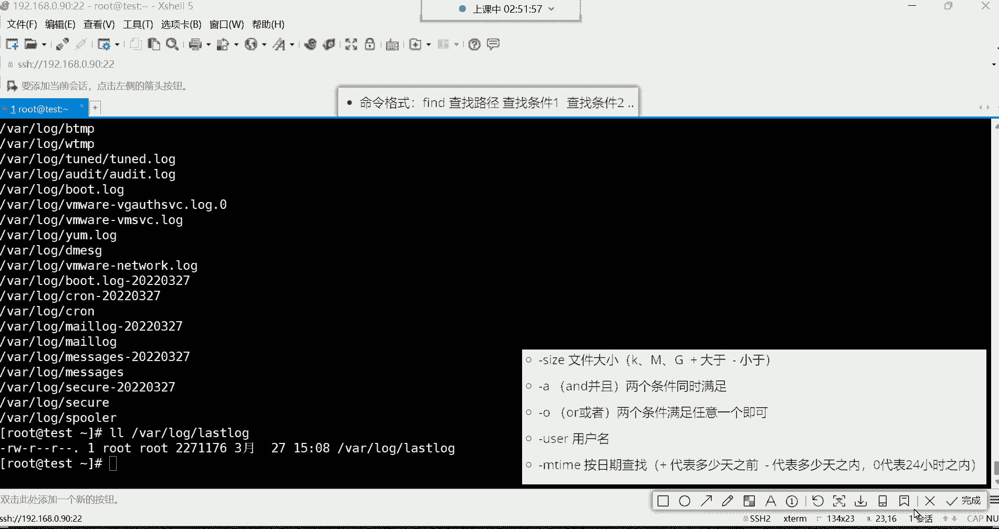

*   查找 `/var/log` 目录下大于 10KB 的普通文件：
    ```bash
    find /var/log -size +10k -type f
    ```
*   查找 `/var/log` 目录下小于 10KB 的文件：
    ```bash
    find /var/log -size -10k
    ```
*   查找 `/etc` 目录下大于 1MB 的文件：
    ```bash
    find /etc -size +1M
    ```

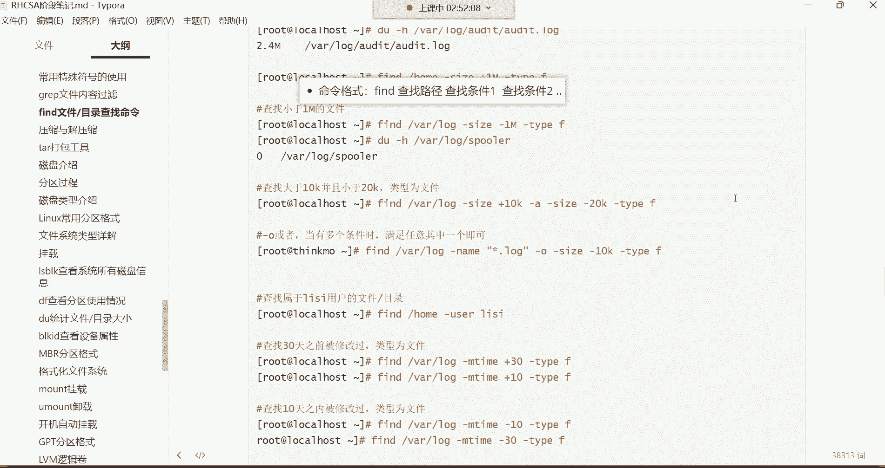


可以使用 `du -h [文件名]` 命令来验证文件的实际大小。

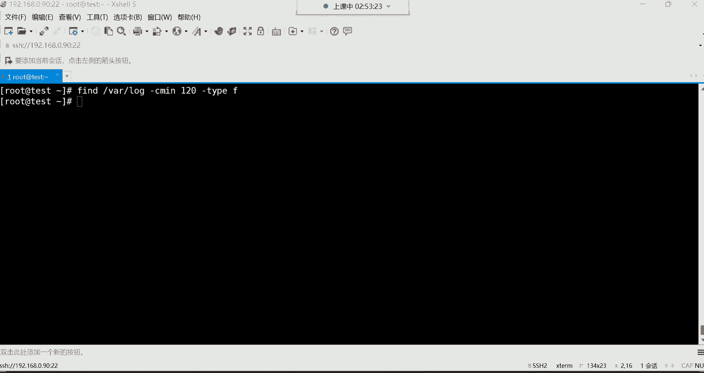


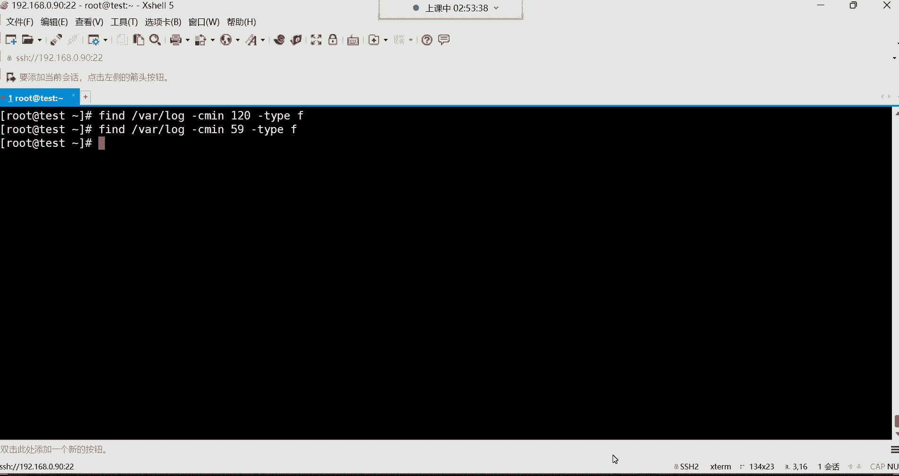


## 组合条件查找

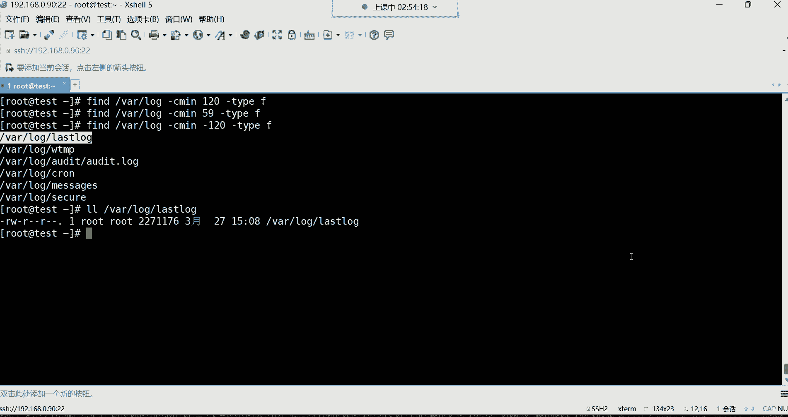

`find` 命令允许使用逻辑运算符组合多个查找条件，使搜索更加精确。


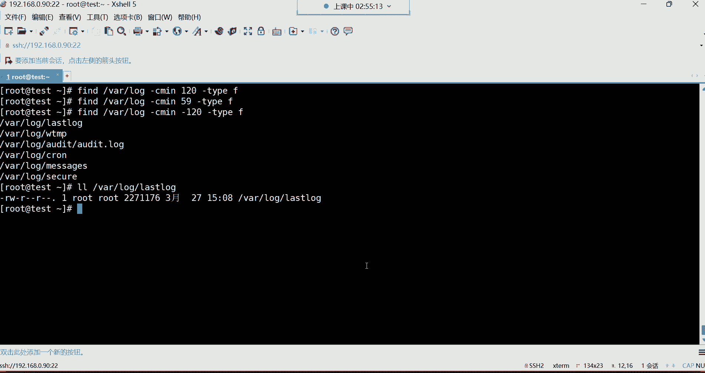

主要运算符有：
*   `-a` 或 `-and`：逻辑“与”，两个条件必须同时满足（`-a` 通常可以省略）。
*   `-o` 或 `-or`：逻辑“或”，满足任意一个条件即可。

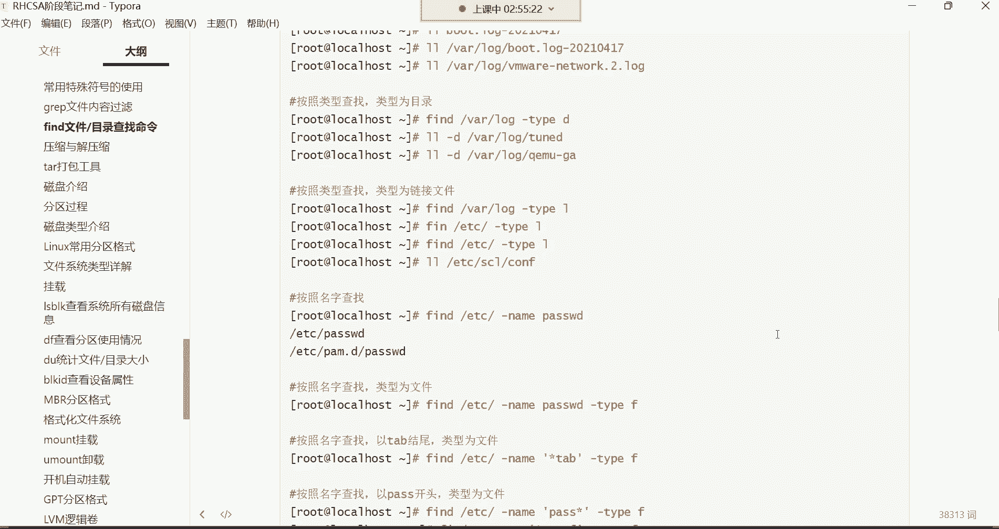

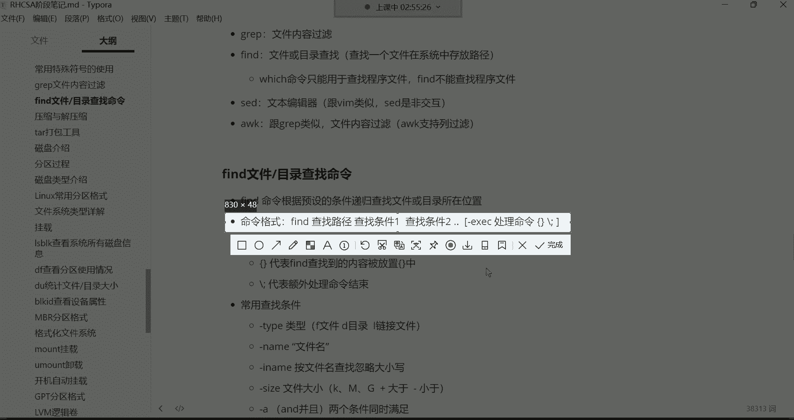

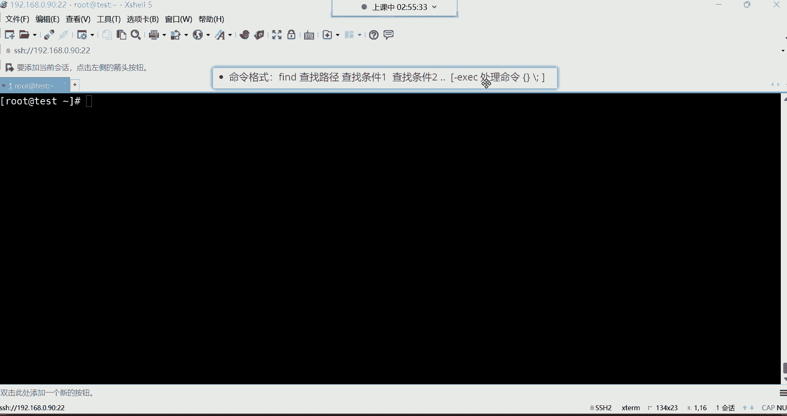

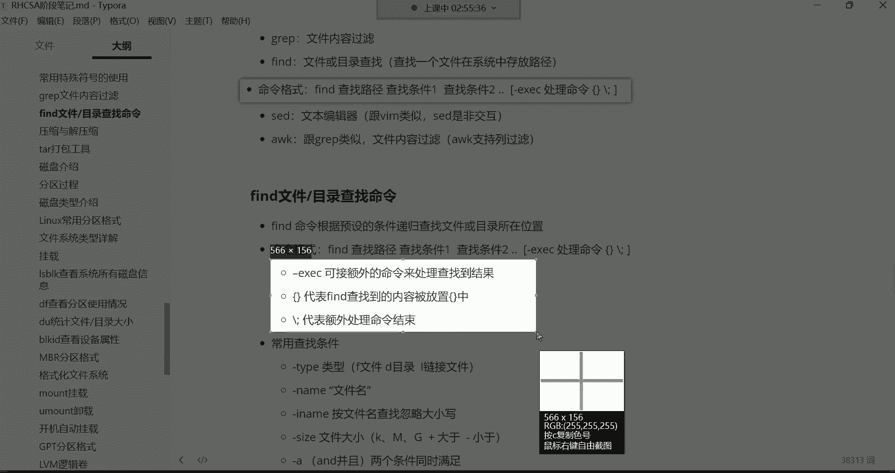

以下是组合条件查找的示例：

*   查找大小在 10KB 到 20KB 之间的普通文件：
    ```bash
    find /var/log -size +10k -a -size -20k -type f
    ```
*   查找文件名以 `.log` 结尾 **或** 大小小于 10KB 的普通文件：
    ```bash
    find /var/log \( -name “*.log” -o -size -10k \) -type f
    ```
    **注意**：使用括号时，括号前需要加反斜杠 `\` 进行转义。

## 按用户和时间查找

`find` 命令还可以根据文件属主和修改时间进行查找。

以下是相关选项的用法：

*   按用户查找：使用 `-user` 选项。例如，查找系统根目录下属于用户 `laowang` 的所有文件：
    ```bash
    find / -user laowang
    ```
*   按修改时间查找：使用 `-mtime` 选项。`+n` 表示 `n` 天以前，`-n` 表示 `n` 天以内。
    *   查找 `/var/log` 目录下 10 天前被修改过的文件：
        ```bash
        find /var/log -mtime +10 -type f
        ```
    *   查找 `/var/log` 目录下 24 小时（1天）内被修改过的文件：
        ```bash
        find /var/log -mtime -1 -type f
        ```
    *   查找过去 120 分钟（2小时）内被修改过的文件（使用 `-cmin` 选项，单位为分钟）：
        ```bash
        find /var/log -cmin -120 -type f
        ```

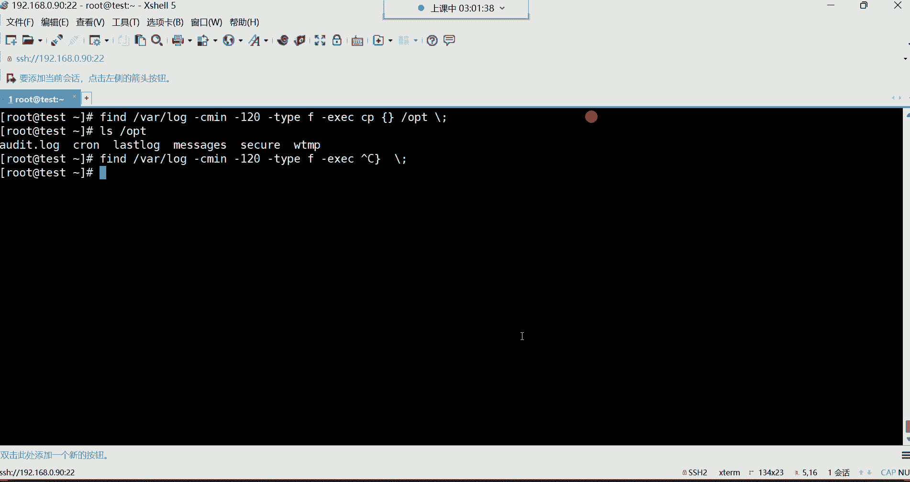

## 对查找结果执行操作

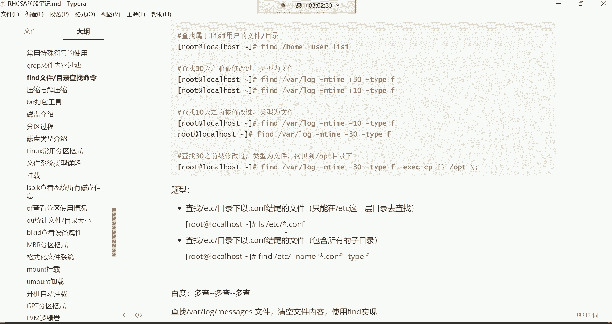

`find` 命令与管道符 `|` 的配合并不友好。要对查找到的文件执行操作（如复制、移动、删除），需要使用 `-exec` 选项。

`-exec` 的语法结构为：
```
find [路径] [条件] -exec [命令] {} \;
```
其中，`{}` 是一个占位符，代表 `find` 找到的每一个文件路径。`\;` 表示 `-exec` 参数的结束。

以下是对查找结果执行操作的示例：

*   将 `/var/log` 目录下 2 小时内修改过的文件备份到 `/opt` 目录：
    ```bash
    find /var/log -cmin -120 -type f -exec cp {} /opt \;
    ```
*   删除 `/tmp` 目录下所有以 `.tmp` 结尾的文件（**请谨慎使用删除操作**）：
    ```bash
    find /tmp -name “*.tmp” -exec rm {} \;
    ```
*   清空 `/var/log` 目录下所有大于 10KB 的日志文件内容。这里利用 `/dev/null`（黑洞设备，写入其中的数据会消失）来实现：
    ```bash
    find /var/log -size +10k -type f -exec cp /dev/null {} \;
    ```

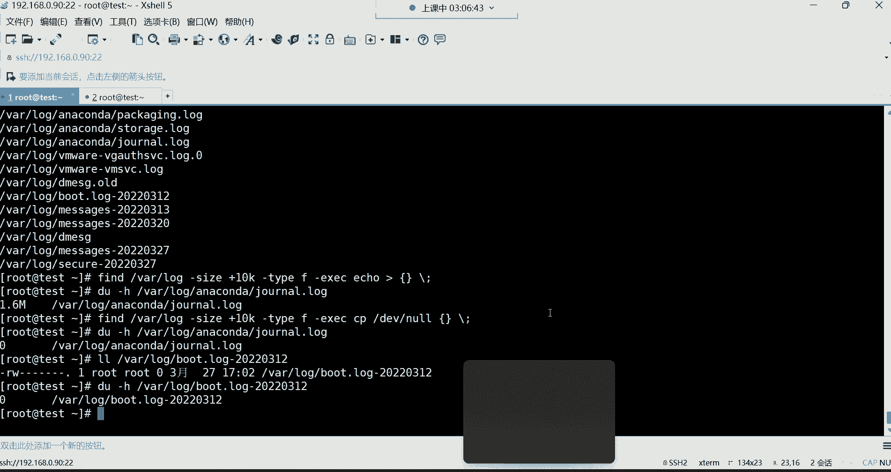

## 总结

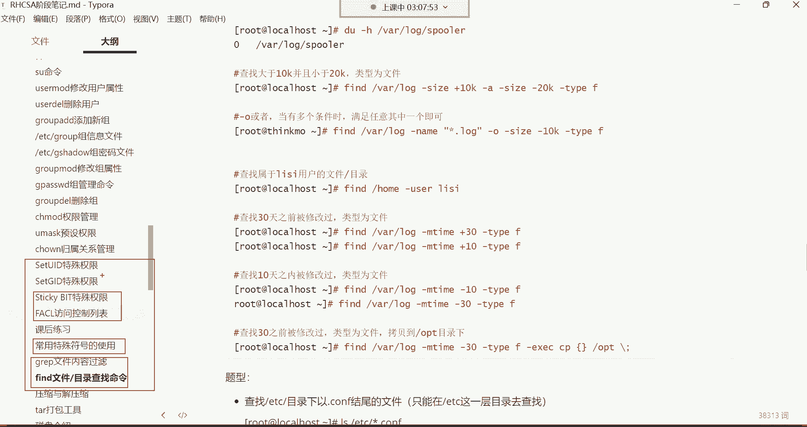

本节课中我们一起学习了Linux中强大的 `find` 文件查找命令。我们从其基本命令格式和递归查找的特性开始，逐步掌握了多种查找条件的使用方法：
*   按文件类型 (`-type`) 查找。
*   按文件名 (`-name`, `-iname`) 查找，支持通配符。
*   按文件大小 (`-size`) 查找。
*   使用逻辑运算符 (`-a`, `-o`) 组合复杂条件。
*   按文件属主 (`-user`) 和修改时间 (`-mtime`, `-cmin`) 查找。

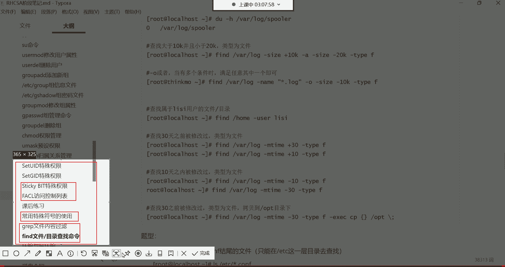


最后，我们学习了如何使用 `-exec` 参数对查找结果执行复制、移动、删除等操作，并了解了清空文件内容的一个技巧。`find` 命令功能丰富，是系统管理和文件检索的利器，需要多加练习才能熟练掌握。