# Linux运维进阶：P26：开机自动挂载、GPT分区、LVM逻辑卷 📚

在本节课中，我们将要学习Linux系统中关于存储管理的三个核心进阶主题：如何实现开机自动挂载、GPT分区格式的特点，以及LVM逻辑卷的创建与管理。逻辑卷管理是解决磁盘空间动态扩展需求的关键技术。

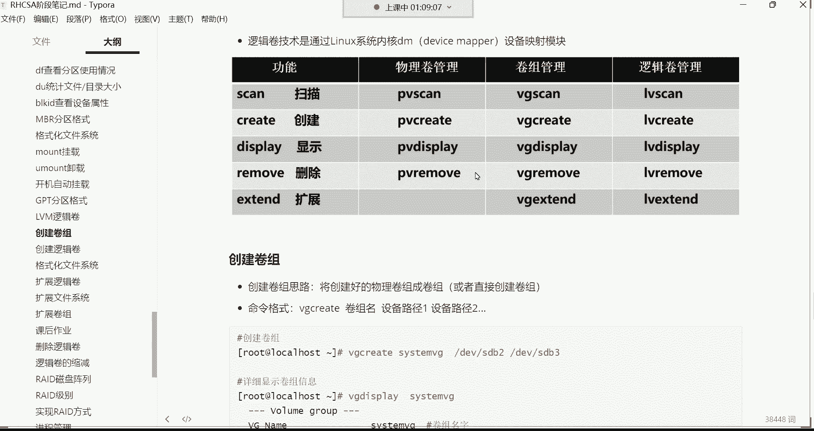

## 概述

上一节我们介绍了磁盘分区的基础知识，本节中我们来看看如何让分区在系统启动时自动挂载，并深入学习更先进的分区表格式GPT，以及能够实现空间动态扩展的LVM逻辑卷技术。

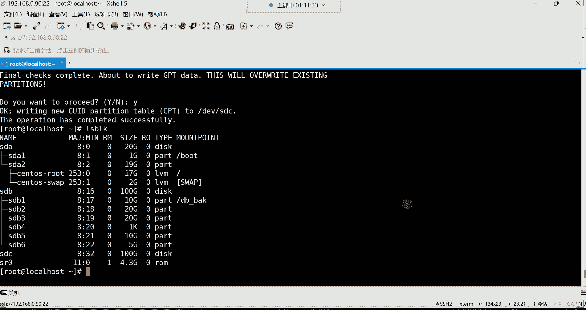

## 开机自动挂载

系统重启后，手动挂载的分区会失效。为了实现永久挂载，我们需要编辑 `/etc/fstab` 配置文件。

以下是编辑 `/etc/fstab` 文件的基本步骤：
1.  使用文本编辑器（如 `vi`）打开 `/etc/fstab` 文件。
2.  在文件末尾添加一行配置，格式为：`设备路径 挂载点 文件系统类型 挂载参数 备份标记 检测顺序`。
3.  保存并退出编辑器。
4.  执行 `mount -a` 命令测试配置是否正确，若无报错则成功。

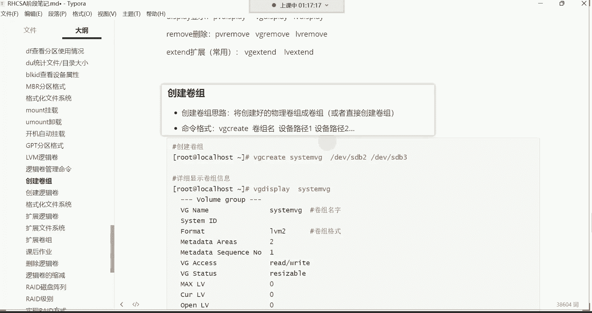

例如，将 `/dev/sdb1` 分区永久挂载到 `/web_back` 目录的配置行如下：
```
/dev/sdb1 /web_back xfs defaults 0 0
```
其中，最后两个 `0` 分别表示“不进行文件系统备份”和“不检查文件系统顺序”。

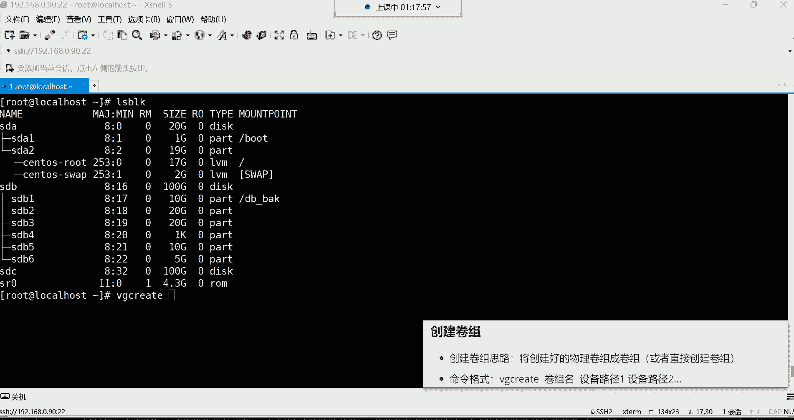

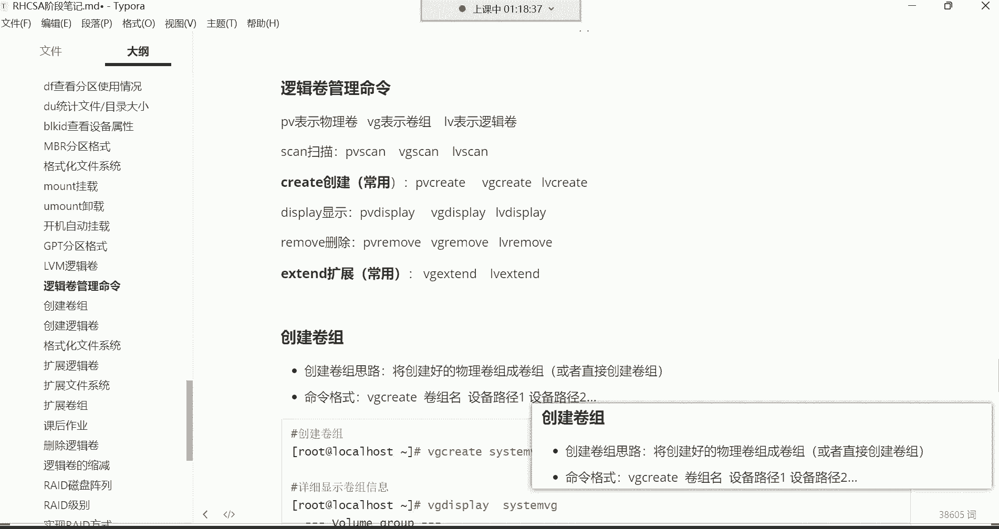

## GPT分区

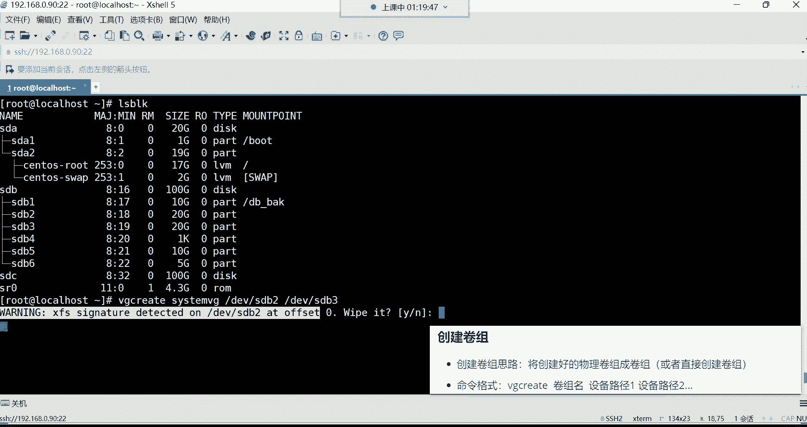

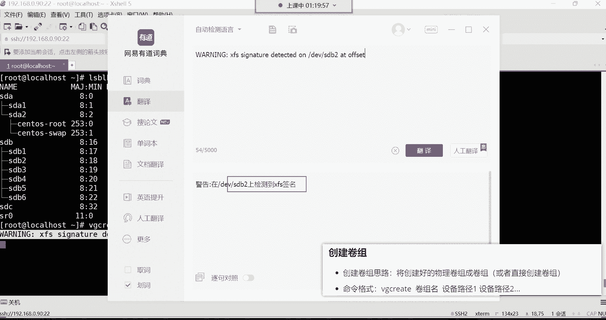

GPT（GUID Partition Table）是一种比传统MBR更先进的分区表格式。它支持超过2TB的大容量磁盘，并且分区数量没有MBR的4个主分区的限制。

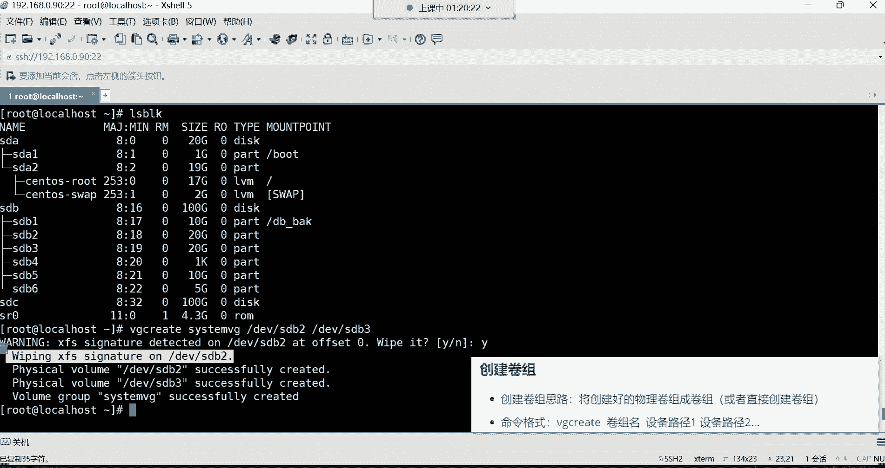

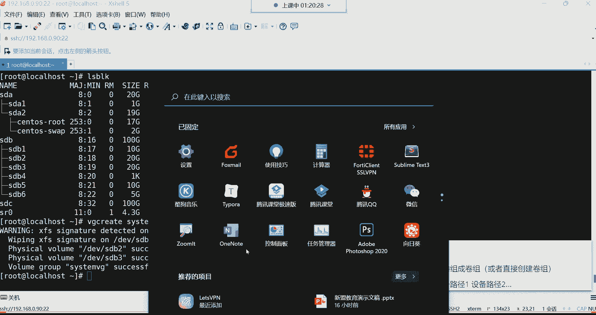

使用 `parted` 命令可以管理GPT分区。例如，将 `/dev/sdc` 磁盘初始化为GPT格式并创建分区的命令如下：
```bash
parted /dev/sdc mklabel gpt
parted /dev/sdc mkpart primary 1MiB 10GiB
```

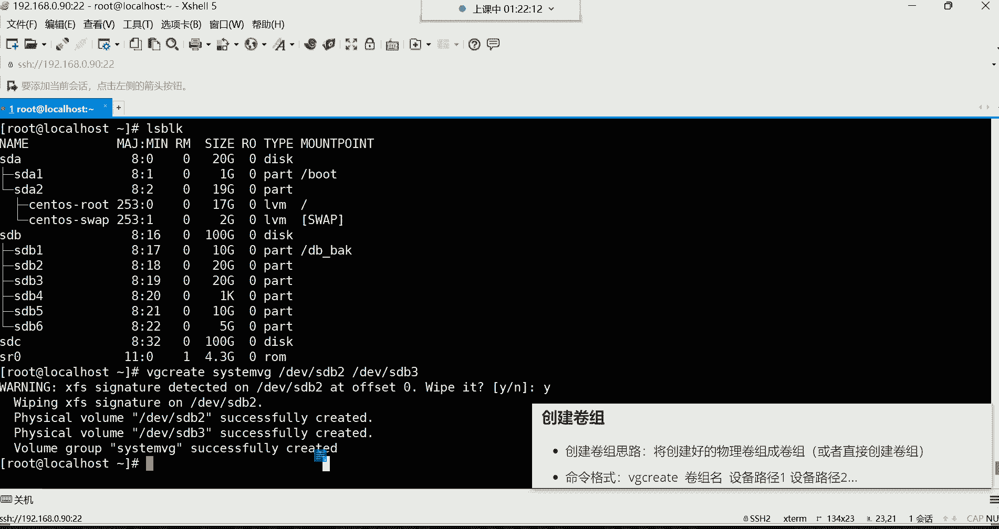

## LVM逻辑卷管理 🗂️

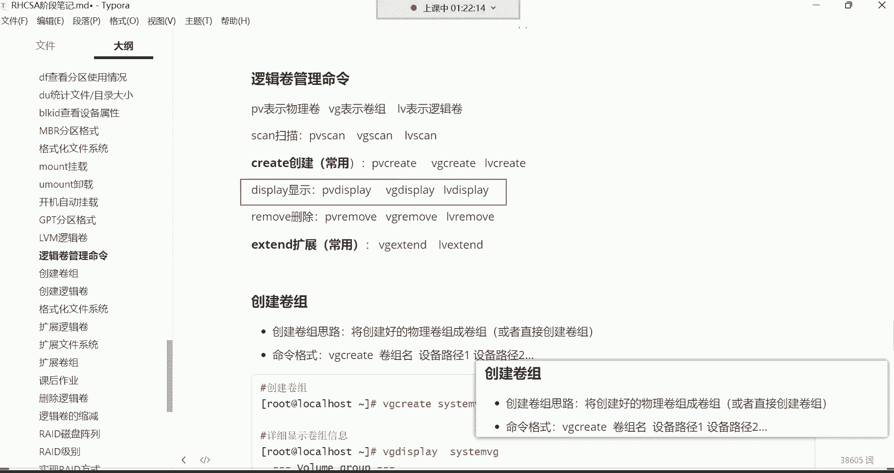

LVM（Logical Volume Manager）的核心优势在于能够动态调整逻辑卷的容量，而无需重新格式化或移动数据。其管理结构分为三层：
*   **物理卷（PV）**：物理磁盘或分区。
*   **卷组（VG）**：由一个或多个PV组成的存储池。
*   **逻辑卷（LV）**：从VG中划分出来的、可供挂载使用的逻辑存储单元。

在CentOS 7系统中，创建PV的步骤通常可以省略，系统会自动处理。

### 创建卷组（VG）

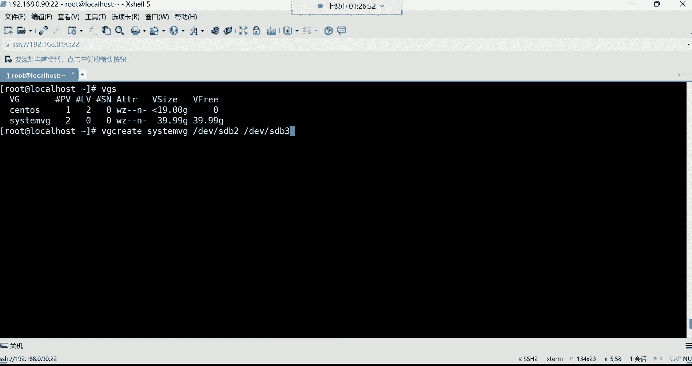

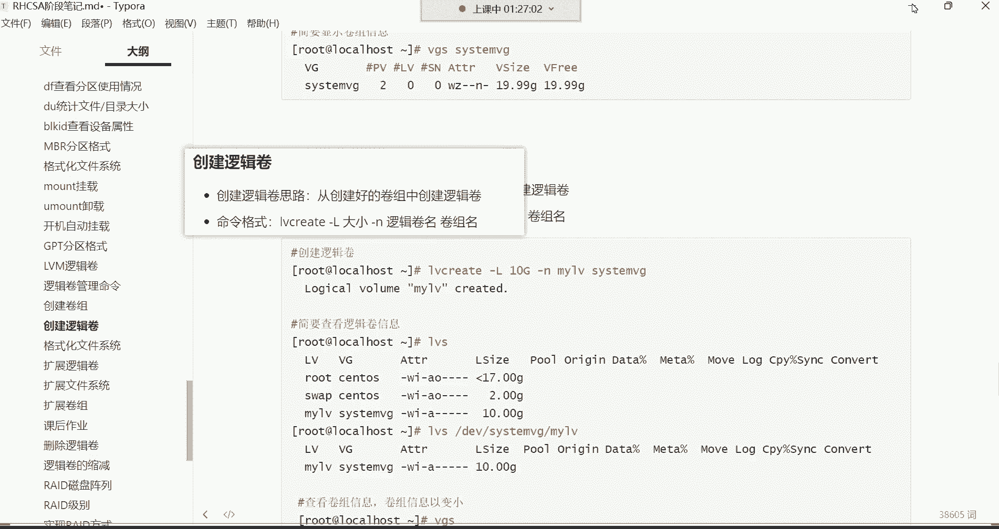

创建卷组的命令格式为 `vgcreate`。其作用是将一个或多个物理分区组合成一个存储池。

以下是创建名为 `system_vg` 的卷组的命令示例：
```bash
vgcreate system_vg /dev/sdb2 /dev/sdb3
```
此命令将 `/dev/sdb2` 和 `/dev/sdb3` 两个分区合并到 `system_vg` 卷组中。执行时，系统会提示抹掉分区上原有的文件系统签名，确认即可。

可以使用 `vgs` 命令简要查看卷组信息：
```bash
vgs
```

### 创建逻辑卷（LV）

创建逻辑卷的命令格式为 `lvcreate`。其作用是从卷组中划分出指定大小的空间，形成一个可用的逻辑存储单元。

以下是创建逻辑卷的命令示例：
```bash
lvcreate -L 20G -n my_lv system_vg
```
*   `-L 20G`：指定逻辑卷大小为20GB。
*   `-n my_lv`：指定逻辑卷名称为 `my_lv`。
*   `system_vg`：指定从哪个卷组划分空间。

创建后，可以使用 `lvs` 命令查看逻辑卷信息。逻辑卷的设备文件路径通常为 `/dev/卷组名/逻辑卷名`，例如 `/dev/system_vg/my_lv`。

### 使用逻辑卷

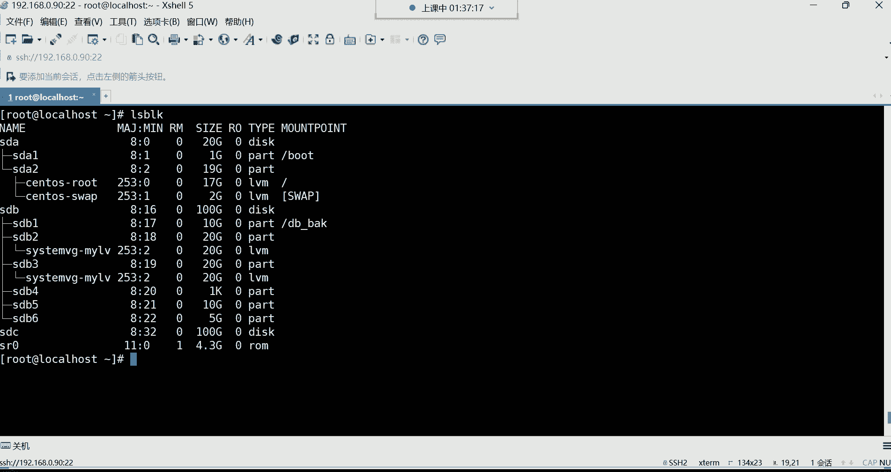

逻辑卷创建后，其使用方式与普通分区完全一致：需要格式化并挂载。

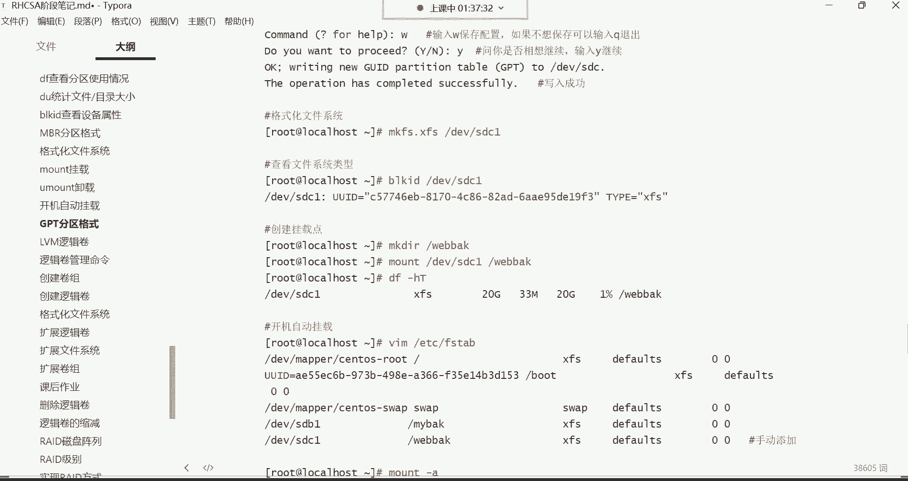

以下是格式化并挂载逻辑卷的步骤：
1.  格式化逻辑卷为 `xfs` 文件系统：
    ```bash
    mkfs.xfs /dev/system_vg/my_lv
    ```
2.  创建挂载点（如果不存在）：
    ```bash
    mkdir -p /web_back
    ```
3.  挂载逻辑卷：
    ```bash
    mount /dev/system_vg/my_lv /web_back
    ```
4.  将挂载信息写入 `/etc/fstab` 实现开机自动挂载：
    ```
    /dev/system_vg/my_lv /web_back xfs defaults 0 0
    ```

## 总结

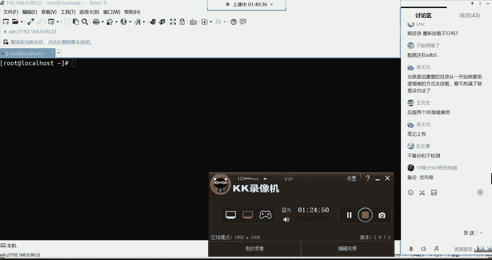

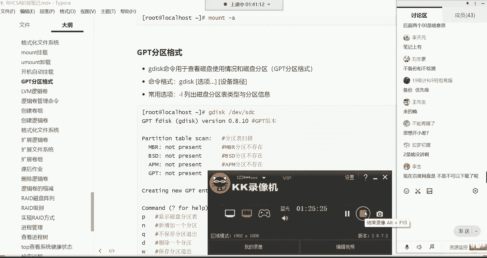

本节课中我们一起学习了Linux存储管理的三个重要部分。我们掌握了通过 `/etc/fstab` 文件实现开机自动挂载的方法；了解了GPT分区格式相对于MBR的优势；重点学习了LVM逻辑卷管理的核心概念与操作流程，包括创建卷组（VG）、创建逻辑卷（LV）、格式化及挂载。逻辑卷技术通过将物理存储资源抽象和聚合，提供了灵活、可扩展的存储管理方案，是应对未来存储空间增长需求的有效手段。