# Linux运维进阶：P28：逻辑卷扩容与RAID磁盘阵列 🚀

在本节课中，我们将学习磁盘管理的两个核心进阶主题：逻辑卷的扩容和RAID磁盘阵列技术。我们将了解如何动态扩展存储空间，以及如何通过不同的RAID级别来平衡数据的安全性、读写速度和存储成本。

## RAID磁盘阵列概述

上一节我们介绍了逻辑卷管理，本节中我们来看看如何通过磁盘阵列技术来提升存储系统的性能和可靠性。RAID（独立磁盘冗余阵列）是一种将多块物理磁盘组合成一个逻辑单元的技术，以实现数据冗余、提升性能或两者兼得。

### RAID 0：条带化阵列

RAID 0至少需要两块磁盘。其核心原理是将一份数据分割成等量的块，并行写入到所有磁盘中。

**数据存储方式**：一份文件被分成两部分，例如各占50%，同时写入两块磁盘。这类似于并行写入。

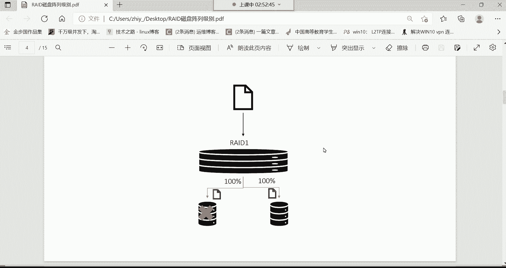

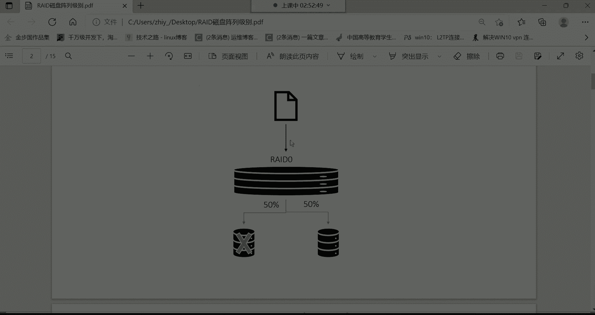

**核心特点**：
*   **提高读写速度**：由于数据被并行写入多块磁盘，读写速度理论上可以翻倍。例如，一个10GB的文件，写入单盘需4分钟，在RAID 0中可能只需2分钟。
*   **无冗余功能**：数据分散存储，没有备份。如果其中一块磁盘故障，例如丢失了50%的数据块，整个文件将无法完整恢复，因此**不安全**。

**公式表示**：
`总容量 = 所有磁盘容量之和`
`可靠性 = 最低（任一磁盘损坏则数据丢失）`

RAID 0适合需要极高读写速度但对数据安全性要求不高的场景。

### RAID 1：镜像阵列

RAID 1同样至少需要两块磁盘。其核心原理是提供完全的数据备份。

**数据存储方式**：同一份数据的完整副本会被同时写入到所有成员磁盘中。

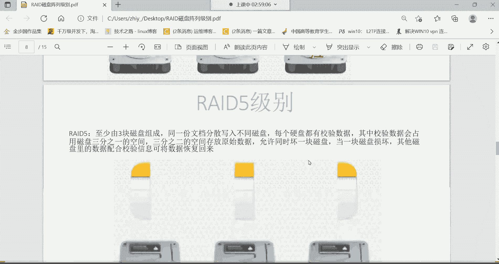

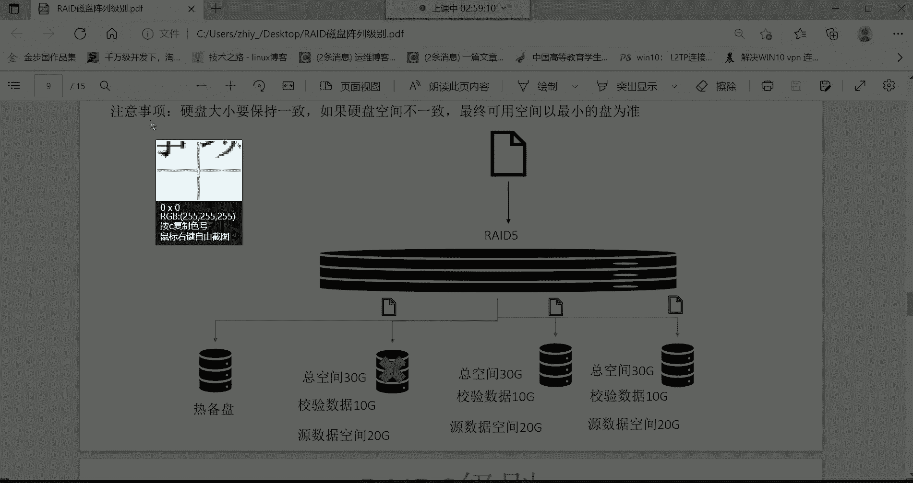

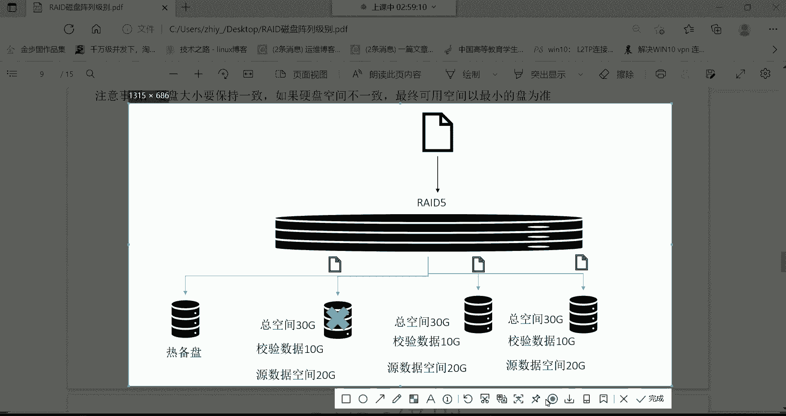

**核心特点**：
*   **高可靠性（完全冗余）**：数据拥有完整的备份。即使一块磁盘损坏，另一块磁盘上仍有完整数据，数据**非常安全**。
*   **读写速度无提升**：数据需要写入多份副本，写入速度可能下降。读取速度可能略有提升，但并非主要优势。
*   **存储利用率低**：可用容量仅为总磁盘容量的一半，另一半用于存储镜像副本。

**公式表示**：
`可用容量 = 单块磁盘容量（假设磁盘容量相同）`
`可靠性 = 高（允许一块磁盘损坏）`

RAID 1适合存储非常重要的数据，但成本较高。

### RAID 5：分布式奇偶校验阵列

RAID 5试图在速度、安全性和成本之间取得平衡，至少需要三块磁盘。

**数据存储方式**：数据被条带化分布存储在多块磁盘上（类似RAID 0），但同时会计算并分布存储奇偶校验信息。校验信息用于在单块磁盘故障时重建数据。

**核心特点**：
*   **兼顾速度与安全**：数据并行写入，**提升了读写速度**。同时，通过校验信息提供了**冗余功能**，允许损坏一块磁盘而不丢失数据。
*   **存储利用率较高**：可用容量为 `(N-1) * 单盘容量`（N为磁盘总数）。例如，3块1TB磁盘组成的RAID 5，可用空间约为2TB。
*   **需要热备盘**：在企业环境中，常配置一块热备盘。当阵列中某块磁盘故障时，热备盘会自动加入并重建数据，保持阵列完整性。

**核心概念**：奇偶校验信息分布在所有磁盘上，而非集中在一块盘，避免了性能瓶颈。

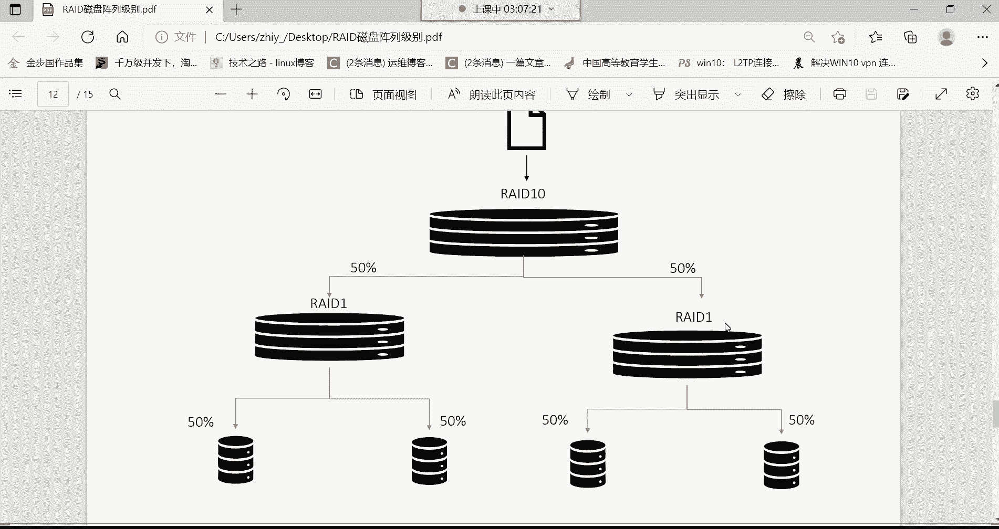

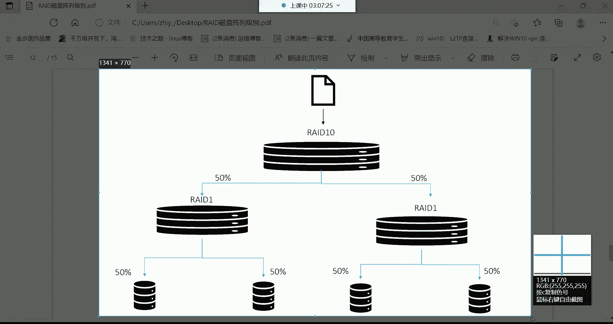

RAID 5是企业中最常用、性价比较高的RAID级别之一。

### RAID 6：双重分布式奇偶校验阵列

RAID 6是RAID 5的扩展，至少需要四块磁盘。

**数据存储方式**：与RAID 5类似，但使用两种独立的校验算法，存储双份校验信息。

**核心特点**：
*   **更高的容错性**：允许同时损坏**两块**磁盘而数据不丢失，安全性极高。
*   **存储利用率降低**：可用容量为 `(N-2) * 单盘容量`。例如，4块1TB磁盘，可用空间约为2TB。
*   **写入性能开销较大**：由于需要计算和写入双份校验信息，写入性能通常低于RAID 5。

RAID 6适用于对数据安全性要求极高，且可以接受更高成本和一定性能损失的场景。

### RAID 10：镜像与条带化的结合

RAID 10（也称RAID 1+0）至少需要四块磁盘，是RAID 1和RAID 0的结合。

**构建方式**：
1.  首先，将磁盘两两组成RAID 1（镜像对）。
2.  然后，将这些RAID 1镜像对再组合成一个RAID 0（条带化阵列）。

**核心特点**：
*   **高性能与高可靠性**：既通过RAID 0提供了**高速的读写性能**，又通过底层的RAID 1提供了**数据镜像保护**。
*   **容错规则**：可以容忍每个RAID 1镜像对中损坏一块磁盘。但不能容忍同一个镜像对的两块磁盘同时损坏。
*   **成本高昂**：可用容量仅为总磁盘容量的一半。

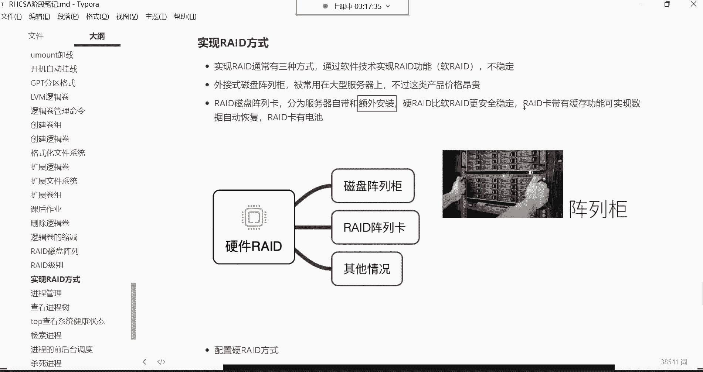

**公式表示**：
`可用容量 = (总磁盘数 / 2) * 单盘容量`

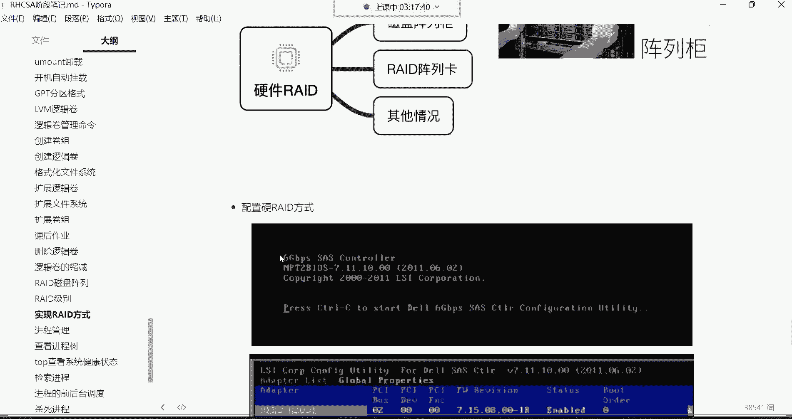

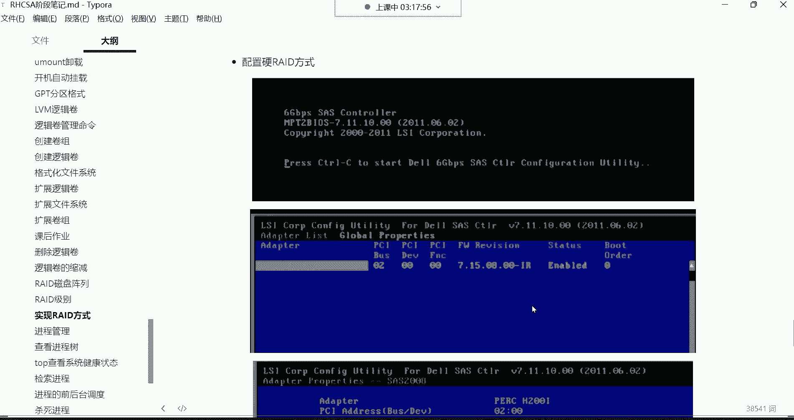

RAID 10适用于既需要高性能又需要高可靠性的关键业务，但成本最高。

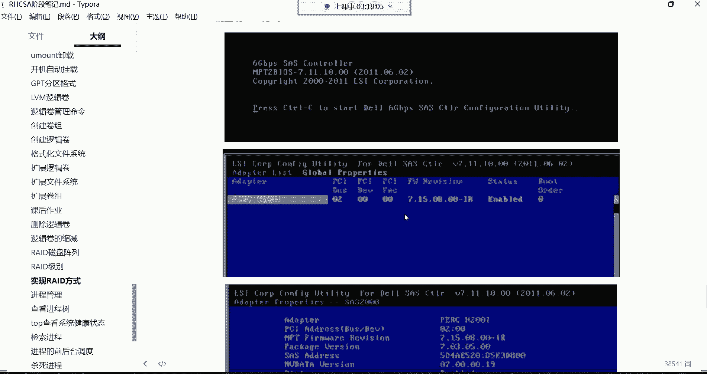

## RAID实现方式

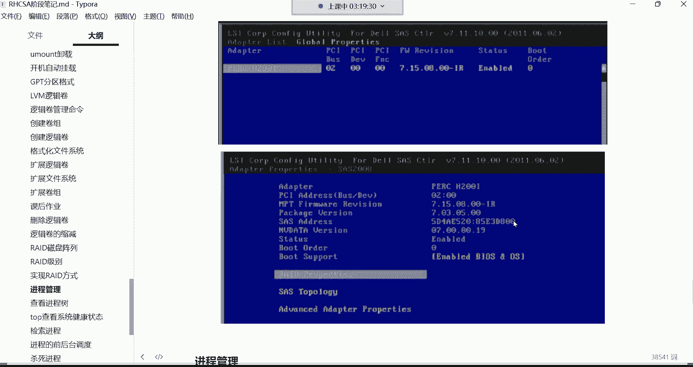

了解了各级别的特性后，我们来看看如何实现RAID。主要有三种方式：

以下是三种主要的RAID实现方式：

1.  **软件RAID**：依靠操作系统层面的软件驱动程序来实现RAID功能。
    *   **优点**：成本低，无需额外硬件。
    *   **缺点**：占用主机CPU资源，性能较差；稳定性依赖于操作系统，服务器宕机则功能失效。
2.  **硬件RAID（阵列卡）**：使用专用的RAID控制卡（阵列卡）来实现。这是企业中最常见的方式。
    *   **优点**：性能好，不占用主机CPU；稳定可靠；高级阵列卡带缓存和电池，意外断电时可保护缓存中的数据不丢失。
    *   **缺点**：需要额外购买硬件。阵列卡有服务器自带和额外安装两种，后者通常功能更全、更稳定。
3.  **外置磁盘阵列柜**：将RAID控制器和磁盘封装在一个独立的外部机箱中，通过高速接口（如SAS、光纤）连接到服务器。
    *   **优点**：扩展性强，管理集中，性能极高。
    *   **缺点**：价格非常昂贵，常用于大型或超级服务器系统。

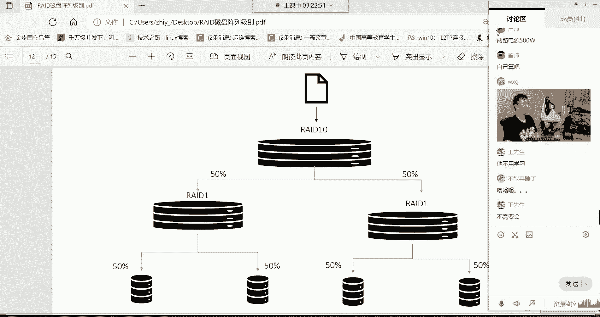

**硬件RAID卡配置**：服务器开机时，根据阵列卡厂商提示（通常是按 `Ctrl+R` 等快捷键）进入配置界面（类似BIOS设置），按照说明书创建所需级别的RAID阵列即可。

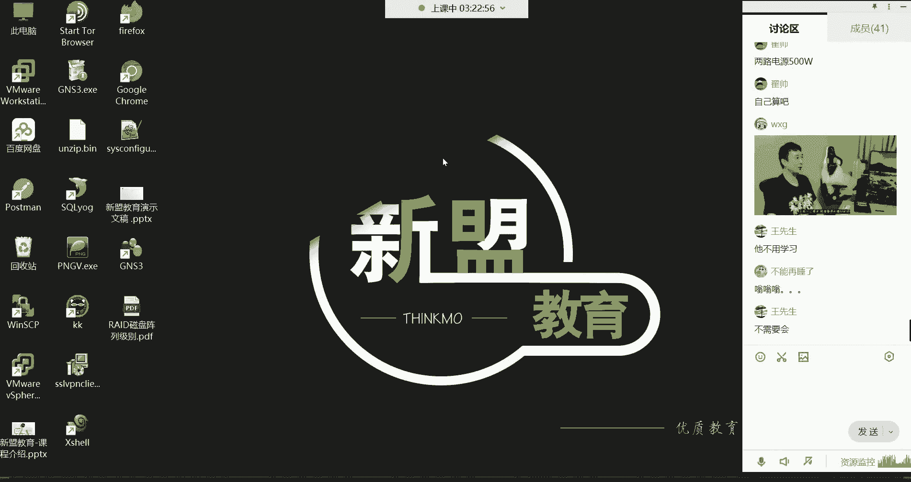

## 课程总结与作业

本节课中我们一起学习了逻辑卷扩容的延续知识以及RAID磁盘阵列技术。我们详细探讨了RAID 0、1、5、6、10等常见级别的**工作原理、核心特点和适用场景**，并了解了软件、硬件和外置三种**RAID实现方式**。对于运维工作而言，理解RAID是设计和维护稳定、高效存储系统的基石。

**本周重点掌握**：
*   命令：重点掌握 `tar` 进行打包压缩，熟练使用 `lsblk`, `df`, `du` 等磁盘查看命令。
*   操作：掌握MBR/GPT分区、格式化、挂载，以及逻辑卷的**创建、扩展（卷组、逻辑卷、文件系统）** 全套流程。
*   理论：理解文件系统、挂载的意义，了解各级RAID的特性（尤其是RAID 5）。

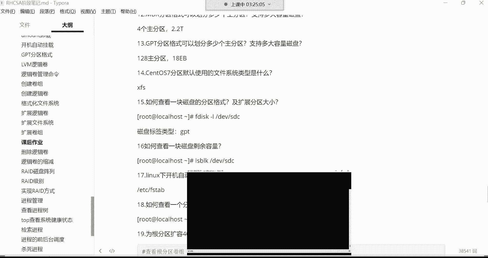

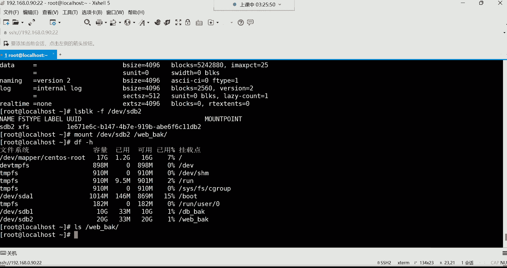

**课后作业**：
请在你的实验环境中，为系统的根分区（通常是一个逻辑卷）模拟扩容40GB的空间。回顾并实践从添加物理磁盘、扩展到卷组、再扩展到逻辑卷，最后扩展文件系统的完整步骤。