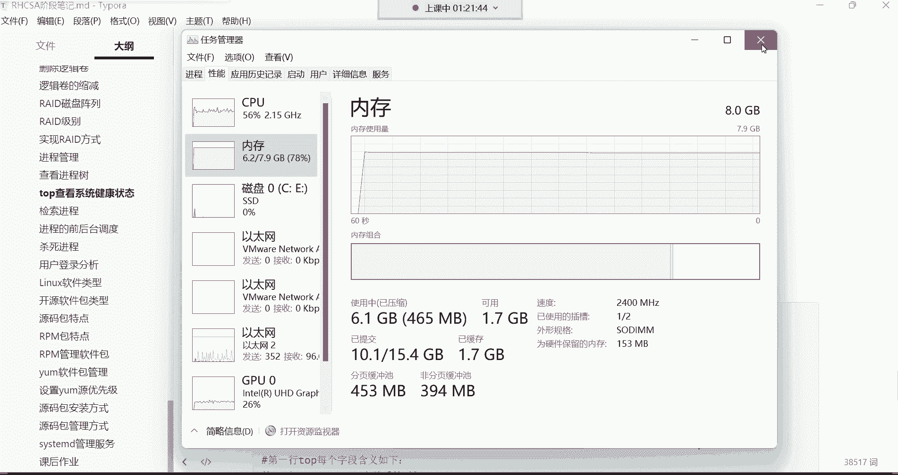
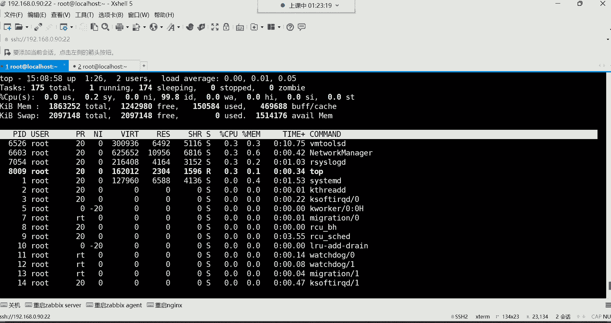
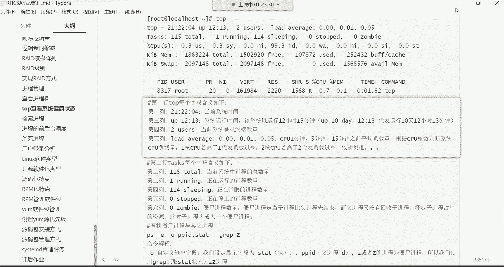
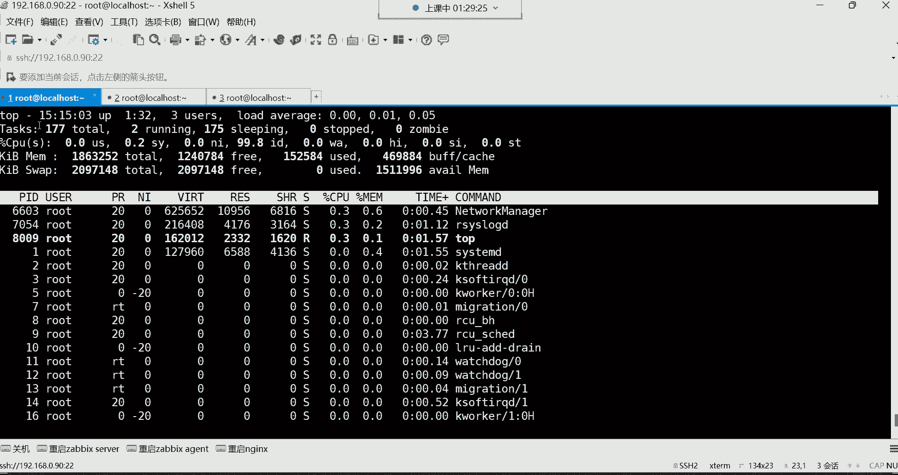
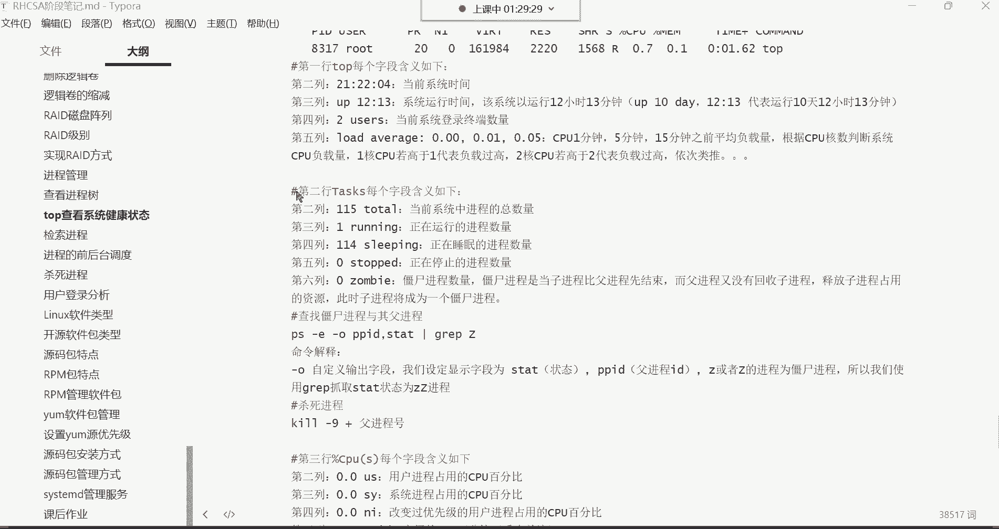
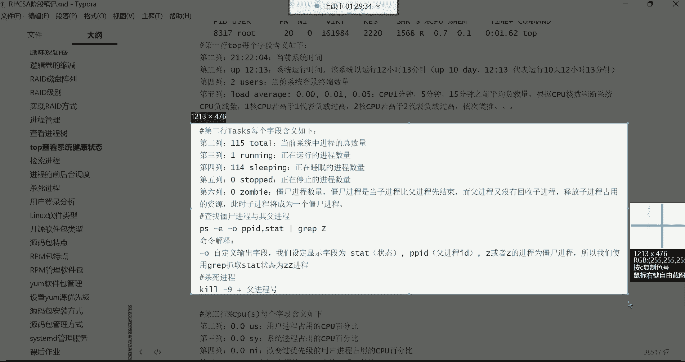
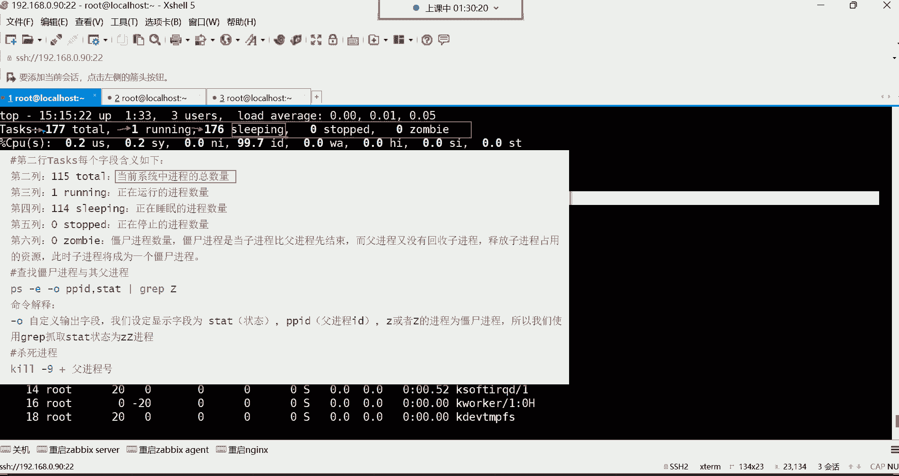
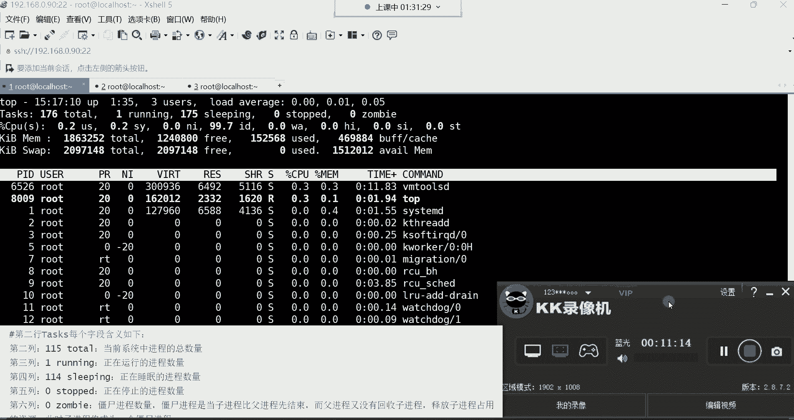

# Linux运维进阶：P29：top系统健康检查 📊


在本节课中，我们将学习如何使用 `top` 命令来动态监控系统的性能和运行状态。`top` 命令类似于 Windows 系统中的任务管理器，能够实时显示 CPU、内存、进程等关键信息，是系统健康检查的重要工具。



---

上一节我们介绍了静态查看进程的 `ps` 命令。本节中，我们来看看功能更强大的动态监控命令 `top`。

在终端中直接输入 `top` 并回车，即可进入动态监控界面。这个界面会持续刷新，实时反映系统状态。





```bash
top
```

与 `ps aux` 命令输出的静态列表不同，`top` 命令的显示界面分为多个信息行。`ps aux` 命令主要列出进程的详细信息（如 PID、用户、CPU 和内存占用率），这些信息对应 `top` 界面中**第六行及以下**的进程列表。而 `top` 界面的**第一行到第五行**则提供了 `ps` 命令无法显示的、关于系统整体负载和资源使用情况的汇总信息。

---

接下来，我们详细解读 `top` 命令输出界面中每一行的含义。

### 第一行：系统概况与负载

第一行显示了系统的时间、运行时长、登录用户数和平均负载。

*   **当前系统时间**：例如 `15:04:31`。
*   **系统运行时间**：`up 1:27` 表示系统已运行 1 小时 27 分钟。在生产环境中，常用天数表示，如 `365 days, 4:20`，表示已不间断运行 365 天 4 小时 20 分钟。
*   **登录用户数**：`2 users` 表示当前有 2 个终端登录到系统。注意，这是终端数量，不是独立用户数量。
*   **系统平均负载**：`load average: 0.00, 0.00, 0.00`。这三个数值分别代表系统在最近 1 分钟、5 分钟和 15 分钟内的平均负载。**负载值的判断需要结合 CPU 核心数**。例如，对于一个 4 核 CPU：
    *   负载值为 `1.0` 表示有 1 个核心的利用率达到 100%。
    *   负载值为 `4.0` 表示所有 4 个核心的利用率均达到 100%，系统负载已满。
    *   负载值为 `2.0` 则表示还有空闲的核心资源。

### 第二行：进程概况



第二行 `Tasks` 显示了系统中进程的总体状态。





以下是各列的具体含义：
*   **total**：系统中的进程总数。
*   **running**：正在运行的进程数量。
*   **sleeping**：处于休眠（等待）状态的进程数量。
*   **stopped**：已停止的进程数量。
*   **zombie**：“僵尸”进程的数量。僵尸进程是已终止但未被其父进程清理的进程，少量存在是正常的，但数量过多可能表明有问题。



---



本节课中我们一起学习了 `top` 命令的基本用法及其输出界面的前两行信息。我们了解到 `top` 是一个强大的动态监控工具，其首行信息揭示了系统的运行时间、用户登录情况和关键的平均负载指标。第二行则概括了系统中所有进程的运行状态。掌握这些信息的解读，是进行系统性能分析和健康检查的第一步。在后续课程中，我们将继续解读 `top` 命令的其他输出行。