# Linux运维入门：P2：VMware安装CentOS系统 🖥️

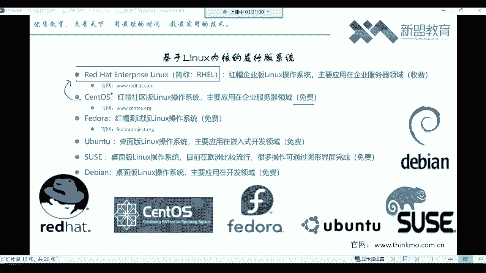

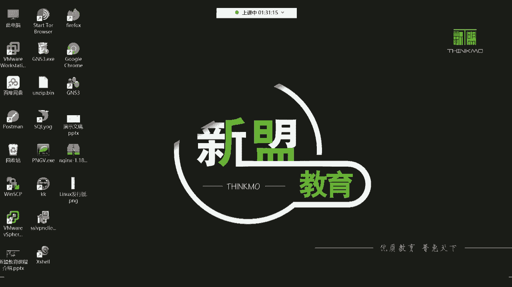

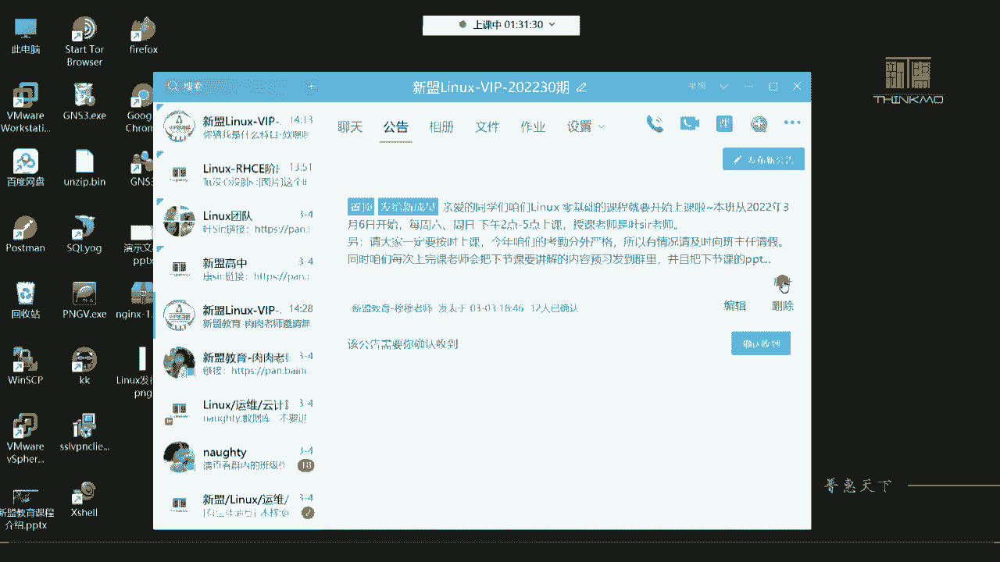

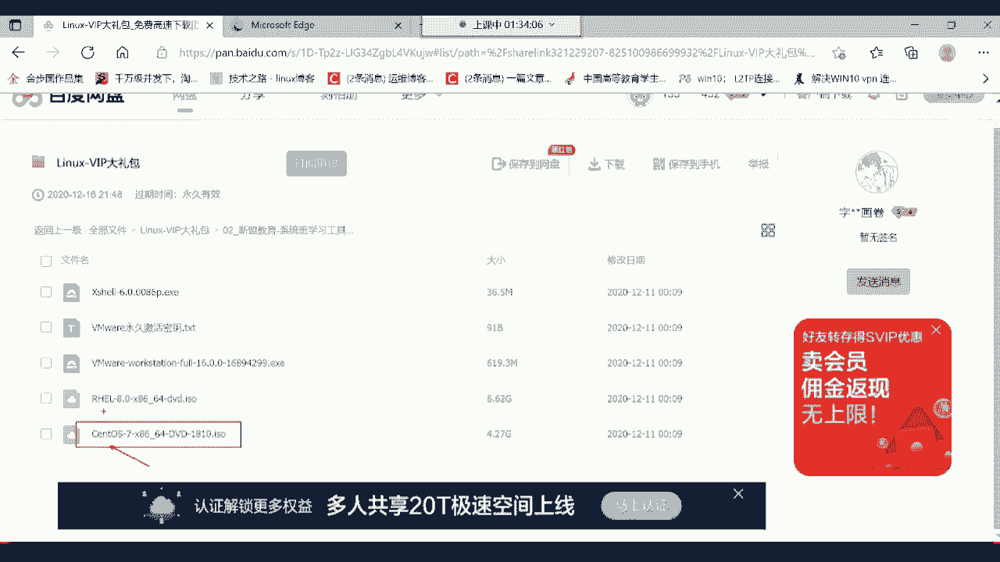

在本节课中，我们将学习如何在VMware虚拟机软件中安装CentOS操作系统。这是学习Linux运维的第一步，我们将从下载必要的软件和镜像开始，一步步完成虚拟机的创建和系统的安装。

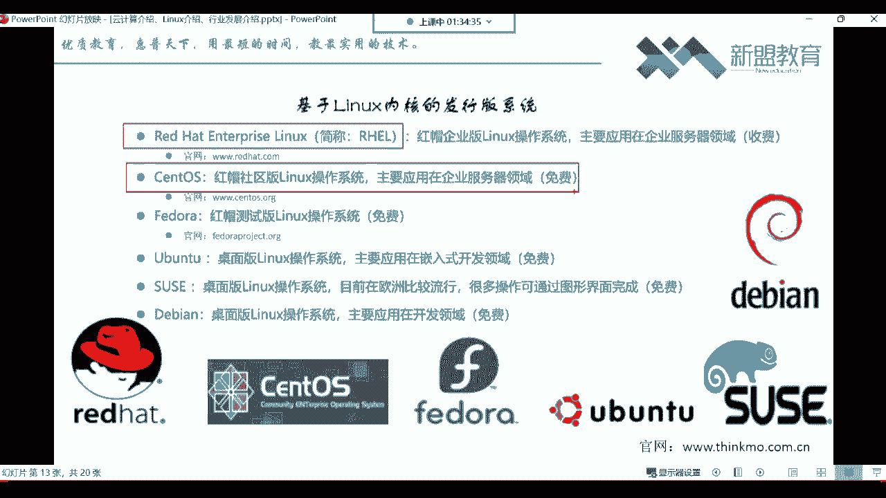

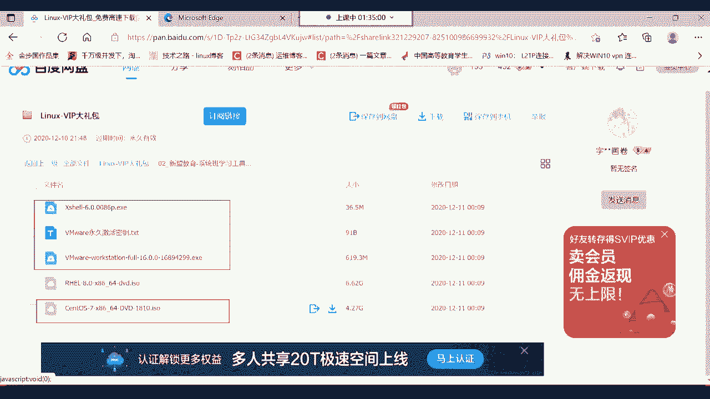

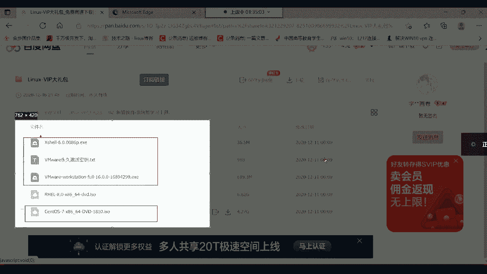

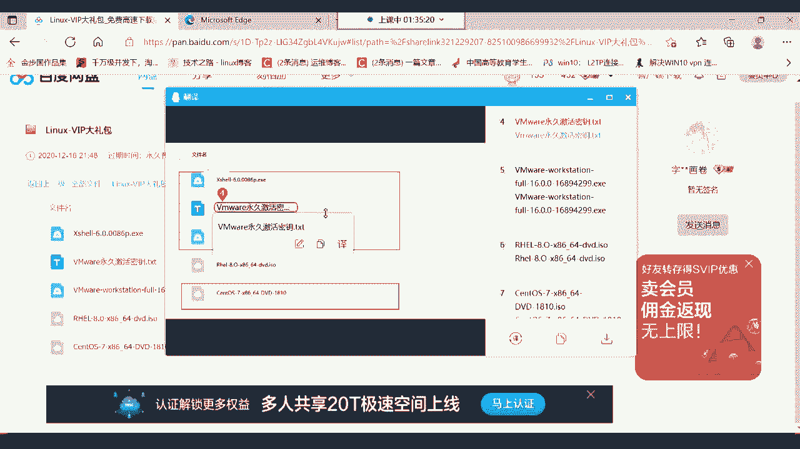

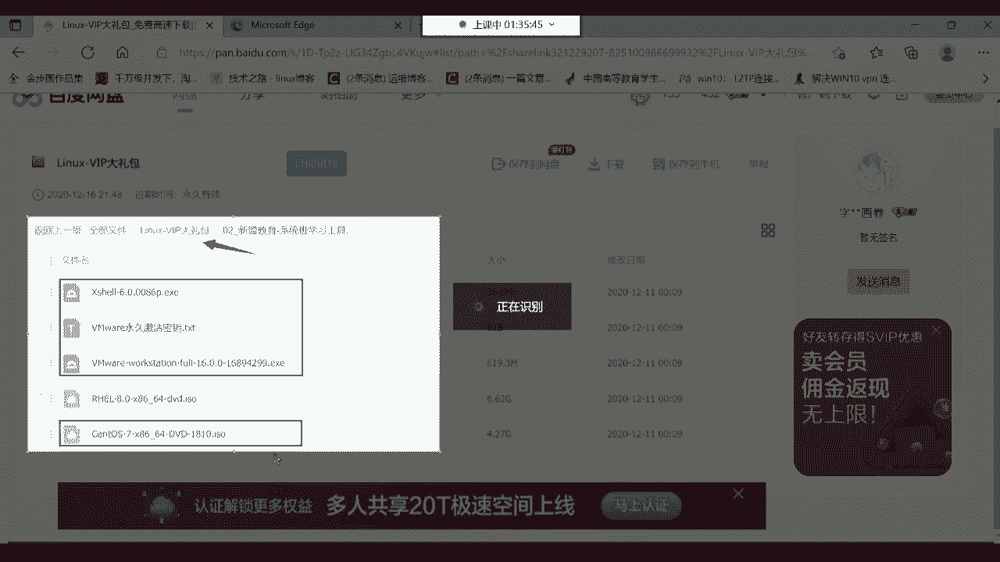

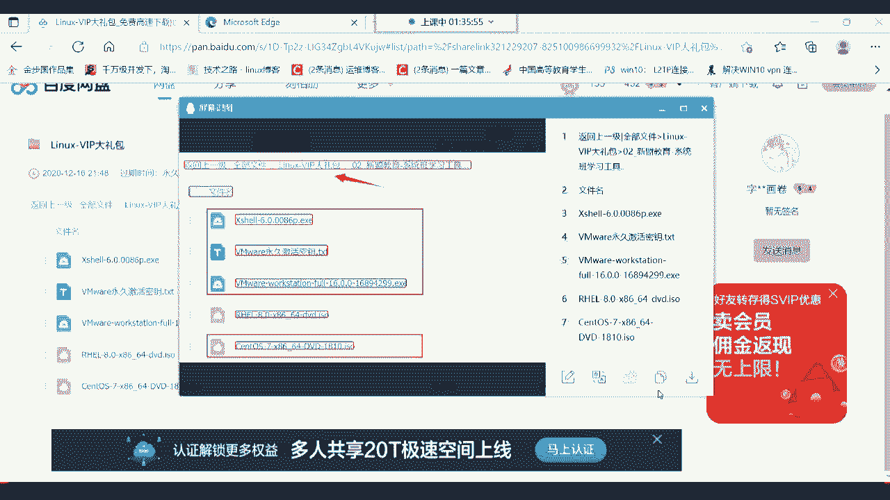

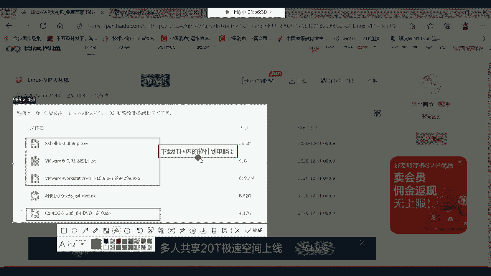

## 概述

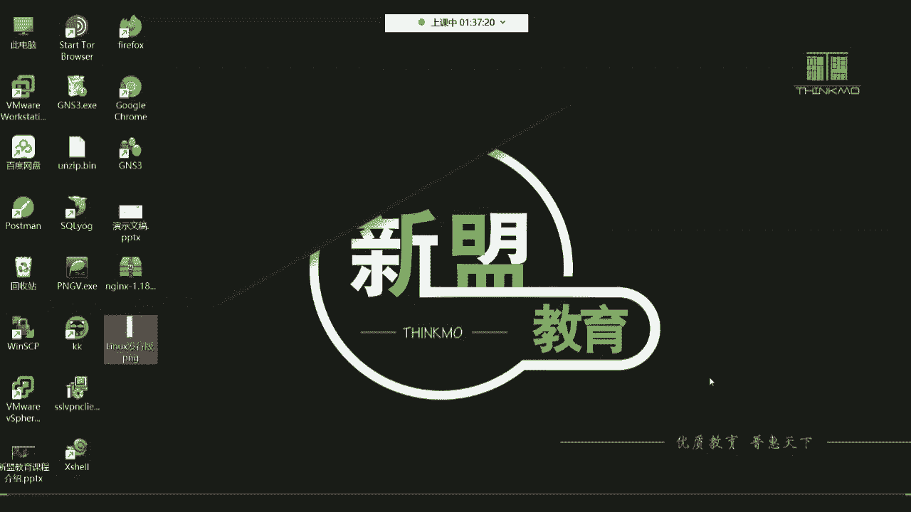

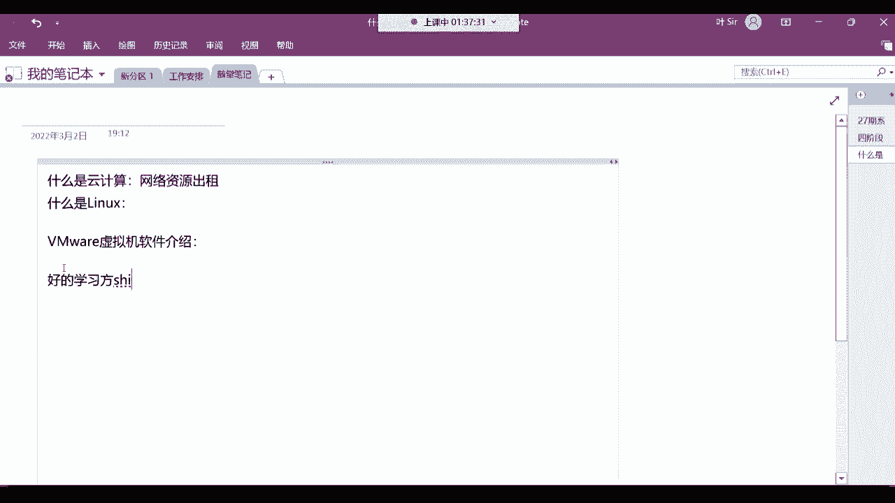

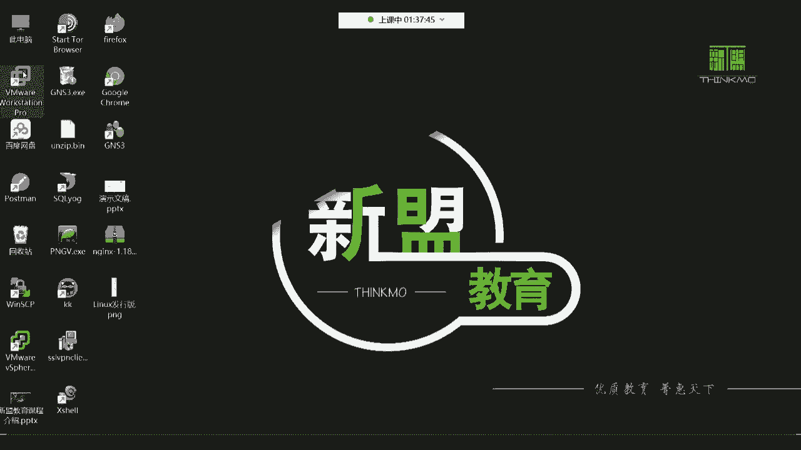

我们将安装CentOS系统。在学习阶段，我们以CentOS为主。这里需要说明CentOS与Red Hat之间的关系。你可以这样理解：CentOS是从Red Hat克隆过来的。克隆意味着它们使用同一个模子。因此，这两个系统你学哪个都可以。以后到企业里，如果企业使用Red Hat，也没有关系，因为两者的命令和操作使用方式完全一样。我们以免费的CentOS为主，因为它在企业服务器领域应用广泛，且大部分企业倾向于使用免费方案。这两个系统完全一样。

## 第一步：下载必要文件

首先，我们需要下载安装系统所需的软件和镜像文件。

以下是需要从提供的“VIP大礼包”中下载到电脑上的文件列表：
*   VMware虚拟机软件及其激活密钥。
*   Xshell远程连接工具（如果已有其他工具，可使用自己的）。
*   CentOS 7系统镜像文件（例如CentOS-7.6版本，7.x系列均可，不推荐使用已停止维护的CentOS 8）。

> 注意：Red Hat Enterprise Linux 8镜像是为准备红帽认证考试的人员准备的，不影响本次学习。

## 第二步：安装虚拟机软件并创建虚拟机

将VMware软件下载到电脑后，双击打开。首次打开时，界面左侧是空的，我们需要创建新的虚拟机。

1.  **创建新的虚拟机**：点击“创建新的虚拟机”。
2.  **选择配置类型**：选择“典型”配置，然后点击“下一步”。
3.  **安装客户机操作系统**：选择“稍后安装操作系统”，然后点击“下一步”。这样我们可以自定义更多设置。
4.  **选择客户机操作系统**：选择“Linux”，版本选择“CentOS 7”，然后点击“下一步”。
5.  **命名虚拟机**：为虚拟机起一个名字，例如“CentOS7-学习机-90”。名称后的“90”计划作为该虚拟机IP地址的最后一位，方便后续识别。然后点击“下一步”。
6.  **指定磁盘容量**：默认分配20GB磁盘空间。这个空间是虚拟机可使用的最大容量，会随着实际使用逐步从物理机划分，并非一次性占用。选择“将虚拟磁盘存储为单个文件”，然后点击“下一步”。
7.  **自定义硬件**：点击“自定义硬件”，在这里我们可以调整虚拟机的硬件配置。

## 第三步：自定义虚拟机硬件

虚拟机软件的本质是虚拟出一套完整的硬件平台（如CPU、内存、硬盘、网卡），以便在其上安装操作系统。

在“自定义硬件”窗口中，进行如下设置：

*   **内存**：建议设置为2048 MB（即2GB）。虚拟机运行时才会消耗物理机内存，关机后则释放。
*   **处理器**：根据物理机CPU的核心数，为虚拟机分配合适的核心数量，例如2个核心。
*   **新CD/DVD**：选择“使用ISO映像文件”，然后浏览并选中之前下载的CentOS 7系统镜像文件。
*   **网络适配器**：选择网络连接模式。这里有三种模式：
    *   **桥接模式**：虚拟机网卡与物理机网卡直接绑定。虚拟机和物理机需要在同一IP网段才能通信，且虚拟机可直接通过物理机访问外网。适合网络环境固定（如台式机）的情况。
    *   **NAT模式**：虚拟机通过物理机共享IP地址访问外网。虚拟机和物理机可以不在同一IP网段，它们通过VMware在物理机上创建的虚拟网卡（如VMnet8）进行通信。适合网络环境经常变化（如笔记本电脑）的情况。**我们选择此模式**。
    *   **仅主机模式**：虚拟机仅能与物理机通信，无法访问外网。
*   **移除无用硬件**：移除不需要的硬件，如USB控制器、声卡、打印机，以节省资源。

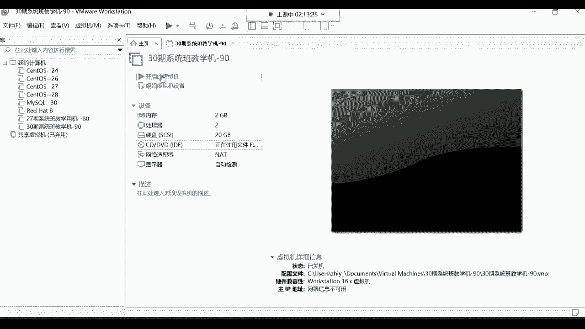

硬件设置完成后，点击“关闭”，然后点击“完成”。至此，一台空白虚拟机就创建好了。

## 第四步：安装CentOS系统

现在，我们开始在这台虚拟机上安装操作系统。

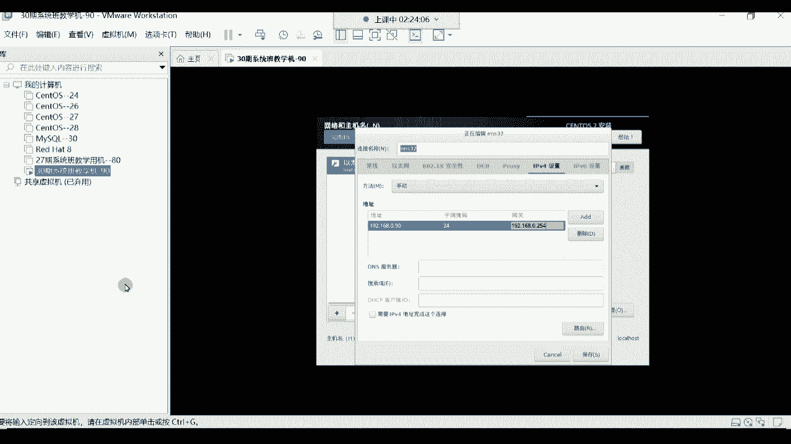

1.  **启动虚拟机**：点击“开启此虚拟机”。
2.  **选择安装选项**：虚拟机启动后，会进入安装菜单。使用键盘上下键选择“Install CentOS 7”，然后按回车键开始安装。
    > 提示：按 `Ctrl+Alt` 组合键可以将鼠标从虚拟机中释放回物理机。
3.  **选择安装语言**：在安装界面，选择“中文 - 简体中文”，然后点击“继续”。
4.  **安装信息摘要**：在此界面进行关键配置：
    *   **软件选择**：点击进入。对于企业环境和个人学习，建议选择“最小安装”，它只包含最基本的功能。我们额外勾选“兼容性程序库”和“开发工具”。完成后点击“完成”。
    *   **安装位置**：点击进入。选择我们为虚拟机创建的20GB硬盘，分区方案选择自动配置，然后点击“完成”。
    *   **网络和主机名**：点击进入。
        *   主机名暂时保持默认（localhost），后期可通过命令修改。
        *   点击“配置”来设置网络。在“IPv4设置”中，将方法改为“手动”。
        *   点击“添加”按钮，输入以下网络信息（请根据你的网络环境调整，DNS请使用正确的地址如`223.5.5.5`）：
            *   **地址**：`192.168.0.90` (与虚拟机命名对应)
            *   **子网掩码**：`255.255.255.0` 或 `24`
            *   **网关**：`192.168.0.254`
            *   **DNS服务器**：`223.5.5.5` (阿里云DNS)
        *   配置完成后，点击“保存”。回到上一界面，将网卡开关打开，然后点击“完成”。
5.  **开始安装**：点击右下角的“开始安装”。
6.  **设置root密码**：在安装过程中，点击“ROOT密码”进行设置。为root账户设置一个强度适中且自己容易记住的密码（例如`123456`），点击两次“完成”。
7.  **创建用户**：点击“创建用户”，创建一个普通用户，例如用户名为`test`，同样为其设置密码，点击两次“完成”。

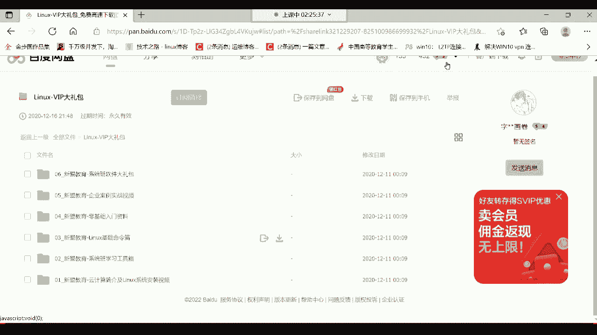

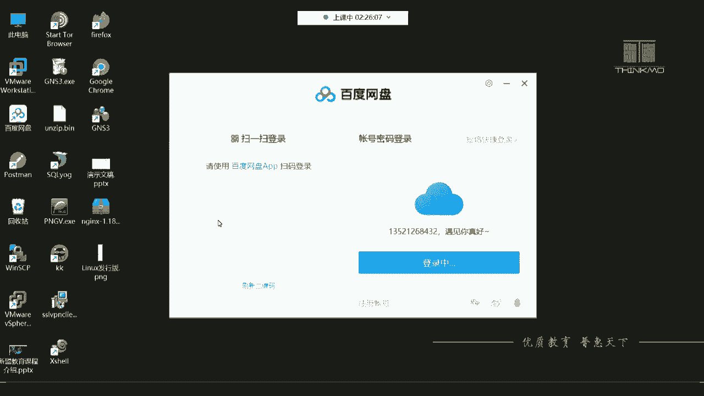

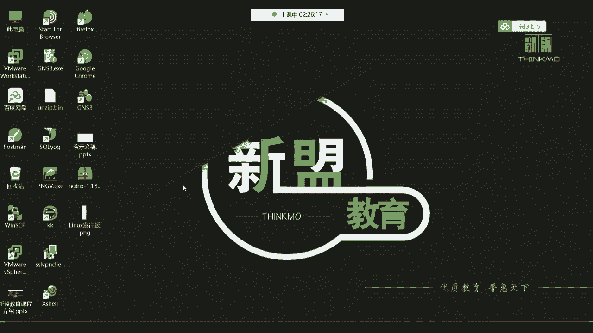

系统将开始自动安装。安装过程需要一些时间，期间会显示已安装的软件包数量。

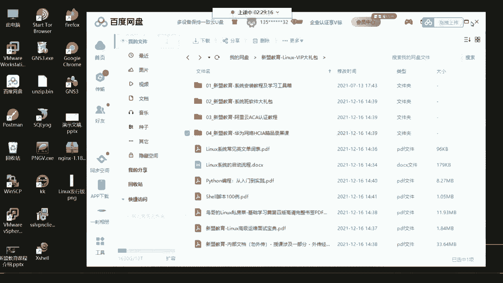

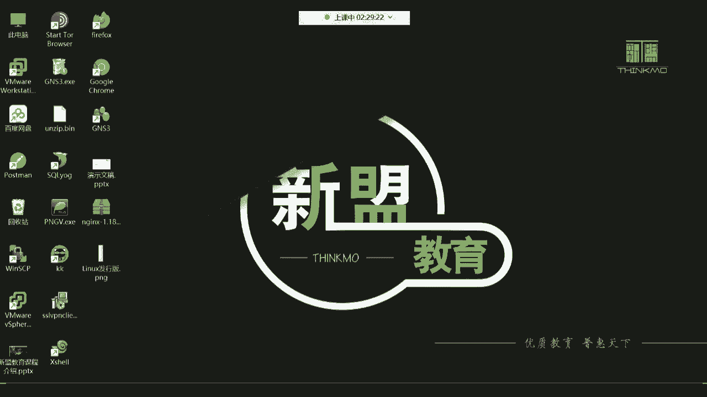

## 总结

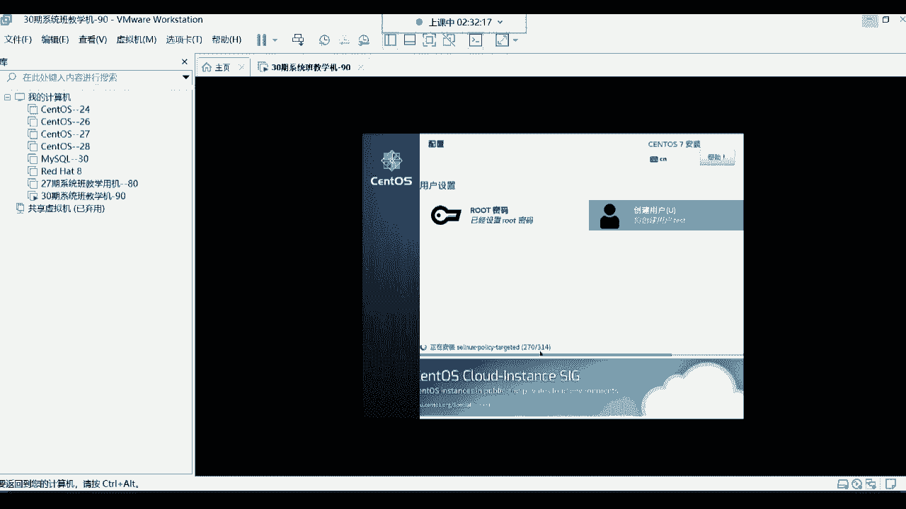

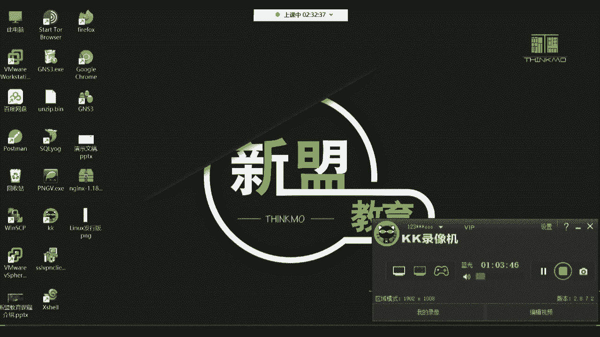

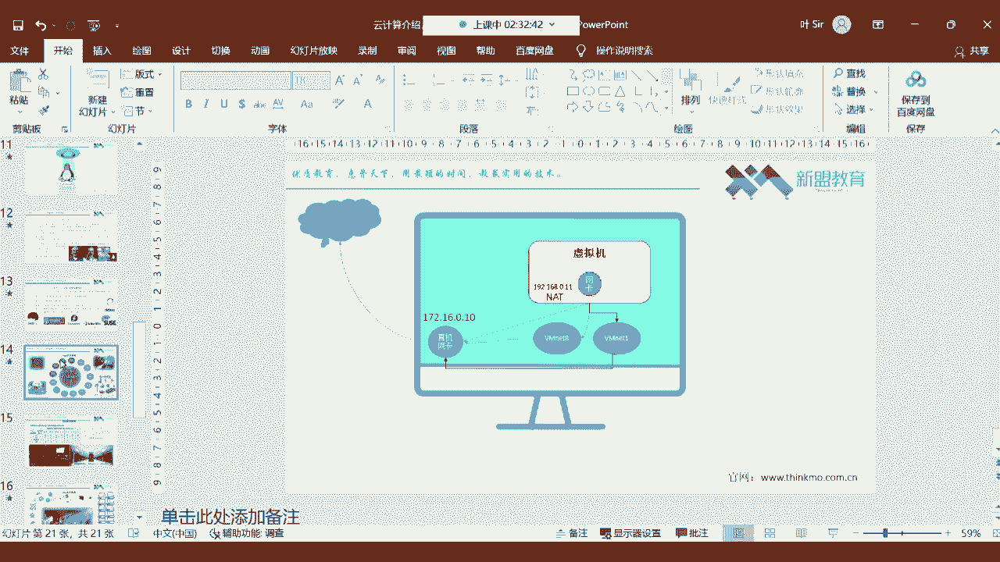

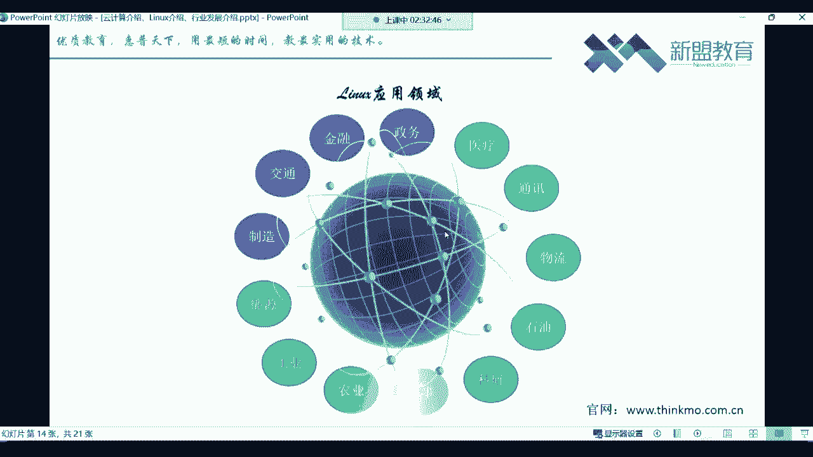

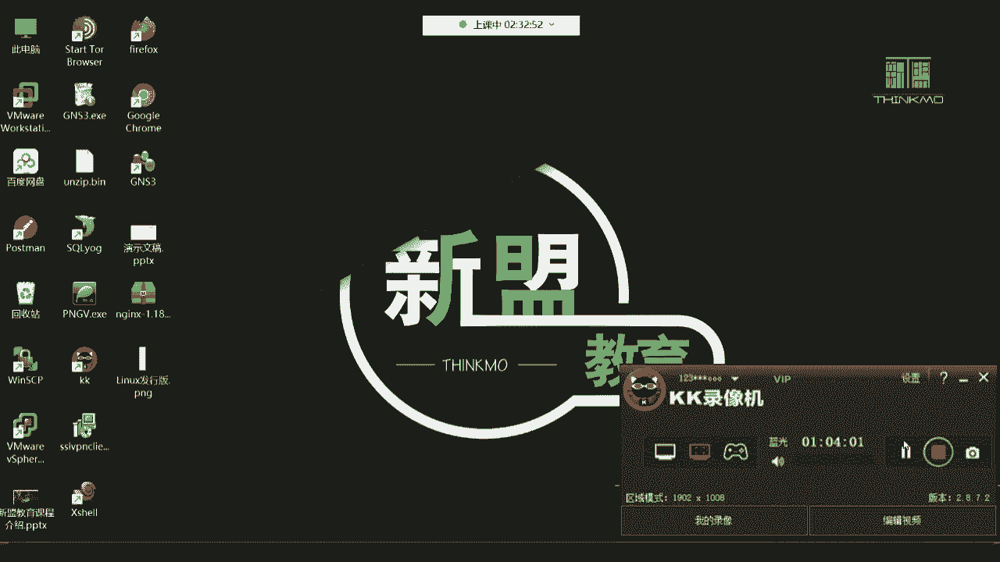

本节课中，我们一起学习了如何在VMware中安装CentOS系统。我们首先准备了所需的软件和系统镜像，然后逐步创建并配置了虚拟机硬件，特别是理解了三种网络模式的区别并选择了NAT模式。最后，我们启动了安装过程，完成了语言、软件、磁盘分区、网络配置以及账户密码等关键设置。系统安装完成后，我们就拥有了一个可以开始学习Linux操作的实验环境。