# Linux运维进阶：P33：RPM软件包管理、YUM本地软件仓库搭建、YUM常用命令学习 📦


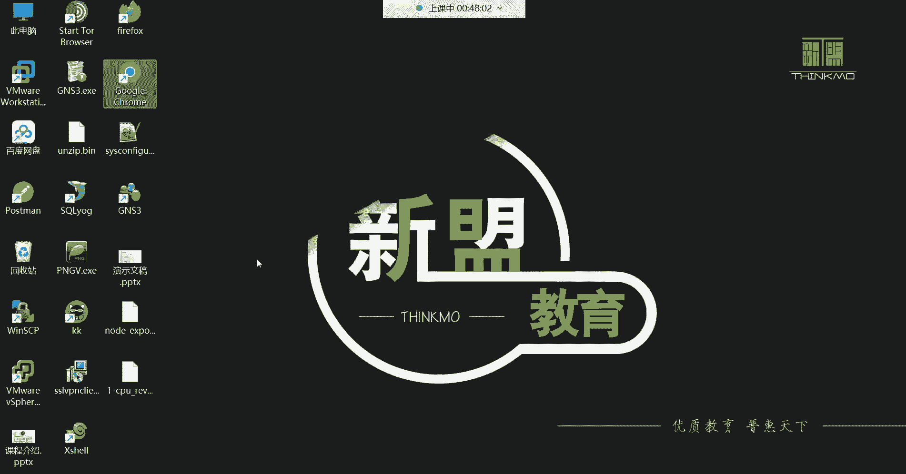


在本节课中，我们将要学习RPM软件包管理的基础，掌握如何搭建本地的YUM软件仓库，并学习YUM工具的一系列常用命令。通过本地仓库，我们可以便捷地安装、查询和管理软件包，并自动解决依赖关系，极大地简化了软件管理流程。


## 本地YUM仓库搭建 🏗️

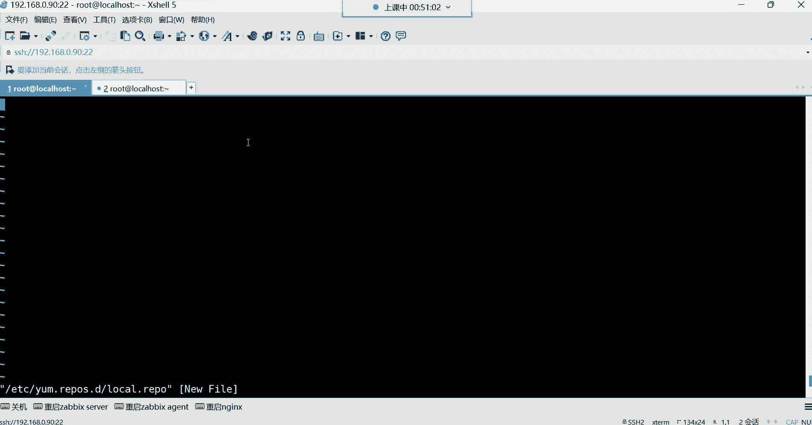


上一节我们介绍了RPM软件包的基本概念。本节中我们来看看如何搭建一个本地的YUM软件仓库。本地仓库意味着软件包的来源位于本机，通常是我们挂载的系统镜像文件。

### 配置仓库文件

YUM命令在安装软件时会自动到特定路径下寻找仓库配置文件。因此，创建配置文件必须遵循严格的路径和命名规则。

以下是创建本地仓库配置文件的步骤：

1.  **路径与文件名**：配置文件必须位于 `/etc/yum.repos.d/` 目录下，且文件名必须以 `.repo` 作为扩展名。
2.  **编辑配置文件**：使用文本编辑器（如Vim）在该目录下创建并编辑一个 `.repo` 文件，例如 `local.repo`。
3.  **编写配置内容**：在文件中写入以下配置信息。


```bash
[local]
name=local centos-iso
baseurl=file:///mnt/centos
enabled=1
gpgcheck=0
```


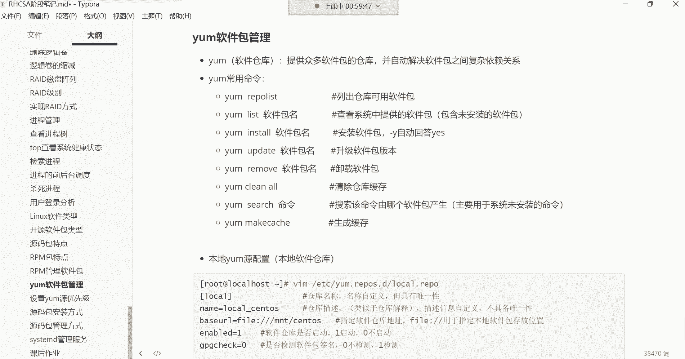


### 配置项详解


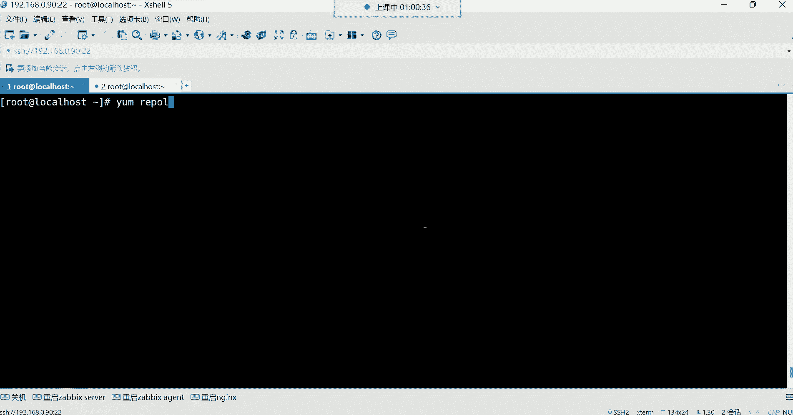

现在，我们来详细解释配置文件中的每一行含义：

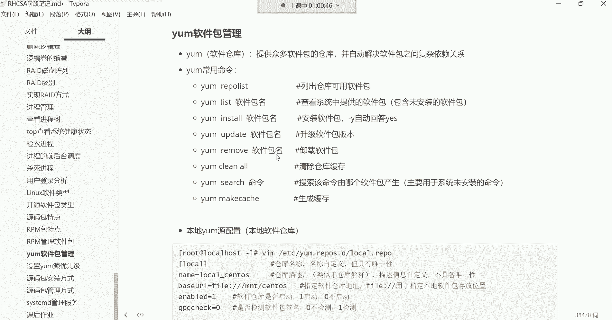

*   **`[local]`**：定义仓库的名称，名称自定义，放在中括号内。
*   **`name=local centos-iso`**：仓库的描述信息，用于说明仓库来源。
*   **`baseurl=file:///mnt/centos`**：**这是最重要的配置项**。它定义了软件包的实际存放路径。`file://` 是固定格式，后面接本地目录的绝对路径。此路径应指向包含 `Packages` 目录的挂载点。
*   **`enabled=1`**：启用此仓库。`1` 表示启用，`0` 表示禁用。此项可省略，默认即为启用状态。
*   **`gpgcheck=0`**：是否校验软件包的GPG签名。`0` 表示不校验。对于自建的本地仓库，通常设置为 `0` 以简化流程。

配置完成后保存退出。YUM在安装软件时，便会读取此文件，并从 `baseurl` 指定的路径中查找和安装软件包及其依赖。


## YUM常用命令学习 🛠️

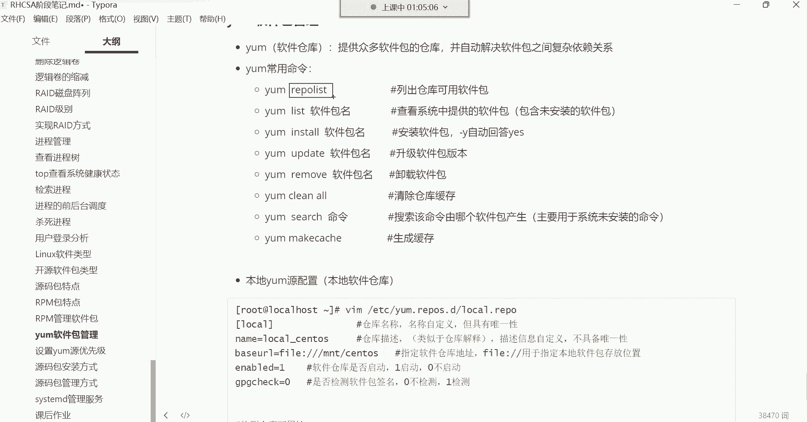


成功搭建本地仓库后，我们就可以使用YUM命令来高效地管理软件了。与RPM相比，YUM最大的优势在于能自动处理依赖关系。

### 查询仓库与软件包

首先，我们来学习如何查看仓库信息和搜索软件包。

*   **`yum repolist`**：列出所有已配置并启用的仓库信息，包括仓库ID、名称和软件包数量。
*   **`yum list`**：列出仓库中所有可用的软件包（包括已安装和未安装的）。可以结合管道符 `|` 和 `grep` 命令进行过滤搜索。


例如，想搜索包含“java”关键字的软件包，可以使用：
```bash
yum list | grep java
```
如果结果太多，可以进一步过滤：
```bash
yum list | grep java | grep jdk
```

### 安装与移除软件包

接下来，我们看看如何使用YUM安装和卸载软件。

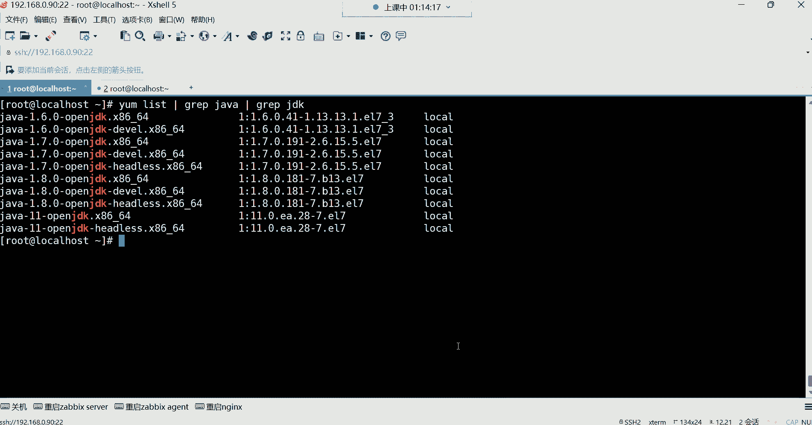

*   **`yum install <package_name>`**：安装指定的软件包。YUM会自动解析并安装所有依赖包。
*   **`yum install -y <package_name>`**：安装软件包时自动确认所有提示（回答“yes”），适用于脚本或无需确认的场景。
*   **`yum remove <package_name>`**：移除指定的软件包。**注意**：默认不会移除被其他软件包依赖的包。


例如，安装VIM编辑器：
```bash
yum install -y vim
```
YUM会自动解决VIM所需的数十个依赖包，而无需手动逐个安装。


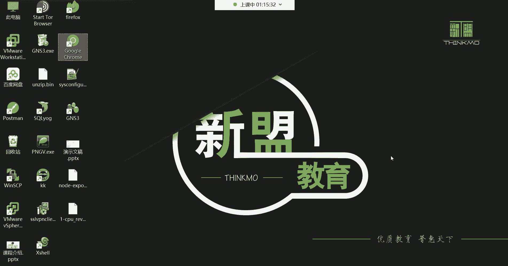

### 其他实用命令

除了安装和查询，YUM还有其他一些实用功能。

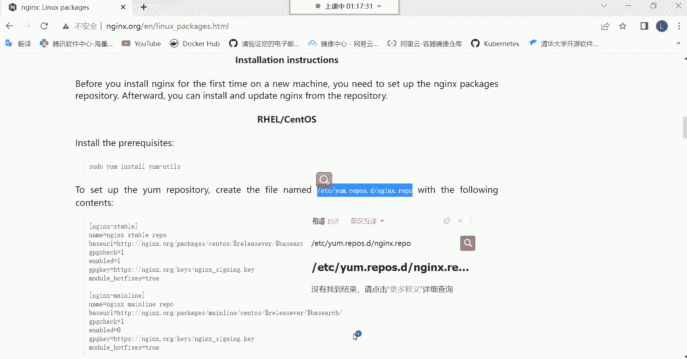


*   **`yum update <package_name>`**：更新指定的软件包到仓库中的最新版本。更新前建议做好数据备份。
*   **`yum search <keyword>`**：在所有仓库的软件包名称和描述中搜索包含关键字的包。
*   **`yum provides <command>`**：查找某个命令或文件是由哪个软件包提供的。


## 网络YUM仓库简介 🌐

除了本地仓库，在实际工作中我们更常使用网络仓库。网络仓库的软件包来源在互联网上，通常由软件官方或发行版社区维护。

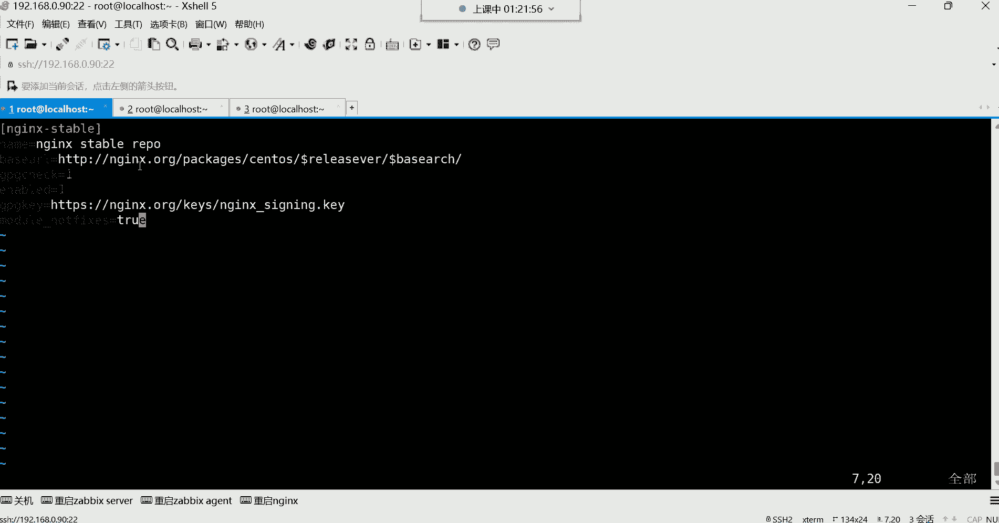

配置网络仓库的方法与本地仓库类似，核心区别在于 `baseurl` 指向一个HTTP或HTTPS网址，并且通常需要启用GPG签名检查（`gpgcheck=1`），并指定对应的密钥地址（`gpgkey`）。

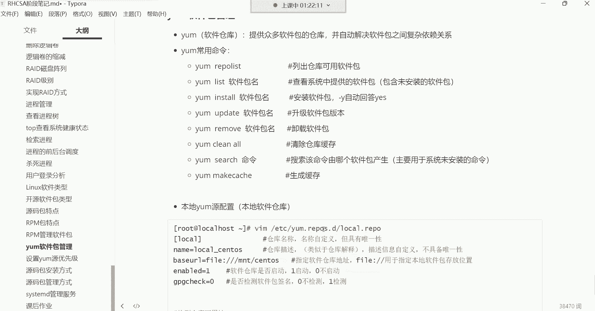


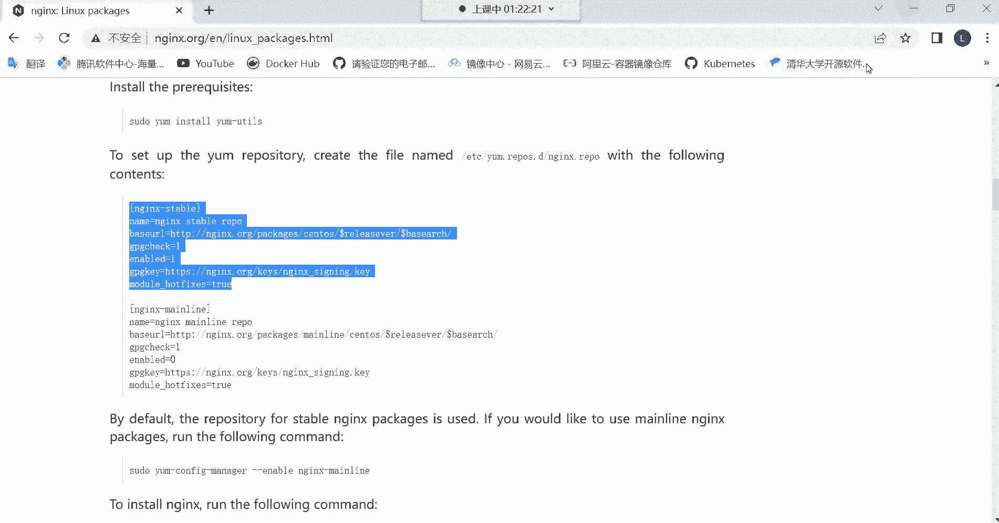


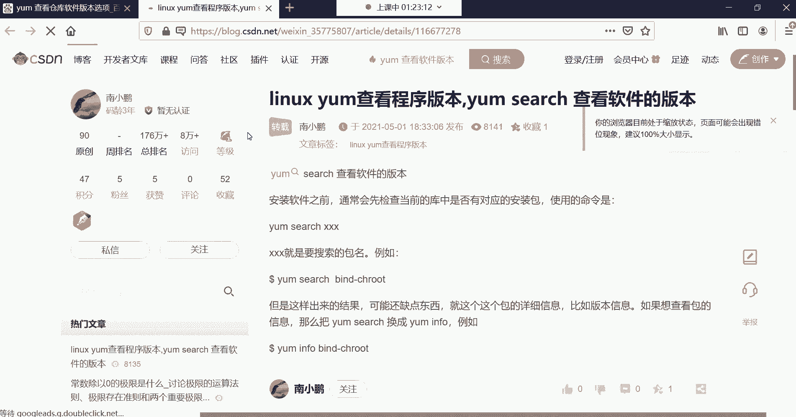

例如，配置一个NGINX官方网络仓库：
```bash
[nginx-stable]
name=nginx stable repo
baseurl=http://nginx.org/packages/centos/$releasever/$basearch/
gpgcheck=1
enabled=1
gpgkey=https://nginx.org/keys/nginx_signing.key
```
YUM在访问多个仓库时，会按照一定的优先级顺序进行处理。


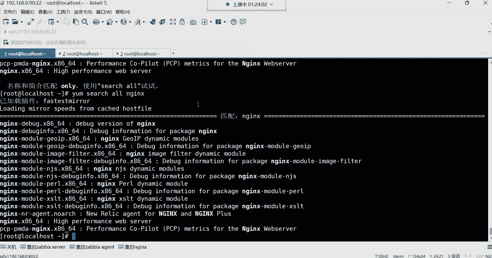


## 总结 📝

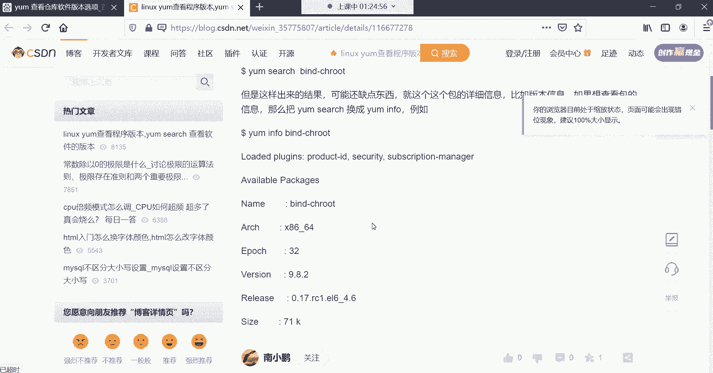


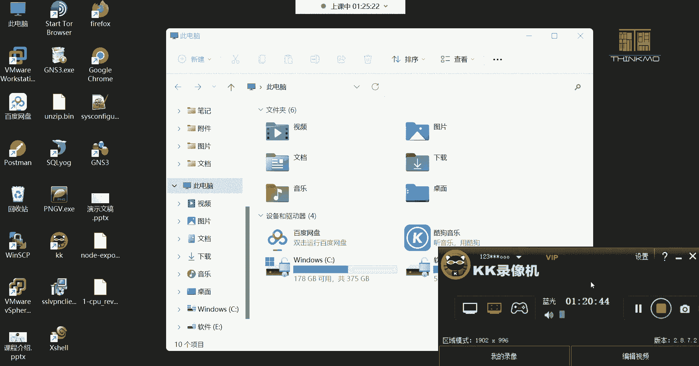

本节课中我们一起学习了Linux下软件包管理的核心知识。我们首先了解了RPM包管理的基础，然后重点实践了如何搭建一个本地的YUM软件仓库，通过配置 `/etc/yum.repos.d/` 目录下的 `.repo` 文件，将本地的系统镜像作为软件源。接着，我们系统学习了YUM的常用命令，包括 `yum install`（安装）、`yum remove`（移除）、`yum list`（列表）、`yum search`（搜索）等，并体会到YUM自动解决依赖关系的巨大便利性。最后，我们简单对比了本地仓库与网络仓库的配置差异。掌握这些技能，将使你在Linux系统中的软件管理工作中更加得心应手。