# Linux运维进阶：P37：编写与执行Shell脚本


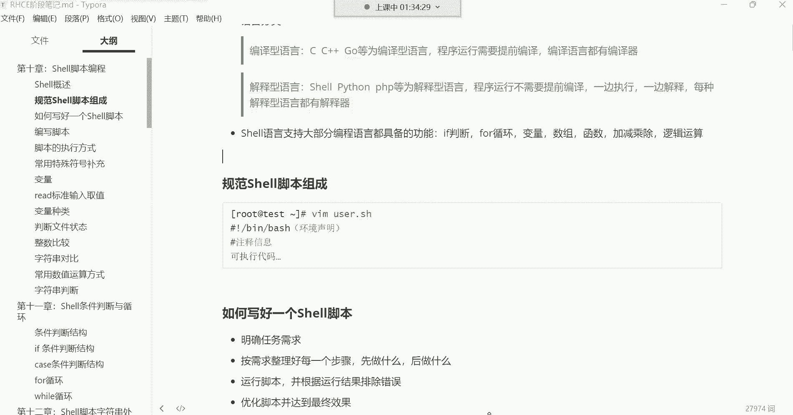

在本节课中，我们将学习如何编写和执行Shell脚本。我们将从一个简单的“Hello World”脚本开始，逐步了解编写脚本的核心思想、注意事项以及如何避免常见问题。通过本节课的学习，你将能够理解脚本的基本结构，并能够编写简单的自动化任务脚本。

---

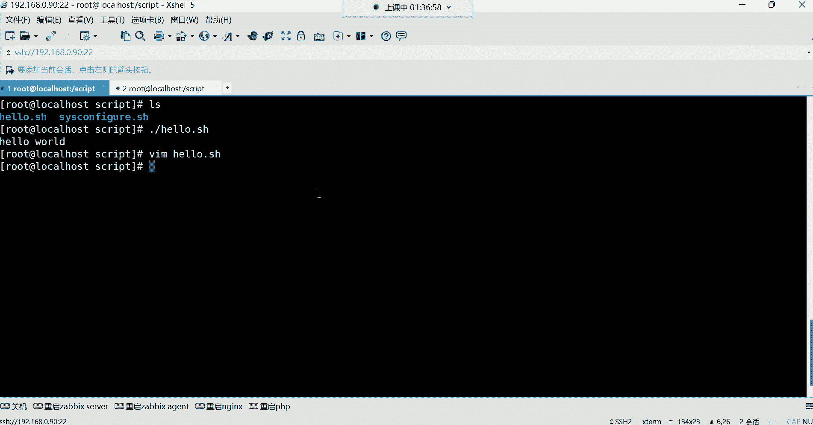

## 脚本的“仪式感”：从Hello World开始

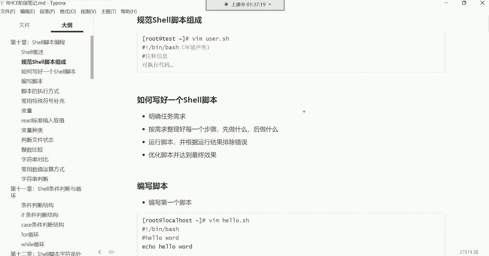

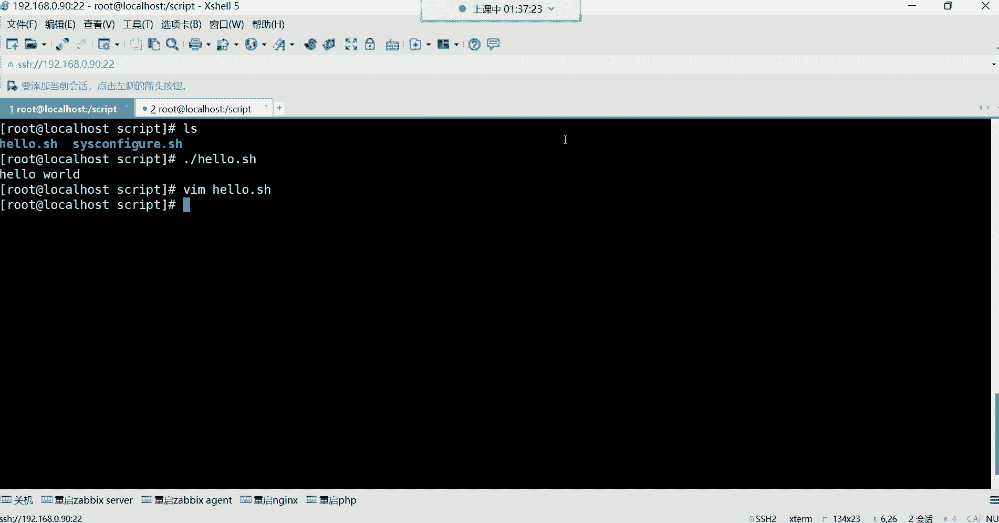


上一节我们介绍了Shell脚本的基本概念，本节中我们来看看如何编写第一个脚本。在编程世界中，第一个程序通常是输出“Hello World”，这是一种传统。无论是学习C语言、Python、Java还是Shell，这个“仪式”都适用。

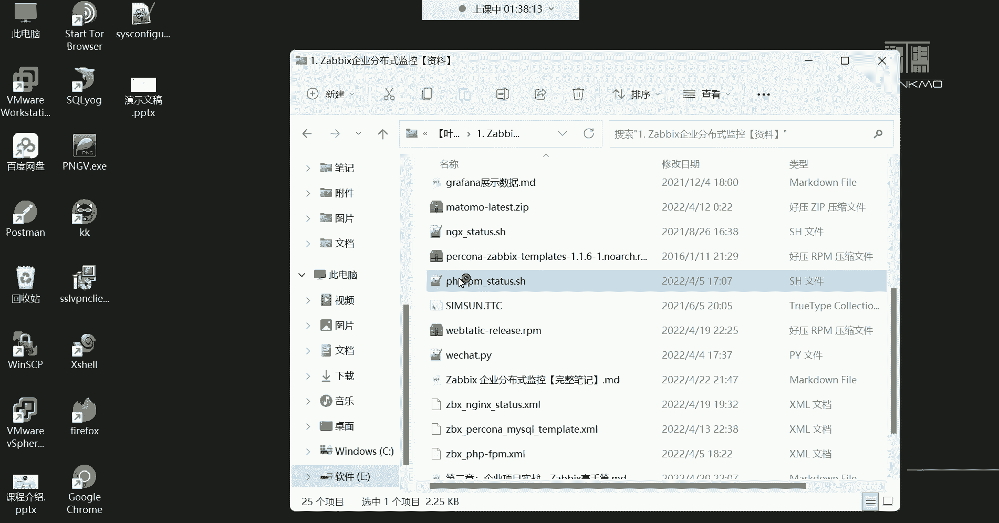

一个最简单的Shell脚本如下所示：

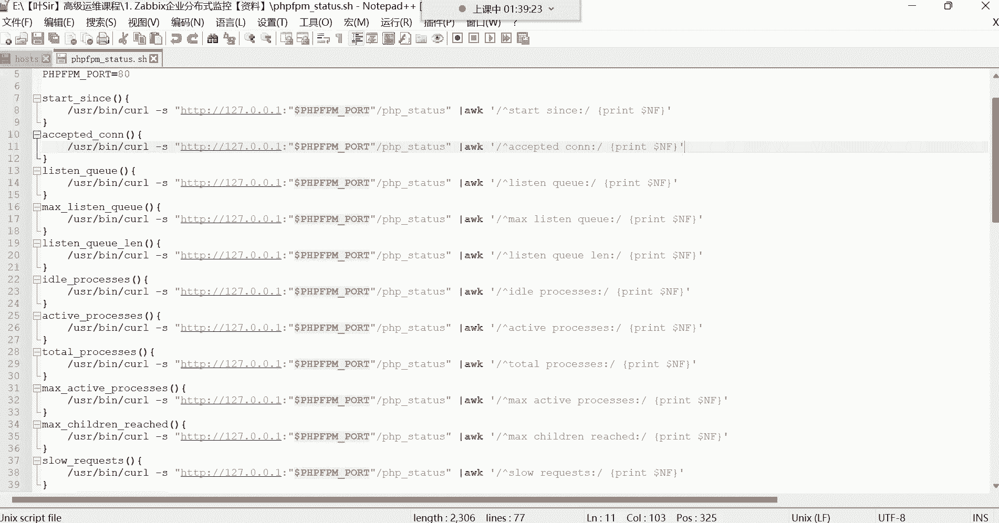

```bash
#!/bin/bash
echo "Hello World"
```

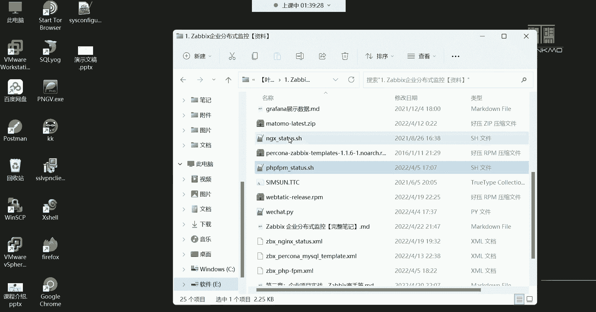

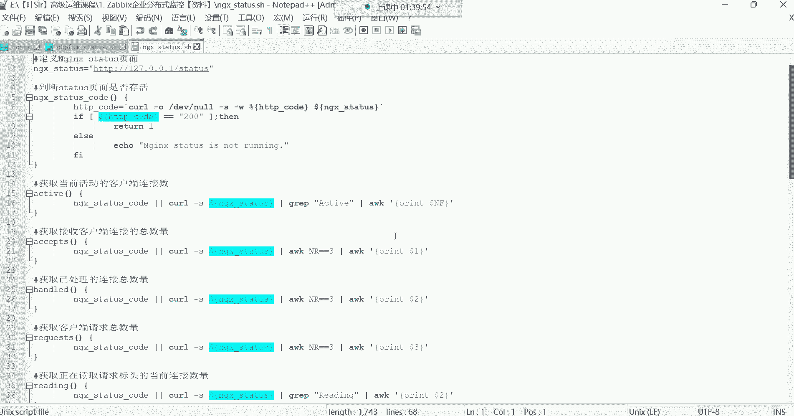

这个脚本的功能非常简单：使用`echo`命令在屏幕上输出“Hello World”。编写脚本的流程是：将命令写入文件，然后给文件添加执行权限，最后运行它。

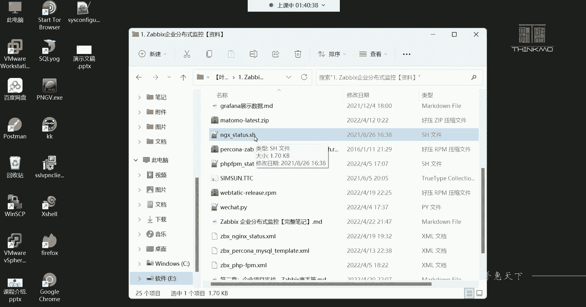

---

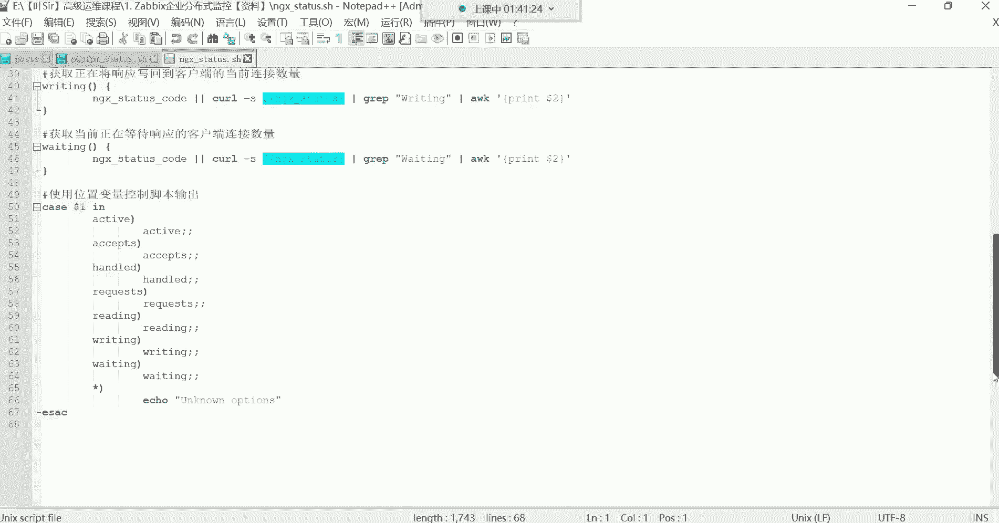

## 编写复杂脚本的思维逻辑

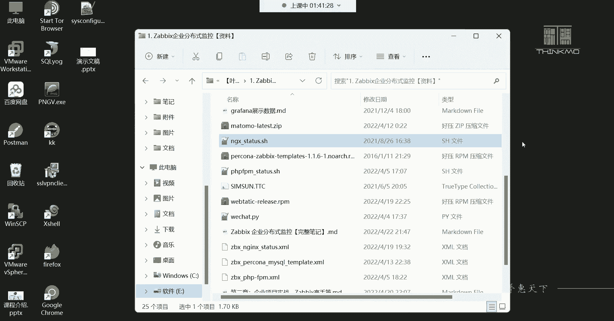

虽然第一个脚本很简单，但实际工作中可能需要编写复杂的脚本。复杂的脚本包含许多逻辑和步骤，如果逻辑混乱，脚本就会出错。

以下是编写一个有效脚本的通用思维流程：

1.  **明确任务需求**：确定脚本最终要实现什么目标。
2.  **整理实现步骤**：将大目标分解为具体、有序的小步骤。
3.  **编写与测试**：将步骤转化为命令写入脚本，并运行测试。
4.  **调试与优化**：根据测试结果修改错误，并优化脚本逻辑和性能。

这个逻辑与规划任何项目相似，核心在于先有计划，再分步执行。

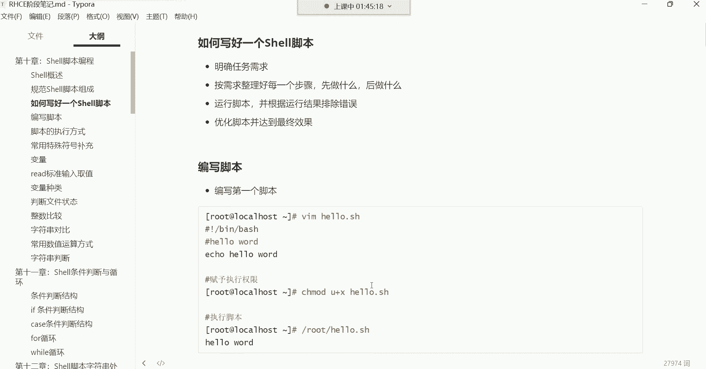

---

## 脚本编写的核心注意事项

在将命令行操作转化为脚本时，有一个至关重要的原则：**脚本中应避免使用交互式命令**。

交互式命令需要用户手动输入信息才能继续执行（例如设置密码的`passwd`命令，或编辑文件的`vim`命令）。如果脚本中包含这类命令，执行时会“卡住”，等待用户输入，这就失去了自动化脚本的意义。

以下是一个反面例子，脚本会因交互而中断：

```bash
#!/bin/bash
useradd user2
passwd user2  # 执行到这里会停止，等待终端输入密码
```

为了解决这个问题，我们需要使用非交互式的方法。例如，为用户设置密码可以使用以下方式：

```bash
#!/bin/bash
useradd user2
echo “123456” | passwd --stdin user2  # 通过管道非交互式设置密码
```

这样，脚本就能独立、顺畅地运行到底。

---

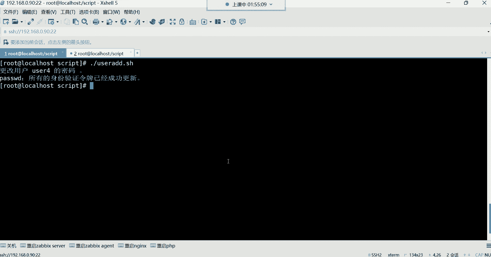

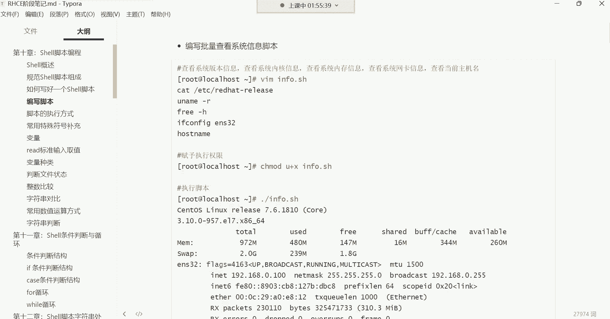

## 实践：编写一个系统信息查看脚本

让我们实践一下，编写一个查看基本系统信息的脚本。这个脚本的本质是将一系列查看命令有序地堆积在一起。

脚本内容示例（`sys_info.sh`）：

```bash
#!/bin/bash
echo “========== 系统版本信息 ==========”
cat /etc/centos-release
sleep 1

echo “========== 系统内核信息 ==========”
uname -rs
sleep 1

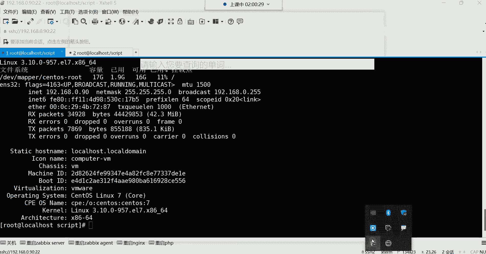

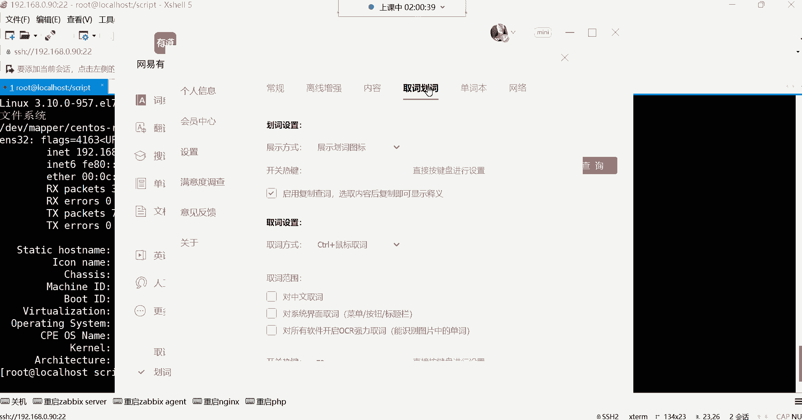

echo “========== 内存使用信息 ==========”
free -h
sleep 1

echo “========== 根分区磁盘信息 ==========”
df -h /
sleep 1

echo “========== 网络配置信息 ==========”
ifconfig ens33
sleep 1

echo “========== 主机名信息 ==========”
hostnamectl
```

在这个脚本中：
*   `echo`命令用于输出提示信息，让脚本执行过程更清晰。
*   `sleep`命令让脚本在执行每条命令后暂停1秒，提升可读性。
*   其他命令都是常见的系统查看命令，它们都是非交互式的。

给脚本添加执行权限并运行：
```bash
chmod +x sys_info.sh
./sys_info.sh
```

脚本会按顺序执行每条命令，并将结果输出到屏幕。

---

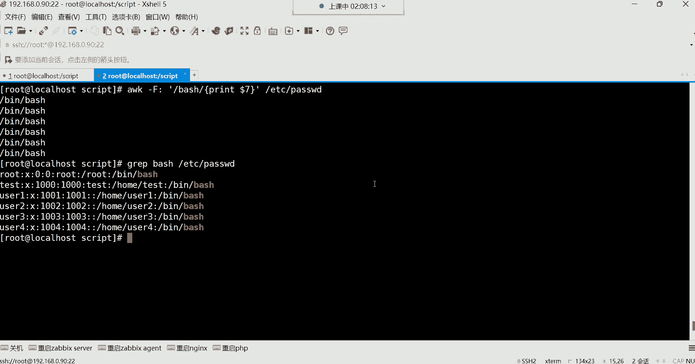

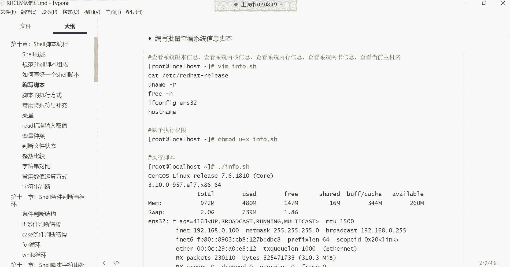

## 脚本的存放与共享

脚本写好后，存放位置也有讲究：
*   **个人使用**：可以放在任何你有权限的目录，例如家目录。
*   **团队共享**：如果需要其他用户也能使用，应该将脚本放在一个公共目录（如`/opt/scripts`），并设置合适的权限（例如`755`），让其他人可以执行但不能随意修改。

---

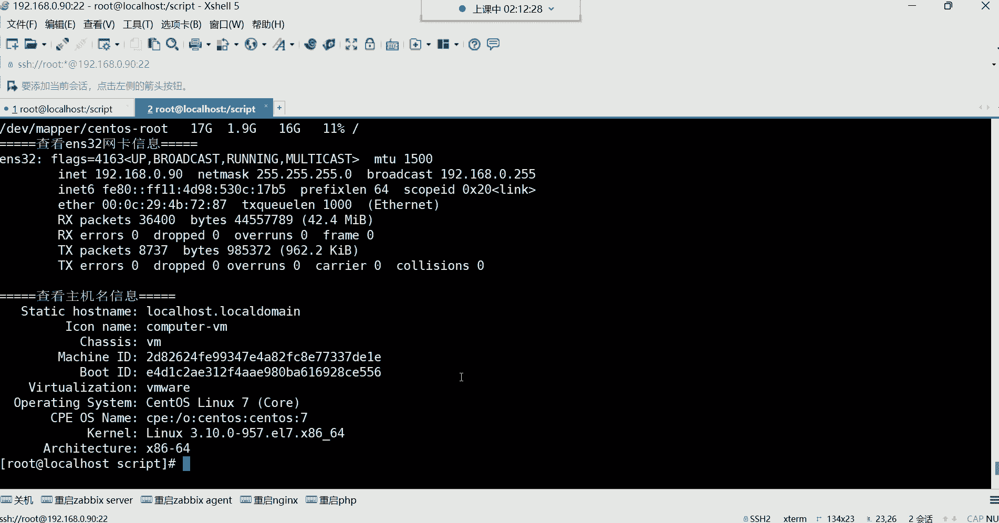

本节课中我们一起学习了Shell脚本的编写与执行。我们从最简单的“Hello World”脚本入手，理解了编写脚本的基本流程。更重要的是，我们掌握了编写实用脚本的核心思想：**明确需求、分步实现、避免交互**。通过编写系统信息查看脚本，我们实践了如何将多个命令组织成一个自动化的任务。记住，脚本是提高效率的工具，其核心在于用机器能理解的方式，清晰无误地描述你的操作逻辑。