# Linux运维进阶：P38：编写脚本与执行方式 🖥️

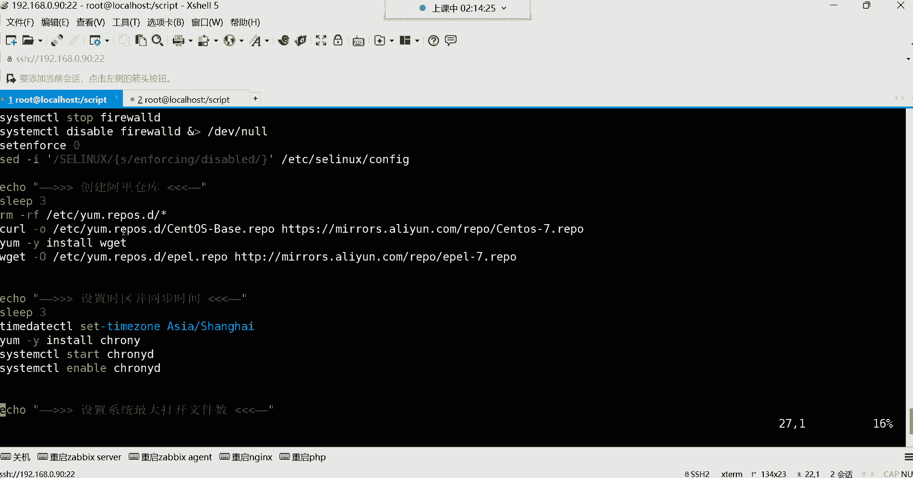


在本节课中，我们将学习如何编写一个实用的Shell脚本，并了解脚本的不同执行方式。我们将通过一个“搭建本地YUM软件仓库”的实例，来掌握脚本编写的基本思路、优化技巧以及如何提升脚本的用户体验。

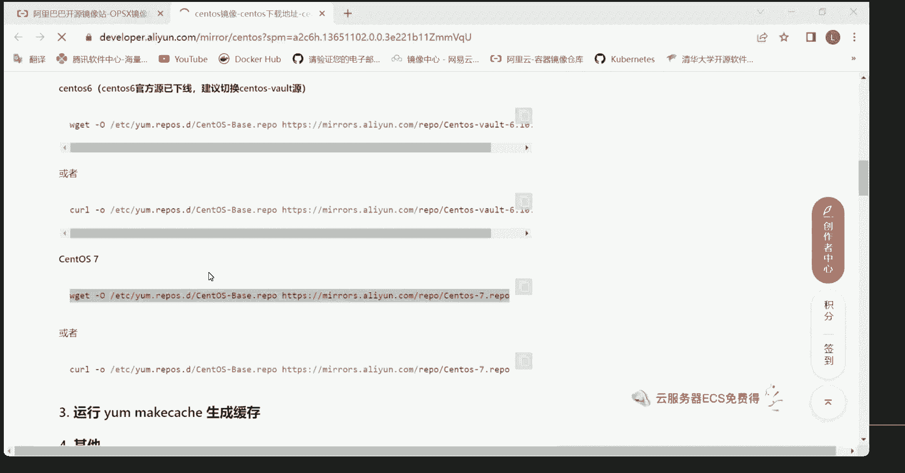

## 脚本编写基础

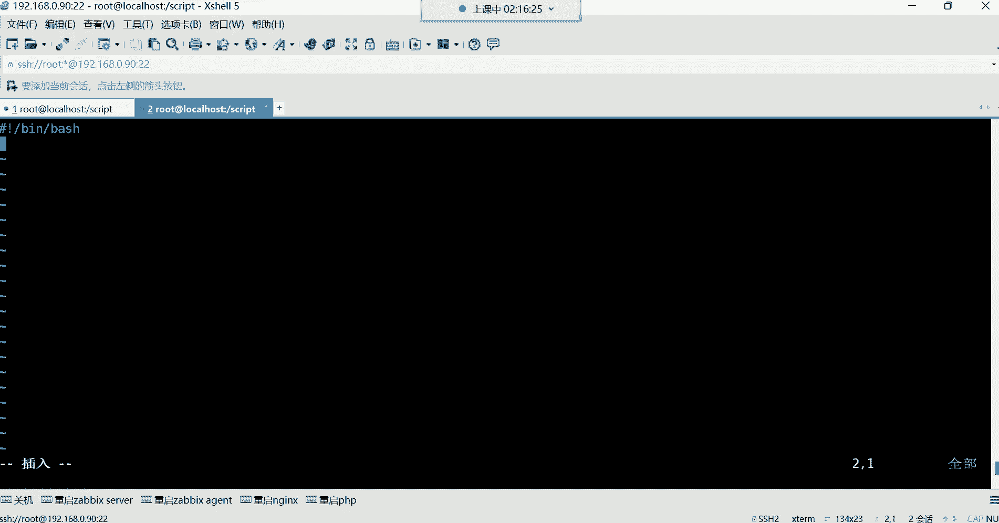

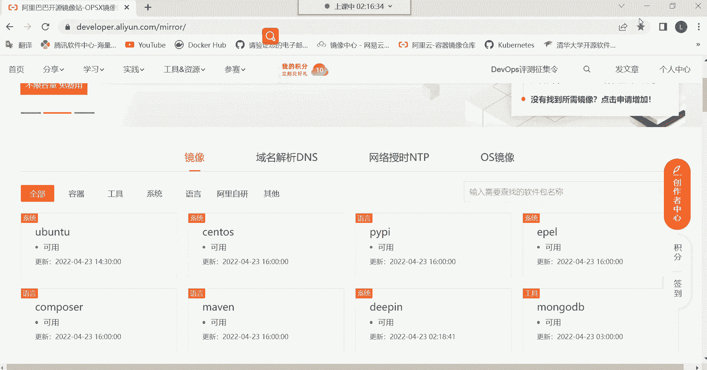

上一节我们介绍了脚本的基本概念。本节中，我们来看看如何将一系列命令组织成一个可执行的脚本。

脚本的本质是将需要手动重复执行的命令，按照逻辑顺序写入一个文本文件。例如，搭建本地YUM仓库通常包含挂载光盘、清理旧配置、创建仓库配置文件等步骤。

## 提升脚本可读性：使用 `sleep` 命令

如果脚本中的命令执行速度过快，输出信息会一闪而过，用户难以观察每一步的执行结果。为了让执行过程更清晰，我们可以使用 `sleep` 命令。

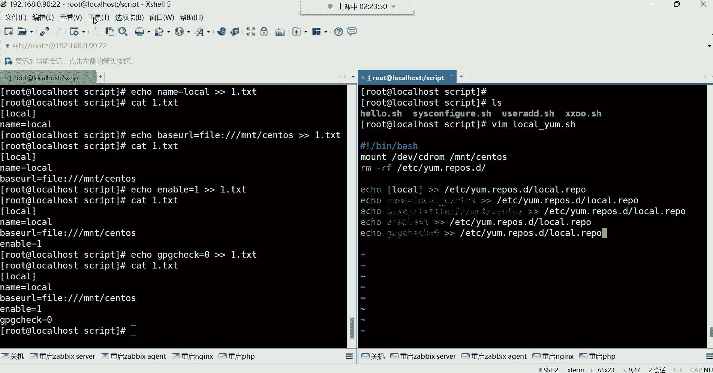

`sleep` 命令的功能是让脚本“休眠”或“等待”指定的秒数，然后再执行后续命令。这不是让命令执行变慢，而是在命令之间插入停顿，以便用户观察。


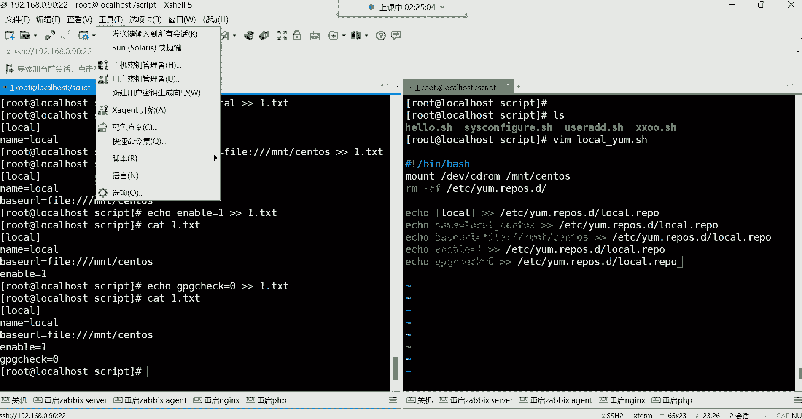

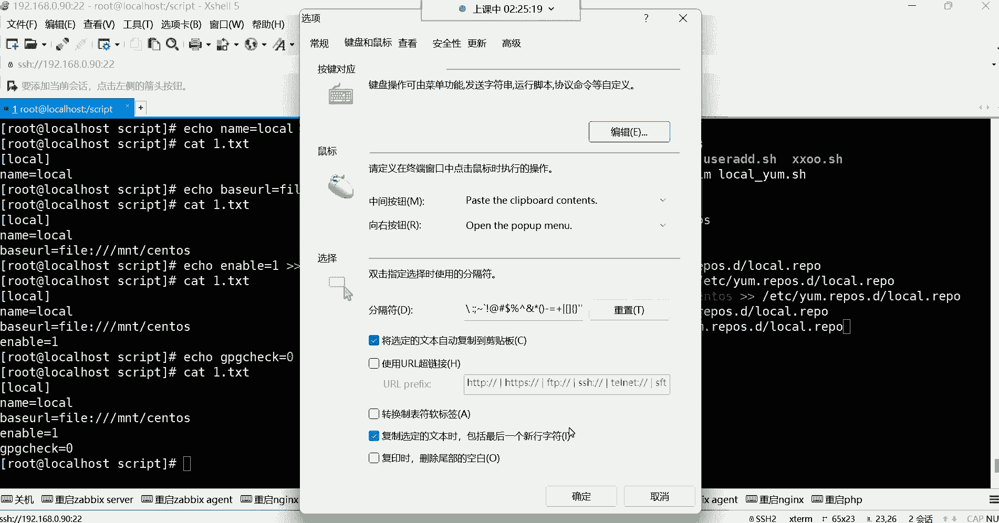

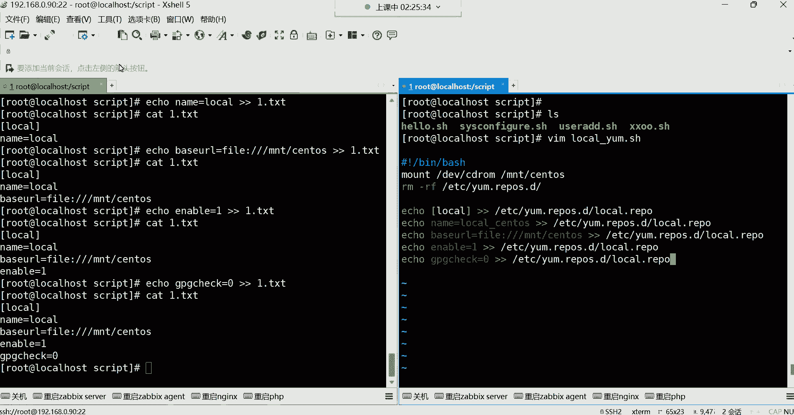


**代码示例：在命令间添加等待**
```bash
echo "正在执行第一步操作..."
sleep 3  # 等待3秒
echo "第一步操作完成，开始第二步..."
```

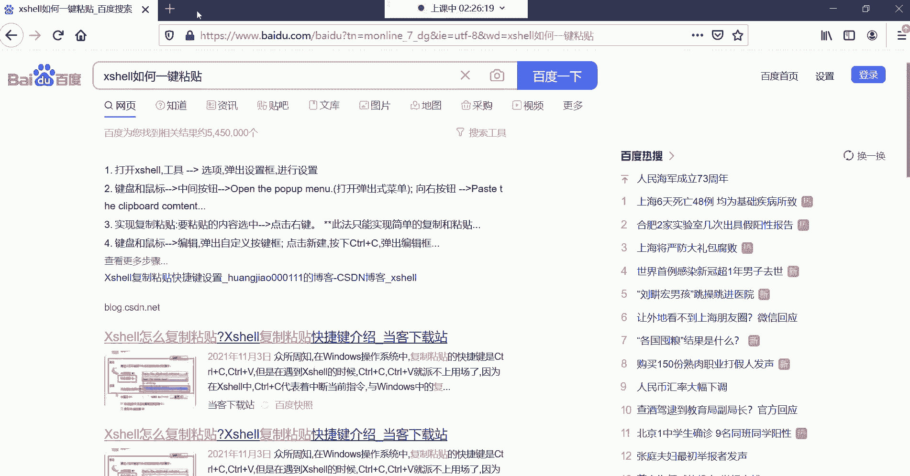


## 脚本内容实例解析

以下是一个搭建本地YUM仓库脚本的核心思路分解，其中包含了一些我们尚未深入学习的命令（如防火墙设置），但这不影响我们理解脚本的构建逻辑。

以下是脚本可能包含的关键步骤：
1.  **挂载光盘**：使用 `mount` 命令将系统安装光盘挂载到指定目录（如 `/mnt/cdrom`）。
2.  **清理旧配置**：使用 `rm -rf` 命令清空YUM仓库配置文件目录（`/etc/yum.repos.d/`），为创建新配置做准备。
3.  **创建仓库配置文件**：在 `/etc/yum.repos.d/` 目录下创建新的 `.repo` 文件，并写入仓库配置信息。
4.  **验证仓库**：使用 `yum repolist` 命令列出仓库信息，验证是否配置成功。

对于网络仓库（如阿里云仓库），步骤3通常是使用 `wget` 或 `curl` 命令直接下载现成的配置文件。

## 向文件写入内容：`echo` 与 `cat` 方法对比

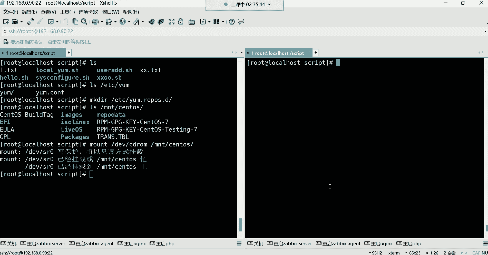


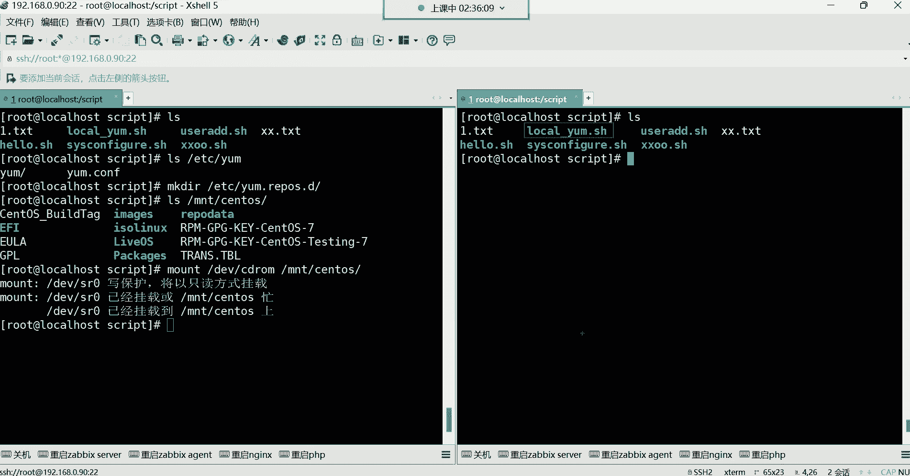

在脚本中，我们需要将配置内容写入文件。有两种常见方法：

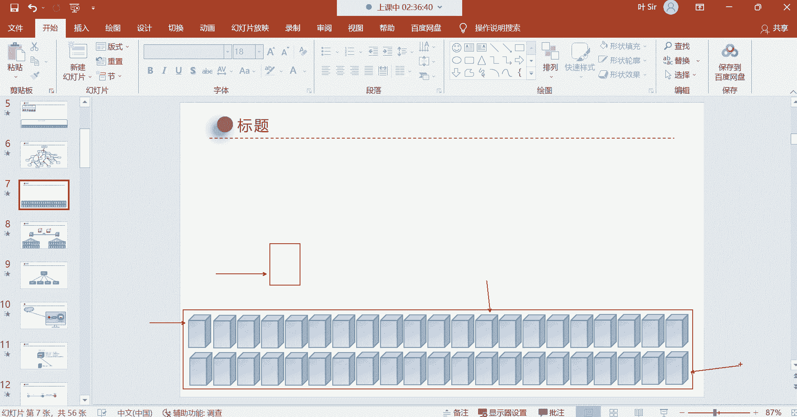

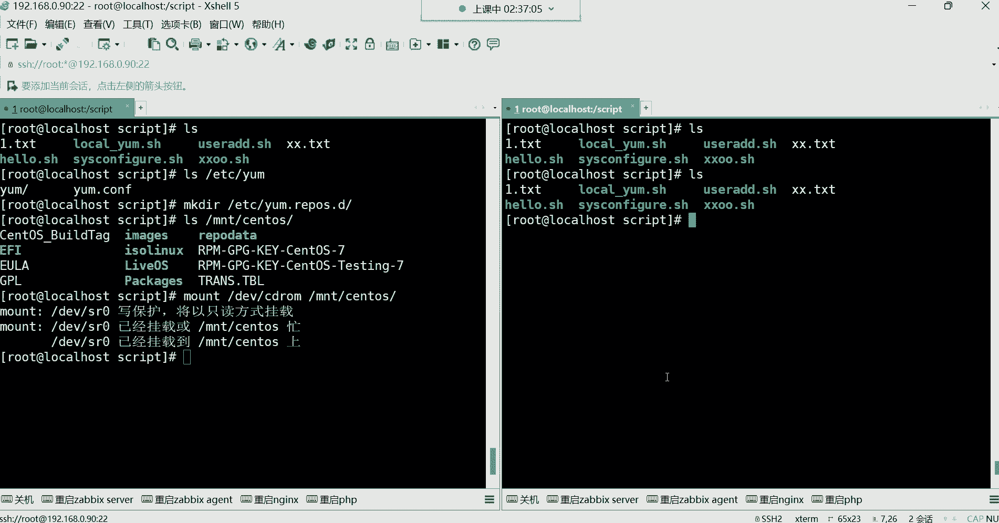

**1. 使用 `echo` 命令追加写入**
此方法通过多次执行 `echo` 并配合重定向符 `>>`（追加）将内容一行行写入文件。但这种方法在脚本中显得冗长且不够优雅。
```bash
echo “[local]” > /etc/yum.repos.d/local.repo  # 覆盖写入第一行
echo “name=Local Repository” >> /etc/yum.repos.d/local.repo # 追加第二行
# ... 后续需要更多 echo 命令
```


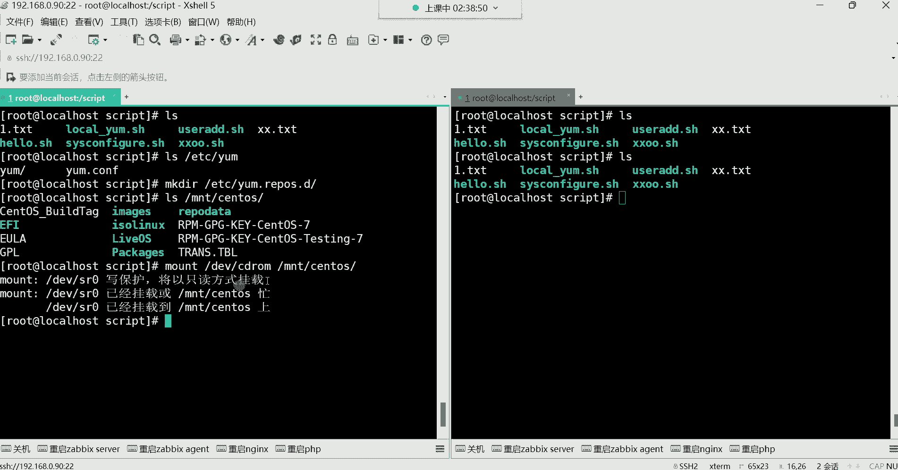

**2. 使用 `cat` 命令配合重定向输入（Here Document）**
这是一种更简洁、专业的方法。它使用 `<<` 重定向操作符和自定义的结束标记（通常用 `EOF`），将两个标记之间的所有内容一次性输入到目标文件。
```bash
cat > /etc/yum.repos.d/local.repo << EOF
[local]
name=Local Repository
baseurl=file:///mnt/cdrom
enabled=1
gpgcheck=0
EOF
```
**公式/概念**：`cat > 文件名 << 结束标记 ... 内容 ... 结束标记`
此格式是固定语法，`EOF`（End Of File）是常用的结束标记，你可以使用其他任意字符串，但需确保开始和结束标记一致。


## 脚本优化与用户体验

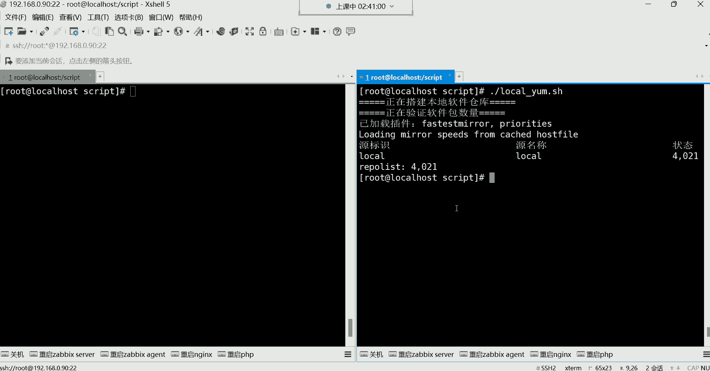

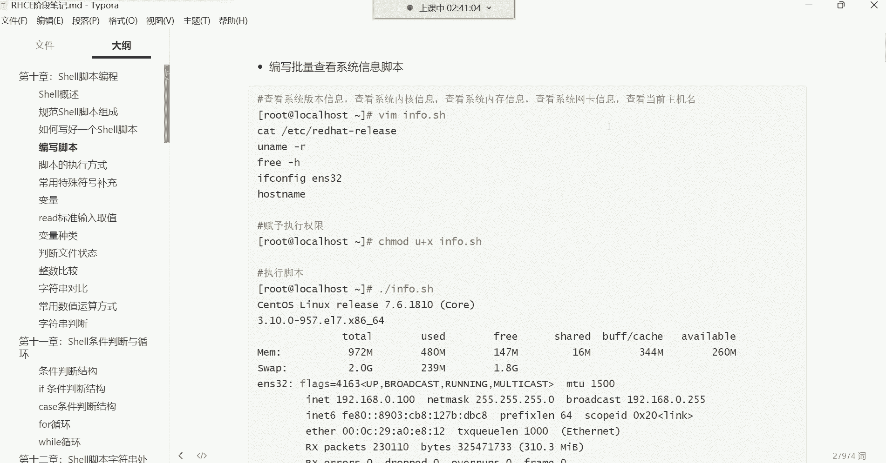

一个基础的脚本完成后，我们可以从以下几个方面进行优化，使其更实用、更友好。

**1. 增加提示信息**
在关键步骤前后使用 `echo` 输出提示，让用户知道脚本正在做什么。
```bash
echo “正在搭建本地软件仓库...”
# ...执行搭建命令...
echo “本地仓库搭建完成！”
```

**2. 简化输出信息**
默认命令的输出可能包含很多无关信息。我们可以使用管道 `|` 和文本过滤命令（如 `grep`）来提取关键信息。
```bash
# 只显示包含 ‘repolist’ 关键行的信息
yum repolist | grep repolist
```


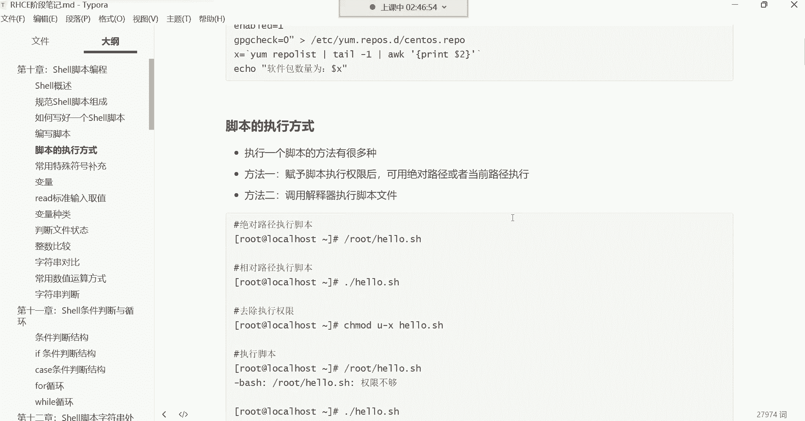

**3. 创造“体验感”（高级技巧）**
对于需要展示给他人或追求界面友好的脚本，可以加入一些动态效果，例如一个模拟的进度条。这通常涉及变量、循环等高级Shell特性，初期可以将其视为固定模板使用。
```bash
# 这是一个简单的进度条模拟示例
echo -n “正在处理 [”
for i in {1..20}; do
    echo -n “#”
    sleep 0.1
done
echo “] 完成！”
```

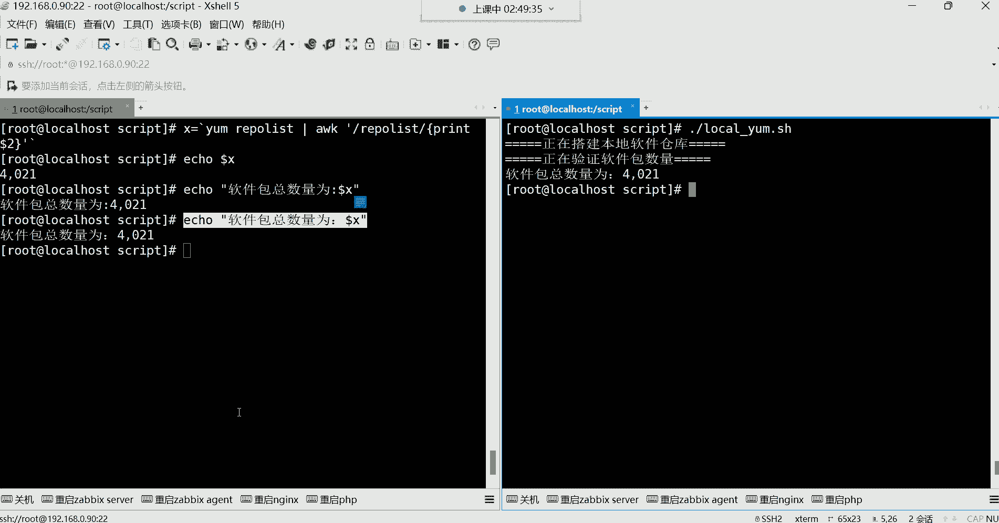

## 脚本的执行方式

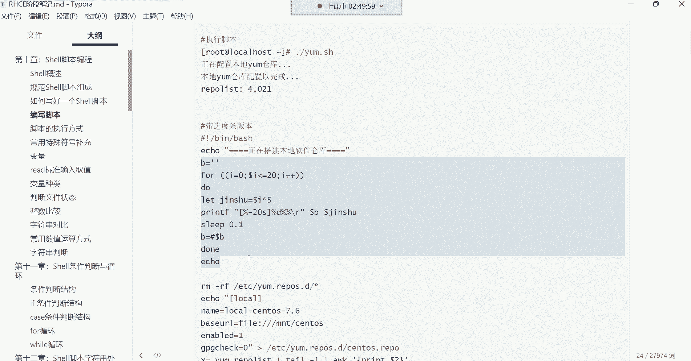

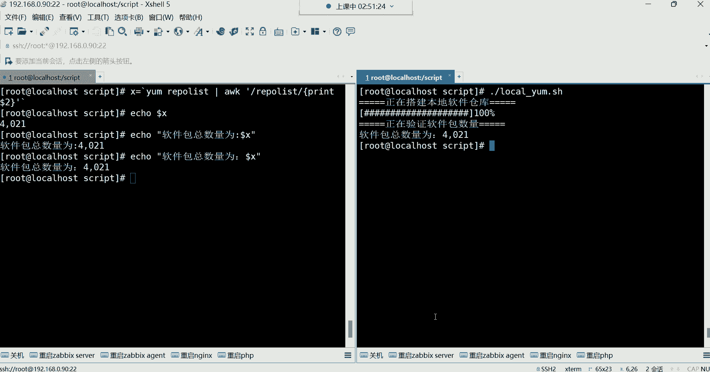

编写好的脚本需要赋予执行权限才能运行。
```bash
chmod +x local_yum.sh  # 为脚本添加执行权限
```
然后，可以通过以下方式执行：
```bash
./local_yum.sh          # 在当前目录下执行
bash local_yum.sh       # 使用bash解释器执行，即使没有执行权限也可运行
```

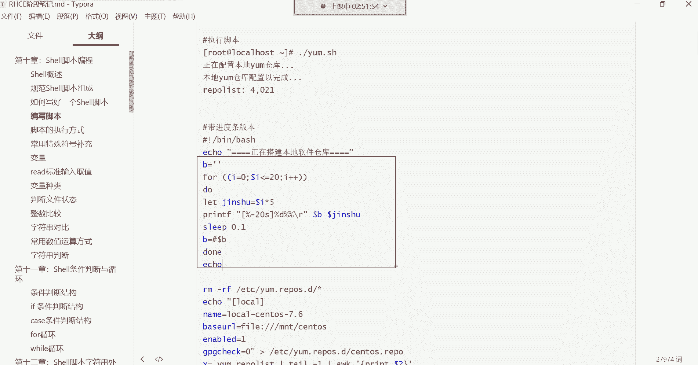

## 总结

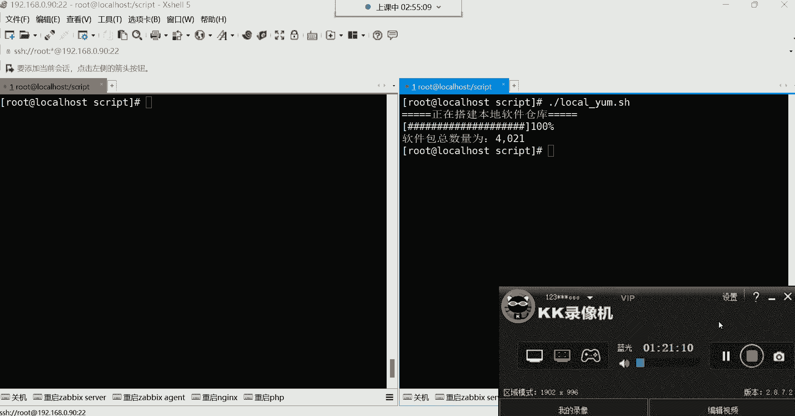

本节课中我们一起学习了Shell脚本编写的核心实践。我们从一个具体任务（搭建YUM仓库）出发，掌握了组织命令、使用 `sleep` 控制节奏、利用 `cat` 命令高效写入文件的方法。我们还探讨了如何通过添加提示、过滤输出、甚至设计进度条来优化脚本，提升其可读性和用户体验。最后，我们回顾了脚本的执行方式。记住，脚本的目的是将复杂或重复的操作自动化，好的脚本应是功能正确、逻辑清晰且易于维护的。