# Linux运维进阶：P39：常用特殊符号补充 📝

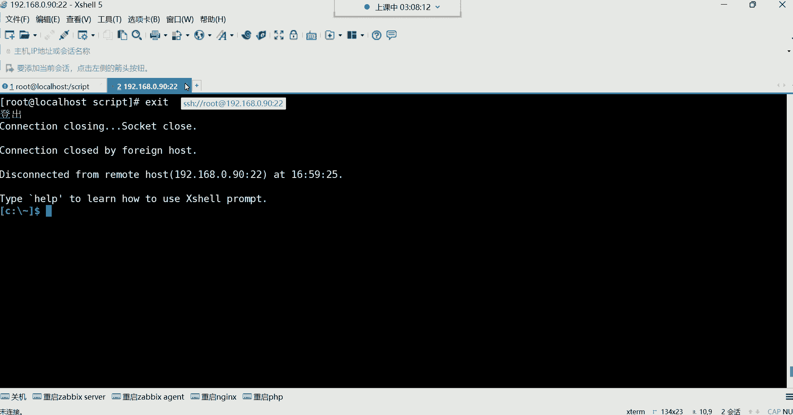

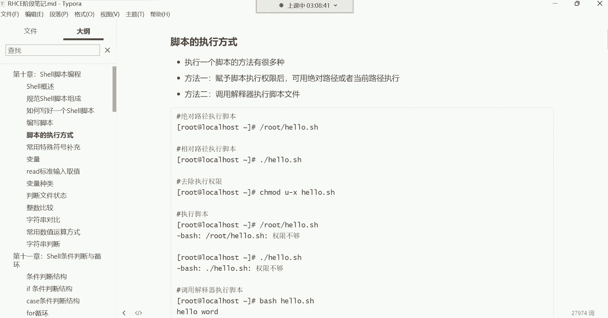

在本节课中，我们将学习Shell脚本中几种常用的特殊符号及其功能，包括脚本的执行方式、引号的作用以及四则运算和命令替换。这些知识是编写高效、灵活Shell脚本的基础。

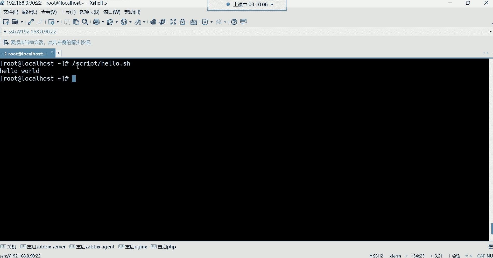

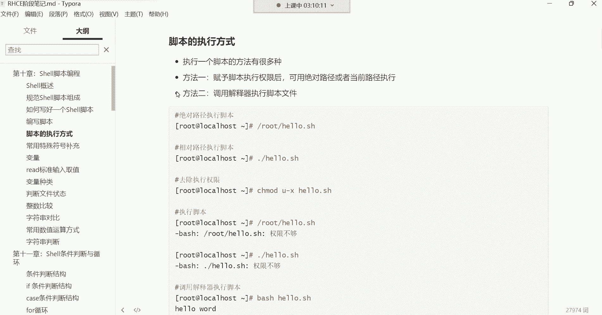

## 脚本的执行方式 🚀

上一节我们介绍了如何编写Shell脚本，本节中我们来看看如何执行一个写好的脚本。脚本的执行主要有两种方式。

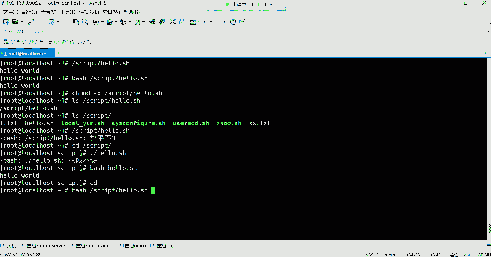

### 赋予执行权限并执行

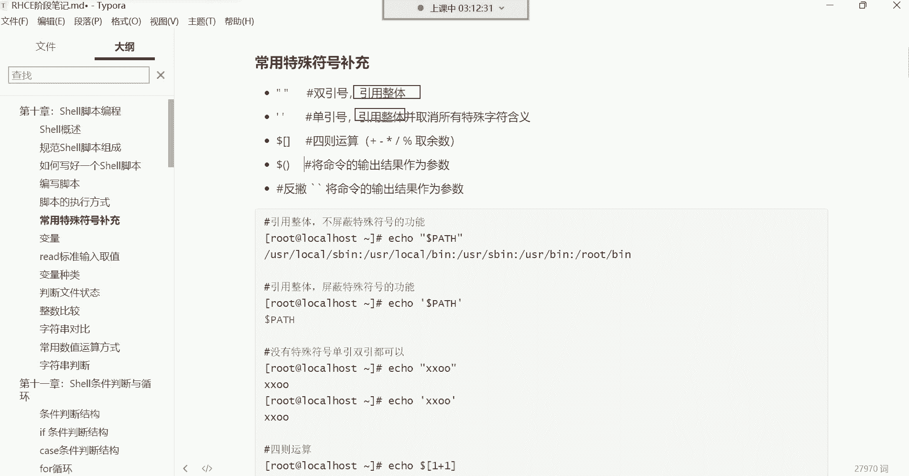

这是最常用的方法。首先需要给脚本文件赋予执行权限，然后通过绝对路径或相对路径来执行它。

以下是具体步骤：
*   **赋予执行权限**：使用 `chmod +x` 命令。
*   **相对路径执行**：必须在脚本名前加上 `./`，以告诉系统在当前目录下寻找该文件。例如：`./hello.sh`。
*   **绝对路径执行**：直接指定脚本文件的完整路径。例如：`/script/hello.sh`。

### 调用解释器执行

这种方式可以不赋予脚本执行权限，直接通过指定解释器（如 `bash`）来运行脚本。

以下是具体步骤：
*   使用 `bash` 命令后跟脚本路径。例如：`bash /script/hello.sh` 或 `bash ./hello.sh`。
*   这种方法适用于临时执行或测试脚本，无需修改文件权限。

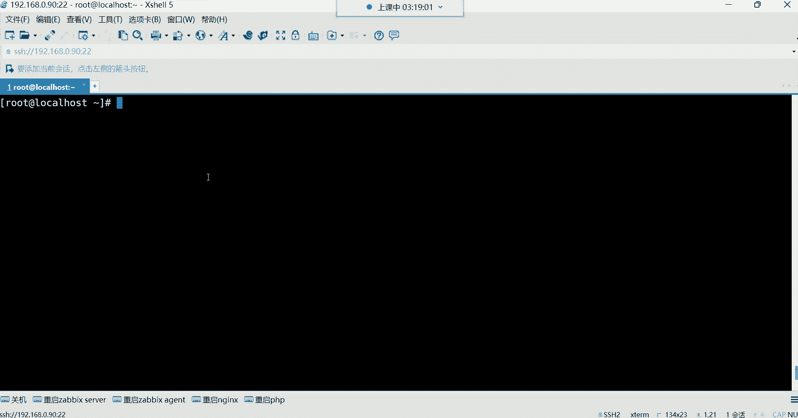

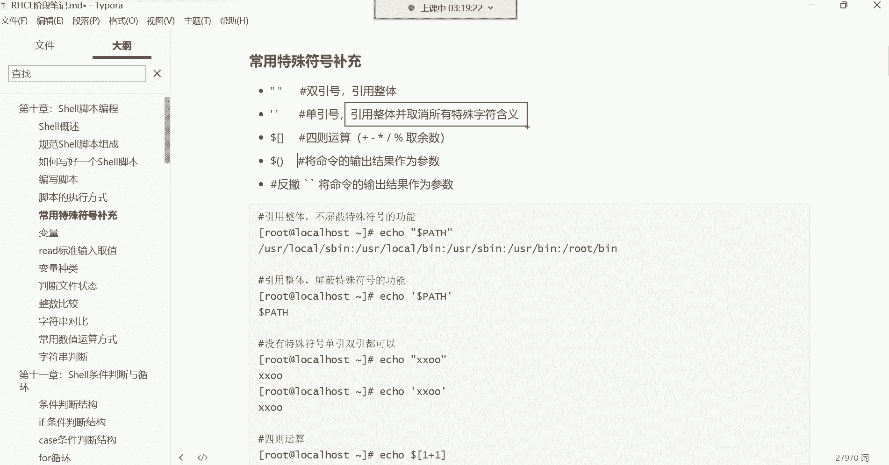

---


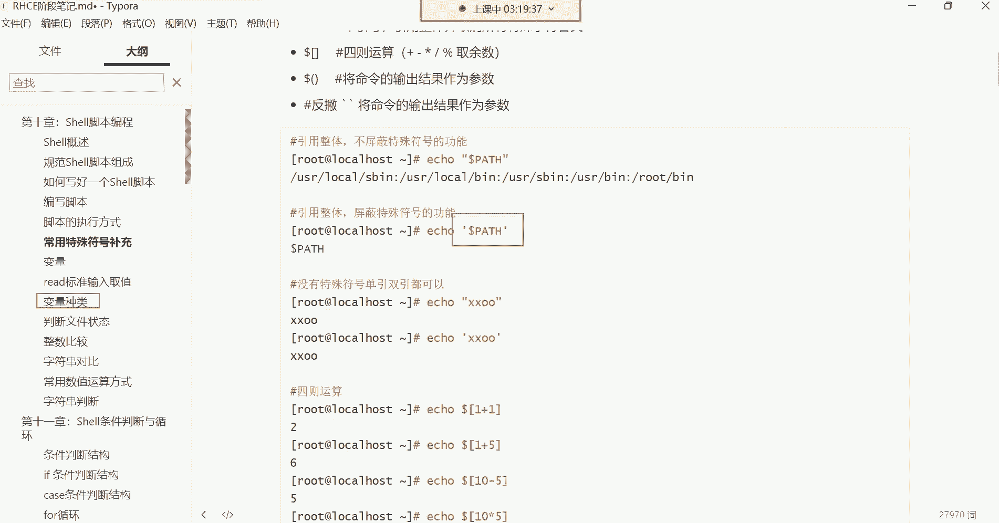

## 引号的作用：引用整体 🔤

在Shell中，引号的主要功能是“引用整体”，即将引号内的所有内容（包括空格等特殊字符）视为一个不可分割的整体。单引号和双引号在这一点上功能相同，但有一个关键区别。

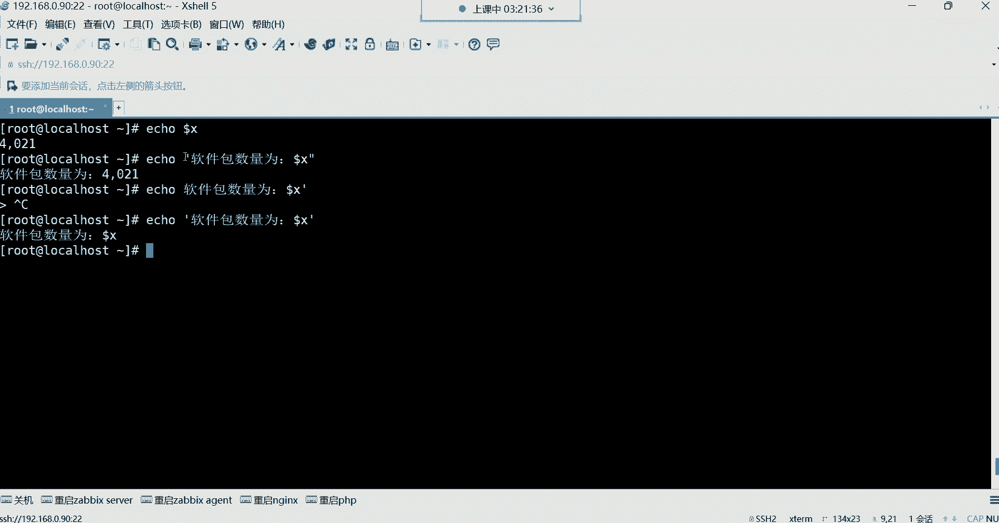

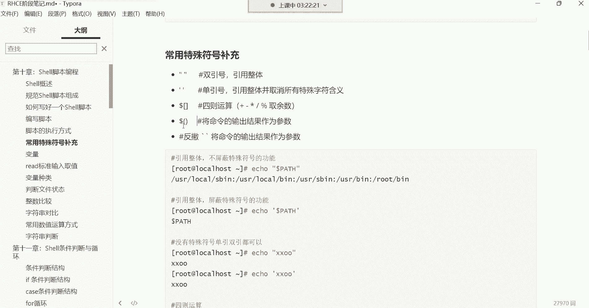

### 双引号与单引号

双引号和单引号都可以将内容定义为一个整体。例如，创建一个包含空格的文件名：
```bash
touch “A B.txt”
```
此时，`A B.txt` 是一个完整的文件名，而不是两个文件 `A` 和 `B.txt`。

它们的核心区别在于对特殊符号（如变量符号 `$`）的处理：
*   **双引号**：会识别并解析其中的特殊符号。
*   **单引号**：会取消其中所有特殊符号的特殊含义，将其视为普通字符。

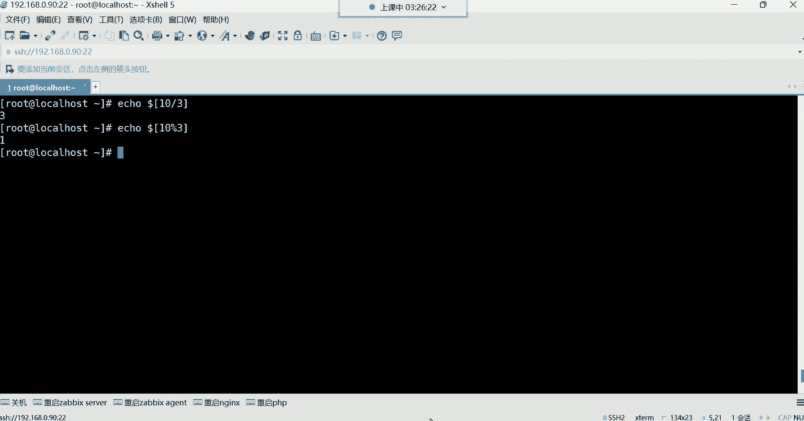

例如，假设有一个变量 `X=10`：
```bash
echo “软件包数量为：$X” # 输出：软件包数量为：10
echo ‘软件包数量为：$X’ # 输出：软件包数量为：$X
```
在双引号中，`$X` 被解析为变量的值 `10`；而在单引号中，`$X` 被当作普通字符串输出。

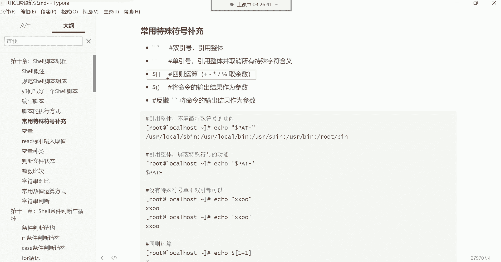

---

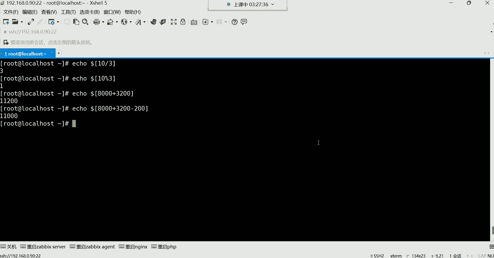

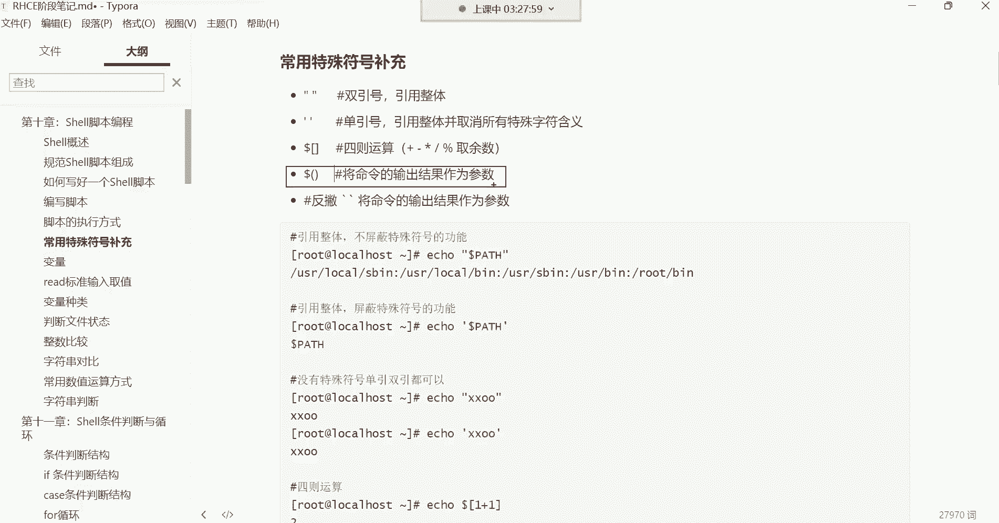

## 四则运算 ➕➖✖️➗

在Shell脚本中，我们经常需要进行数学计算。可以通过 `$[ ]` 结构来实现基本的四则运算。

以下是运算符说明：
*   **加法**：`+`，例如 `echo $[1+1]` 输出 `2`。
*   **减法**：`-`，例如 `echo $[5-2]` 输出 `3`。
*   **乘法**：`*`，例如 `echo $[2*3]` 输出 `6`。
*   **除法**：`/`，例如 `echo $[10/3]` 输出 `3`（整除，取商）。
*   **取余**：`%`，例如 `echo $[10%3]` 输出 `1`（取余数）。

---

## 命令替换：反引号与 $() 🔄

命令替换是一个强大的功能，它允许我们将一个命令的输出结果，作为另一个命令的参数或变量值。这可以通过反引号 `` ` `` 或 `$()` 来实现。

### 功能与应用


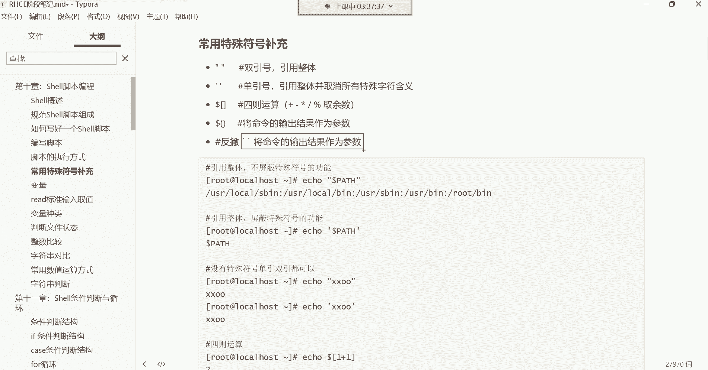

其核心功能是：**将命令的输出结果作为参数**。

一个典型的应用场景是在备份文件时，将当前系统时间动态添加到文件名中，以避免文件名重复导致旧备份被覆盖。

例如，创建一个带有时间戳的文件：
```bash
touch report_`date +%F_%H-%M-%S`.txt
```
或
```bash
touch report_$(date +%F_%H-%M-%S).txt
```
执行后，会生成一个类似 `report_2023-10-27_14-30-15.txt` 的文件。每次执行，由于时间不同，文件名都不同。

在备份命令中，可以这样使用：
```bash
tar -czf “backup_$(date +%F).tar.gz” /path/to/data
```
这样，每次备份都会生成一个包含日期的唯一压缩包。

---

## 总结 📚

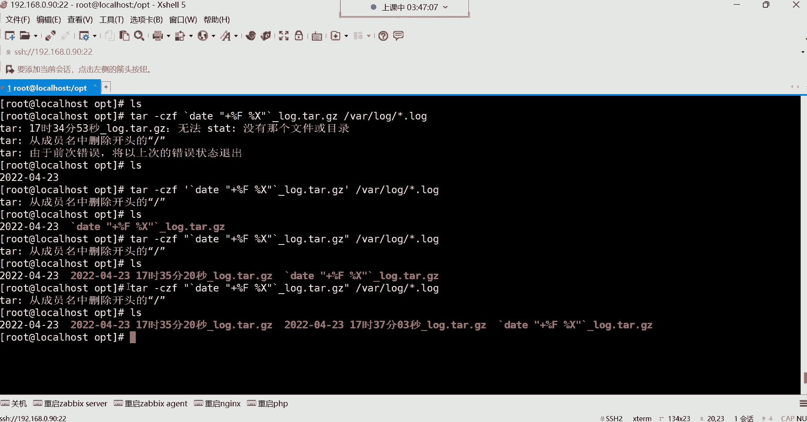

本节课中我们一起学习了Shell脚本中几个关键的实用技巧：
1.  **脚本执行**：掌握了通过赋予权限执行和调用解释器执行两种方式。
2.  **引号使用**：理解了双引号和单引号在“引用整体”上的共同点，以及双引号解析变量、单引号屏蔽特殊功能的区别。
3.  **数学运算**：学会了使用 `$[ ]` 进行加、减、乘、除、取余等基本运算。
4.  **命令替换**：掌握了通过反引号 `` ` `` 或 `$()` 将命令输出作为参数使用的方法，这在动态生成文件名等场景中非常有用。

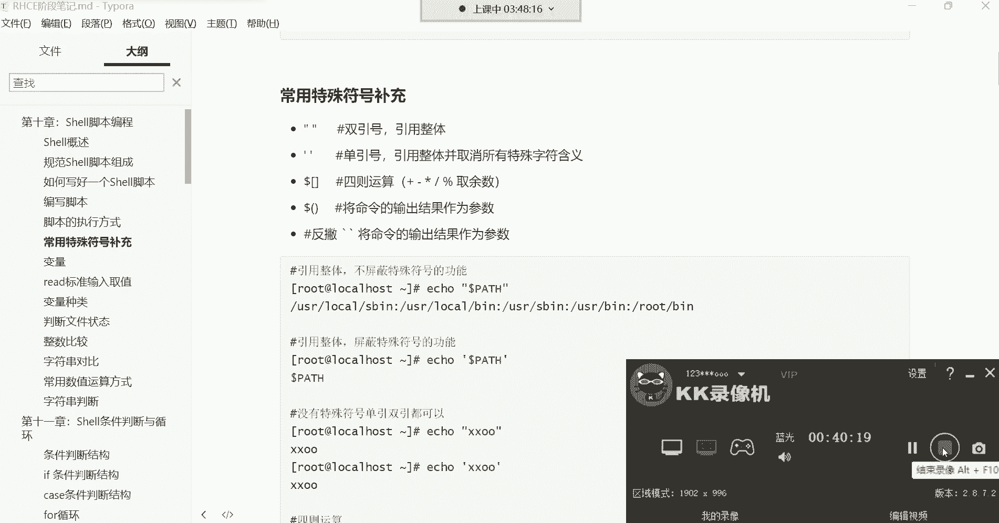

这些特殊符号和技巧是构建复杂、自动化Shell脚本的基石，请务必理解和熟练运用。