# Linux运维入门：P3：虚拟机网络配置、远程连接与Linux岗位介绍 🖥️

在本节课中，我们将学习如何配置虚拟机的网络，以便使用远程连接工具进行管理。同时，我们也将了解Linux系统的应用领域以及相关的IT岗位，帮助你明确未来的学习和发展方向。

## 系统登录与初始界面

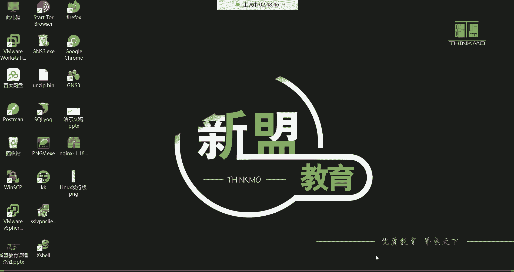

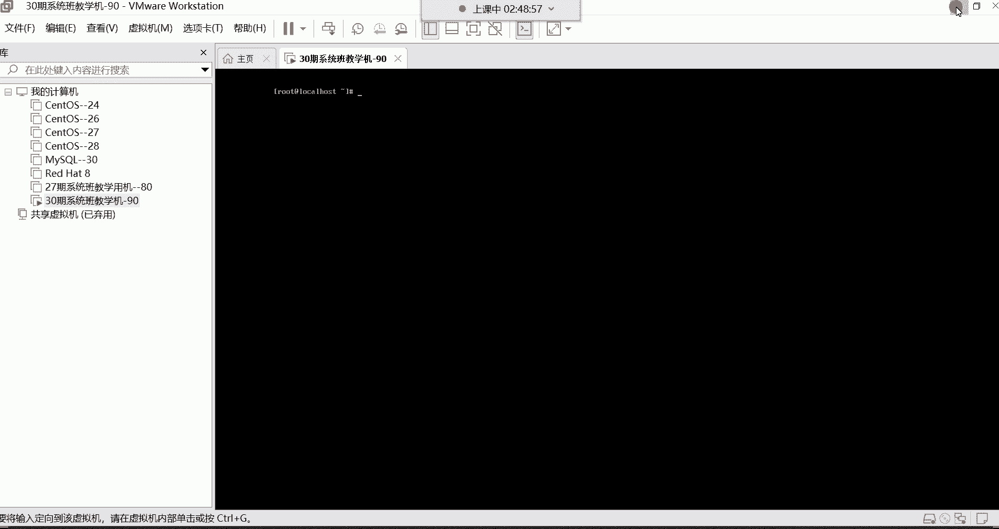

系统安装完成后，选择重启。重启后，我们将面对一个命令行登录界面，提示为 `localhost login:`。由于我们安装的是最小化系统（约300个软件包），没有图形界面，因此需要通过命令行登录。

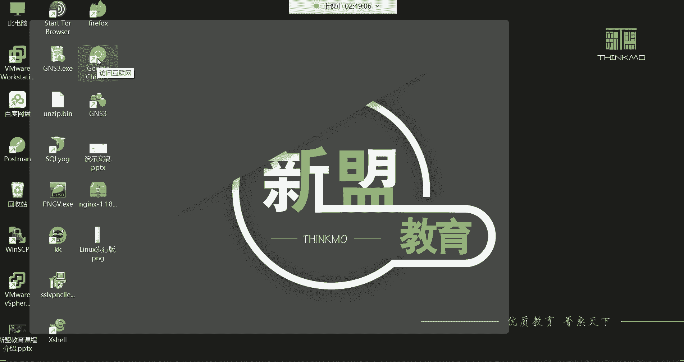

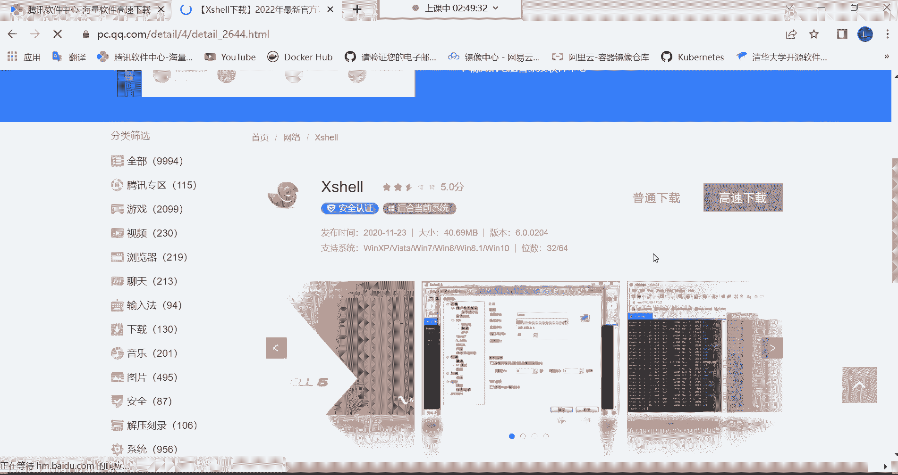

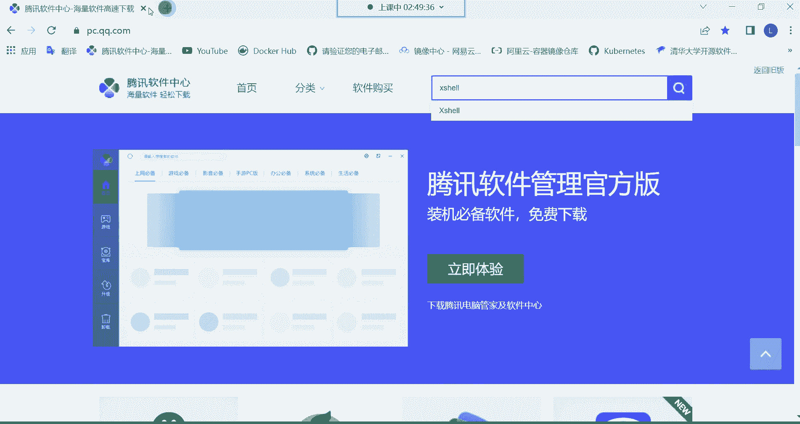

在登录提示符后输入用户名 `root`，然后输入密码（输入时不会显示，这是出于安全考虑）。输入完成后按回车键，即可成功登录系统。登录后，命令行提示符会发生变化，例如变为 `[root@localhost ~]#`。

## 配置虚拟机网络 🌐

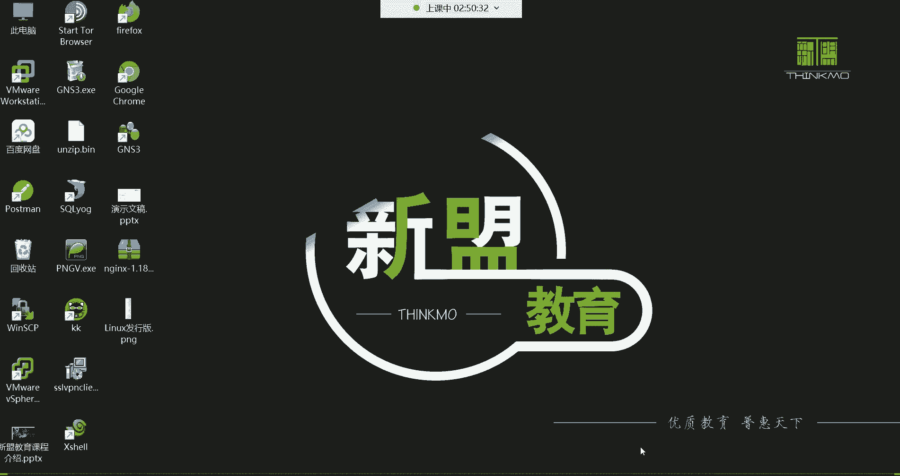

为了能够从我们的物理机（宿主机）远程连接到虚拟机，需要正确配置虚拟机的网络。这主要涉及两个部分的设置。

### 1. 配置VMware虚拟网络编辑器

首先，我们需要在VMware软件中设置虚拟网络。

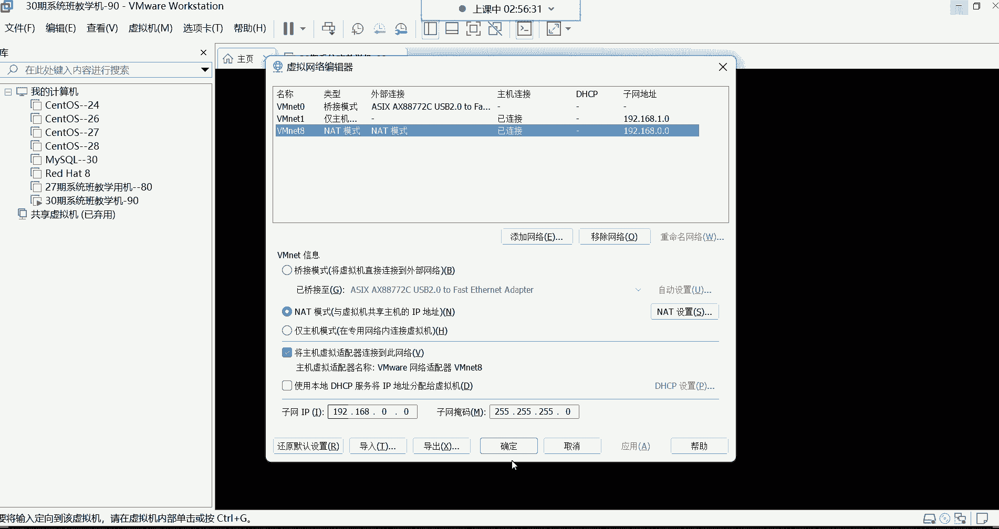

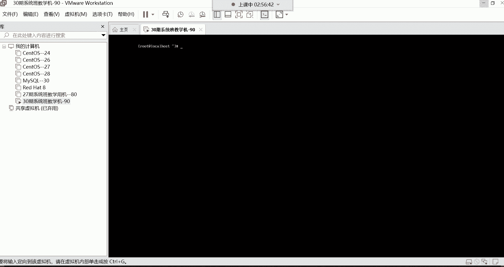

1.  打开VMware，点击菜单栏的 **编辑** -> **虚拟网络编辑器**。
2.  在编辑器窗口中，选择 **VMnet8 (NAT模式)**。
3.  取消勾选 **使用本地DHCP服务将IP地址分配给虚拟机** 选项。这一步很重要，可以防止虚拟机IP地址自动变化，导致我们无法连接。
4.  设置子网IP。例如，我们可以设置为 `192.168.0.0`。
5.  设置子网掩码为 `255.255.255.0`。
6.  点击 **NAT设置** 按钮，将网关IP设置为 `192.168.0.254`。
7.  依次点击 **确定** -> **应用** -> **确定** 保存设置。

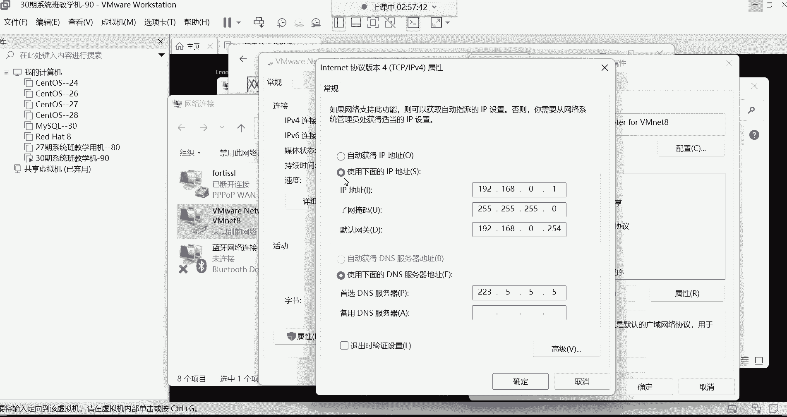

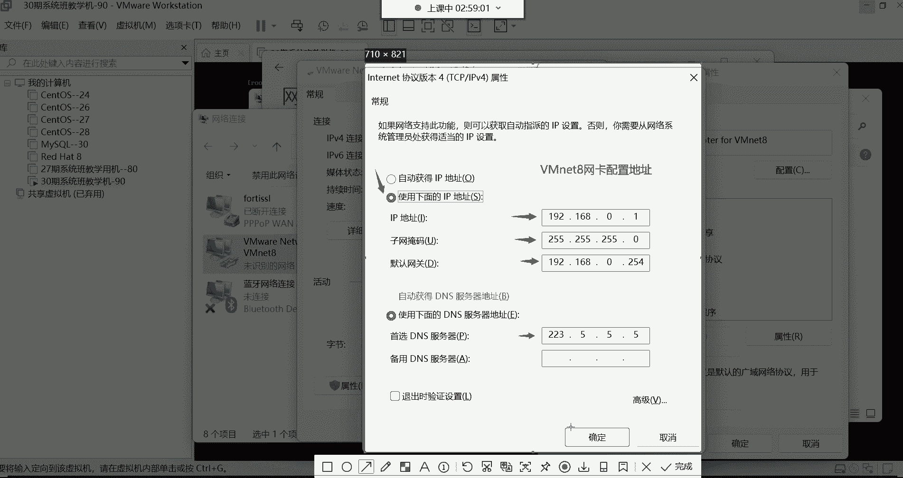

**核心配置点总结：**
*   **操作：** 取消DHCP自动分配。
*   **网络段：** `192.168.0.0/24`
*   **网关：** `192.168.0.254`

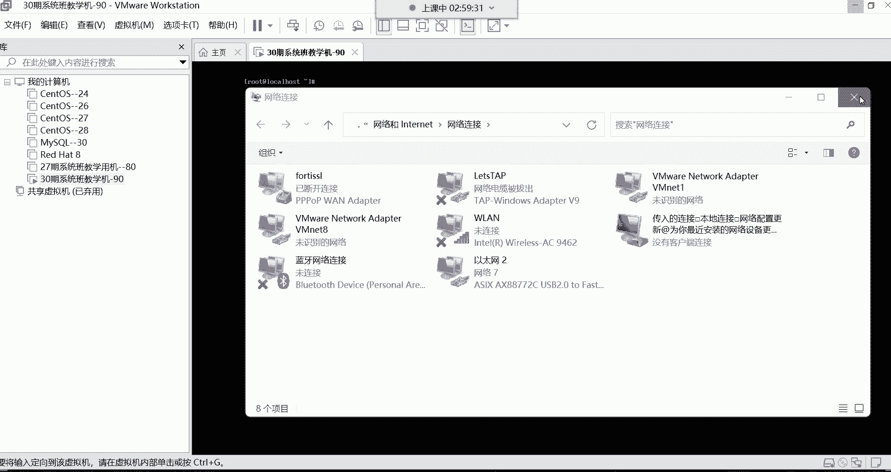

### 2. 配置宿主机的VMnet8网卡

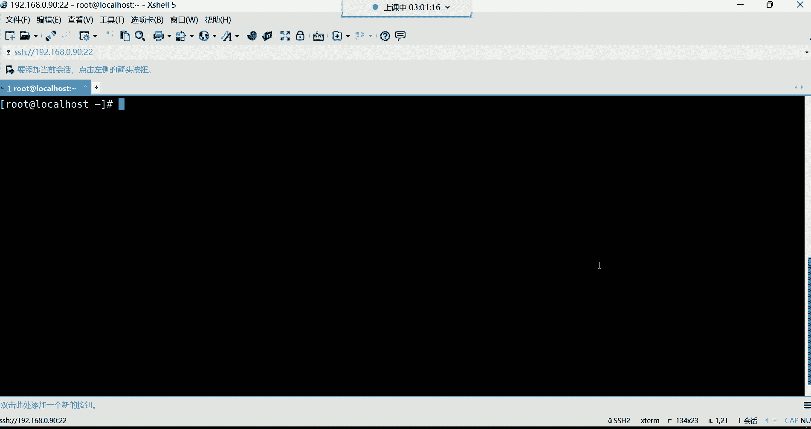

接下来，我们需要在Windows系统中配置VMware创建的虚拟网卡，使其与虚拟机处于同一网段。

1.  打开Windows的 **控制面板** -> **网络和 Internet** -> **网络和共享中心** -> **更改适配器设置**。
2.  找到名为 **VMware Network Adapter VMnet8** 的网卡，右键选择 **属性**。
3.  双击 **Internet协议版本 4 (TCP/IPv4)**。
4.  选择 **使用下面的IP地址**，并进行如下配置：
    *   IP地址：`192.168.0.1`
    *   子网掩码：`255.255.255.0`
    *   默认网关：`192.168.0.254`
    *   首选DNS服务器：例如 `223.5.5.5` (阿里云DNS)
5.  点击 **确定** 保存。

完成以上两步后，虚拟机和宿主机之间就建立了正确的网络通道。

## 使用远程连接工具 🔌

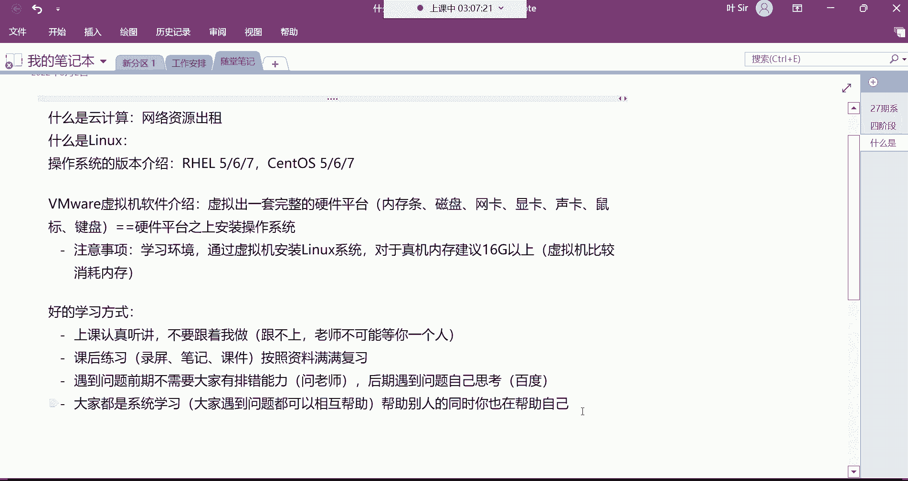

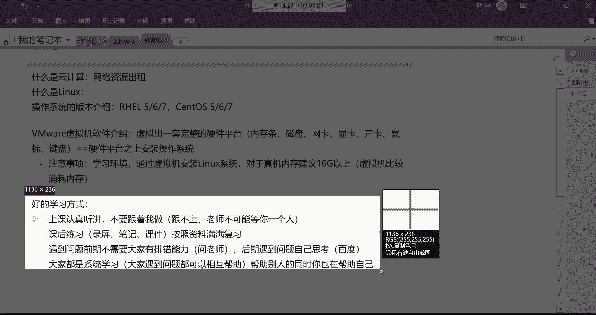

在企业环境中，服务器通常不在本地，我们需要通过远程连接工具进行管理。这里我们使用 Xshell。

1.  **获取工具：** Xshell可以在其官网或腾讯软件中心下载安装。
2.  **连接虚拟机：** 打开Xshell，新建会话。在命令行或连接对话框中输入命令：`ssh 192.168.0.90` (此处IP地址应替换为你虚拟机的实际IP)。
3.  **首次连接：** 首次连接时会弹出SSH安全警告，选择 **接受并保存** 即可。
4.  **登录系统：** 随后输入用户名 `root` 和密码，即可成功登录到虚拟机的命令行界面。

现在，所有对Linux系统的操作都可以在这个远程终端中完成。例如，可以使用 `Ctrl + L` 快捷键来清屏。

## Linux应用领域与岗位介绍 💼

上一节我们完成了系统的接入，本节我们来了解一下Linux广阔的应用前景和相关的职业道路。

Linux系统已渗透到我们生活的方方面面，其应用领域极其广泛：

*   **基础服务与互联网：** 支撑着微信、淘宝、支付宝、外卖、打车等所有主流互联网服务后端，确保它们7x24小时稳定运行。
*   **前沿技术领域：** 是云计算、大数据、人工智能和容器技术（如Docker/K8s）的基石操作系统。
*   **科研与超算：** 在全球超级计算机500强榜单中，绝大多数系统都运行在Linux之上，例如中国的“神威·太湖之光”和“天河二号”。
*   **智能设备：** Android和苹果iOS系统的底层均基于Linux（或类Unix）内核开发。

### 可从事的技术岗位

学习Linux运维后，你可以向多个方向发展：

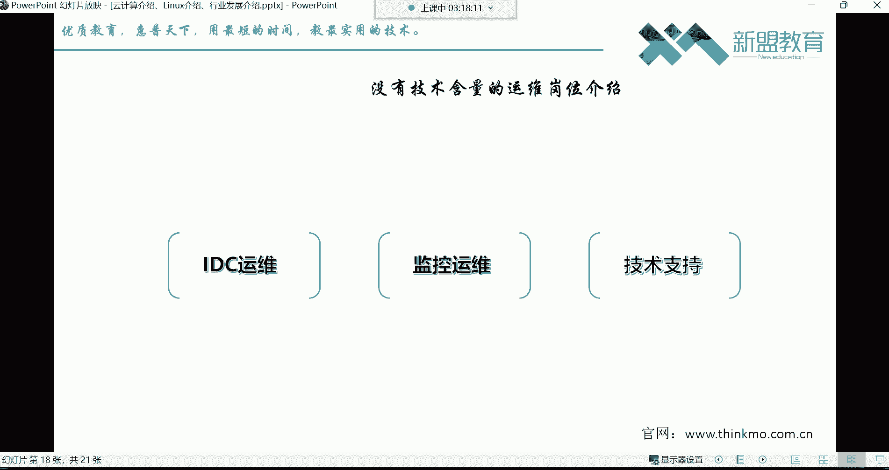

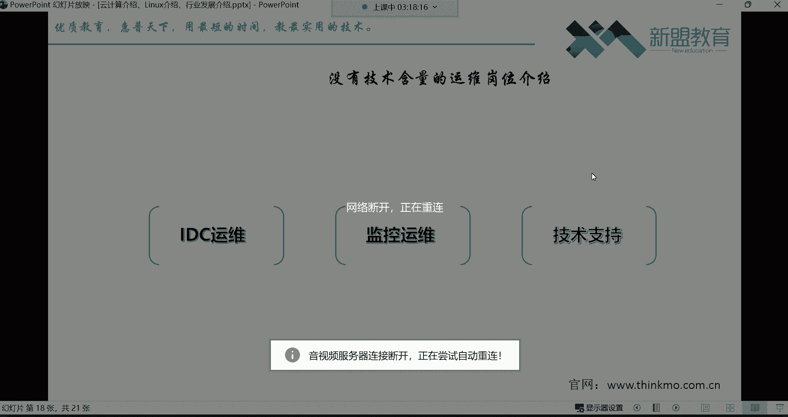

*   **运维工程师：** 入门首选岗位，负责服务器和业务的日常维护。
*   **云计算运维工程师：** 专注于公有云（如阿里云、AWS）或私有云平台的管理。
*   **容器运维工程师：** 负责基于Docker、Kubernetes的容器化平台运维。
*   **数据库管理员（DBA）：** 专职管理MySQL、Oracle等数据库系统。
*   **运维开发工程师/架构师：** 需要编程能力，负责自动化运维工具开发和系统架构设计。

**薪资参考：** 初级运维工程师起薪通常在8000元左右，平均薪资可达10000元或以上，随着经验和技能的提升会大幅增长。

### 需谨慎选择的岗位

以下岗位技术含量较低，多为外包性质，职业发展空间有限，初学者应谨慎选择：

*   **IDC运维：** 主要在数据中心机房从事巡检工作（检查温湿度、电力等），技术提升慢。
*   **监控运维：** 负责盯守监控平台，发送告警信息，技术参与度低。
*   **技术支持：** 类似客服，处理用户工单，将技术问题转交后端工程师，自身不解决复杂技术问题。

### 运维岗位的优势

与其他IT岗位相比，运维岗位具有以下特点：

*   **开发岗位：** 薪资高，但门槛高（学历、专业、逻辑思维要求高），压力大，职业生命周期相对较短（常面临“35岁危机”）。
*   **测试岗位：** 需要一定的编程和逻辑能力（相当于半个开发），且通常只有大型公司才会设置专职测试岗，门槛不低。
*   **运维岗位：**
    *   **门槛友好：** 零基础可以入门，对学历要求相对宽松（大专学历机会较多）。
    *   **寿命长久：** 任何公司都需要系统维护人员，经验越丰富越有价值。
    *   **需求量大：** 就业市场岗位多。
    *   **关键点：** 成功的关键在于 **坚持学习和实践**，克服学习过程中的疲劳期。

## 高效学习建议 📚

为了取得更好的学习效果，请遵循以下学习方式：

*   **课堂以听和理解为主：** 上课时紧跟老师思路，理解概念和原理，不要急于同步操作，以免跟不上节奏。
*   **课后反复练习：** 利用录屏、笔记和课件，在课后自己动手操作，巩固知识。
*   **善用资源解决问题：**
    *   **前期：** 遇到问题及时在课程群内提问，有专门的答疑老师协助。
    *   **后期：** 培养独立解决问题的能力，先自己思考、利用搜索引擎（百度、谷歌）查找资料，然后再讨论。
*   **互帮互助：** 在群内积极帮助同学解决问题。在解答他人的过程中，也能检验和深化自己的理解。

## 总结

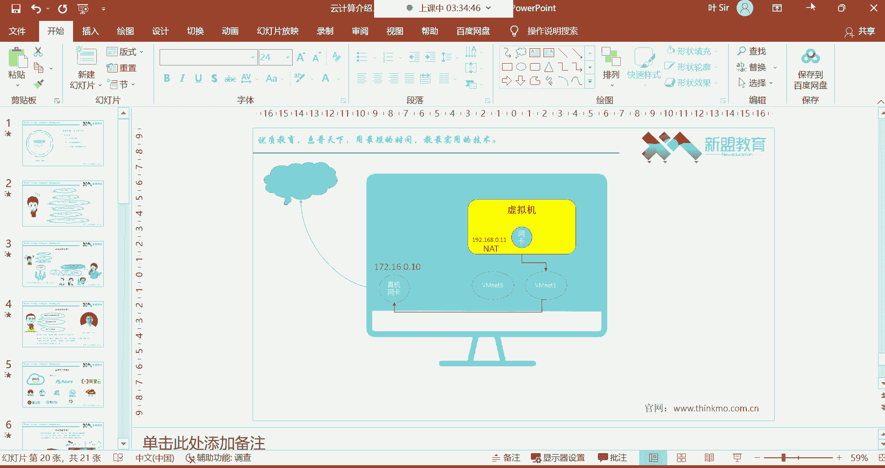

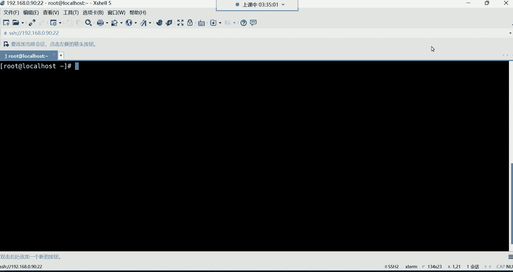

本节课中我们一起学习了：
1.  如何登录最小化安装的Linux系统。
2.  如何逐步配置VMware虚拟网络和宿主机网卡，实现网络互通。
3.  如何使用Xshell远程连接工具登录并管理虚拟机。
4.  了解了Linux系统在当今社会中的重要性和广泛的应用领域。
5.  明确了Linux运维人员可选择的职业发展路径（推荐岗位与需谨慎选择的岗位）。
6.  获得了关于坚持学习和课堂课后如何配合的高效学习建议。

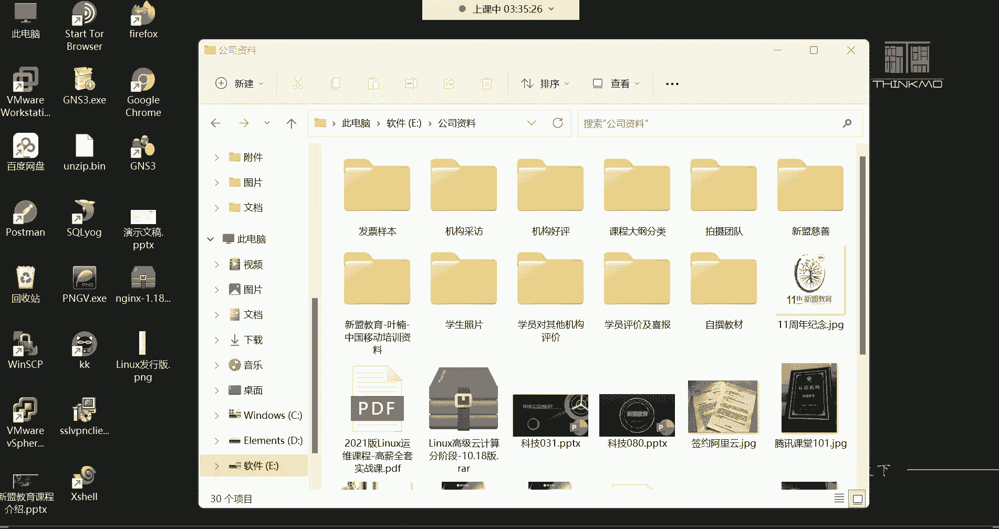

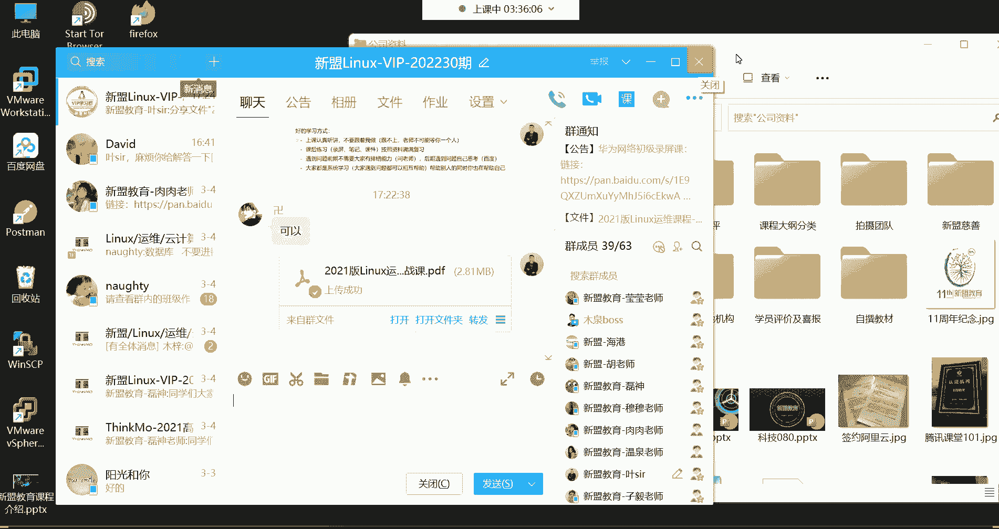

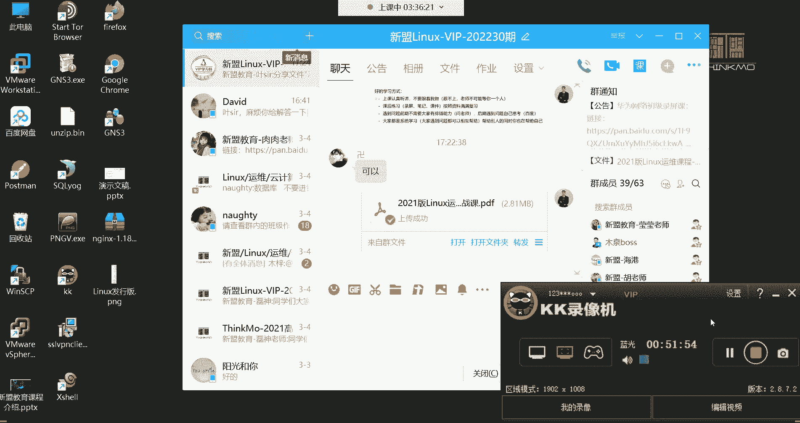

系统安装和网络配置是后续所有学习的基础，请务必掌握。从下节课开始，我们将正式进入Linux命令行的学习世界。