# Linux运维进阶：P40：文件状态判断、整数与字符串比较、数值运算与条件判断

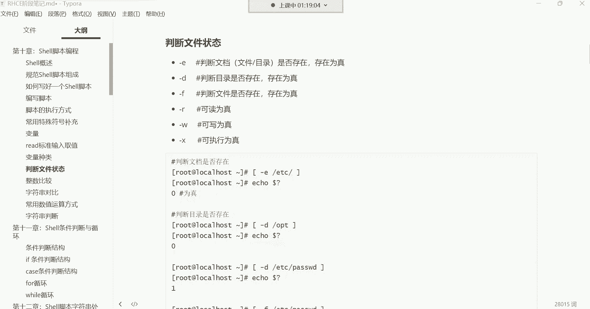


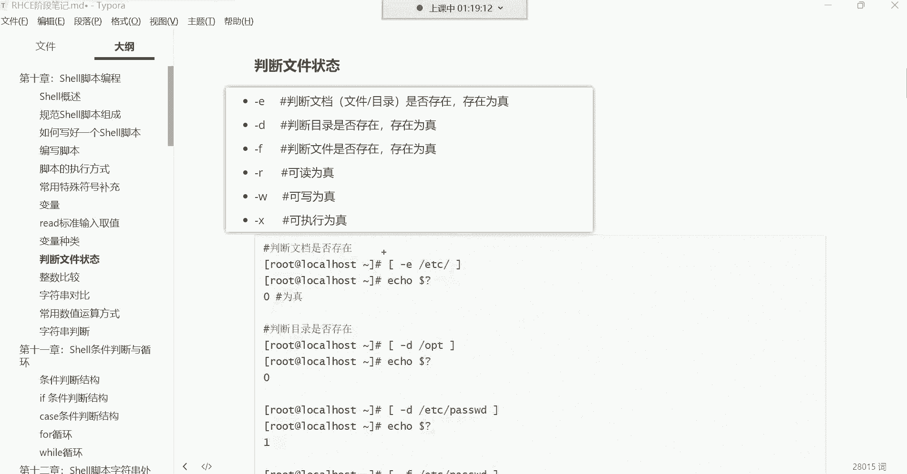

在本节课中，我们将学习Shell脚本中几个核心的判断与运算功能。内容包括如何判断文件的状态、进行整数和字符串的比较、使用不同的方式进行数值运算，以及利用逻辑运算符进行简单的条件判断。这些是编写自动化脚本的基础。

## 文件状态判断


上一节我们介绍了Shell的基础知识，本节中我们来看看如何判断文件的状态。Shell提供了一系列以单个字母表示的操作符，用于判断文件或目录的各种属性，例如是否存在、类型、权限等。这些操作符需要放在中括号 `[ ]` 内使用。


以下是常用的文件状态判断操作符：


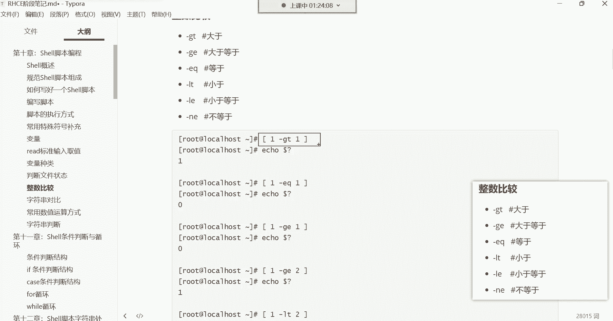

*   **`-e`**：判断文件或目录是否存在。例如 `[ -e /etc/passwd ]`。
*   **`-d`**：判断路径是否为一个目录。例如 `[ -d /etc ]`。
*   **`-f`**：判断路径是否为一个普通文件。例如 `[ -f /etc/passwd ]`。
*   **`-r`**：判断当前用户是否对文件有读权限。例如 `[ -r /etc/passwd ]`。
*   **`-w`**：判断当前用户是否对文件有写权限。例如 `[ -w /etc/passwd ]`。
*   **`-x`**：判断当前用户是否对文件有执行权限。例如 `[ -x /etc/passwd ]`。

这些判断命令执行后不会直接输出结果，需要通过特殊变量 `$?` 来获取上一条命令的返回值。返回值为 **0** 表示判断为真（条件成立），非 **0** 表示判断为假（条件不成立）。

```bash
[ -e /etc/passwd ]
echo $?  # 输出 0，表示文件存在
```

> **提示**：现阶段，你不需要死记硬背所有这些操作符，但需要做到在看到脚本中的 `-e`、`-f` 等符号时，能理解其意图是判断文件是否存在或是否为文件。


## 整数比较


在Shell中，如果要对整数进行数值上的比较（例如大于、等于），不能直接使用数学符号（如 `>`、`=`），因为它们会被解释为其他含义。必须使用特定的字母组合。


整数比较操作符也需要放在中括号 `[ ]` 内，并且操作符与数字之间需要空格隔开。

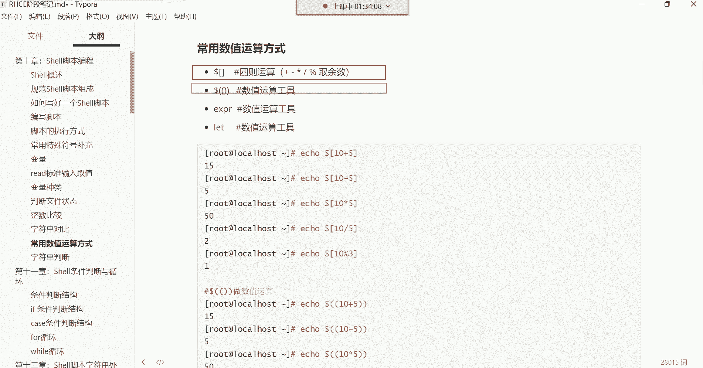

以下是整数比较的操作符：


*   **`-eq`**：等于（Equal）。`[ 1 -eq 1 ]` 为真。
*   **`-ne`**：不等于（Not Equal）。`[ 1 -ne 2 ]` 为真。
*   **`-gt`**：大于（Greater Than）。`[ 2 -gt 1 ]` 为真。
*   **`-ge`**：大于等于（Greater or Equal）。`[ 2 -ge 2 ]` 为真。
*   **`-lt`**：小于（Less Than）。`[ 1 -lt 2 ]` 为真。
*   **`-le`**：小于等于（Less or Equal）。`[ 2 -le 2 ]` 为真。

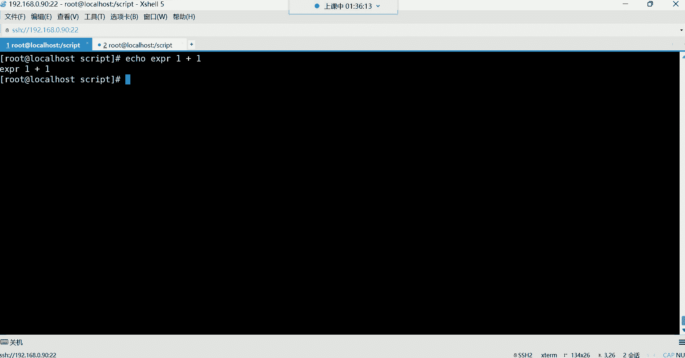


```bash
[ 10 -gt 5 ]
echo $?  # 输出 0，因为 10 大于 5 为真
```

## 字符串对比


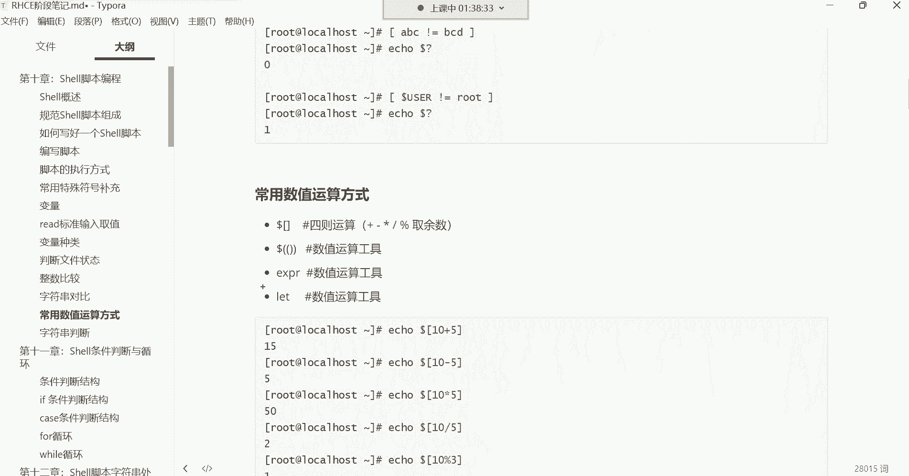

与整数比较不同，字符串对比使用不同的操作符。最常用的是判断两个字符串是否相等。


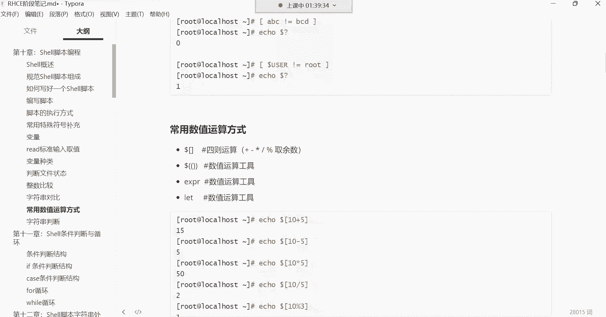

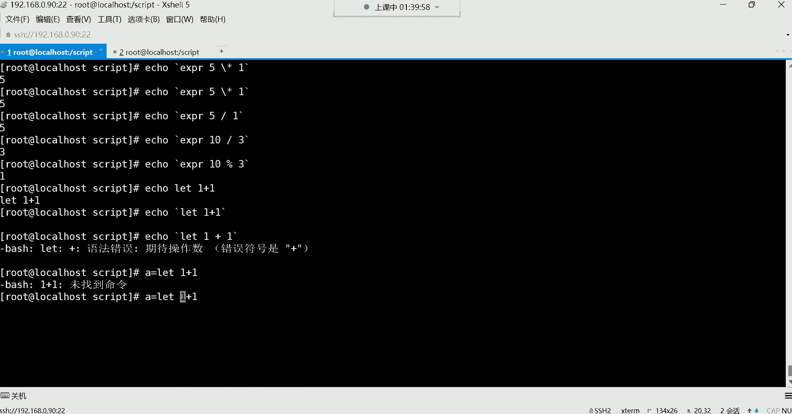

字符串对比同样在中括号 `[ ]` 内进行。


以下是字符串对比的操作符：


*   **`==`** 或 **`=`**：判断两个字符串是否相等。例如 `[ “$USER” == “root” ]`。
*   **`!=`**：判断两个字符串是否不相等。例如 `[ “$USER” != “root” ]`。


```bash
[ “abc” == “abc” ]
echo $?  # 输出 0，表示字符串相等
```

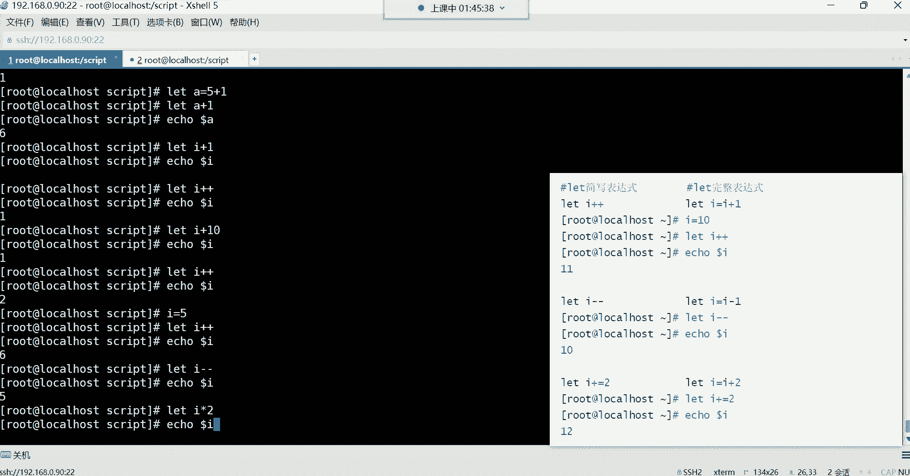

> **注意**：`==` 和 `=` 在 `[ ]` 测试中功能相同，但 `==` 在其它编程语境中更通用。

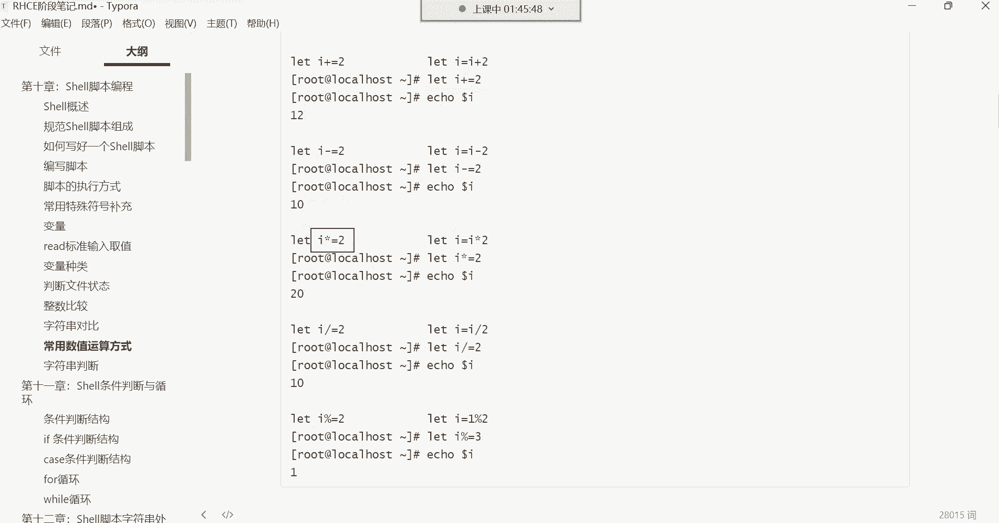


## 常用数值运算方式

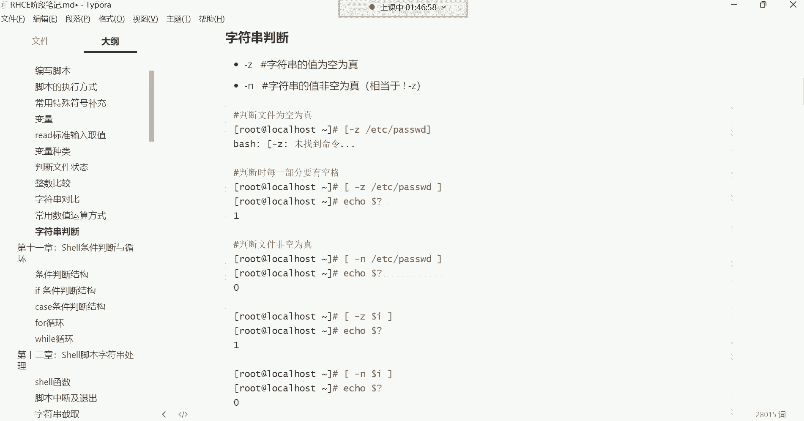


Shell提供了多种进行数值运算的方法。之前我们学过使用 `$[ ]`，这里再介绍几种。

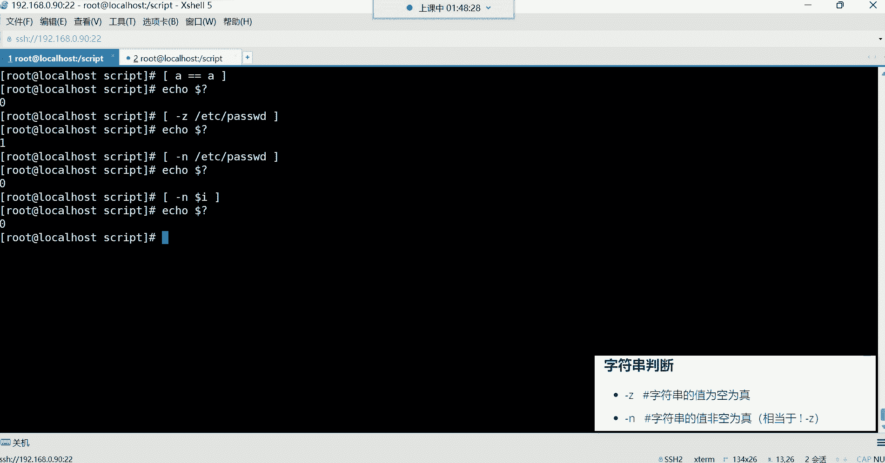

以下是几种常用的数值运算方法：

*   **`$[ ]`**：这是较简洁的运算方式。例如 `echo $[ 5 + 3 ]` 输出 `8`。
*   **`$(( ))`**：这是C语言风格的运算方式，功能与 `$[ ]` 类似。例如 `echo $(( 5 * 2 ))` 输出 `10`。
*   **`expr`**：这是一个外部命令，使用时需要注意空格和特殊符号的转义。例如 `` echo `expr 10 / 2` `` 输出 `5`。乘法符号 `*` 需要转义：`` echo `expr 5 \* 2` ``。
*   **`let`**：此命令通常用于将运算结果赋值给变量，在脚本中很常见，并且支持一些简写形式（如自增）。
    ```bash
    let a=5+3
    echo $a  # 输出 8
    let a++   # a 自增 1，等价于 let a=a+1
    echo $a  # 输出 9
    let a+=2  # a 加 2，等价于 let a=a+2
    echo $a  # 输出 11
    ```

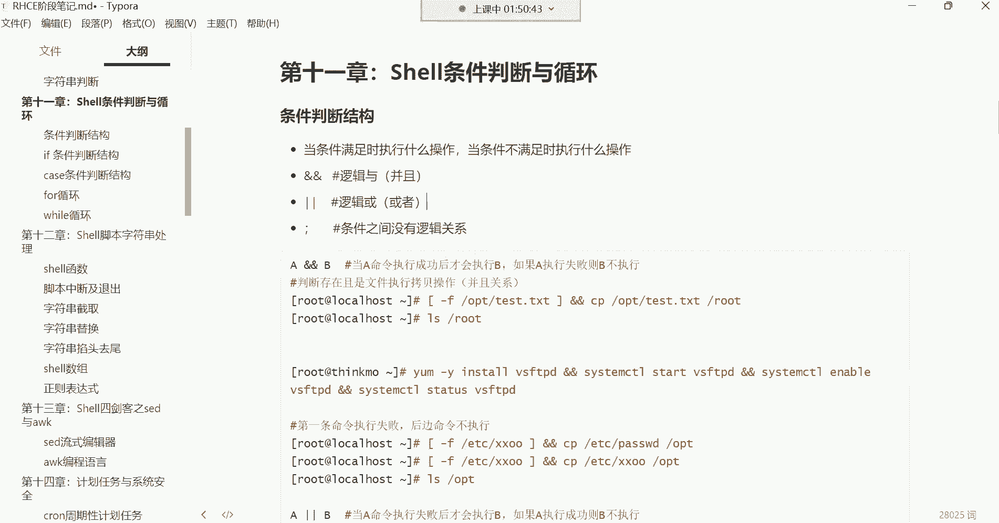

## 字符串判断（空值判断）

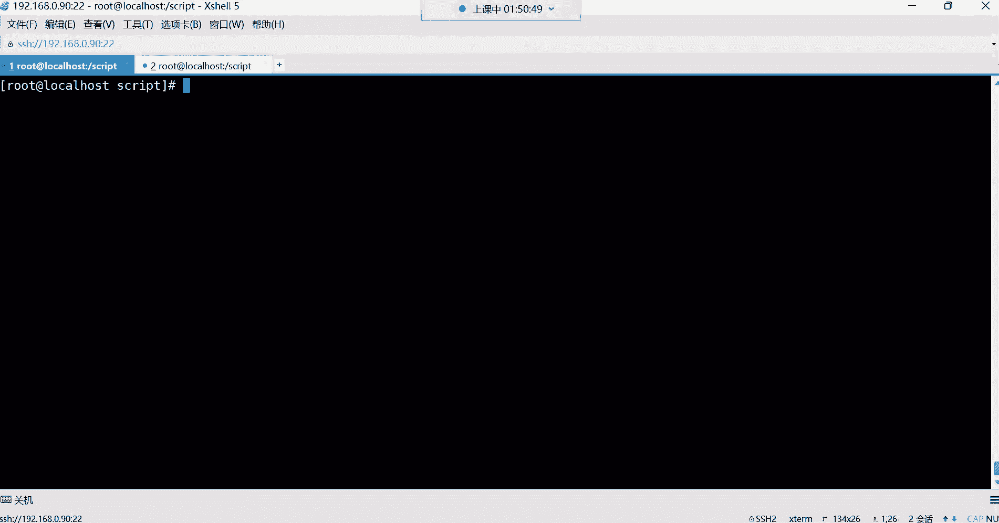

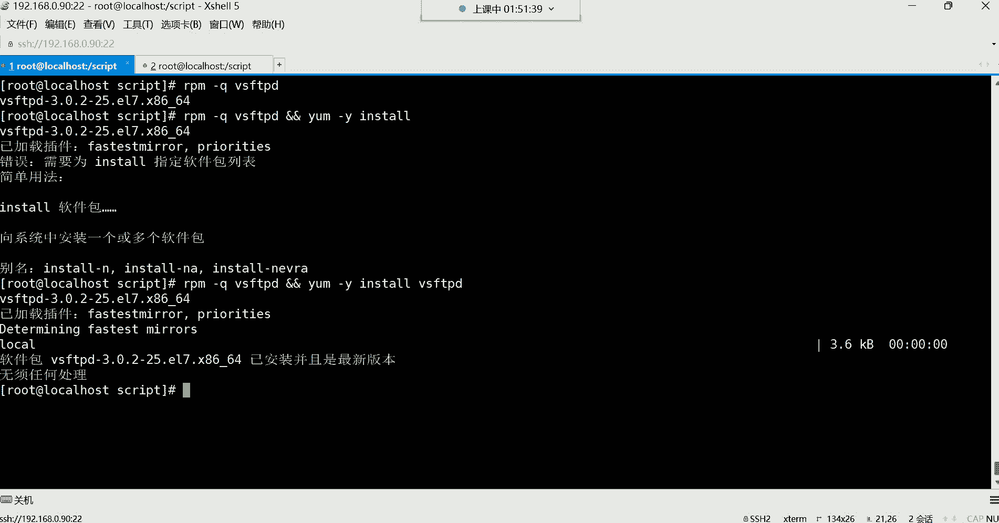


除了对比字符串内容，我们还可以判断一个字符串变量或文件内容是否为空。


字符串判断操作符：

*   **`-z`**：判断字符串长度是否为零（Zero）。为空则返回真。
*   **`-n`**：判断字符串长度是否非零（Non-zero）。不为空则返回真。


```bash
variable=“hello”
[ -z “$variable” ]
echo $?  # 输出 1 (非0)，因为变量不为空，判断为假
[ -n “$variable” ]
echo $?  # 输出 0，因为变量非空，判断为真
```


## 条件判断与逻辑运算符

掌握了基本的判断方法后，我们可以将它们组合起来，通过逻辑运算符构建更复杂的条件判断，以决定后续命令的执行流程。


Shell中的逻辑运算符：

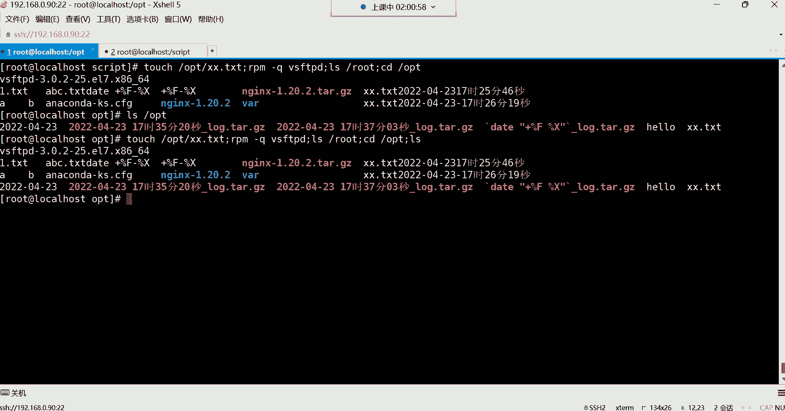

*   **`&&`**：逻辑“与”（AND）。只有前面的命令执行成功（返回值为0），后面的命令才会执行。
    ```bash
    # 如果 /etc/passwd 文件存在，则将其拷贝到 /opt 目录
    [ -f /etc/passwd ] && cp /etc/passwd /opt
    ```
*   **`||`**：逻辑“或”（OR）。只有前面的命令执行失败（返回值非0），后面的命令才会执行。
    ```bash
    # 查询 vsftpd 软件包，如果没找到（未安装），则安装它
    rpm -q vsftpd || yum install -y vsftpd
    ```
*   **`;`**：命令分隔符。按顺序执行命令，前后命令没有逻辑依赖关系。
    ```bash
    touch /tmp/test.txt; ls -l /tmp/test.txt; rm /tmp/test.txt
    ```

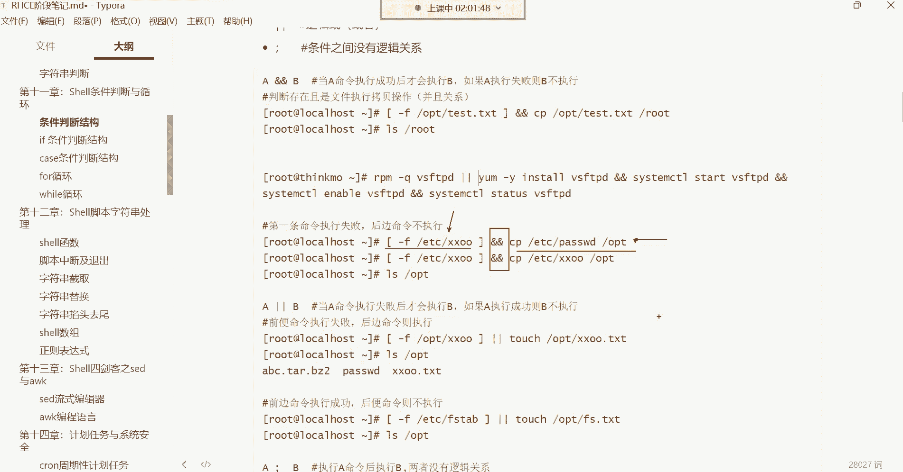

**综合示例**：一个安装并启动服务的逻辑链。
```bash
# 如果 vsftpd 未安装，则安装它。安装成功后，启动并设置开机自启。
rpm -q vsftpd || yum install -y vsftpd && systemctl start vsftpd && systemctl enable vsftpd
```
这个命令行的逻辑是：
1.  用 `rpm -q` 查询包。
2.  如果查询失败（未安装），则执行 `yum install`（`||` 起作用）。
3.  如果 `yum install` 执行成功（或之前 `rpm -q` 已成功，即已安装），则继续执行后面的 `systemctl` 命令（`&&` 起作用）。


---


本节课中我们一起学习了Shell中关于判断和运算的核心知识。我们了解了如何判断文件状态、进行整数和字符串的比较、使用多种方式进行数值运算，以及如何利用 `&&`、`||` 和 `;` 来构建命令执行的逻辑链。这些是编写高效、健壮的Shell脚本的基石，请务必理解其概念和用法。在接下来的课程中，我们将学习更强大的 `if` 条件判断语句。