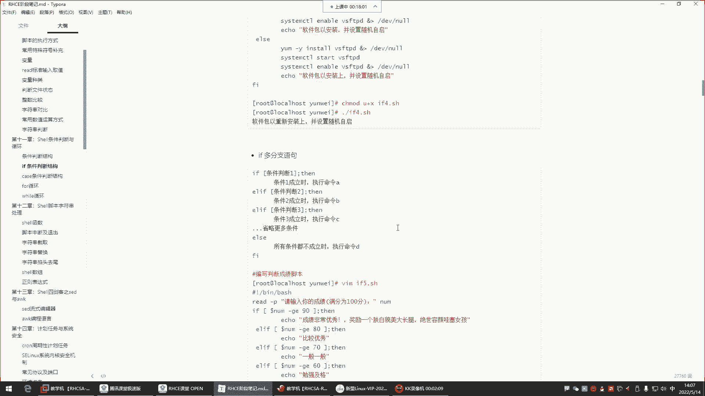
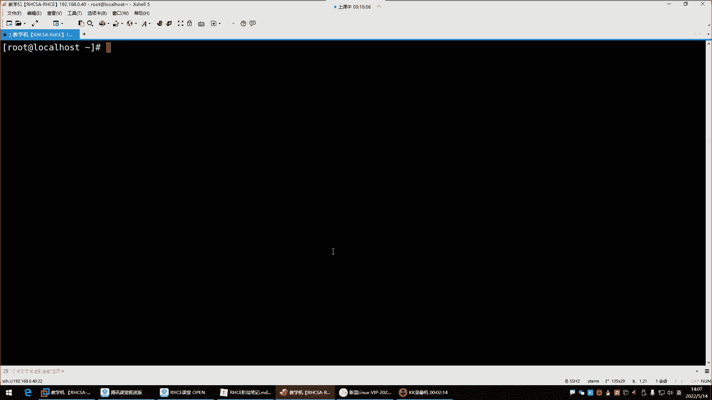
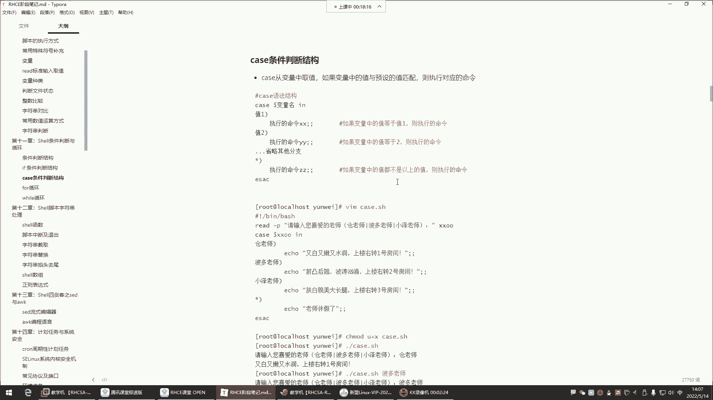
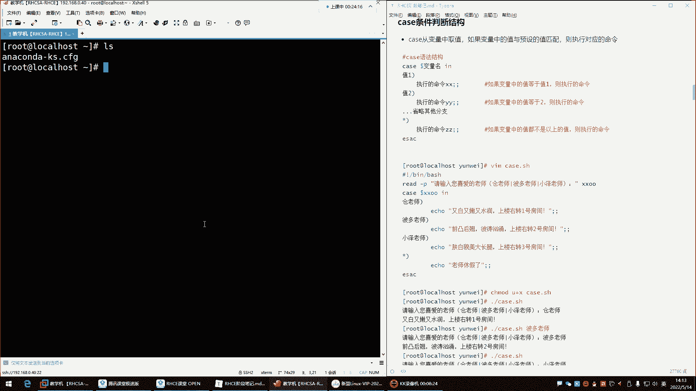
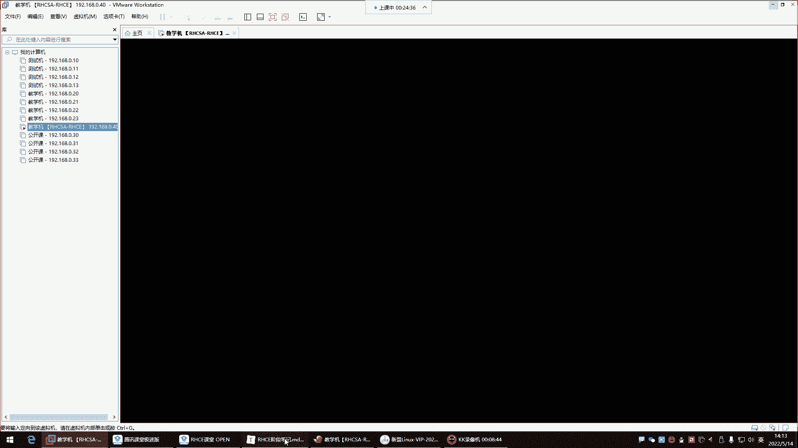
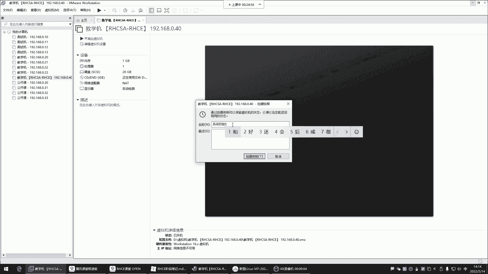
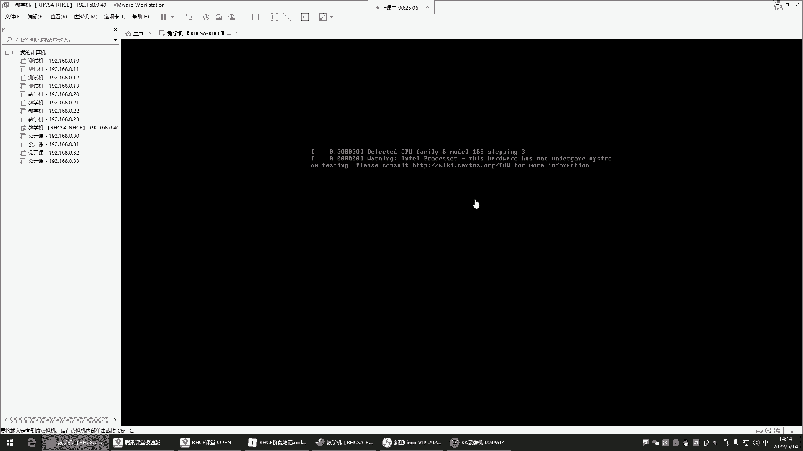
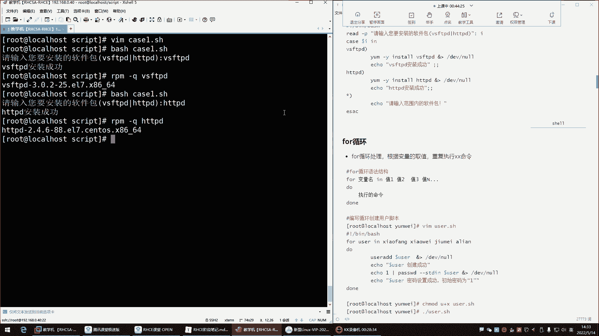
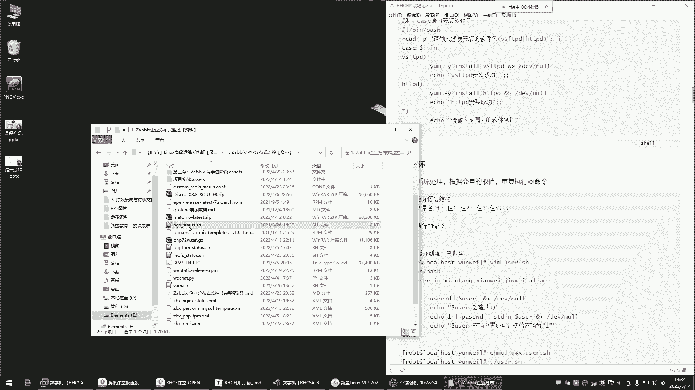
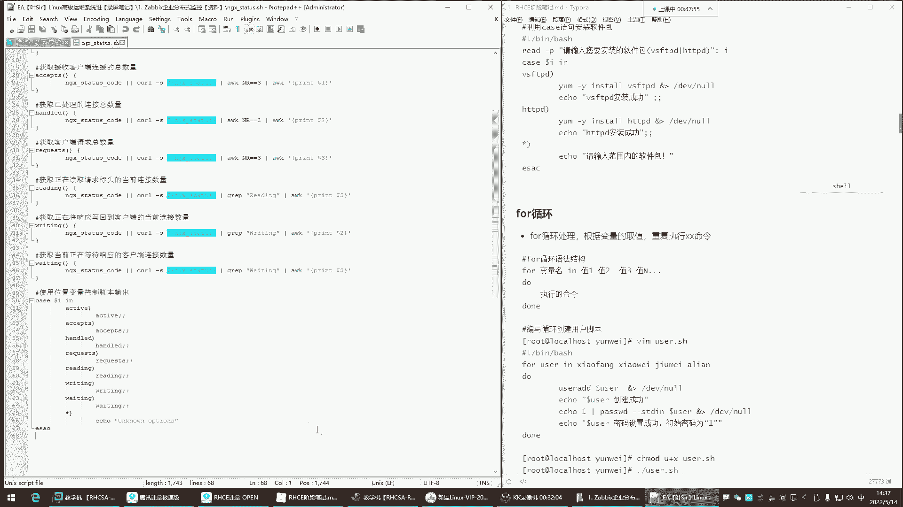

# Linux脚本编程：P42：case条件判断与for循环

## 概述

在本节课中，我们将学习Shell脚本编程中的两个重要结构：`case`条件判断语句和`for`循环语句。我们将通过具体的例子来理解它们的语法、应用场景以及如何在实际脚本中使用它们。





---



## case条件判断

上一节我们介绍了`if`条件判断，本节中我们来看看另一种条件判断方式：`case`语句。`case`语句的功能相对简洁，它通过匹配变量的值来执行相应的命令块。

### 语法结构

`case`语句的基本语法如下：

```bash
case 变量名 in
"值1")
    命令序列1
    ;;
"值2")
    命令序列2
    ;;
*)
    默认命令序列
    ;;
esac
```

其核心逻辑是：程序会读取`变量名`中的值，并从上到下依次与`"值1"`、`"值2"`等预设值进行匹配。一旦匹配成功，就执行对应的命令序列，然后结束整个`case`判断（匹配即停止）。如果所有预设值都不匹配，则执行`*)`分支下的默认命令序列。

### 基础应用示例

以下是`case`语句的一个简单应用，它根据用户输入输出不同的信息：

```bash
#!/bin/bash
read -p "请输入你喜欢的老师名字：" teacher
case $teacher in
    "苍老师")
        echo "苍老师特点：又白又嫩又水润。上楼右转一号房间。"
        ;;
    "波多老师")
        echo "波多老师特点：前凸后翘，波涛汹涌。上楼右转二号房间。"
        ;;
    "小泽老师")
        echo "小泽老师特点：肤白貌美大长腿。上楼右转三号房间。"
        ;;
    *)
        echo "该老师今天休息。"
        ;;
esac
```





执行这个脚本时，用户输入的值会被存入`teacher`变量。`case`语句会将该值与`"苍老师"`、`"波多老师"`等选项进行匹配，并执行匹配成功的分支。如果输入不匹配任何预设值，则执行`*)`分支。





**需要注意的细节**：
*   每个分支的**命令序列结束时，必须用两个分号`;;`表示终止**。
*   匹配是**精确匹配**，且**区分大小写**。
*   `*)`分支相当于`if-else`结构中的`else`，用于处理所有未匹配的情况。

### 实际场景示例

`case`语句也常用于根据用户选择执行不同的系统任务，例如安装不同的软件包：

```bash
#!/bin/bash
read -p "请输入你要安装的软件包（vsftpd/httpd）：" pkg_name
case $pkg_name in
    "vsftpd")
        yum -y install vsftpd &> /dev/null
        echo "vsftpd安装成功。"
        ;;
    "httpd")
        yum -y install httpd &> /dev/null
        echo "httpd安装成功。"
        ;;
    *)
        echo "请输入范围内的软件包名称。"
        ;;
esac
```

在这个脚本中，根据用户输入的软件包名称，执行对应的安装命令，并向用户返回明确的执行结果。

---

## for循环

在掌握了条件判断后，我们常常需要让某些操作重复执行多次，这时就需要用到循环结构。本节我们来学习`for`循环。

### 语法结构

`for`循环有两种常见的语法格式。

**格式一：遍历值列表**
这种格式会逐个取出“值列表”中的元素，赋值给变量，并执行循环体。

```bash
for 变量名 in 值1 值2 值3 ...
do
    命令序列
done
```

**格式二：C语言风格**
这种格式更接近传统编程语言，通过控制变量的起始值、结束条件和步进来控制循环。

```bash
for ((初始变量; 循环条件; 变量变化))
do
    命令序列
done
```

### 基础应用示例

**示例1：遍历固定列表**
以下脚本会依次打印出列表中的每一个名字。

```bash
#!/bin/bash
for name in Alice Bob Charlie David
do
    echo "Hello, $name!"
done
```

**示例2：遍历命令执行结果**
`for`循环经常用来遍历某个命令的输出结果。例如，批量检查当前目录下所有`.txt`文件：

```bash
#!/bin/bash
for file in $(ls *.txt)
do
    echo "正在处理文件：$file"
    # 这里可以添加处理文件的命令，例如：wc -l $file
done
```

**示例3：C语言风格循环**
这种格式适合执行已知次数的循环。例如，创建一个简单的倒计时：

```bash
#!/bin/bash
for ((i=5; i>=1; i--))
do
    echo "倒计时：$i"
    sleep 1
done
echo "时间到！"
```

### 实际场景示例

**场景：批量创建用户**
`for`循环在处理批量任务时非常高效。例如，我们需要为`class1`班级创建一组用户账号（`stu1`到`stu5`）：

```bash
#!/bin/bash
for ((i=1; i<=5; i++))
do
    username="stu$i"
    useradd $username
    echo "用户 $username 创建成功。"
done
```





**场景：网络主机存活检测**
我们可以用`for`循环结合`ping`命令，快速检测一个网段内哪些主机是在线的：

```bash
#!/bin/bash
network="192.168.1."
for ip in {1..10}
do
    target_ip="${network}${ip}"
    # -c 1表示发送1个包，-W 1表示等待1秒
    ping -c 1 -W 1 $target_ip &> /dev/null
    if [ $? -eq 0 ]; then
        echo "主机 $target_ip 存活。"
    else
        echo "主机 $target_ip 无法到达。"
    fi
done
```
在这个脚本中，`{1..10}`会展开为`1 2 3 ... 10`的序列。循环对每个IP地址执行`ping`命令，并根据命令返回值（`$?`）判断主机是否在线。

---

## 总结

本节课中我们一起学习了Shell脚本中两个非常实用的结构。
*   **`case`条件判断**：适用于多分支、值匹配的场景，语法比`if-elif`更清晰简洁，是处理固定选项类问题的好工具。
*   **`for`循环**：用于处理需要重复执行的任务，无论是遍历一个固定的列表，还是执行特定次数的操作，`for`循环都能让脚本变得更加高效和强大。



将条件判断和循环结合使用，可以解决绝大多数自动化运维中的脚本编写需求。