# Linux运维进阶：P43：case条件判断与for循环 🐧

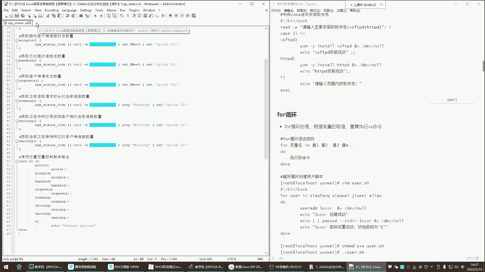


在本节课中，我们将要学习Shell脚本编程中的两个重要结构：`case`条件判断和`for`循环。通过学习，你将能够理解它们的基本语法、应用场景，并能够编写简单的脚本来实现自动化任务。

---

## 理解case条件判断

上一节我们介绍了基础的脚本概念，本节中我们来看看`case`语句。`case`语句是一种多分支的条件判断结构，它根据一个变量的值来匹配不同的模式，并执行相应的命令块。

它的核心作用是进行条件判断。当条件匹配成功时，执行对应的命令；条件失败则不执行。你可以将其理解为一种更清晰、结构化的“if-elif-else”语句。

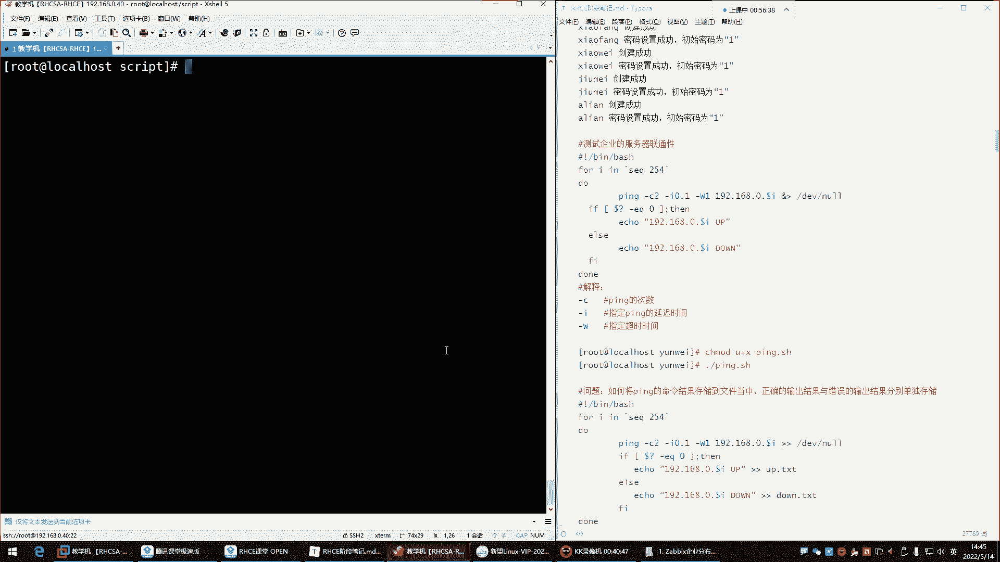

以下是`case`语句的基本语法结构：
```bash
case 变量 in
    模式1)
        命令1
        ;;
    模式2)
        命令2
        ;;
    *)
        默认命令
        ;;
esac
```
在使用时，你需要在执行脚本时为这个变量传递一个值。脚本会根据这个值去匹配对应的模式，并执行模式后的命令。

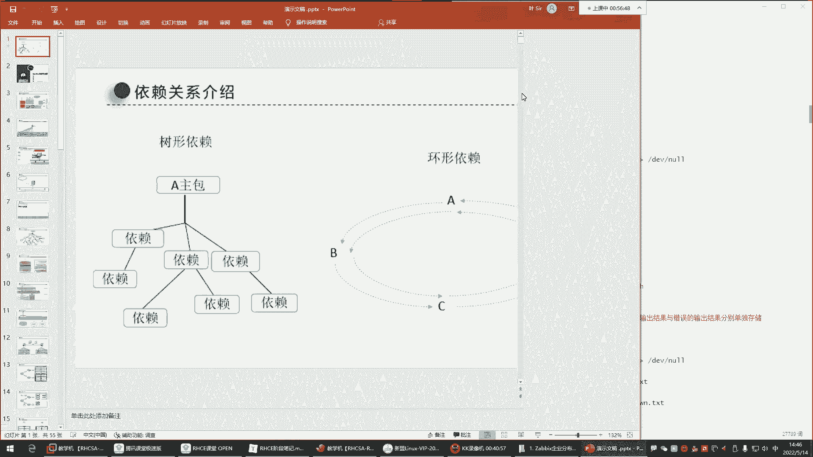


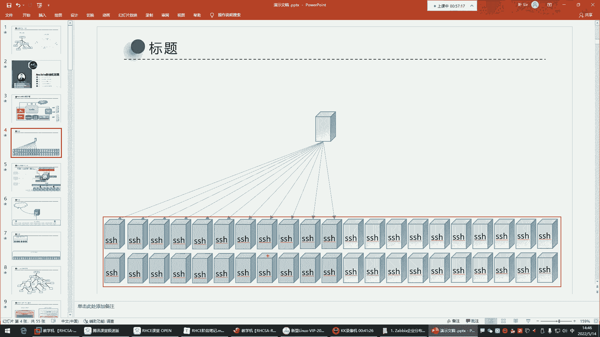

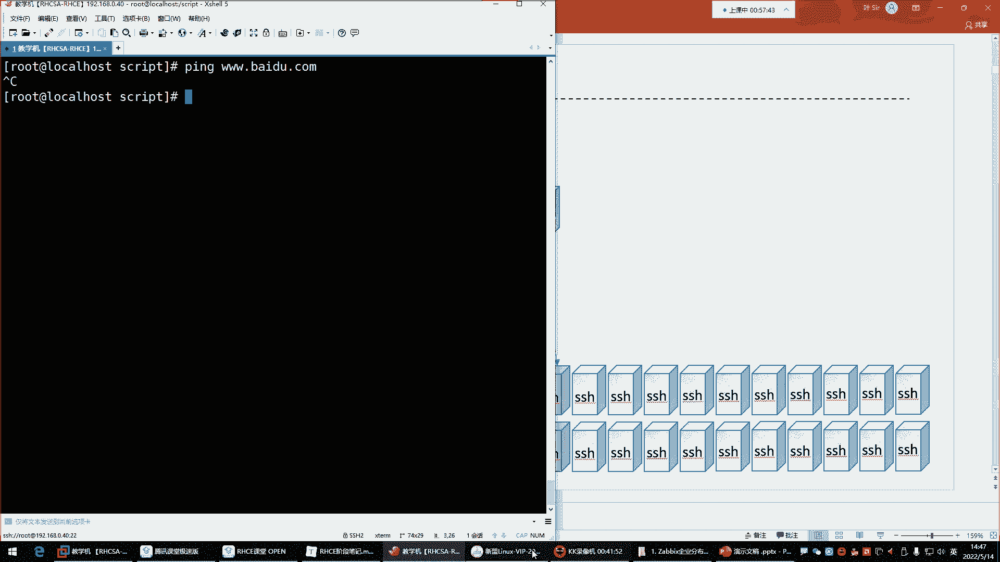

---

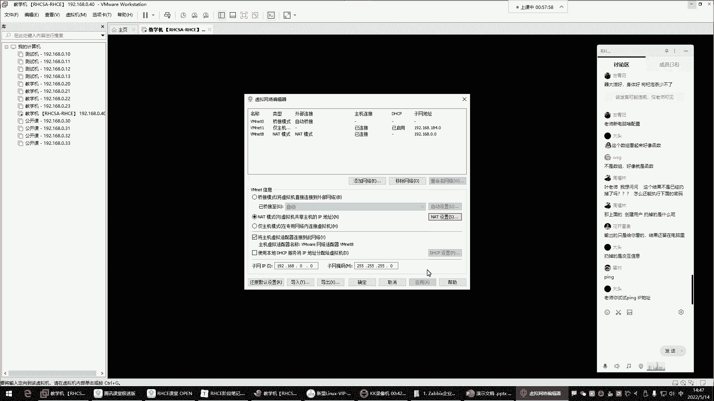

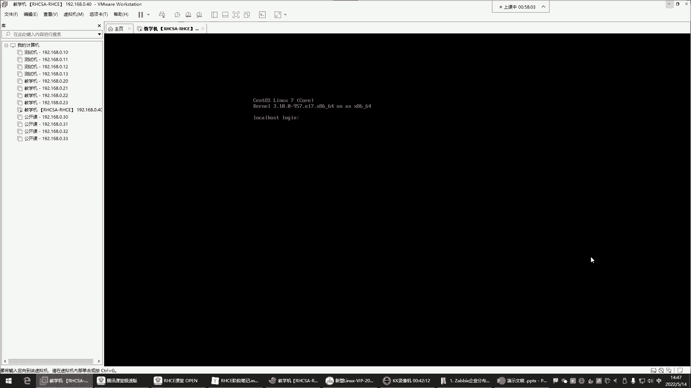

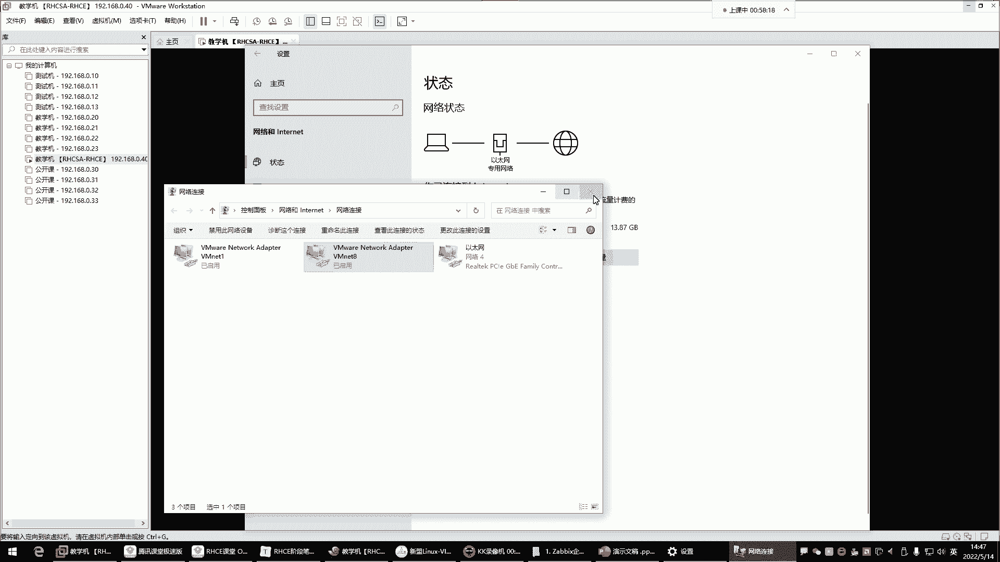

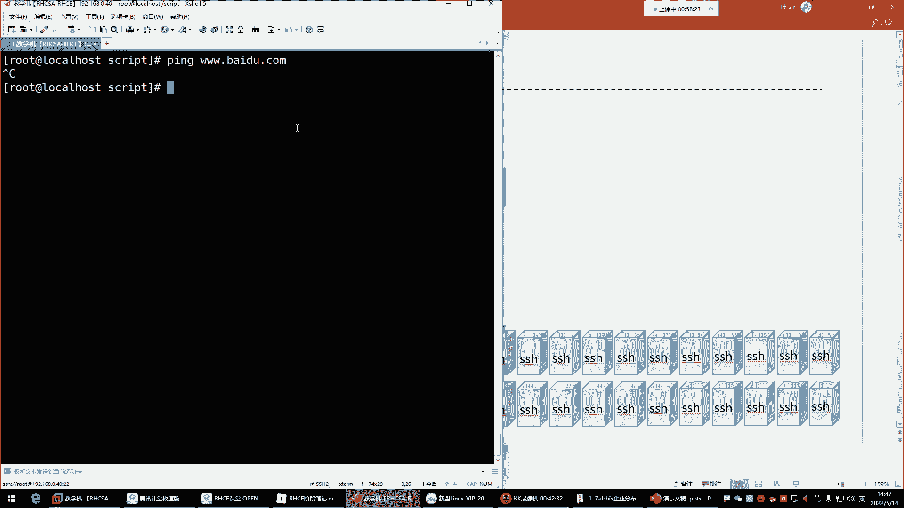

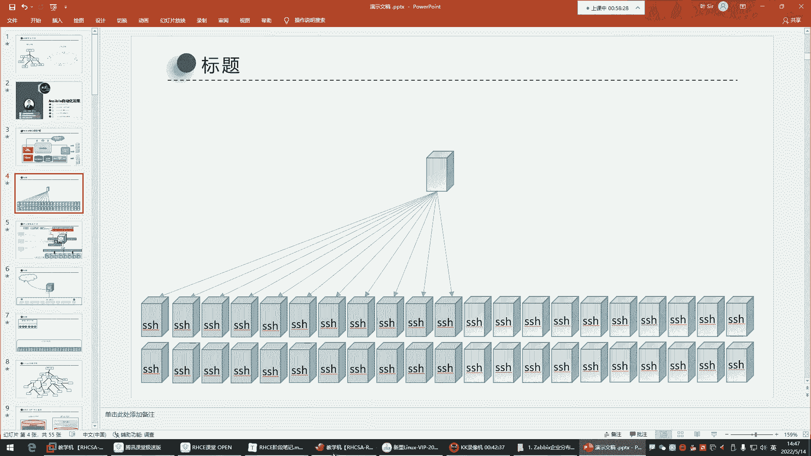

## 探索for循环

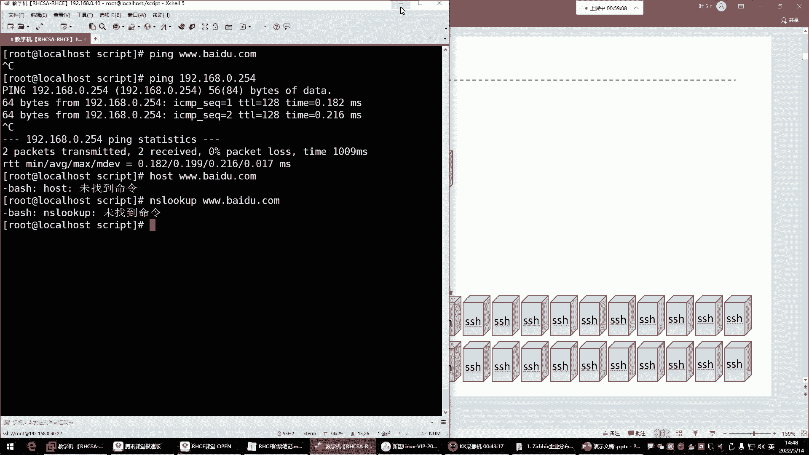

理解了条件判断后，我们来看看如何让脚本重复执行任务，这就需要用到`for`循环。`for`循环用于循环处理，它可以根据变量取值，重复执行一系列命令。

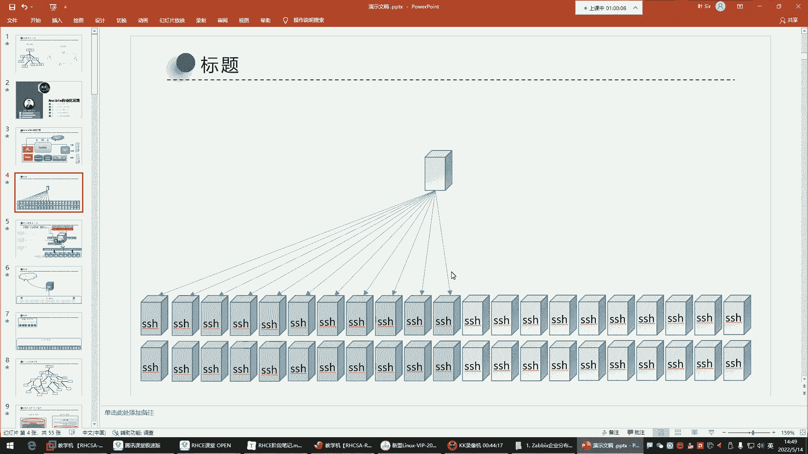


简单来说，`for`循环就是帮你自动化地、重复地去做一些事情。

以下是`for`循环的基本语法：
```bash
for 变量名 in 值列表
do
    要重复执行的命令
done
```
循环会对`in`关键字后面的“值列表”中的每一个值进行遍历。每次循环，都会将列表中的一个值赋给“变量名”，然后执行`do`和`done`之间的所有命令。当列表中的所有值都被遍历完后，循环结束，脚本继续执行后续内容或退出。

为了让你更直观地理解，我们来看一个创建用户的脚本示例。

以下是`for`循环创建用户的脚本思路：
1.  定义一个包含用户名的值列表（例如：小方 小V 九妹 阿联）。
2.  使用`for`循环遍历这个列表。
3.  在循环体内，使用`useradd`命令创建用户，并使用`passwd`命令设置密码。
4.  通过`echo`命令输出创建成功的信息。

脚本执行时，会依次将“小方”、“小V”等用户名赋值给变量，并执行创建用户和设置密码的命令，从而实现批量操作。

---

## for循环实战：测试服务器连通性

`for`循环的一个典型应用场景是批量测试网络中服务器的连通性。例如，作为系统维护员，你需要快速检查一批服务器（IP地址从192.168.0.1到192.168.0.254）哪些是在线的，哪些已经宕机。

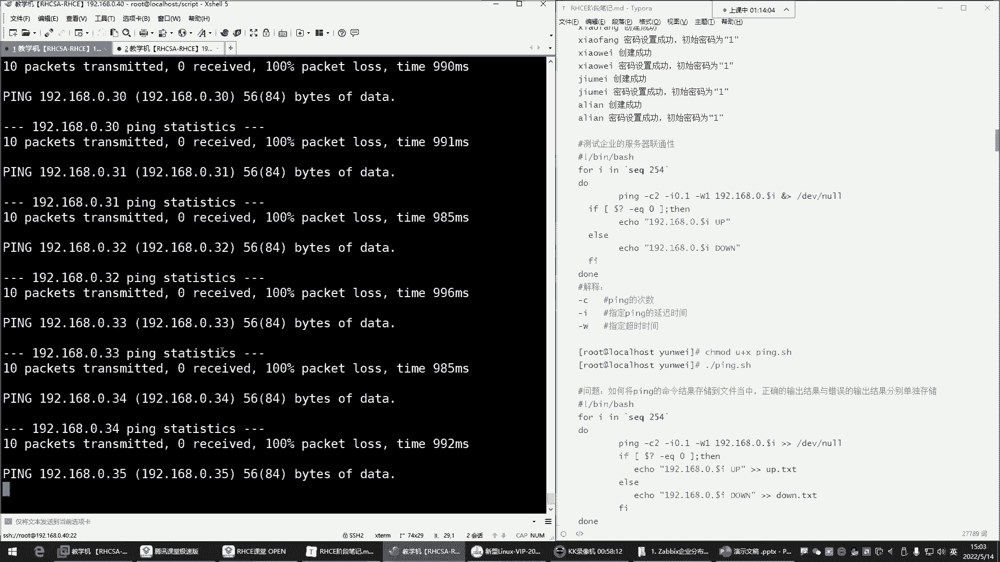

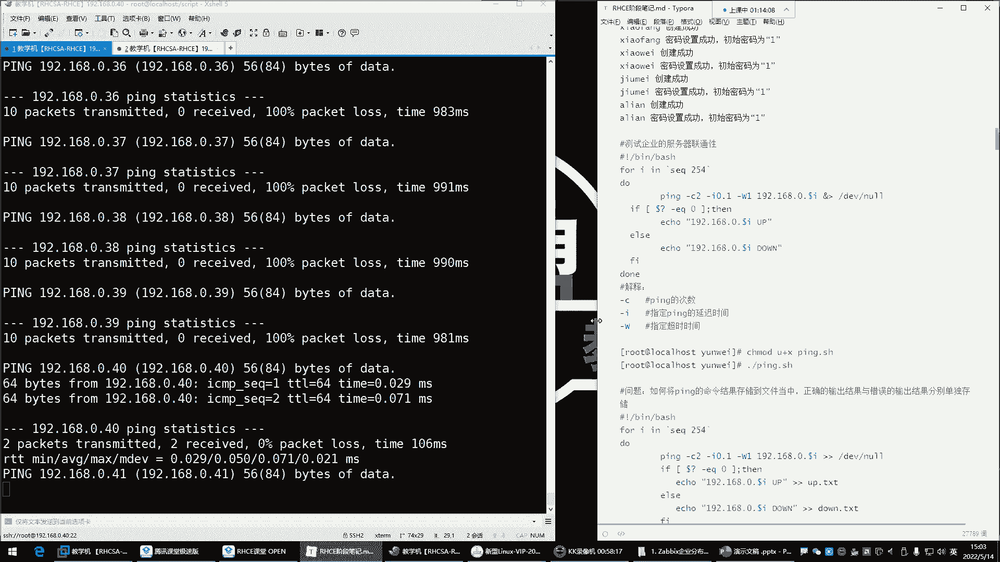

手动逐一执行`ping`命令效率极低。此时，我们可以利用`for`循环自动完成这项工作。

以下是利用`for`循环进行网络连通性测试的基本思路：
1.  使用`for`循环遍历一个IP地址范围（如192.168.0.{1..254}）。
2.  在循环体内，对每个IP地址执行`ping`命令。
3.  根据`ping`命令的返回值（退出状态码）判断主机是否在线。
4.  将在线（up）和离线（down）的主机信息分别输出到不同的日志文件中，便于查看。

在编写脚本时，需要注意`ping`命令的默认行为会持续发送数据包。为了控制脚本执行速度和输出，我们通常使用`-c`参数指定发送包的数量，使用`-i`参数设置间隔时间，使用`-W`参数设置超时时间。

一个优化后的测试脚本会将结果重定向到文件，并且可以在后台运行，这样就不会干扰前台的正常工作。你可以通过查看生成的`net_up.txt`和`net_down.txt`文件来快速获取服务器状态报告。

此外，生成数字序列除了使用`{1..254}`这种大括号扩展，还可以使用`seq`命令，例如 **\`seq 1 254\`** 或 **\`seq 100 254\`**，两者效果类似。

---

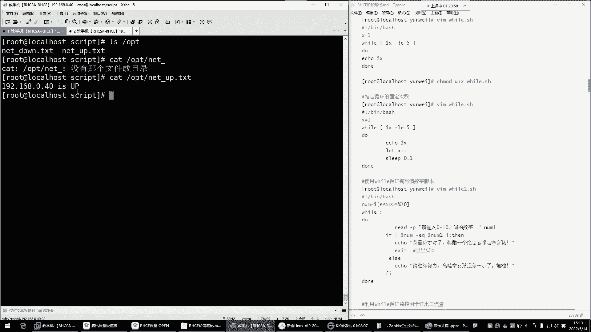

## 本节课总结

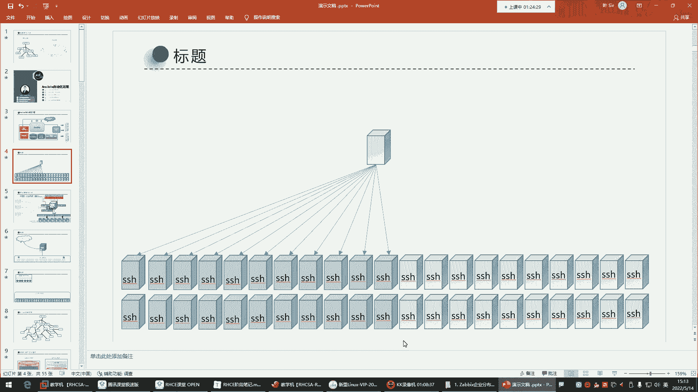

本节课中我们一起学习了Shell脚本中两个强大的工具：`case`条件判断和`for`循环。

我们首先了解了`case`语句的结构与用途，它擅长于基于一个变量的多种可能值进行清晰的分支判断。接着，我们深入探讨了`for`循环，它能够遍历一个列表并重复执行命令，是实现批量任务自动化的核心。最后，我们通过一个“批量测试服务器连通性”的实战案例，综合运用了`for`循环、命令返回值判断以及输出重定向等知识。

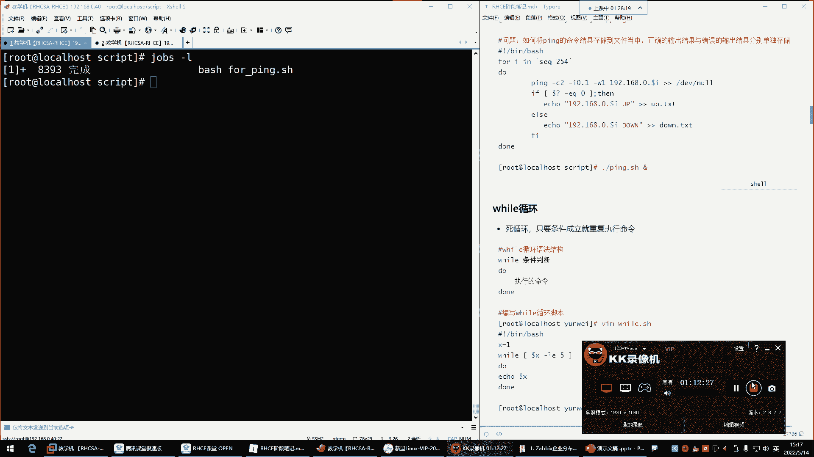

掌握这些结构，将极大地提升你编写高效、自动化运维脚本的能力。