# Linux运维进阶：P45：shell函数、脚本中断及退出、字符串处理 📚

在本节课中，我们将学习Shell脚本中的几个进阶概念：如何利用`while`循环进行持续监控，如何定义和使用函数来简化脚本，如何控制脚本的中断与退出，以及如何进行基础的字符串处理。这些知识将帮助你编写更高效、更健壮的脚本。


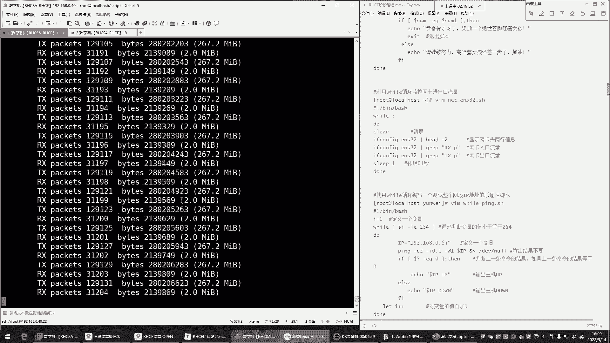


## 利用while循环进行持续监控 🔄


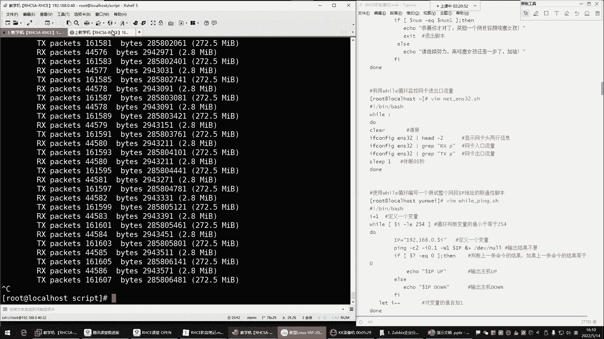

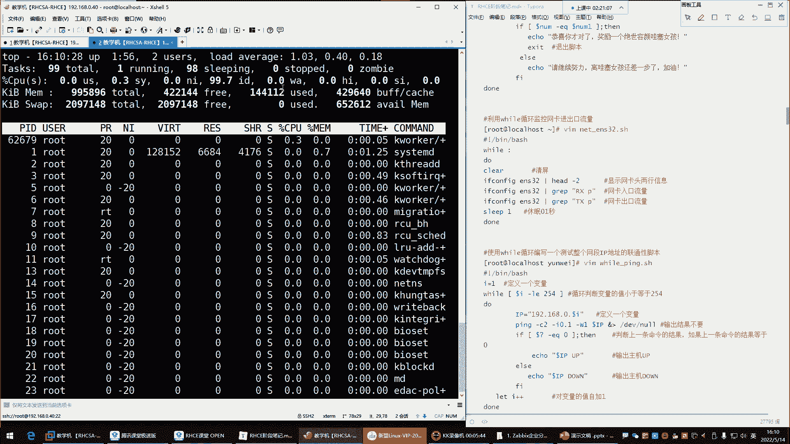

上一节我们介绍了循环结构，本节中我们来看看如何利用`while`循环执行需要持续进行的任务，例如监控系统资源。

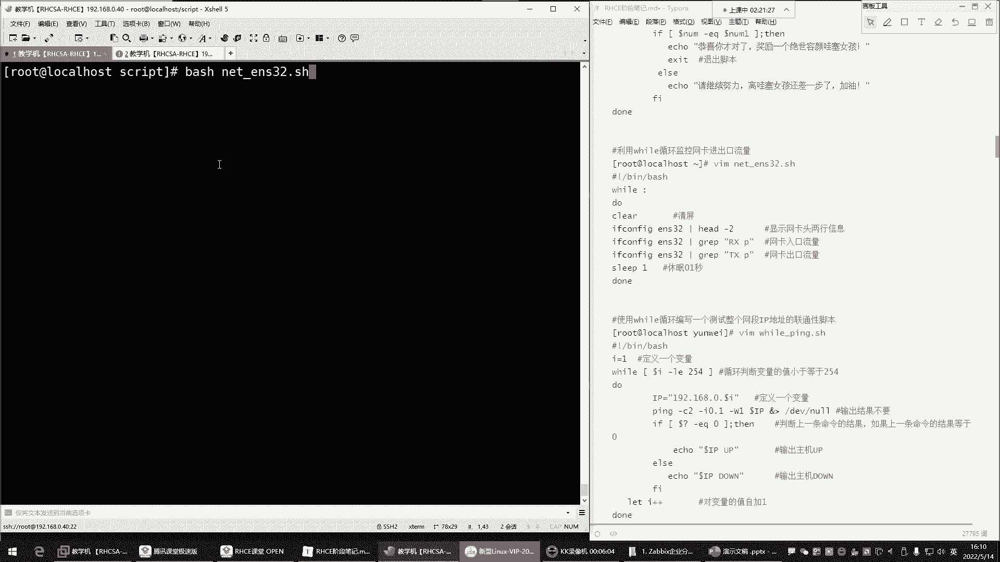


`while`循环可以创建“死循环”，持续执行特定命令。其基本语法如下：
```bash
while :
do
    # 要执行的命令
done
```
或者使用 `while true`，效果相同。

例如，监控网卡`ens32`的入口和出口流量：
```bash
while :
do
    clear
    ifconfig ens32 | grep "RX packets"
    ifconfig ens32 | grep "TX packets"
    sleep 0.2
done
```
这个脚本会每0.2秒清屏并显示一次网卡流量。**注意**：纯粹的`while`死循环会大量消耗CPU资源，因此务必使用`sleep`命令让循环暂停片刻。

## Shell脚本中的函数 🧩

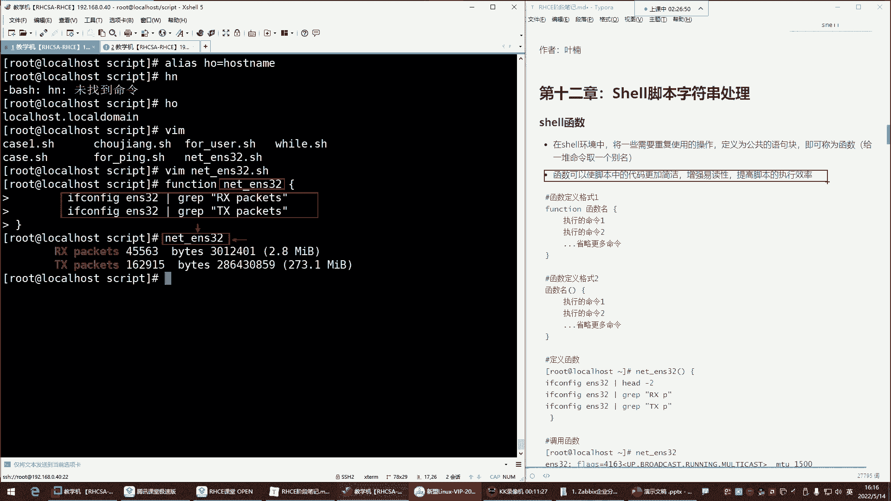


函数可以将一系列需要重复使用的命令封装起来，使脚本结构更清晰、更易读、更易维护。

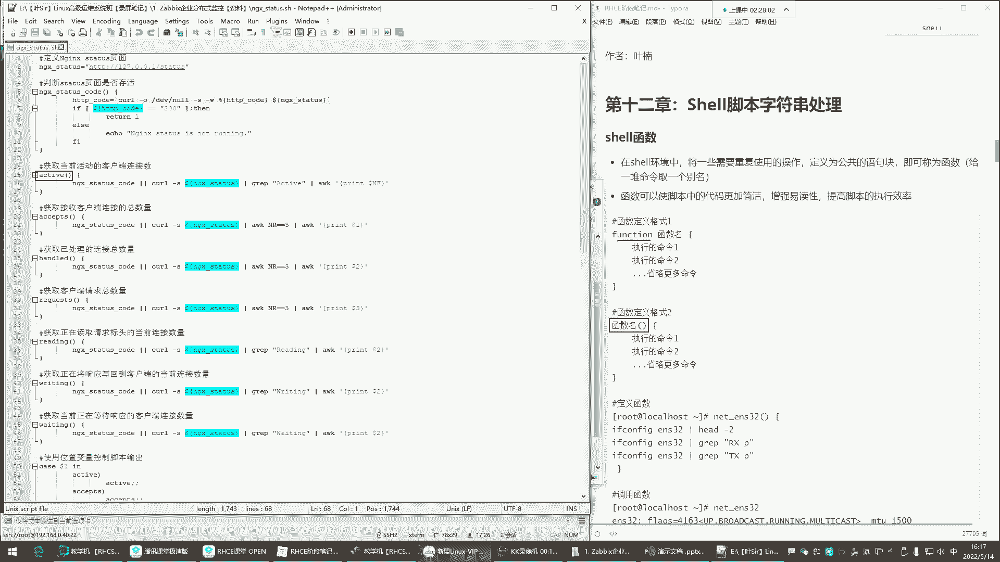


定义函数有两种常用格式：

1.  使用 `function` 关键字：
    ```bash
    function 函数名 {
        命令1
        命令2
        ...
    }
    ```

2.  直接使用函数名（更简洁）：
    ```bash
    函数名() {
        命令1
        命令2
        ...
    }
    ```

定义后，通过输入函数名即可调用其中的所有命令。

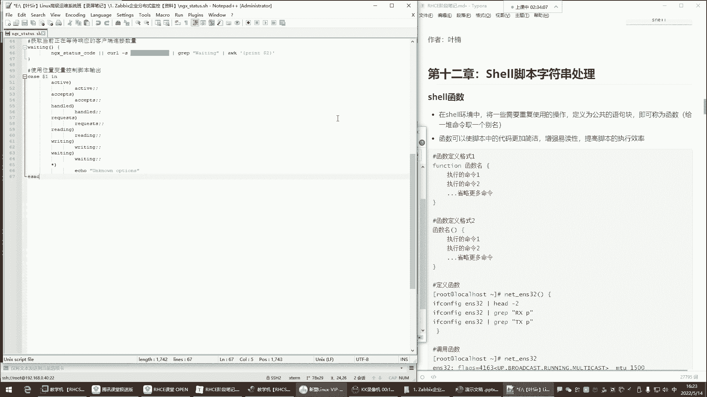

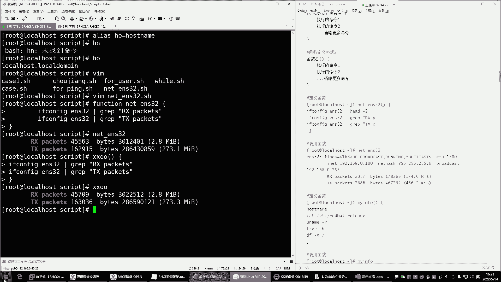

以下是一个定义并调用函数的例子，用于查看系统信息：
```bash
sys_info() {
    hostname
    cat /etc/redhat-release
    free -h
    df -h /
}

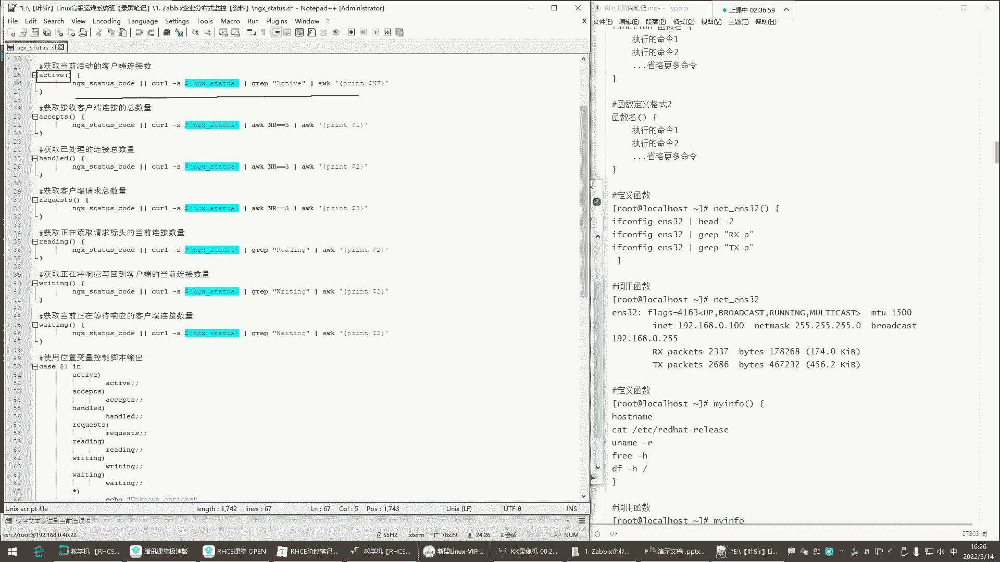

# 调用函数
sys_info
```
函数通常在脚本内部定义和使用，它就像是给一组命令起了一个“别名”，方便在脚本中多次调用。

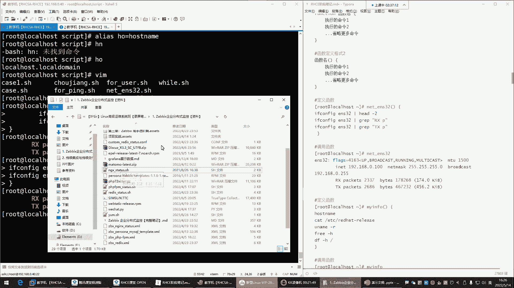

## 脚本的中断与退出控制 ⏹️

在循环中，我们有时需要根据条件提前结束循环或退出整个脚本。Shell提供了几个控制命令：

*   `continue`：**结束本次循环**，跳过`continue`之后、循环体结束之前的语句，直接进入下一次循环。
*   `break`：**结束整个循环**，跳出当前所在的循环体。
*   `exit`：**退出整个Shell脚本**，脚本立即停止执行。

以下通过一个例子展示三者的区别：
```bash
#!/bin/bash
for i in {1..5}
do
    if [ $i -eq 3 ]; then
        # 尝试分别替换为 continue, break, exit 查看效果
        continue
    fi
    echo "循环次数: $i"
done
echo “循环外的命令”
```
- 使用 `continue`：当`i`等于3时跳过本次循环的`echo`，输出1,2,4,5，最后执行循环外的命令。
- 使用 `break`：当`i`等于3时直接跳出整个`for`循环，只输出1,2，然后执行循环外的命令。
- 使用 `exit`：当`i`等于3时整个脚本立即停止，只输出1,2，循环外的命令也不会执行。

## 字符串处理基础 ✂️

在处理命令输出或进行判断时，经常需要截取或处理字符串。这里介绍基础的字符串长度获取和截取方法。

首先，定义一个字符串变量：
```bash
phone="13800138000"
```

获取字符串长度：
```bash
echo ${#phone}  # 输出：11
```
`${#变量名}` 可以获取变量中字符串的字符数量。

字符串截取：
```bash
echo ${phone:0:3}  # 输出：138
```
语法为 `${变量名:起始位置:截取长度}`。**注意**：起始位置从0开始计算。上述命令表示从第0个字符开始，截取3个字符。

---

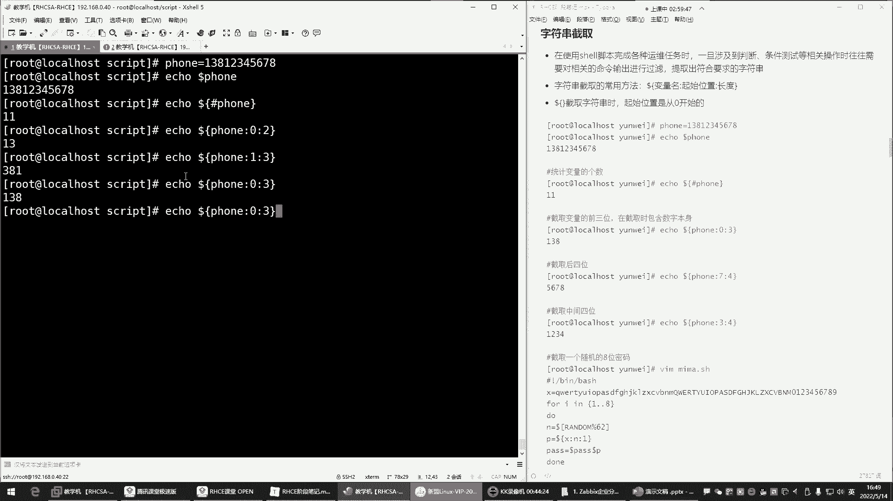

本节课中我们一起学习了Shell脚本的进阶知识。我们掌握了如何使用`while`循环进行持续监控并合理控制资源消耗；理解了函数的作用，它能将多行命令封装，提升脚本的简洁性和可读性；学会了使用`continue`、`break`和`exit`来控制脚本的执行流程；最后，简单了解了如何获取字符串长度和进行截取操作。这些概念是编写复杂、实用Shell脚本的重要基石。