# Linux运维进阶：P46：Shell字符串处理与脚本实践 🧵

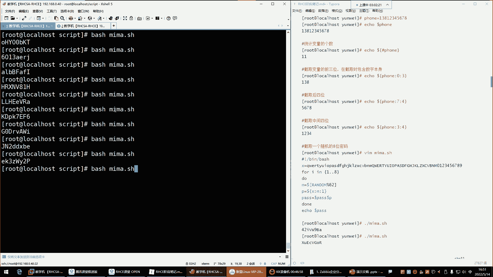

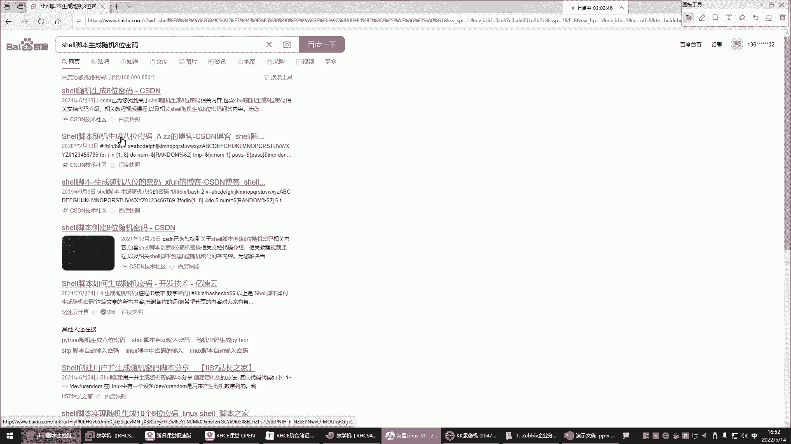

在本节课中，我们将学习Shell脚本中的字符串处理功能，包括字符串截取、替换和掐头去尾。这些功能在处理文本、生成随机数据或批量修改文件时非常有用。更重要的是，我们将探讨如何在实际工作中高效地“借鉴”和修改现有脚本来解决问题，而不是从零开始编写。

## 字符串截取 ✂️

上一节我们介绍了Shell脚本的基础概念，本节中我们来看看字符串截取。字符串截取允许我们从变量存储的字符串中提取指定部分。

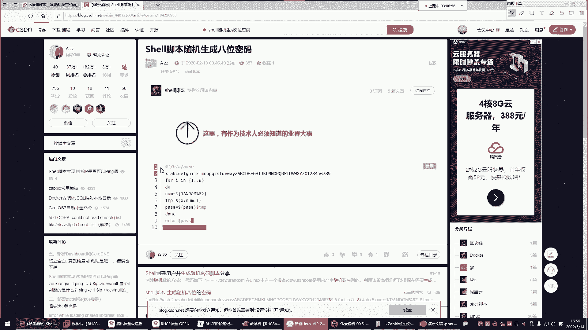

其基本语法格式为：
```bash
${变量名:起始位置:长度}
```
*   **起始位置**：从0开始计数。
*   **长度**：要截取的字符数量。

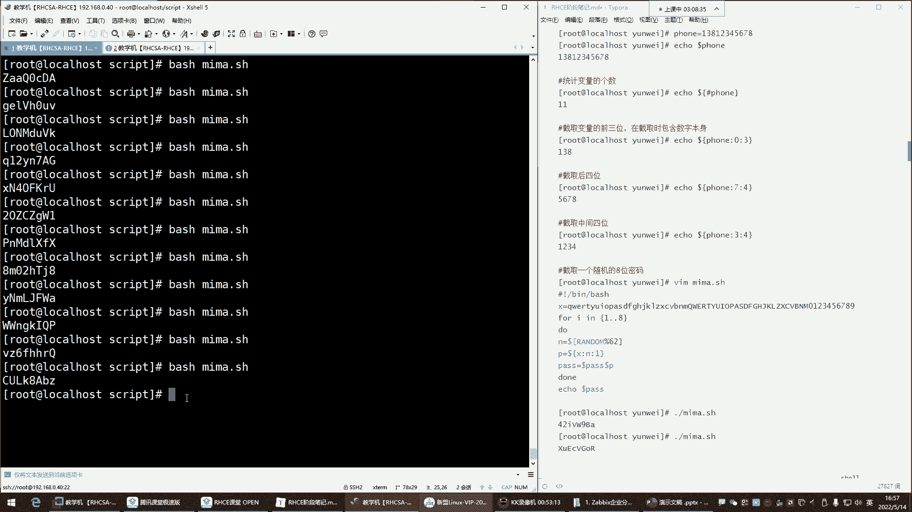

例如，我们有一个变量 `phone="13812345678"`，想截取后四位“5678”：
```bash
echo ${phone:7:4}
```
输出结果为 `5678`。这个功能不仅限于数字，也可以用于截取文件内容等文本。

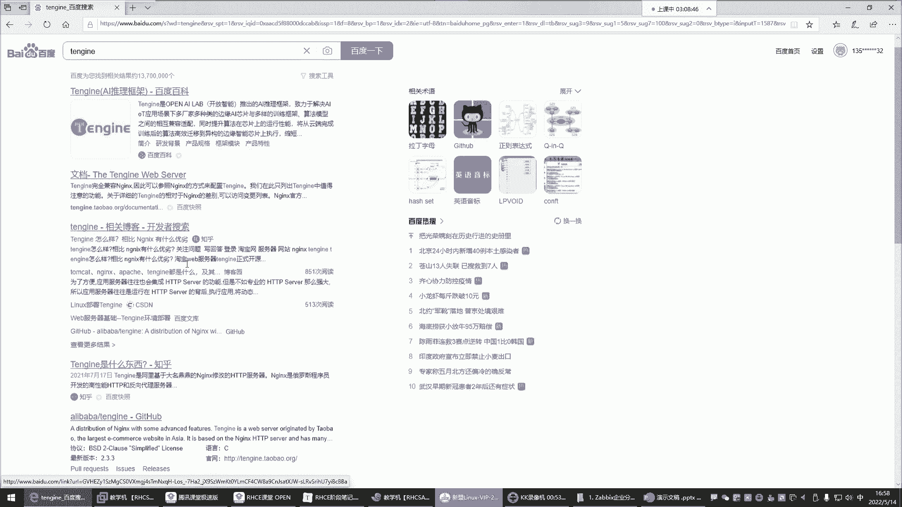

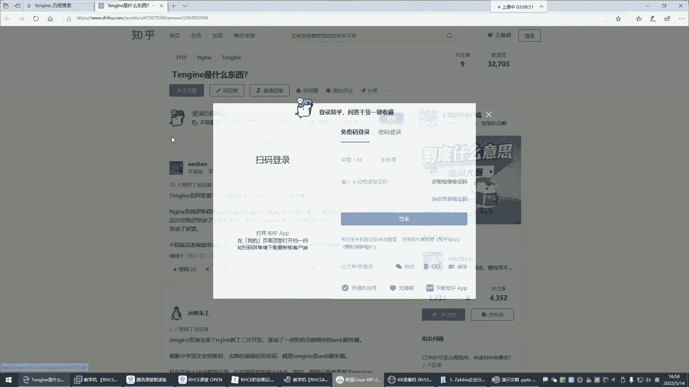

## 生成随机密码示例 🔐

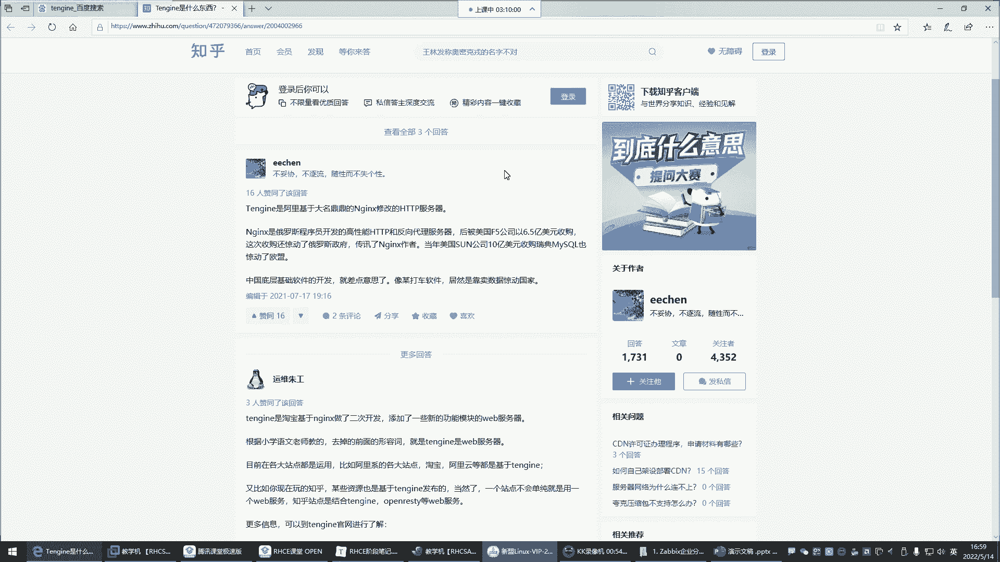

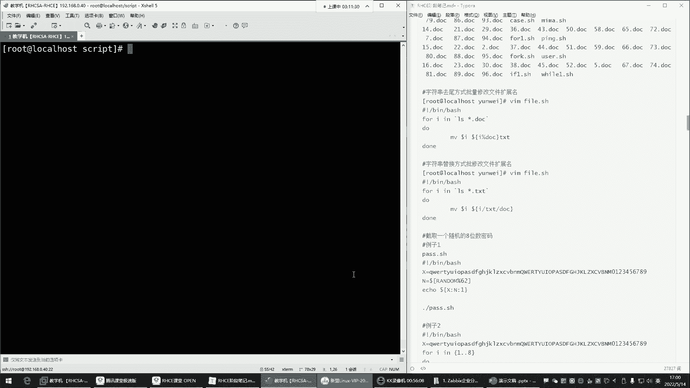

字符串截取的一个典型应用是生成随机密码。以下是实现随机八位密码脚本的核心思路：

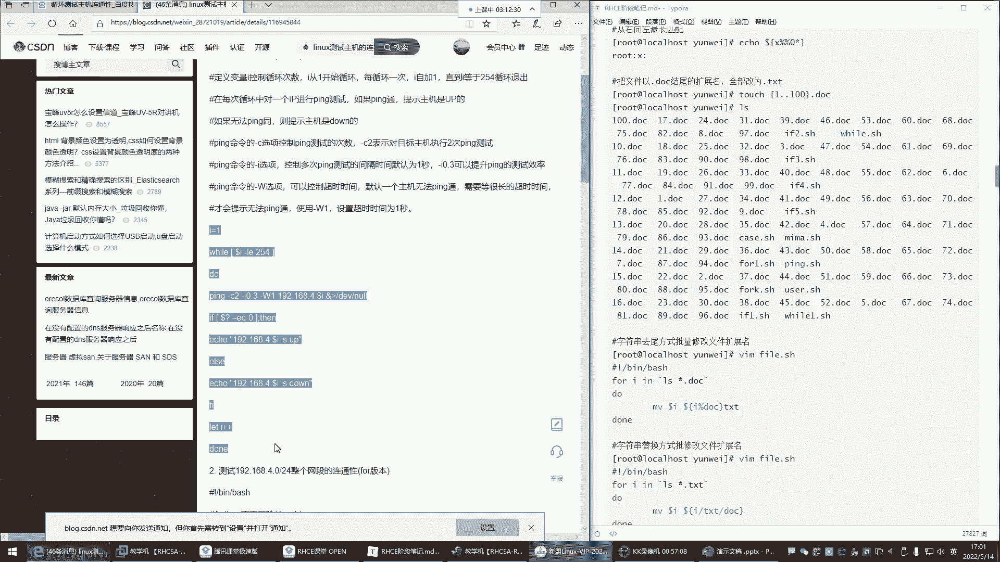

1.  定义一个包含所有小写字母、大写字母和数字（共62个字符）的字符串变量。
2.  通过循环执行8次，每次循环：
    *   生成一个随机数，并对62取余，确保结果在0-61之间。
    *   使用字符串截取语法，从62位字符串中取出该随机数对应位置的1个字符。
    *   将每次取出的字符拼接起来，最终形成8位密码。

以下是脚本关键部分的简化示意：
```bash
chars="abcdefghijklmnopqrstuvwxyzABCDEFGHIJKLMNOPQRSTUVWXYZ0123456789"
for i in {1..8}
do
    index=$((RANDOM % 62))
    pass=${pass}${chars:index:1}
done
echo $pass
```
对于这类有明确需求的脚本，通常不需要自己从头编写，可以在网上搜索“Shell生成随机密码脚本”等关键词，找到现成可用的代码，然后根据实际环境进行微调。

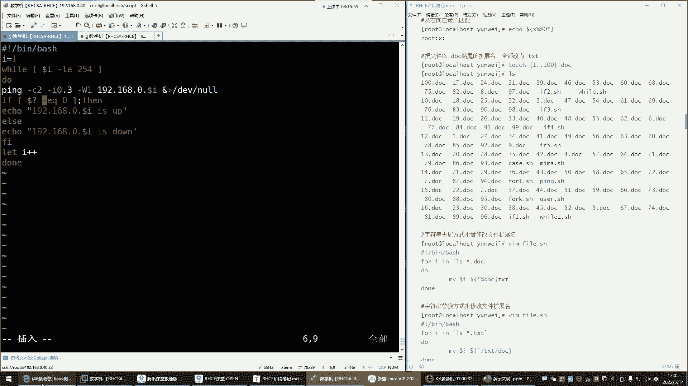

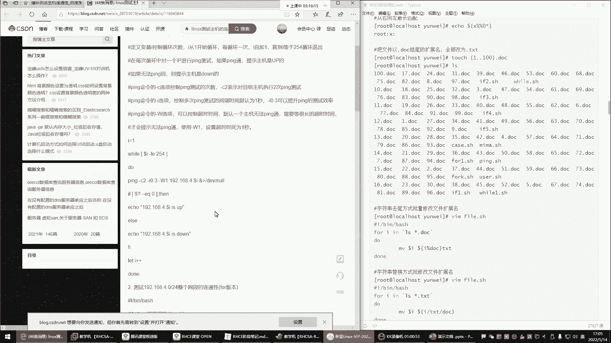

## 字符串替换 🔄

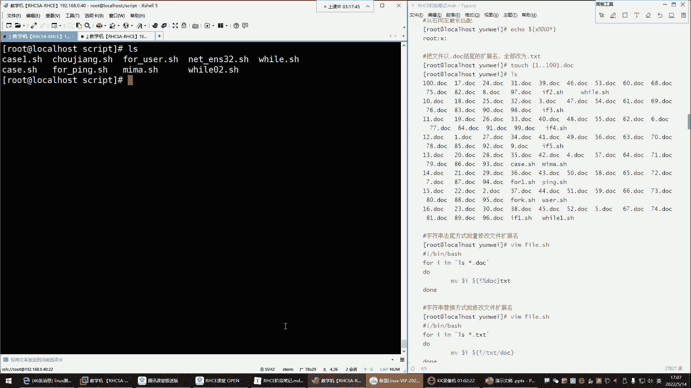

字符串替换功能可以将变量中指定的旧内容替换为新内容。

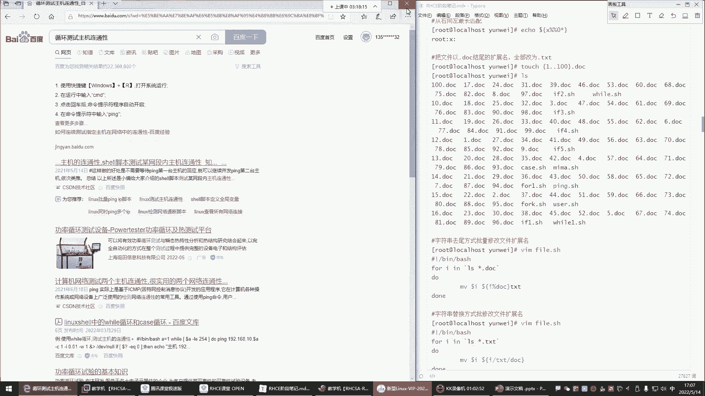

其语法格式为：
```bash
${变量名/旧字符串/新字符串}   # 替换第一个匹配项
${变量名//旧字符串/新字符串}  # 替换所有匹配项
```
例如，将变量 `str="13812345678"` 中的 “1234” 替换为 “****”：
```bash
echo ${str/1234/****}
```
输出结果为 `138****5678`。

这个功能类似于文本编辑器（如Vim）中的替换操作，可以方便地批量修改内容。

## 字符串掐头去尾 ✂️

“掐头去尾”指的是删除字符串开头或结尾的指定部分。

其语法格式如下：
*   **掐头（从左向右删除）**：
    ```bash
    ${变量名#关键词}    # 最短匹配删除
    ${变量名##关键词}   # 最长匹配删除
    ```
*   **去尾（从右向左删除）**：
    ```bash
    ${变量名%关键词}    # 最短匹配删除
    ${变量名%%关键词}   # 最长匹配删除
    ```

例如，对于变量 `path="/usr/local/bin"`：
```bash
echo ${path#*/}    # 输出 usr/local/bin (删除第一个`/`及之前的部分)
echo ${path##*/}   # 输出 bin (删除最后一个`/`及之前的部分)
echo ${path%/*}    # 输出 /usr/local (删除最后一个`/`及之后的部分)
echo ${path%%/*}   # 输出 空 (删除第一个`/`及之后的部分)
```

## 实践：批量修改文件扩展名 📁

字符串处理功能的一个实用场景是批量修改文件扩展名。

假设当前目录有大量 `.txt` 文件，需要将其改为 `.doc`。我们可以结合循环和字符串替换来实现：

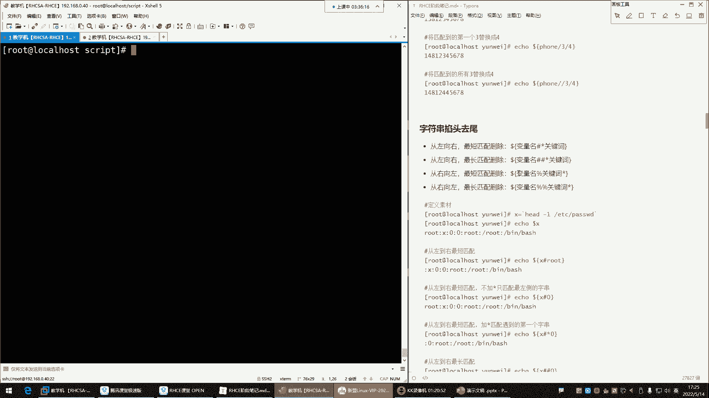

**方法一：使用字符串替换**
```bash
#!/bin/bash
for file in *.txt
do
    mv "$file" "${file/.txt/.doc}"
done
```

**方法二：使用去尾（%）再拼接**
```bash
#!/bin/bash
for file in *.txt
do
    mv "$file" "${file%.txt}.doc"
done
```
执行脚本后，所有 `.txt` 文件的扩展名都会被改为 `.doc`。在实际工作中，遇到此类需求时，同样可以先在网上搜索“Shell批量修改文件扩展名”等方案，然后根据找到的脚本进行理解和修改。

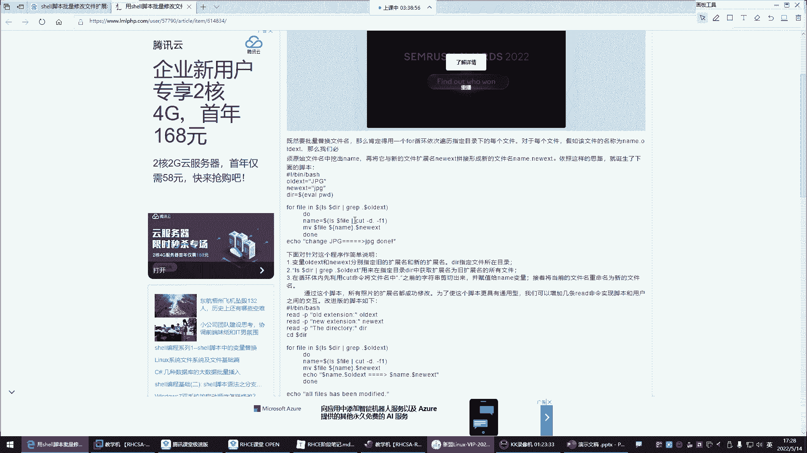

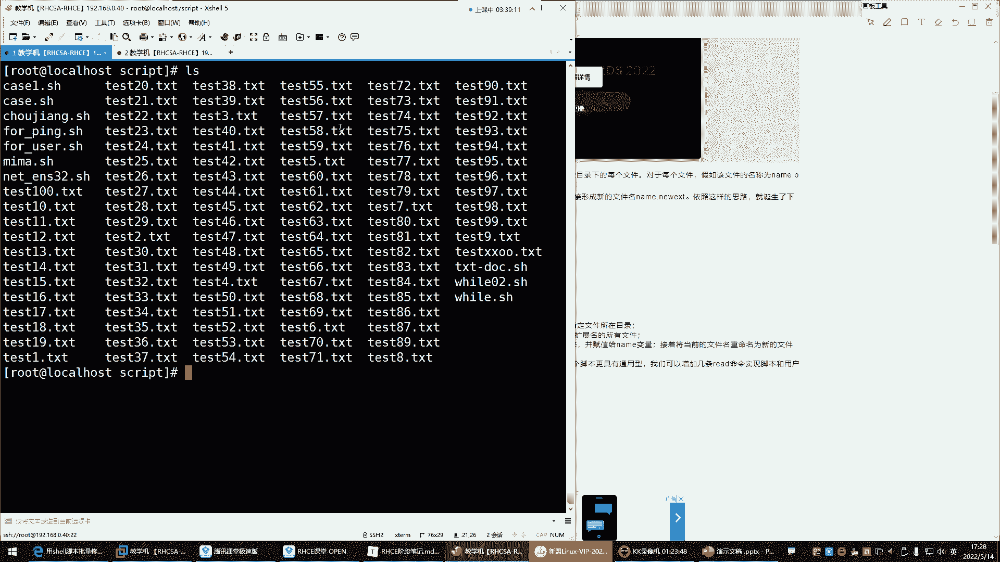

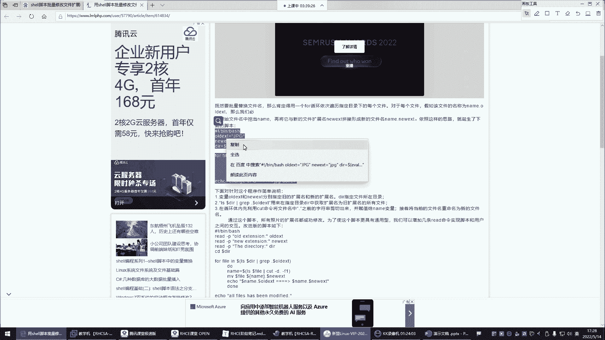

## 学习脚本的核心：理解与修改 💡

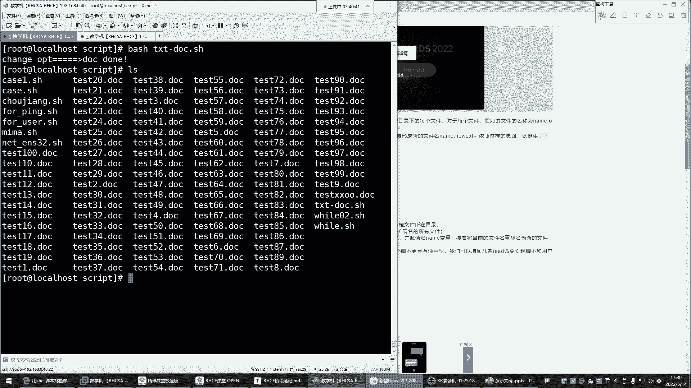

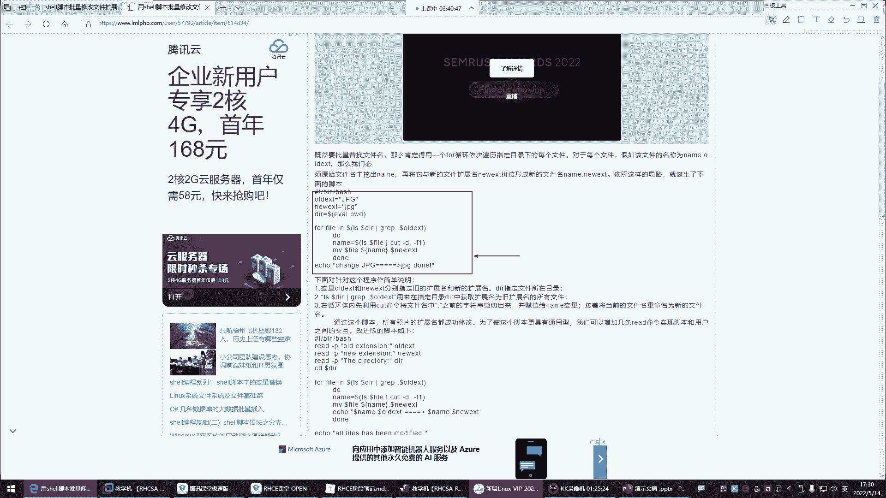

通过本节课的示例，我们可以总结出学习Shell脚本的一个高效方法：

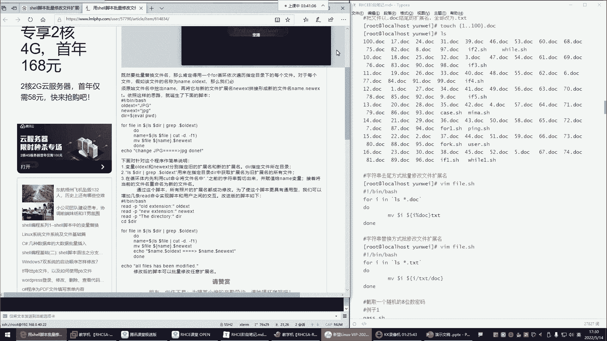

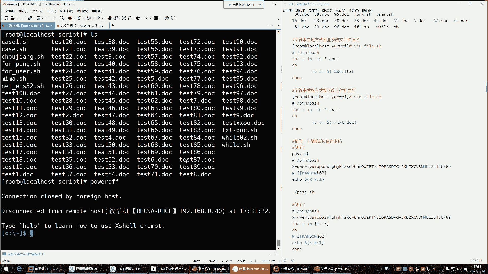

1.  **掌握基础语法**：理解变量、循环、判断以及字符串处理等基本操作是读懂他人脚本的前提。
2.  **明确需求**：清楚自己要实现什么功能。
3.  **善用搜索**：在互联网上搜索相关功能的实现脚本（如“Shell测试主机连通性”、“Shell批量重命名”）。
4.  **借鉴与修改**：将找到的脚本拿来，先尝试运行。如果运行失败或不符合环境，则根据报错和已有知识进行调试和修改（例如，修正IP地址、检查命令路径、识别故意设置的错误等）。
5.  **在修改中学习**：这个过程本身就是一种深度学习，能帮助你巩固语法，并理解不同场景下的脚本逻辑。

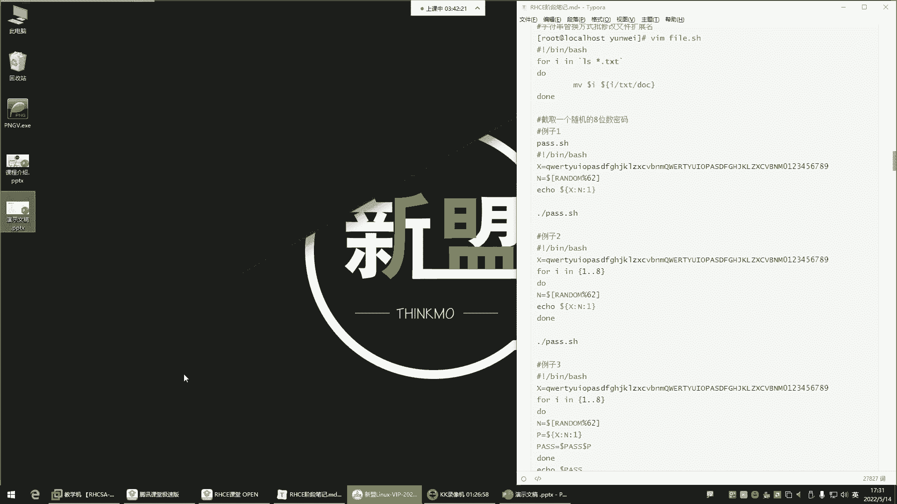

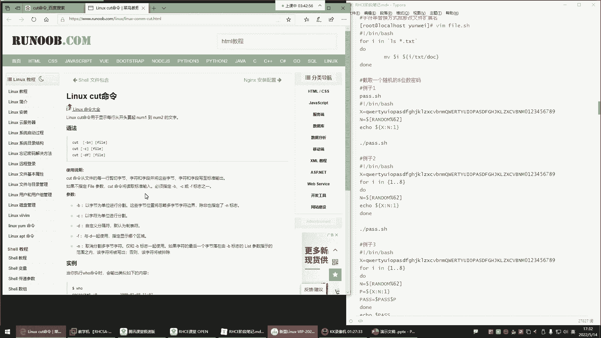

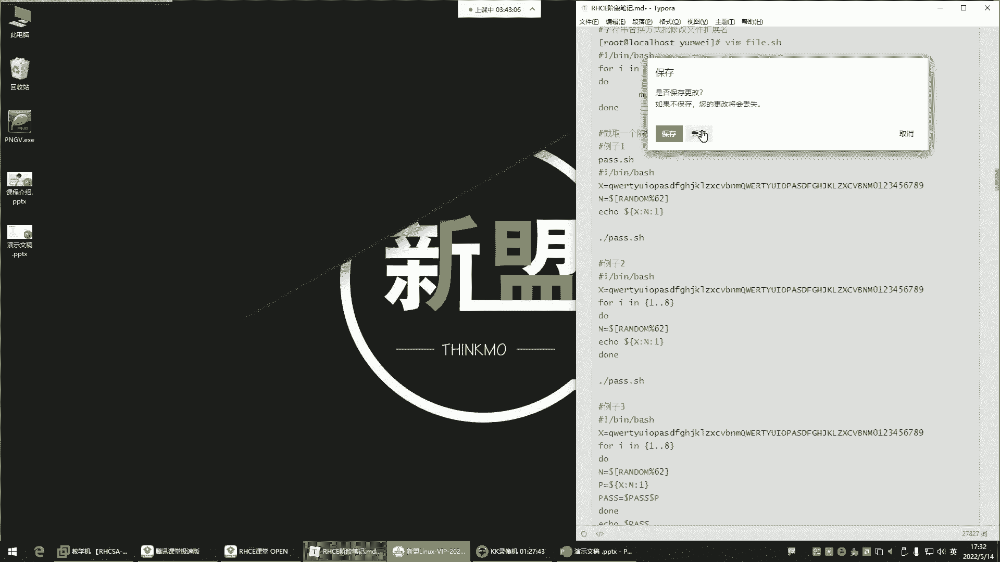


本节课中我们一起学习了Shell的字符串截取、替换和掐头去尾操作，并通过生成随机密码、批量修改文件名等案例看到了它们的实际应用。更重要的是，我们探讨了在运维工作中，**“会改”往往比“会写”更重要**。具备看懂、调试和优化现有脚本的能力，利用好前人的成果，是快速解决问题、提升效率的关键。