# Linux运维进阶：P47：Shell数组与正则表达式 📚

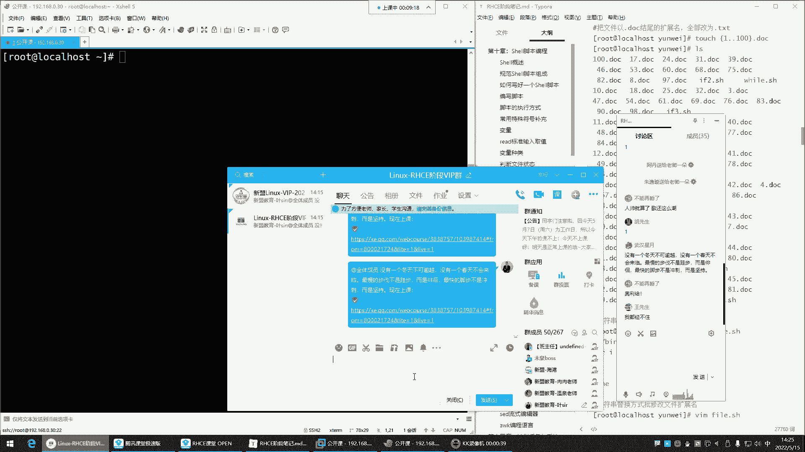

在本节课中，我们将要学习Shell脚本中的两个重要概念：数组和正则表达式。数组允许我们在一个变量中存储多个值，而正则表达式则是一套强大的文本匹配工具，用于数据过滤和处理。掌握它们将极大地提升你编写脚本和进行系统管理的效率。

---

## Shell数组 🧮

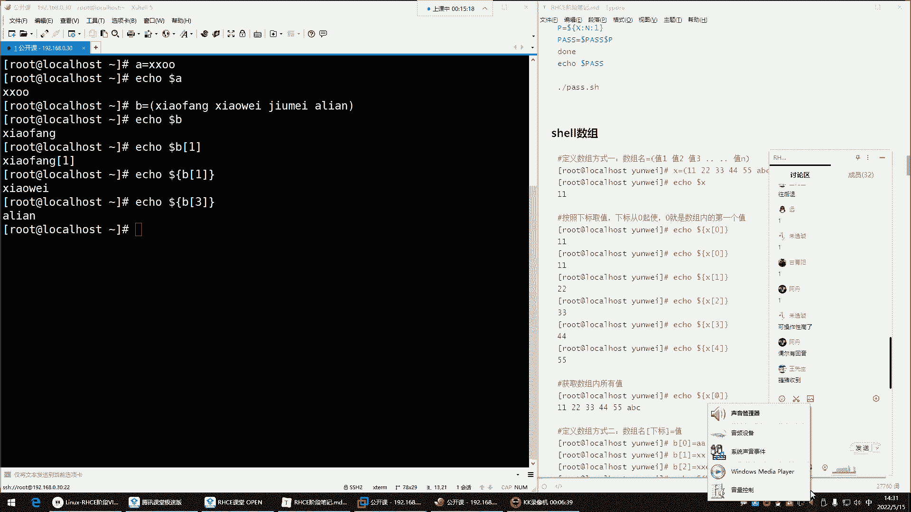

上一节我们介绍了变量的基本用法，本节中我们来看看它的“升级版”——数组。数组是一种特殊的变量，它允许你在一个变量名下存储多个值，并通过索引（下标）来访问这些值。

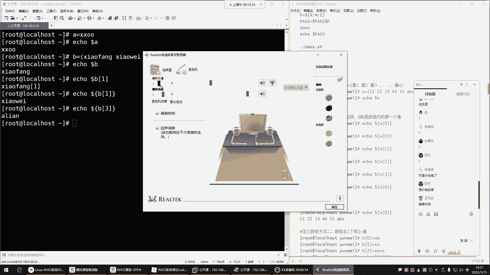

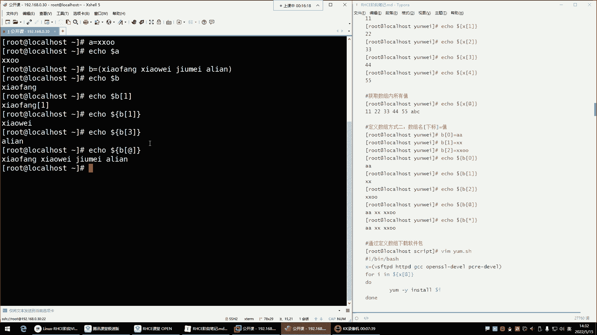

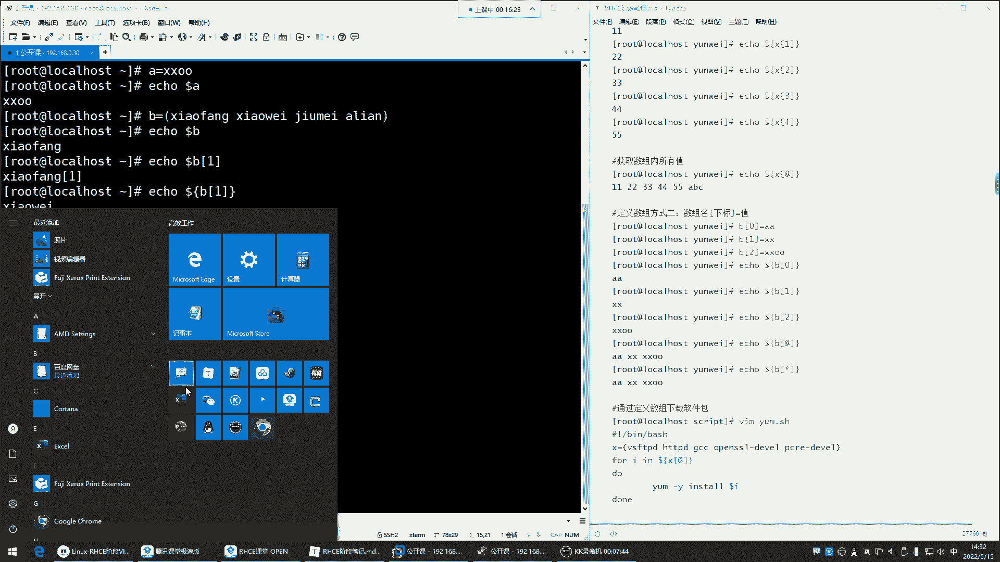


### 数组的定义与取值

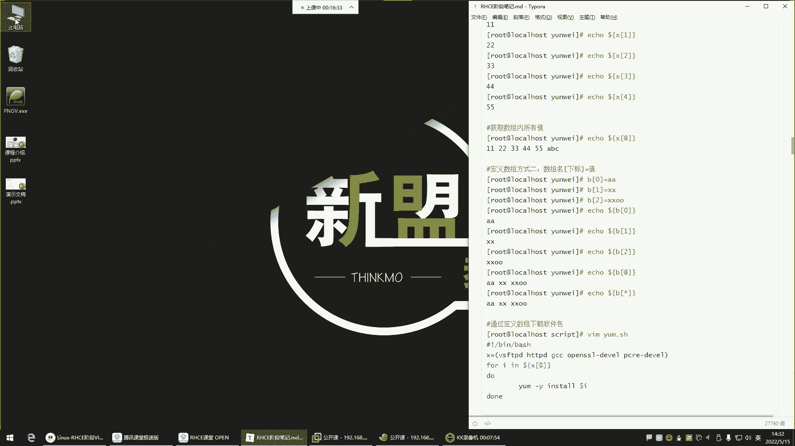

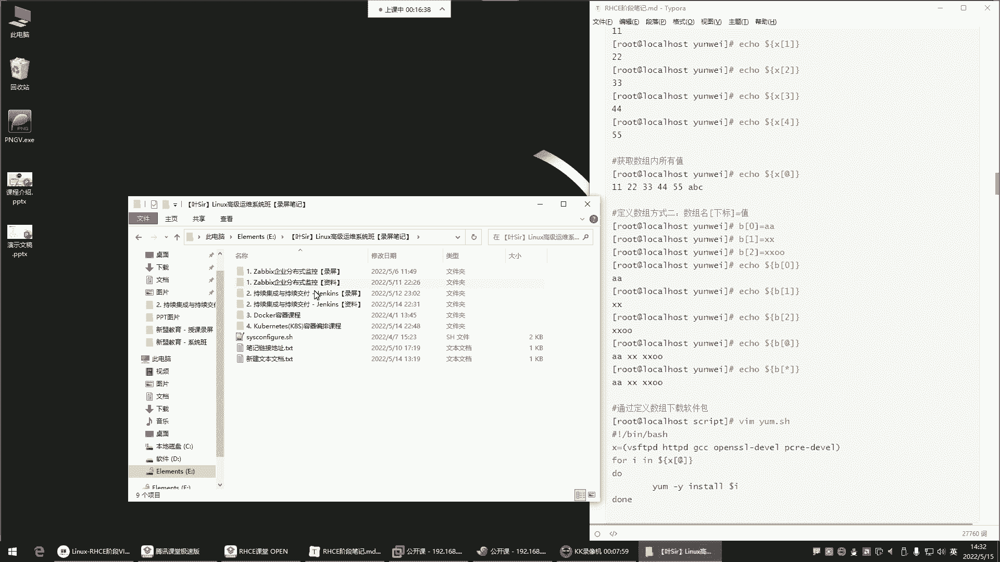

定义数组的语法与变量类似，但值需要用括号括起来，值之间用空格分隔。

```bash
数组名=(值1 值2 值3 ...)
```

以下是数组的基本操作示例：

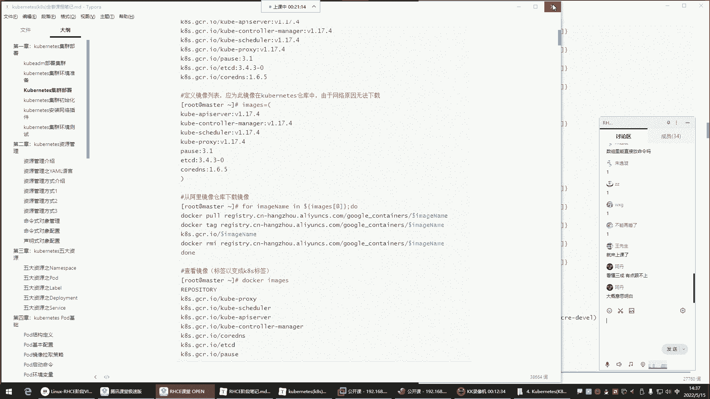

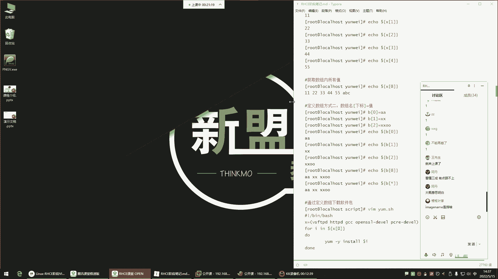

1.  **定义一个数组并查看其所有值：**
    ```bash
    B=(小方 小V 九妹 阿联)
    echo ${B[@]}
    ```
    输出：`小方 小V 九妹 阿联`

2.  **通过下标访问数组中的单个值：**
    数组的下标从0开始计数。`0`对应第一个值，`1`对应第二个值，依此类推。
    ```bash
    echo ${B[0]} # 输出：小方
    echo ${B[1]} # 输出：小V
    echo ${B[3]} # 输出：阿联
    ```

3.  **向数组中添加新值：**
    你可以直接为新的下标赋值来向数组中添加元素。
    ```bash
    B[4]="波多"
    echo ${B[@]} # 输出中会包含“波多”
    ```

### 数组的实用场景

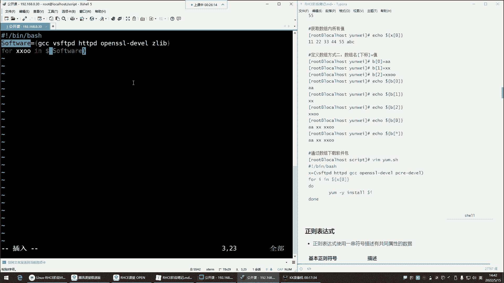

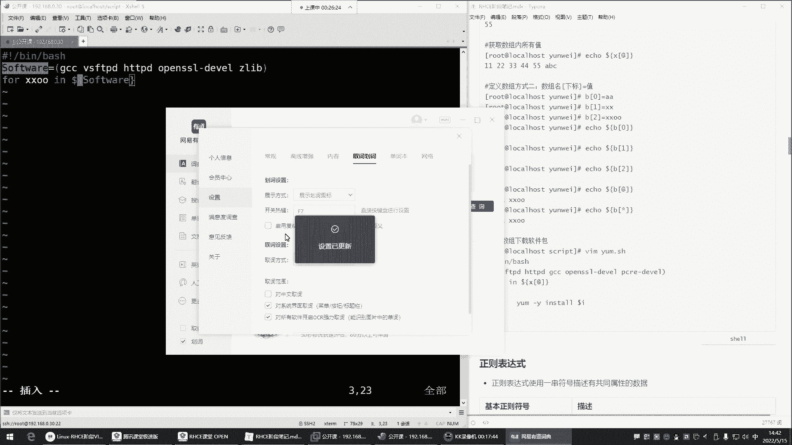

数组最常见的用途是与循环结构（如`for`循环）结合，批量处理一系列项目。

以下是数组的一个典型应用示例，用于批量安装软件包：

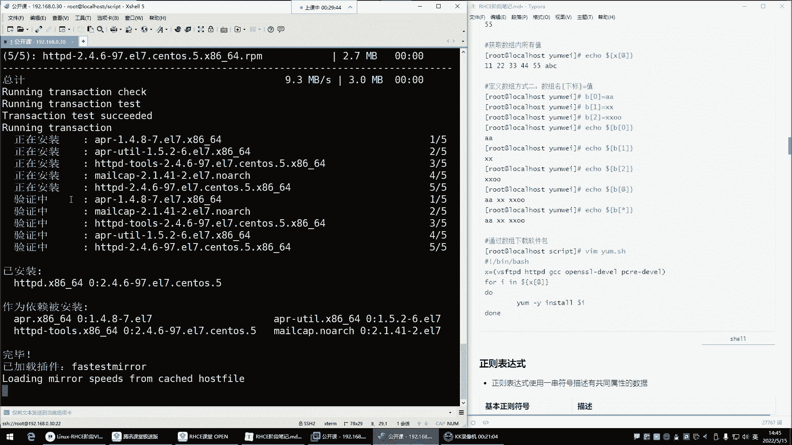

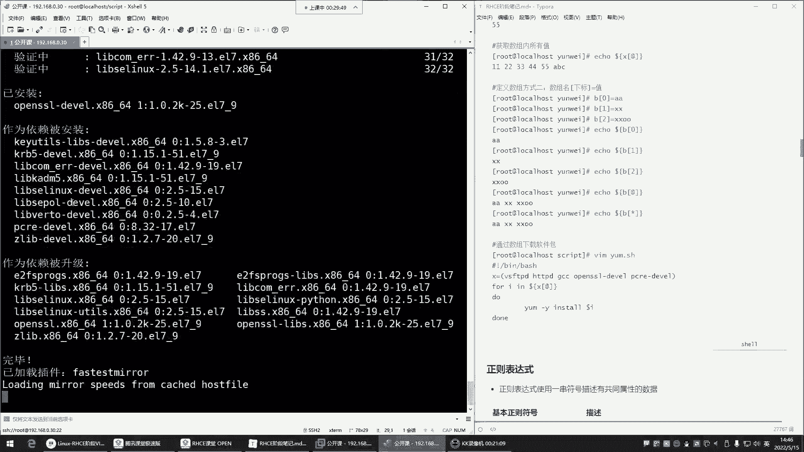

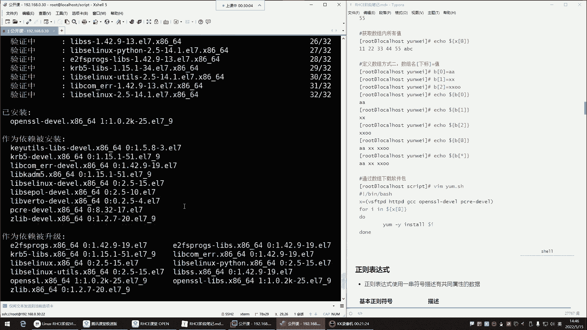

```bash
#!/bin/bash
# 定义一个包含多个软件包名称的数组
SOFTWARE=(gcc vsftpd httpd)

# 使用for循环遍历数组并安装每个软件包
for pkg in ${SOFTWARE[@]}
do
    yum -y install $pkg
done
```

在这个脚本中：
*   `${SOFTWARE[@]}` 表示获取数组`SOFTWARE`中的所有值。
*   `for`循环会依次将每个软件包名赋值给变量`pkg`，并执行安装命令。

---

## 正则表达式 🔍

上一节我们学习了如何用数组组织数据，本节中我们来看看如何用正则表达式来查找和过滤数据。正则表达式使用一系列特殊字符来描述字符串的匹配模式，它在文本处理、数据搜索和配置文件解析中非常有用。

### 常用正则表达式符号

以下是几个最常用且实用的正则表达式符号及其在`grep`命令中的用法：

1.  **`^` (尖角号)：匹配行首**
    用于匹配以特定字符串开头的行。
    ```bash
    grep "^root" /etc/passwd
    ```
    这条命令会找出`/etc/passwd`文件中所有以“root”开头的行。

2.  **`$` (美元符)：匹配行尾**
    用于匹配以特定字符串结尾的行。
    ```bash
    grep "bash$" /etc/passwd
    ```
    这条命令会找出所有使用bash作为登录shell的用户行。

3.  **`[]` (中括号)：匹配括号内的任意单个字符**
    用于匹配方括号中列举的任意一个字符。
    ```bash
    grep "[Rr]oot" /etc/passwd
    ```
    这条命令会匹配包含“Root”或“root”的行。

4.  **`[^]` (中括号内加尖角号)：对集合取反**
    匹配**不包含**在方括号内的任意单个字符。
    ```bash
    grep "[^0-9]" file.txt
    ```
    这条命令会匹配包含非数字字符的行。

5.  **`.` (点)：匹配任意单个字符**
    点号可以匹配任何一个字符（除了换行符）。
    ```bash
    grep "r..t" /etc/passwd
    ```
    这条命令会匹配像“root”、“rapt”、“r3st”这样的字符串。

6.  **`*` (星号)：匹配前一个字符0次或多次**
    ```bash
    grep "ro*t" /etc/passwd
    ```
    这条命令会匹配“rt”、“rot”、“root”、“rooot”等。

### 扩展正则表达式 (ERE)

以上是“基本正则表达式(BRE)”。还有一些更强大的“扩展正则表达式(ERE)”符号，使用时需要在`grep`后加`-E`选项，或直接使用`egrep`命令。

1.  **`+` (加号)：匹配前一个字符1次或多次**
    ```bash
    egrep "ro+t" /etc/passwd
    ```
    匹配“rot”、“root”、“rooot”等，但不匹配“rt”。

2.  **`?` (问号)：匹配前一个字符0次或1次**
    ```bash
    egrep "ro?t" /etc/passwd
    ```
    匹配“rt”或“rot”。

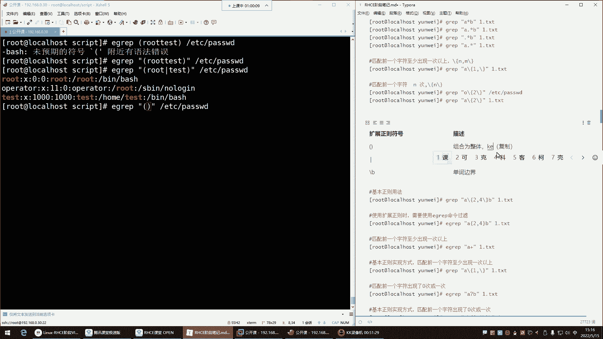

3.  **`|` (竖线)：表示“或”关系**
    ```bash
    egrep "(root|test)" /etc/passwd
    ```
    匹配包含“root”**或**“test”的行。小括号`()`用于将模式分组为一个整体。

4.  **`{n,m}` (大括号)：匹配前一个字符n到m次**
    ```bash
    egrep “o{1,2}” /etc/passwd
    ```
    匹配包含1个或2个连续字母“o”的行。

---

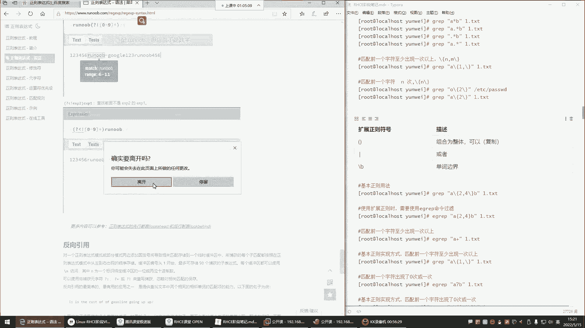

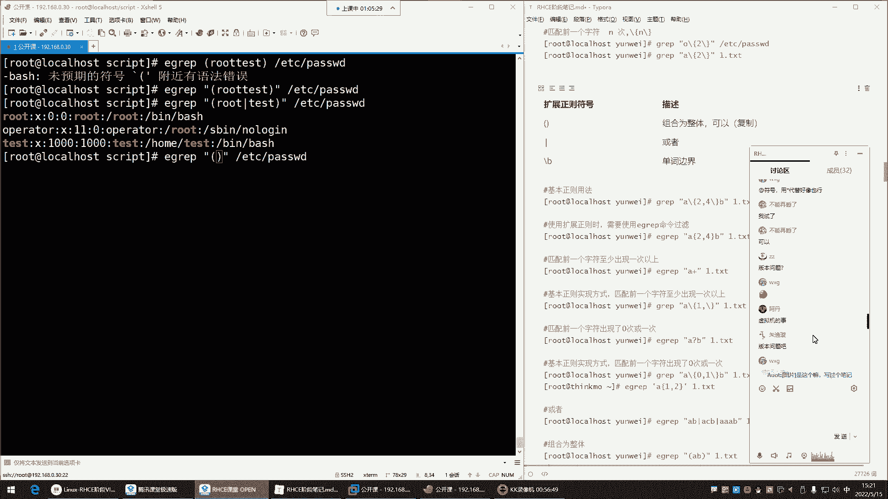

## 总结 📝

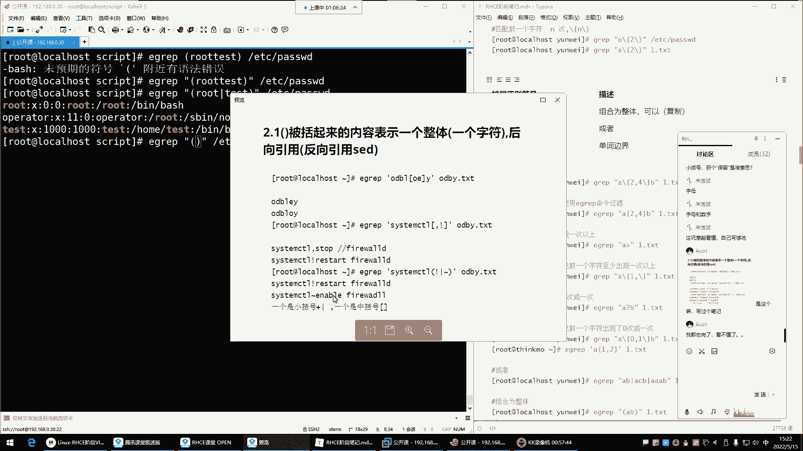

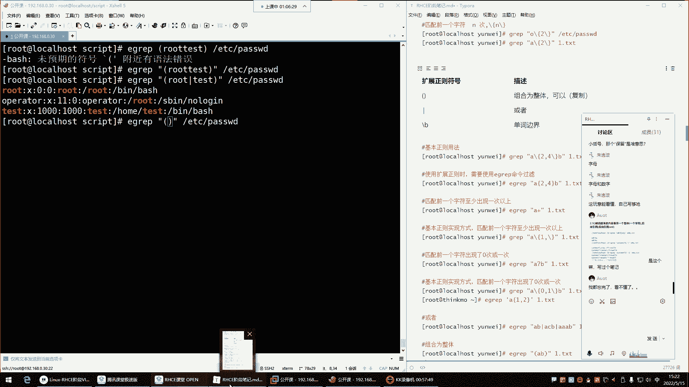

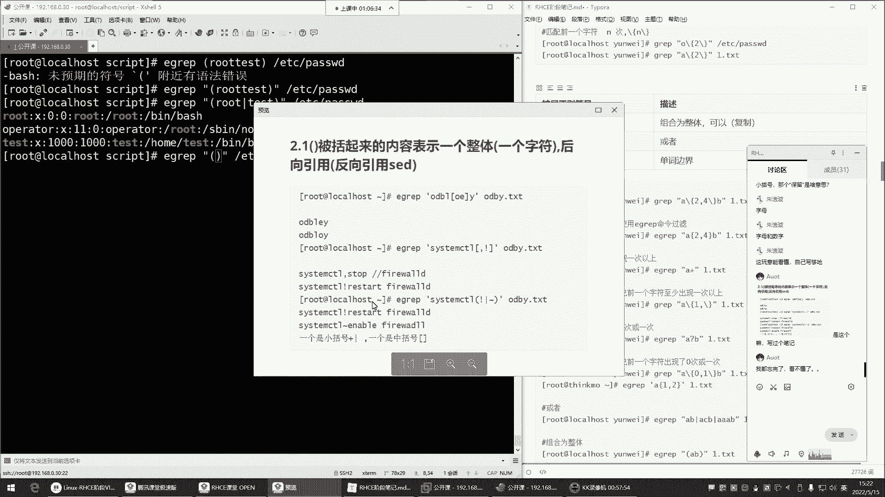

本节课中我们一起学习了Shell数组和正则表达式这两个核心工具。

*   **Shell数组**：它本质上是能存储多个值的变量。我们学会了如何定义数组（`arr=(val1 val2)`）、如何通过下标取值（`${arr[0]}`）、如何获取所有值（`${arr[@]}`），以及如何将其与`for`循环结合实现批量操作。
*   **正则表达式**：这是一套用于文本匹配的符号系统。我们重点掌握了几个最实用的符号：匹配行首的`^`、匹配行尾的`$`、匹配字符集合的`[]`、匹配任意字符的`.`，以及扩展正则中的“或”操作`|`和分组`()`。它们通常与`grep`、`sed`、`awk`等命令结合，进行高效的数据过滤和提取。

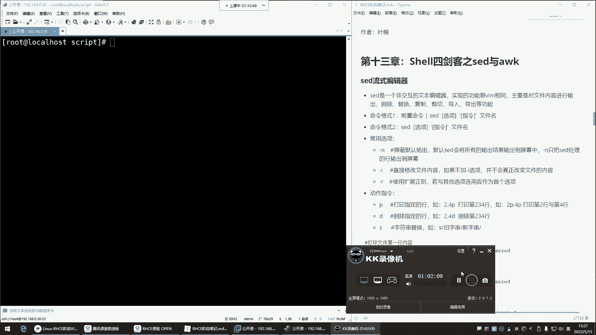

对于初学者来说，无需一次性记住所有复杂的正则符号。理解基本概念，掌握最常用的几个，并在实际脚本编写和日志分析中多加练习，就能逐渐熟练运用。正则表达式是许多高级文本处理任务的基础，值得投入时间掌握其精髓。