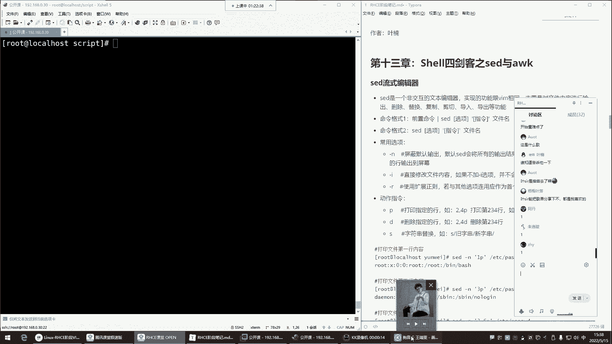
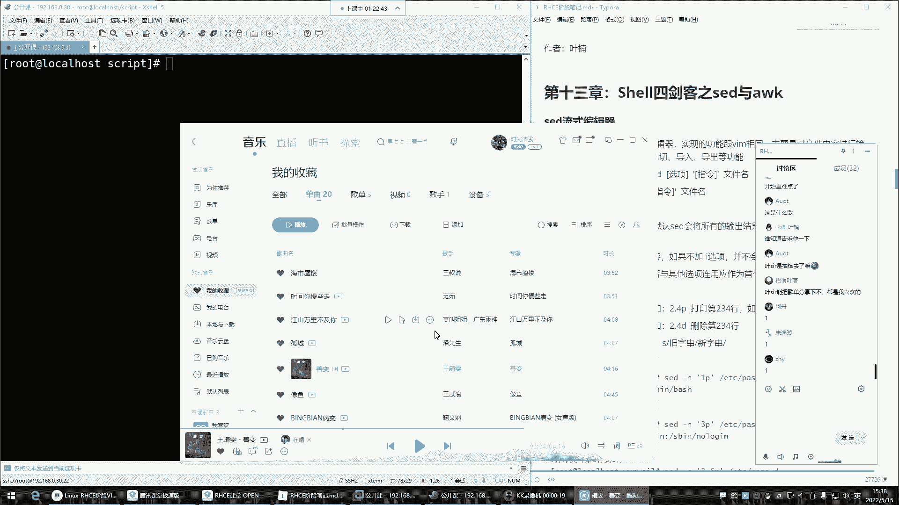
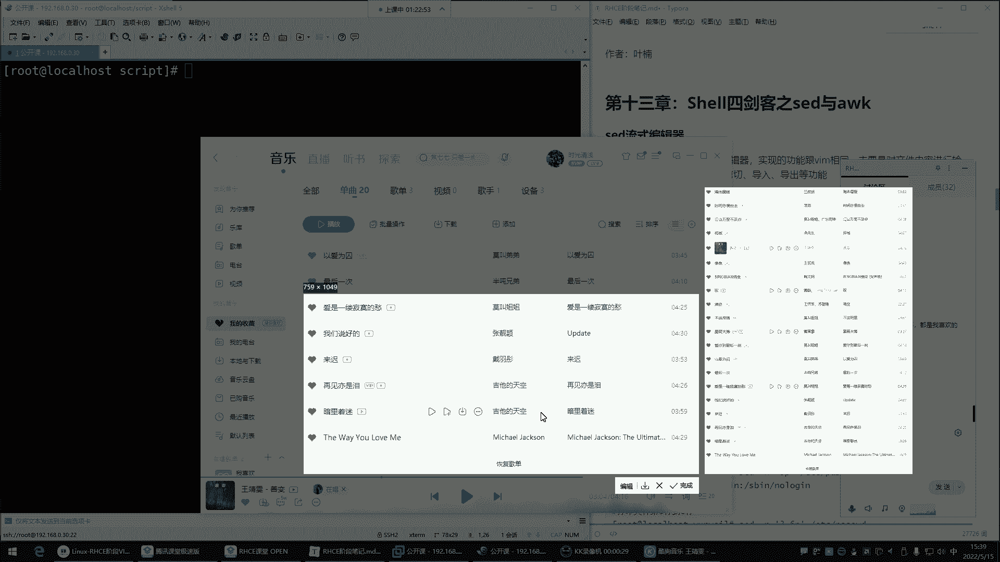
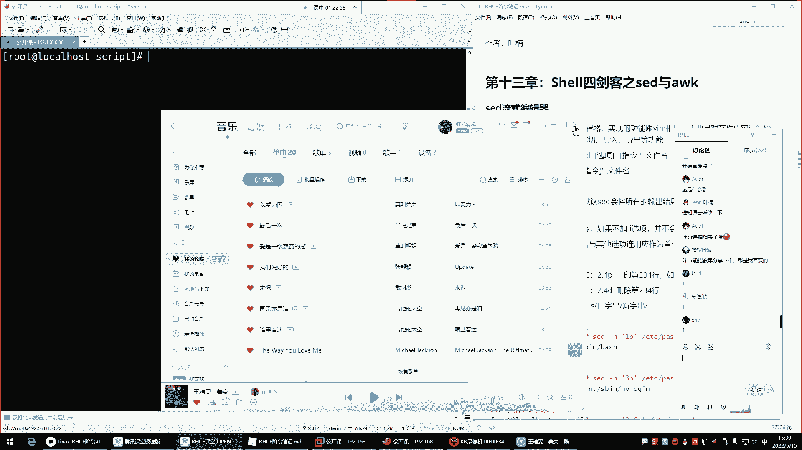
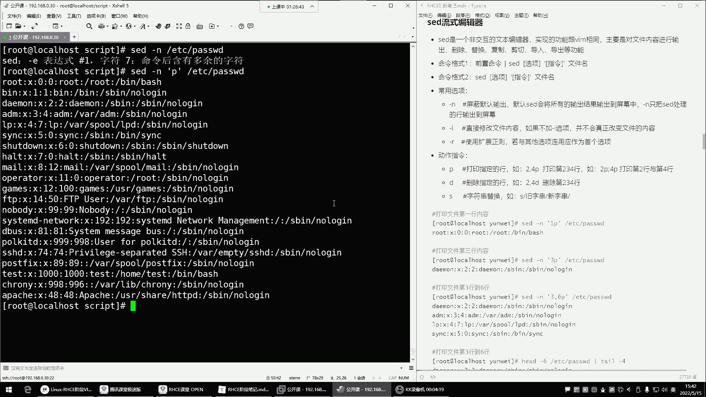
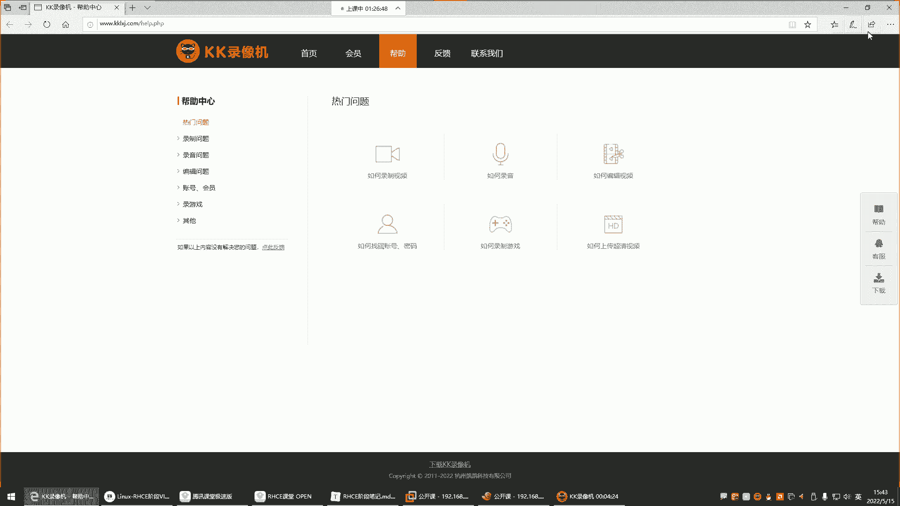
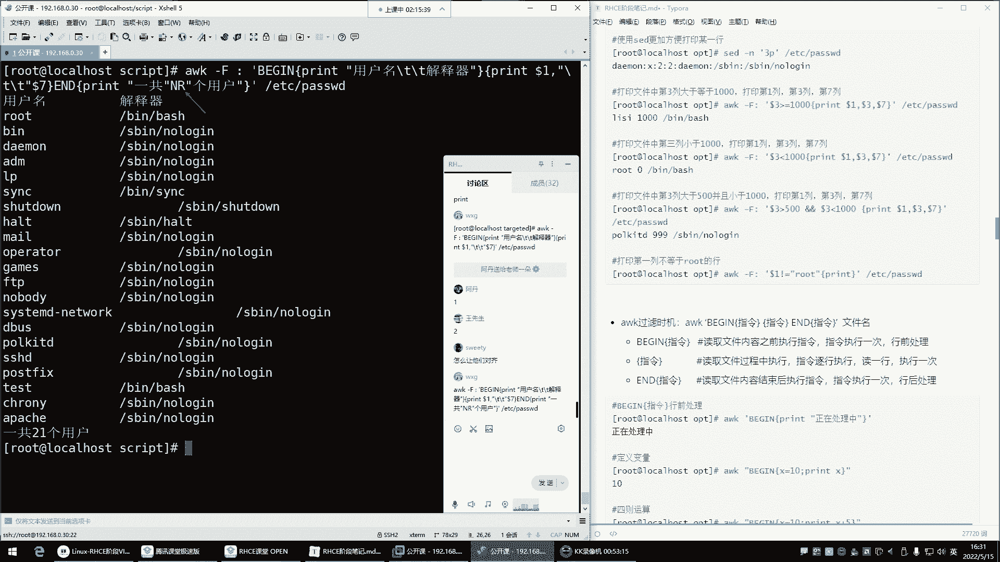
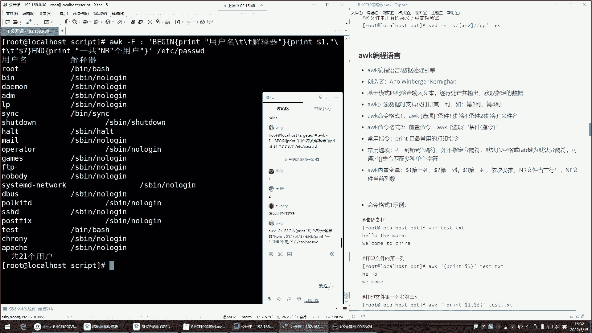
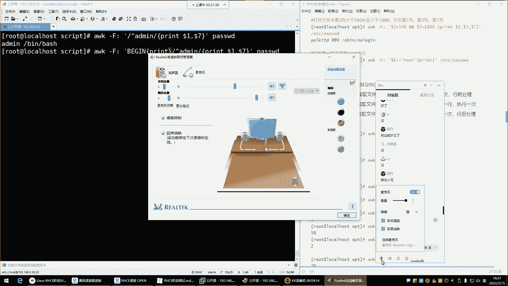
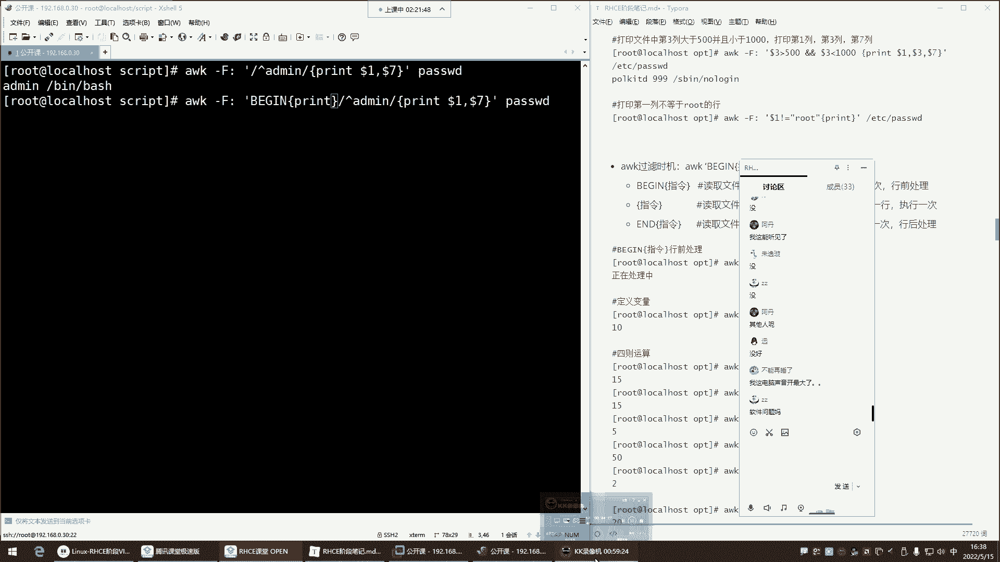

# Linux运维进阶：P48：Shell四剑客之Sed与Awk









在本节课中，我们将要学习Shell文本处理中的两个强大工具：Sed流式编辑器和Awk编程语言。它们能够以非交互的方式高效地处理文本文件，实现查找、替换、删除和格式化输出等功能，是自动化脚本编写的利器。

上一节我们介绍了文本处理的基础命令，本节中我们来看看Sed和Awk这两个更高级的“剑客”如何大显身手。

## Sed流式编辑器 🛠️





Sed，全称Stream Editor，是一个非交互式的流式文本编辑器。你可以将它理解为命令行版本的Vim，但它专为脚本设计，能够通过指令批量、自动地修改文件内容，无需人工交互。

它的基本命令格式有两种：
1.  `前置命令 | sed [选项] ‘指令’`
2.  `sed [选项] ‘指令’ 文件`

最常用的选项是 `-n` 和 `-i`。
*   `-n`：屏蔽默认输出，只显示处理过的行。
*   `-i`：直接修改源文件（慎用，建议先测试）。

以下是Sed的核心操作指令：

*   **p**：打印（Print）指定内容。
*   **d**：删除（Delete）指定行。
*   **s**：替换（Substitute）匹配的文本。

### 打印内容

使用 `p` 指令可以查看文件内容。结合 `-n` 选项可以精确控制输出。

```bash
# 打印文件第3行
sed -n ‘3p’ /etc/passwd

# 打印文件第2到第4行
sed -n ‘2,4p’ /etc/passwd

# 打印文件第1行和第5行
sed -n ‘1p;5p’ /etc/passwd
```

### 删除内容

使用 `d` 指令可以删除行。**务必先使用 `-n p` 确认要删除的行，再使用 `-i` 实际修改**。

```bash
# 1. 先确认要删除的第5行内容
sed -n ‘5p’ demo.txt

# 2. 确认无误后，执行删除
sed -i ‘5d’ demo.txt
```

### 替换内容

使用 `s` 指令进行替换，语法为 `s/旧内容/新内容/修饰符`。

```bash
# 将每行第一个‘root’替换为‘admin’
sed ‘s/root/admin/’ demo.txt

# 将每行所有的‘root’替换为‘admin’（g表示全局）
sed ‘s/root/admin/g’ demo.txt

# 先测试替换效果
sed -n ‘s/old/new/gp’ demo.txt
# 确认后实际修改文件
sed -i ‘s/old/new/g’ demo.txt
```

Sed也支持使用正则表达式进行模式匹配。

```bash
# 打印所有以‘bash’结尾的行
sed -n ‘/bash$/p’ /etc/passwd
```

---

上一节我们掌握了Sed对文本的行级编辑，本节中我们来看看Awk，它更擅长基于列进行数据处理。

## Awk编程语言 📊

Awk不仅仅是一个命令，更是一门功能丰富的编程语言，常用于文本分析和数据提取。它特别擅长处理结构化文本（如表格数据），可以轻松地操作每一列。

其基本语法为：`awk [选项] ‘条件 {指令}’ 文件`

常用选项是 `-F`，用于指定字段分隔符（默认是空格或制表符）。

### 基本打印与过滤

Awk的默认动作就是打印整行，`print` 是指令的一部分。

```bash
# 打印文件所有内容
awk ‘{print}’ demo.txt

# 打印包含‘admin’的行（类似grep）
awk ‘/admin/ {print}’ /etc/passwd
```

### 处理列数据

Awk的强大之处在于能轻松处理列。`$1`、`$2`... 分别代表第1列、第2列。

```bash
# 以冒号‘:‘为分隔符，打印/etc/passwd的第1列（用户名）和第7列（解释器）
awk -F ‘:‘ ‘{print $1, $7}’ /etc/passwd

# 打印第1列和第3列，中间用制表符隔开（\t）
awk -F ‘:‘ ‘{print $1 “\t” $3}’ /etc/passwd
```

### 内置变量

Awk提供了有用的内置变量：
*   **NR**：当前处理的行号（Number of Records）。
*   **NF**：当前行的字段总数（Number of Fields）。

```bash
# 打印文件行号及内容
awk ‘{print NR “: “ $0}’ demo.txt

# 打印每行的字段数
awk -F ‘:‘ ‘{print NF}’ /etc/passwd
```

### BEGIN与END模式





`BEGIN` 和 `END` 是特殊的条件，分别指在处理任何行之前和处理完所有行之后执行。

```bash
# 在开头和结尾添加信息，并格式化输出用户名和解释器
awk -F ‘:‘ ‘BEGIN {print “用户名\t\t解释器\n===================“} {print $1 “\t\t” $7} END {print “===================\n总计用户数: “ NR}’ /etc/passwd
```

---





本节课中我们一起学习了Shell四剑客中的Sed和Awk。Sed是一个强大的流式编辑器，擅长对文本进行逐行的增、删、改。而Awk是一门文本处理语言，尤其擅长基于列对结构化数据进行过滤、统计和格式化输出。掌握这两个工具，将极大提升你在命令行下处理文本数据的效率和能力。