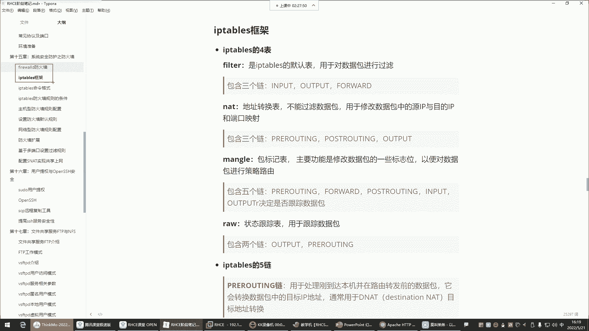
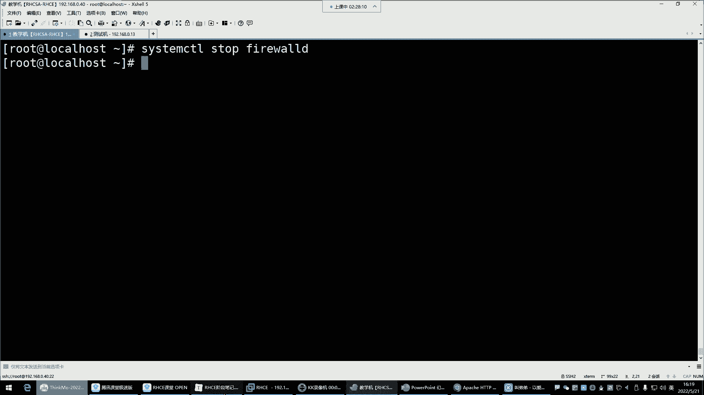
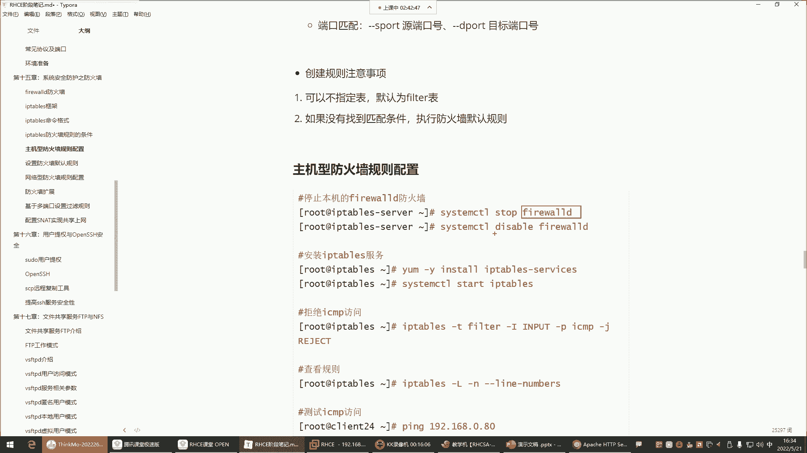
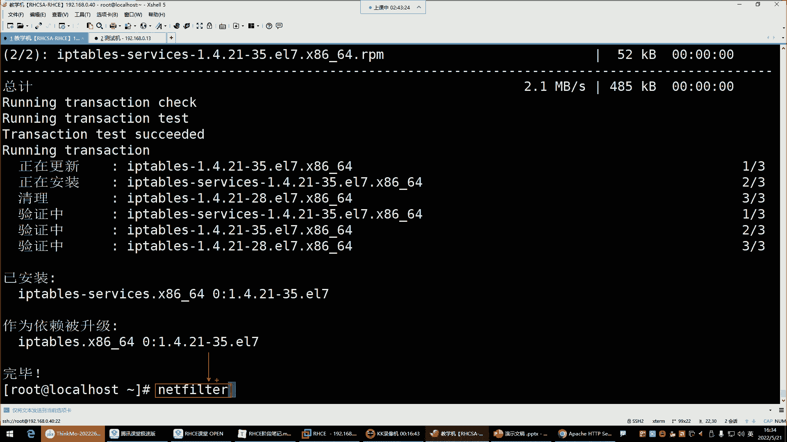
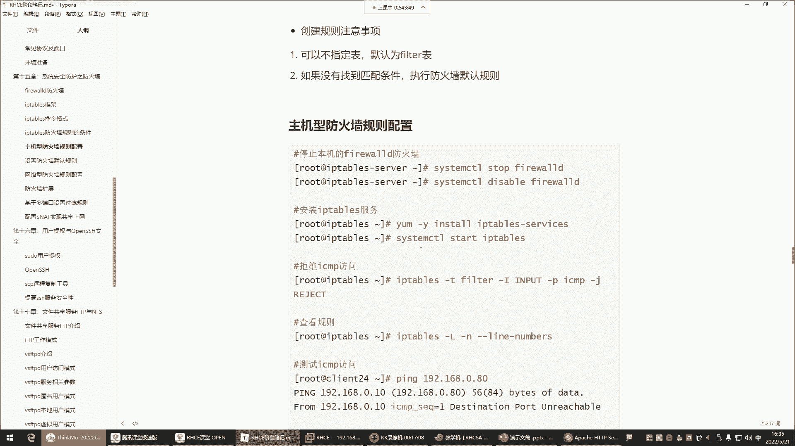
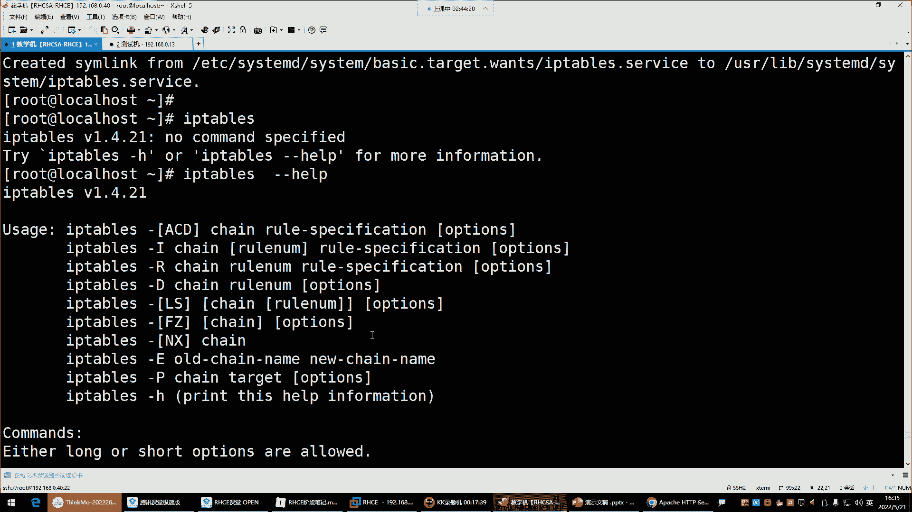
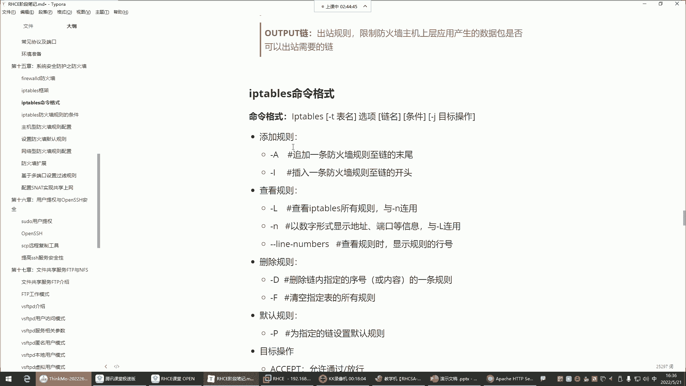
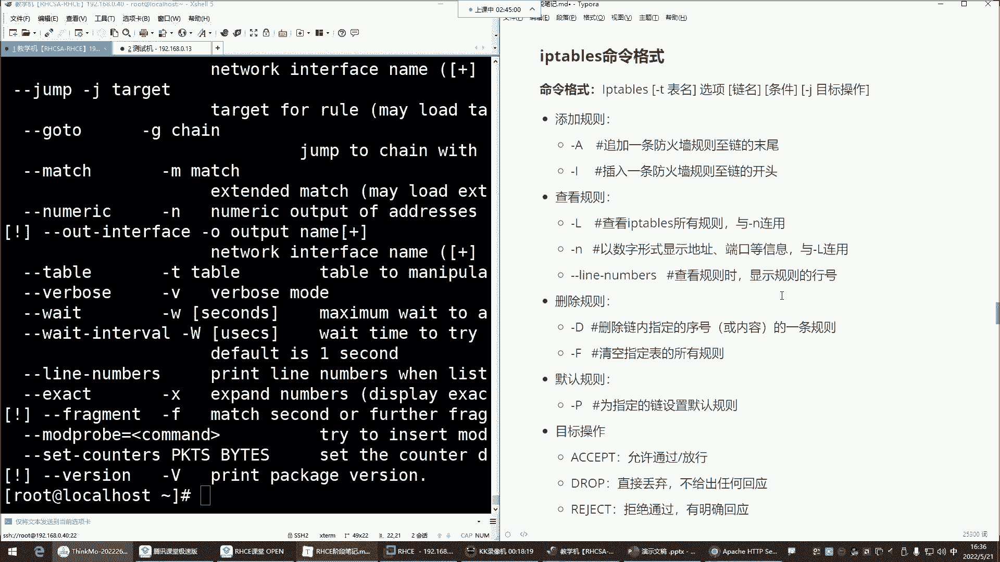

# Linux运维进阶：P52：iptables防火墙四表五链 🔥

在本节课中，我们将要学习iptables防火墙的核心概念，包括其“四表五链”的架构、各表链的功能以及基本命令格式。iptables是Linux系统中一个强大的防火墙管理工具，理解其工作原理对于系统运维至关重要。



## 四表与五链的关系



上一节我们介绍了防火墙的基本概念，本节中我们来看看iptables的核心架构。iptables通过“表”和“链”来组织防火墙规则。

*   **表**：用于实现特定功能的规则集合。iptables主要有四个表。
*   **链**：规则的实际存放位置。链存在于表中，用于对数据包进行具体的检查和处理。

简单来说，**表决定了规则的功能（如过滤或地址转换），而链决定了规则生效的时机（如数据包进入时或转发时）**。

以下是iptables的四个核心表及其功能：

1.  **filter表**：**默认表**，用于对数据包进行**过滤**。就像地铁站的安检口，决定数据包是否允许通过。
2.  **nat表**：用于**网络地址转换**，修改数据包中的源IP、目的IP或端口。常用于共享上网、端口映射等场景。
3.  **mangle表**：用于修改数据包的**标记位**，通常用于策略路由等高级功能，一般较少使用。
4.  **raw表**：用于**连接跟踪**，决定数据包是否被状态跟踪机制处理。因其消耗资源，在企业环境中通常不启用。

对于初学者和大多数运维场景，我们主要学习和使用的是 **`filter`（过滤）** 表和 **`nat`（地址转换）** 表。

## 核心五链详解

了解了表的功能后，我们来看看五个核心链。链决定了规则在哪个处理环节生效。

以下是五个核心链的作用与常见归属表：

*   **INPUT链**：处理**进入本机**的数据包。用于保护防火墙主机自身的服务（如SSH、Web服务）。属于`filter`表。
*   **OUTPUT链**：处理**从本机发出**的数据包。通常很少在此配置规则。属于`filter`表。
*   **FORWARD链**：处理**经过本机转发**的数据包。当防火墙作为网关，保护内部网络其他机器时使用。属于`filter`表。
*   **PREROUTING链**：在数据包**进入路由决策之前**进行处理。常用于修改目的地址（DNAT），如端口映射。属于`nat`表。
*   **POSTROUTING链**：在数据包**离开路由决策之后**进行处理。常用于修改源地址（SNAT），如内网机器共享一个公网IP访问互联网。属于`nat`表。

**工作流程比喻**：可以将防火墙想象成一栋大楼。
*   **INPUT** 是检查进入大楼访客的门卫。
*   **FORWARD** 是检查在大楼内不同房间之间穿行的内部保安。
*   **PREROUTING** 是在访客到达门卫前，先修改他的目的地门牌号。
*   **POSTROUTING** 是在内部人员离开大楼时，统一更换他们的外出制服（源地址）。

## iptables基础命令与配置

理解了架构，现在我们来学习如何实际操作iptables。首先需要确保使用iptables而非firewalld。

### 1. 切换至iptables

由于iptables和firewalld都是管理`netfilter`内核模块的工具，二者冲突，只能启用一个。

```bash
# 停止并禁用firewalld
systemctl stop firewalld
systemctl disable firewalld

# 安装iptables服务（如果未安装）
yum install -y iptables-services

# 启动并启用iptables服务
systemctl start iptables
systemctl enable iptables
```

### 2. 命令格式概述

iptables命令拥有丰富的参数，其基本格式可以概括为：

```
iptables [-t 表名] 命令选项 [链名] [规则匹配条件] [-j 目标动作]
```

*   **-t 表名**：指定操作的表，如`filter`、`nat`。省略时默认为`filter`表。
*   **命令选项**：指定要执行的操作，如`-A`（追加规则）、`-L`（查看规则）。
*   **链名**：指定操作的链，如`INPUT`、`FORWARD`。
*   **规则匹配条件**：指定匹配数据包的条件，如`-s 192.168.1.100`（源IP）、`--dport 80`（目标端口）。
*   **-j 目标动作**：指定匹配规则后的处理动作，如`ACCEPT`（接受）、`DROP`（丢弃）。

**常用命令选项示例**：
```bash
# 查看filter表所有规则
iptables -L -n

# 在INPUT链末尾追加一条规则，允许来自192.168.1.0/24网段的访问
iptables -t filter -A INPUT -s 192.168.1.0/24 -j ACCEPT

# 删除INPUT链中的第一条规则
iptables -D INPUT 1



# 清空FORWARD链所有规则
iptables -F FORWARD
```



**重要提示**：配置的规则默认在重启后会丢失。需要保存规则：`service iptables save` 或 `/usr/libexec/iptables/iptables.init save`（取决于系统）。



## 总结



本节课中我们一起学习了iptables防火墙的核心知识。
1.  **四表**：`filter`（过滤）、`nat`（地址转换）、`mangle`（包修改）、`raw`（连接跟踪），重点是`filter`和`nat`。
2.  **五链**：`INPUT`（入站）、`OUTPUT`（出站）、`FORWARD`（转发）、`PREROUTING`（路由前）、`POSTROUTING`（路由后），理解了它们各自生效的时机。
3.  **关系**：表是功能的容器，链是规则的载体。例如，过滤功能在`filter`表的`INPUT`、`FORWARD`、`OUTPUT`链中实现。
4.  **基础操作**：学会了如何从firewalld切换到iptables，并了解了其命令的基本格式。





掌握“四表五链”是熟练运用iptables的基础。后续课程将在此基础上，深入学习具体的规则配置、网络地址转换等实战技巧。