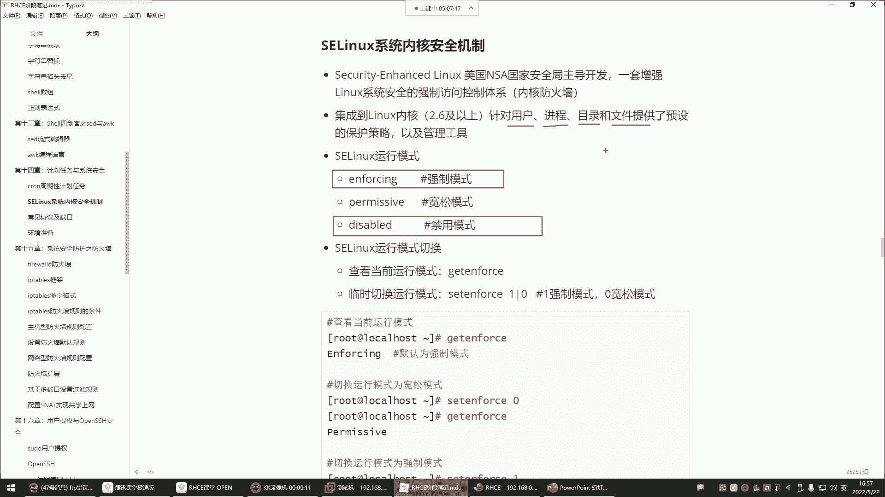
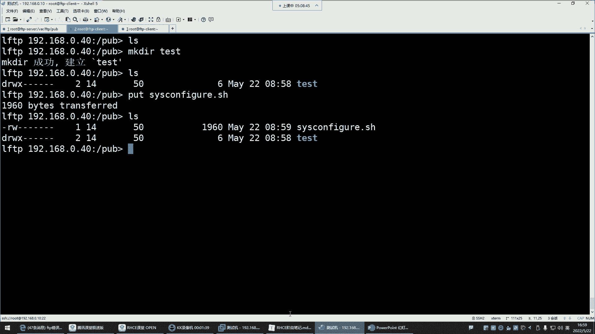
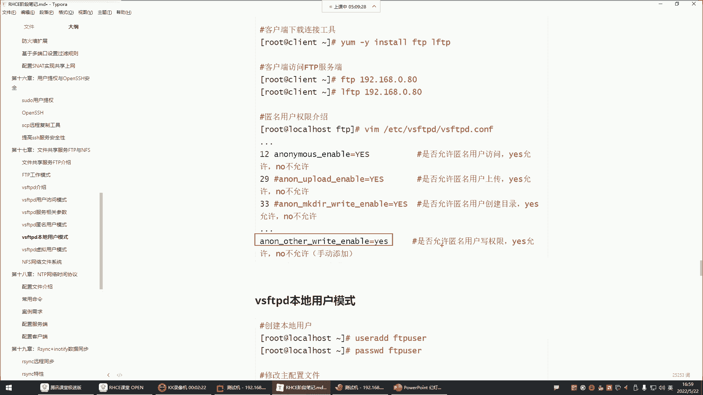
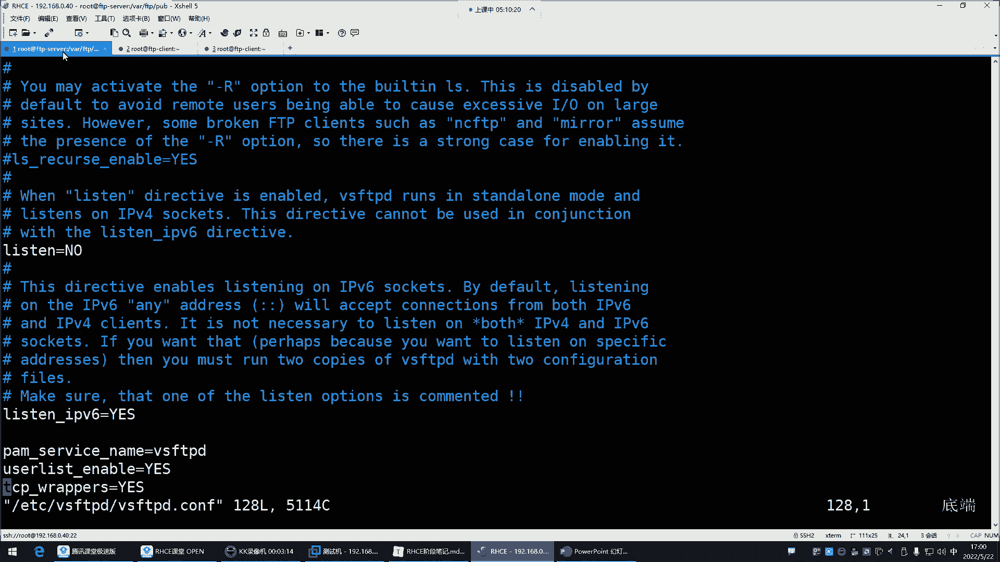
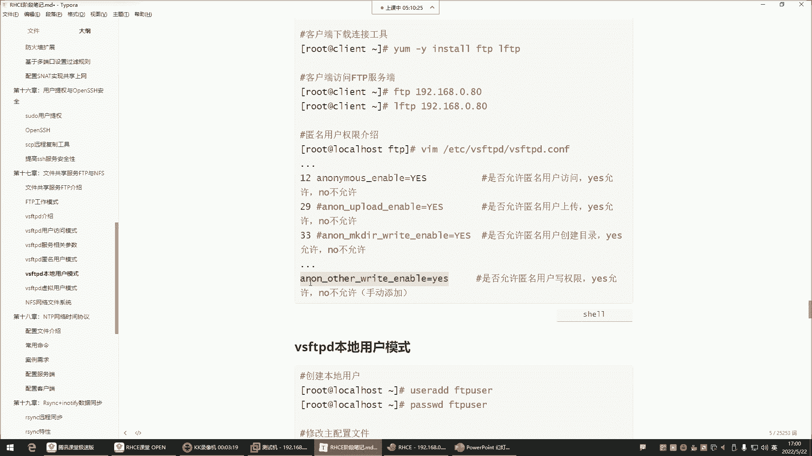
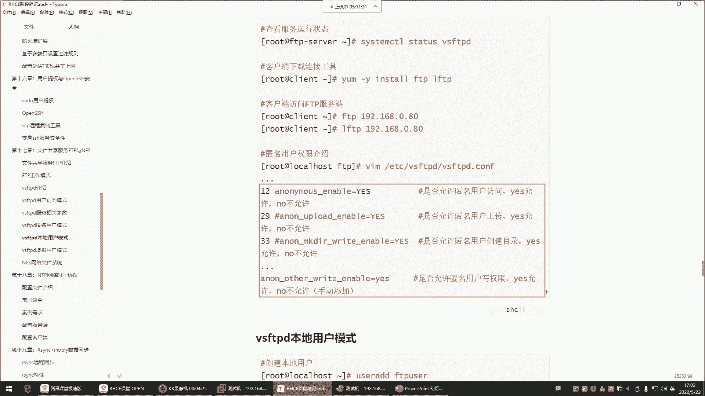
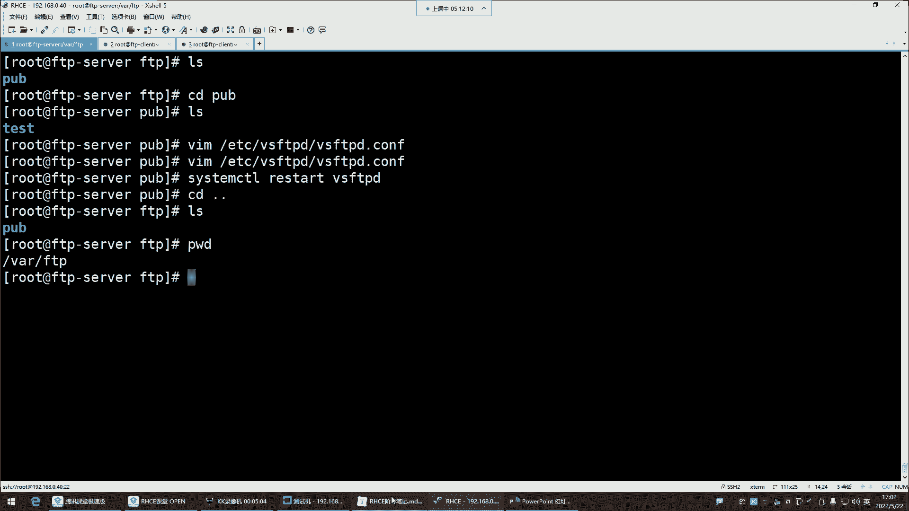
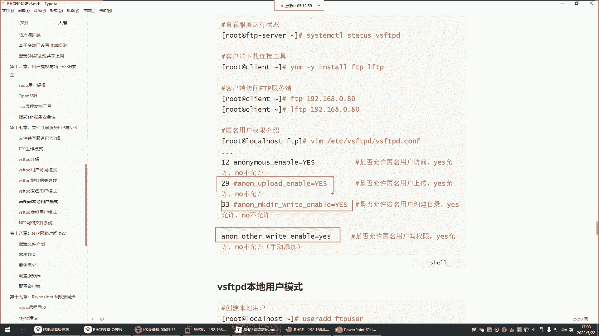
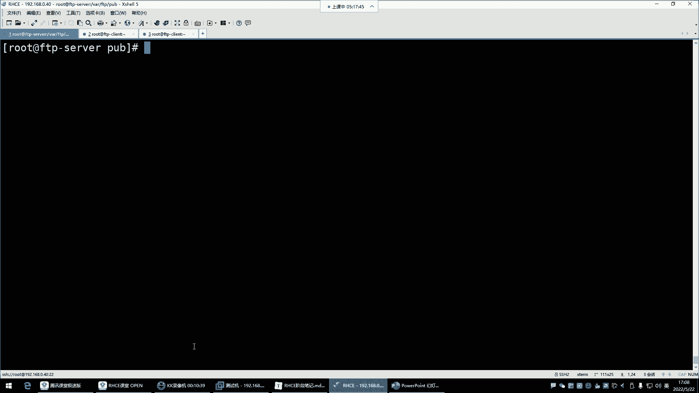
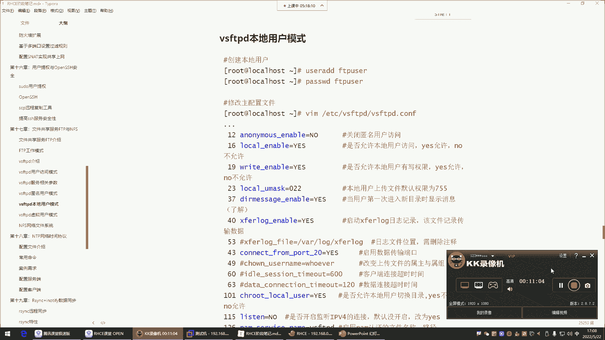

# Linux运维进阶：P56：FTP服务排错与权限配置详解 🔧




在本节课中，我们将学习FTP服务在实际使用中可能遇到的典型问题及其解决方法，特别是SELinux安全机制的影响，以及如何为匿名用户配置不同的文件操作权限。

## 概述：SELinux强制模式的影响



上一节我们介绍了FTP服务的基本配置。本节中我们来看看一个常见的排错场景：SELinux强制模式如何影响FTP的文件操作。

SELinux在企业环境中常被禁用，因为它在强制模式下会严格管控所有资源，包括用户、进程、目录和文件。当SELinux处于 **`enforcing`**（强制）模式时，即使系统文件权限设置正确，它也可能阻止操作，例如创建文件。



**核心操作：检查并临时关闭SELinux**
```bash
# 查看当前SELinux状态
getenforce
# 临时设置为宽松模式（Permissive）
setenforce 0
# 或通过修改配置文件永久禁用（需重启）
# 编辑 /etc/selinux/config，将 SELINUX=enforcing 改为 SELINUX=disabled
```
将模式改为宽松或禁用后，之前被阻止的文件创建操作通常就能成功。这常常是排查FTP权限问题的第一步。



## FTP匿名用户权限详解



解决了SELinux问题后，我们来看看FTP服务本身对匿名用户的权限控制。默认情况下，vsftpd服务以匿名模式运行，访问者实际使用的是 **`ftp`** 系统账号。


以下是匿名用户默认具备及可配置的权限：



*   **默认权限**：查看目录列表、下载文件。
*   **需手动开启的权限**：
    *   **上传文件**：需在配置中开启 `anon_upload_enable=YES`。
    *   **创建目录/文件**：需开启 `anon_mkdir_write_enable=YES`。
    *   **写入权限（重命名/删除）**：需开启 `anon_other_write_enable=YES`。

**核心配置：vsftpd.conf 中匿名用户权限参数**
```bash
# 允许匿名用户上传文件
anon_upload_enable=YES
# 允许匿名用户创建目录
anon_mkdir_write_enable=YES
# 允许匿名用户执行写入操作（如重命名、删除）
anon_other_write_enable=YES
```
修改配置文件后，必须重启vsftpd服务使配置生效：**`systemctl restart vsftpd`**。



## 企业级FTP权限管理实践

了解了如何开启各项权限后，我们需要思考企业环境中的最佳实践。企业内的FTP服务器通常用于共享文件供他人下载，而非允许任意上传或修改。



因此，对于匿名用户，我们通常**只保留其默认的查看和下载权限**，而将上传、创建、重命名和删除等权限注释掉或设置为NO。这样可以确保共享目录的安全与稳定。

**安全配置建议**：
1.  为FTP服务创建一个专用的共享目录（如 `/var/ftp/pub/share`），而非直接使用根目录。
2.  在该目录下进行所有文件操作。
3.  在 `vsftpd.conf` 中，仅为匿名用户保留必要权限，注释掉高风险权限。

**示例：安全的匿名用户配置**
```bash
# 匿名用户可登录
anonymous_enable=YES
# 禁止匿名用户上传
# anon_upload_enable=YES
# 禁止匿名用户创建目录
# anon_mkdir_write_enable=YES
# 禁止匿名用户重命名或删除
# anon_other_write_enable=YES
```
重启服务后，匿名用户将只能列表和下载文件，无法进行任何修改操作。

## 文件权限与FTP访问

最后，我们需要注意系统文件权限本身对FTP访问的影响。FTP匿名用户映射到 `ftp` 系统用户，因此共享的文件或目录需要对“其他用户”（others）至少开放**读（r）** 权限，才能被下载。

例如，一个权限为 **`-rw-r--r--`** 的文件，所有者可读写，同组用户和其他用户只可读，这通常满足下载需求。无需也不建议将共享文件权限设置为 **`777`**。

## 总结



本节课中我们一起学习了FTP服务的核心排错与配置知识：
1.  **SELinux排查**：`enforcing` 模式可能阻止FTP操作，可通过 `setenforce 0` 临时放宽策略来排查。
2.  **权限配置**：在 `vsftpd.conf` 中通过 `anon_upload_enable`、`anon_mkdir_write_enable`、`anon_other_write_enable` 等参数控制匿名用户的操作权限。
3.  **安全实践**：企业环境中应为匿名用户遵循最小权限原则，通常只开放下载权限，关闭上传、创建、删除等高风险权限。
4.  **文件权限**：确保共享文件对“其他用户”有读权限，以保证可下载性。



通过理解这些配置项和原则，你将能够有效地部署和管理一个既满足功能需求又安全的FTP服务器。