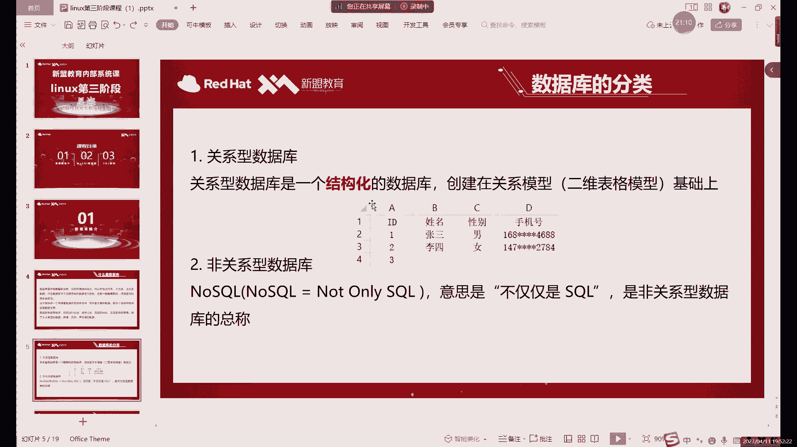
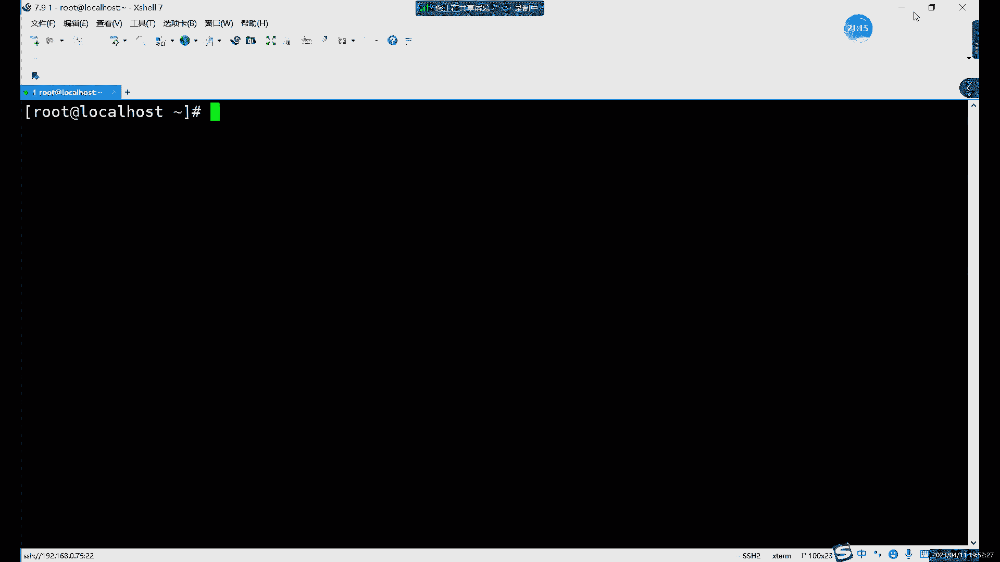
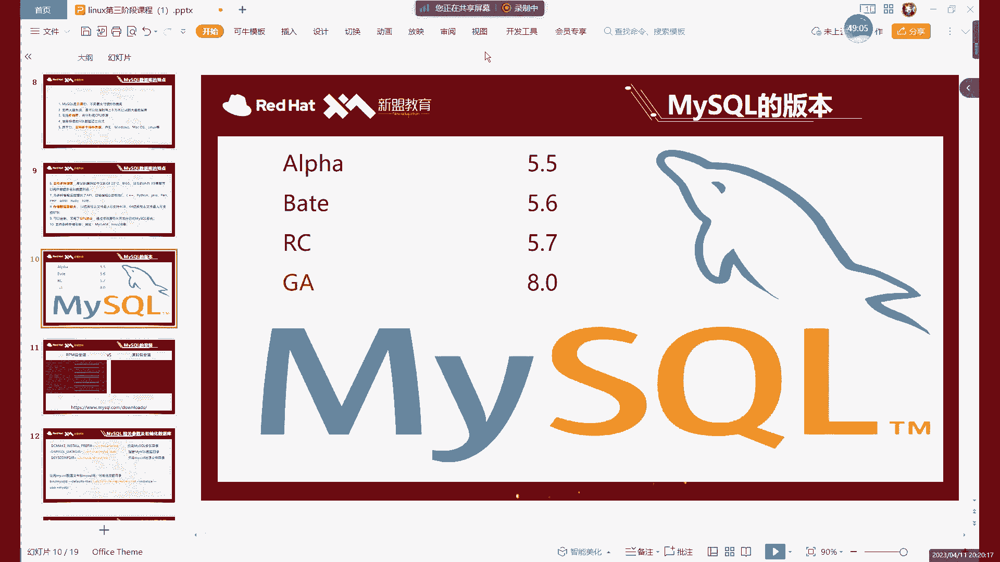
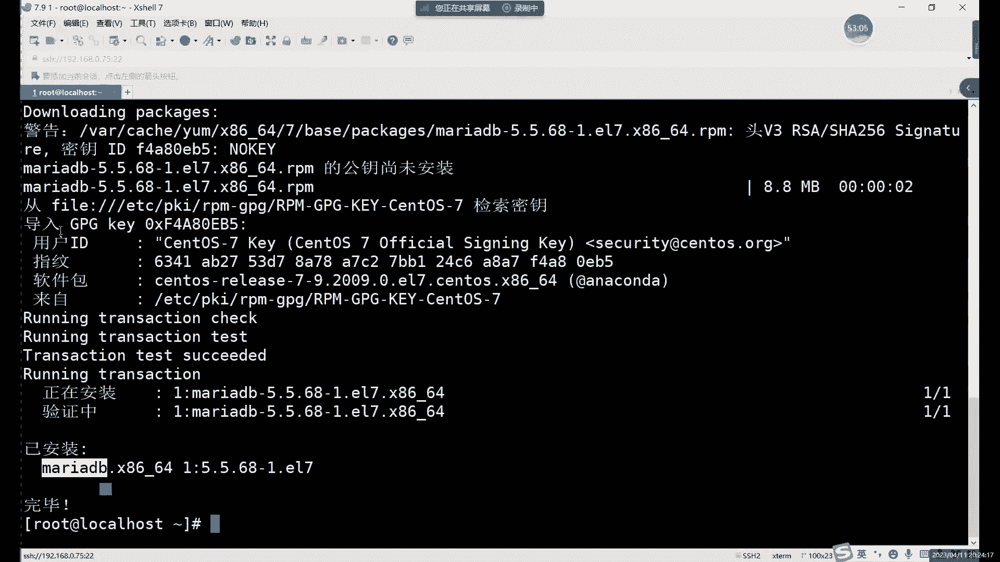
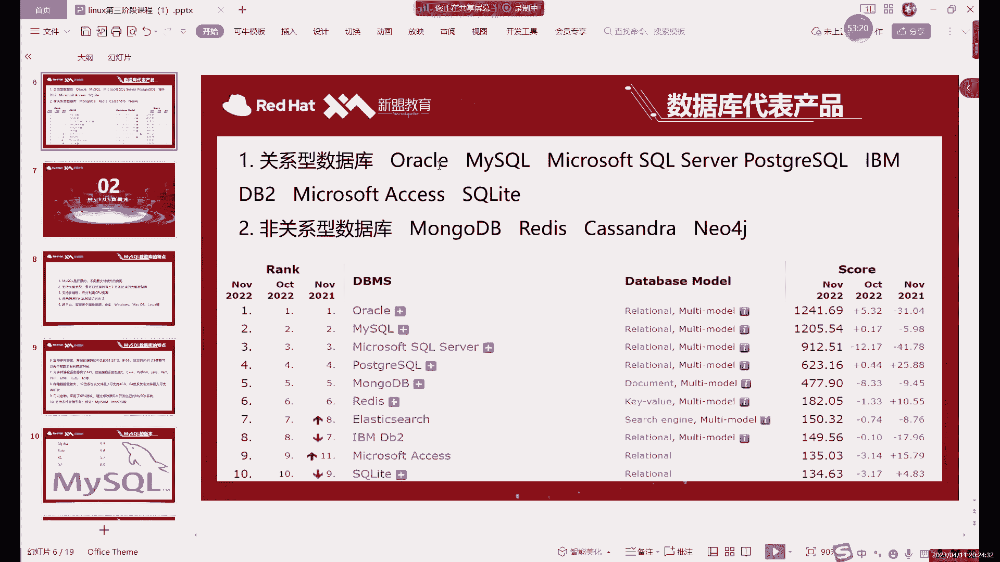

# Linux运维进阶：第三阶段：MySQL介绍及安装（上）

## 概述
在本节课中，我们将开始学习Linux运维第三阶段的内容。这一阶段我们将聚焦于具体的服务应用，首先是数据库。本节课我们将介绍数据库的基本概念、分类，并重点讲解关系型数据库MySQL，为后续的安装与操作打下基础。

## 数据库简介
数据库，顾名思义，是存放数据的仓库。它的存储空间很大，可以存放百万、千万甚至更多的数据记录。理论上，其容量仅受限于磁盘大小。

在数据库诞生之前，数据通常直接存放在文件系统中。这种方式虽然也能存储数据，但在管理大量数据时存在明显弊端，尤其是查询效率非常低下。例如，在文件系统中搜索一个特定文件可能需要遍历整个磁盘分区，耗时很长。

数据库的优势在于其高效的数据管理能力。它按照特定规则存储数据，使得查询、插入、删除等操作速度极快。即使在数据量较大的情况下，查询也能在毫秒级别完成。

## 数据库的分类
数据库主要分为两大类：关系型数据库和非关系型数据库。

### 关系型数据库
关系型数据库是一种结构化的数据库。其核心模型是二维表格，由行和列组成。
*   **库**：一个数据库中可以创建多个表格。
*   **表**：每个表格有固定的结构。
*   **字段**：表格的每一列称为一个字段，定义了该列数据的类型和规则（例如，只能存储数字或特定字符）。
*   **数据**：从第二行开始，每一行都是一条具体的数据记录。

多个表格之间可以通过共同的字段（如员工ID、姓名）建立联系，从而实现关联查询。MySQL就是一个典型的关系型数据库。

### 非关系型数据库
非关系型数据库与关系型数据库相对，其存储数据的方式更为自由，通常不采用固定的表格结构。一个常见的存储形式是**键值对**。
例如：`A=3`，`B=4`，`C=某个值`。
非关系型数据库通常没有太多结构限制，更多用于缓存等场景，例如Redis。它常常运行在内存中，以提升数据访问速度。我们将在后续课程中详细讲解非关系型数据库。

## MySQL 介绍
在众多关系型数据库中，MySQL是最常用的一种。它具有以下特点：
1.  **开源免费**：社区版开源且免费，支持大型系统。
2.  **性能强大**：支持多线程，能充分利用多核CPU资源。
3.  **使用SQL语言**：通过标准的SQL（结构化查询语言）进行数据库管理。我们本阶段将学习的主要命令就是SQL语言。
4.  **跨平台**：支持Windows、Linux、macOS等多种操作系统。
5.  **支持多语言**：通过设置字符编码（如UTF-8）可以支持包括中文在内的多种语言，避免乱码问题。
6.  **存储引擎**：这是MySQL的核心组件，类似于其“大脑”，负责数据的存储和提取。后续课程会专门介绍。

## MySQL 版本
目前MySQL的主流版本是5.7和8.0。其中，5.7版本在市场上占比最高，应用最广泛；8.0版本是较新的版本，正在被越来越多的公司采用。不同版本在命令上略有差异，但核心思想和大部分命令是相通的。

版本号通常以数字表示，如 `5.7.37`。带有 `GA` 标识的版本是稳定正式版。

## 安装方式简介
在Linux系统中，安装软件有多种方式。对于MySQL，常见的安装方式有：
*   **YUM安装**：非常方便，但依赖于软件仓库中是否有对应的软件包。有时仓库中的版本可能较旧。
*   **RPM包安装**：手动下载特定版本的RPM软件包进行安装，可以更精确地控制版本。
*   **源码编译安装**：最灵活的方式，可以自定义编译选项，但过程较为复杂。

需要注意的是，并非所有软件都能通过YUM直接安装，这取决于配置的软件源中是否包含了该软件。

## 总结
本节课我们一起学习了数据库的基础知识。我们了解了数据库相较于文件系统的优势，掌握了关系型与非关系型数据库的核心区别，并重点认识了MySQL数据库的特点与版本情况。同时，我们也回顾了在Linux系统中安装软件的基本方式。下节课，我们将开始动手安装MySQL数据库。