# MySQL基础教程：第4章：SQL语句、数据类型与约束（上）


## 概述

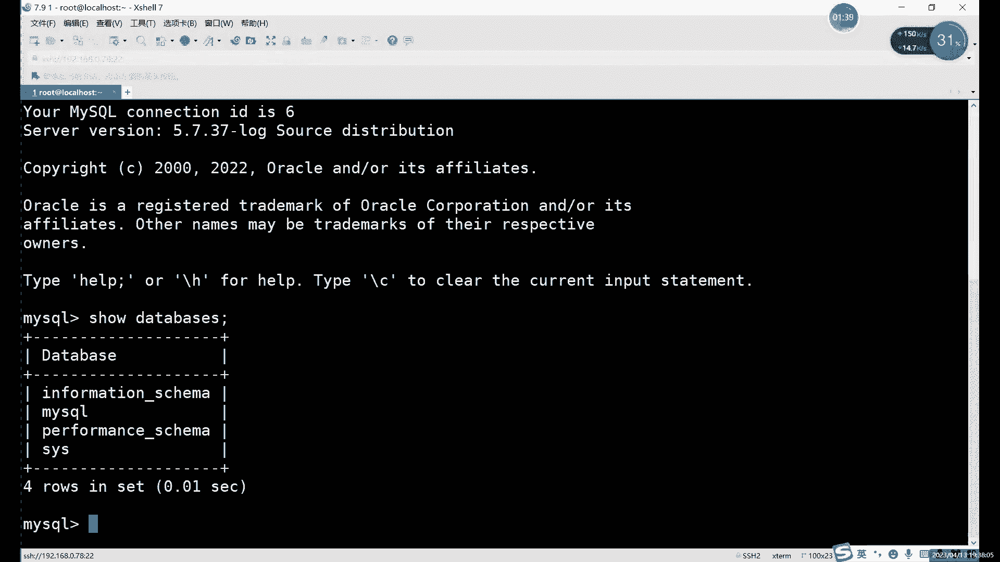

在本节课中，我们将学习MySQL中SQL语句的主要类型、数据定义语言（DDL）的基本操作，以及如何创建表格并理解其基本结构。我们将从上一节结束的数据库启动与连接问题开始，逐步深入到SQL语句的核心概念。

---

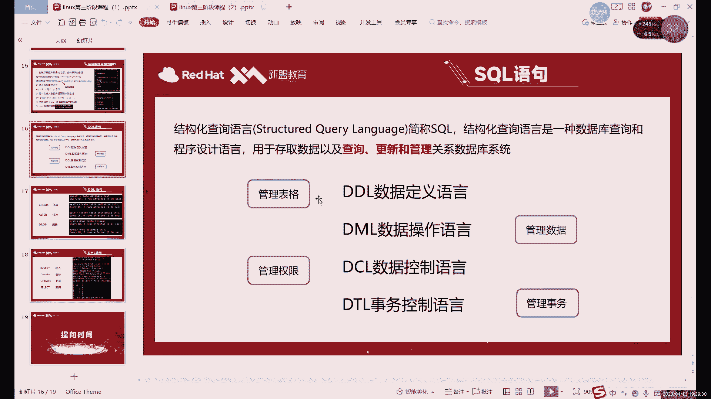

## 上节回顾与问题说明

上一节我们介绍了MySQL的安装与密码修改。修改密码的方式取决于安装方式（RPM或源码安装），需在相应配置文件中查找初始密码。进入数据库前，必须确保服务已启动。连接失败通常由服务未启动或未完全卸载旧版本MySQL（如`mariadb`）导致，因此务必先彻底卸载冲突组件再安装或启动MySQL。

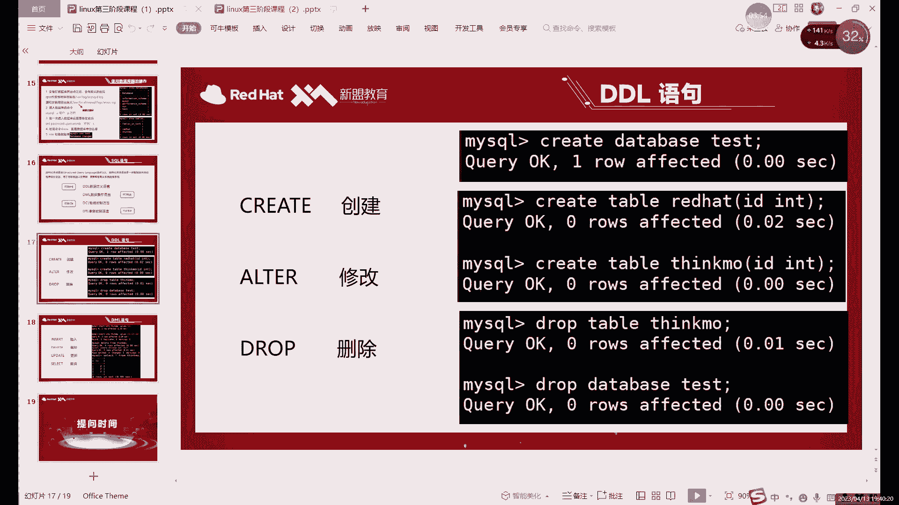

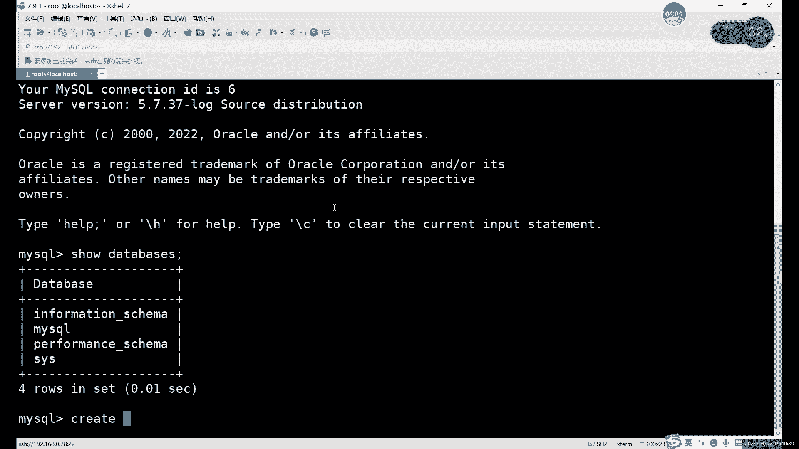

目前，我们已经成功安装并进入了MySQL，但尚未创建任何数据库。

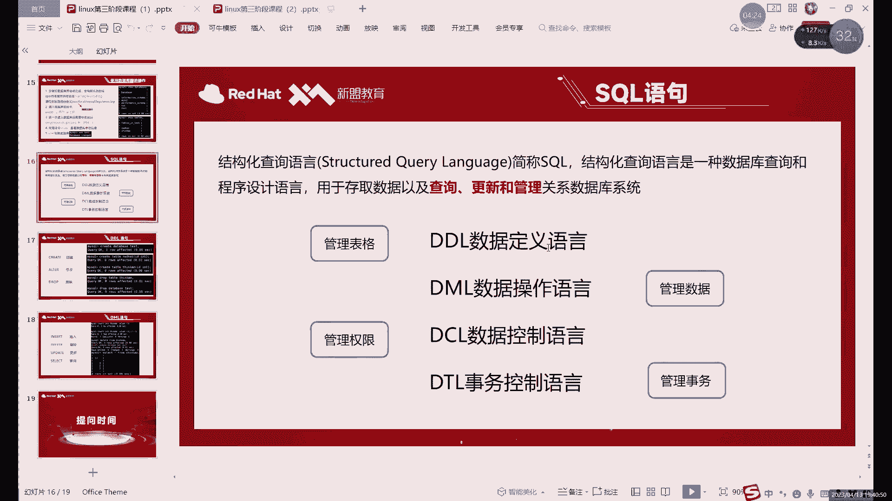

---


## SQL语句的主要类型

SQL语句根据其管理对象的不同，一般分为四种主要类型，分别用于管理表格、数据、权限和事务。

以下是四种SQL语句类型的简要介绍：

1.  **数据定义语言 (DDL)**: 用于定义和管理数据库结构，如创建、修改、删除数据库和表格。
2.  **数据操作语言 (DML)**: 用于操作表格内的数据，即常说的“增删改查”。
3.  **数据控制语言 (DCL)**: 用于管理数据库的访问权限和安全。
4.  **事务控制语言 (TCL)**: 用于管理数据库的事务。

本节我们将重点学习前两种：DDL和DML。

---

## 数据定义语言 (DDL)

DDL的核心是定义数据存放的规则，主要通过创建和修改表格来实现。它决定了数据的结构和约束条件。

### 创建数据库与表格

首先，我们需要创建一个属于自己的数据库。使用`CREATE DATABASE`命令即可完成。

```sql
CREATE DATABASE mydb;
```

创建数据库后，必须切换到该数据库内部才能进行操作。使用`USE`命令进行切换。

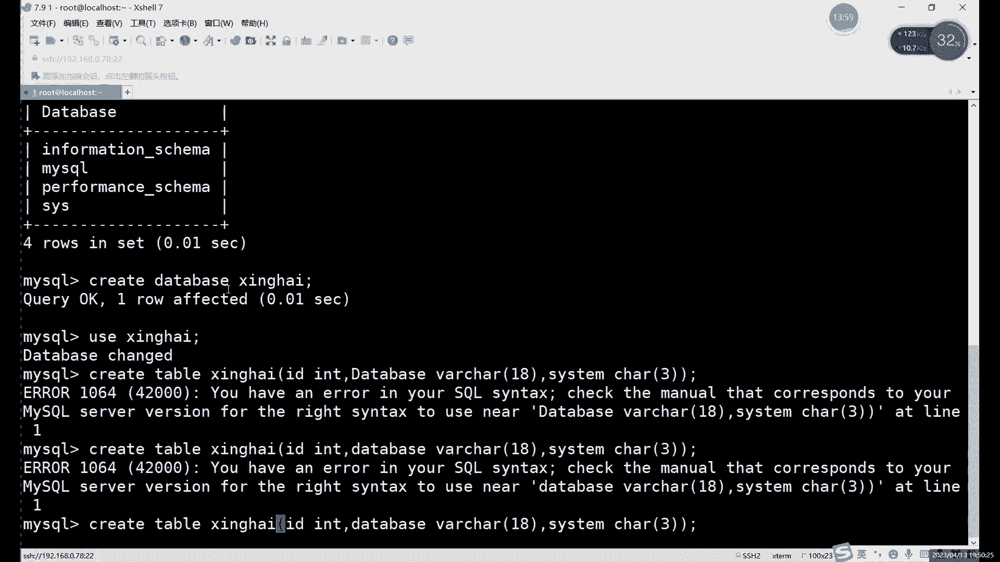


```sql
USE mydb;
```

现在，我们可以在`mydb`数据库中创建表格。创建表格使用`CREATE TABLE`命令，需要指定表格名称和列（字段）的定义。

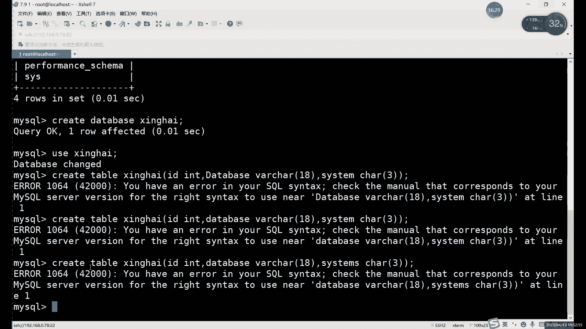

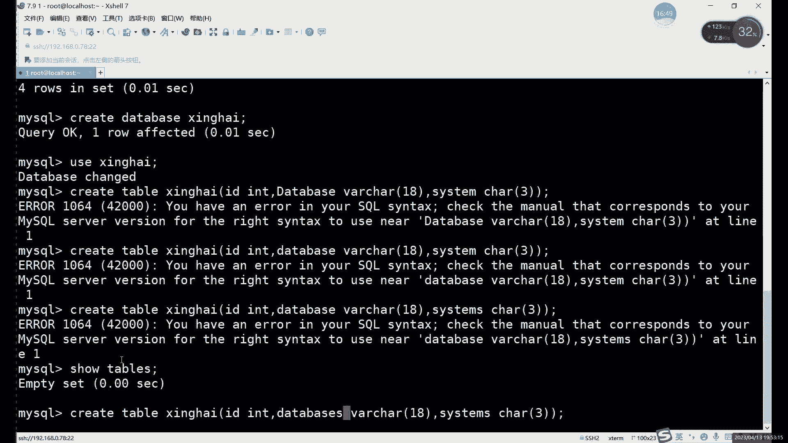

```sql
CREATE TABLE database_info (
    id INT,
    db_name VARCHAR(18),
    is_system CHAR(3)
);
```

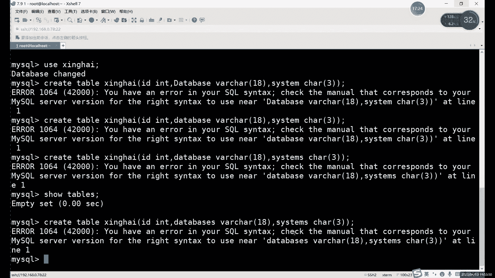

**代码解释**:
*   `CREATE TABLE database_info`: 创建名为`database_info`的表格。
*   `id INT`: 定义第一列，列名为`id`，数据类型为整数(`INT`)。
*   `db_name VARCHAR(18)`: 定义第二列，列名为`db_name`，数据类型为可变长度字符串(`VARCHAR`)，最大长度为18个字符。
*   `is_system CHAR(3)`: 定义第三列，列名为`is_system`，数据类型为固定长度字符串(`CHAR`)，长度固定为3个字符。

**注意**：字段名应避免使用MySQL的保留关键字（如`database`），否则可能报错。

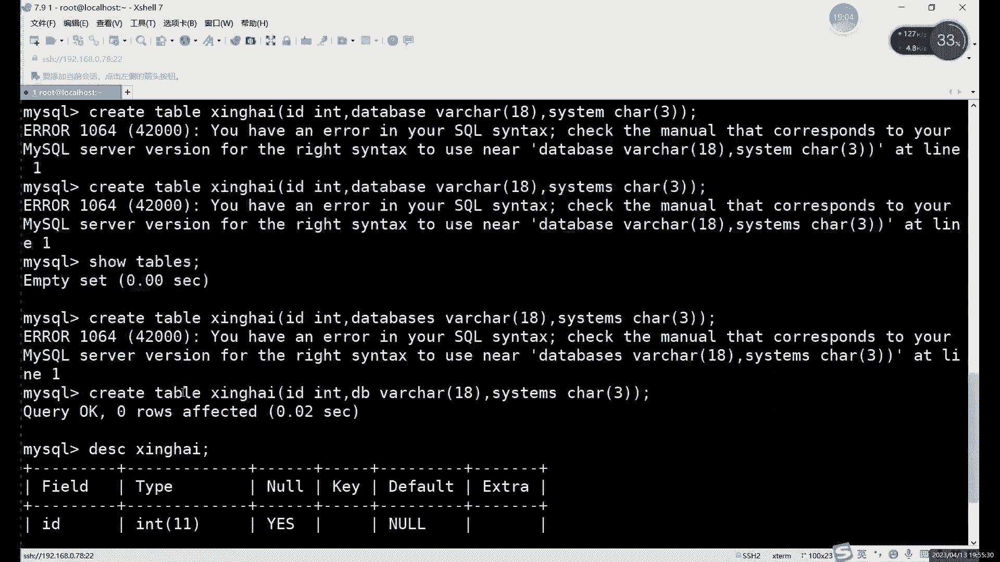

### 修改表格结构

`ALTER TABLE`命令用于修改现有表格的结构，几乎可以修改表格的所有方面，包括重命名、增删改列、修改数据类型和约束等。

我们先演示一个简单的操作：重命名表格。

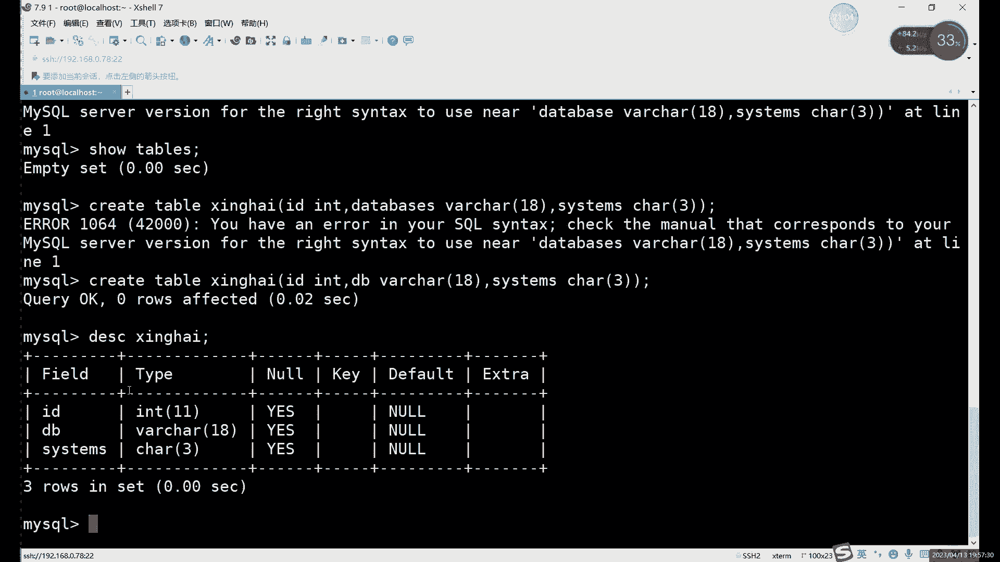

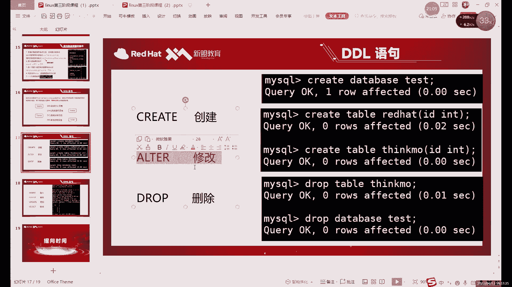

```sql
ALTER TABLE database_info RENAME TO db_info;
```

**代码解释**:
*   `ALTER TABLE database_info`: 指定要修改的原始表格`database_info`。
*   `RENAME TO db_info`: 子命令，将表格重命名为`db_info`。

### 删除表格与数据库

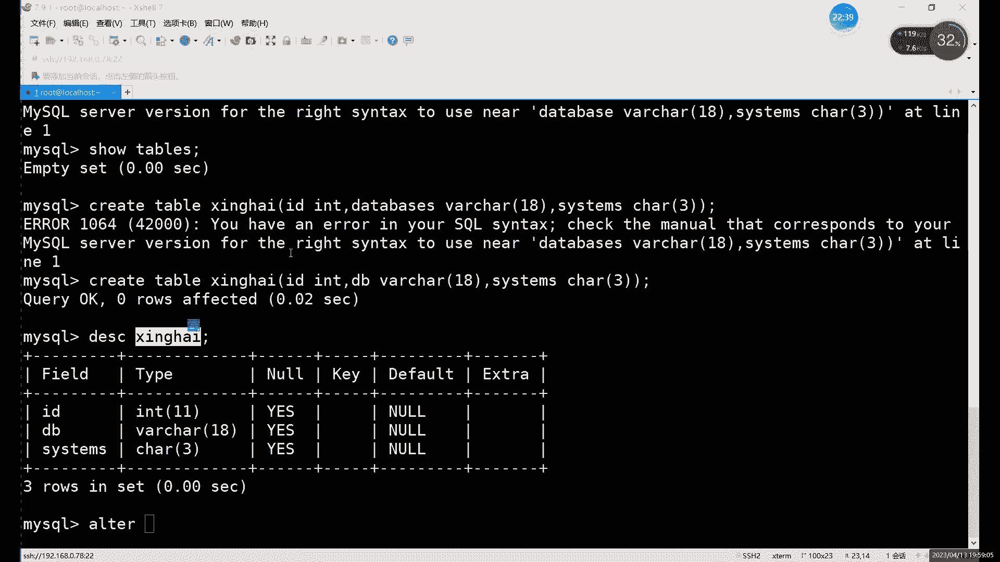

删除操作需要谨慎使用。
*   删除表格使用`DROP TABLE`命令。
*   删除数据库使用`DROP DATABASE`命令。这才是真正的“删库”命令。

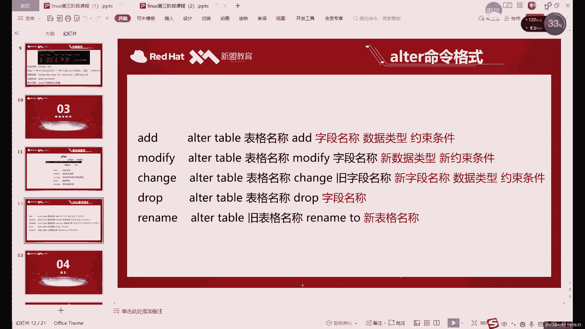

```sql
-- 删除表格 (谨慎操作)
DROP TABLE db_info;

-- 删除数据库 (极其谨慎操作)
DROP DATABASE mydb;
```

---

## 数据操作语言 (DML)

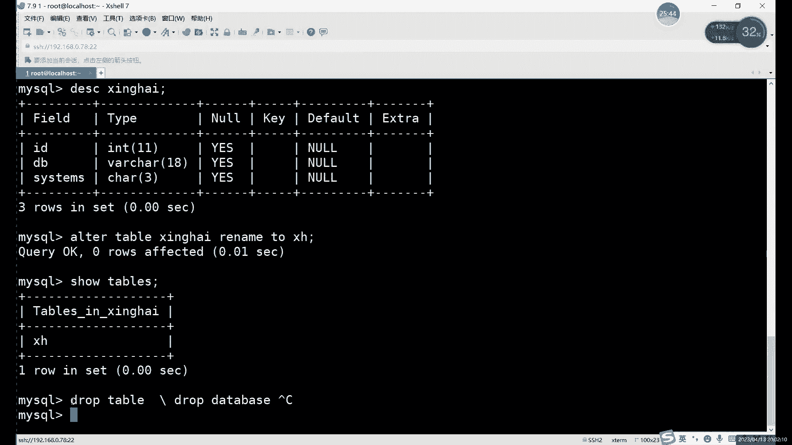

在定义好表格结构（DDL）之后，我们就可以使用DML来操作表格内的数据了，即实现数据的增加、删除、修改和查询。

### 插入数据 (INSERT)

`INSERT INTO`命令用于向表格中添加新行。

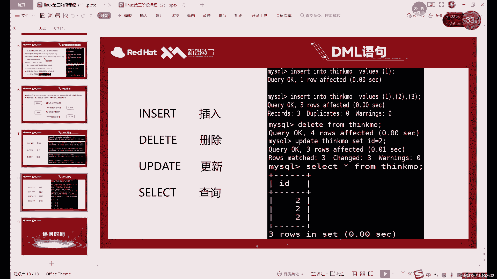

**插入完整行数据**：
向`db_info`表格插入一行完整数据，需要为所有列提供值。

```sql
INSERT INTO db_info VALUES (1, 'information_schema', 'yes');
```

**同时插入多行数据**：
可以在一个`INSERT`语句中插入多行数据，每行数据用括号括起来，并用逗号分隔。

```sql
INSERT INTO db_info VALUES
(2, 'mysql', 'yes'),
(3, 'performance_schema', 'yes'),
(4, 'mydb', 'no');
```

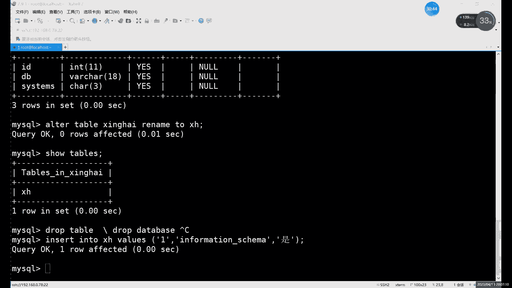

**插入部分列数据**：
如果只想为部分列插入数据，必须在表名后明确指定列名。

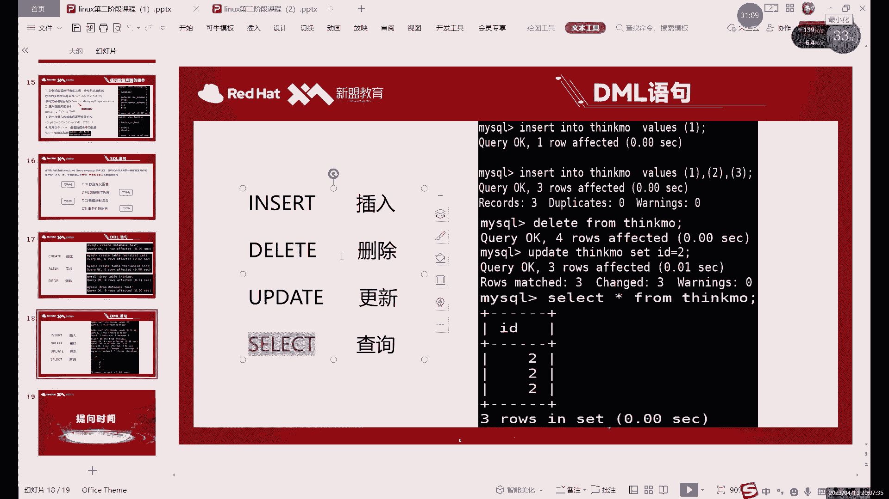

```sql
-- 只插入 id 和 db_name 列，is_system 列留空
INSERT INTO db_info (id, db_name) VALUES (5, 'testdb');
```
执行后，`is_system`列的值将显示为`NULL`，代表空值。

### 查询数据 (SELECT)

`SELECT`语句用于从表格中查询数据，是SQL中最复杂也最常用的命令。最基本的用法是使用`*`通配符查询所有列的数据。

```sql
SELECT * FROM db_info;
```

### 删除数据 (DELETE)

`DELETE FROM`命令用于删除表格中的行（数据）。**请注意，它只删除数据，不删除表格本身。**

```sql
-- 删除 db_info 表中 id 为 5 的这一行数据
DELETE FROM db_info WHERE id = 5;
```
（`WHERE`子句用于指定删除条件，我们将在后续课程详细讲解）

---

## 总结

本节课我们一起学习了SQL语句的两大基础类型：数据定义语言（DDL）和数据操作语言（DML）。

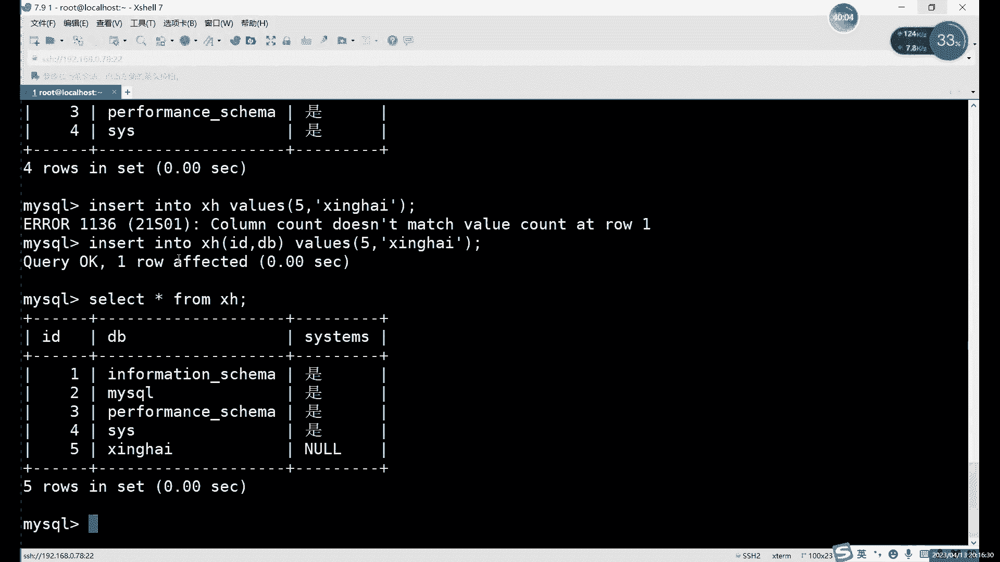

*   **DDL** 负责定义结构：我们掌握了如何使用`CREATE`创建数据库和表格，使用`ALTER`修改表格结构（如重命名），并了解了`DROP`删除操作的命令。
*   **DML** 负责操作数据：我们学会了使用`INSERT`向表格插入数据（完整行、多行、部分列），使用`SELECT`查询所有数据，以及使用`DELETE`删除特定数据行。

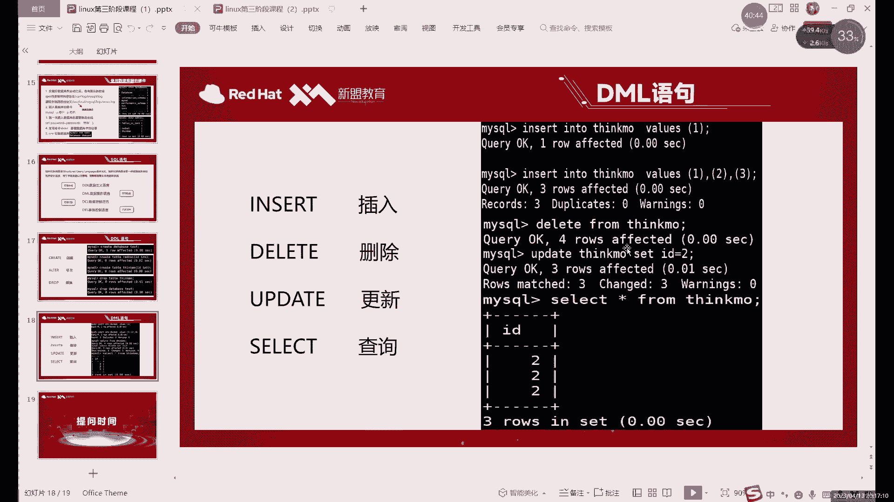

理解DDL定义规则、DML操作数据这一基本框架，是深入学习MySQL的关键。下一节，我们将进一步探讨表格中更精细的规则——数据类型和约束条件。