# MySQL基础教程：第6章：数据类型与约束（下）

在本节课中，我们将要学习MySQL中字符型、日期时间型数据类型的用法，以及六种重要的数据约束。这些知识将帮助我们更精确地定义表格结构，并确保数据的完整性和一致性。

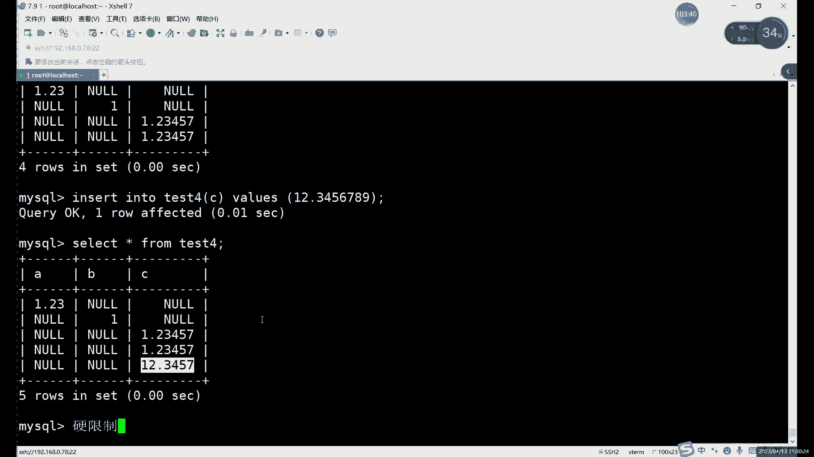

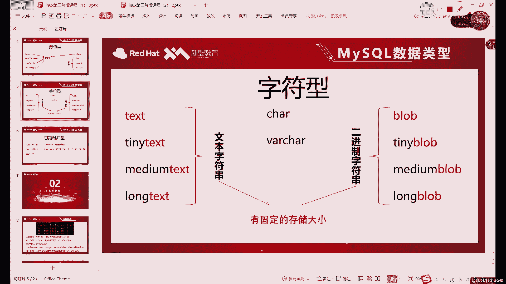

## 字符型数据

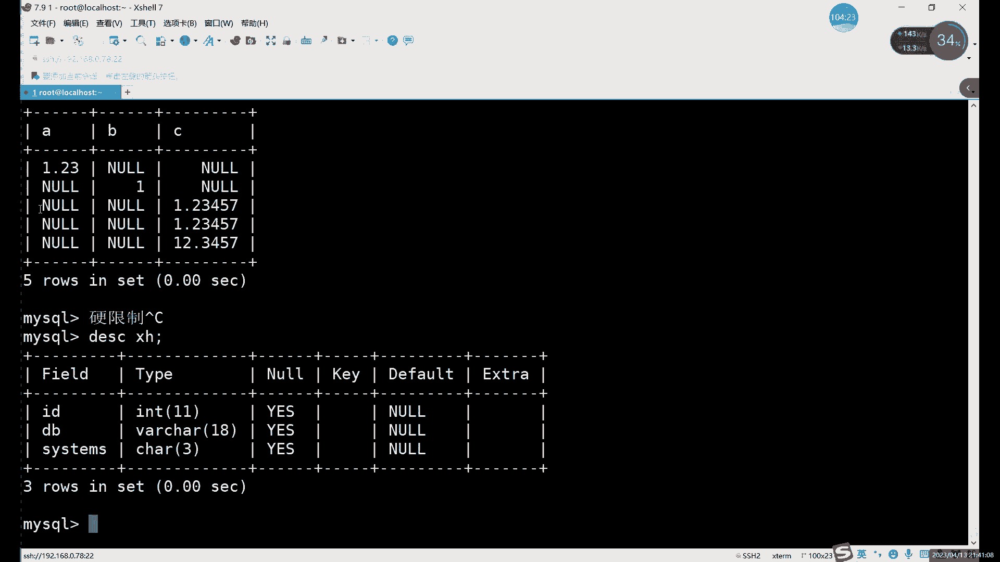

上一节我们介绍了数值型数据，本节中我们来看看字符型数据。字符型数据用于存储文本信息，与数值型不同，它对存储长度有严格的限制。

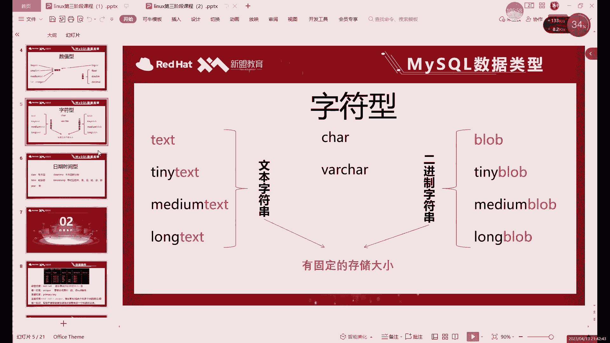

字符型主要分为三种：固定长度字符串、可变长度字符串以及大文本字符串。

以下是字符型数据的核心类型：

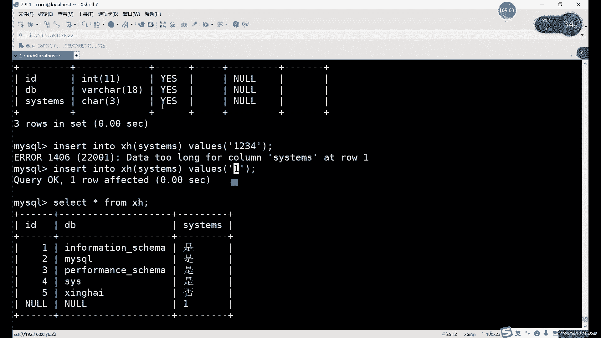

*   **CHAR(M)**：固定长度字符串。`M` 表示字符数，范围是0-255。如果存储的数据长度小于 `M`，会用空格在右侧填充至指定长度。
    *   **公式/代码**：`CHAR(M)`，例如 `CHAR(10)` 定义一个最多10个字符的固定长度字段。
*   **VARCHAR(M)**：可变长度字符串。`M` 表示最大字符数，范围是0-65535。只存储实际长度的字符，并在数据前用1-2个字节记录长度信息，更节省空间。
    *   **公式/代码**：`VARCHAR(M)`，例如 `VARCHAR(255)` 定义一个最大255个字符的可变长度字段。
*   **TEXT系列**：用于存储大文本数据，包括 `TINYTEXT`, `TEXT`, `MEDIUMTEXT`, `LONGTEXT`，容量依次增大。当需要存储超过65535字符的文本时使用。
    *   **公式/代码**：`TEXT`，`LONGTEXT` 等。

**核心概念**：字符型数据在插入时必须**加引号**（单引号或双引号），而数值型可以不加。这是字符型与数值型操作上的一个关键区别。

## 日期时间型数据

接下来，我们了解日期时间型数据。这类数据用于存储日期和时间，有特定的格式要求。

日期时间型数据本质上是带有特殊格式的数值。常用的类型是 `DATETIME`，它包含了年月日时分秒。

以下是 `DATETIME` 类型的几种插入格式示例：

*   **标准格式**：`‘YYYY-MM-DD HH:MM:SS’` （例如 `‘2023-10-27 14:30:00’`）
*   **紧凑格式**：`‘YYYYMMDDHHMMSS’` （例如 `‘20231027143000’`）
*   **简写年份**：年份可简写为2位，`00-69` 代表 `2000-2069`，`70-99` 代表 `1970-1999`。

**核心概念**：日期时间型数据在插入时，加引号或不加引号均可被识别，系统会智能地将其转换为标准格式进行存储和显示。

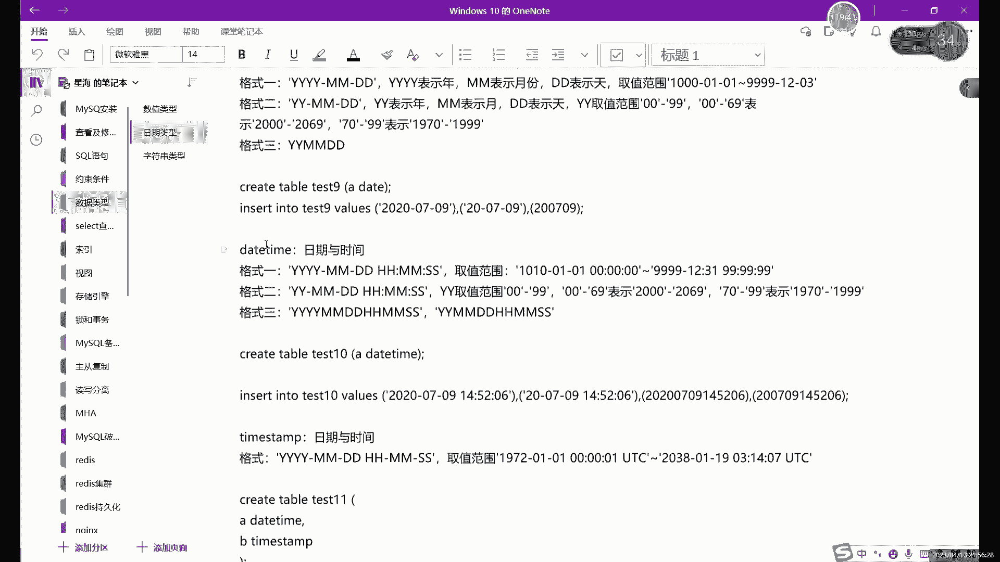

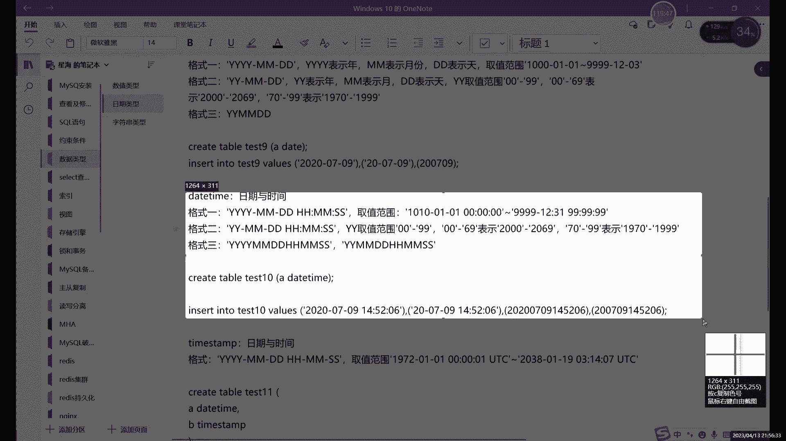

## 数据约束

在创建表时，除了指定数据类型，我们还可以为列添加“约束”。约束是强制实施数据规则的机制，对于保证数据质量至关重要。

MySQL中主要有六种约束：非空约束、唯一约束、主键约束、外键约束、默认值约束和自增约束。

### 1. 非空约束 (NOT NULL)

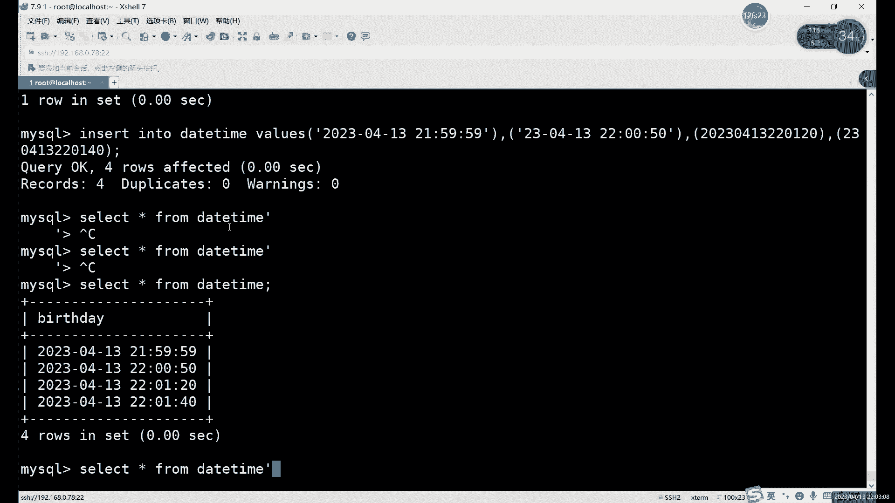

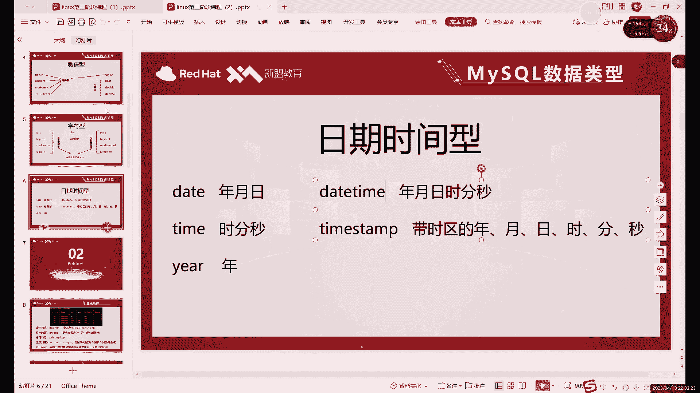

非空约束确保列不能存储 `NULL` 值（空值）。如果尝试插入 `NULL` 或跳过该列，将会报错。

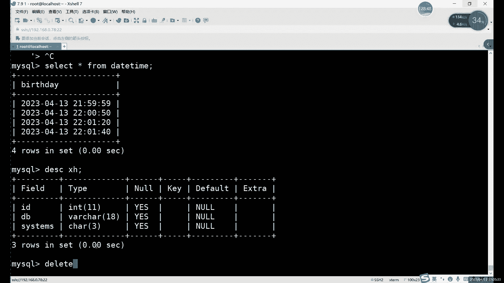

**核心概念**：`NOT NULL` 约束强制要求该列在每一行都必须有实际的值，防止数据遗漏。
*   **代码**：在创建表时，在数据类型后添加 `NOT NULL`。例如：`CREATE TABLE table_name (id INT NOT NULL, ...);`

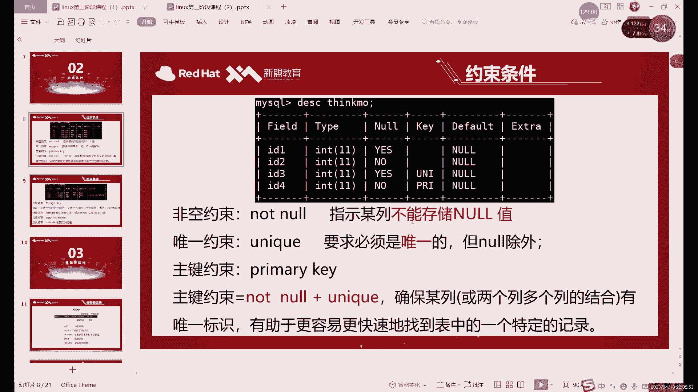

### 2. 唯一约束 (UNIQUE)

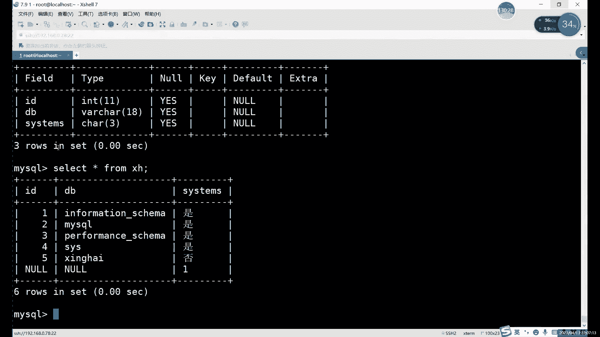

唯一约束确保列中的所有值都是互不相同的（`NULL` 值除外，多个 `NULL` 被视为不违反唯一性）。

**核心概念**：`UNIQUE` 约束防止数据重复，为基于该列的查询、更新和删除操作提供了便利。
*   **代码**：在数据类型后添加 `UNIQUE`。例如：`CREATE TABLE table_name (email VARCHAR(100) UNIQUE, ...);`

### 3. 主键约束 (PRIMARY KEY)

主键约束是非空约束和唯一约束的组合。它要求列的值**既不能为 `NULL`，也不能重复**。每个表通常应该有一个主键，用于唯一标识表中的每一行记录。

**核心概念**：`PRIMARY KEY` 是表中每条记录的“身份证号”，是进行数据关联和高效操作的基础。
*   **代码**：在数据类型后添加 `PRIMARY KEY`。例如：`CREATE TABLE table_name (id INT PRIMARY KEY, ...);`

### 4. 外键约束 (FOREIGN KEY)

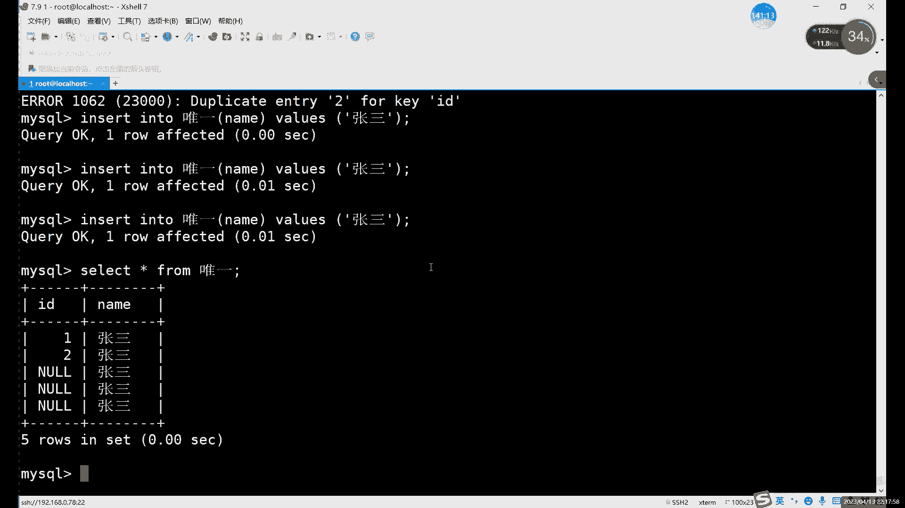

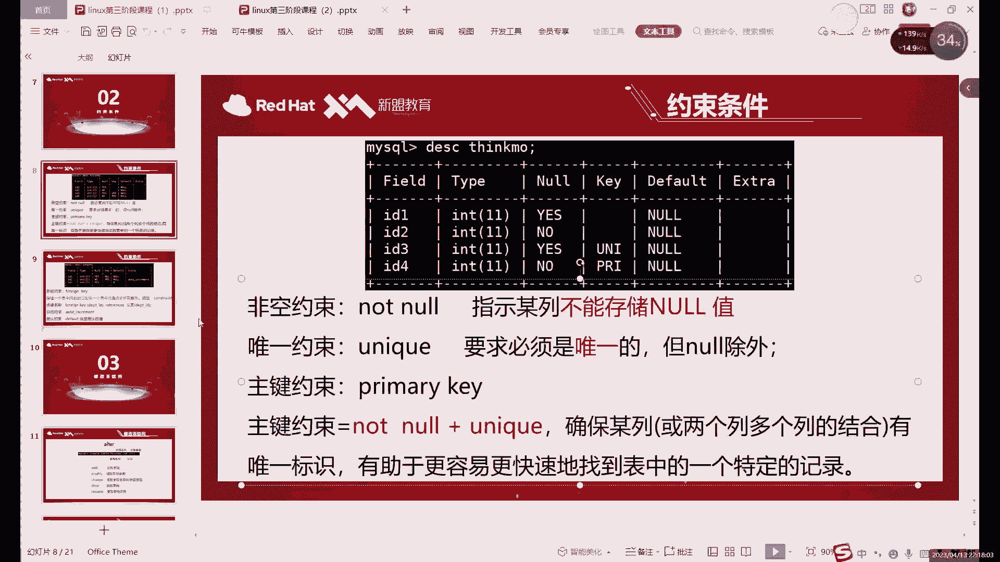

外键约束用于建立两个表之间的链接。它要求一个表（子表）中的某列值，必须在另一个表（父表）的主键列中存在。这保证了数据的引用完整性。

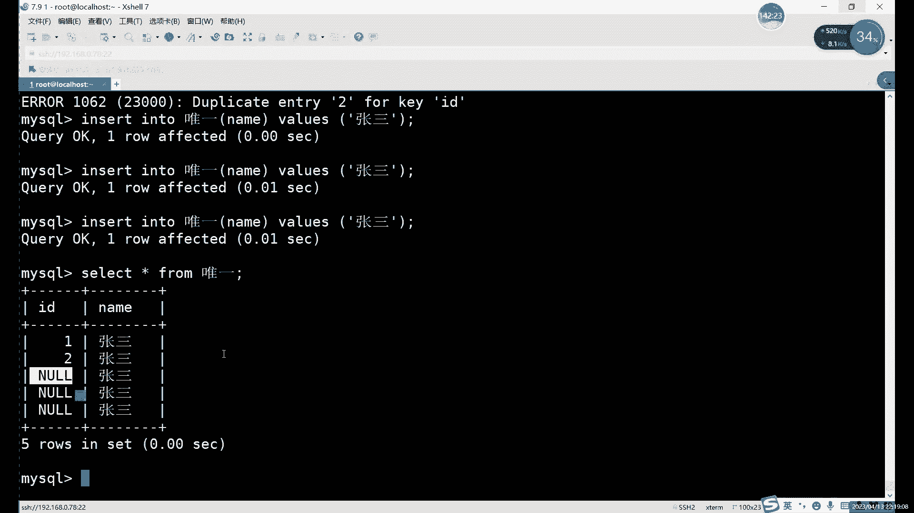

**核心概念**：`FOREIGN KEY` 实现了表间的数据关联和同步。当父表的主键值更新或删除时，可以定义子表外键的级联操作（如同时更新或删除）。
*   **代码**：语法相对复杂，通常在创建表末尾定义：`FOREIGN KEY (child_column) REFERENCES parent_table(parent_column)`

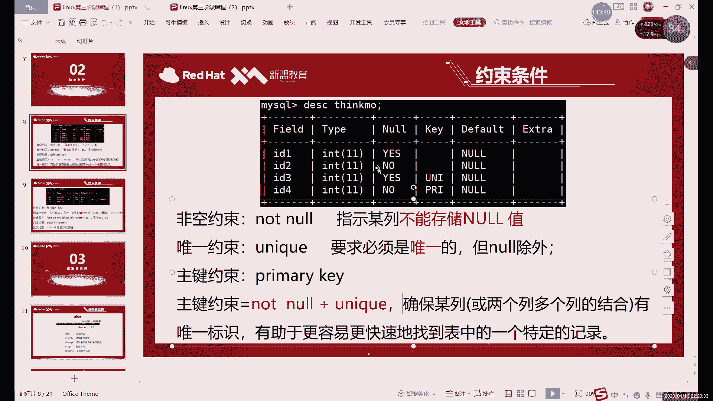

### 5. 默认值约束 (DEFAULT)

默认值约束为列指定一个默认值。当插入新记录时，如果没有为该列提供值，则会自动填入这个默认值。

**核心概念**：`DEFAULT` 约束提供了数据的“保底值”，简化了插入操作，避免了因遗漏非空列而导致的错误。
*   **代码**：在数据类型后添加 `DEFAULT ‘value’`。例如：`CREATE TABLE table_name (status CHAR(1) DEFAULT ‘A‘, ...);`

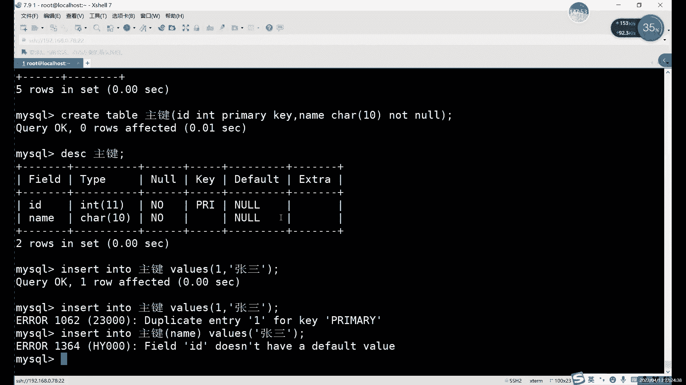

### 6. 自增约束 (AUTO_INCREMENT)

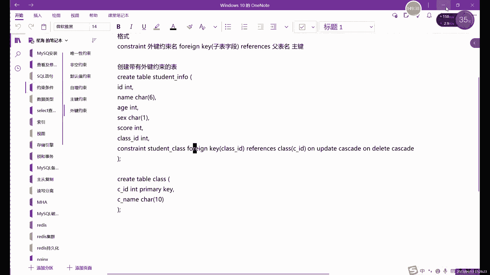

自增约束通常用于主键列。当插入新记录时，如果省略该列或填入 `NULL`，系统会自动为该列生成一个唯一的、递增的整数值。

**核心概念**：`AUTO_INCREMENT` 自动管理主键的生成，确保其唯一性和连续性，无需手动计算和指定。
*   **代码**：在整数数据类型后添加 `AUTO_INCREMENT`，且该列通常也是 `PRIMARY KEY`。例如：`CREATE TABLE table_name (id INT PRIMARY KEY AUTO_INCREMENT, ...);`

---

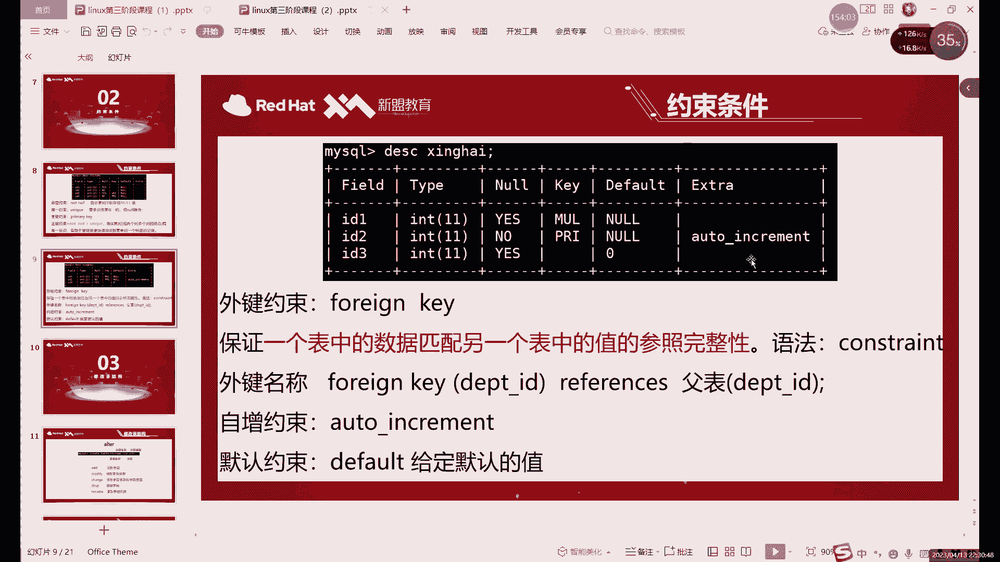

本节课中我们一起学习了MySQL的字符型和日期时间型数据类型，以及六种核心的数据约束（非空、唯一、主键、外键、默认值、自增）。理解并合理运用这些约束，是设计出健壮、高效数据库表结构的关键。下节课我们将深入探讨外键约束的具体应用以及其他高级特性。