# MySQL数据库管理：第7章：约束、ALTER命令、索引与SELECT查询（上）


在本节课中，我们将深入学习MySQL中的约束条件，特别是外键、自增和默认约束。同时，我们也将开始介绍用于修改表结构的ALTER命令。掌握这些知识，将帮助你更好地设计和控制数据库表的结构与数据完整性。

## 约束条件详解


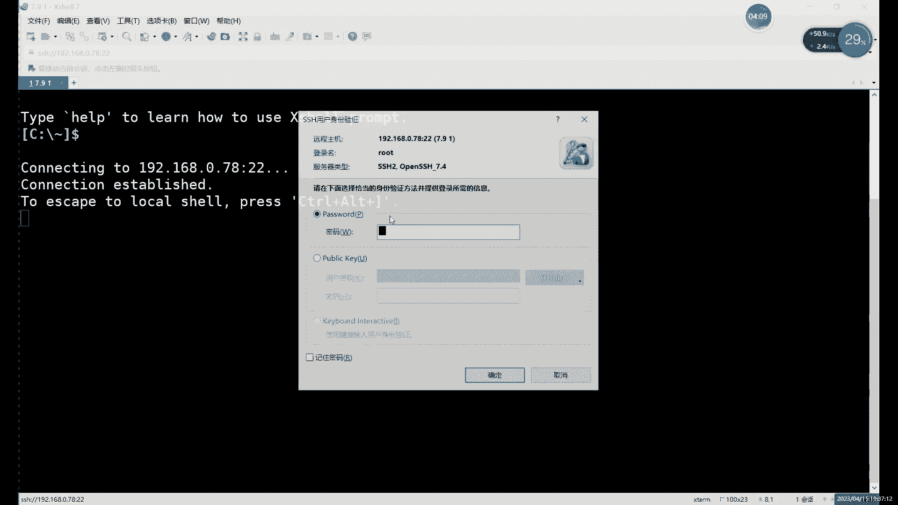

上节课我们介绍了非空约束、唯一性约束和主键约束。本节中我们来看看剩下的三种约束：外键约束、自增约束和默认约束。

### 外键约束

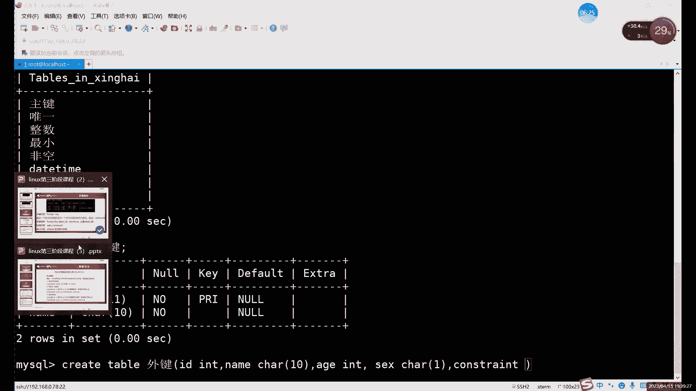

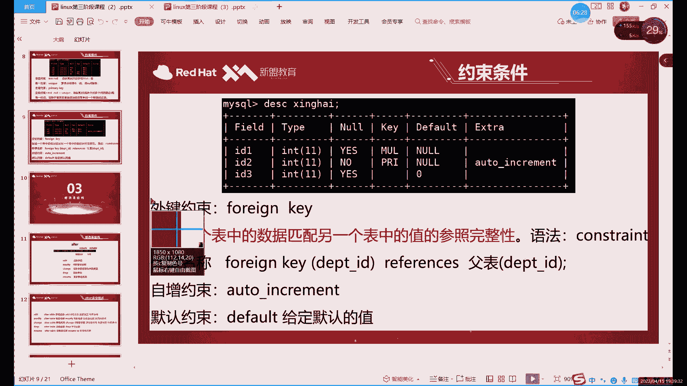

外键约束的主要作用是在两个不同的表格之间建立关联，实现数据的同步。它通常用于关联两个表中含义相同的列，例如ID号或姓名。

外键约束的创建格式与其他约束不同，它通常在所有字段定义完成后单独声明。以下是创建外键的基本语法：

```sql
CONSTRAINT `外键名称` FOREIGN KEY (`本表字段名`) REFERENCES `主表名` (`主表字段名`) ON UPDATE CASCADE ON DELETE CASCADE;
```

**核心概念解析：**
*   **`CONSTRAINT 外键名称`**: 为外键约束定义一个名称，便于后续管理。
*   **`FOREIGN KEY (本表字段名)`**: 指定当前表中作为外键的字段。
*   **`REFERENCES 主表名 (主表字段名)`**: 指定外键所关联的主表及其主键字段。
*   **`ON UPDATE CASCADE`**: 设置当主表数据更新时，外键表的数据同步更新。
*   **`ON DELETE CASCADE`**: 设置当主表数据删除时，外键表的数据同步删除。

**重要注意事项：**
1.  外键字段与主表主键字段的**数据类型必须完全一致**。
2.  设置了外键约束的字段，**不能主动修改或删除**数据，只能添加数据。数据的更新和删除操作会跟随主表联动。
3.  外键的变动（增、删、改）不会影响主表，但主表的更新和删除会影响外键表。

**操作示例：**
假设已有一个主表 `primary_table`，其主键为 `id`。
1.  创建带外键的表：
    ```sql
    CREATE TABLE foreign_table (
        id INT,
        name VARCHAR(20),
        CONSTRAINT fk_id FOREIGN KEY (id) REFERENCES primary_table(id) ON UPDATE CASCADE ON DELETE CASCADE
    );
    ```
2.  当更新 `primary_table` 中 `id=1` 为 `id=2` 时，`foreign_table` 中对应的 `id` 也会自动变为2。
3.  当删除 `primary_table` 中的某条记录时，`foreign_table` 中关联的记录也会被自动删除。

### 自增约束

自增约束（AUTO_INCREMENT）用于为数值类型的列设置自动递增的值，特别适用于ID号、序号等需要按顺序排列的字段。

**核心概念解析：**
*   自增约束**只能应用于数值类型的字段**（如INT）。
*   该字段通常需要配合**主键（PRIMARY KEY）** 或**唯一约束（UNIQUE）** 使用，以确保其值的唯一性，从而保证顺序增长。
*   插入数据时，无需为自增列指定值，数据库会自动填充一个比当前最大值大1的数值（默认从1开始）。

**操作示例：**
```sql
-- 创建带有自增主键的表
CREATE TABLE auto_inc_table (
    id INT PRIMARY KEY AUTO_INCREMENT,
    name VARCHAR(20)
);

-- 插入数据，id列会自动填充
INSERT INTO auto_inc_table (name) VALUES ('张三'), ('李四');
-- 查询结果：id 分别为 1 和 2
```
**修改自增规则（了解即可）：**
可以修改自增的初始值和步长（每次增加的值），但实践中很少需要改动。
```sql
-- 设置自增步长为2（不常用）
SET @@auto_increment_increment = 2;
-- 设置自增初始值为100（不常用）
SET @@auto_increment_offset = 100;
```

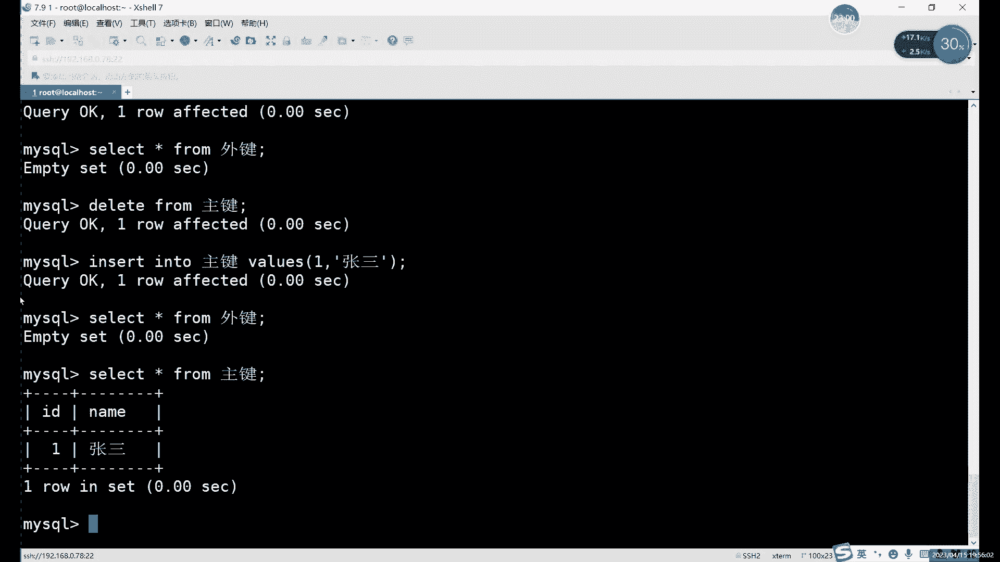

### 默认约束

默认约束（DEFAULT）用于指定当插入数据时，如果未给某列赋值，则自动填充一个预设的值。

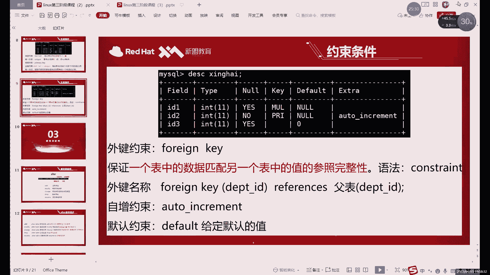

**核心概念解析：**
*   默认约束可以应用于任何数据类型的列。
*   它提供了一个“自动填充”的功能，与自增约束类似，但填充的值是**固定不变**的。
*   如果插入数据时显式指定了该列的值，则会使用指定的值，而非默认值。

**操作示例：**
```sql
-- 创建表，并为性别列设置默认值‘男’
CREATE TABLE default_table (
    id INT,
    name VARCHAR(20),
    gender VARCHAR(2) DEFAULT ‘男‘
);

-- 插入数据时不指定gender
INSERT INTO default_table (id, name) VALUES (1, ‘张三‘);
-- 查询结果：gender 为 ‘男‘

-- 插入数据时指定gender
INSERT INTO default_table (id, name, gender) VALUES (2, ‘李四‘, ‘女‘);
-- 查询结果：gender 为 ‘女‘
```

## ALTER命令：修改表结构

之前我们只使用ALTER命令修改过表名。实际上，ALTER命令功能强大，可以用于添加、修改或删除表中的列、约束和索引。

**基本语法格式：**
```sql
ALTER TABLE `表名` [操作语句];
```

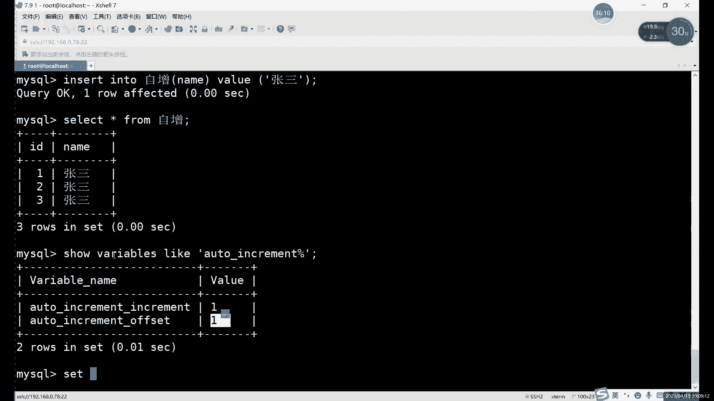

以下是ALTER命令的一些常见用途：

**1. 添加列**
```sql
ALTER TABLE `表名` ADD `列名` 数据类型 [约束];
-- 示例：添加一个年龄列
ALTER TABLE student ADD age INT;
```


**2. 修改列的数据类型或约束**
```sql
ALTER TABLE `表名` MODIFY `列名` 新数据类型 [新约束];
-- 示例：将name列的长度改为30
ALTER TABLE student MODIFY name VARCHAR(30);
```

**3. 修改列名**
```sql
ALTER TABLE `表名` CHANGE `旧列名` `新列名` 数据类型;
-- 示例：将列名“gender”改为“sex”
ALTER TABLE student CHANGE gender sex VARCHAR(2);
```

**4. 删除列**
```sql
ALTER TABLE `表名` DROP `列名`;
-- 示例：删除age列
ALTER TABLE student DROP age;
```

**5. 添加约束**
```sql
-- 添加主键
ALTER TABLE `表名` ADD PRIMARY KEY (`列名`);
-- 添加唯一约束
ALTER TABLE `表名` ADD UNIQUE (`列名`);
-- 添加外键约束
ALTER TABLE `表名` ADD CONSTRAINT `外键名` FOREIGN KEY (`本表列`) REFERENCES `主表` (`主表列`);
```

**6. 删除约束**
```sql
-- 删除主键
ALTER TABLE `表名` DROP PRIMARY KEY;
-- 删除唯一约束（需要知道约束名）
ALTER TABLE `表名` DROP INDEX `唯一约束名`;
-- 删除外键约束
ALTER TABLE `表名` DROP FOREIGN KEY `外键名`;
```

## 约束条件使用总结

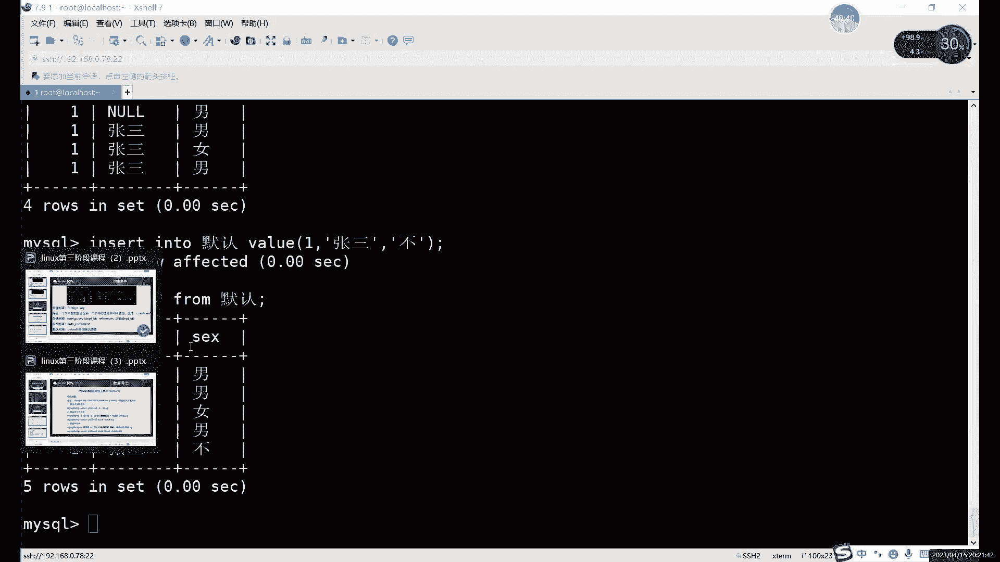

本节课我们一起学习了六种主要的约束条件，它们各自有不同的适用场景：

1.  **非空约束（NOT NULL）**：确保列不能存储NULL值。几乎所有列都可以根据业务需求决定是否设置。
2.  **唯一约束（UNIQUE）**：保证列中每行数据的唯一性。**需谨慎使用**，确保该列在业务逻辑上确实不会重复（如身份证号、邮箱）。
3.  **主键约束（PRIMARY KEY）**：相当于 `NOT NULL + UNIQUE`，用于唯一标识表中的每一行。一张表只能有一个主键。
4.  **外键约束（FOREIGN KEY）**：用于建立两个表之间的链接，实现数据同步和参照完整性。**需注意数据类型一致**。
5.  **自增约束（AUTO_INCREMENT）**：自动生成唯一的、递增的数值。**通常只用于主键ID列**。
6.  **默认约束（DEFAULT）**：为列指定一个默认值，当插入数据未指定该列时使用。适用于有普遍通用值的列（如性别默认‘男‘）。

**核心原则：** 在设计表结构时，应根据数据的实际业务逻辑和关系来选择合适的约束，以保障数据的正确性、有效性和一致性。不恰当的约束（如在可能重复的“姓名”列上设置唯一约束）会导致数据无法正常插入。

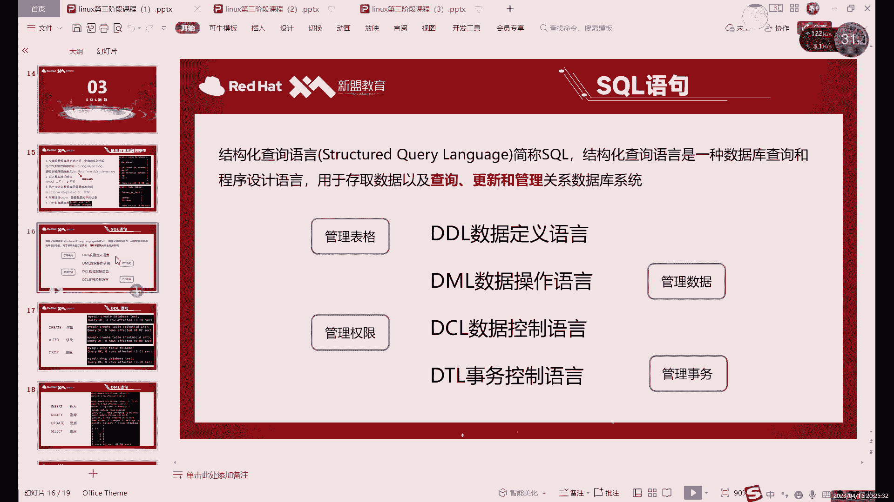

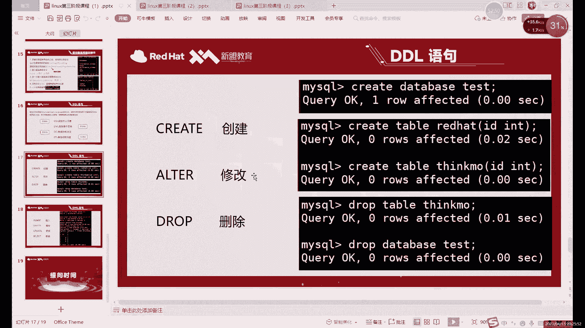

---


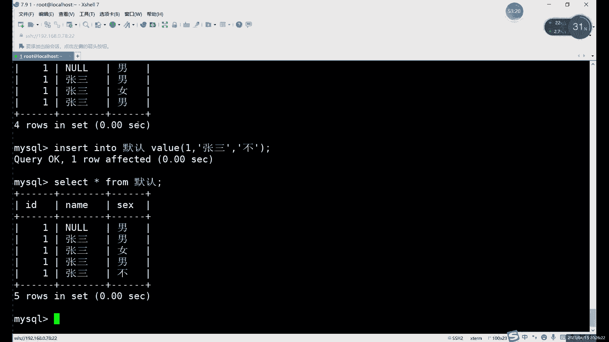

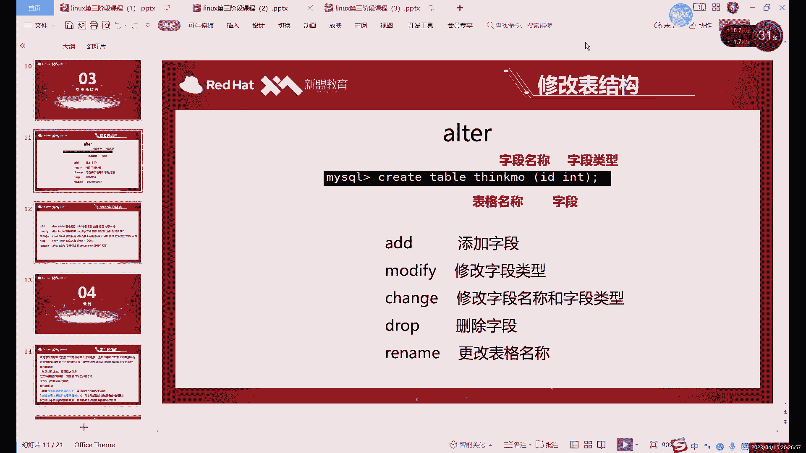

本节课中，我们深入探讨了外键、自增和默认约束的用法，并系统学习了使用ALTER命令修改表结构的方法。理解并掌握这些内容，是进行高效、安全的数据库管理的基础。下节课，我们将开始学习强大的数据查询语言——SELECT语句。