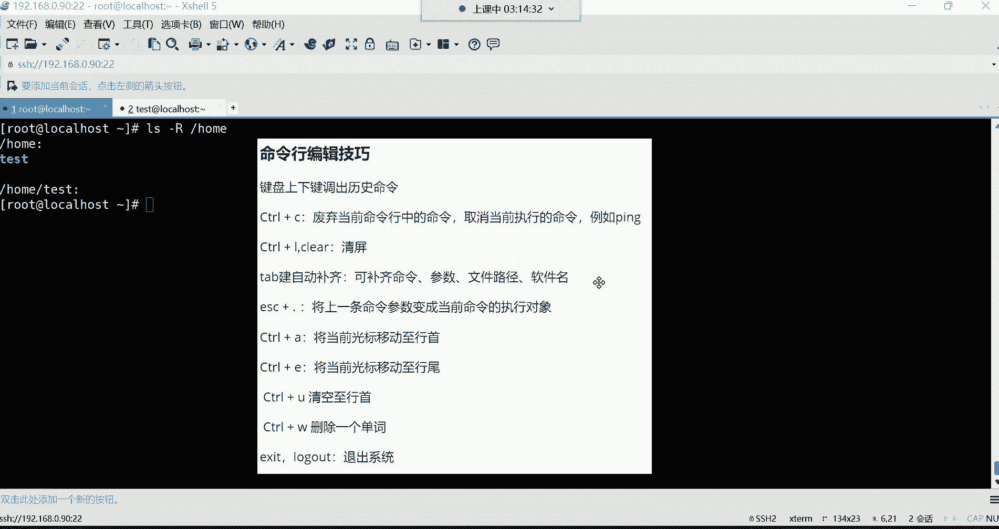
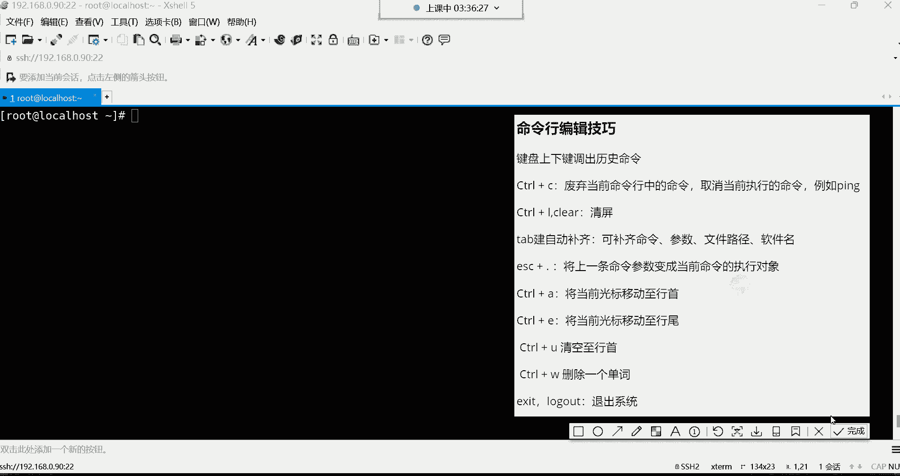
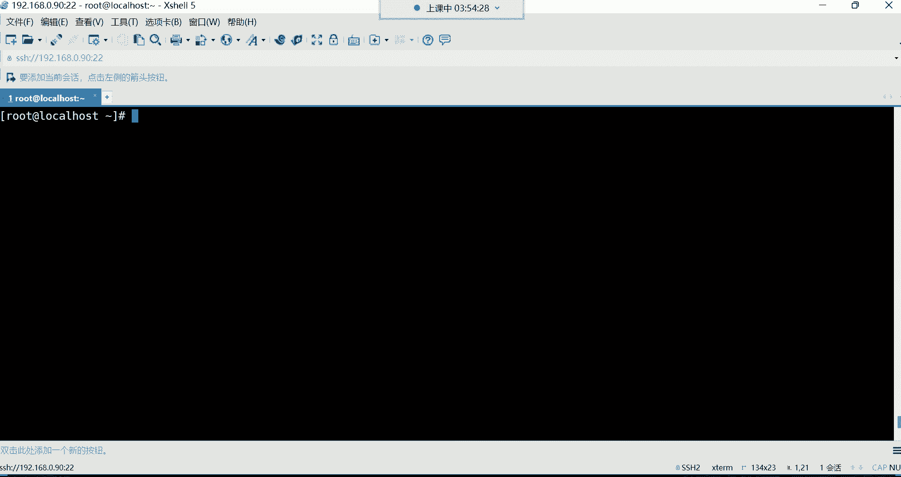
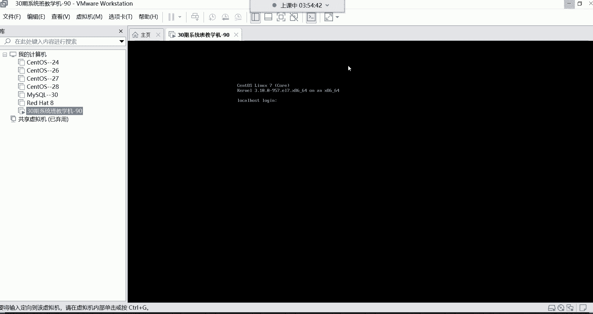
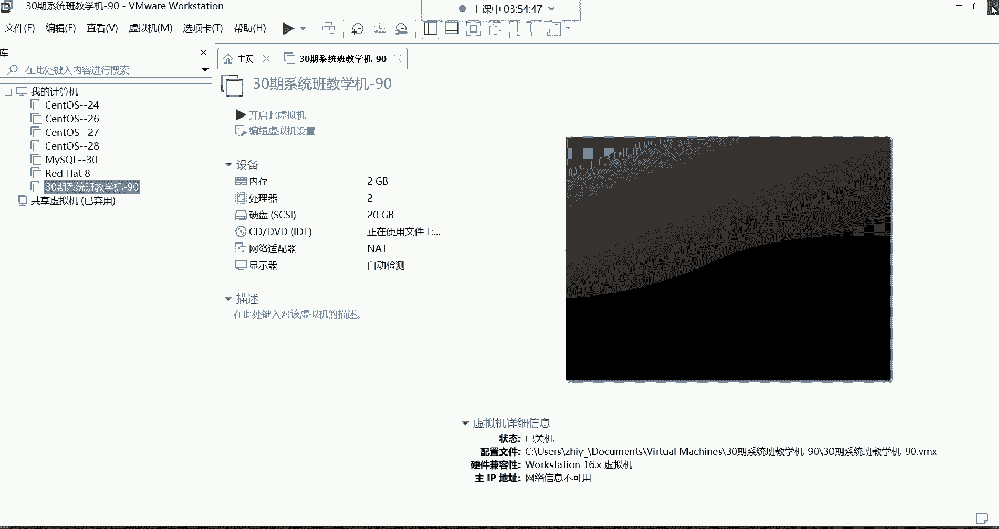
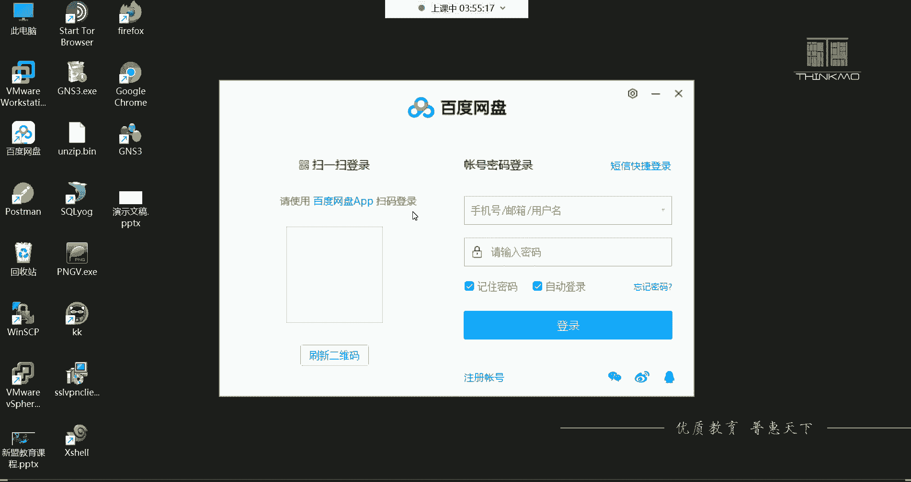
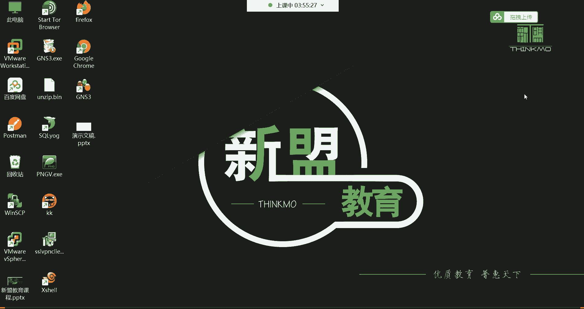
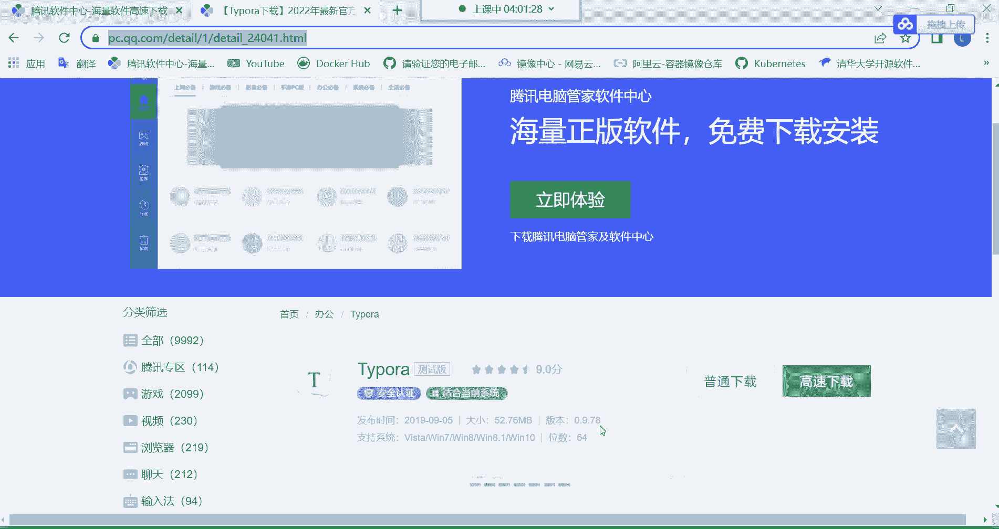
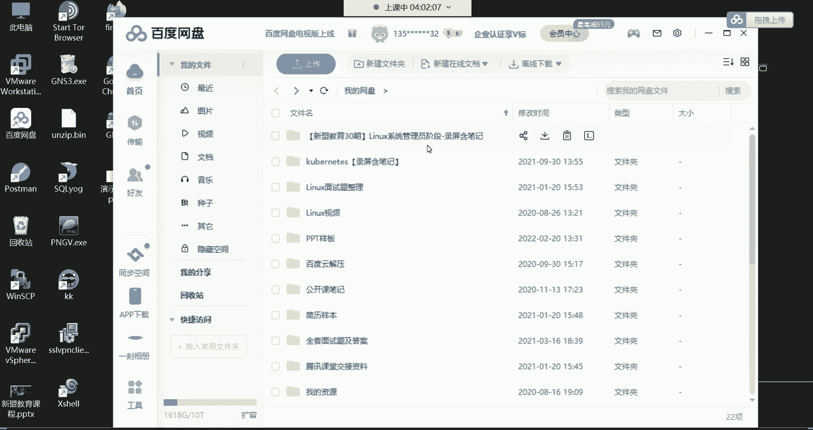
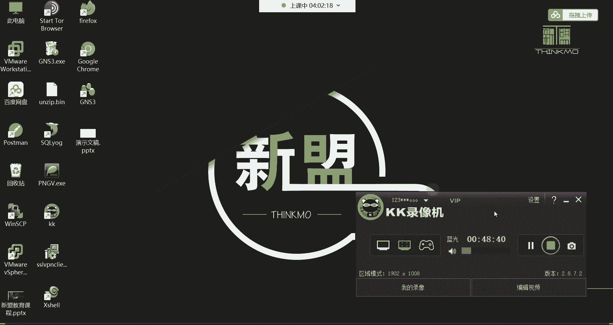

# Linux运维基础：P6：命令行编辑技巧与学习方法 📝




在本节课中，我们将学习Linux命令行中的高效编辑技巧，并探讨一些有效的学习方法，帮助你提升学习效率和工作速度。

## 命令行编辑技巧 🚀


上一节我们介绍了`ls`命令的基本用法，本节中我们来看看如何更高效地使用命令行。掌握这些快捷操作可以显著提升你的工作效率。


### 历史命令导航

以下是使用键盘上下键调出历史命令的方法：
*   **上方向键 (↑)**：调出上一条执行过的命令。
*   **下方向键 (↓)**：调出下一条执行过的命令。
*   **说明**：系统默认保存最近1000条命令历史。但通常我们只翻看最近几条命令，因为翻找太旧的命令不如直接重新输入。

### 命令控制与清屏

以下是控制命令执行和清理屏幕的快捷方式：
*   **Ctrl + C**：有两个主要功能。
    *   废弃当前在命令行中已输入但**尚未执行**的命令。
    *   强制终止**正在执行**的命令（例如终止一个持续运行的`ping`命令）。
*   **Ctrl + L** 或 **`clear`命令**：快速清空当前终端屏幕，保持界面整洁。

### Tab键自动补全

Tab键是命令行中最实用的工具之一，它可以自动补全命令、文件路径和软件包名。

**使用方法**：
1.  输入命令或路径的开头部分。
2.  按一次 **Tab** 键。如果系统能找到唯一匹配项，则会自动补全。
3.  如果按一次Tab键没有反应，表示有多个匹配项。此时按**两次Tab键**，系统会列出所有可能的选项供你选择。

**示例**：想进入 `/etc/sysconfig/network-scripts/` 目录。
```bash
cd /etc/sys<Tab><Tab>   # 列出所有以 `sys` 开头的目录
cd /etc/sysconfig/ne<Tab> # 输入 `ne` 后按Tab，可能自动补全为 `network`
cd /etc/sysconfig/network-<Tab> # 输入 `network-` 后按Tab，可能自动补全为 `network-scripts/`
```

### 光标移动与编辑



以下快捷操作可以帮助你快速编辑命令行：
*   **Esc + . (点)**：这是一个非常实用的技巧。按下 `Esc` 键后紧接着按 `.` 键，可以快速输入**上一条命令的最后一个参数**。
*   **Ctrl + A**：将光标快速移动到**行首**。
*   **Ctrl + E**：将光标快速移动到**行尾**。
*   **Ctrl + U**：删除从光标当前位置到**行首**的所有内容。
*   **Ctrl + W**：删除光标前的一个**单词**（以空格为分隔）。

### 退出系统

当你需要退出当前登录的会话时，可以使用以下任一命令：
*   **`exit`**
*   **`logout`**

**核心技巧总结**：对于初学者，建议优先熟练掌握 **上下键**、**Ctrl+C**、**Ctrl+L**、**Tab键** 和 **Esc+.** 这几个最常用的技巧。

## 学习方法与建议 📚

掌握了操作技巧，我们再来看看如何更有效地学习。正确的学习方法能让你的学习之路事半功倍。

### 遇到问题怎么办

在学习初期，遇到问题是常态。以下是解决问题的建议路径：
1.  **初期**：大胆提问。可以直接在课程群内@答疑老师（例如雷神老师）或班主任。
2.  **后期**：培养独立解决问题的能力。尝试自己分析问题，并利用搜索引擎（如百度、谷歌）寻找答案。**学会如何准确描述问题**是高效搜索的关键。
3.  **善用资源**：CSDN等技术社区是查阅技术文章的好地方，但通常不是直接提问的首选平台。

### 学习态度与习惯

保持积极的学习态度和良好的习惯至关重要：
*   **主动学习**：不要局限于课堂内容。对于学到的命令（如`ls`），可以主动查阅资料，了解其更多选项和用法，进行知识扩展。
*   **坚持不懈**：整个系统学习周期约为五个半月。请将这段时间视为重要的“投资期”，减少无效社交，集中精力学习，用短期的投入换取长期的职业发展。
*   **避免钻牛角尖**：如果某个知识点暂时无法理解，不要长时间死磕。可以先做标记，继续往后学习。很多时候，后面的知识会帮助你理解前面的难点。这叫做“低头拉车，也要抬头看路”。

### 课程资料与工具









充分利用课程提供的资料：
*   **课堂笔记**：老师会将每节课的笔记（源码版和PDF版）上传至网盘。PDF版适合存入手机，便于随时复习。
*   **笔记软件**：推荐使用 **Typora** 软件打开和编辑Markdown（.md）格式的笔记源码。软件下载链接通常会在课程群公告中提供。
*   **单词表**：课程可能提供“Linux常见英文单词表”，帮助不熟悉专业术语的同学快速理解命令含义。







### 虚拟机操作

课程实验通常在虚拟机中进行：
*   **关机**：可以通过虚拟机软件（如VMware）的菜单选项“关闭客户机”来安全关闭Linux系统。
*   **断开连接**：使用`exit`命令退出SSH连接后，关闭终端窗口即可。

---







本节课中我们一起学习了Linux命令行的核心编辑技巧，包括历史命令调取、命令控制、Tab键补全和光标快捷操作。同时，我们也探讨了高效的学习方法、问题解决策略以及如何利用课程资料。记住，熟练掌握这些技巧并保持积极的学习态度，是成为一名合格Linux运维工程师的良好开端。下一节课，我们将开始学习更多实用的Linux命令。