# MySQL数据库管理：第8章：约束、ALTER命令、索引与SELECT查询（中）


在本节课中，我们将深入学习MySQL中用于修改表结构的ALTER命令，并探讨索引的概念及其与约束的关系。理解这些内容对于优化数据库性能和灵活管理表格至关重要。

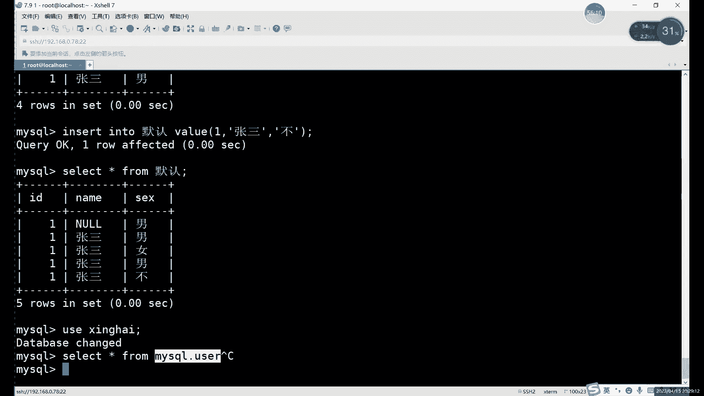

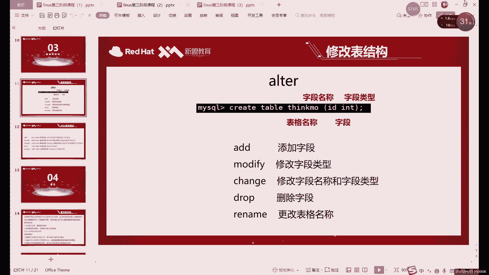

## 概述：ALTER命令与索引

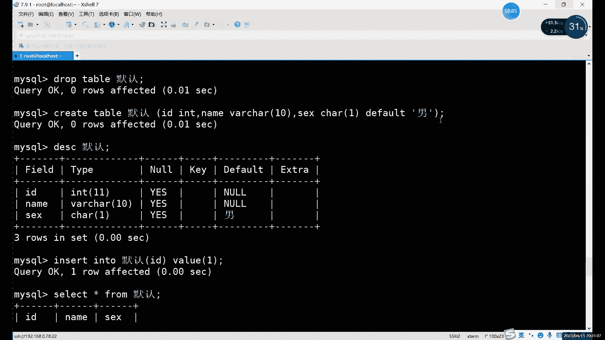

上一节我们介绍了约束的基本概念。本节中，我们来看看如何修改已存在的表结构，以及如何利用索引来提升数据查询的效率。ALTER命令是修改表结构的主要工具，而索引则是加速数据检索的关键机制。

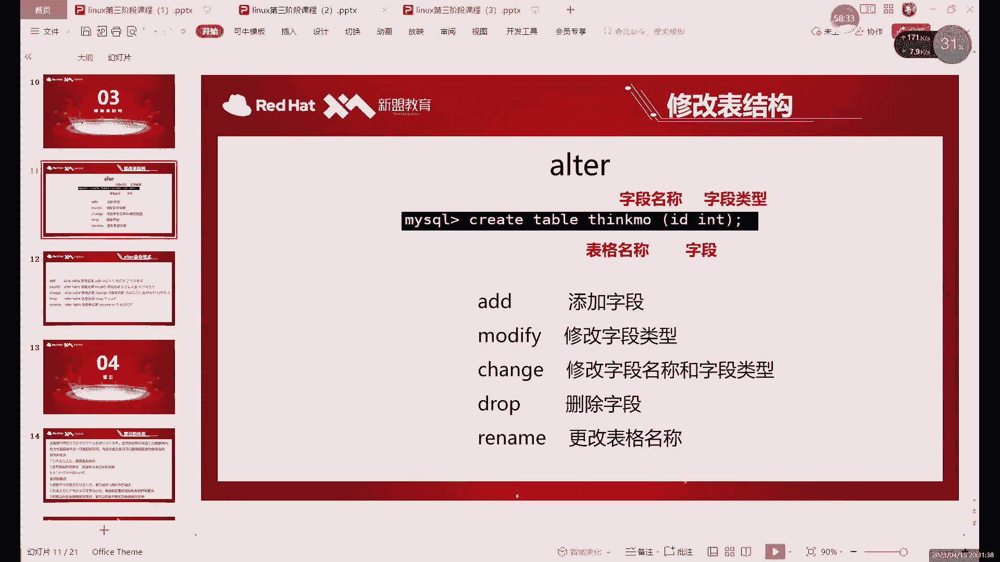

## 修改表结构：ALTER命令详解

ALTER命令用于修改已存在的数据库表结构。需要注意的是，**不建议使用ALTER命令修改数据库（DATABASE）的名称**。因为每个表的完整名称格式为`库名.表名`。修改库名意味着需要修改所有关联表的名字，操作复杂且容易出错。

ALTER命令通常只用于修改表（TABLE）本身，其核心功能是修改表的结构，包括字段名、数据类型、约束条件等，而不是修改表中的数据。

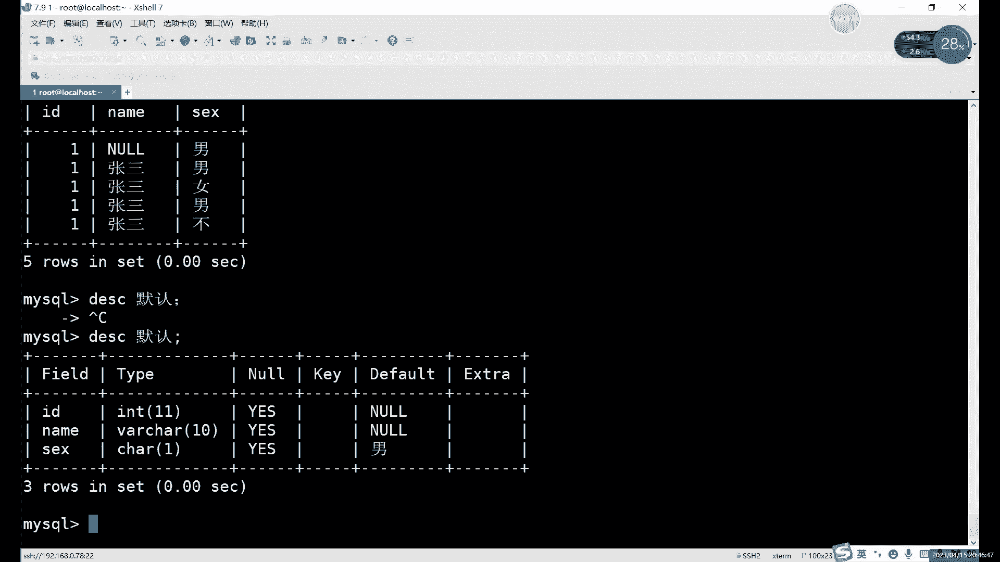

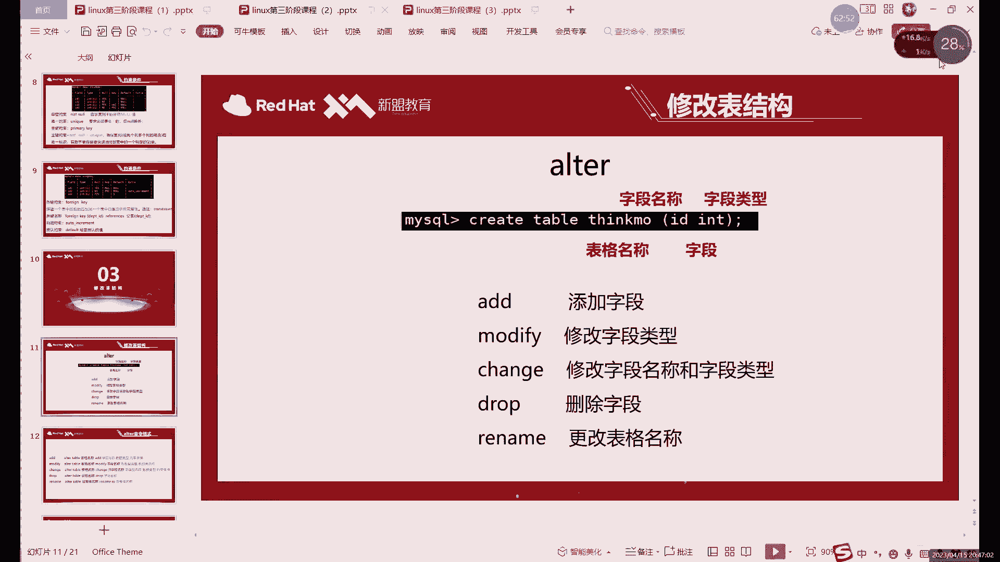

以下是ALTER命令的几种主要用法选项：

*   **`RENAME TO`**：修改表名。
*   **`ADD`**：添加新的字段。
*   **`MODIFY`**：修改现有字段的数据类型或约束。
*   **`CHANGE`**：修改现有字段的名称、数据类型或约束。
*   **`DROP`**：删除现有字段。

### 1. 添加字段 (ADD)

使用`ADD`选项可以在表中新增一列。添加时必须指定字段名和数据类型，约束条件是可选的。

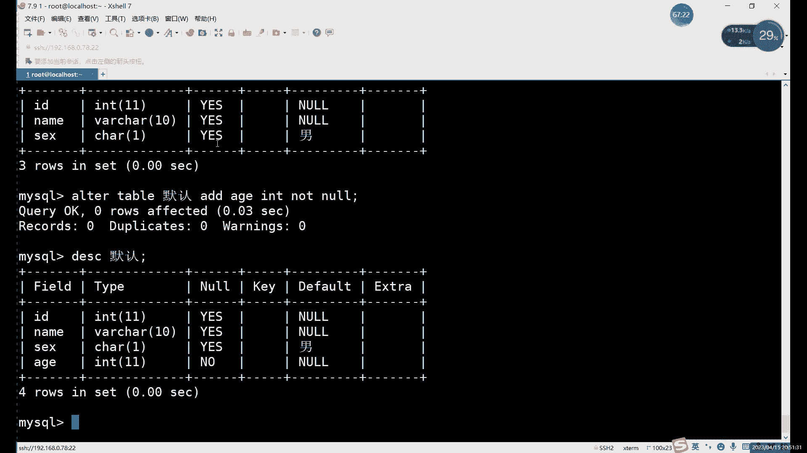

```sql
ALTER TABLE 表名 ADD 字段名 数据类型 [约束];
```

例如，向`users`表添加一个非空的`age`字段：
```sql
ALTER TABLE users ADD age INT NOT NULL;
```

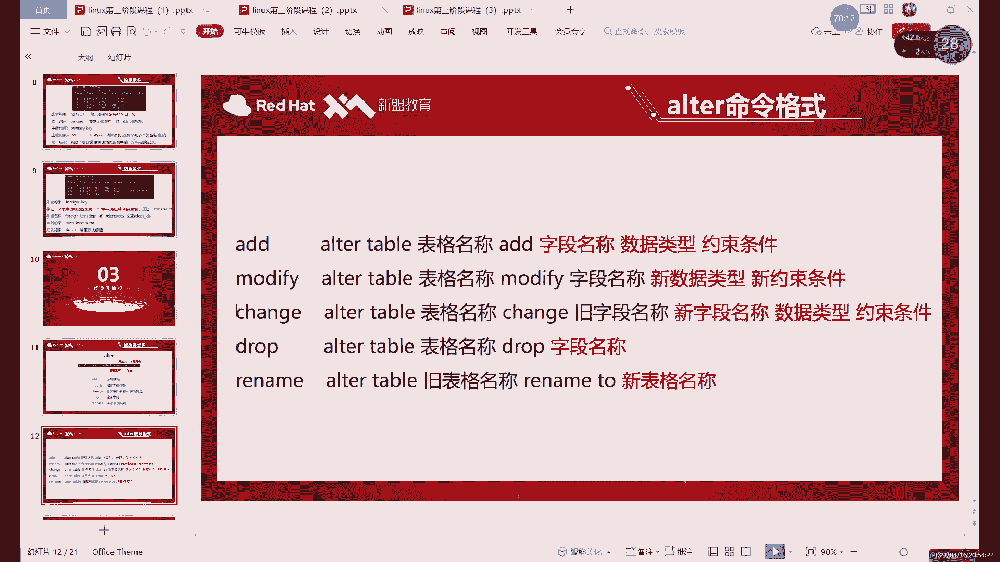

默认情况下，新字段会添加到表的末尾。若需指定位置，可使用`AFTER`或`FIRST`关键字。

```sql
-- 添加到 `sex` 字段之后
ALTER TABLE users ADD birthday DATE AFTER sex;
-- 添加到表的第一列
ALTER TABLE users ADD uid INT FIRST;
```

### 2. 修改字段 (MODIFY / CHANGE)

`MODIFY`和`CHANGE`都用于修改现有字段，区别在于`CHANGE`可以修改字段名，而`MODIFY`不能。

*   **MODIFY**：修改字段的数据类型或约束。
    ```sql
    ALTER TABLE 表名 MODIFY 字段名 新数据类型 [新约束];
    ```
*   **CHANGE**：修改字段名、数据类型或约束。
    ```sql
    ALTER TABLE 表名 CHANGE 旧字段名 新字段名 新数据类型 [新约束];
    ```

**注意**：使用`CHANGE`时，即使不打算修改数据类型或约束，也必须将原有的定义完整写出。

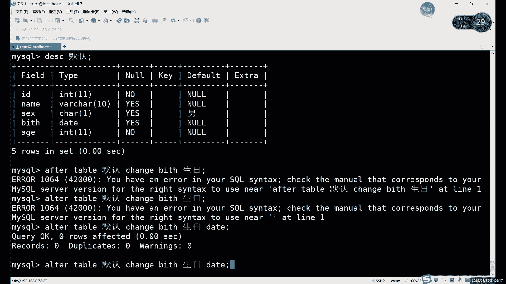

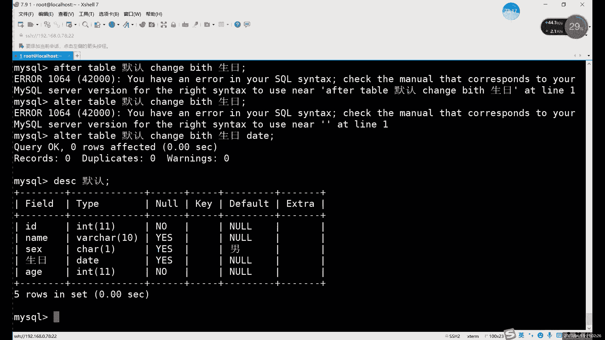

### 3. 删除字段 (DROP) 与 重命名表 (RENAME)

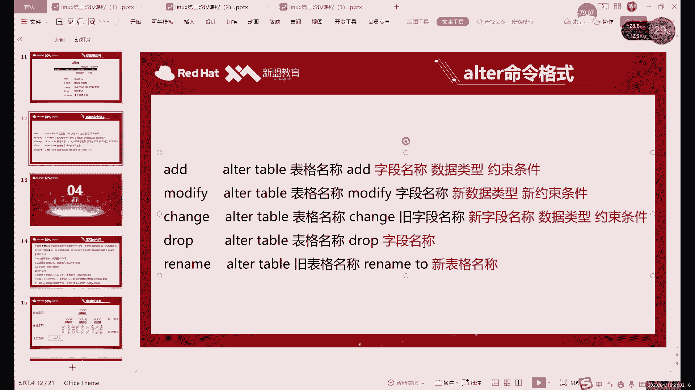

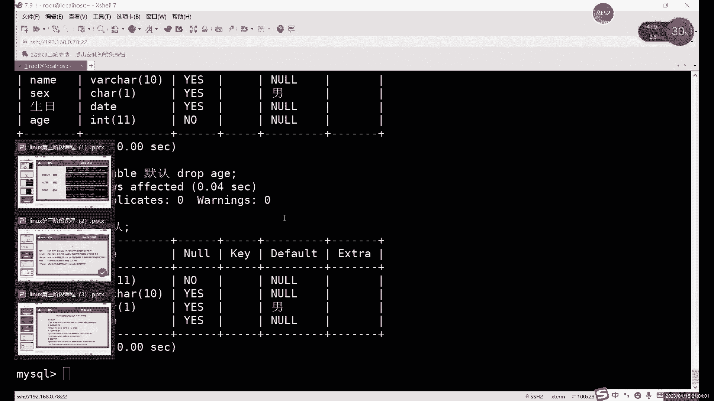

删除字段和重命名表的语法相对简单。

```sql
-- 删除字段
ALTER TABLE 表名 DROP 字段名;
-- 重命名表
ALTER TABLE 表名 RENAME TO 新表名;
```

## 数据库性能加速器：索引 (Index)

在了解了如何修改表结构后，我们引入一个与部分约束紧密相关、并能极大提升数据库性能的概念——**索引**。

索引类似于书籍的目录。如果没有索引，数据库查询数据时需要逐行扫描（“全表扫描”），效率低下。建立索引后，数据库可以像查目录一样快速定位到所需数据，显著提高查询速度。

### 索引与约束的关系

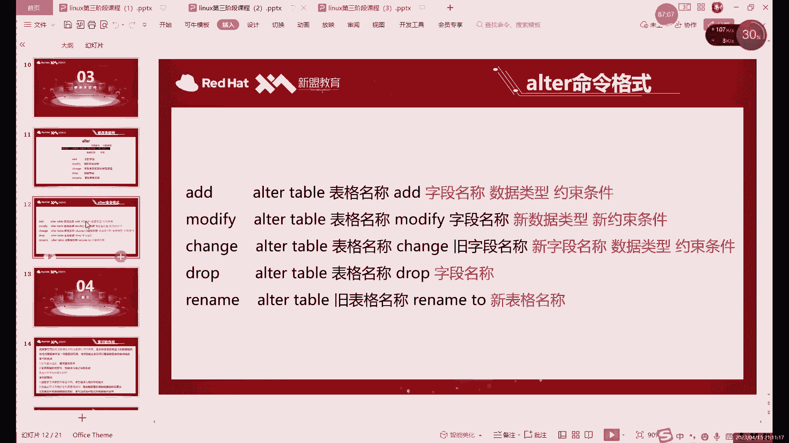

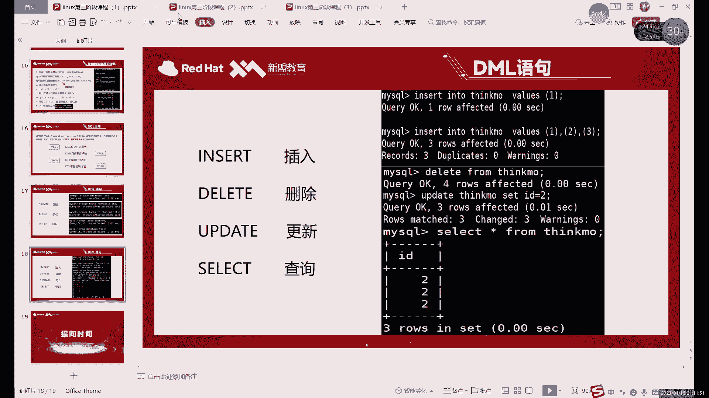

在MySQL中，某些约束在创建时会**自动生成对应的索引**，因为它们通常用于快速查找和确保数据完整性：

1.  **主键约束 (PRIMARY KEY)**：自动创建主键索引，性能最优。
2.  **唯一约束 (UNIQUE)**：自动创建唯一索引。
3.  **外键约束 (FOREIGN KEY)**：自动创建普通索引。

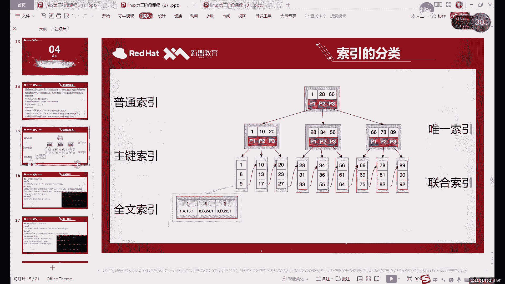

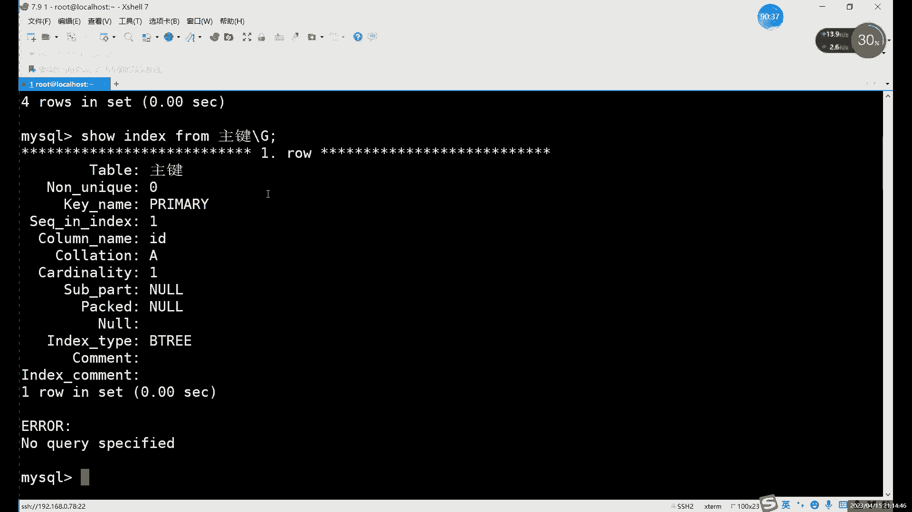

因此，当你为字段设置上述约束时，也就同时为其创建了索引。`DEFAULT`（默认值）和`NOT NULL`（非空）约束则不会创建索引。

### 查看与使用索引

你可以使用以下命令查看表的索引信息：

```sql
SHOW INDEX FROM 表名;
```

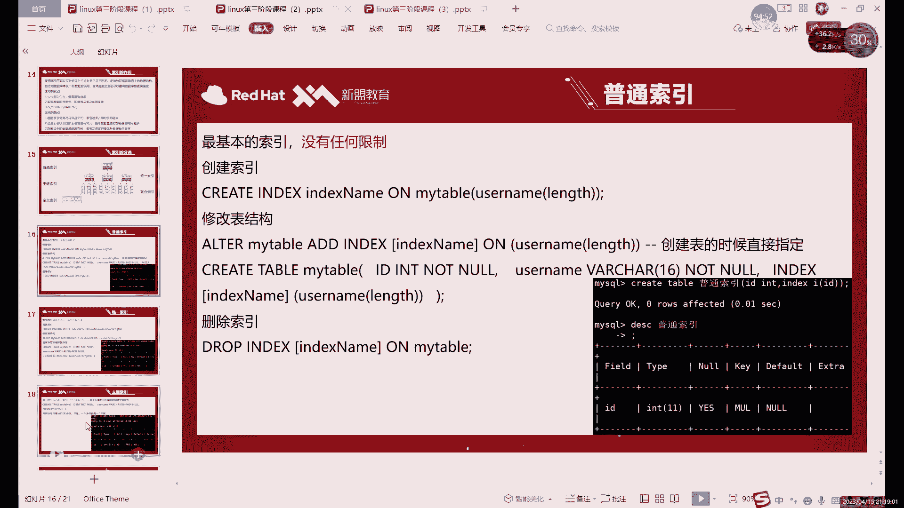

索引主要在数据查询（`SELECT`）、更新（`UPDATE`）和删除（`DELETE`）操作中，通过`WHERE`条件子句发挥作用。使用`EXPLAIN`命令可以分析一条查询语句是否用到了索引。

```sql
EXPLAIN SELECT * FROM 表名 WHERE 条件;
```

在结果中，关注`type`列：
*   `ALL`：表示进行了全表扫描，未使用索引，效率最低。
*   `const`：表示通过主键或唯一索引直接定位到一条记录，效率最高。

### 创建普通索引

对于那些不适合设置为主键或唯一约束，但又经常用于查询的字段，可以手动为其创建**普通索引**以提高查询效率。

创建索引有两种常用方法：

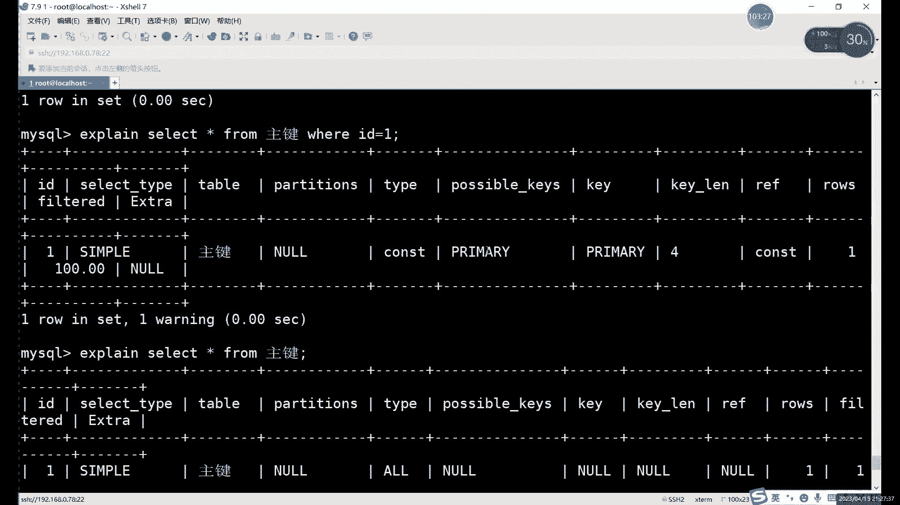

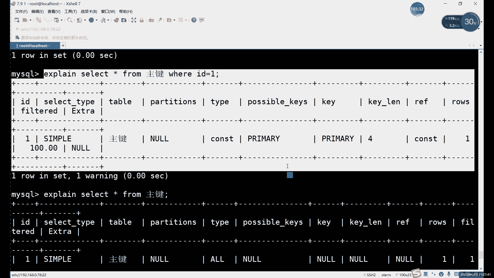

1.  **使用 CREATE INDEX 语句**
    ```sql
    CREATE INDEX 索引名 ON 表名 (字段名);
    ```
2.  **使用 ALTER TABLE 语句**
    ```sql
    ALTER TABLE 表名 ADD INDEX 索引名 (字段名);
    ```

**注意**：索引并非越多越好。索引会占用额外的磁盘空间，并在数据增删改时需要额外维护，可能降低写入速度。创建索引的原则是：**只为最经常出现在查询条件（`WHERE`子句）中的列创建索引**。

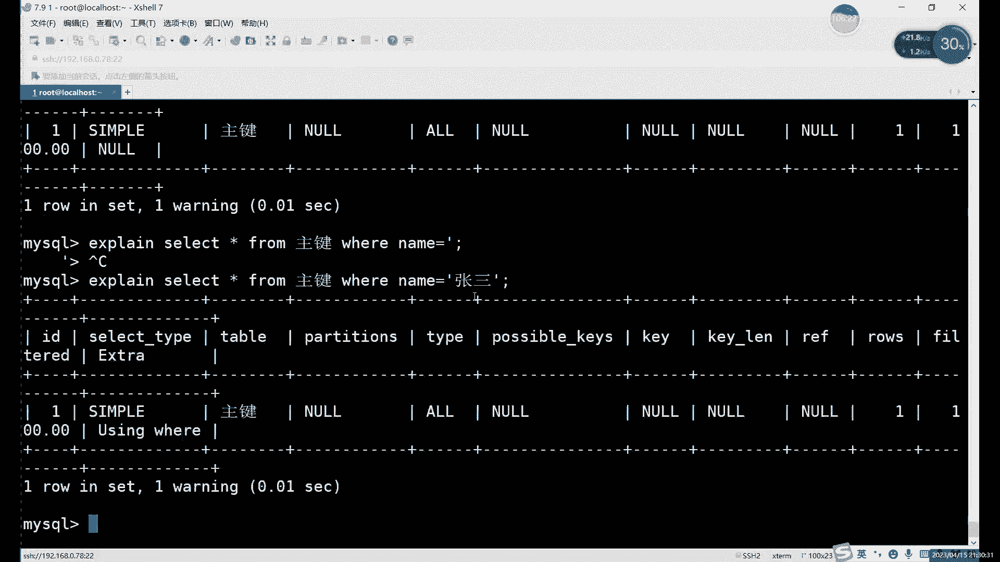

## 总结

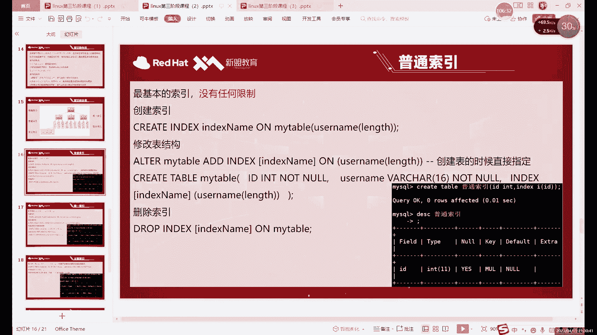

本节课中我们一起学习了：
1.  **ALTER命令**：用于灵活修改表结构，包括添加(`ADD`)、修改(`MODIFY`/`CHANGE`)、删除(`DROP`)字段以及重命名表(`RENAME`)。
2.  **索引 (Index)**：一种用于大幅提升数据库查询效率的“目录”机制。
3.  **索引与约束的关联**：主键、唯一、外键约束会自动创建索引。
4.  **索引的创建与查看**：掌握了为常用查询字段创建普通索引的方法，以及如何使用`SHOW INDEX`和`EXPLAIN`来查看和分析索引。

合理使用ALTER命令可以让你在项目后期灵活调整数据表设计，而正确理解和应用索引则是优化数据库性能、应对海量数据查询的关键。下一节，我们将深入SELECT查询语句的其他高级用法。