# MySQL查询教程：第10章：SELECT单表查询与嵌套查询（上）📚


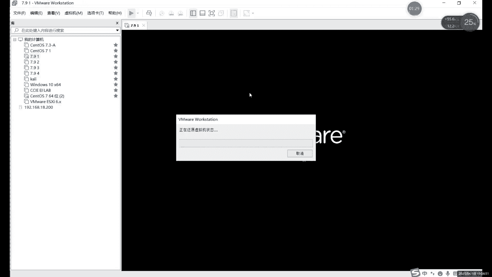


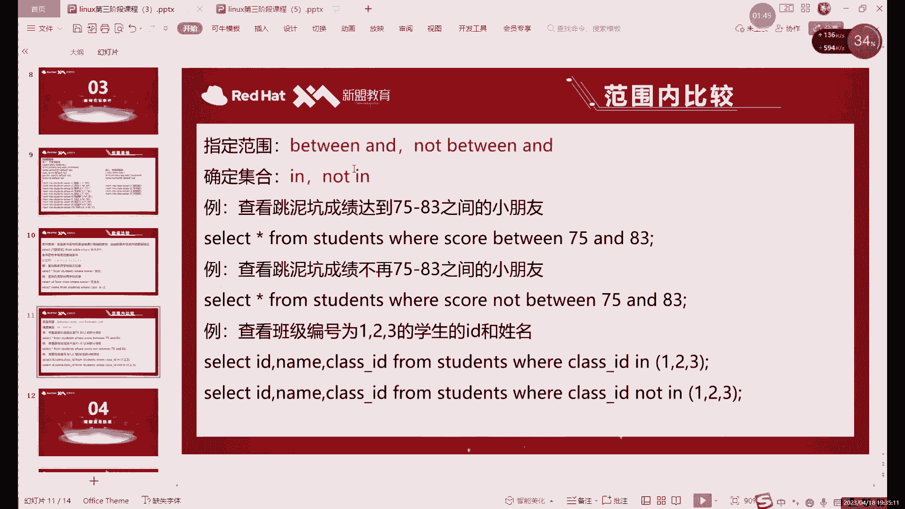

在本节课中，我们将深入学习SELECT查询语句，重点讲解如何使用比较符、范围查询、集合查询、模糊查询、空值判断以及多重条件查询。这些是构建复杂查询的基础。

## 比较符与范围查询 🔍

上一节我们介绍了基本的SELECT语法，本节中我们来看看如何通过条件来筛选数据。首先，我们使用比较符来比较数值或字符。

比较数值时，可以使用 `=`、`!=`、`>`、`<`、`>=`、`<=` 等符号。比较字符时，主要使用等于号 `=` 和不等于号 `!=` 来指定某一列等于某个特定值。

**示例代码：**
```sql
-- 查询成绩等于80的学生
SELECT * FROM students WHERE score = 80;
-- 查询成绩大于60的学生
SELECT * FROM students WHERE score > 60;
```

接下来是范围查询，使用 `BETWEEN ... AND ...` 关键字。它本质上等同于 `>=` 某个值 `AND` `<=` 另一个值，用于选取某个范围内的数据。

**示例代码：**
```sql
-- 查询成绩在60到80之间的学生（包含60和80）
SELECT * FROM students WHERE score BETWEEN 60 AND 80;
```

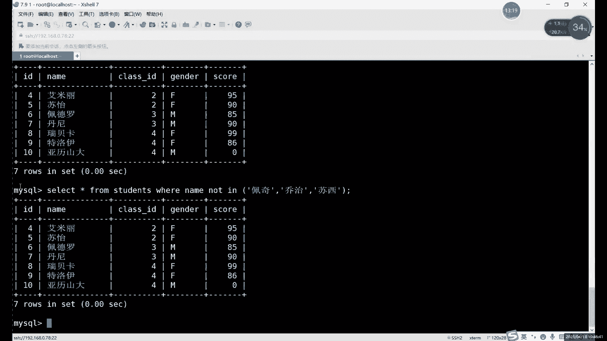

## 集合查询 📊

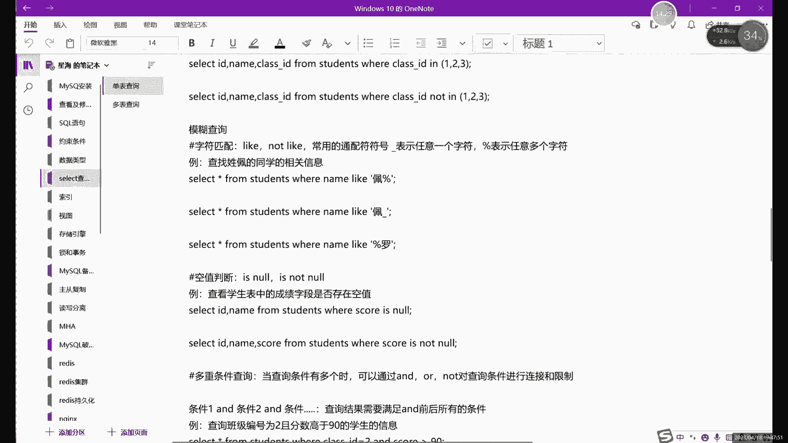

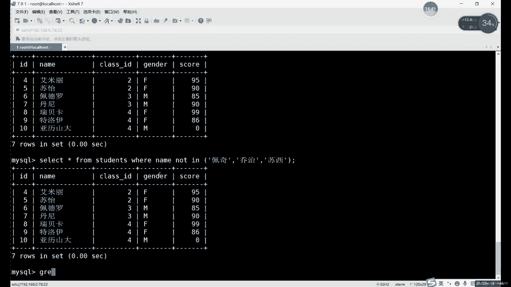

范围查询用于指定一个连续区间，而集合查询则用于指定一组离散的值。集合查询使用 `IN` 关键字。

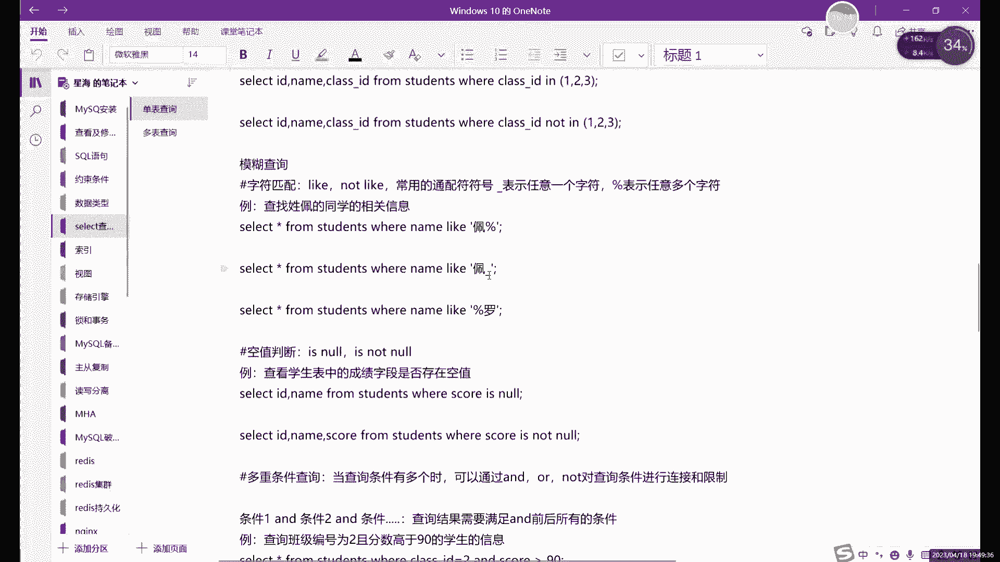

以下是集合查询与范围查询的主要区别：
*   **范围查询 (`BETWEEN AND`)**：指定一个连续的头尾区间，如60到80。
*   **集合查询 (`IN`)**：指定一组具体的值，如60，75，80。

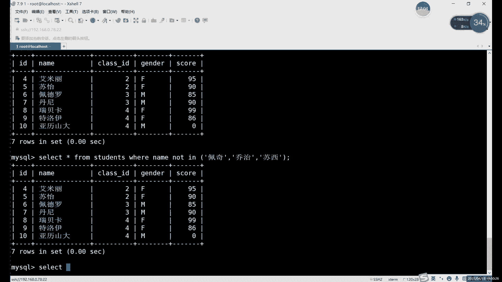

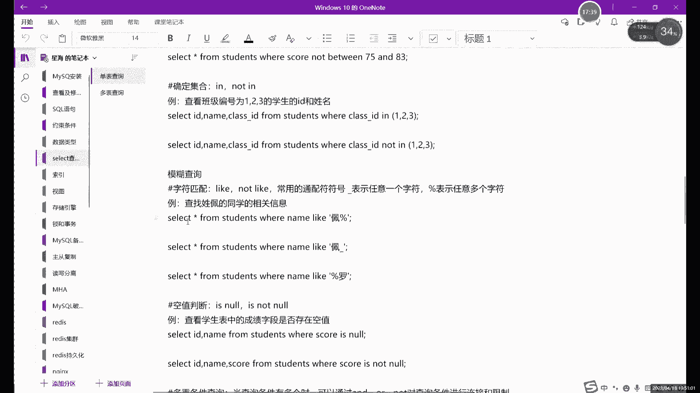

**示例代码：**
```sql
-- 查询成绩为60、75或80的学生
SELECT * FROM students WHERE score IN (60, 75, 80);
-- 查询姓名为‘佩德罗’、‘佩奇’或‘初七’的学生
SELECT * FROM students WHERE name IN (‘佩德罗‘, ’佩奇‘, ’初七‘);
-- 查询性别为‘F’（女）的学生
SELECT * FROM students WHERE gender IN (‘F‘);
```

**重要提示：**
*   查询数值时，`IN` 括号内的值无需引号。
*   查询字符时，`IN` 括号内的每个值**必须**用单引号 `‘’` 或双引号 `“”` 括起来。
*   `IN` 可以看作是多个 `=` 条件的简便写法。
*   可以使用 `NOT IN` 进行取反，查询不在集合中的数据。

## 模糊查询 🔎

当我们不确定要查询的完整字符时，可以使用模糊查询。它使用 `LIKE` 关键字和两个通配符：
*   `%`：代表零个、一个或多个任意字符。
*   `_`：代表一个任意字符。

**示例代码：**
```sql
-- 查询名字以‘佩’开头的学生（如佩奇、佩德罗）
SELECT * FROM students WHERE name LIKE ‘佩%‘;
-- 查询名字为‘佩_罗’格式的学生（‘_’代表一个字，如佩德罗）
SELECT * FROM students WHERE name LIKE ‘佩_罗‘;
-- 查询成绩以‘8’开头的学生（注意：数值字段也需要加引号）
SELECT * FROM students WHERE score LIKE ‘8%‘;
```

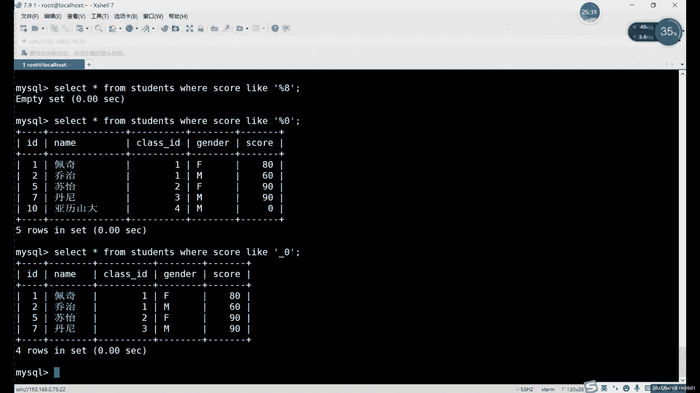

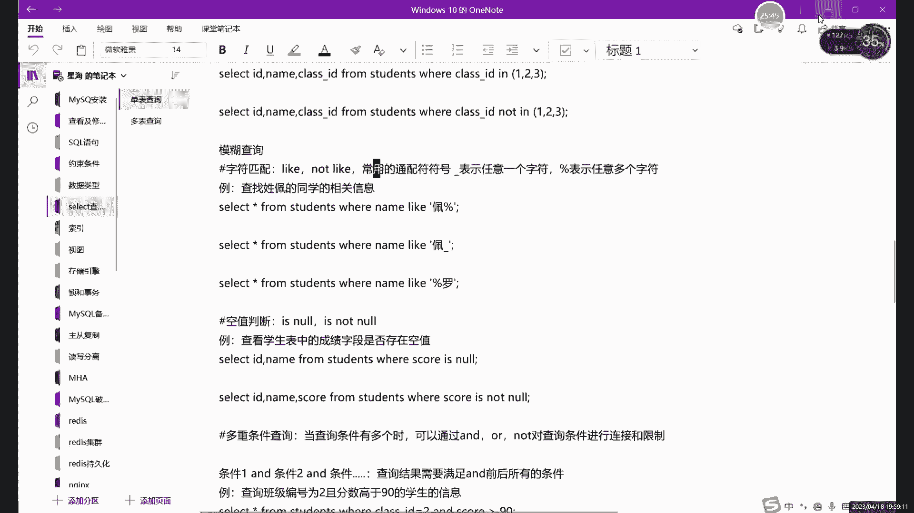

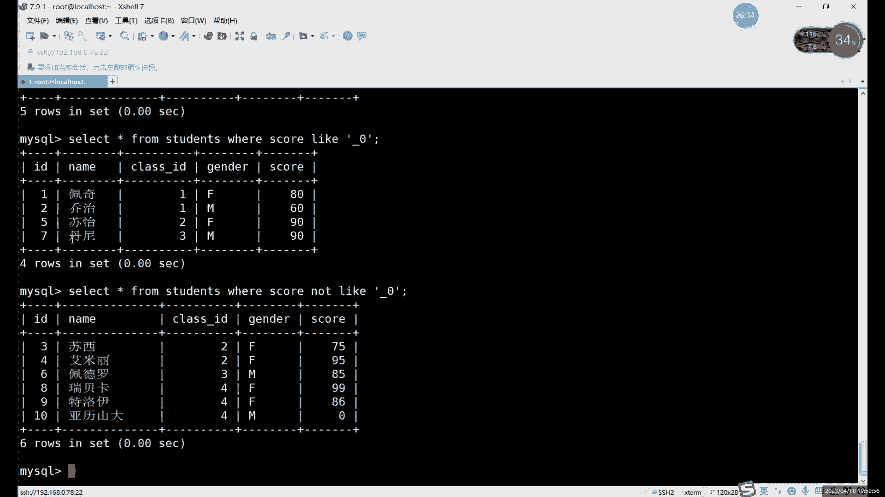

**重要提示：**
*   模糊查询必须使用 `LIKE` 关键字，不能直接用 `=`。
*   即使是对数值字段进行模糊查询，模式字符串也需要加引号。
*   可以使用 `NOT LIKE` 进行取反。
*   `LIKE` 也可用于 `SHOW` 等命令，例如查看包含“password”关键词的系统变量：`SHOW VARIABLES LIKE ‘%password%‘;`

## 空值判断 ⚠️

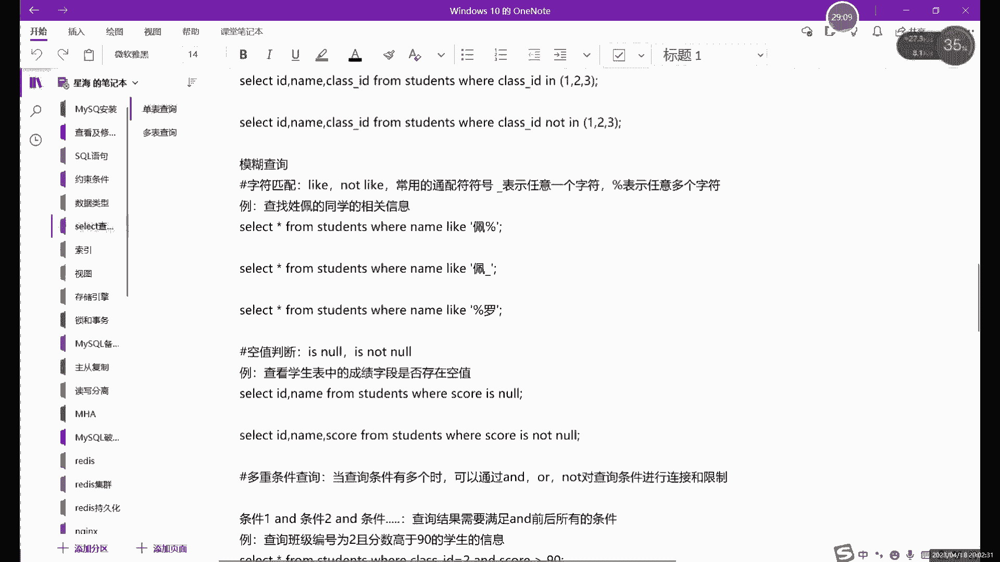

在数据库中，空值（NULL）表示该字段没有数据。判断空值不能使用 `=`，而需使用 `IS NULL` 或 `IS NOT NULL`。

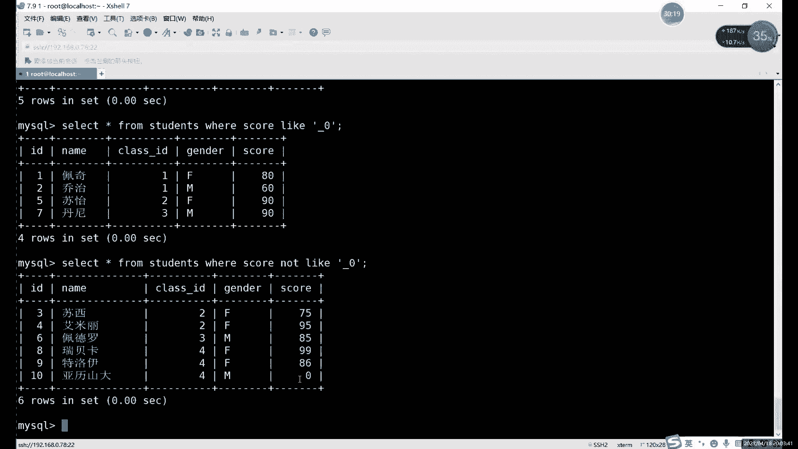

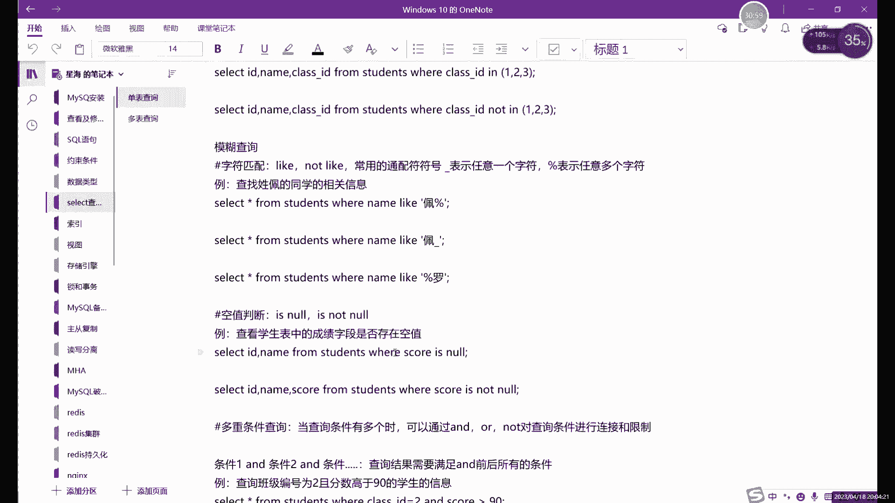

**示例代码：**
```sql
-- 查询成绩为NULL（空）的学生
SELECT * FROM students WHERE score IS NULL;
-- 查询成绩不为空的学生
SELECT * FROM students WHERE score IS NOT NULL;
```

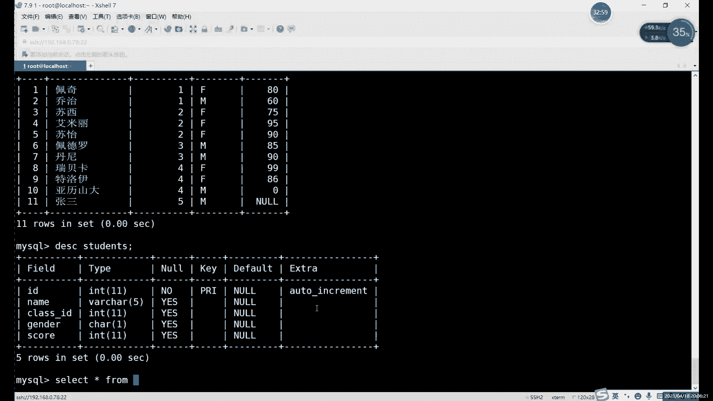

**重要提示：**
*   空值 `NULL` 与数值 `0` 或空字符串 `‘’` 是不同的概念。
*   取反时，`NOT` 放在 `IS` 之后，即 `IS NOT NULL`。

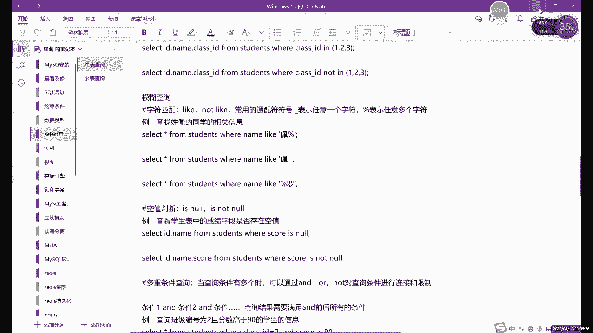

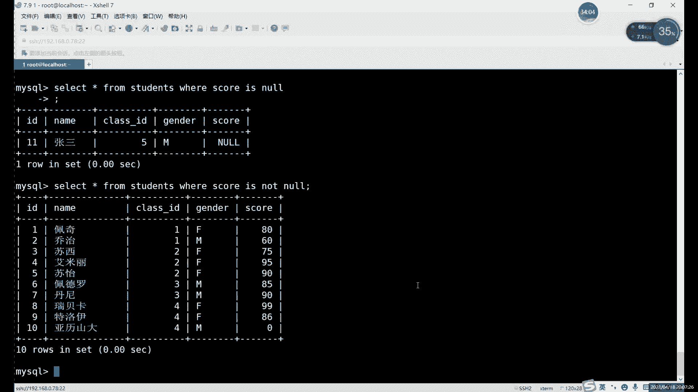

## 多重条件查询 ⛓️

当我们需要同时满足多个条件，或者满足多个条件之一时，就需要用到多重条件查询。这通过逻辑运算符 `AND` 和 `OR` 来实现。

以下是 `AND` 和 `OR` 的核心区别：
*   **`AND`**：表示“并且”，连接的条件必须**同时**满足。它取的是各条件的**交集**，结果通常更精确。
*   **`OR`**：表示“或者”，连接的条件只要满足**其中之一**即可。它取的是各条件的**并集**，结果范围通常更广。

**示例代码：**
```sql
-- 查询班级ID为1 ‘并且’ 成绩大于等于80的学生（AND，交集）
SELECT * FROM students WHERE class_id = 1 AND score >= 80;
-- 查询班级ID为1 ‘或者’ 成绩大于等于80的学生（OR，并集）
SELECT * FROM students WHERE class_id = 1 OR score >= 80;
```

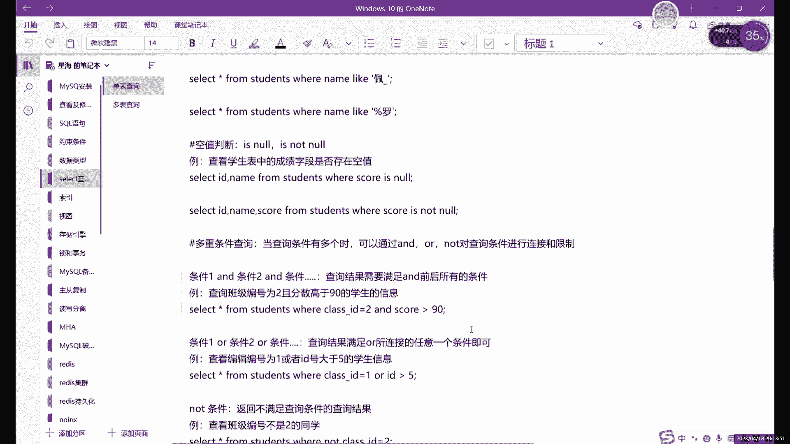

**重要提示：**
*   可以连接多个条件，但条件过多可能导致查询不到数据或效率降低。
*   对于同一字段的多个“或”条件，通常用 `IN` 更简洁。例如 `class_id = 1 OR class_id = 2` 等价于 `class_id IN (1, 2)`。

---

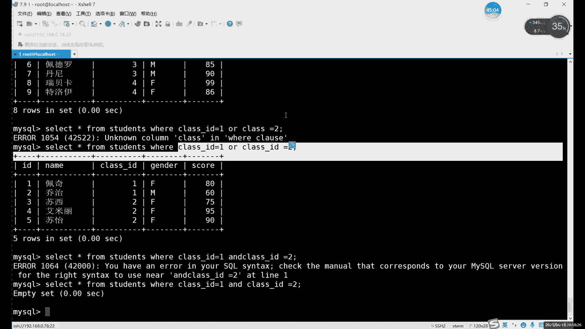

本节课中我们一起学习了SELECT单表查询的多种条件筛选方法：比较符、范围查询(`BETWEEN AND`)、集合查询(`IN`)、模糊查询(`LIKE`)、空值判断(`IS NULL`)以及多重条件组合(`AND`/`OR`)。掌握这些是编写有效查询语句的基石。下一节我们将继续探讨更复杂的查询结构。