# SQL查询基础：P74：SELECT单表查询与嵌套查询（下）

在本节课中，我们将深入学习SELECT单表查询的完整语法结构，并重点探讨嵌套查询的两种核心用法。通过本节课，你将能够构建更复杂、更灵活的查询语句来处理数据。

## 概述：SELECT语句的完整结构

上一节我们介绍了SELECT查询的基本组成部分。本节中，我们来看看一个完整的SELECT单表查询语句的各个部分及其执行顺序。

一个标准的SELECT单表查询语句结构如下：
```sql
SELECT [字段列表/聚合函数]
FROM [表名]
[WHERE 条件]
[GROUP BY 分组字段]
[ORDER BY 排序字段]
[LIMIT 限制数量]
[HAVING 分组后条件];
```

以下是各部分功能的详细解释：

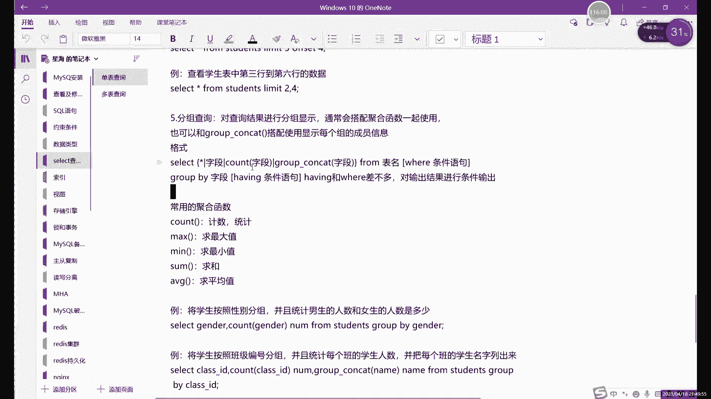

*   **SELECT**： 指定要查询的字段。可以使用星号`*`代表所有字段，也可以列出具体字段名，多个字段用逗号隔开。
*   **FROM**： 指定数据来源的表。在单表查询中只有一个表名。
*   **WHERE**： 对数据进行第一次筛选，限制查询范围。此部分不是必须的。
*   **GROUP BY**： 对查询结果进行分组。常与聚合函数（如`COUNT()`, `SUM()`）一起使用。
*   **ORDER BY**： 对查询结果进行排序。
*   **LIMIT**： 限制返回的记录数量，常用于分页。
*   **HAVING**： 对**分组后**的结果进行第二次筛选。其作用与`WHERE`类似，但生效阶段不同。

## 关键部分详解与对比

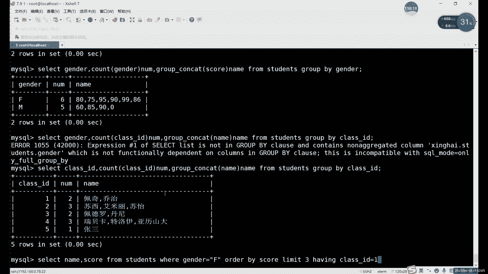

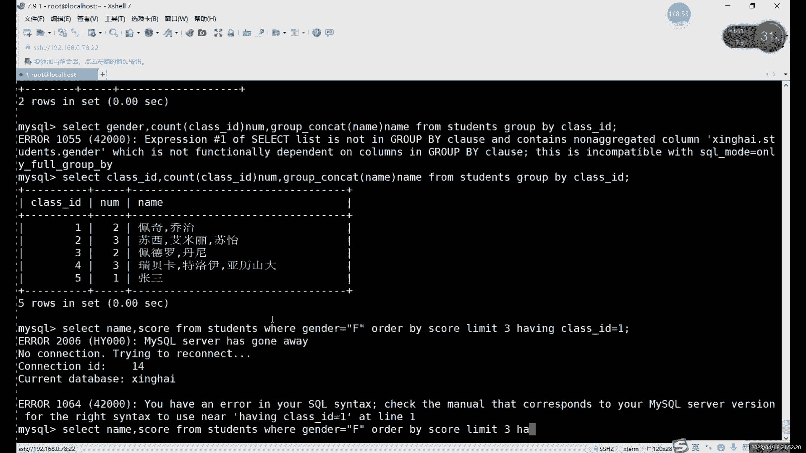

理解了整体结构后，我们来深入看看几个关键部分及其相互关系。


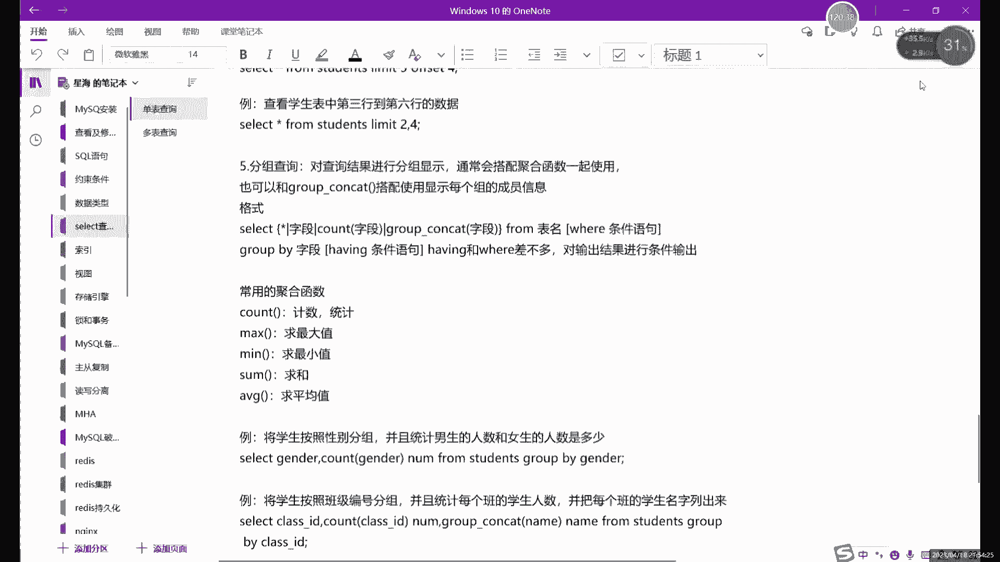

### WHERE 与 HAVING 的区别

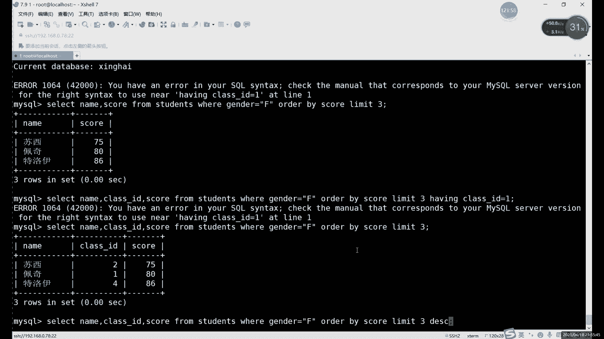

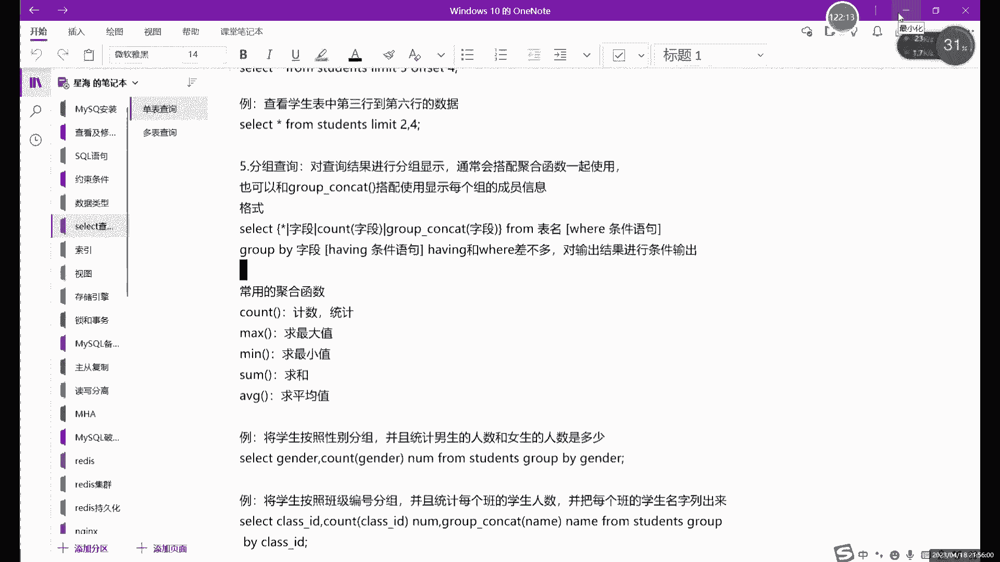

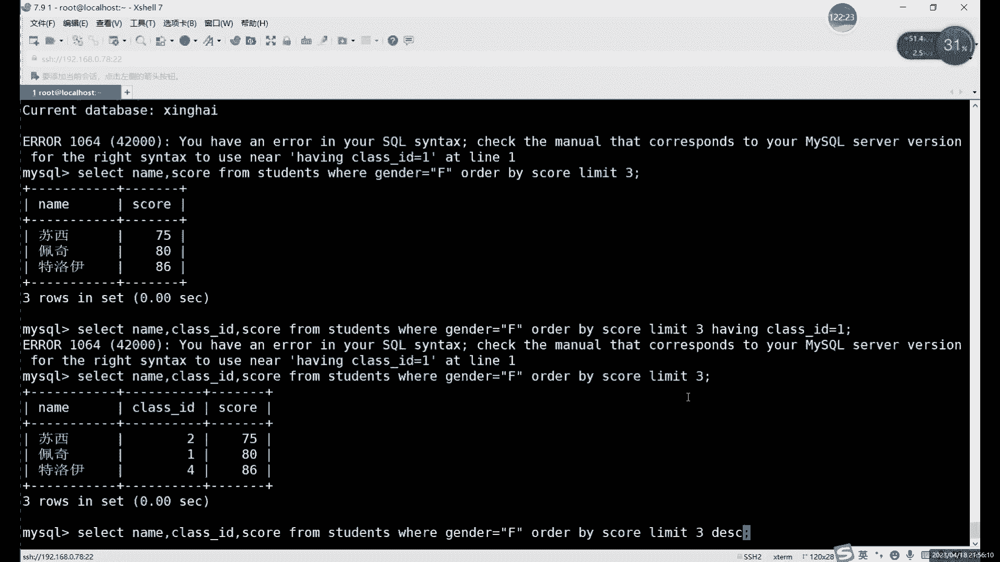

`WHERE`和`HAVING`都是条件筛选语句，但它们的**生效时机**不同，这是理解它们的关键。

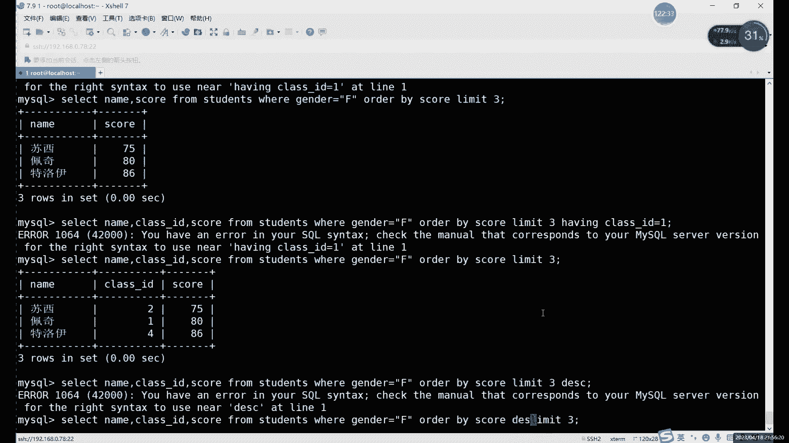

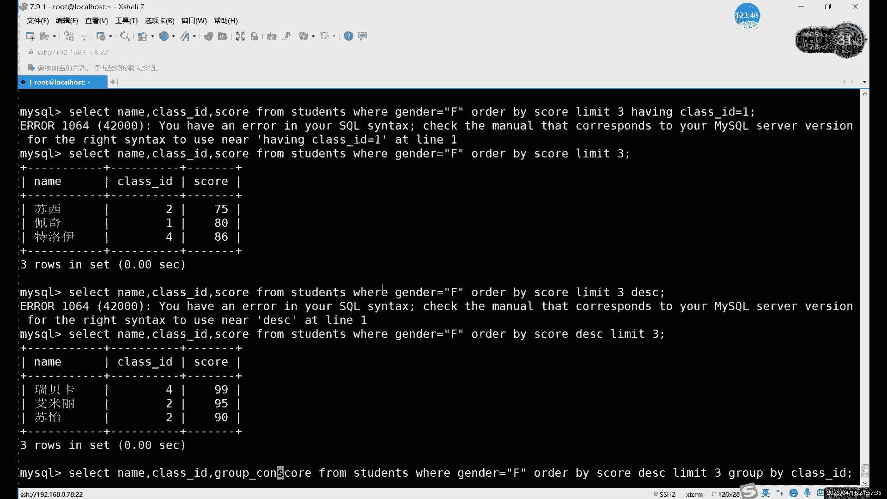

*   **WHERE**： 在数据**分组（GROUP BY）和排序（ORDER BY）之前**进行筛选。它作用于原始的每一条记录。
*   **HAVING**： 在数据**分组（GROUP BY）之后**进行筛选。它作用于分组后的结果集。

例如，假设我们有一个学生表`students`，想找出平均分超过80分的班级：
```sql
-- WHERE 无法在这里使用，因为“平均分”是分组后才计算出的概念
SELECT class_id, AVG(score) as avg_score
FROM students
GROUP BY class_id
HAVING avg_score > 80; -- 对分组后的结果进行筛选
```

而如果我们想先筛选出所有女生，再计算各班的平均分，则使用`WHERE`：
```sql
SELECT class_id, AVG(score) as avg_score
FROM students
WHERE gender = ‘女‘ -- 先筛选出女生记录
GROUP BY class_id;
```

### 聚合函数的应用场景

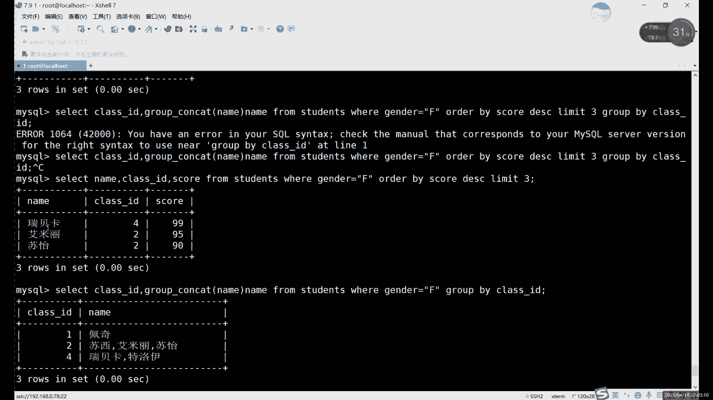

聚合函数（如`COUNT()`, `SUM()`, `AVG()`）用于对一组值执行计算并返回单个值。

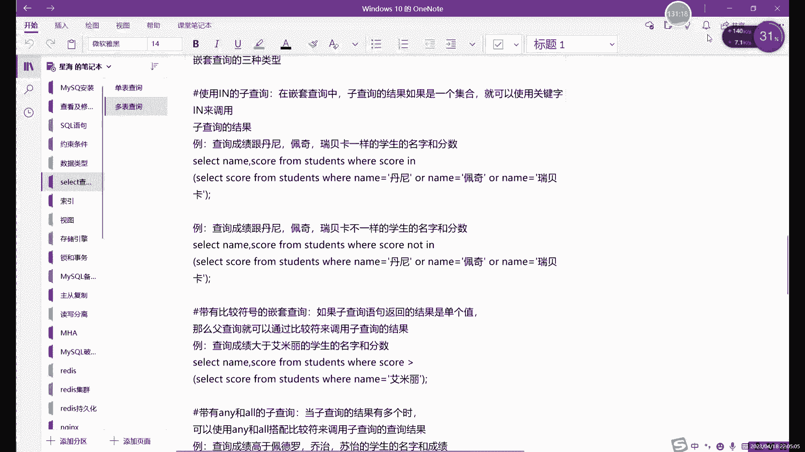

*   `COUNT(字段)`： 计算该字段非空值的数量。`COUNT(*)`计算所有行数。
*   聚合函数通常与`GROUP BY`子句联用，用于统计每个分组的数据。
*   `GROUP_CONCAT(字段)`： 这是一个特殊的函数，它**必须**与`GROUP BY`一起使用，用于将同一个分组中指定字段的值连接成一个字符串。

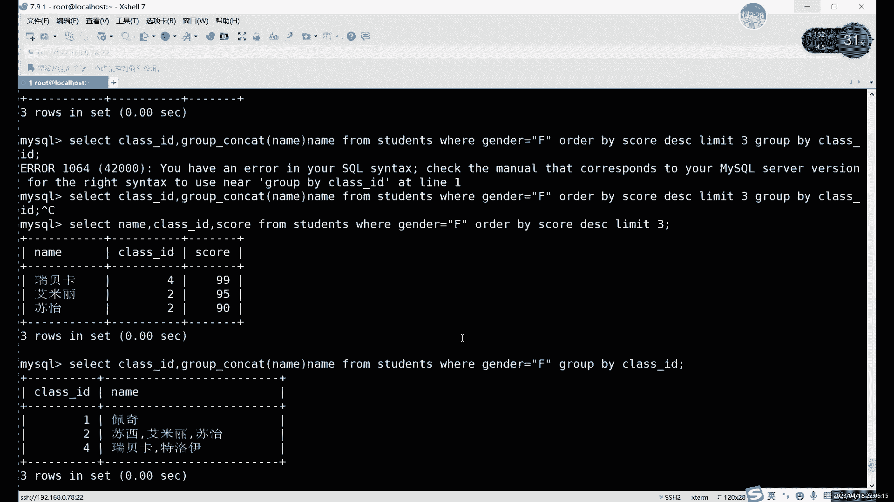

例如，查询每个班级的学生姓名列表：
```sql
SELECT class_id, GROUP_CONCAT(name)
FROM students
GROUP BY class_id;
```

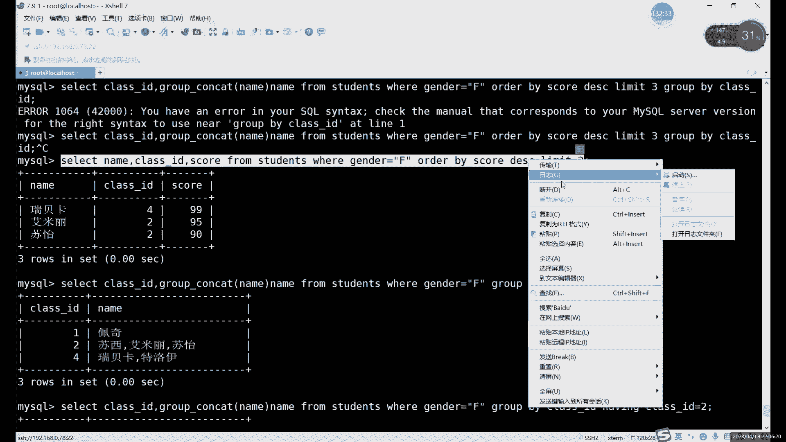

## 嵌套查询：当一条语句不够用时

有时，一个查询需求无法通过单条SELECT语句完成。例如，我们不知道某些条件的具体值，需要先通过一个查询得到这些值，再用它们进行主查询。这时就需要用到**嵌套查询**。

嵌套查询的核心思想是：**将一个SELECT语句（子查询）的结果，作为另一个SELECT语句（主查询）的一部分来使用**。这类似于Linux中的管道符概念。

嵌套查询主要有两种使用位置：

### 1. 子查询作为条件（用在WHERE或HAVING中）

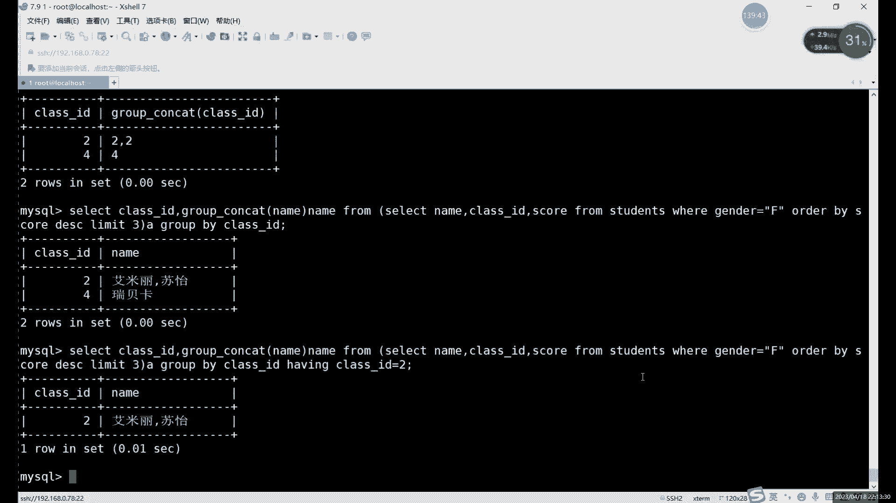

这是最常见的嵌套形式。子查询的结果作为一个集合或单个值，用于主查询的条件判断。

**示例1：查询与特定学生成绩相同的其他学生**
题目：找出与“佩奇”、“瑞贝卡”成绩相同的学生姓名和分数。
分析：我们不知道这两位同学的具体分数，需要先查出来。
```sql
SELECT name, score
FROM students
WHERE score IN ( -- 主查询：分数在某个集合内
    SELECT score -- 子查询：先查出“佩奇”和“瑞贝卡”的成绩
    FROM students
    WHERE name IN (‘佩奇‘, ‘瑞贝卡‘)
);
```
**关键点**：用作`IN`条件的子查询，其`SELECT`后面通常只跟**一个字段**，这样结果才能形成一个明确的集合。

**示例2：使用ANY和ALL进行比较**
当子查询返回多个结果，并且主查询需要与之进行大小比较（>， <， >=， <=）时，使用`ANY`或`ALL`。
*   `> ALL(子查询)`： 大于子查询结果中的**最大值**。
*   `> ANY(子查询)`： 大于子查询结果中的**最小值**（即至少大于一个）。
*   `< ALL(子查询)`： 小于子查询结果中的**最小值**。
*   `< ANY(子查询)`： 小于子查询结果中的**最大值**。

记忆口诀：`ALL`对应极值（最大或最小），`ANY`则相反。

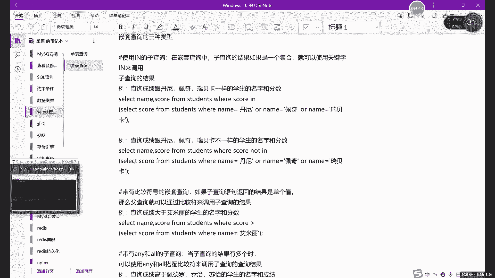

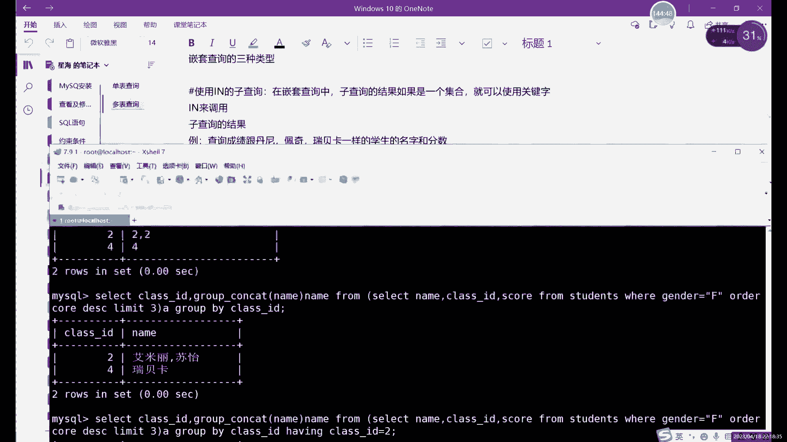

### 2. 子查询作为数据源（用在FROM中）

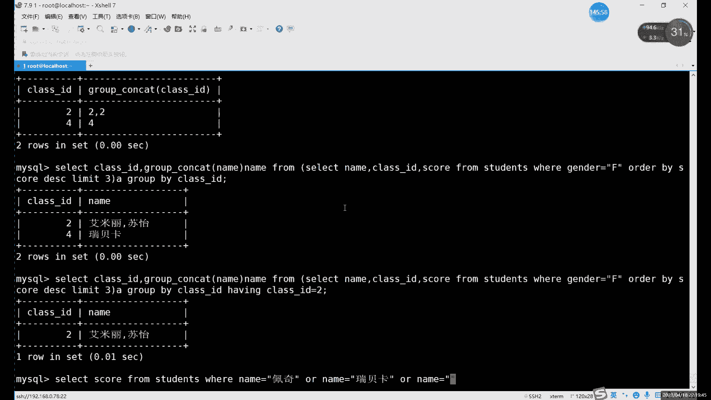

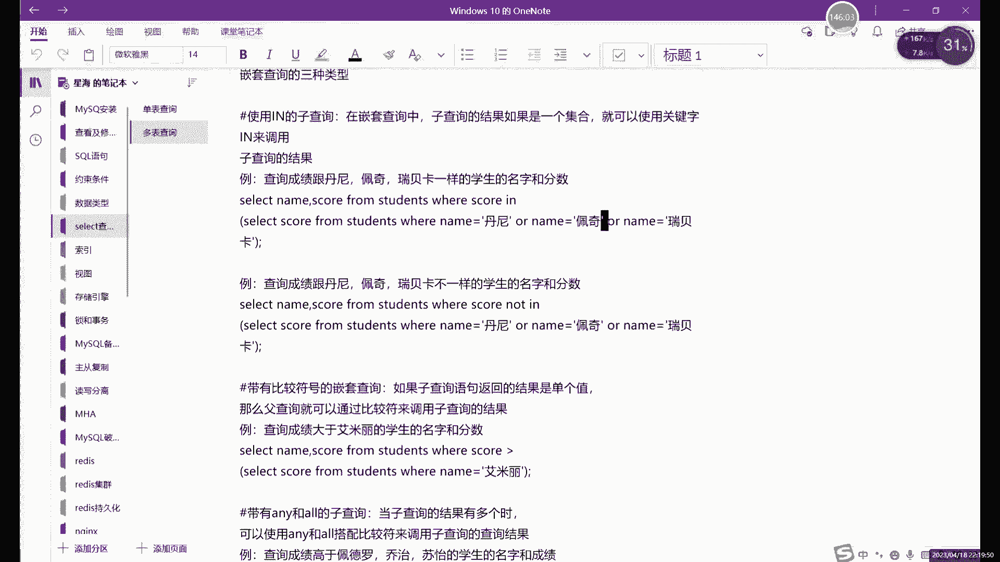

这种用法将子查询的结果视为一张**临时表**，主查询再从这张临时表中进行查询。

**示例：对复杂查询结果进行二次处理**
假设我们已有一个复杂查询A，得到了一个结果集。现在我们想对这个结果集再进行分组统计。
```sql
SELECT class_id, GROUP_CONCAT(name)
FROM (
    -- 这是一个子查询，它产生了一张临时表
    SELECT name, class_id, score
    FROM students
    WHERE gender = ‘女‘
    ORDER BY score DESC
    LIMIT 5
) AS temp_table -- 必须为子查询结果起一个别名
GROUP BY class_id;
```
**关键点**：当子查询用在`FROM`后面时，**必须为其结果集赋予一个别名**（如`AS temp_table`），以便主查询能够引用它。

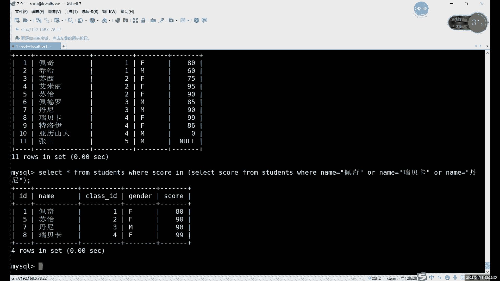

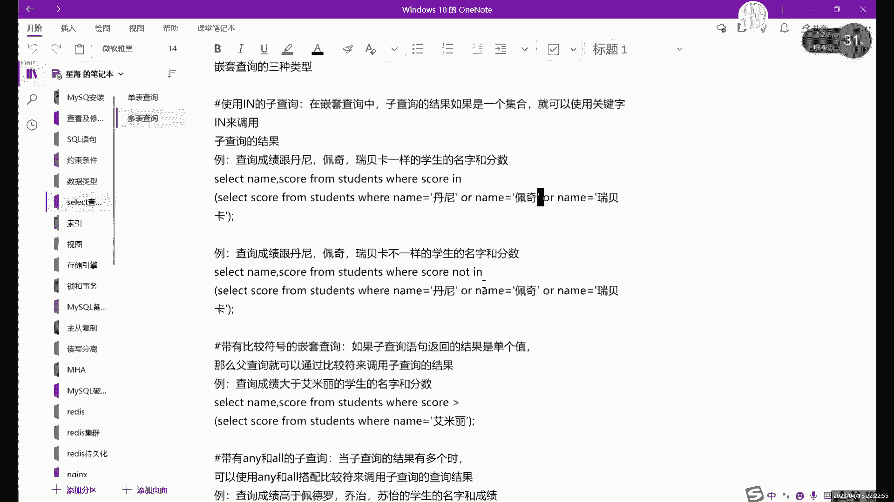

### 3. 使用EXISTS进行存在性判断

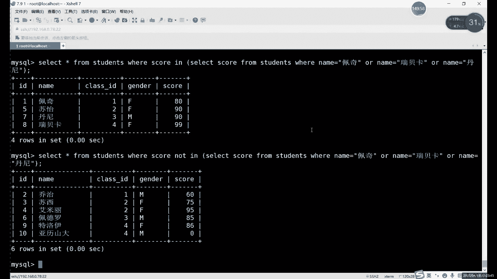

`EXISTS`用于判断子查询是否返回了结果。如果子查询有结果，则主查询执行；如果子查询结果为空，则主查询不返回结果。
```sql
SELECT *
FROM classes c
WHERE EXISTS (
    SELECT 1
    FROM students s
    WHERE s.class_id = c.id AND s.score > 90
);
```
这条语句的意思是：查询存在学生分数大于90分的班级信息。`EXISTS`更关注子查询是否有结果，而不关心结果具体是什么。

## 综合示例与编写技巧

让我们看一个综合性的例子，它融合了多个子句和嵌套查询：
```sql
-- 查询女生中成绩前三名的学生，并按班级分组显示学生名单
SELECT class_id, GROUP_CONCAT(name) as members
FROM (
    SELECT name, class_id, score
    FROM students
    WHERE gender = ‘女‘
    ORDER BY score DESC
    LIMIT 3
) AS top3_students
GROUP BY class_id
HAVING COUNT(*) > 0; -- 此处HAVING用于演示，实际可省略
```

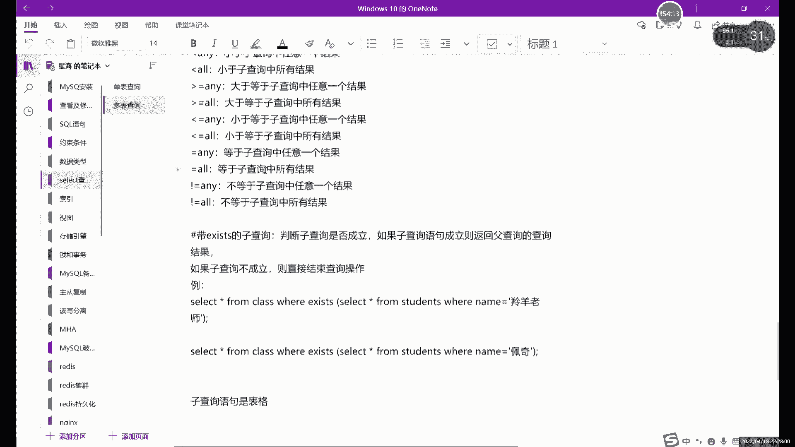

**编写嵌套查询的技巧**：
1.  **由内向外写**：先集中精力写出能正确返回所需数据的子查询。
2.  **单独测试子查询**：确保子查询本身运行正确，结果符合预期。
3.  **再构建主查询**：将测试好的子查询嵌入到主查询的相应位置（`WHERE`、`FROM`等）。
4.  **使用别名**：当子查询作为表时，务必使用别名。
5.  **理解数据流**：明确每一步操作后，数据的形式发生了什么变化。

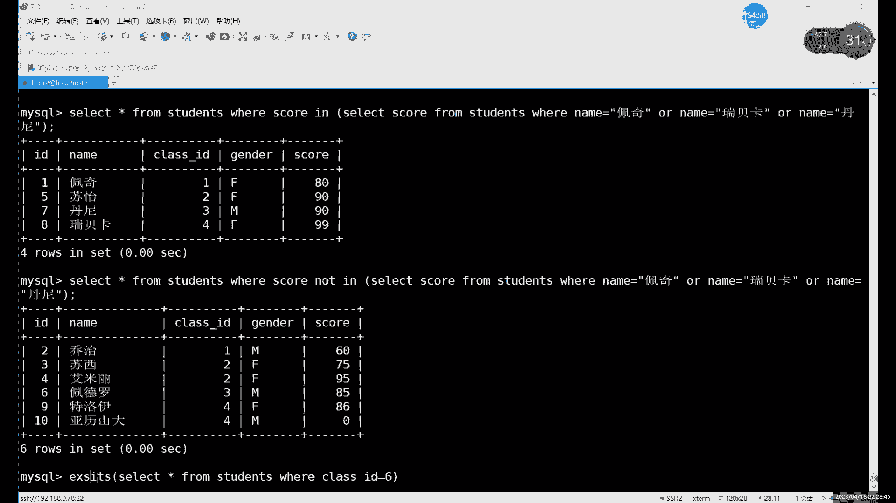

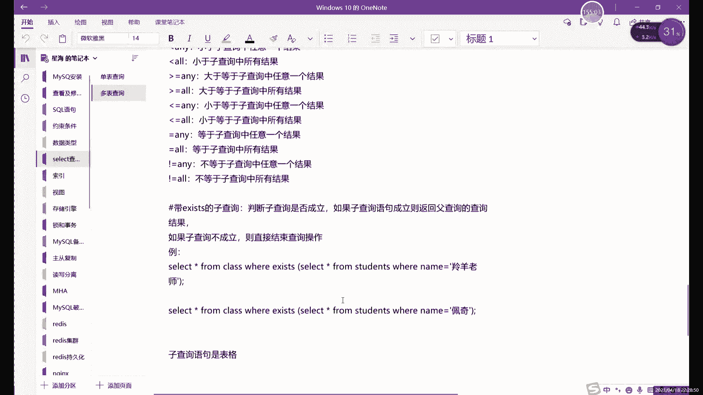

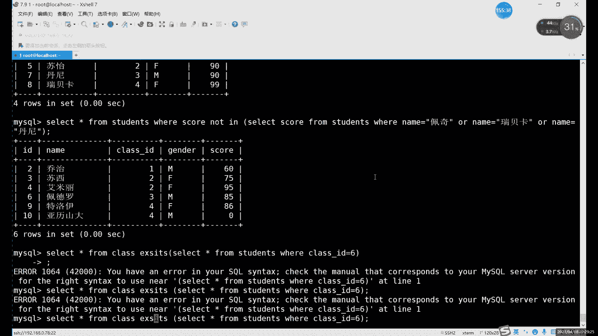

## 总结

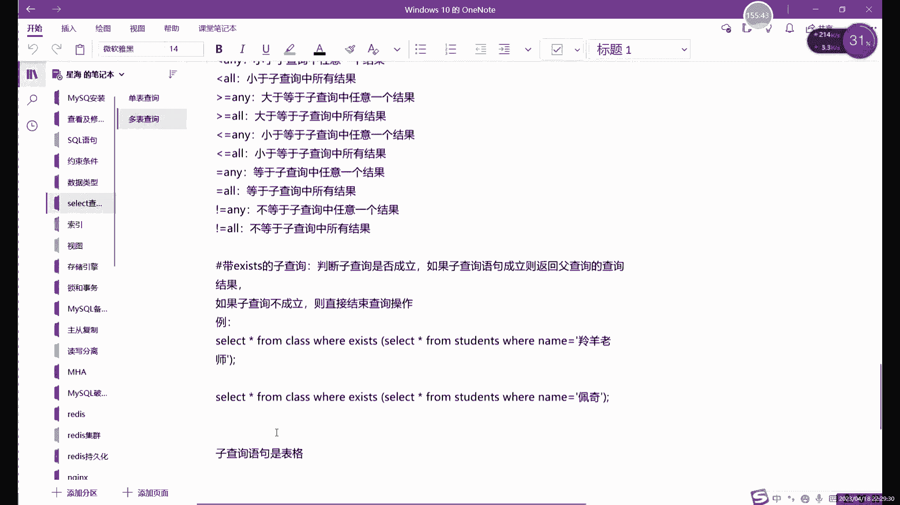

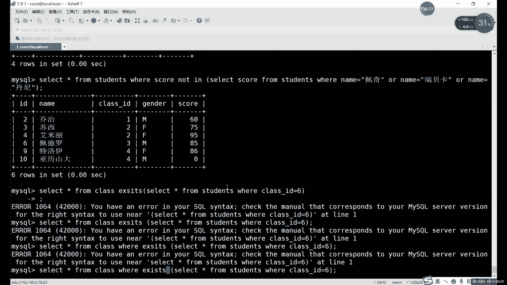

本节课中我们一起深入学习了SELECT单表查询的完整语法和强大的嵌套查询。

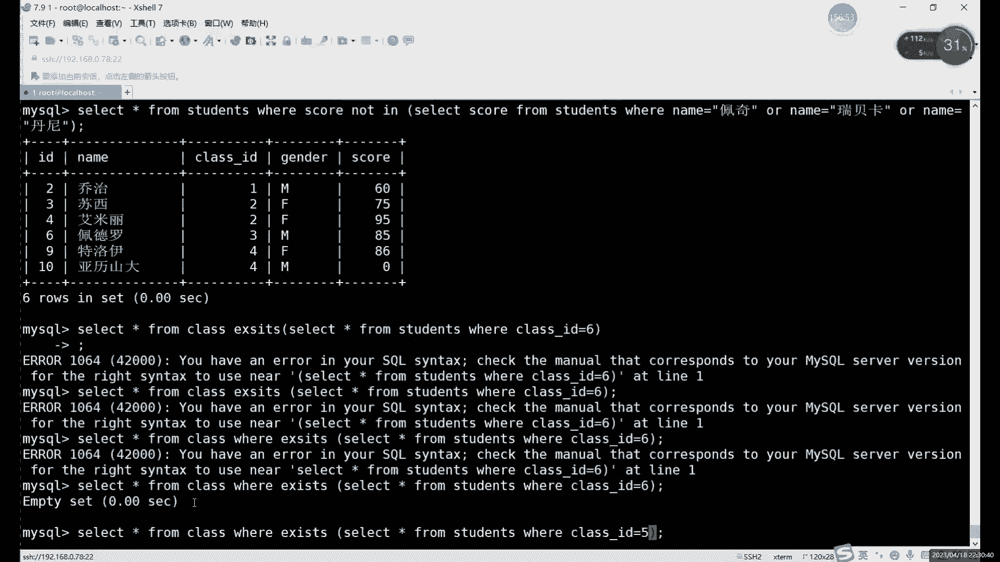

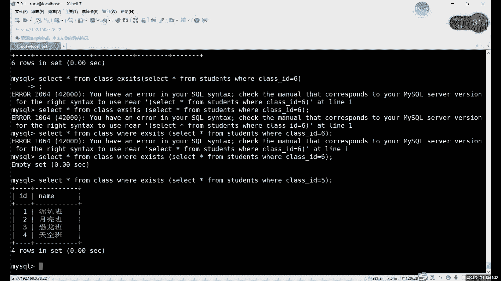

我们首先回顾了SELECT语句从`SELECT`、`FROM`到`WHERE`、`GROUP BY`、`HAVING`、`ORDER BY`、`LIMIT`的完整结构和执行顺序。重点辨析了`WHERE`（分组前筛选）和`HAVING`（分组后筛选）的根本区别。

随后，我们攻克了嵌套查询这一核心难点。掌握了两种主要嵌套方式：
1.  **子查询作为条件**：用于`WHERE`或`HAVING`中，使用`IN`、`ANY`、`ALL`、`EXISTS`等操作符与主查询关联。
2.  **子查询作为数据源**：用于`FROM`中，必须为其指定别名，主查询将其视为一张临时表进行再查询。

嵌套查询打破了单条语句的局限，通过将查询任务分层，极大地增强了SQL解决复杂数据检索问题的能力。理解并掌握它，是进行高效数据库操作的关键一步。

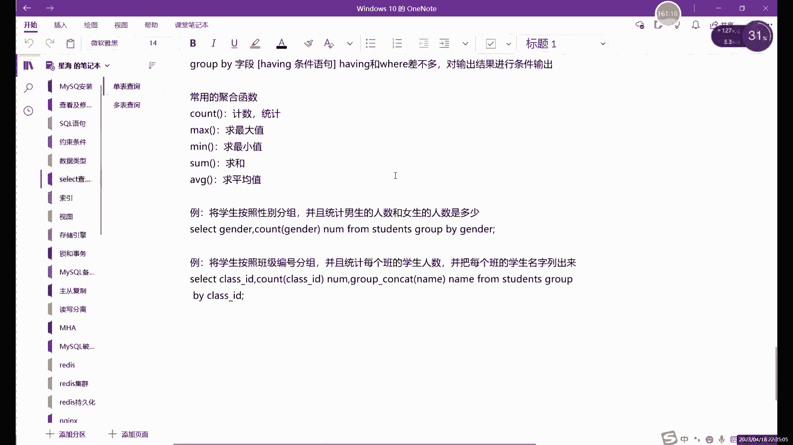

在下节课中，我们将进入**多表查询**的学习，探索如何同时从多个关联的表中提取和组合数据，这将进一步扩展我们的数据查询能力。