# MySQL 数据库管理：第 4 章：事务控制语言与锁机制入门


在本节课中，我们将要学习 SQL 语句的最后一种类型——事务控制语言。我们将了解什么是事务、它如何像系统快照一样工作，以及如何通过事务来安全地管理数据的增、删、改操作。同时，我们也会初步接触数据库中的锁机制，理解其保护数据安全的基本原理。

## 事务控制语言概述

上一节我们介绍了数据控制语言，用于管理用户权限。本节中我们来看看第四种 SQL 语言：事务控制语言。它控制的对象不是数据本身，而是“事务”。

**事务** 是将一组 SQL 语句绑定在一起执行的单元。它主要针对能修改数据的操作，即 `INSERT`、`UPDATE`、`DELETE` 命令。事务的核心作用在于提供“回滚”机制。你可以将开启事务理解为给数据库当前状态拍一个快照。在此之后执行的所有修改操作，在最终确认前都不会真正写入数据库文件，而是暂存在事务日志中。如果所有操作都符合预期，就提交（`COMMIT`）事务，使更改永久生效；如果中途发现错误，则可以回滚（`ROLLBACK`）事务，数据库将恢复到事务开始时的状态，就像从未执行过那些操作一样。

这与文本编辑器中的“撤销”功能或虚拟机中的“快照恢复”功能非常相似。

## 事务的基本操作与演示

默认情况下，MySQL 是自动提交模式的，即每执行一条语句就立即生效，我们无法手动回滚。要使用事务控制，首先需要关闭自动提交。

以下是管理事务的三个核心命令：
*   `BEGIN`： 显式开启一个事务。
*   `COMMIT`： 提交事务，使所有更改永久化。
*   `ROLLBACK`： 回滚事务，撤销所有未提交的更改。

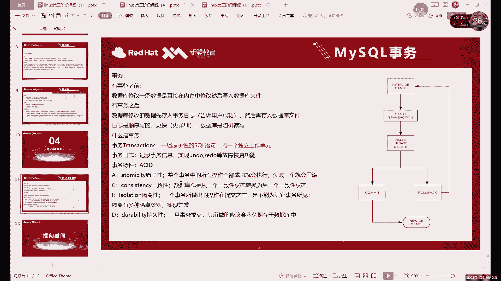

现在，让我们通过一个例子来演示事务的工作流程。假设我们有一个表 `xh`。

1.  首先，关闭自动提交并开启一个新事务：
    ```sql
    SET autocommit = 0; -- 关闭自动提交
    BEGIN; -- 开启事务（在某些客户端中，BEGIN 可省略，以第一条语句开始事务）
    ```

2.  接着，执行一个删除操作：
    ```sql
    DELETE FROM xh WHERE id IS NULL;
    ```
    执行后，在当前会话中使用 `SELECT` 查询，会发现数据已被删除。

3.  此时，如果我们执行回滚：
    ```sql
    ROLLBACK;
    ```
    再次查询，会发现被删除的数据恢复了。因为回滚使我们回到了事务开始前的状态。

4.  我们再次执行相同的删除命令，但这次选择提交：
    ```sql
    DELETE FROM xh WHERE id IS NULL;
    COMMIT;
    ```
    提交后，更改被永久写入数据库。即使再执行 `ROLLBACK`，数据也无法恢复。

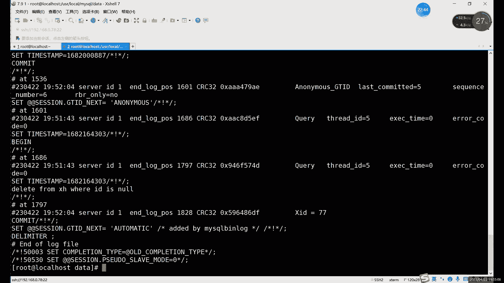

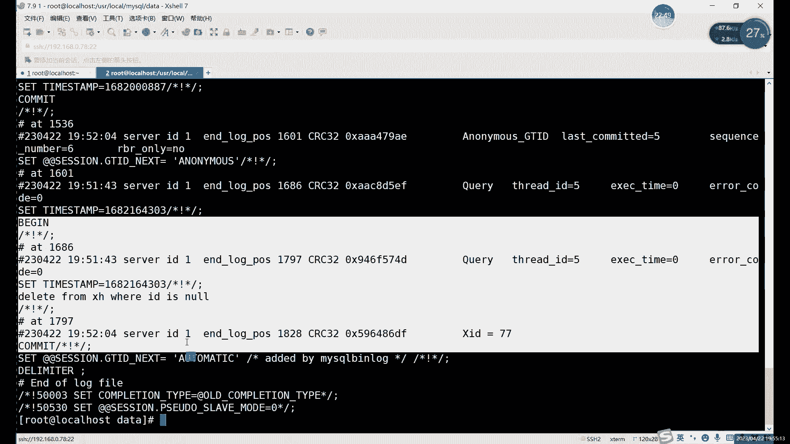

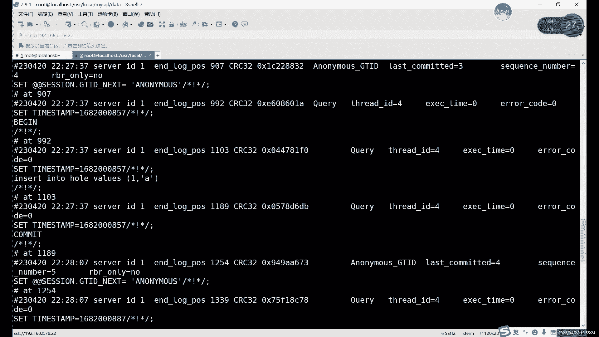

**关键点**：只有真正提交（`COMMIT`）后，数据的更改才会永久生效并记录到二进制日志中。回滚（`ROLLBACK`）的操作不会被记录，因为它没有产生任何永久性的数据变化。

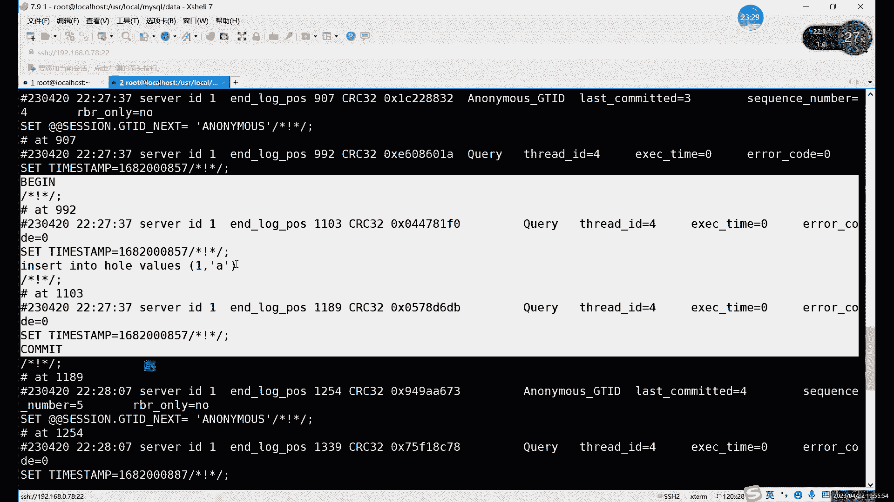

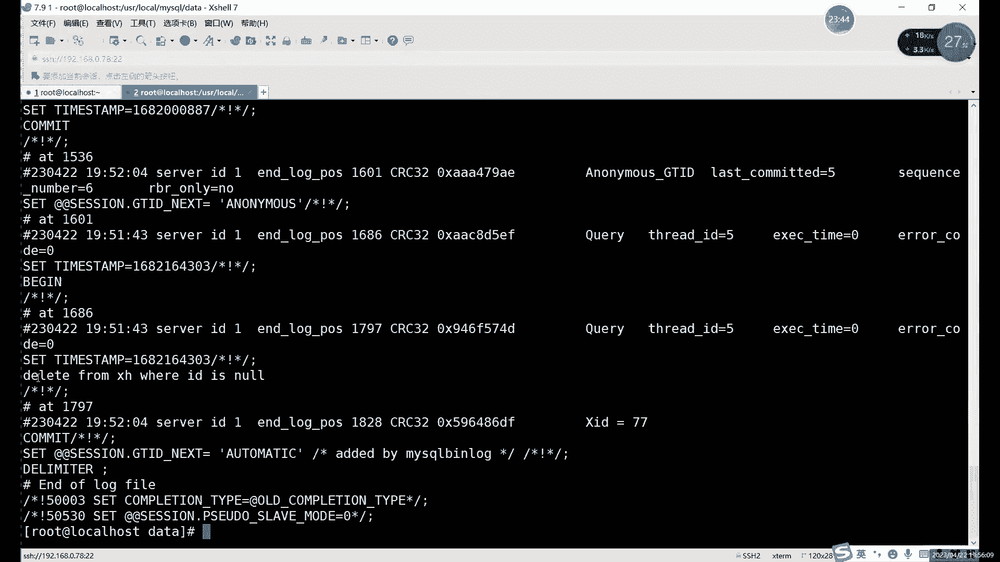

## 事务的隔离性与锁的概念

当我们开启一个事务并修改数据但未提交时，这些更改在当前会话中可见，但在其他连接到数据库的会话（或终端）中是不可见的。这是因为事务具有**隔离性**。

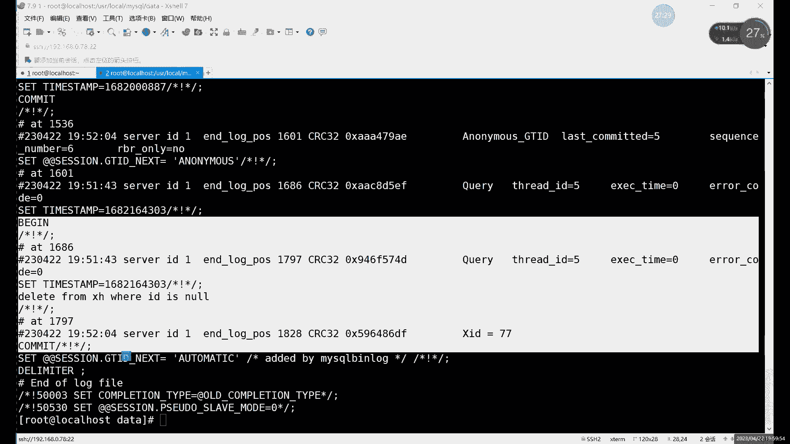

然而，如果多个事务同时尝试修改同一份数据，就可能产生冲突。为了维护数据的一致性和完整性，MySQL 引入了**锁机制**。

锁主要分为两大类：
*   **共享锁（读锁）**： 允许多个事务同时读取同一资源，但不允许写入。读取操作默认不加锁，或加共享锁。
*   **排他锁（写锁）**： 只允许一个事务对资源进行写入或修改，在此期间，其他事务既不能读取也不能写入该资源。`INSERT`、`UPDATE`、`DELETE` 操作会自动加排他锁。

**锁的作用**： 当一个事务对某行数据加锁后（尤其是排他锁），其他事务对该行的操作会被阻塞，直到锁被释放（事务提交或回滚）。这确保了数据在并发修改时的安全。

例如，事务 A 开启并修改了表 T 的某行数据但未提交，此时事务 B 也尝试修改同一行数据，事务 B 的操作将会等待，直到事务 A 提交或回滚。如果等待时间过长，事务 B 可能会报告超时错误。

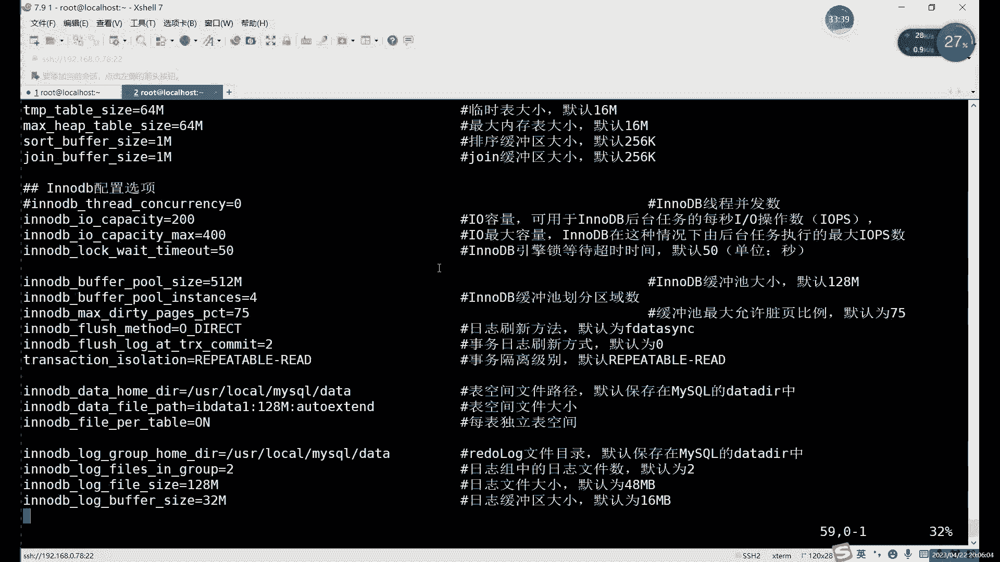

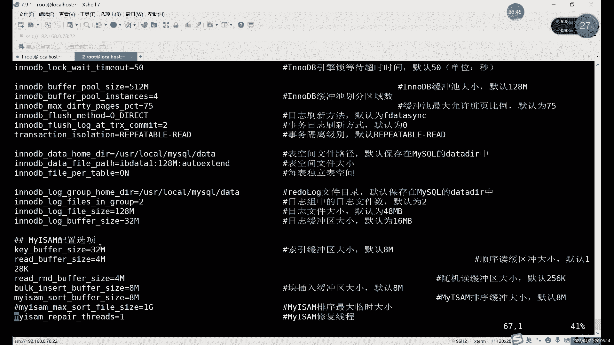

## 查看事务与二进制日志

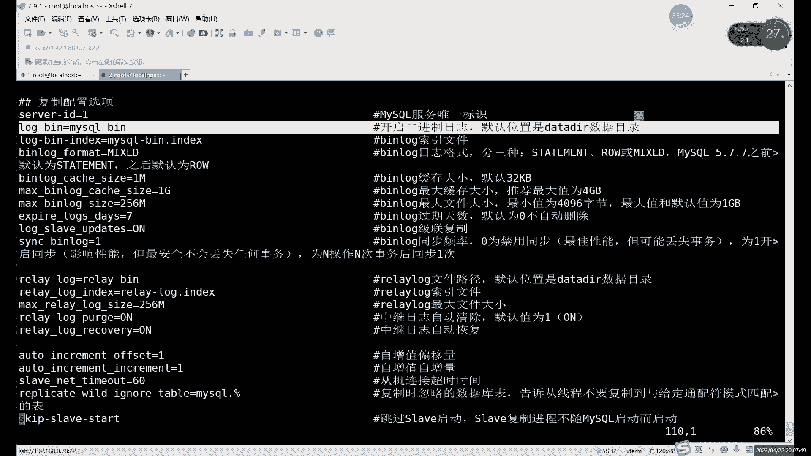

我们可以通过系统数据库 `information_schema` 中的表来查看当前运行的事务信息。

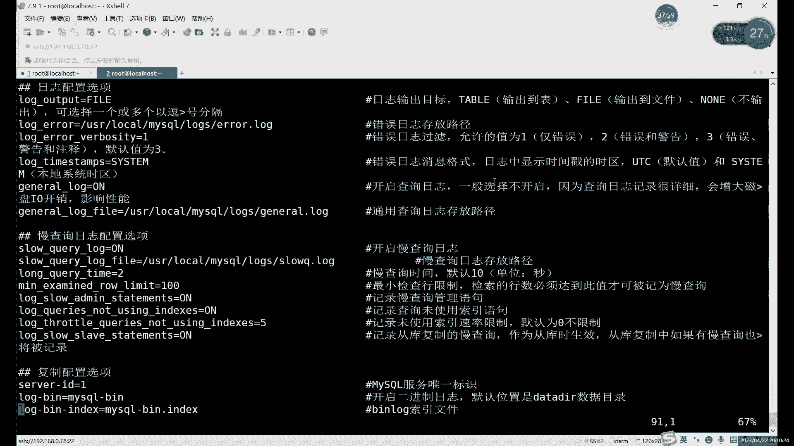

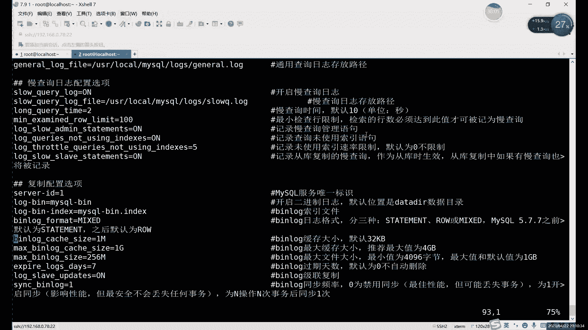

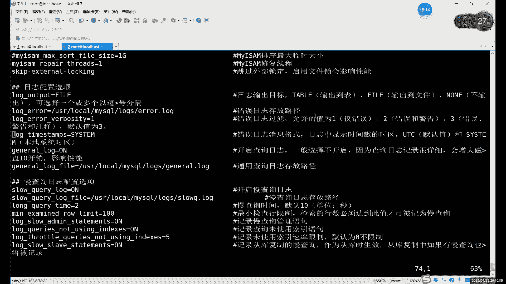

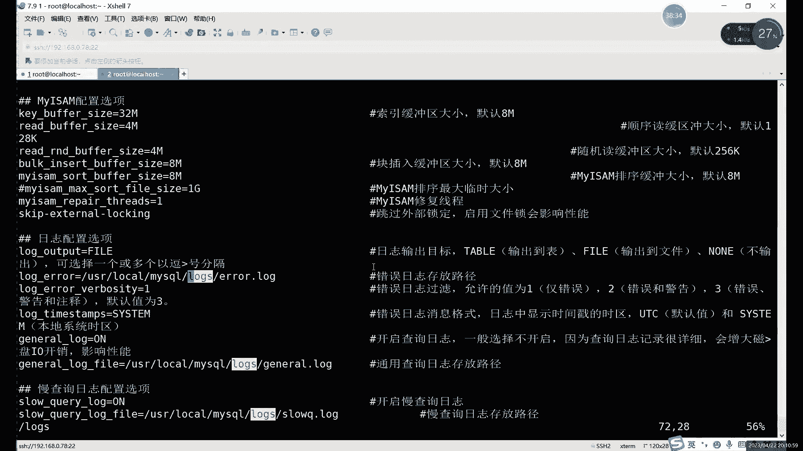

```sql
SELECT * FROM information_schema.INNODB_TRX;
```

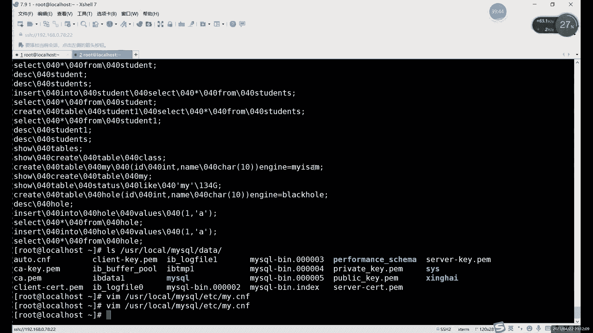

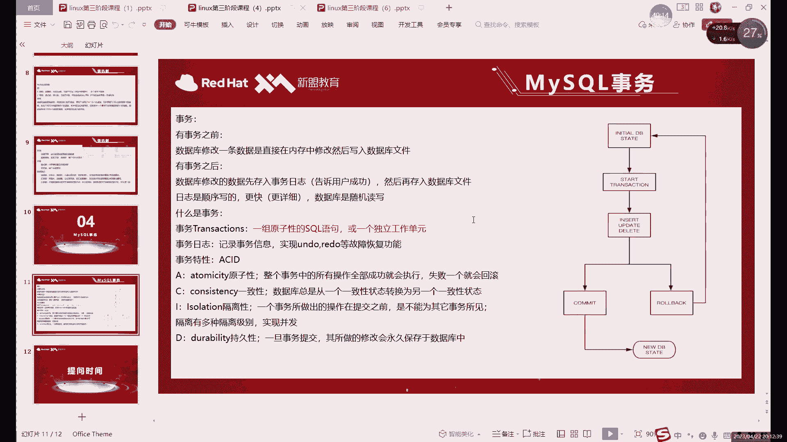

这条命令可以列出当前所有正在运行的事务详情，如事务ID、状态、开始时间等。

此外，事务相关的操作会被记录在**二进制日志**中。二进制日志是记录所有更改数据库数据的 SQL 语句的日志文件，主要用于数据复制和恢复。可以使用 `mysqlbinlog` 工具查看其内容。

```bash
mysqlbinlog /var/lib/mysql/binlog.000001
```

在二进制日志中，你可以看到以 `BEGIN` 开始，以 `COMMIT` 结束的完整事务记录。而 `ROLLBACK` 的事务则不会被记录，因为它没有产生实际的数据变更。

## 总结

本节课中我们一起学习了 SQL 的事务控制语言和锁的基本概念。

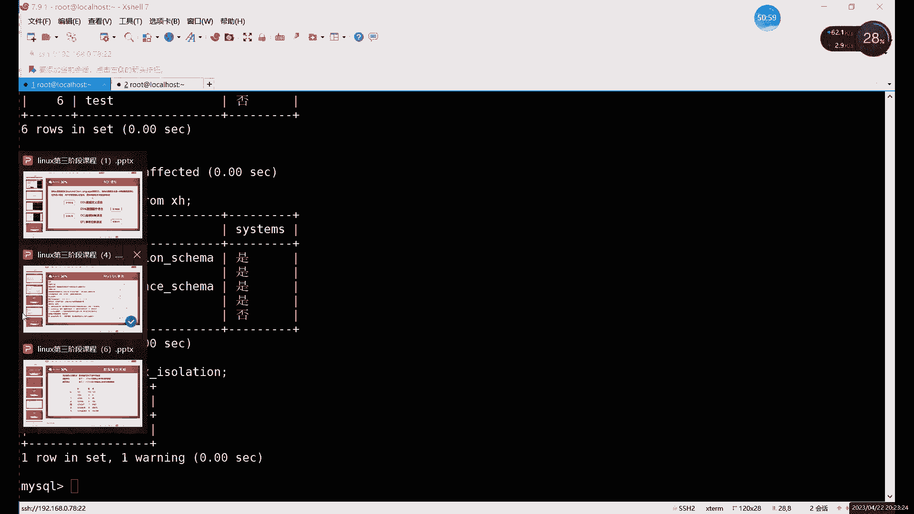

我们了解到，**事务** 通过 `BEGIN`、`COMMIT`、`ROLLBACK` 命令，为数据的增删改操作提供了一个安全的“试验场”和“撤销”机制，极大地增强了数据操作的容错性和安全性。使用事务前，通常需要关闭 `autocommit` 模式。

同时，我们也初步认识了**锁机制**，它是数据库管理并发访问的核心工具。读锁（共享锁）允许多个查询同时进行，而写锁（排他锁）则确保同一时间只有一个修改操作能进行，从而防止数据混乱。

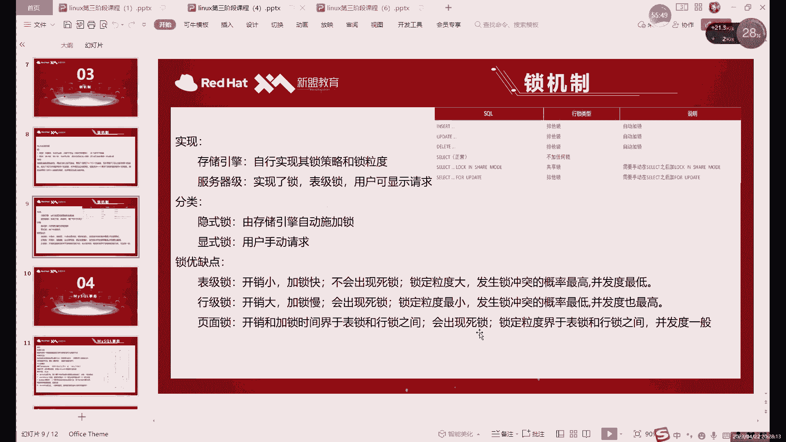

理解事务和锁是进行高效、安全数据库运维的基础。下一节，我们将更深入地探讨锁的类型、死锁以及数据库备份的相关知识。