# MySQL数据库管理：第17章：事务、锁与备份（中）


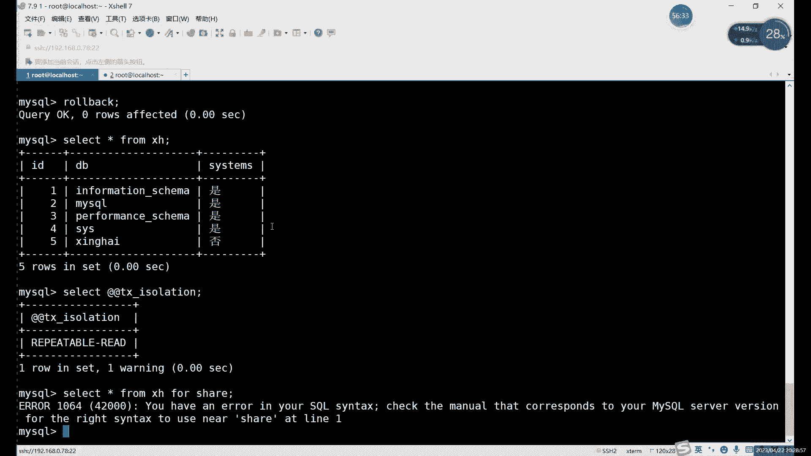

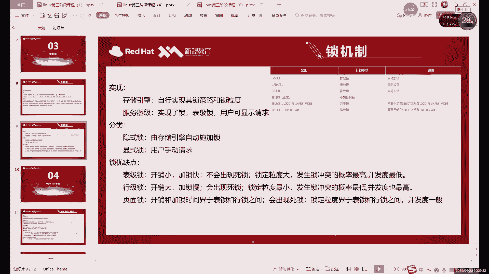

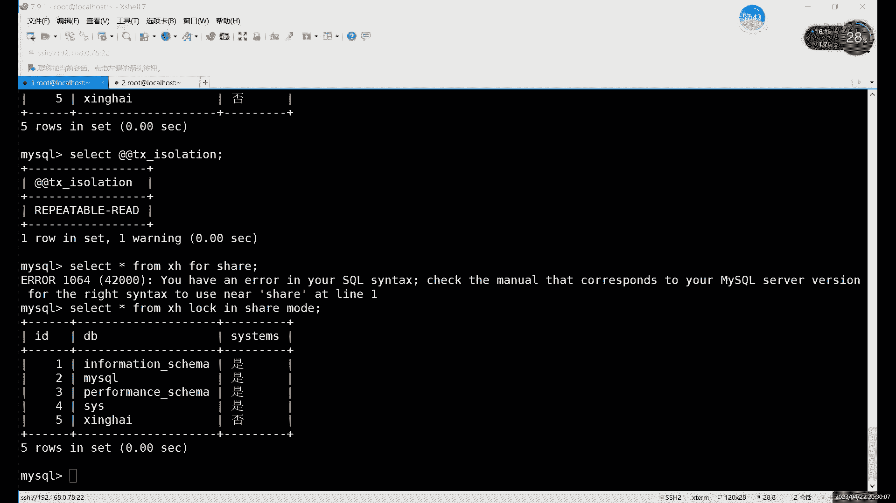

## 概述


在本节课中，我们将深入学习MySQL中的锁机制，并探讨数据库备份的核心概念与策略。我们将从锁的类型和用法开始，逐步过渡到备份的重要性、分类以及具体的操作方法。

## 锁机制详解

上一节我们介绍了事务的基本概念。本节中我们来看看如何通过锁机制来管理并发事务对数据的访问。

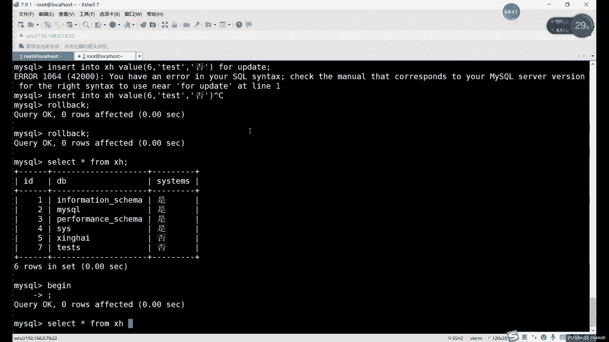

锁是一种用于协调多个事务对同一资源进行访问的机制，以防止数据不一致。在MySQL中，锁主要分为共享锁和排他锁。


### 共享锁与排他锁

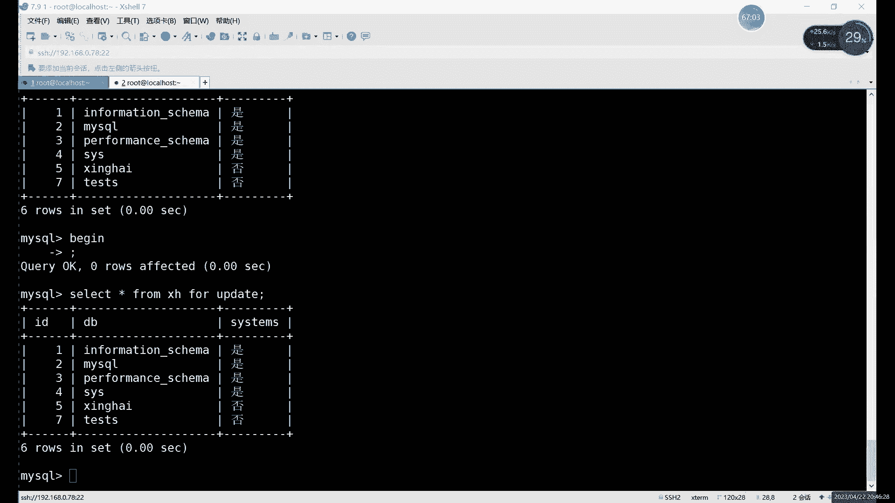


共享锁允许多个事务同时读取同一资源，但不允许写入。排他锁则只允许一个事务独占资源，进行读取或写入，其他事务无法访问。

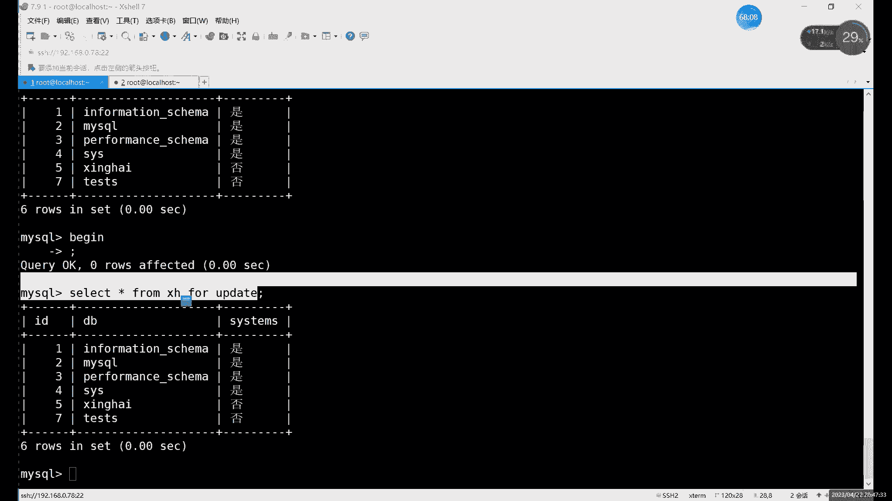

以下是创建共享锁的SQL语句示例：
```sql
SELECT * FROM table_name LOCK IN SHARE MODE;
```
这条语句在查询时为`table_name`表加上了共享锁。

排他锁可以通过以下方式创建：
```sql
SELECT * FROM table_name FOR UPDATE;
```
或者在执行写操作（如`INSERT`、`UPDATE`、`DELETE`）时，InnoDB存储引擎会自动为涉及的数据行加上排他锁。

共享锁在查询时限制较小，多个终端可以同时进行查询操作。排他锁是独占的，会阻塞其他事务对锁定资源的任何操作。

### 锁的生效与事务

锁机制要生效，必须在一个开启的事务中。如果使用自动提交模式，每条SQL语句都会立即提交并关闭事务，锁也就不会持续生效。

以下是手动开启事务并加锁的流程：
1.  关闭自动提交：`SET autocommit=0;`
2.  开启事务：`BEGIN;` 或 `START TRANSACTION;`
3.  执行加锁的SQL语句（例如 `SELECT ... FOR UPDATE`）。
4.  执行数据操作。
5.  提交或回滚事务：`COMMIT;` 或 `ROLLBACK;`

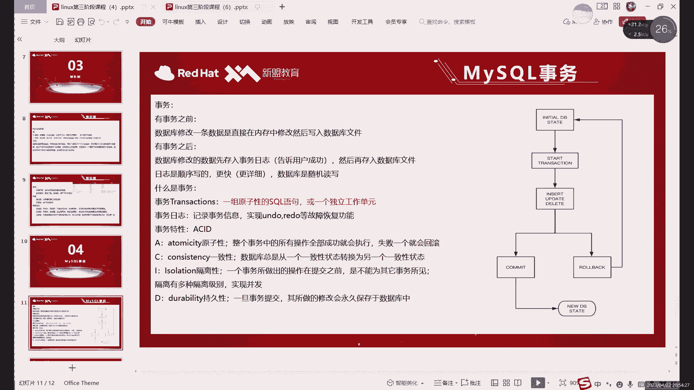

`INSERT`、`UPDATE`、`DELETE`语句在执行时会自动获取排他锁。

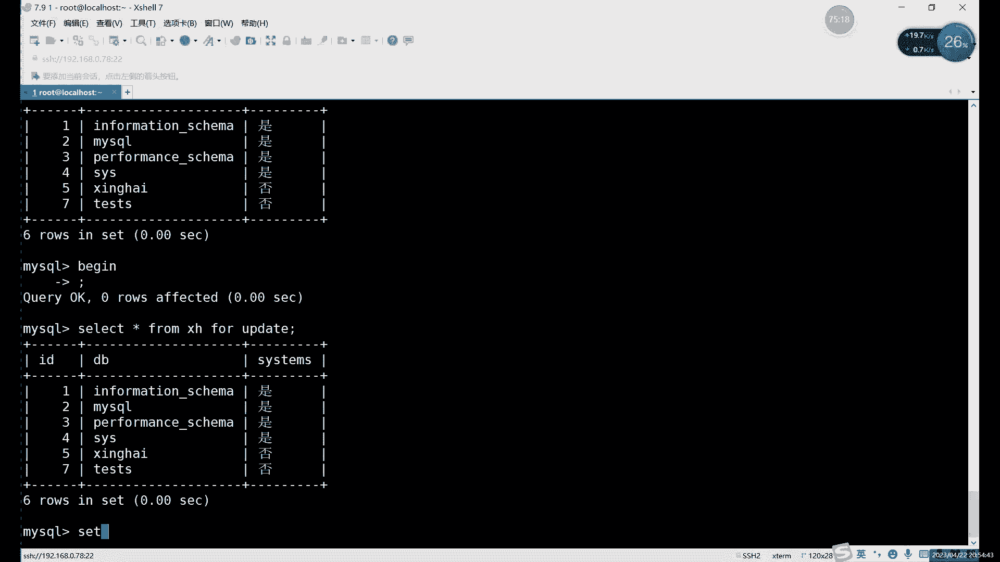

### 死锁

死锁是指两个或更多事务相互等待对方释放锁资源，导致所有事务都无法继续执行的情况。

例如，事务A锁定了行1并尝试锁定行2，同时事务B锁定了行2并尝试锁定行1，双方都会无限期等待，形成死锁。MySQL的InnoDB引擎具有死锁检测机制，通常会强制回滚其中一个事务来打破死锁。

### 锁的粒度

MySQL支持不同粒度的锁，主要包括以下三种：

以下是不同锁粒度的对比：
*   **表级锁**：开销最小，加锁最快，但粒度最粗，容易发生锁冲突，影响并发度。
*   **行级锁**：开销大，加锁慢，但粒度细，锁冲突概率低，并发度高。InnoDB存储引擎默认使用行级锁。
*   **页级锁**：开销和粒度介于表锁和行锁之间。

## 数据库备份基础

锁机制是保证数据一致性的重要手段，而备份则是防止数据丢失的最后防线。接下来，我们将系统性地学习数据库备份。

备份是数据库管理中最重要的工作之一，其目的是在数据丢失或损坏时能够恢复。

### 备份策略（按数据量分类）


根据每次备份的数据量，备份策略主要分为三类：完全备份、增量备份和差异备份。

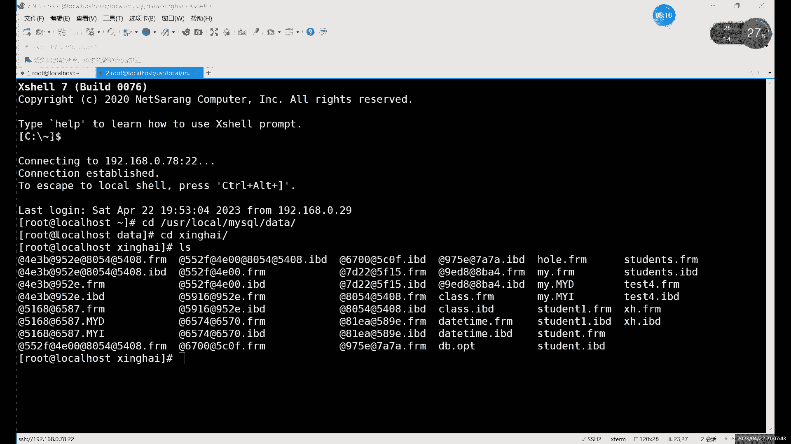

以下是三种备份策略的对比说明：
*   **完全备份**：备份指定目标（如整个数据库、单个表）的全部数据。优点是数据完整，恢复简单；缺点是备份时间长，占用存储空间大，随着数据增长效率降低。
*   **增量备份**：备份自上一次备份（无论是完全备份还是增量备份）以来发生变化的数据。优点是备份速度快，占用空间小；缺点是恢复时需要按顺序应用所有增量备份，过程稍显复杂。
*   **差异备份**：备份自上一次完全备份以来发生变化的所有数据。备份数据量和速度介于完全备份和增量备份之间。

对于频繁更新的数据库，通常采用“完全备份 + 增量备份”的组合策略，例如每周进行一次完全备份，每天进行一次增量备份。

### 备份类型（按数据库状态分类）

根据备份时数据库的运行状态，备份可以分为热备份、温备份和冷备份。

以下是三种备份类型的对比：
*   **热备份**：在数据库正常运行、可读写期间进行备份。对业务影响最小，但备份操作可能因为数据库活动而变慢或复杂。
*   **温备份**：在数据库正常运行、但仅允许读操作（锁定写操作）期间进行备份。折中了影响和复杂度。
*   **冷备份**：在数据库完全关闭、服务停止期间进行备份。备份速度快且一致性好，但需要停机，影响业务连续性。


### 备份方法（按实现方式分类）

根据备份数据的存储形式，主要分为物理备份和逻辑备份。

以下是两种备份方法的对比：
*   **物理备份**：直接复制数据库的物理文件（如数据文件、日志文件）。恢复时直接替换文件即可。速度快，但备份文件大，且可能受数据库版本或存储引擎限制。
*   **逻辑备份**：将数据库的结构和数据导出为SQL语句（主要是`CREATE`和`INSERT`语句）。备份文件较小，可读性强，兼容性好，便于选择性恢复，但备份和恢复速度通常比物理备份慢。

`mysqldump`是MySQL最常用的逻辑备份工具。

## 备份操作演示

了解了备份的理论知识后，我们通过实际操作来演示两种常见的备份方法。

### 物理备份（冷备份）演示

物理冷备份需要停止MySQL服务，然后直接拷贝数据文件。

以下是物理冷备份的步骤：
1.  停止MySQL服务：`systemctl stop mysqld`
2.  使用复制命令（如`cp`、`tar`）备份数据目录（默认通常为`/var/lib/mysql/`）。可以备份整个目录，也可以只备份特定的数据库目录。
    ```bash
    # 创建备份目录
    mkdir -p /backup/mysql
    # 备份整个数据目录（示例）
    cp -rp /var/lib/mysql/* /backup/mysql/full_backup_$(date +%Y%m%d)/
    # 或使用tar打包
    tar -zcvf /backup/mysql/full_backup_$(date +%Y%m%d).tar.gz /var/lib/mysql/
    ```
3.  启动MySQL服务：`systemctl start mysqld`

**恢复时**，需要先停止服务，然后将备份文件复制回原数据目录，再启动服务。

### 逻辑备份（热备份）演示

逻辑备份可以在数据库运行时进行，使用`mysqldump`工具。

以下是使用`mysqldump`进行逻辑备份的常用命令示例：
*   备份单个数据库：
    ```bash
    mysqldump -u username -p database_name > backup_file.sql
    ```
*   备份所有数据库：
    ```bash
    mysqldump -u username -p --all-databases > all_backup.sql
    ```
*   备份特定表：
    ```bash
    mysqldump -u username -p database_name table_name > table_backup.sql
    ```

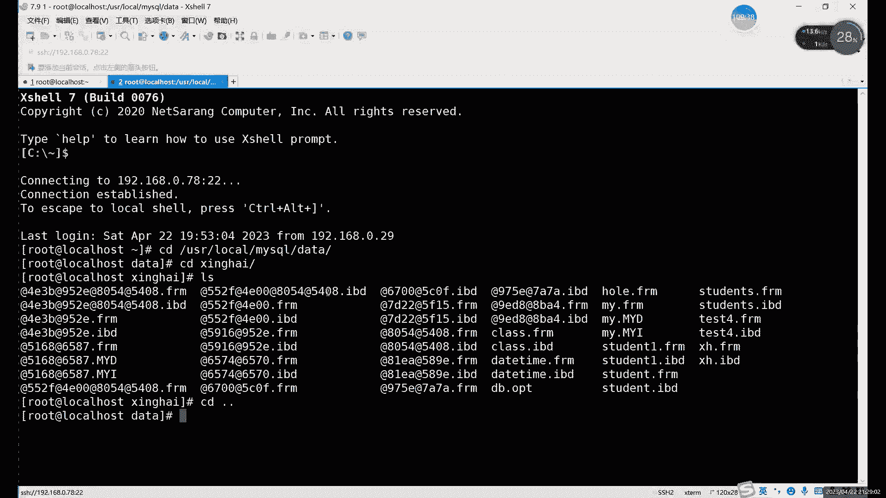

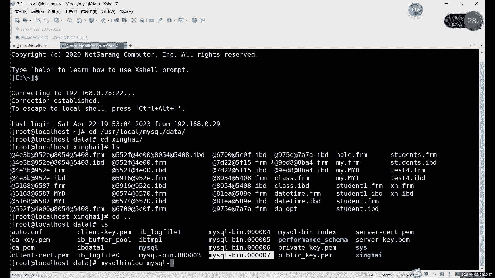

**恢复时**，使用`mysql`命令导入SQL文件：
```bash
mysql -u username -p database_name < backup_file.sql
```

## 总结

本节课中我们一起学习了MySQL中锁机制与数据库备份的核心知识。

我们首先详细探讨了共享锁和排他锁的区别、用法及其与事务的关系，并了解了死锁的概念。接着，我们系统性地学习了数据库备份，从备份的重要性出发，分析了按数据量划分的完全备份、增量备份、差异备份等策略，按数据库状态划分的热备、温备、冷备等类型，以及按实现方式划分的物理备份和逻辑备份等方法。最后，我们通过演示物理冷备份和逻辑热备份（使用`mysqldump`）的操作步骤，将理论应用于实践。

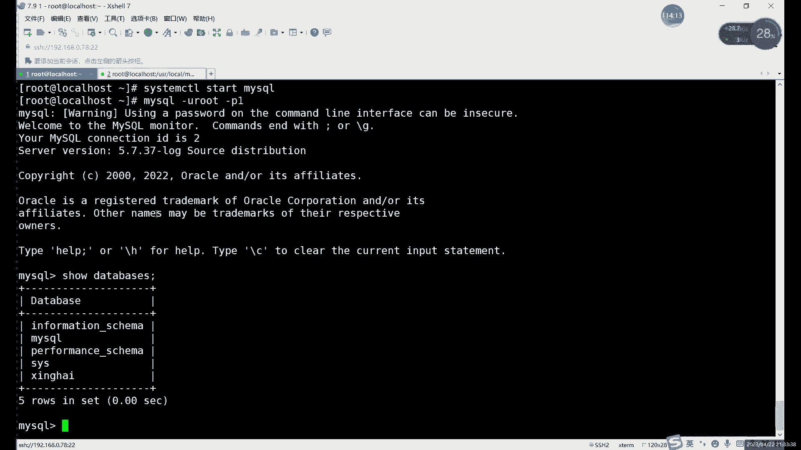


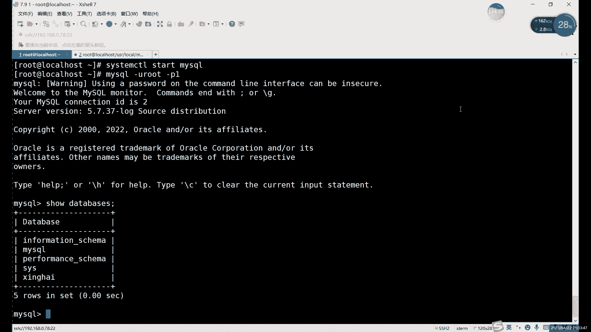

理解并熟练运用锁机制是保证数据库并发安全的基础，而制定合理的备份策略并定期执行，则是守护数据安全的生命线。