# Linux运维进阶：P80：中级运维-18.事务，锁，备份-下 🔧


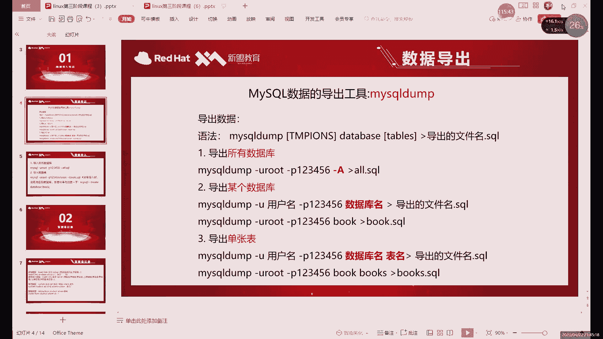

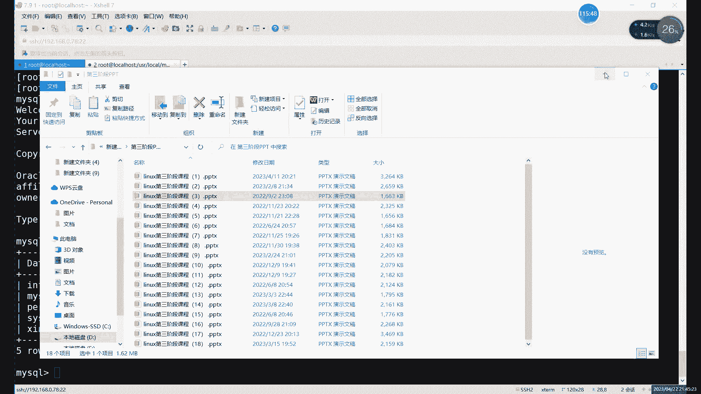

在本节课中，我们将学习MySQL的逻辑备份与恢复。我们将重点介绍如何使用 `mysqldump` 命令进行数据导出（备份），以及如何使用 `mysql` 和 `source` 命令进行数据导入（恢复）。理解这些操作是数据库日常维护和灾难恢复的关键。

---

## 逻辑备份：使用 `mysqldump` 命令导出数据

上一节我们介绍了物理备份，本节中我们来看看逻辑备份。逻辑备份主要通过 `mysqldump` 命令实现，它是MySQL中常用的导入导出工具，主要用于数据的导出。

`mysqldump` 命令导出的文件本质上是包含了重建数据库和表结构（`CREATE`）以及插入数据（`INSERT`）的SQL语句集合。

以下是 `mysqldump` 命令的几种常见用法：

### 1. 备份所有数据库
使用 `-A` 或 `--all-databases` 选项可以备份MySQL服务器上的所有数据库。
```bash
mysqldump -u root -p密码 -A > all_databases_backup.sql
```
执行此命令会将所有数据库的结构和数据导出到 `all_databases_backup.sql` 文件中。

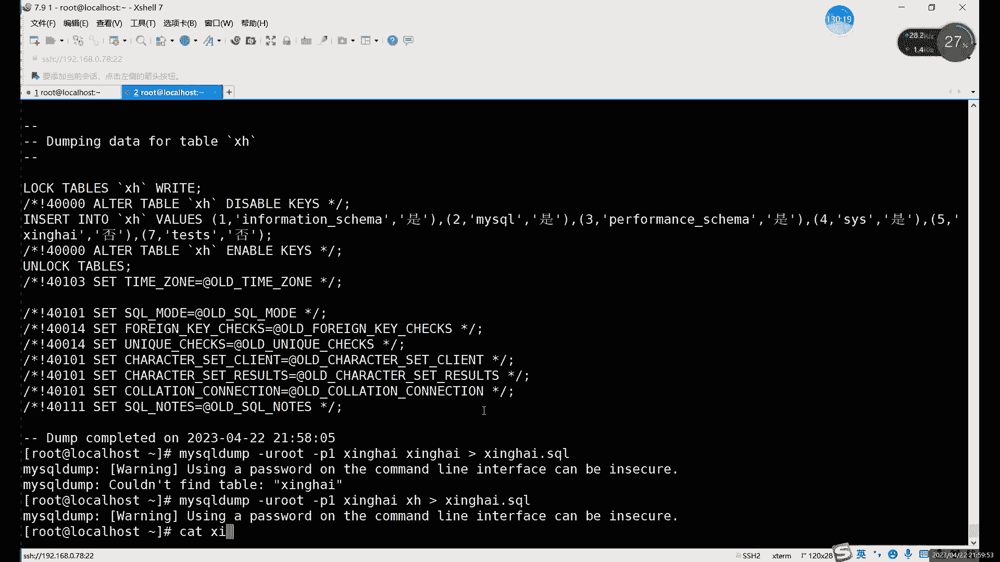

### 2. 备份单个数据库
要备份特定的数据库，只需在命令后指定数据库名称。
```bash
mysqldump -u root -p密码 数据库名 > single_database_backup.sql
```

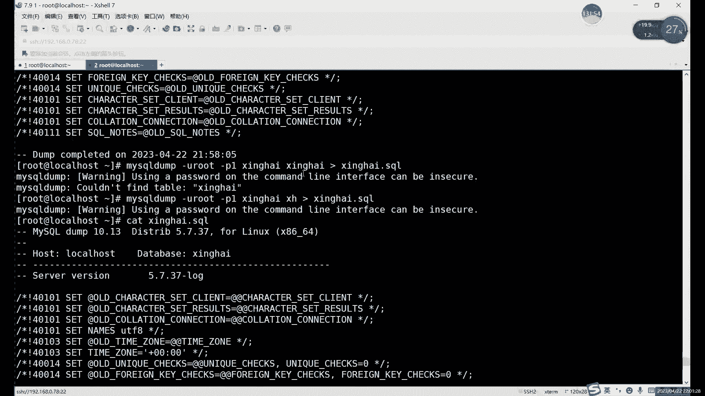

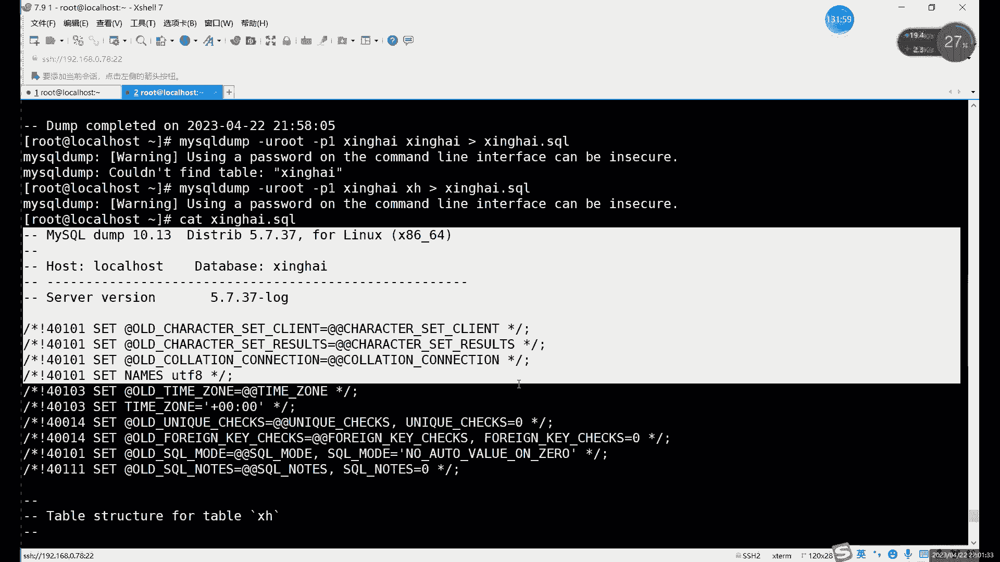

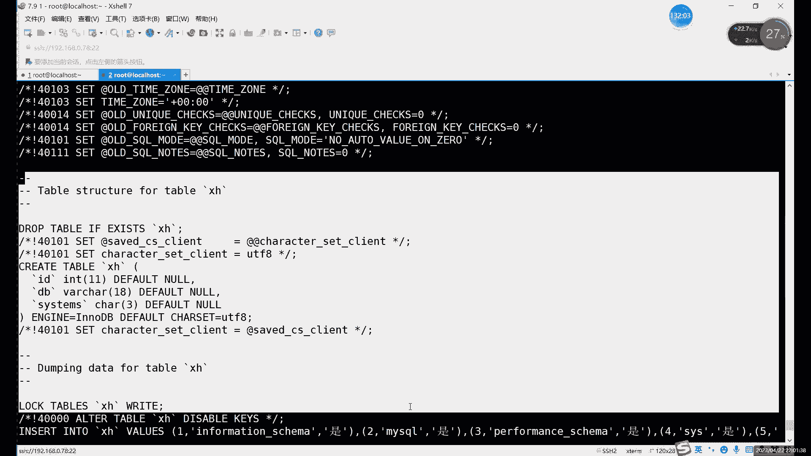

### 3. 备份单张数据表
可以进一步细化，只备份某个数据库中的特定表。
```bash
mysqldump -u root -p密码 数据库名 表名 > single_table_backup.sql
```

### 4. 仅备份表结构或数据
有时我们可能只需要结构或只需要数据，可以使用 `-d` 和 `-t` 选项。
*   **仅备份结构（无数据）**：
    ```bash
    mysqldump -u root -p密码 -d 数据库名 > structure_only.sql
    ```
*   **仅备份数据（无结构）**：
    ```bash
    mysqldump -u root -p密码 -t 数据库名 > data_only.sql
    ```

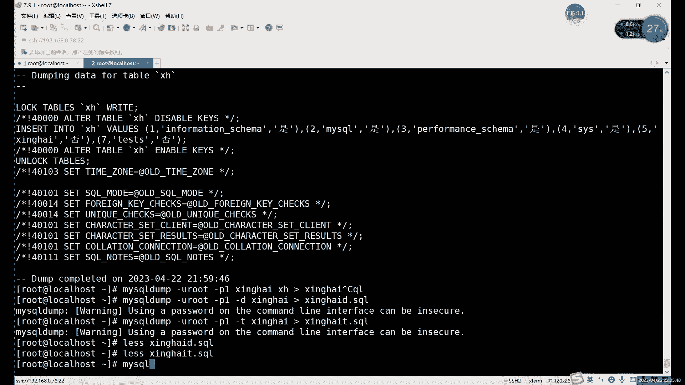

**注意**：逻辑备份必须在数据库服务运行（热备份）时进行，因为 `mysqldump` 命令需要连接数据库来读取数据。


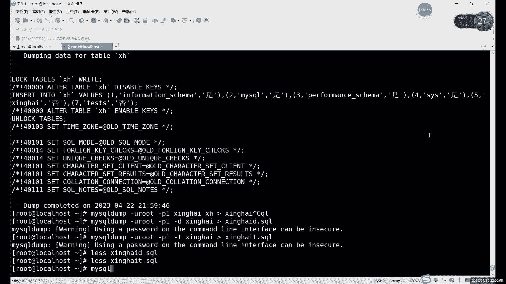

---

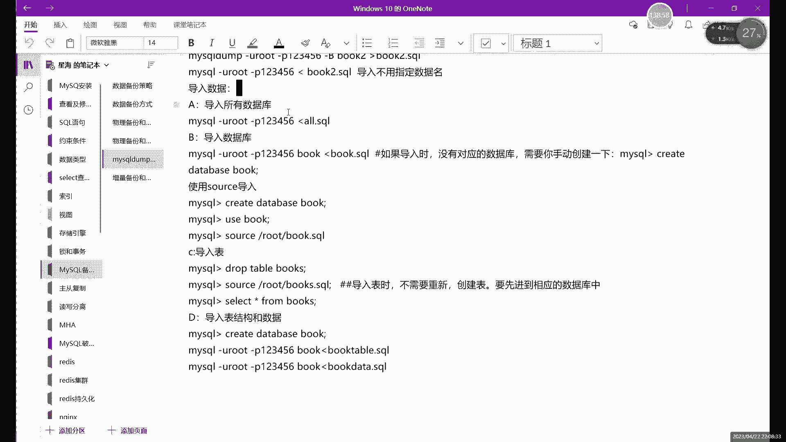

## 备份文件内容解析

导出的SQL文件内容清晰易读，主要包含以下命令：
1.  **`DROP TABLE IF EXISTS`**：如果表已存在，则先删除它。这是为了在恢复时避免因表已存在而报错。
2.  **`CREATE TABLE`**：创建表结构的语句。
3.  **`LOCK TABLES ... WRITE`** 与 **`UNLOCK TABLES`**：在插入数据前后对表加锁和解锁，确保数据插入时的完整性。
4.  **`INSERT INTO`**：插入数据的语句。

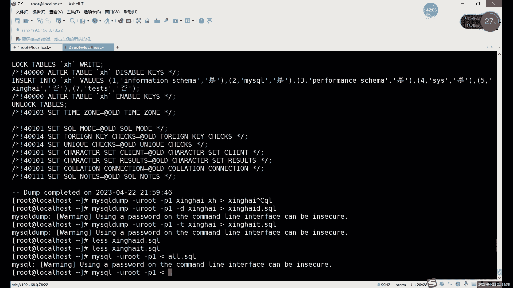

这种“先删除、后创建、再插入”的顺序，保证了恢复过程的顺利执行。**切勿随意手动修改备份文件内容**，否则可能导致恢复时SQL语句执行错误而中断。

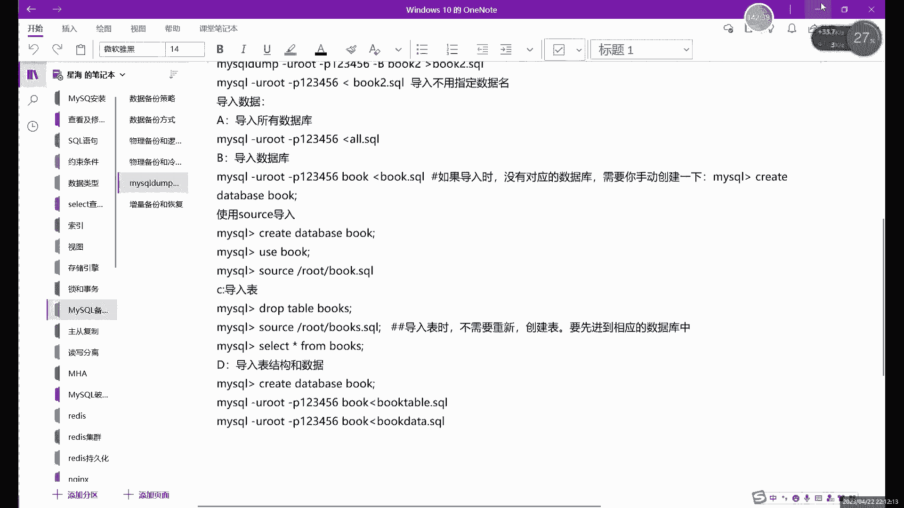

---

## 逻辑恢复：将备份数据导入数据库

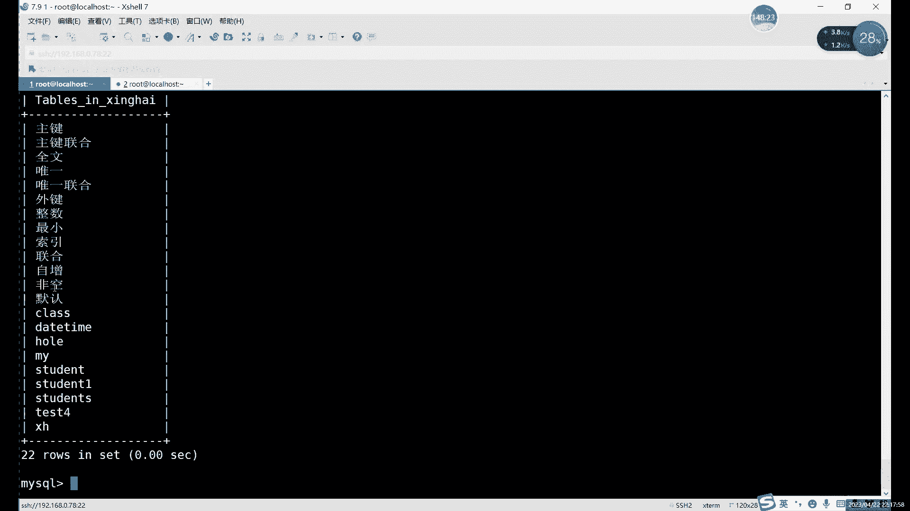

备份的目的是为了在需要时恢复。逻辑恢复的本质，就是让MySQL服务器执行备份文件中的所有SQL命令。


### 方法一：使用 `mysql` 命令恢复
在操作系统命令行中，使用 `mysql` 客户端配合 `<` 重定向符来执行备份文件。
*   **恢复整个备份文件（包含所有数据库）**：
    ```bash
    mysql -u root -p密码 < all_databases_backup.sql
    ```
*   **恢复单个数据库备份**：
    ```bash
    mysql -u root -p密码 目标数据库名 < single_database_backup.sql
    ```
    **重要提示**：使用此方法恢复单个数据库前，**必须确保目标数据库已存在**。因为单个数据库的备份文件通常不包含 `CREATE DATABASE` 语句。如果数据库不存在，需要先创建：
    ```sql
    CREATE DATABASE 目标数据库名;
    ```

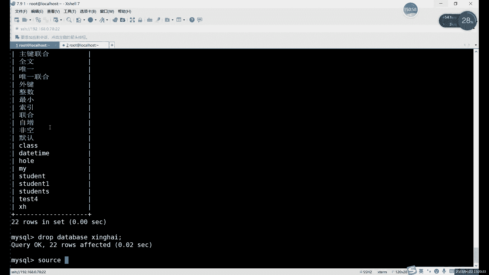

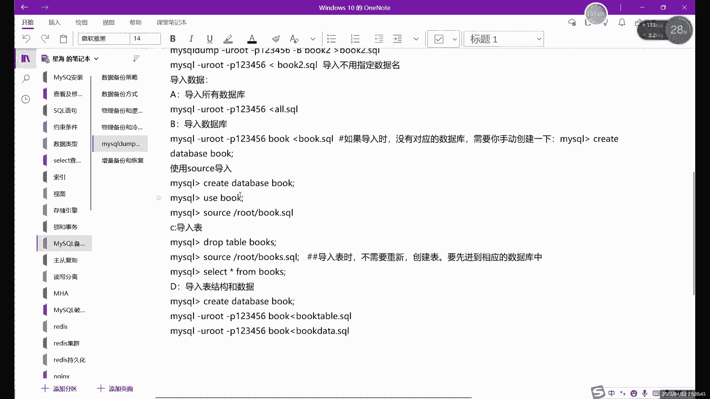

### 方法二：在MySQL命令行中使用 `source` 命令恢复
登录到MySQL命令行后，可以使用 `source` 命令来执行外部的SQL文件。
1.  登录MySQL：
    ```bash
    mysql -u root -p
    ```
2.  切换到要恢复的数据库（如果是恢复整个备份，此步可省略）：
    ```sql
    USE 数据库名;
    ```
3.  执行 `source` 命令，后面跟备份文件的**绝对路径**：
    ```sql
    SOURCE /path/to/your/backup_file.sql;
    ```
    **重要提示**：使用 `source` 恢复单个数据库时，同样需要先创建并切换到该数据库。

---

## 全量备份与增量备份简介

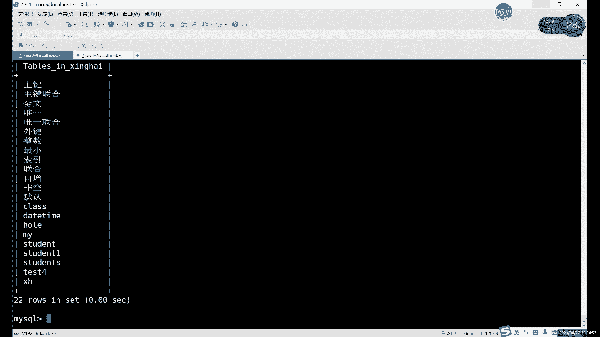


本节课我们学习的是**全量备份**，即备份某个时间点的完整数据。还有一种更高效的备份方式是**增量备份**，它只备份自上次备份以来发生变化的数据部分。增量备份的优点是备份速度快、数据量小、对业务影响低。

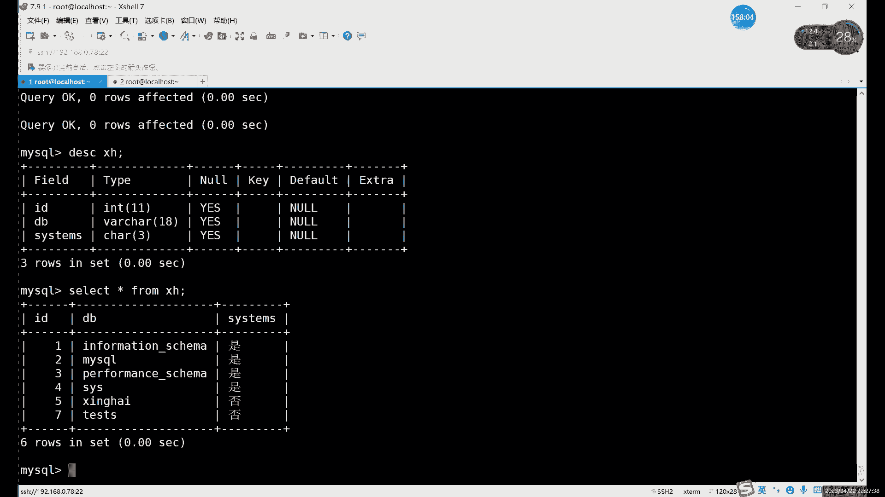

在MySQL中，通常借助**二进制日志（binlog）** 来实现增量备份。二进制日志记录了所有对数据库的更改操作（如 `INSERT`、`UPDATE`、`DELETE`）。通过备份和分析这些日志，可以实现数据的增量恢复。关于增量备份和基于二进制日志的主从复制，我们将在下节课详细探讨。


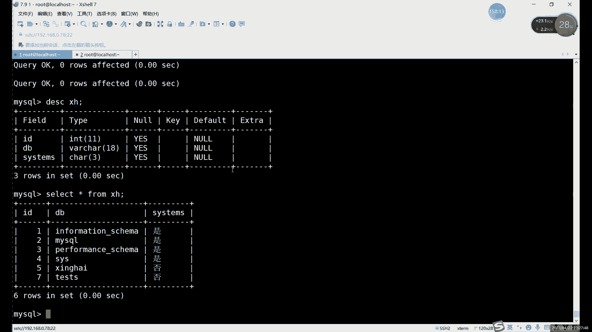


---

## 总结

本节课中我们一起学习了MySQL的逻辑备份与恢复。
*   我们掌握了使用 **`mysqldump`** 命令进行全量逻辑备份的多种方式。
*   我们理解了备份文件的内容构成及其恢复原理。
*   我们学会了使用 **`mysql`** 命令和 **`source`** 命令进行数据恢复，并注意了恢复前需确保数据库存在等关键事项。
*   我们简单了解了全量备份与增量备份的概念，为后续学习打下基础。

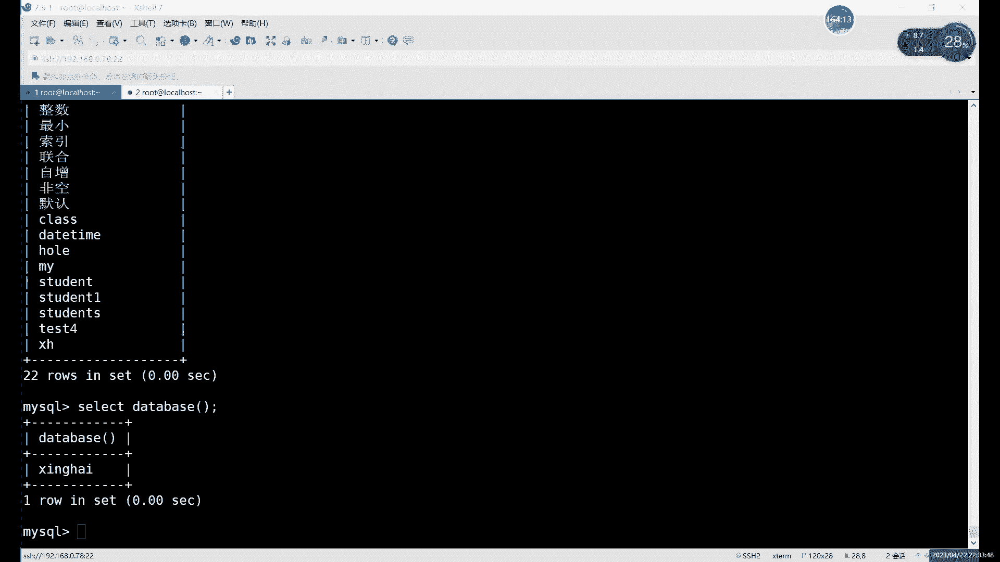

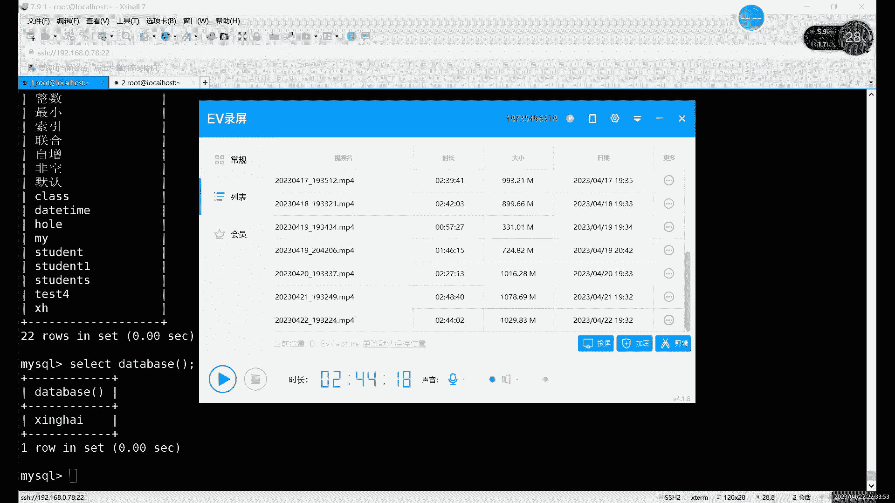

请务必熟记这些命令和注意事项，它们是数据库运维工作中保障数据安全的核心技能。下节课我们将深入增量备份与MySQL主从复制集群的搭建。