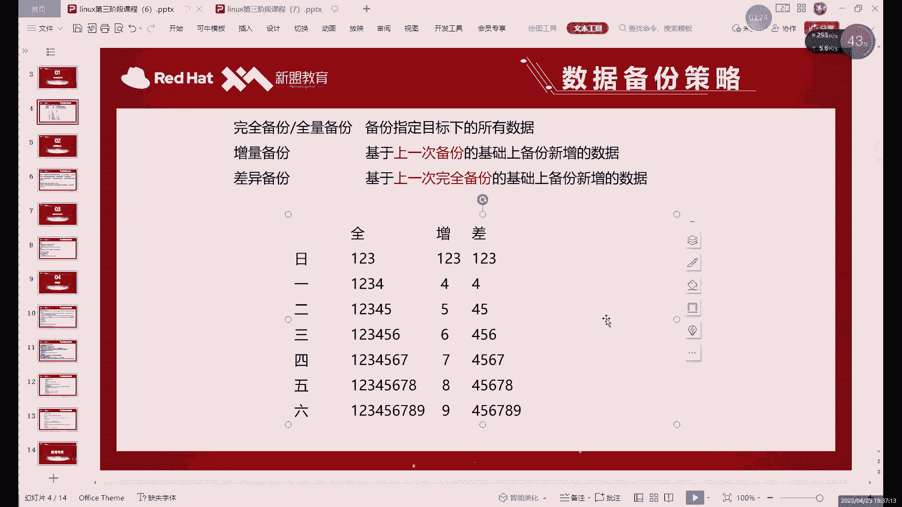
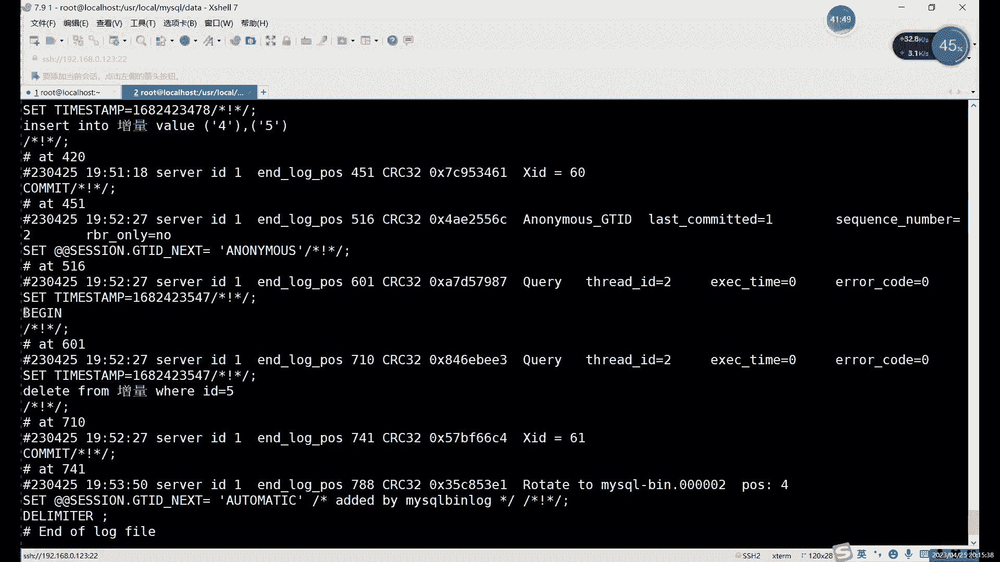
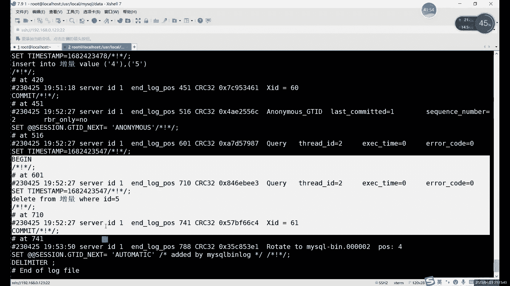
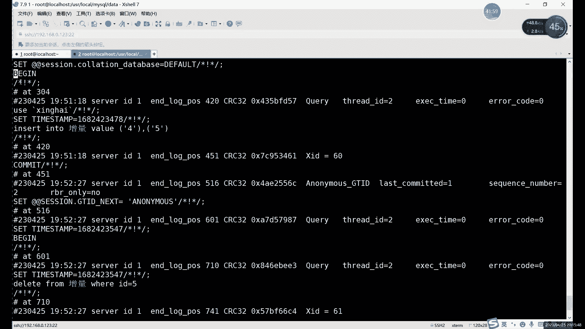
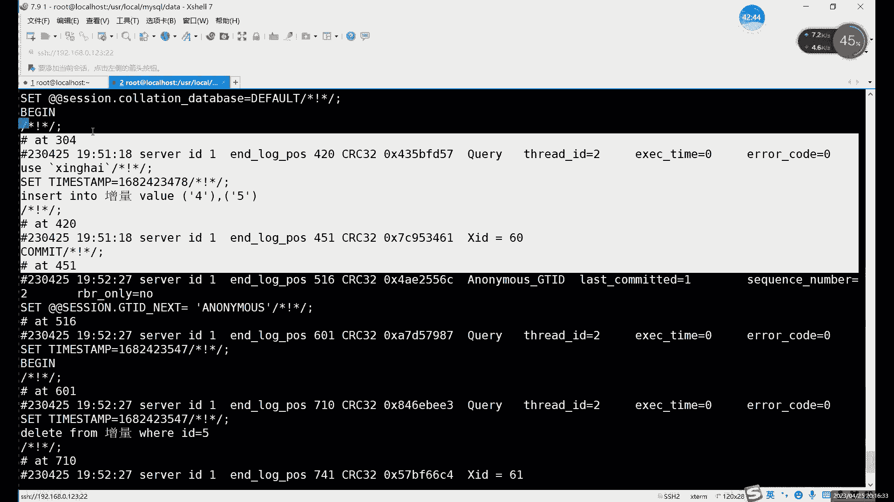
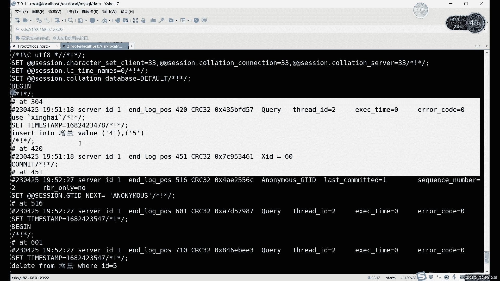
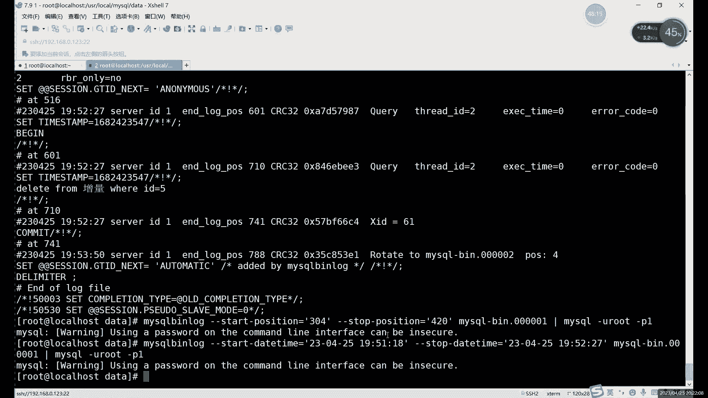

# MySQL备份与恢复：第19章：增量备份与恢复（上）


在本节课中，我们将学习MySQL数据库备份策略中非常重要的一种方式——增量备份。我们将了解其核心概念、工作原理，并通过实际操作演示如何执行增量备份与恢复。

## 概述：什么是增量备份？



上一节我们介绍了全量备份和逻辑备份。本节中，我们来看看增量备份。

增量备份是一种只备份自上次备份以来发生变化的数据的备份方式。与全量备份相比，它的优势在于备份数据量小、速度快，非常适合需要频繁备份的场景。

## 增量备份的核心原理

增量备份的实现，依赖于MySQL的**二进制日志**。

二进制日志会记录所有对数据库数据进行修改的操作，例如 `INSERT`、`UPDATE`、`DELETE` 等。它不会记录 `SELECT` 这类查询操作。因此，增量备份的本质，就是备份这些记录了数据变更的二进制日志文件。

**核心公式**：
```
增量备份内容 = 自上次备份以来的所有二进制日志
```

## 准备工作：开启二进制日志

要进行增量备份，首先必须确保MySQL服务器开启了二进制日志功能。

以下是检查与开启二进制日志的步骤：

1.  **检查当前状态**：登录MySQL，执行以下命令查看二进制日志是否开启。
    ```sql
    SHOW VARIABLES LIKE ‘log_bin’;
    ```
    如果 `Value` 为 `ON`，则表示已开启。

2.  **修改配置文件**：如果未开启，需要编辑MySQL的配置文件（通常是 `/etc/my.cnf` 或 `/etc/mysql/my.cnf`），在 `[mysqld]` 部分添加或修改以下配置：
    ```ini
    [mysqld]
    log-bin=mysql-bin  # 启用二进制日志，并设置日志文件的前缀名为mysql-bin
    server-id=1        # 为主从复制准备一个唯一的服务器ID
    ```

3.  **重启MySQL服务**：修改配置后，需要重启MySQL服务使配置生效。
    ```bash
    systemctl restart mysqld
    ```

## 增量备份实战演练

接下来，我们通过一个完整的例子来演示如何进行增量备份与恢复。

### 第一步：环境初始化与全量备份

增量备份需要一个基准。因此，我们首先需要做一次全量备份。

1.  **创建测试环境**：我们创建一个简单的数据库和表，以便观察。
    ```sql
    -- 创建一个测试数据库（如果不存在）
    CREATE DATABASE IF NOT EXISTS test_increment;
    USE test_increment;

    -- 创建一个简单的测试表
    CREATE TABLE inc_demo (
        id INT PRIMARY KEY,
        value VARCHAR(10)
    );

    -- 插入一些初始数据，作为全量备份的基准
    INSERT INTO inc_demo VALUES (1, ‘A’), (2, ‘B’), (3, ‘C’);
    ```

2.  **执行全量备份**：使用 `mysqldump` 命令对 `test_increment` 数据库进行逻辑备份。
    ```bash
    mysqldump -u root -p --databases test_increment > /backup/full_backup.sql
    ```
    现在，`full_backup.sql` 文件包含了数据库的完整结构和数据。

### 第二步：模拟数据变更并执行增量备份

在全量备份之后，数据库产生了新的数据变化，这些变化将被记录到二进制日志中。

1.  **模拟数据变更**：执行一些增、删、改操作。
    ```sql
    USE test_increment;
    -- 增加数据
    INSERT INTO inc_demo VALUES (4, ‘D’);
    -- 修改数据
    UPDATE inc_demo SET value = ‘B_Updated’ WHERE id = 2;
    -- 删除数据
    DELETE FROM inc_demo WHERE id = 3;
    ```

2.  **执行增量备份**：增量备份就是备份自全量备份后产生的二进制日志。
    *   首先，刷新日志，使当前日志文件“封存”，新的变更会写入下一个新文件。这有助于我们清晰地划分备份区间。
        ```sql
        FLUSH LOGS;
        ```
    *   然后，找到并备份在数据变更期间使用的二进制日志文件。文件通常位于MySQL的数据目录（如 `/var/lib/mysql/`），名称类似 `mysql-bin.000001`。
        ```bash
        # 假设当前的二进制日志文件是 mysql-bin.000001
        cp /var/lib/mysql/mysql-bin.000001 /backup/incremental_backup_1.binlog
        ```
    这样，`incremental_backup_1.binlog` 文件就是我们第一次的增量备份。

### 第三步：数据恢复演练

现在，假设我们的 `inc_demo` 表被意外删除，我们需要使用备份进行恢复。

恢复的关键原则是：**先恢复全量备份，再按顺序恢复增量备份**。

1.  **“破坏”数据**：模拟故障。
    ```sql
    DROP TABLE test_increment.inc_demo;
    ```

2.  **关闭二进制日志（重要！）**：在恢复前，临时关闭二进制日志记录，避免恢复操作本身被记录，产生冗余日志。
    ```sql
    SET sql_log_bin = 0;
    ```

3.  **恢复全量备份**：这将把数据库恢复到执行全量备份时的状态（包含数据 1-A， 2-B， 3-C）。
    ```bash
    mysql -u root -p < /backup/full_backup.sql
    ```
    或者在MySQL命令行中：
    ```sql
    SOURCE /backup/full_backup.sql;
    ```

4.  **恢复增量备份**：使用 `mysqlbinlog` 工具将二进制日志文件转换为SQL语句并执行，从而重放数据变更。
    ```bash
    mysqlbinlog /backup/incremental_backup_1.binlog | mysql -u root -p
    ```
    执行后，数据库状态将变为：
    *   id=1: ‘A’ (未变)
    *   id=2: ‘B_Updated’ (已更新)
    *   id=3: (已被删除)
    *   id=4: ‘D’ (新增)

5.  **重新开启二进制日志**：恢复完成后，重新开启二进制日志记录。
    ```sql
    SET sql_log_bin = 1;
    ```

## 选择性恢复与日志管理

有时我们可能不需要恢复整个增量备份文件，而是只想恢复其中的部分操作。







`mysqlbinlog` 工具提供了基于**位置**或**时间点**的过滤功能。





*   **基于位置恢复**：每个二进制日志事件都有唯一的起始和结束位置。
    ```bash
    # 恢复从位置 开始 到位置 结束 之间的日志事件
    mysqlbinlog --start-position=开始位置 --stop-position=结束位置 mysql-bin.000001 | mysql -u root -p
    ```
*   **基于时间点恢复**：
    ```bash
    # 恢复从某个时间点开始到另一个时间点结束的日志事件
    mysqlbinlog --start-datetime=“2023-10-27 10:00:00” --stop-datetime=“2023-10-27 11:00:00” mysql-bin.000001 | mysql -u root -p
    ```
**注意**：基于时间点的恢复可能不够精确，因为同一秒内可能发生多个事件。因此，**基于位置的恢复是更推荐的方式**。

## 总结

本节课中我们一起学习了MySQL增量备份的核心知识。

我们了解到，增量备份通过备份**二进制日志**来实现，它只保存数据的变化量，因此效率非常高。其标准操作流程是：**首次进行全量备份，之后定期备份产生的二进制日志**。恢复时，需要**先恢复全量备份，再按时间顺序依次恢复增量备份**，并且在恢复前务必**临时关闭二进制日志**。

此外，我们还学习了如何使用 `mysqlbinlog` 工具进行更精细的**选择性恢复**。掌握增量备份，是构建高效、可靠数据库备份策略的关键一步。



在下节课中，我们将探讨二进制日志的另一个核心应用——主从复制，看看如何利用它来实现数据的实时同步与高可用。