# Linux运维进阶：P82：增量备份与主从复制（中）

在本节课中，我们将深入学习MySQL增量备份的恢复方法，并开始探讨MySQL主从复制的核心原理与配置前提。我们将通过具体的命令和步骤，帮助你掌握这些关键的运维技能。

## 增量备份的恢复方法

上一节我们介绍了如何通过二进制日志进行增量备份。本节中，我们来看看如何利用这些备份日志进行数据恢复。

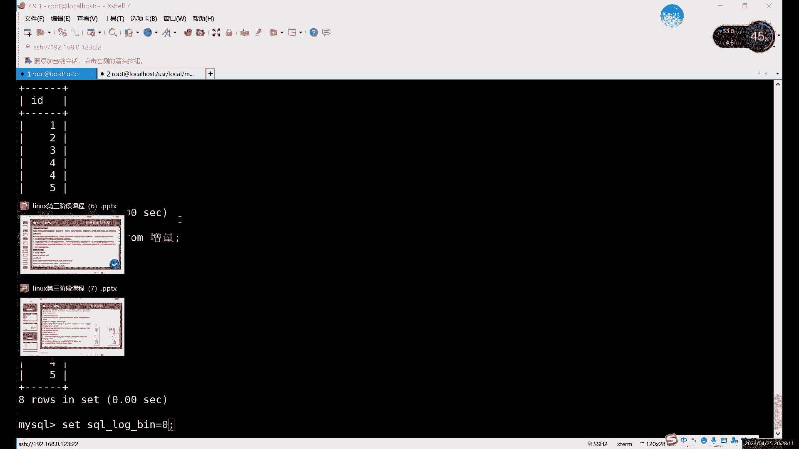

恢复增量备份的核心命令是 `mysqlbinlog`。它允许我们根据时间点或日志文件中的位置来恢复数据。

### 基于时间点的恢复

我们可以指定一个开始时间和结束时间来恢复特定时间段内的数据操作。命令格式如下：
```bash
mysqlbinlog --start-datetime="YYYY-MM-DD HH:MM:SS" --stop-datetime="YYYY-MM-DD HH:MM:SS" 日志文件名 | mysql -u用户名 -p密码
```
执行此命令后，在指定时间段内执行的所有SQL命令将被重新执行，从而恢复该时间段的数据变更。

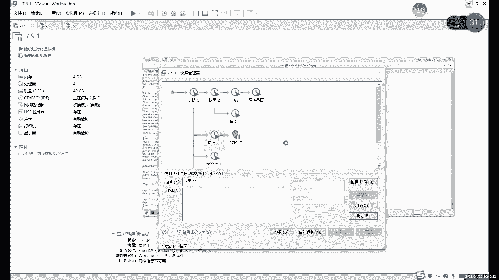

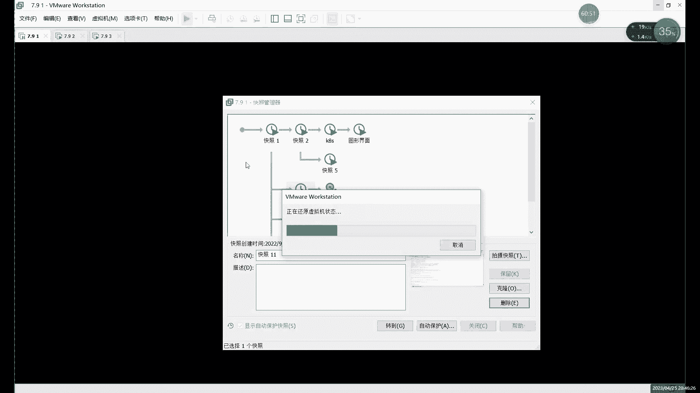

### 基于日志位置的恢复

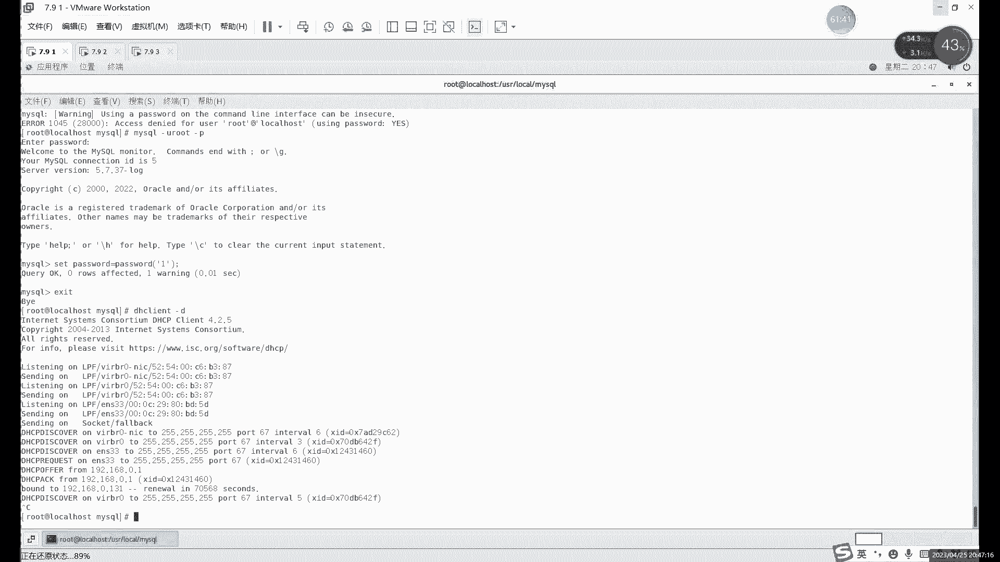

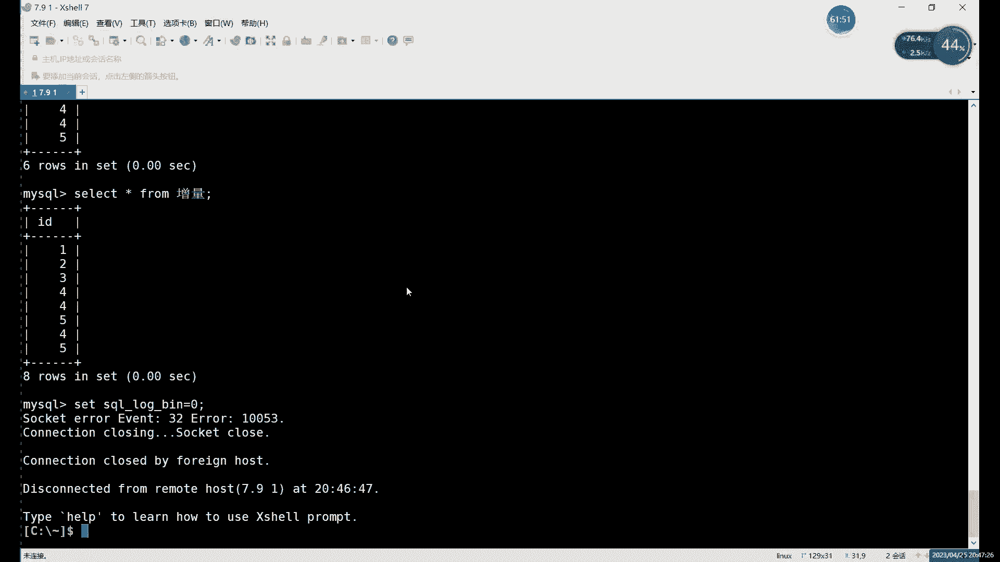

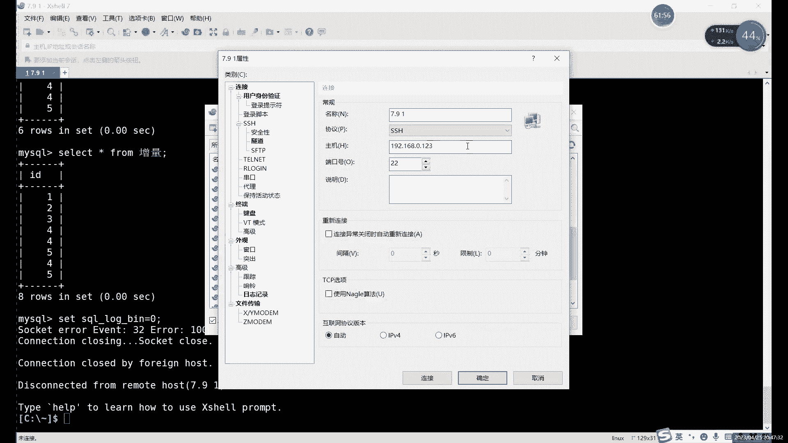

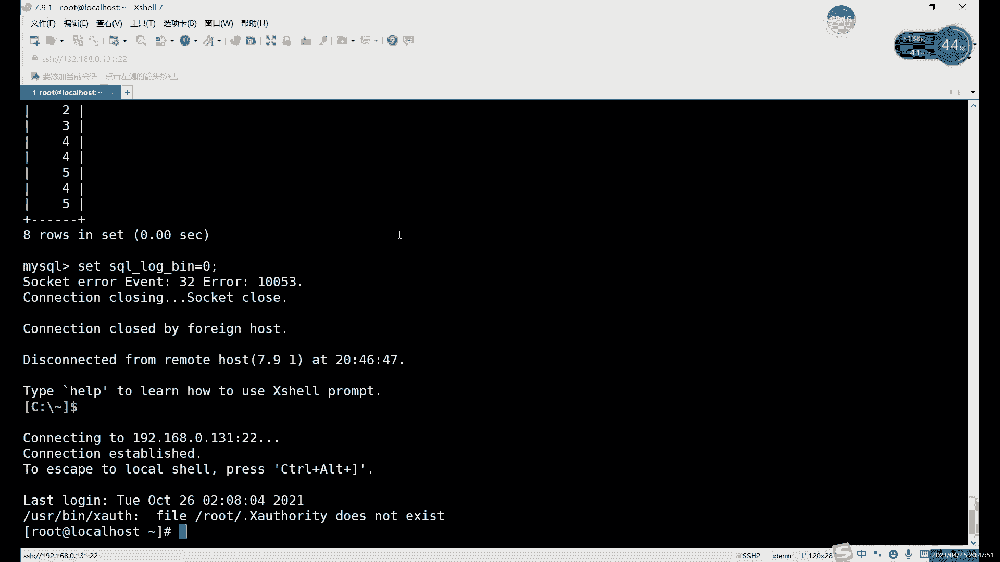

除了时间，我们还可以更精确地使用日志文件中的位置进行恢复。命令格式如下：
```bash
mysqlbinlog --start-position=开始位置 --stop-position=结束位置 日志文件名 | mysql -u用户名 -p密码
```
以下是关于这两种方法的注意事项：
*   **灵活性**：`--start-position` 和 `--stop-position` 可以只指定一个。如果只指定开始位置，则恢复到日志结尾；如果只指定结束位置，则从日志开头恢复到该位置。
*   **精确性**：**强烈建议使用基于位置的恢复**。因为时间点不够精确，同一秒内可能执行了多条命令，无法精确定位到单条命令。位置点是唯一且精确的标识。
*   **多文件处理**：如果有多个二进制日志文件需要恢复，必须**严格按照备份生成的顺序依次恢复**。顺序错误（例如先执行了删除命令，后执行插入命令）会导致数据状态错误。
*   **恢复后操作**：数据恢复完成后，**务必记得重新开启二进制日志记录功能**，否则后续的数据操作将无法被记录。

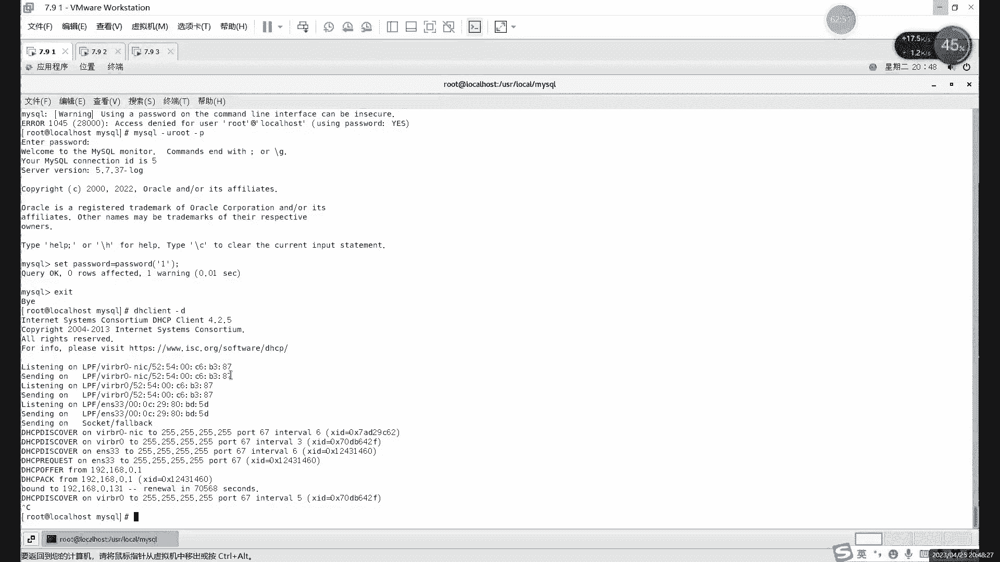

### 增量备份策略与恢复场景

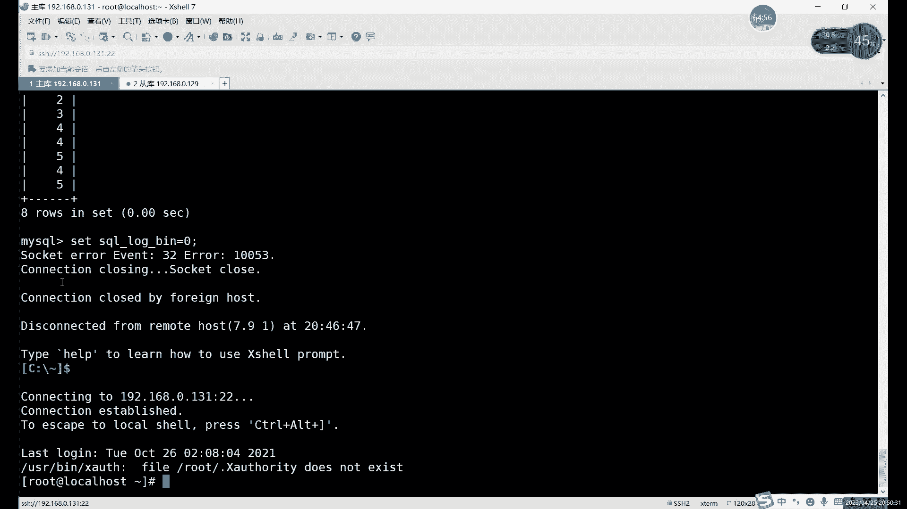

我们不可能无限制地只做增量备份。通常，我们会结合全量备份制定周期策略。

以下是合理的备份周期建议：
*   每周或每两周做一次**全量备份**。
*   每天做一次**增量备份**。

这样，即使发生故障，最多也只需要恢复一周内的几个增量备份文件，效率更高，风险更低。恢复场景主要分为两种：
1.  **服务器故障恢复**：需要恢复整个数据库。流程是：先恢复最近的全量备份，然后按顺序恢复之后的所有增量备份。
2.  **误操作恢复**：仅需恢复部分数据。可以不使用 `mysqlbinlog` 命令，而是直接查看二进制日志内容，找到误操作前的正确命令，手动复制执行。

对于需要恢复多个日志文件的情况，可以编写Shell脚本自动执行，但必须确保顺序正确。备份任务本身可以通过Linux的 `crontab` 计划任务来定时执行。

## MySQL主从复制原理与配置前提

接下来，我们将进入MySQL主从复制的学习。主从复制同样依赖于二进制日志。

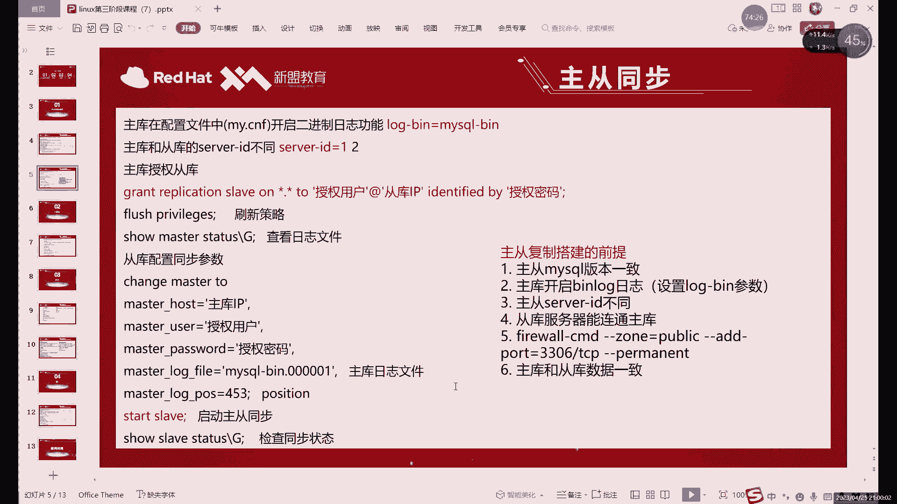

### 主从复制原理

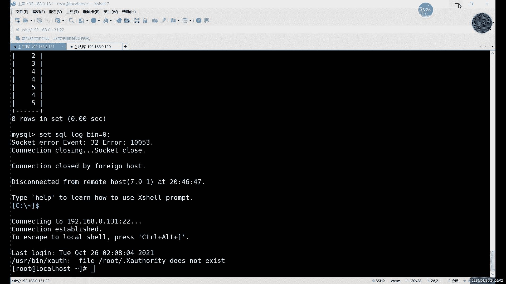

一句话概括原理：**通过二进制日志实现数据自动同步**。

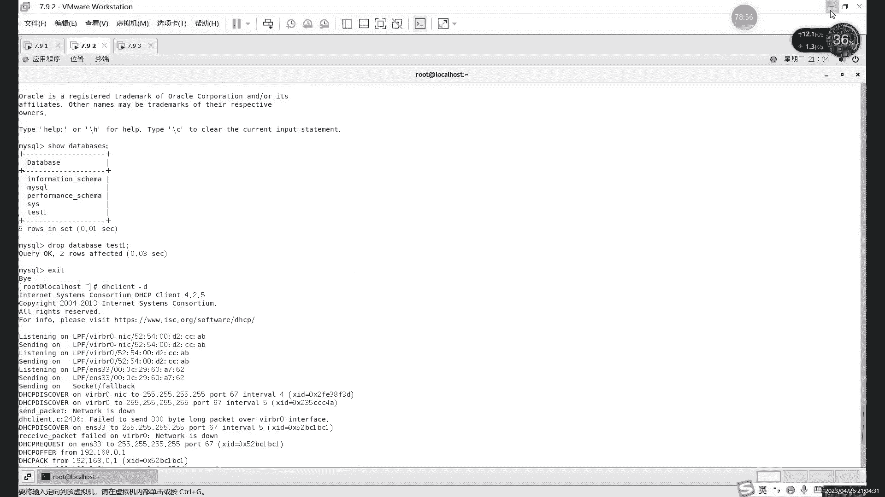

详细过程可以分为以下三步：
1.  **主库** 将数据的更改（增、删、改）记录到其**二进制日志**中。
2.  **从库** 启动一个**I/O线程**，连接到主库，读取主库的二进制日志变更，并将其写入到自己的**中继日志**中。
3.  **从库** 启动一个**SQL线程**，从中继日志中读取事件，并在本地重放执行这些SQL命令，从而使从库数据与主库保持一致。

这个过程的关键词是 **Replication**。

### 配置主从复制的前提条件

在开始配置前，必须满足以下六个条件，否则极易失败：

1.  **MySQL版本一致**：主从服务器的MySQL大版本号必须一致。
2.  **初始数据一致**：开始配置主从前，主库和从库的数据必须保持一致。这是最常见的失败原因。可以通过恢复快照、手动备份恢复等方式实现。
3.  **主库开启二进制日志**：主库必须启用 `log-bin` 选项。从库可以不开启。
4.  **配置唯一的Server ID**：主从服务器配置文件中的 `server-id` 值必须**唯一**，不能重复。避免使用虚拟机克隆来创建从库，因为克隆会导致ID相同。
5.  **从库能够网络连通主库**：需要在主库上为从库创建一个用于复制数据的用户，并授予复制权限。
6.  **配置防火墙规则**：确保防火墙没有阻止从库访问主库的3306端口。可以选择关闭防火墙或放行3306端口。

### 开始配置主从复制

假设我们有两台服务器：主库 (192.168.0.131) 和从库 (192.168.0.129)。均已安装相同版本的MySQL，且数据一致。

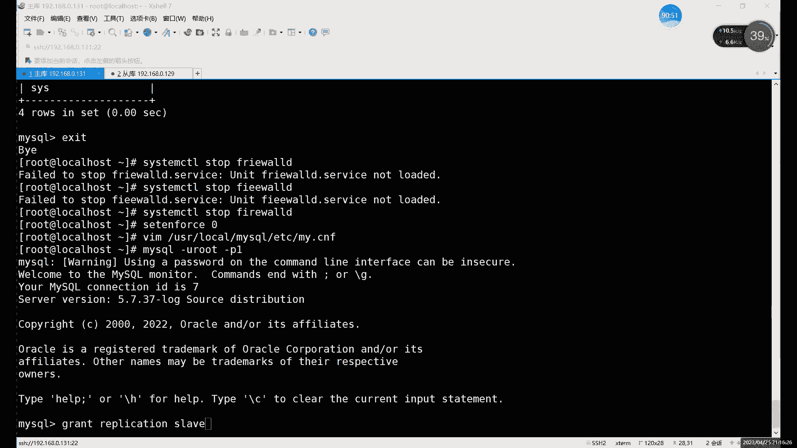

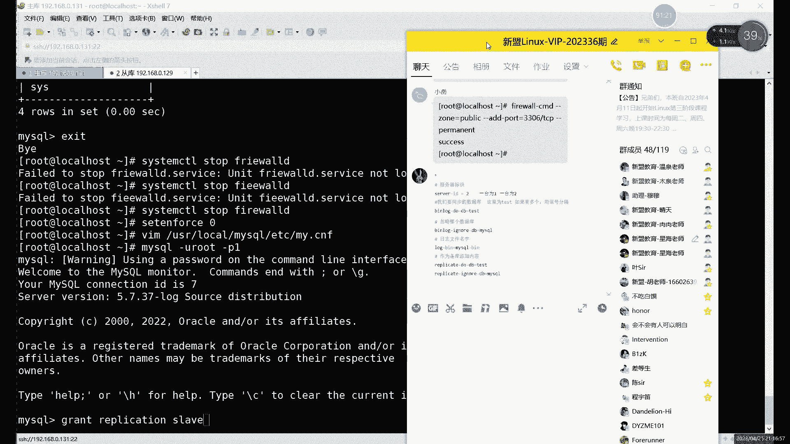

**第1步：确保防火墙已处理**
在从库上测试是否能访问主库端口，或直接关闭防火墙/放行端口。
```bash
# 临时关闭防火墙
systemctl stop firewalld
# 或放行3306端口
firewall-cmd --add-port=3306/tcp --permanent
firewall-cmd --reload
```

**第2步：配置主库Server ID并开启二进制日志**
编辑主库的MySQL配置文件（如 `/etc/my.cnf`）：
```ini
[mysqld]
server-id=131       # 设置一个唯一ID，这里用IP尾数
log-bin=mysql-bin   # 开启二进制日志
```
重启MySQL服务使配置生效：
```bash
systemctl restart mysqld
```

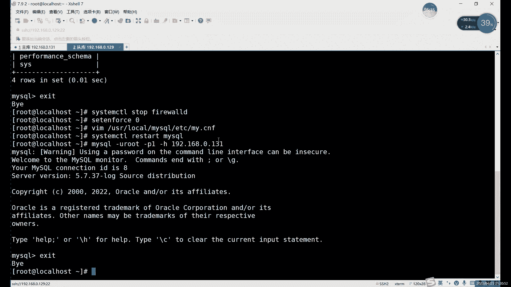

**第3步：在主库创建复制用户并授权**
登录主库MySQL，执行授权命令：
```sql
GRANT REPLICATION SLAVE ON *.* TO 'repl_user'@'192.168.0.129' IDENTIFIED BY 'YourPassword123!';
FLUSH PRIVILEGES;
```
*   `REPLICATION SLAVE` 是复制所需的权限，也可以用 `ALL PRIVILEGES`。
*   `'repl_user'@'192.168.0.129'` 指定了用户名和允许连接的从库IP。可以使用 `%` 通配符允许所有IP，但安全性较低。
*   执行后，建议在从库上用此用户密码连接主库，测试网络和授权是否成功。

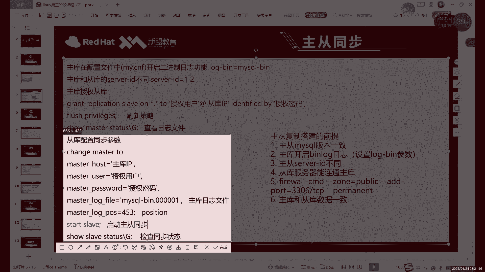

**第4步：查看主库当前日志状态**
在主库执行，记录下返回的 `File` 和 `Position` 值，后续配置从库时会用到。
```sql
SHOW MASTER STATUS;
```
输出示例：
```
+------------------+----------+--------------+------------------+
| File             | Position | Binlog_Do_DB | Binlog_Ignore_DB |
+------------------+----------+--------------+------------------+
| mysql-bin.000002 |      693 |              |                  |
+------------------+----------+--------------+------------------+
```

**第5步：配置从库连接主库**
登录从库MySQL，执行 `CHANGE MASTER TO` 命令，配置主库信息：
```sql
CHANGE MASTER TO
MASTER_HOST='192.168.0.131',
MASTER_USER='repl_user',
MASTER_PASSWORD='YourPassword123!',
MASTER_LOG_FILE='mysql-bin.000002',
MASTER_LOG_POS=693;
```
**注意**：`MASTER_LOG_POS` 的值是数字，**不要加引号**。

**第6步：启动从库复制进程并检查状态**
在从库MySQL中启动复制：
```sql
START SLAVE;
```
检查从库复制状态：
```sql
SHOW SLAVE STATUS\G
```
关键查看 `Slave_IO_Running` 和 `Slave_SQL_Running` 两项，如果都是 **Yes**，则表示主从复制连接建立成功。
```bash
Slave_IO_Running: Yes
Slave_SQL_Running: Yes
```

**第7步：验证主从同步**
在主库上执行一些数据操作，例如创建数据库、表或插入数据，然后在从库上查看是否同步成功。

**关于重启**：主库重启不影响复制。从库重启后，复制进程需要手动启动：
```sql
STOP SLAVE;
START SLAVE;
```

## 一主多从架构

一主多从的配置与一主一从基本相同，只需注意两点：
1.  每个从库的 `server-id` 必须唯一。
2.  在主库授权时，可以授权给多个从库IP，或直接使用 `'repl_user'@'192.168.0.%'` 网段形式，甚至 `'repl_user'@'%'`（允许任何IP，安全性低）。

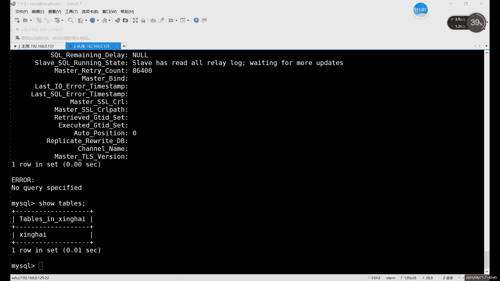

---

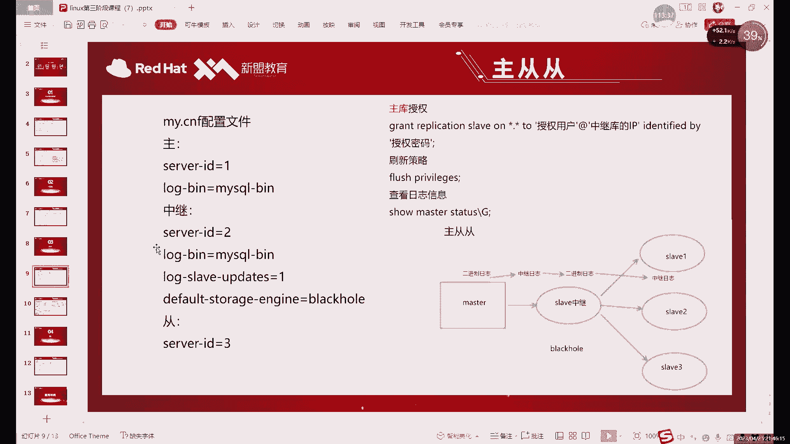

本节课中我们一起学习了MySQL增量备份的恢复技巧，以及MySQL主从复制的工作原理和详细配置步骤。重点掌握了基于位置点的精确恢复方法，以及配置主从复制必须满足的六个前提条件和具体的操作命令。理解这些原理和步骤，是构建稳定、可扩展数据库架构的基础。下节课我们将进一步探讨主从复制的更多高级话题。