# Linux运维进阶：P84：读写分离（上） 🚀


在本节课中，我们将学习什么是读写分离，以及它如何作为主从复制的优化方案来提升数据库集群的性能和稳定性。我们将从原理入手，并开始搭建一个基于MyCat的读写分离环境。

上一节我们介绍了主从复制，它实现了数据的实时同步与备份，保证了数据的安全性。然而，主从架构存在一个潜在问题：所有的读写压力都集中在主库上。本节中，我们来看看如何通过读写分离来优化这个问题。

## 读写分离的原理与优势

读写分离的核心思想是将数据库的“读”操作和“写”操作分离开来。

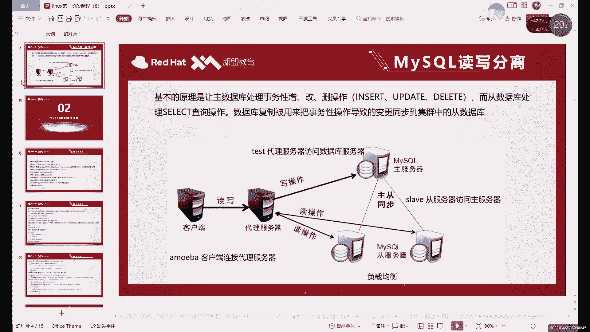

*   **写操作**（增、删、改）由主库（Master）处理。
*   **读操作**（查询）则分配给一个或多个从库（Slave）来处理。

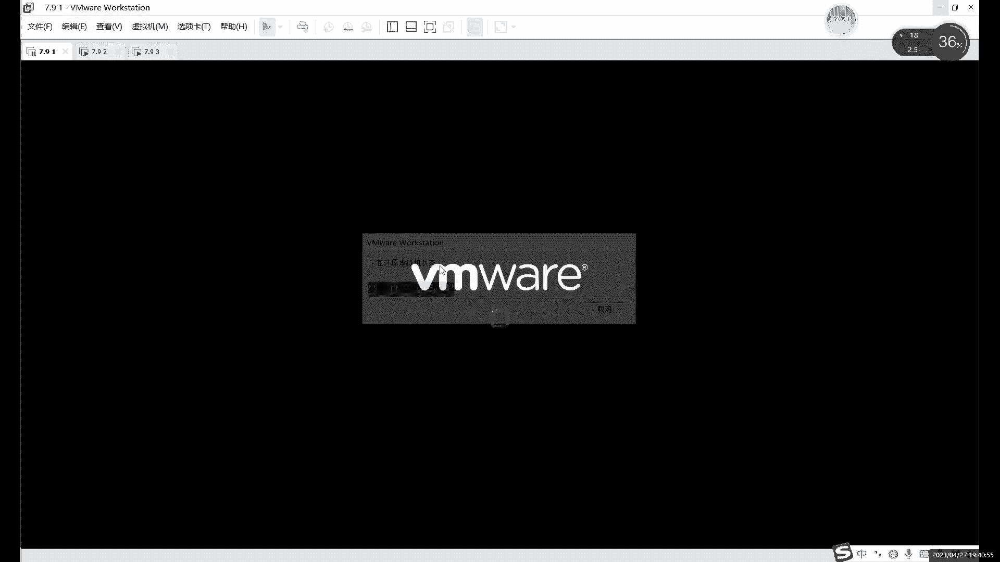

这样做的好处是显而易见的：
1.  **减轻主库压力**：将占比较高的读请求分流到从库，显著降低了主库的负载。
2.  **提升并发能力**：从库可以专注于处理查询请求，提升了整个数据库集群的并发处理能力。
3.  **高可用性基础**：为后续实现故障自动切换等高可用方案奠定了基础。

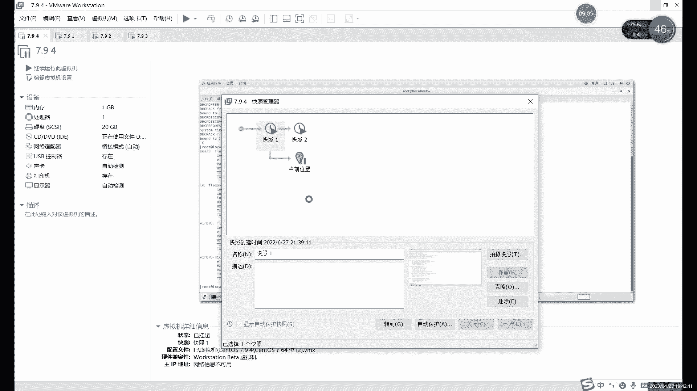

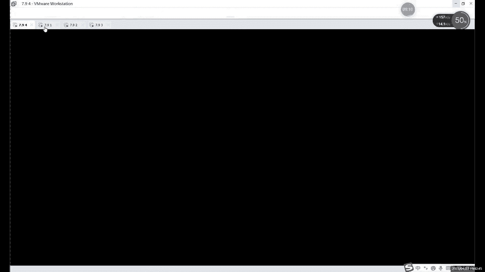

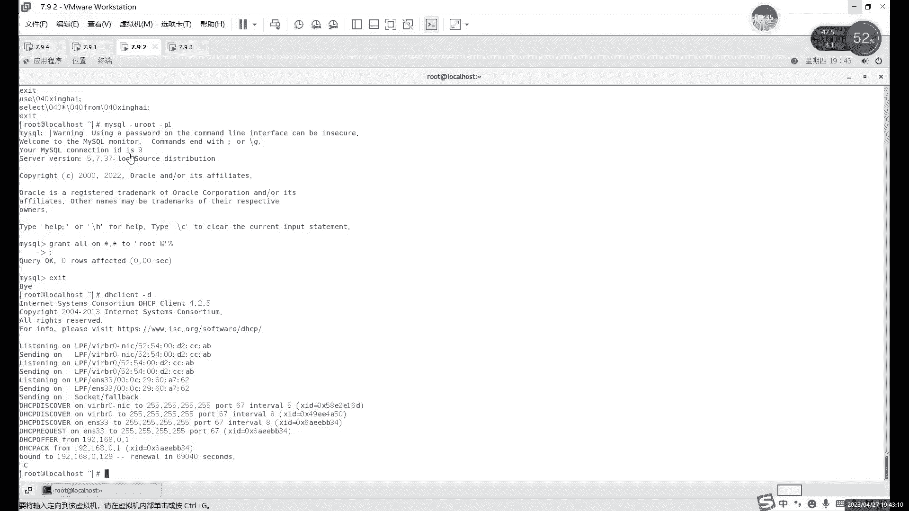

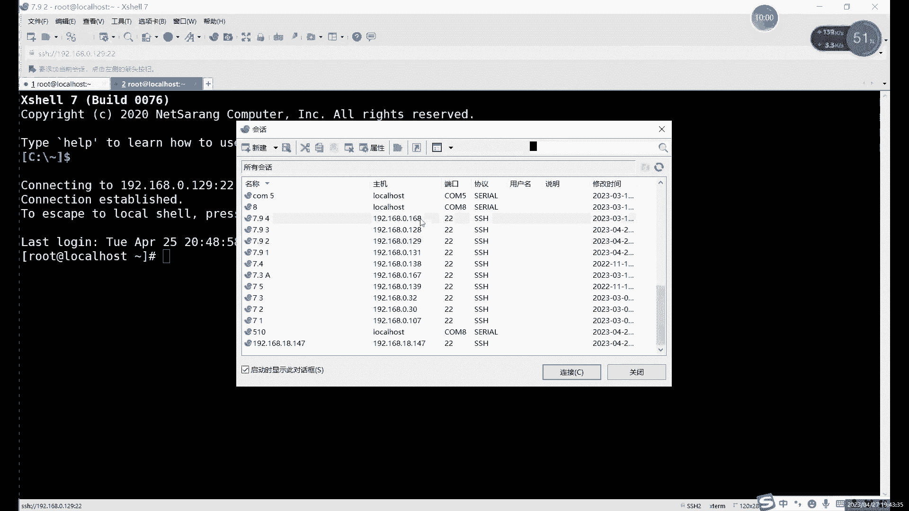

需要注意的是，由于主从复制是单向的（数据从主库同步到从库），因此**写操作必须指向主库**。如果让从库执行写操作，数据将无法同步回主库，导致数据不一致。

## 实验环境与架构准备

我们的实验基于上节课已完成的主从复制环境。以下是本次实验的架构图：

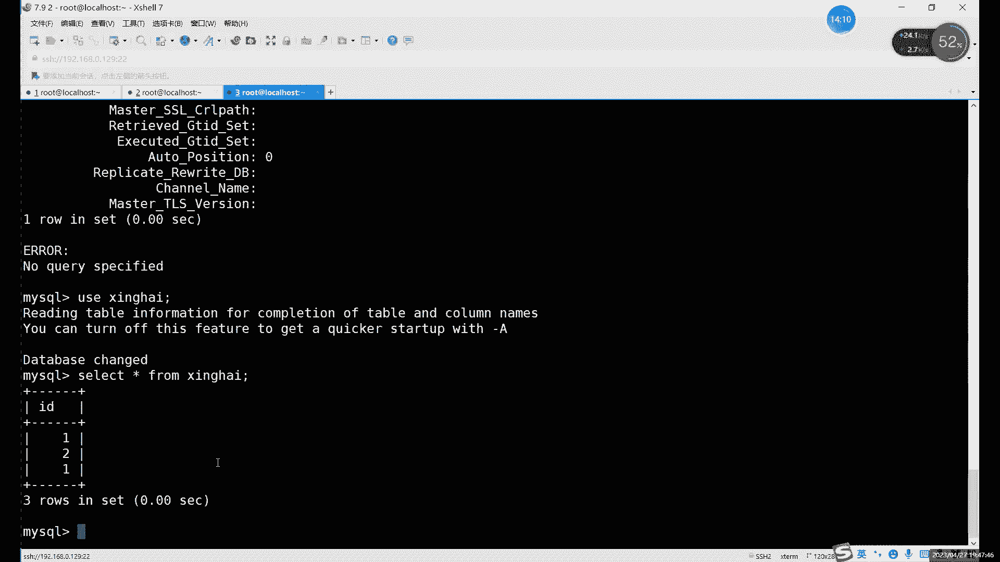


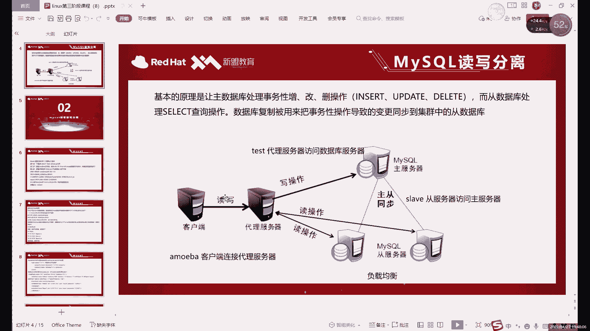

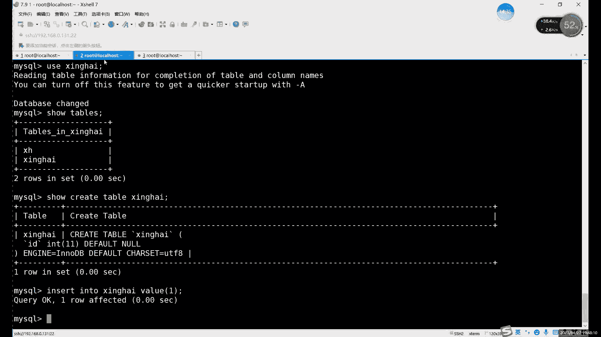

架构说明：
*   **主库 (Master)**：IP为 `192.168.0.131`，负责处理所有写操作。
*   **从库 (Slave)**：IP为 `192.168.0.129`，负责处理所有读操作，并实时同步主库数据。
*   **代理服务器 (MyCat)**：IP为 `192.168.0.254`，作为中间件，负责拦截SQL请求，并根据其类型（读/写）分发到对应的后端数据库。

在开始前，请确保您的主从复制已经配置成功并可以正常同步数据。

## 配置数据库访问授权

在读写分离架构中，涉及到三类用户授权，理解它们至关重要：

1.  **客户端连接代理服务器的用户**：用于应用程序或用户登录到MyCat代理。
2.  **代理服务器连接后端数据库的用户**：用于MyCat代理登录到真实的主库和从库。
3.  **主从复制同步的用户**：在上节课已配置完成。


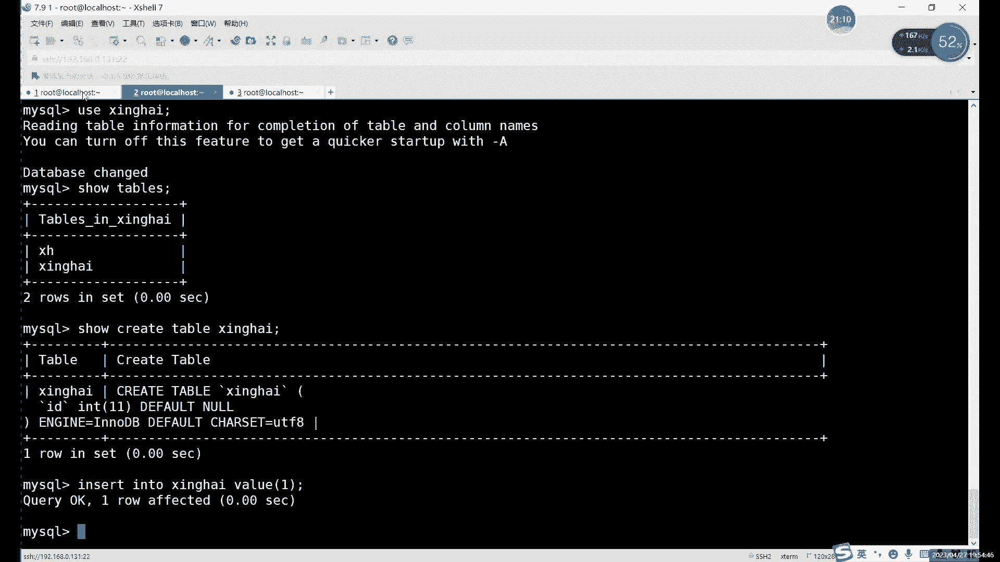

现在，我们需要在后端的主库和从库上，为MyCat代理创建访问账号。

请在**主库**和**从库**上分别执行以下授权命令（以root用户为例，生产环境建议使用独立账号）：
```sql
GRANT ALL PRIVILEGES ON *.* TO 'root'@'192.168.0.254' IDENTIFIED BY '123456' WITH GRANT OPTION;
FLUSH PRIVILEGES;
```
这条命令允许IP为 `192.168.0.254`（即MyCat服务器）的root用户，使用密码 `123456` 访问所有数据库的所有权限。

## 安装与配置MyCat

MyCat是一个使用Java编写的数据库中间件，我们需要先为其准备Java运行环境。

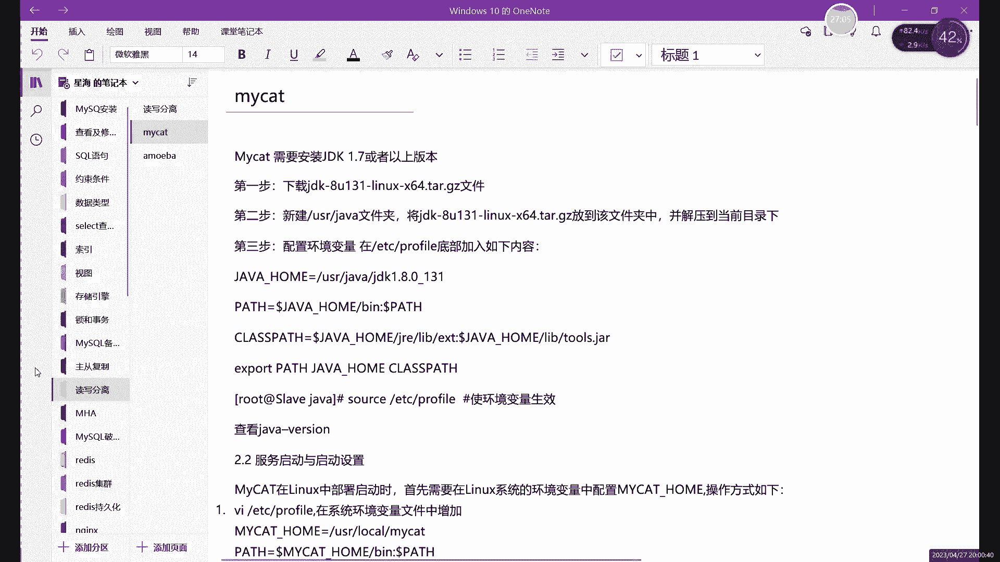

### 步骤一：安装JDK

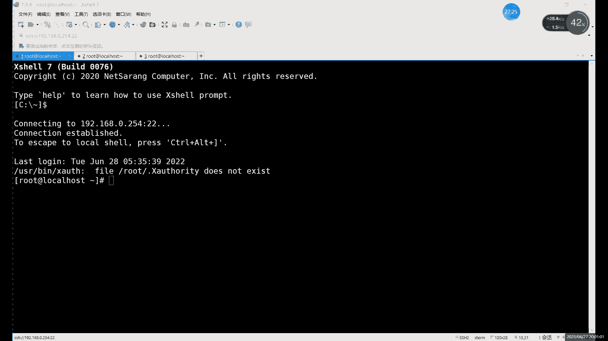

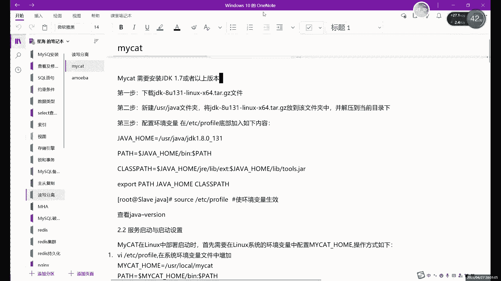

以下是安装JDK 1.8的步骤：

1.  上传JDK安装包（如 `jdk-8u91-linux-x64.tar.gz`）到服务器。
2.  解压安装包：
    ```bash
    tar -zxvf jdk-8u91-linux-x64.tar.gz
    ```
3.  将解压后的目录移动到合适位置（例如 `/usr/local/java`）：
    ```bash
    mkdir -p /usr/local/java
    cp -rp jdk1.8.0_91 /usr/local/java/
    ```
4.  配置环境变量，编辑 `/etc/profile` 文件，在末尾添加：
    ```bash
    export JAVA_HOME=/usr/local/java/jdk1.8.0_91
    export PATH=$JAVA_HOME/bin:$PATH
    ```
5.  使环境变量生效：
    ```bash
    source /etc/profile
    ```
6.  验证安装：
    ```bash
    java -version
    ```
    如果显示JDK版本信息，则表示安装成功。

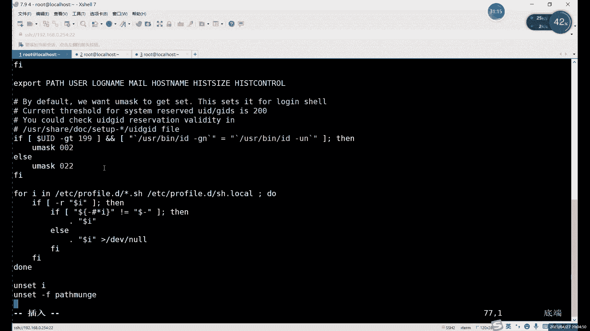

### 步骤二：安装MyCat

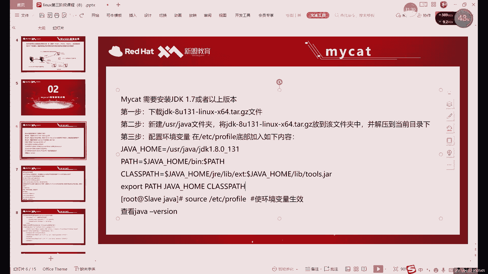

1.  上传MyCat安装包（如 `Mycat-server-1.6.7.6-release-20220524173810-linux.tar.gz`）到服务器。
2.  解压安装包：
    ```bash
    tar -zxvf Mycat-server-1.6.7.6-release-20220524173810-linux.tar.gz
    ```
3.  将解压后的目录移动到合适位置（例如 `/usr/local/mycat`）：
    ```bash
    mkdir -p /usr/local/mycat
    cp -rp mycat /usr/local/mycat/
    ```
4.  配置MyCat环境变量，编辑 `/etc/profile` 文件，在末尾添加：
    ```bash
    export MYCAT_HOME=/usr/local/mycat
    export PATH=$MYCAT_HOME/bin:$PATH
    ```
5.  使环境变量生效：
    ```bash
    source /etc/profile
    ```

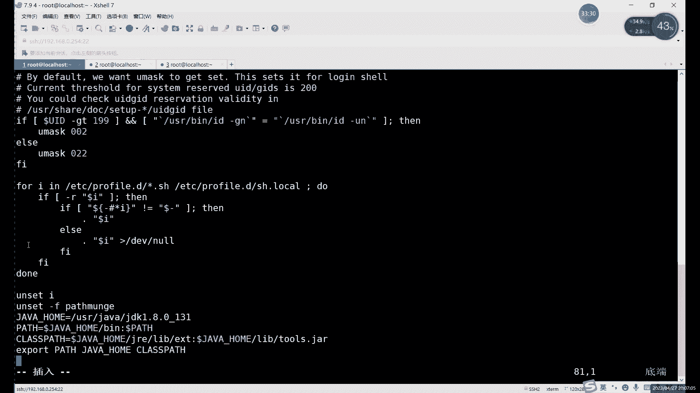

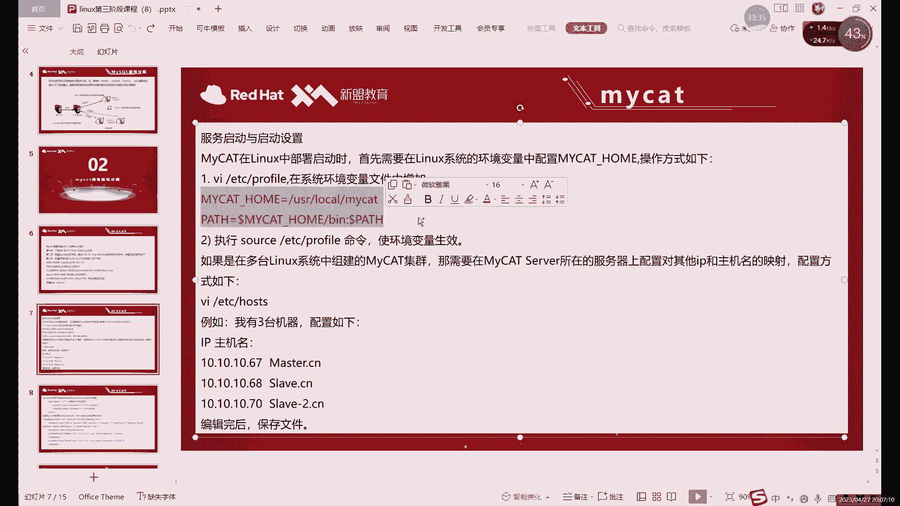

### 步骤三：配置MyCat

MyCat的核心配置主要集中在 `conf` 目录下的两个文件：`server.xml` 和 `schema.xml`。

#### 1. 配置 `server.xml`（用户与虚拟库）

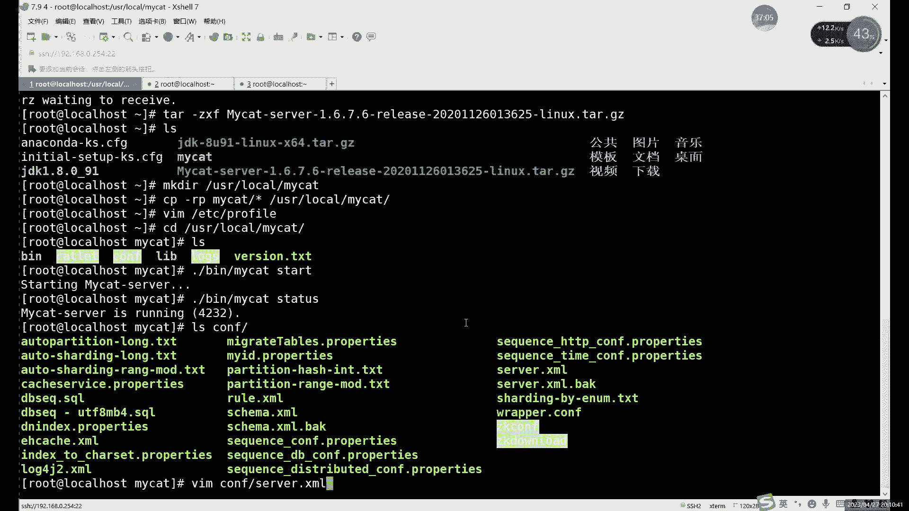

此文件用于定义连接到MyCat的客户端用户信息。

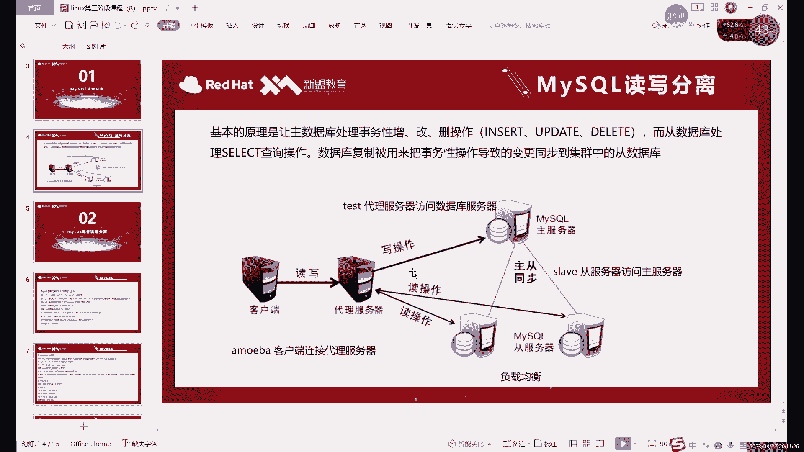

编辑 `/usr/local/mycat/conf/server.xml`，找到末尾的 `<user>` 标签部分：
```xml
<user name="root" defaultAccount="true">
    <property name="password">123456</property>
    <property name="schemas">TESTDB</property>
    <!-- 其他权限配置... -->
</user>
```
*   `name` 和 `password`：客户端连接MyCat时使用的用户名和密码。
*   `schemas`：客户端登录后看到的**逻辑数据库名**（虚拟数据库），此处为 `TESTDB`。这个名称需要与后续 `schema.xml` 中的配置对应。

#### 2. 配置 `schema.xml`（数据节点与读写规则）

此文件用于定义真实的数据源、数据分片以及读写分离规则。这是最关键的一步。

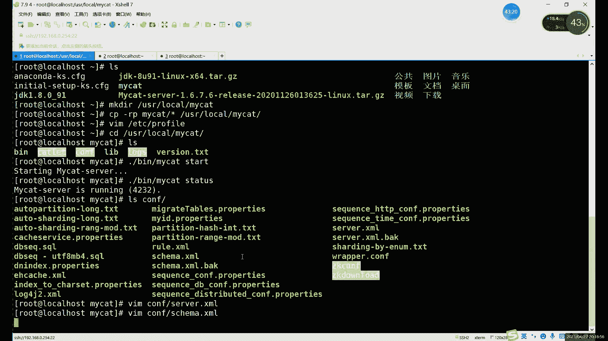

编辑 `/usr/local/mycat/conf/schema.xml`，我们需要将其内容修改为适应我们的一主一从架构。

以下是关键的配置项说明与示例：

```xml
<?xml version="1.0"?>
<!DOCTYPE mycat:schema SYSTEM "schema.dtd">
<mycat:schema xmlns:mycat="http://io.mycat/">

    <!-- 定义逻辑库，name属性与server.xml中的schemas对应 -->
    <schema name="TESTDB" checkSQLschema="true" sqlMaxLimit="100" dataNode="dn1">
    </schema>

    <!-- 定义数据节点，name为逻辑名称，dataHost指向物理主机组，database为真实数据库名 -->
    <dataNode name="dn1" dataHost="host1" database="your_real_db_name" />

    <!-- 定义物理主机组 -->
    <dataHost name="host1" maxCon="1000" minCon="10" balance="3"
              writeType="0" dbType="mysql" dbDriver="native" switchType="1"  slaveThreshold="100">
        <!-- 心跳检测语句 -->
        <heartbeat>select user()</heartbeat>

        <!-- 写节点（主库）配置 -->
        <writeHost host="hostM1" url="192.168.0.131:3306" user="root" password="123456">
            <!-- 读节点（从库）配置 -->
            <readHost host="hostS1" url="192.168.0.129:3306" user="root" password="123456" />
        </writeHost>
    </dataHost>
</mycat:schema>
```

**核心参数解释：**

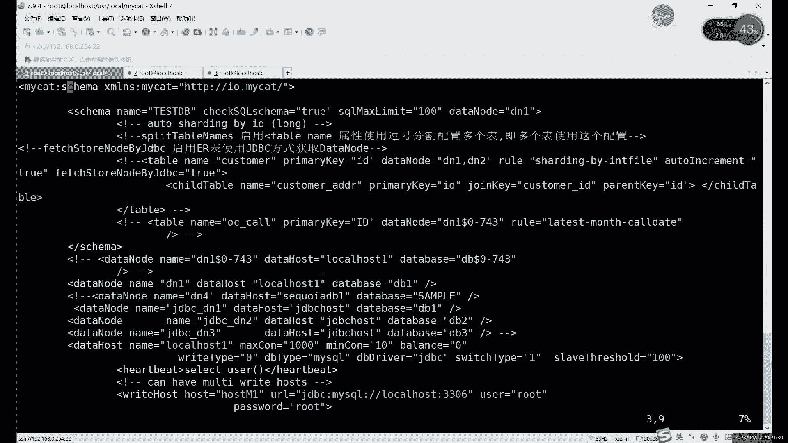

*   `dataNode`： 将逻辑库 `TESTDB` 映射到名为 `dn1` 的数据节点。
*   `dataHost`： 定义了一个物理数据库主机组 `host1`。
    *   `balance`： **负载均衡模式**，这是读写分离的关键设置。
        *   `0`： 不开启读写分离。
        *   `1`： 所有读请求随机分发到 `writeHost` 和 `readHost`。
        *   `2`： 所有读请求随机分发到所有 `readHost`。
        *   `3`： **所有读请求全部分发到 `writeHost` 对应的 `readHost` 上**（即仅从库负责读）。这是最常用的彻底读写分离模式，我们选择 `3`。
    *   `writeType`： 写操作分发方式，`0` 表示所有写操作发送到第一个 `writeHost`。
    *   `switchType`： 故障切换模式，`1` 表示自动切换。
*   `writeHost`： 定义主库的连接信息。
*   `readHost`： 定义从库的连接信息，嵌套在对应的 `writeHost` 内。

**⚠️ 重要提示：**
*   请将 `database="your_real_db_name"` 替换为您在主从服务器上**实际存在**的数据库名。
*   确保 `writeHost` 和 `readHost` 中的 `user`、`password` 与之前在数据库上授权的账号一致。
*   配置文件对格式和拼写非常敏感，修改时请务必仔细。

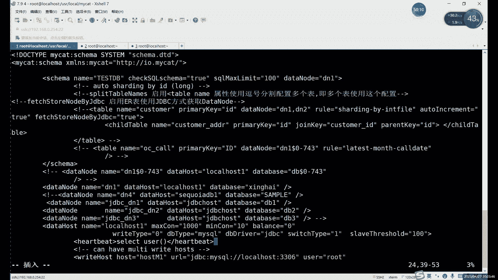

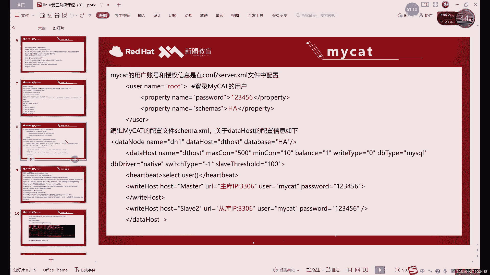

## 启动MyCat服务

配置完成后，就可以启动MyCat了。

1.  进入MyCat的bin目录：
    ```bash
    cd /usr/local/mycat/bin
    ```
2.  启动MyCat：
    ```bash
    ./mycat start
    ```
3.  查看启动状态：
    ```bash
    ./mycat status
    ```
    如果显示 `Mycat-server is running (PID: ...)`，则表示启动成功。

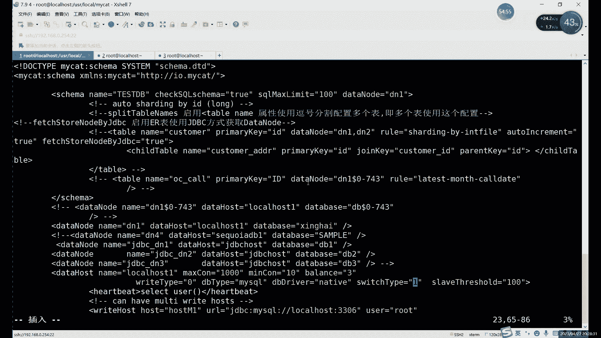

本节课中我们一起学习了读写分离的基本原理、架构优势，并完成了MyCat中间件的安装与基础配置。我们明确了三类用户授权的作用，并重点讲解了 `schema.xml` 中 `balance` 等关键参数的配置意义。

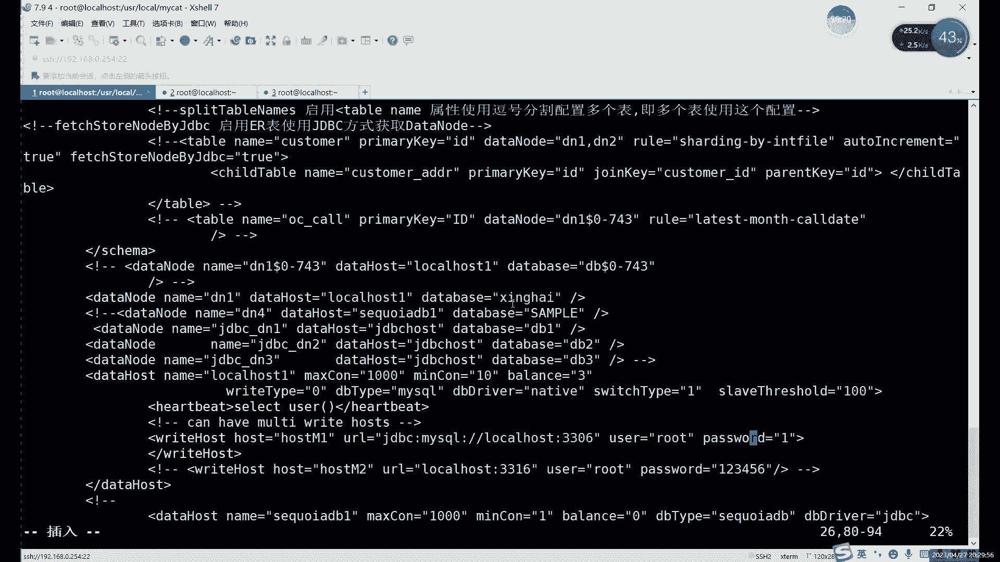

下一节，我们将进行连接测试，验证读写分离是否生效，并探讨更多高级配置与故障处理场景。