# Linux运维进阶：P85：中级运维-23.读写分离-中 🚀

在本节课中，我们将要学习如何配置MyCat中间件以实现读写分离。我们将详细讲解配置文件的修改、服务的重启与验证，并对比MyCat与另一个中间件Amoeba（变形虫）在读写分离实现上的异同。

## 概述 📋

上一节我们介绍了读写分离的基本概念和MyCat的初步配置。本节中，我们来看看如何完成MyCat的详细配置，并进行功能验证。核心在于正确修改`schema.xml`文件，定义主库和从库，并设置读写分离策略。

## MyCat读写分离配置详解 ⚙️

### 1. 配置主库与从库信息

以下是`schema.xml`文件中定义数据源的关键部分。我们需要在`<dataHost>`标签内配置写主机（主库）和读主机（从库）。

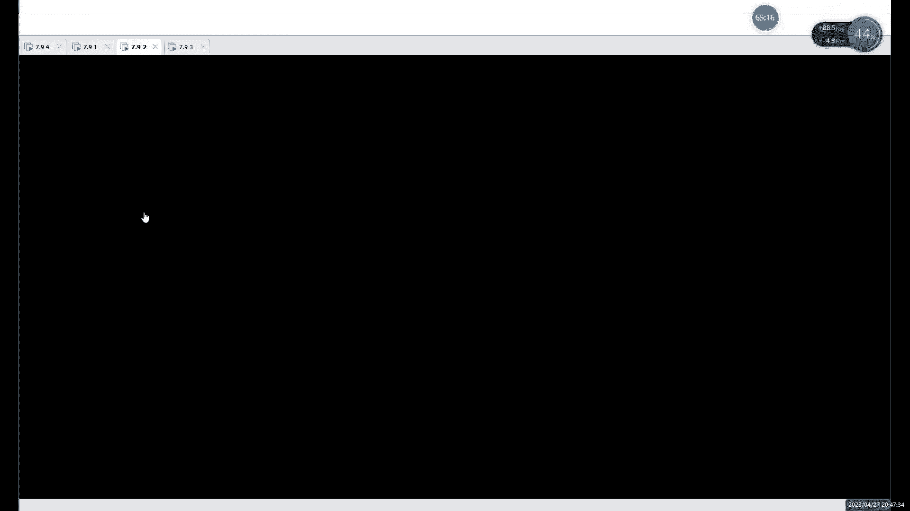

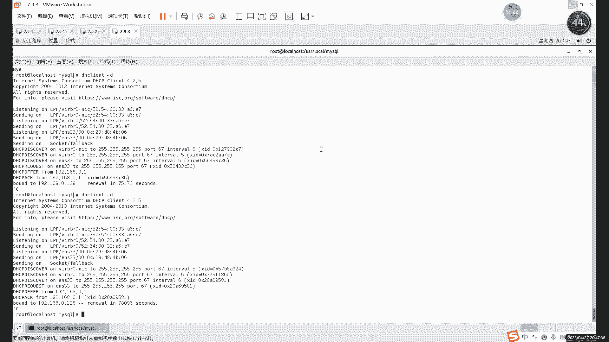

**核心配置代码**：
```xml
<dataHost name="localhost1" maxCon="1000" minCon="10" balance="3"
          writeType="0" dbType="mysql" dbDriver="native" switchType="1">
    <heartbeat>select user()</heartbeat>
    <!-- 写主机（主库）配置 -->
    <writeHost host="hostM1" url="192.168.0.131:3306" user="root" password="123456">
        <!-- 读主机（从库）配置 -->
        <readHost host="hostS1" url="192.168.0.129:3306" user="root" password="123456"/>
    </writeHost>
</dataHost>
```

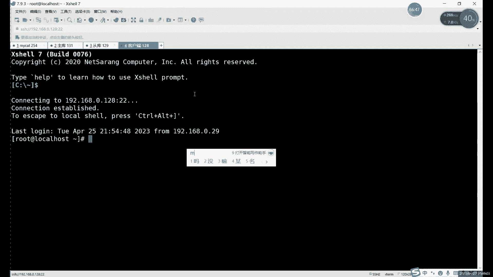

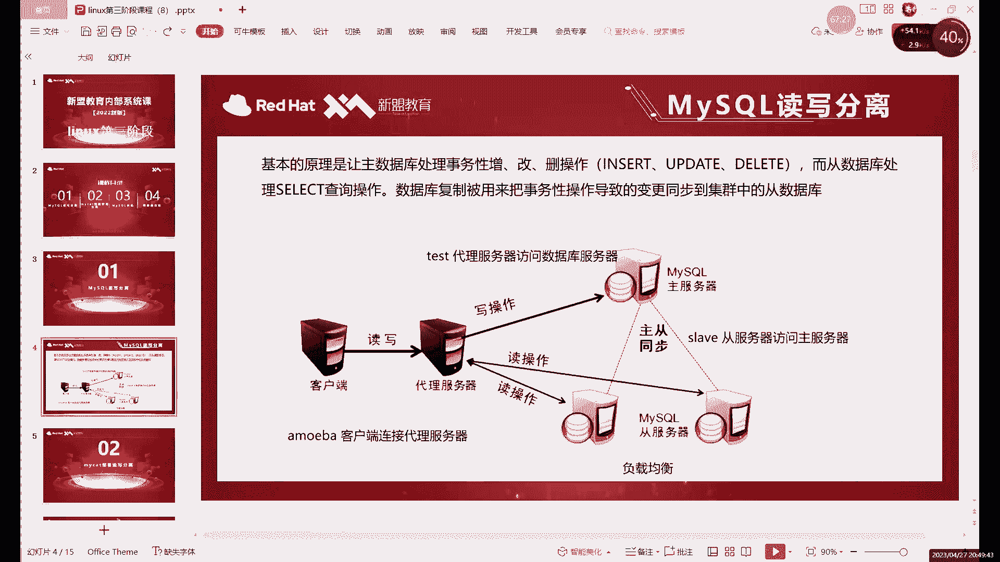

**配置要点说明**：
*   **`<writeHost>`**：定义主库的连接信息，包括IP、端口、用户名和密码。
*   **`<readHost>`**：定义从库的连接信息，嵌套在`<writeHost>`标签内。
*   **`balance`参数**：负载均衡模式。设置为`3`表示所有读请求都发送到从库，实现读写完全分离。
*   **`switchType`参数**：设置为主库故障时是否自动切换到从库。`1`表示自动切换。
*   **`dbDriver`**：必须使用`native`，使用JDBC驱动重启服务可能会报错。
*   **标签闭合**：XML格式要求严格，必须有始有终，确保每个开始标签都有对应的结束标签。

### 2. 重启MyCat服务并检查状态

配置文件修改完成后，需要重启MyCat服务使配置生效。

以下是重启和检查服务的命令：
```bash
# 进入MyCat的bin目录
cd /usr/local/mycat/bin

# 重启MyCat服务
./mycat restart

# 检查MyCat服务状态
./mycat status
```
**状态说明**：
*   如果输出 `MyCat-server is running`，表示服务启动成功。
*   如果输出 `MyCat-server is not running`，表示配置文件有错误，服务启动失败。

### 3. 查看日志排查错误

如果服务启动失败，需要查看日志来定位问题。

以下是查看启动日志的命令：
```bash
./mycat console
```
执行此命令后，如果启动过程有错误，会在控制台显示具体的错误信息，例如某个单词拼写错误或配置项格式不正确。根据提示修改`schema.xml`文件即可。

## 验证读写分离效果 🔍

服务成功启动后，我们需要验证读写分离是否配置正确。

### 1. 客户端连接MyCat

MyCat作为一个代理，监听在`8066`端口（非MySQL默认的3306端口）。我们需要使用MySQL客户端命令进行连接。

连接命令如下：
```bash
mysql -uroot -p123456 -h 192.168.0.254 -P 8066
```
**参数解释**：
*   `-h`：指定MyCat服务器的IP地址。
*   `-P`：指定MyCat的服务端口（8066）。
*   用户名和密码是在MyCat的`server.xml`文件中配置的，用于登录MyCat代理，与后端真实的MySQL数据库密码无关。

### 2. 验证读写操作

连接成功后，可以像操作普通MySQL数据库一样执行SQL语句。

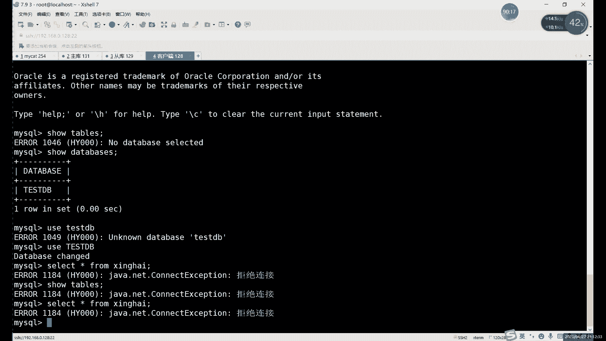

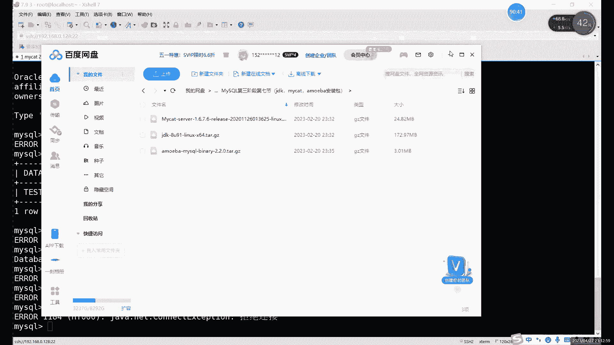

操作步骤如下：
1.  查看数据库：`show databases;` 会显示`schema.xml`中定义的逻辑数据库（如`TESTDB`）。
2.  使用数据库：`use TESTDB;`
3.  查看表：`show tables;` 会显示从真实主库同步过来的表。
4.  执行**读操作**（如`select`）和**写操作**（如`insert`），在读写分离配置正确的情况下，它们会被路由到不同的数据库实例。

### 3. 通过停止主从复制验证分离效果

为了更直观地看到效果，可以临时停止MySQL的主从复制。

操作步骤如下：
1.  在从库服务器上执行：`stop slave;`
2.  此时，通过MyCat执行`insert`语句，数据只会写入主库。
3.  再执行`select`语句查询刚插入的数据，由于主从复制已停止，从库没有新数据，因此查询结果为空。这直接证明了**写操作走主库，读操作走从库**。
4.  验证完成后，记得在从库恢复复制：`start slave;`

## MyCat与Amoeba（变形虫）对比 ⚖️

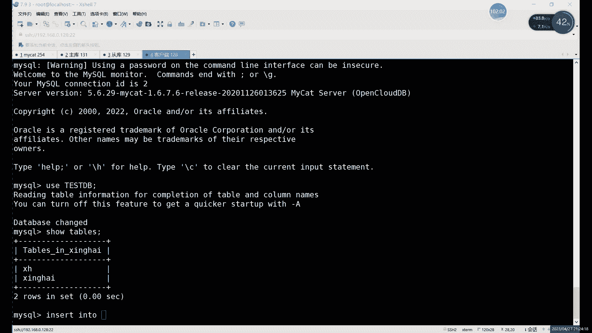

上一节我们完成了MyCat的配置与验证，本节中我们来看看另一个常用的读写分离中间件——Amoeba（变形虫），并比较两者的特点。

### 架构设计差异

以下是两者核心架构的对比：

*   **MyCat架构**：
    *   采用**分组**模式。一个主库和其关联的从库被定义在同一个`<dataHost>`组内。
    *   读写分离策略（如`balance=”3″`）在该组内生效。
    *   优点：便于实现**主库故障时，同一组内的从库自动切换**为写库，高可用性较好。
    *   配置相对复杂。

*   **Amoeba架构**：
    *   采用**池化**模式。将所有写库（主库）放入一个写池，将所有读库（从库）放入一个读池。
    *   请求直接根据类型（读/写）分发到不同的池。
    *   优点：**负载均衡策略更灵活**，可以轻松实现多个主库分担写压力，多个从库分担读压力。
    *   缺点：**不具备主从自动切换能力**，需要依赖其他高可用方案。

### 选择建议

*   如果项目需要简单的读写分离，并且对**负载均衡的灵活性要求更高**，可以选择**Amoeba**。
*   如果项目除了读写分离，还考虑**自动故障切换、分库分表等更高级的功能**，则推荐使用**MyCat**。

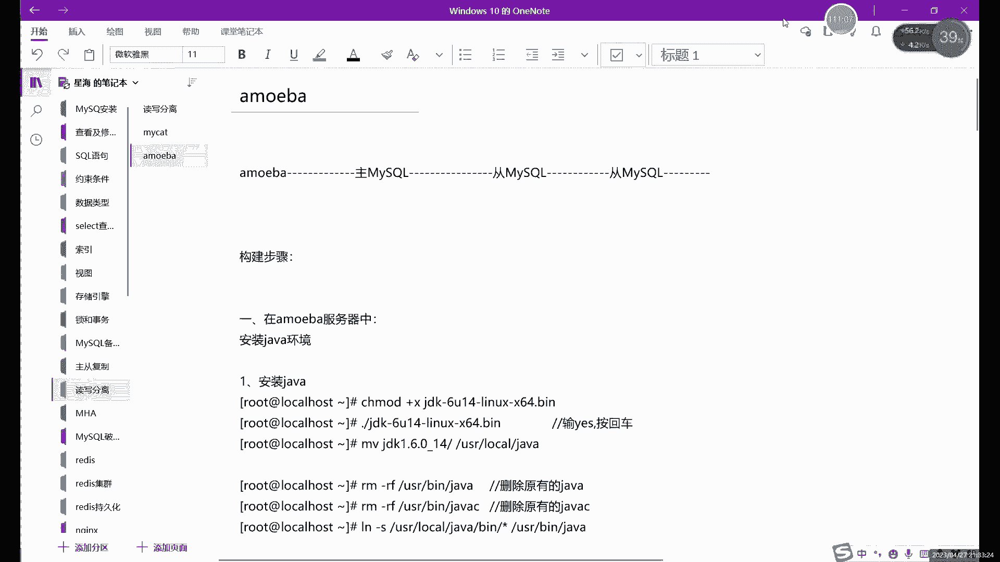


## 总结 🎯

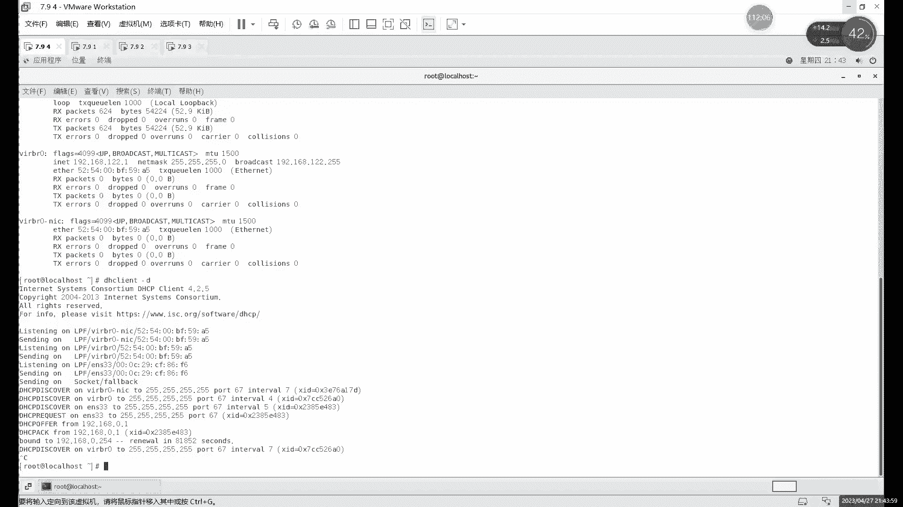

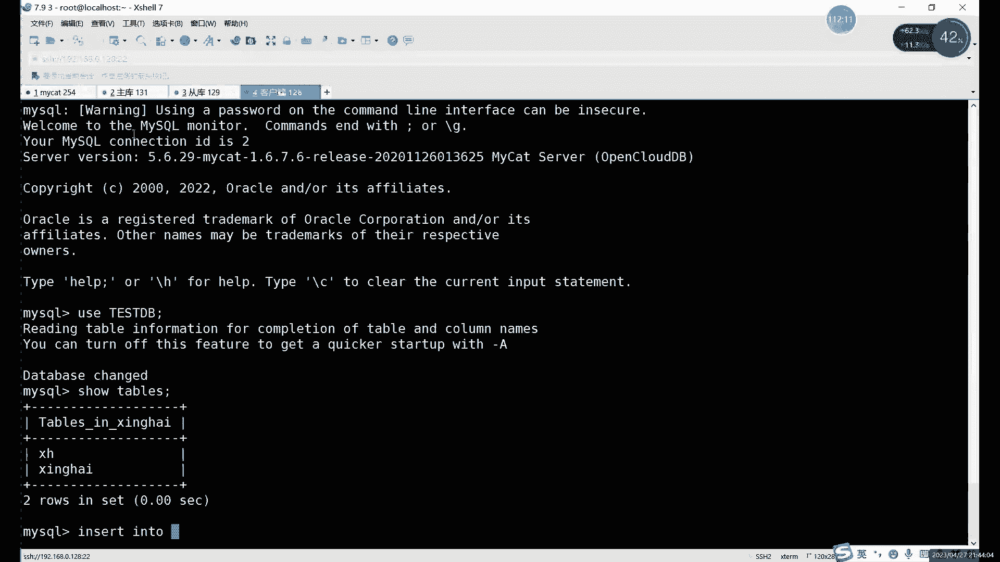

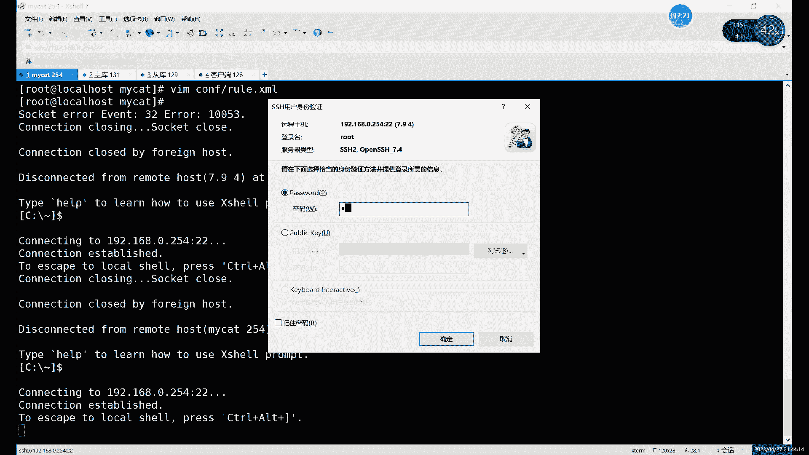

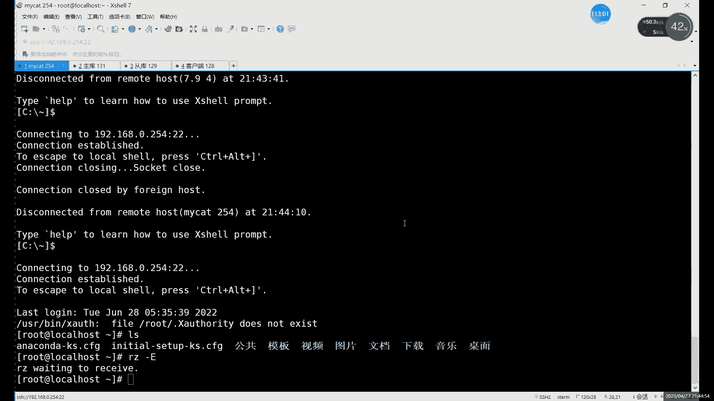

本节课中我们一起学习了MyCat实现读写分离的完整流程：
1.  **配置**：重点修改`schema.xml`，正确定义主从库关系和分离策略。
2.  **重启与排查**：重启服务并学会通过状态和日志命令排查配置错误。
3.  **验证**：通过客户端连接和操作，验证读写请求被正确路由到不同的数据库。
4.  **对比**：了解了MyCat与Amoeba在实现读写分离时架构上的不同，以及各自的适用场景。

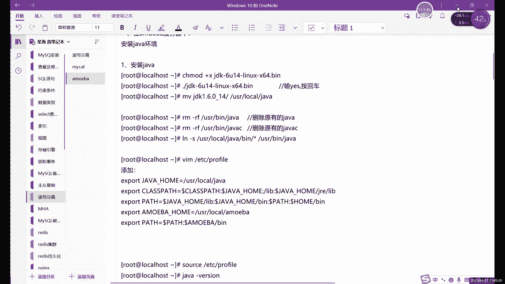

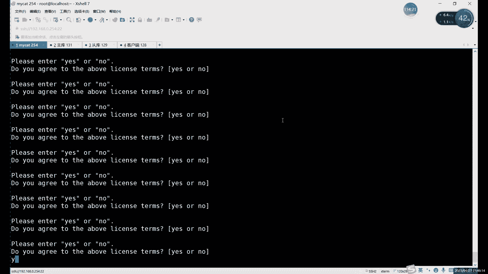

通过本课的学习，你应该能够独立完成一个基本的MyCat读写分离环境搭建与验证，这是构建高性能、高可用数据库架构的重要一步。