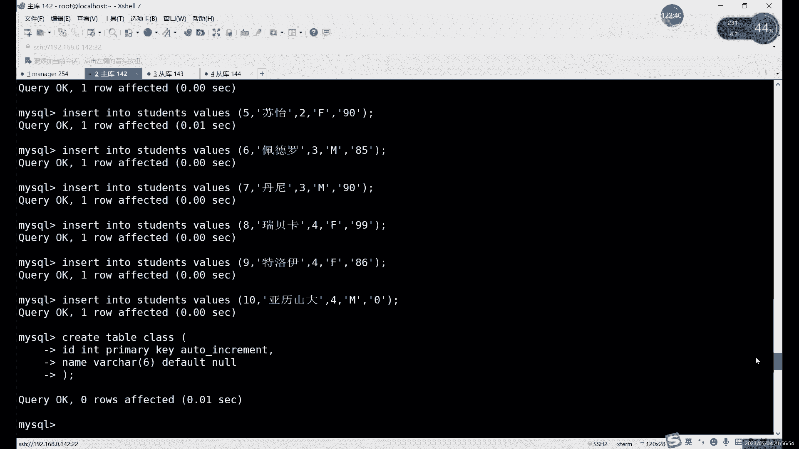
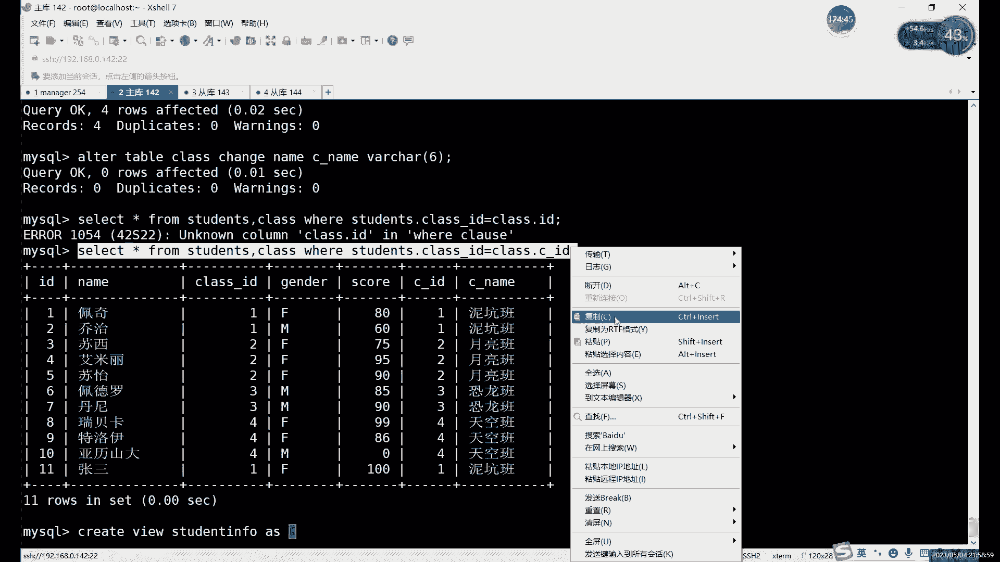
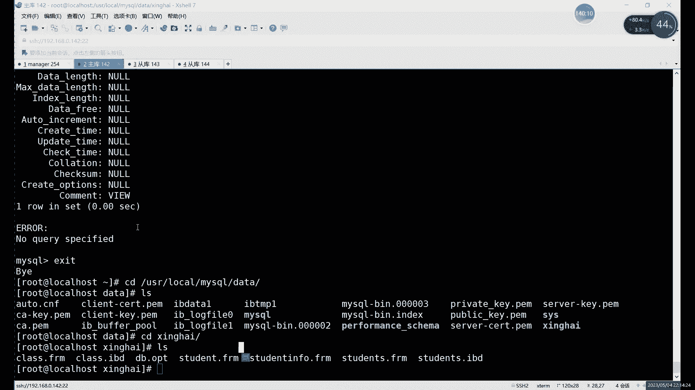
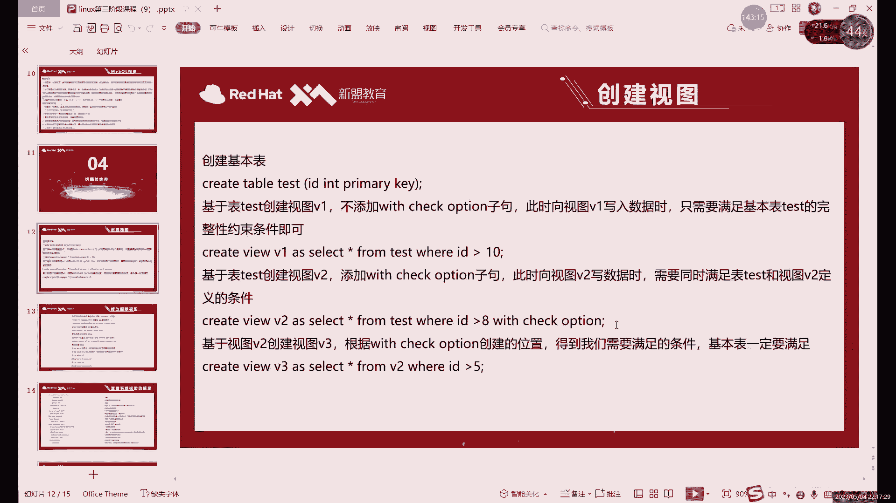
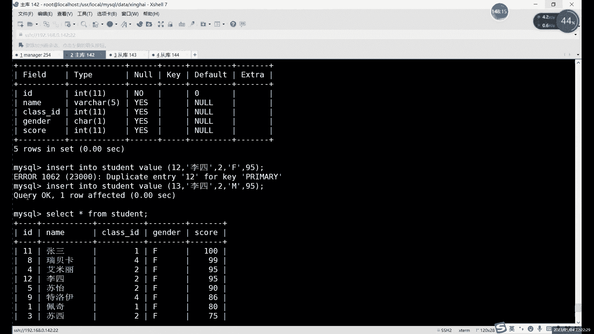
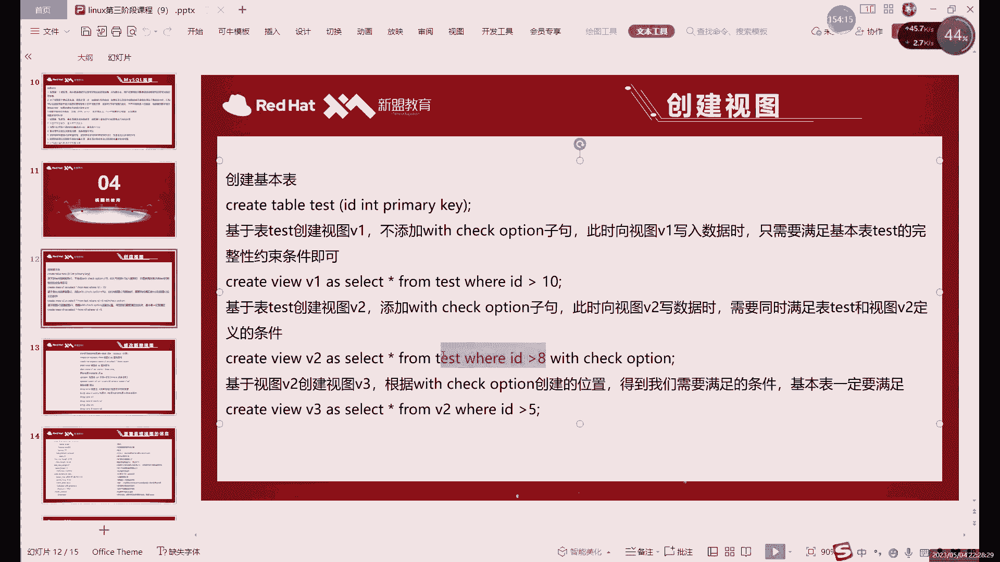
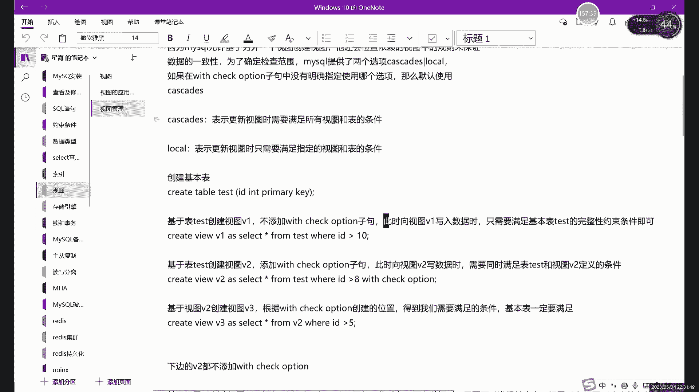

# MySQL数据库管理：第27章：视图详解（下）

在本节课中，我们将深入学习MySQL视图的更多特性，包括视图与表的区别、视图的增删改查操作如何影响基本表，以及如何使用`WITH CHECK OPTION`来限制通过视图插入的数据。我们将通过简单的示例，帮助你理解这个“虚拟表”的运作机制。

上一节我们介绍了视图的基本概念和创建方法，本节中我们来看看视图与真实表格的具体区别，以及它的一些高级用法。

## 视图与基本表的区别

视图是一个虚拟表，它不直接存储数据，而是保存了一条`SELECT`查询语句。当查询视图时，数据库会执行这条语句并返回结果。这与存储数据的真实表（基本表）有本质区别。




以下是视图和表的主要区别：



1.  **数据存储**：视图不存储数据，只存储定义它的`SELECT`语句。真正存储数据的是基本表。
2.  **数据组合**：视图可以将多个基本表的数据通过连接查询组合在一起，形成一个逻辑上的新表。
3.  **结构限制**：视图没有自己的索引、主键、外键等完整约束（除了`NOT NULL`）。它继承的是查询结果的“结构”。
4.  **存储空间**：视图在磁盘上只占用很少的空间来存储其定义语句，远小于存储实际数据的表。
5.  **依赖关系**：创建和删除视图不会影响基本表。但是，对基本表数据的修改（增、删、改）会实时反映在视图的查询结果中。

我们可以使用 `SHOW TABLE STATUS` 命令来区分一个对象是表还是视图。视图在结果中`Comment`字段会显示为`VIEW`，且没有引擎、数据长度等信息。

```sql
SHOW TABLE STATUS LIKE ‘student_view’;
```

## 通过视图操作数据

一个关键特性是：**对视图的增删改查操作，实质上会作用到其依赖的基本表上**。因为视图本身没有数据，它只是一个访问数据的窗口。

### 查询数据
查询视图与查询表完全一样。
```sql
SELECT * FROM student_view;
```

### 插入、更新与删除数据
你可以像操作普通表一样对视图进行`INSERT`、`UPDATE`、`DELETE`操作，但这些操作最终会修改基本表中的数据。


**示例：通过视图插入数据**
```sql
-- 假设 student_view 是基于 students 表的视图
INSERT INTO student_view (id, name, gender, score) VALUES (12, ‘李四‘, ‘F‘, 100);
-- 这条记录实际上被插入到了 students 基本表中
```

**需要注意的约束**：
通过视图修改数据时，**必须遵守基本表的所有约束**（如主键、唯一性约束）。例如，如果向视图插入一条与基本表主键冲突的数据，操作会失败。
```sql
-- 假设id=12已存在，再次插入会违反主键约束
INSERT INTO student_view (id, name) VALUES (12, ‘王五‘); -- 报错
```



## 使用 WITH CHECK OPTION 限制数据

在创建视图时，可以使用 `WITH CHECK OPTION` 子句。它的作用是：**确保通过该视图进行插入或更新的数据，必须符合视图定义中的`WHERE`条件**。



**创建带检查选项的视图**：
```sql
CREATE VIEW student_female AS
SELECT * FROM students
WHERE gender = ‘F‘
WITH CHECK OPTION;
```
这个视图只显示女生（gender=‘F‘）的记录。

**测试 WITH CHECK OPTION**：
现在，如果通过 `student_female` 视图插入或更新数据，性别必须是‘F‘。


```sql
-- 成功：符合视图的WHERE条件 (gender=‘F‘)
INSERT INTO student_female (id, name, gender) VALUES (13, ‘小红‘, ‘F‘);



-- 失败：不符合视图的WHERE条件 (gender=‘M‘)
INSERT INTO student_female (id, name, gender) VALUES (14, ‘小刚‘, ‘M‘); -- 报错：CHECK OPTION failed
```


**重要提示**：
`WITH CHECK OPTION` 只约束**通过该视图**进行的操作。你仍然可以直接在基本表 `students` 中插入性别为‘M‘的数据，这不会违反视图的检查选项，只是这条数据不会出现在 `student_female` 视图的查询结果中。

`WITH CHECK OPTION` 还有更细分的 `LOCAL` 和 `CASCADED` 选项，主要用于处理基于其他视图创建的视图时的检查范围，初学者了解基本用法即可。

## 视图的修改与删除


修改视图的定义可以使用 `ALTER VIEW` 或 `CREATE OR REPLACE VIEW` 语句。
```sql
-- 方法一：替换视图
CREATE OR REPLACE VIEW student_view AS
SELECT id, name FROM students WHERE score > 60;




-- 方法二：修改视图
ALTER VIEW student_view AS
SELECT id, name, class_id FROM students;
```

删除视图使用 `DROP VIEW` 语句。
```sql
DROP VIEW IF EXISTS student_view;
```




---


本节课中我们一起学习了MySQL视图的核心特性。我们明确了视图作为“虚拟表”不存储数据的本质，理解了通过视图操作数据实质是在操作基本表，并掌握了使用`WITH CHECK OPTION`来保证数据一致性的方法。视图是一个强大的工具，它能简化复杂查询、实现逻辑数据独立性和增强数据安全性，是数据库设计和运维中不可或缺的一部分。