# Linux运维进阶：P99：Docker容器数据卷实战 🐳

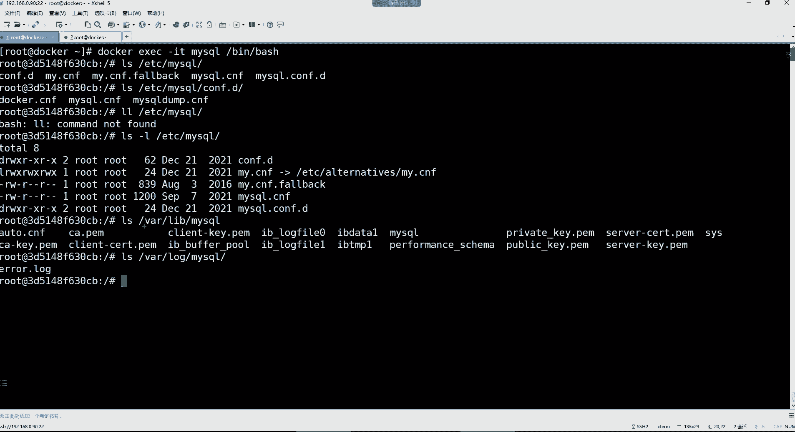

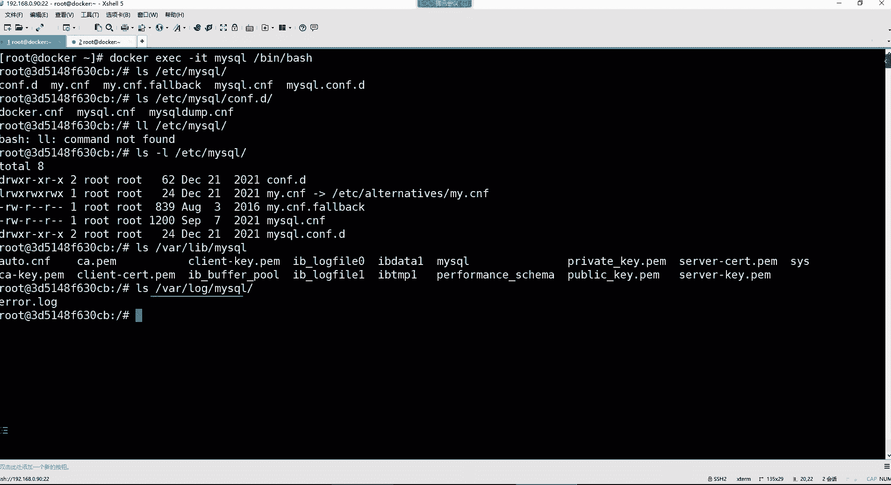


在本节课中，我们将学习如何使用Docker数据卷来持久化容器数据，并以MySQL、Nginx和Tomcat为例，演示如何通过数据卷部署和管理这些常见服务。数据卷是容器与宿主机之间共享数据的关键机制，能有效解决容器数据丢失和配置文件管理的问题。


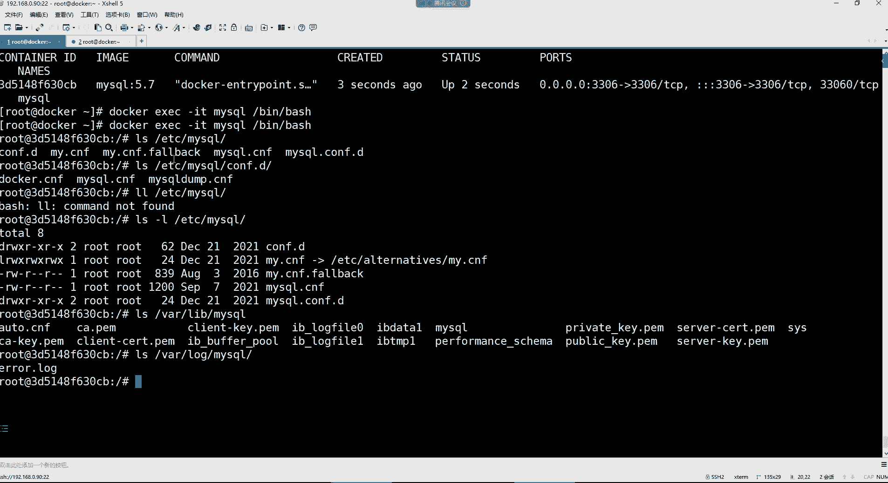


## 数据卷核心概念与原理

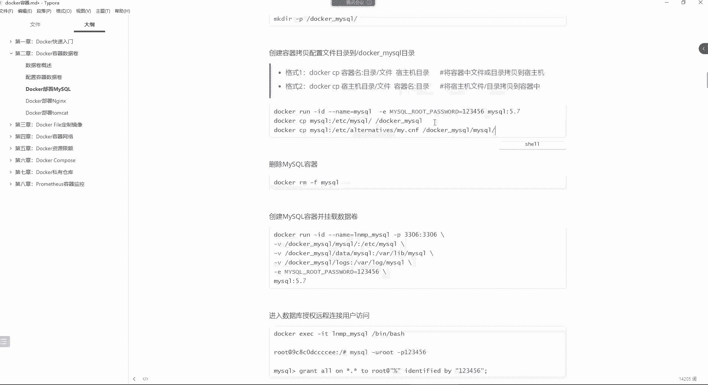

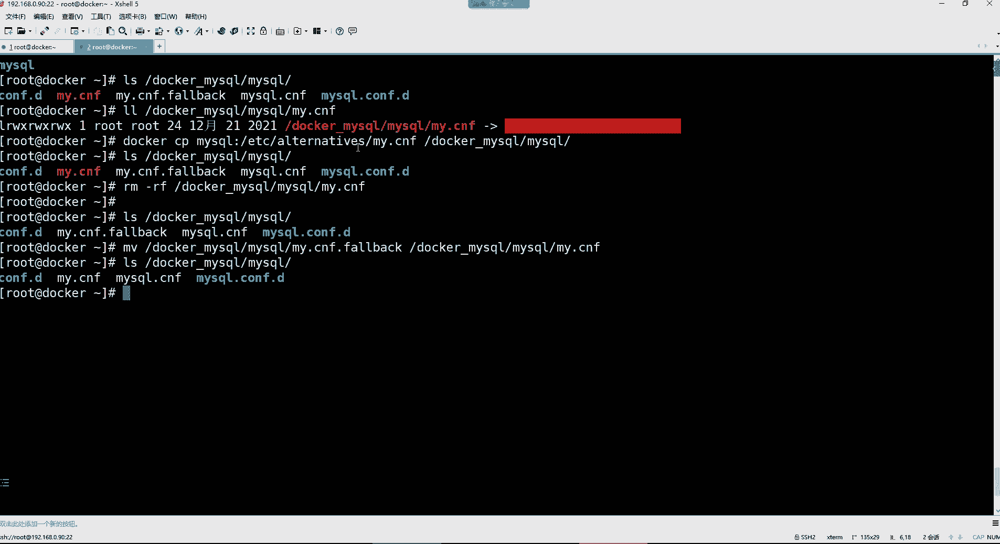

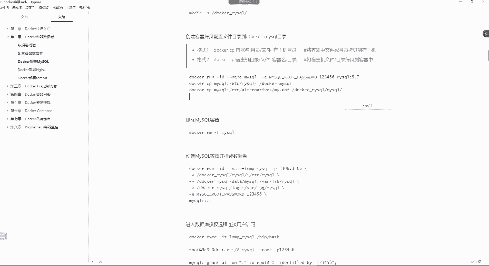

上一节我们介绍了Docker的基本操作，本节中我们来看看如何利用数据卷实现数据的持久化。

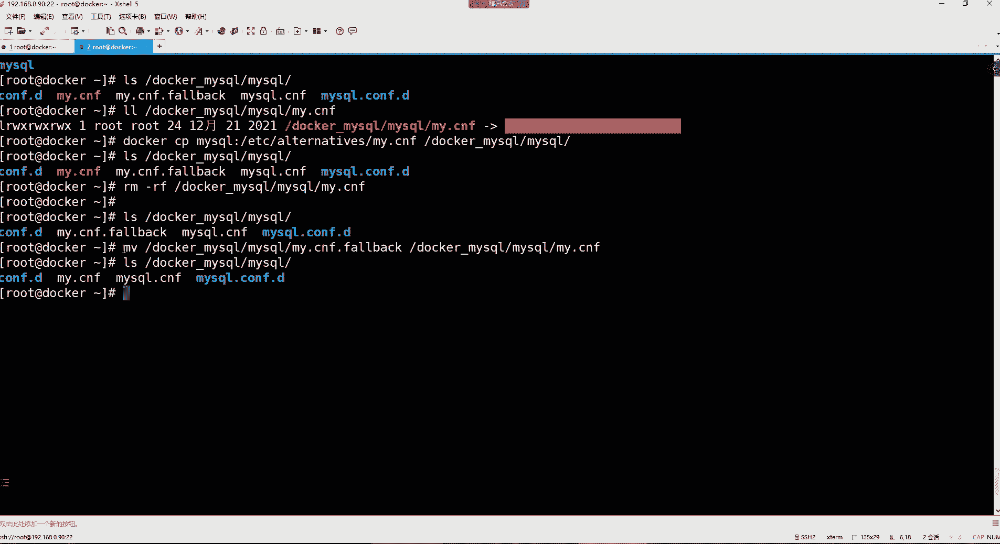

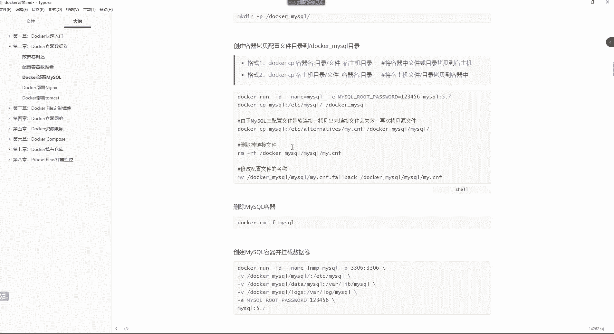

数据卷是一个可供容器使用的特殊目录，它将宿主机目录直接映射到容器内部。其核心作用是**实现宿主机与容器之间的数据同步与持久化**。当容器被删除时，挂载在数据卷上的数据会保留在宿主机上。

使用数据卷的关键命令是 `docker run` 时的 `-v` 参数，其基本语法如下：
```bash
docker run -v /宿主机目录:/容器内目录 ...
```

## 实战一：部署MySQL容器 🗄️

我们将通过一个完整的例子，演示如何为MySQL容器配置数据卷，以持久化其配置文件、数据库文件和日志。

### 准备工作：提取配置文件

首先，我们需要从MySQL官方镜像中提取出默认的配置文件，因为直接挂载空目录会覆盖容器内的配置。


以下是操作步骤：
1.  运行一个临时MySQL容器。
2.  将容器内的配置文件目录拷贝到宿主机。
3.  处理配置文件中的软链接问题。

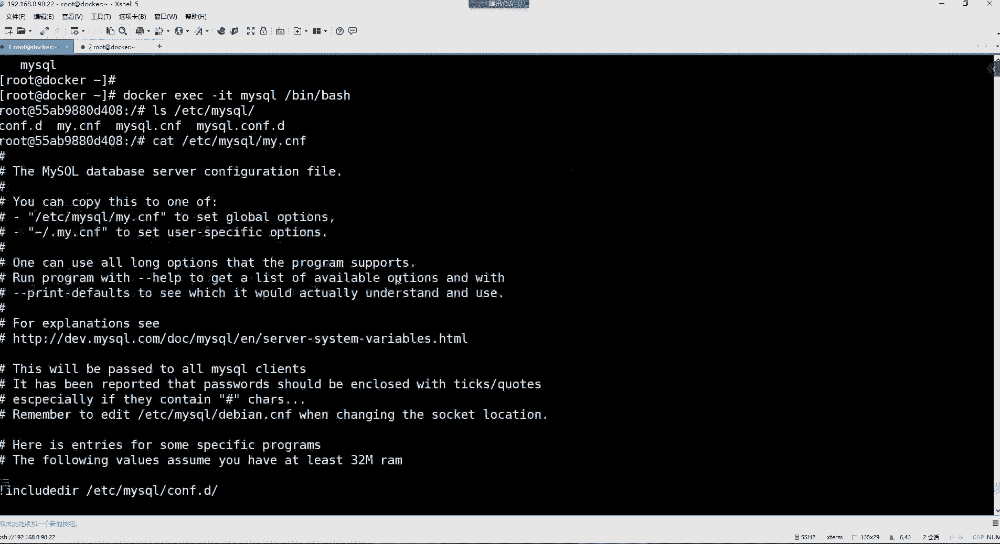

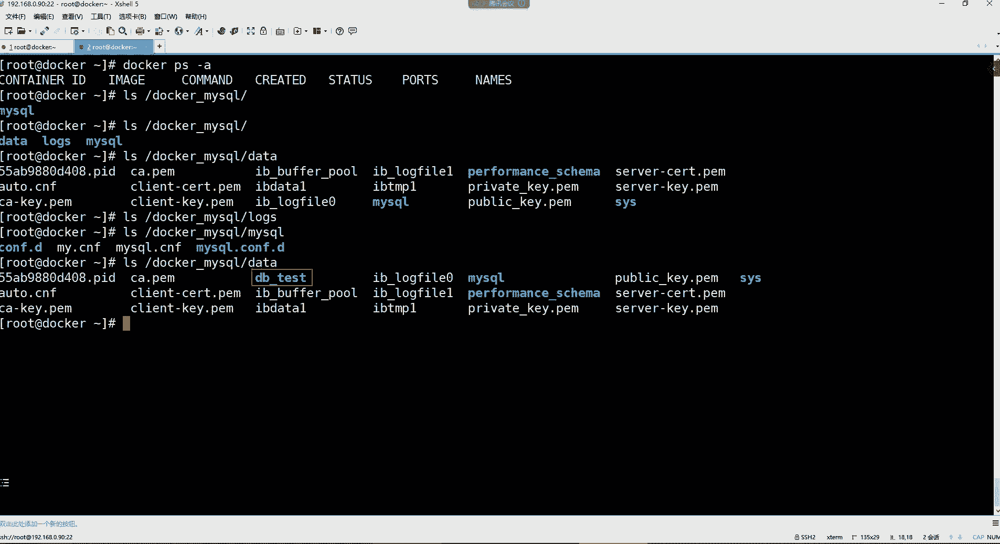

```bash
# 1. 运行临时容器
docker run -d --name=mysql_temp mysql:5.7

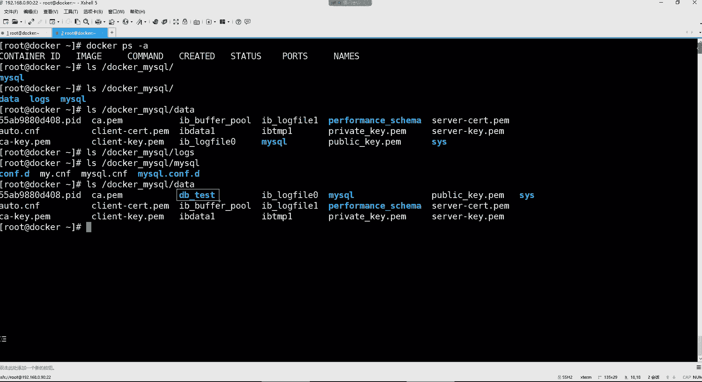

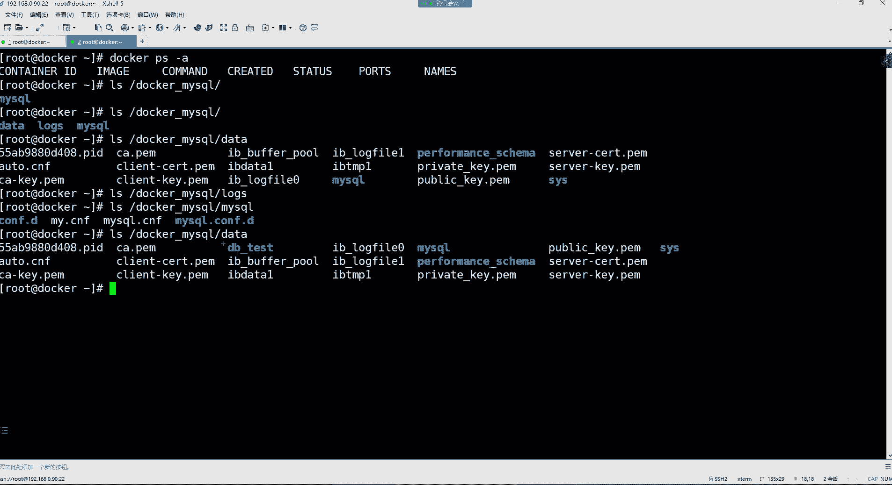


# 2. 创建宿主机存储目录
mkdir -p /docker/mysql

# 3. 拷贝配置文件（注意：my.cnf是软链接）
docker cp mysql_temp:/etc/mysql /docker/mysql/conf

# 4. 进入目录，处理软链接失效问题
cd /docker/mysql/conf
# 找到真实的my.cnf文件（例如：/etc/alternatives/my.cnf），拷贝并重命名
cp /etc/alternatives/my.cnf my.cnf
```

### 创建并挂载数据卷

配置文件准备就绪后，即可删除临时容器，创建正式容器并挂载所有数据卷。


以下是创建正式MySQL容器的命令详解：
```bash
docker run -d \
  --name=mysql \
  -p 3306:3306 \
  -v /docker/mysql/conf:/etc/mysql \        # 挂载配置文件目录
  -v /docker/mysql/data:/var/lib/mysql \    # 挂载数据库数据目录
  -v /docker/mysql/logs:/var/log/mysql \    # 挂载日志目录
  -e MYSQL_ROOT_PASSWORD=123456 \           # 设置root用户密码
  mysql:5.7
```


**参数解释**：
*   `-v /docker/mysql/conf:/etc/mysql`：将宿主机配置目录挂载到容器，修改宿主机配置即同步到容器。
*   `-v /docker/mysql/data:/var/lib/mysql`：数据库文件持久化在此，容器删除数据不丢失。
*   `-v /docker/mysql/logs:/var/log/mysql`：日志文件输出到宿主机，方便查看。
*   `-e MYSQL_ROOT_PASSWORD=123456`：通过环境变量设置数据库密码。

### 验证与测试

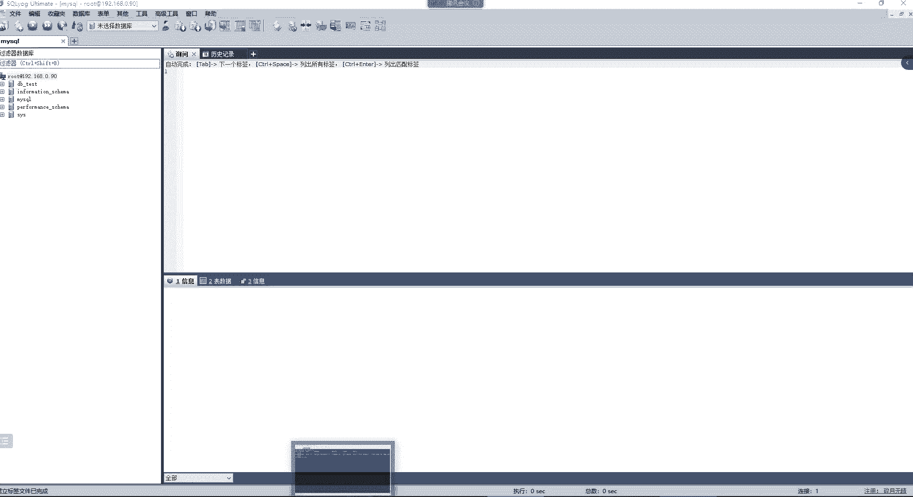


容器创建后，我们可以验证数据卷是否正常工作。

1.  **验证目录同步**：在宿主机查看 `/docker/mysql/data` 目录，会看到MySQL自动生成的系统数据库文件。
2.  **连接数据库**：可以使用 `mysql -uroot -p123456` 命令进入容器内的数据库，也可以使用宿主机上的数据库客户端（如Navicat、DBeaver）通过 `宿主机IP:3306` 进行连接。
3.  **数据持久化测试**：在数据库中创建一个新库（如 `CREATE DATABASE db_test;`），可以在宿主机的 `/docker/mysql/data` 目录下立刻看到对应的 `db_test` 文件夹。即使删除并重建容器，只要挂载同一个数据卷，数据依然存在。


**重要提示**：对于配置文件目录，如果宿主机目录初始为空，挂载时会**覆盖**容器内的目录。因此，必须先拷贝出原始配置，再挂载。


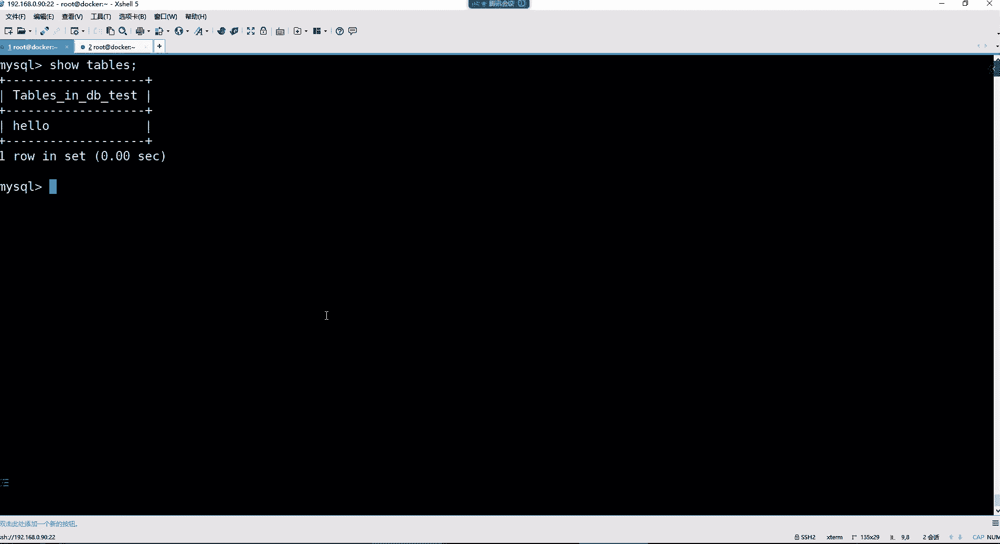

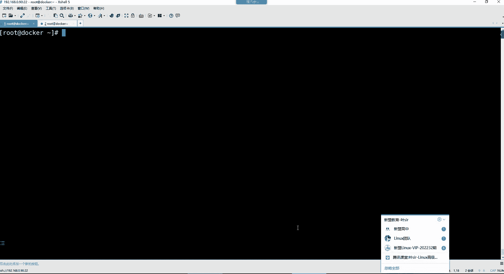

## 实战二：部署Nginx容器 🌐


接下来，我们看看如何为Nginx容器配置数据卷，管理其配置、日志和网页文件。

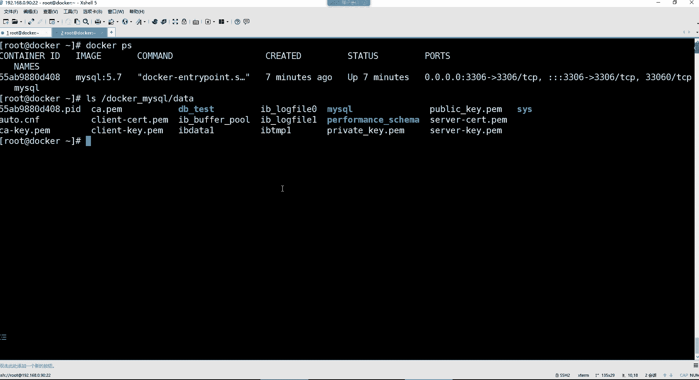


### 提取Nginx配置文件

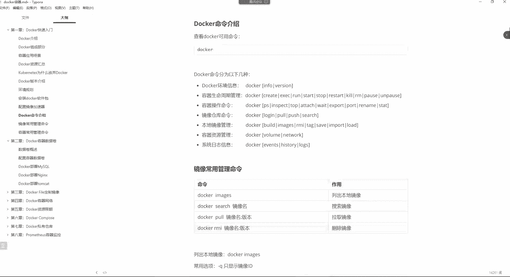


与MySQL类似，首先需要从镜像中提取默认配置。

```bash
# 1. 运行临时容器
docker run -d --name=nginx_temp nginx:1.22.1


# 2. 创建宿主机存储目录
mkdir -p /docker/nginx

# 3. 拷贝整个配置目录
docker cp nginx_temp:/etc/nginx /docker/nginx/conf

# 4. 删除临时容器
docker rm -f nginx_temp
```

### 创建并挂载数据卷

获得配置文件后，创建正式的Nginx容器。

```bash
docker run -d \
  --name=nginx \
  -p 80:80 \
  -v /docker/nginx/conf:/etc/nginx \          # 挂载配置目录
  -v /docker/nginx/logs:/var/log/nginx \      # 挂载日志目录
  -v /docker/nginx/html:/usr/share/nginx/html \ # 挂载网页根目录
  nginx:1.22.1
```


### 验证与使用

1.  **访问测试**：浏览器访问 `http://宿主机IP`，可以看到Nginx默认页面（如果挂载的html目录为空，则显示403错误页面）。
2.  **部署网页**：将网站文件（如 `index.html`）放入宿主机的 `/docker/nginx/html` 目录，刷新浏览器即可访问新页面。
3.  **修改配置**：直接编辑宿主机 `/docker/nginx/conf/nginx.conf` 文件，修改后需重启容器 (`docker restart nginx`) 使配置生效。
4.  **查看日志**：访问日志和错误日志会实时生成在宿主机的 `/docker/nginx/logs` 目录下。


## 实战三：部署Tomcat容器 🚀

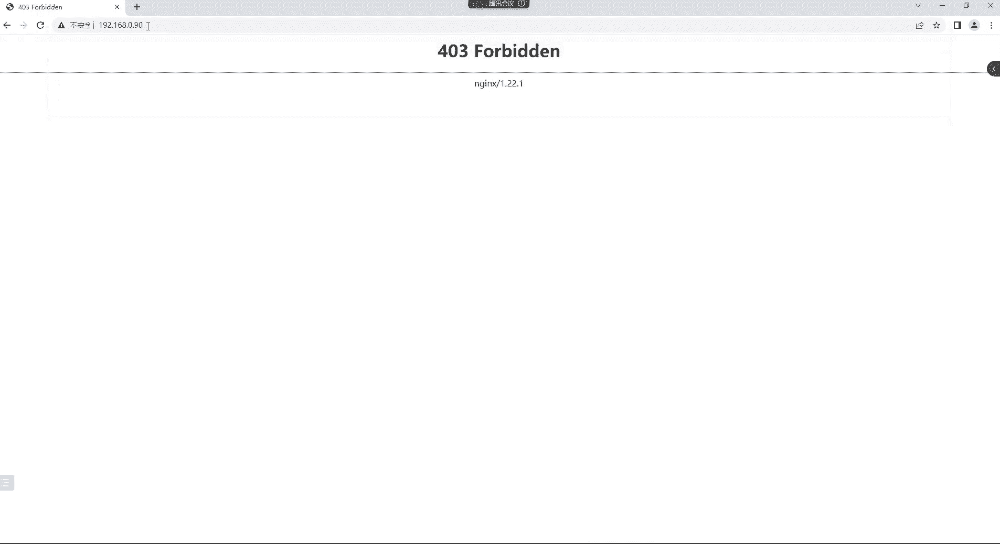

最后，我们以Tomcat为例，演示如何挂载整个应用目录。


### 提取Tomcat应用目录


Tomcat将配置、日志、程序、网页都集中在一个目录下，可以整体挂载。

```bash
# 1. 运行临时容器
docker run -d --name=tomcat_temp tomcat


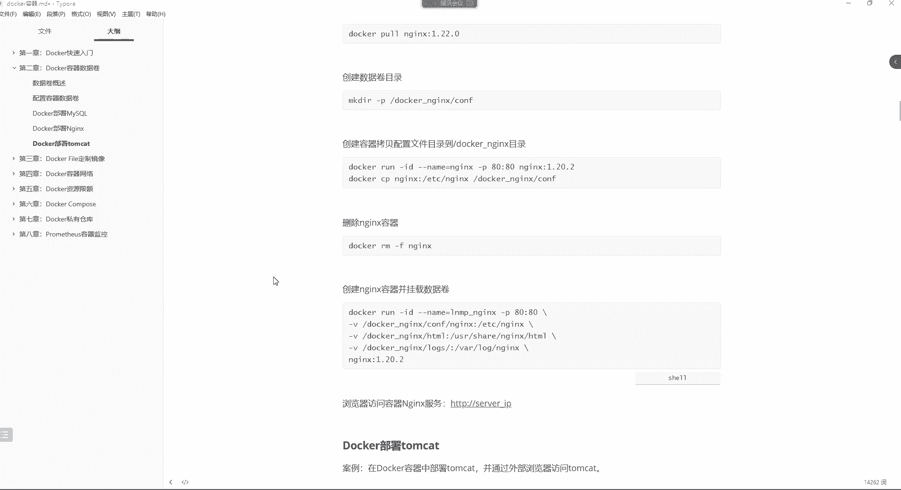


# 2. 创建宿主机目录并拷贝整个应用目录
mkdir -p /docker/tomcat
docker cp tomcat_temp:/usr/local/tomcat /docker/tomcat/

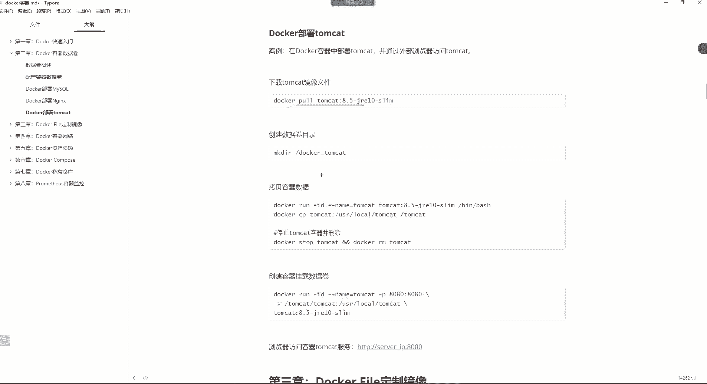

# 3. 删除临时容器
docker rm -f tomcat_temp
```


### 创建并挂载数据卷

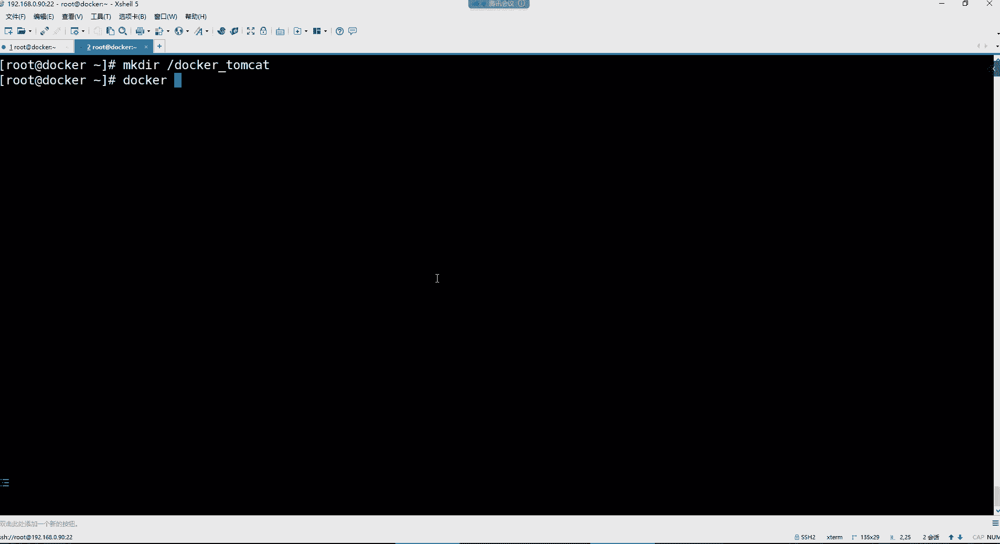

创建正式的Tomcat容器，挂载整个Tomcat目录。

```bash
docker run -d \
  --name=tomcat \
  -p 8080:8080 \
  -v /docker/tomcat/tomcat:/usr/local/tomcat \
  tomcat
```


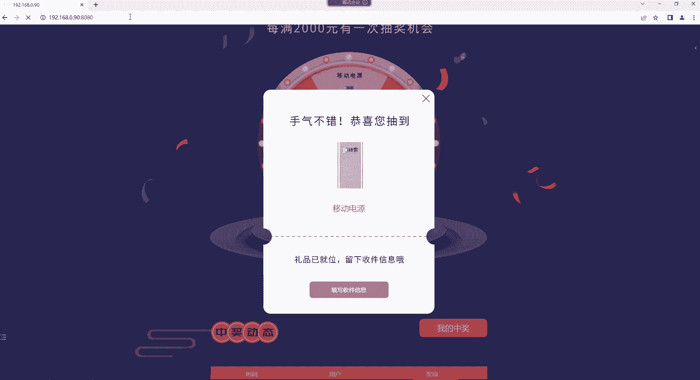

### 验证与使用

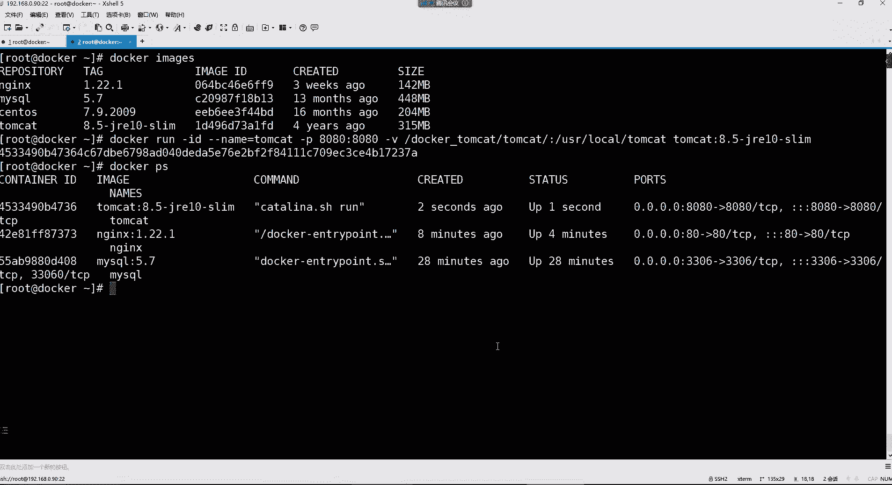

1.  **访问测试**：浏览器访问 `http://宿主机IP:8080`，可以看到Tomcat默认页面。
2.  **部署WAR包**：将Java应用的 `WAR` 包放入宿主机的 `/docker/tomcat/tomcat/webapps/` 目录，Tomcat会自动解压部署。
3.  **查看日志**：日志文件位于宿主机的 `/docker/tomcat/tomcat/logs/` 目录下。


## 总结与最佳实践 📝

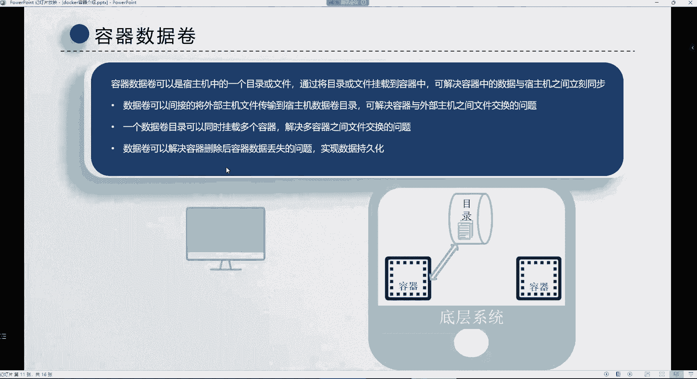

本节课中我们一起学习了Docker数据卷的核心用法，并完成了MySQL、Nginx和Tomcat三个服务的容器化部署实战。

**核心要点总结**：
1.  **数据卷目的**：实现数据持久化、宿主机与容器数据同步、方便配置管理。
2.  **关键步骤**：对于需要自定义配置的服务（如MySQL、Nginx），务必先**从原始镜像容器中拷贝出默认配置文件**，再挂载到新容器，避免配置被空目录覆盖。
3.  **挂载语法**：`-v /宿主机绝对路径:/容器内路径`。
4.  **管理便利性**：使用数据卷后，大部分日常操作（如改配置、放程序、看日志）都无需进入容器，直接在宿主机对应目录操作即可，效率大幅提升。

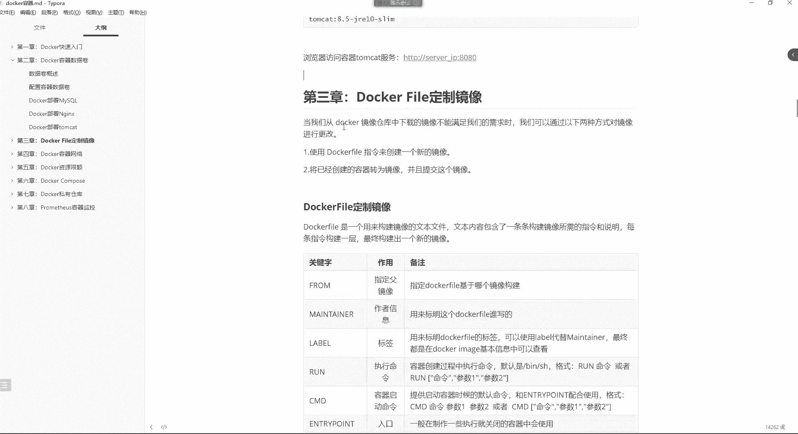

通过数据卷，我们成功地将容器内易失的数据与宿主机的持久化存储关联起来，使得容器可以像传统服务一样被方便地管理和维护。这是在生产环境中使用Docker至关重要的一步。