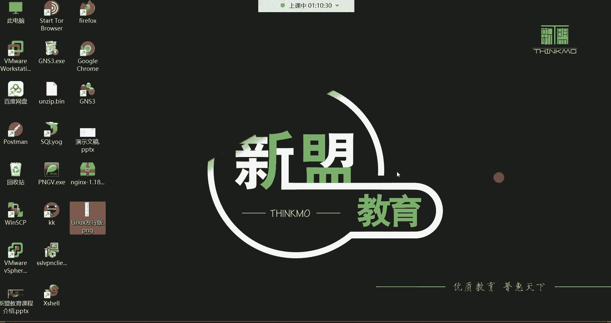

# 【小白入门必备】Linux运维进阶RHCSA+RHCE最全培训教程视频合集 - P1：红帽RHCSA-1.云计算介绍、Linux系统介绍 - 洋洋得IE - BV1nN4y1X7Go

那过多的呢我们就不介绍了哈，然后今天第一天呢，我也是嗯看到了很多是这个以前的同学哈，然后还有一部分就是这个啊新进班的同学，然后对于什么呢，对于我们第一天的内容呢，我要先给一些小白呀，要给大家讲讲一些。

像我们在入门那个云计算这个行业，你们必须要知道的一些，比如说概念性的东西啊，这个所谓概念性的东西，就是比如说你们现在所说的学习到这个云计算，那它到底可以从事哪些岗位，大家学完以后可以找什么样的工作。

然后呢这个工作呢能够挣多少钱啊，这些呢都给大家讲讲哈，那其实也就是我在下边这个里面呢，要给大家所说的，就什么是云计算，还有什么是LINUX的运维，还有这个学习运维，大家以后可以从事哪方面的工作啊。

然后这个每个岗位的薪资待遇如何，那我们这个行业大家能不能长久的发展下去，还有就是说我们这个岗位啊，对比于IT领域的开发呀，测试啊，哎对比的话怎么样，因为毕竟这个我们在在这个互联网行业，其实就是三大岗位。

哪三大岗位呢就是开发测试和运维啊，就这三大岗位，所以呢我就给你们挨个都说清楚啊，第一天咱们讲课呢就给你们把这个东西啊，直接啊，这也也也也算是一个行业发展吧，哈我就给你们讲清楚了。

你们以后也也不会再有这个方面的任何的疑惑，好吧，那我们先来给大家讲什么呢，我们先来给大家讲讲这个什么是这个云计算吧，好吧，你看对于很多人说这个学习云计算，学习云计算，那你说这个云计算这到底是个什么呀。

是不是啊，嗯云计算的话呢，他在这个20年前呢，其实是一个虚无缥缈的词汇哈，啊可以到数据中心工作，数据中心数据中心啊，一会儿我们讲岗位的时候，然后再跟你们说一说哈，20年前收到云计算，我告诉你啊。

很多人他的脑子里浮现了一个什么呢，啊云计算是什么东西啊，是云里雾里的，花里胡哨的修缥缈的一个词，确实啊20年前，但是我们这个故事啊，我还要从20年前呢给大家讲起呃，20年前呢就是2000年哈。

那场深圳的it峰会啊，这个it峰会每年都举行啊，在深圳举行哈，这个IT峰会呢也叫做IT的领袖峰会，它主要就是互联网，那行业大咖们去探讨，中国互联网未来的一个发展趋势，然后当时呢在这个峰会上边呢。

你想想这个探讨互联网的发展趋势，那离不开谁啊，离不开我们中国的三大巨头是bat的创始人啊，就是深圳腾，还有搜索红啊，还有这个杭州马啊，肯定是离不开他们，那在这个2000年那场I深圳IT峰会啊。

然后呢当时就有这个记者啊，当时就采访了这三个人，那问的什么话呢，呃就是说您觉得云计算在中国，什么时候可以到来，因为云计算那时候在国外已经怎么说呢，有已经有了，已经有云计算这个东西了哈，在国外的时候。

然后中国呢还没有，所以那时候呢呃，就是你想他们探讨，我们中国互联网未来发展趋势，那记者肯定会说哎，那你看外国现在都有云计算了，那中国什么时候可以到来啊，当时呢是这个先采访的这个深圳腾啊，就是马化腾的话。

我们简称深圳腾嗯，那深圳腾是怎么说的呢，他说啊我觉得云计算在中国得需要个几百年，上千年到阿凡达的一个年代，嗯后来呢又采访的是这个搜索红啊，然后这个没有华为哈，没有华为给我采访了这个搜索红。

然后这个搜索红呢说那云金村在中国呢，可能得至少得需要个几百年吧，反正我们这一代人可能是见见不到云计算了哈，后来呢又采访了杭州马啊，就是这个马爸爸，马爸爸当时就跟这个记者说说。

我相信云计算咱们中国很快就能到来啊，就非常的自信啊，啊哈哈哈哈，看这表情就感觉不太一样，是不是啊，就自信满满嗯，就秒杀他们，那随后呢马云就回到了自己的阿里巴巴，然后干嘛呢啊，当时马云已经非常有钱了。

那时候阿里巴巴，那时候人家的业务已经非常非常的挣钱了，嗯然后那个时候呢，马云就回到了自己的阿里巴巴，然后呢阿里巴巴有一个人叫王坚，是阿里云的博士，然后马云就当着所有阿里巴巴员工的面呢，就对王坚说说啊。

我每年给你投资十个亿啊，我们就要去搞这个云计算啊，就给他搞出来，搞多久呢，我们先搞个10年再说啊，搞不出来呢，搞不出来再说啊，就是当着所有阿里巴巴员工的面啊，就直接就给他什么下了一个定心丸啊。

然后呃最终这个王金啊，就是他是在什么时候呢，是在2009年的9月10号啊，把这个阿里云呢就给他怎么说呢，创办成立了，那就坚持了8年时间，从这个2000年到2009年，他们中间坚持了8年的时间。

然后就把阿里云给这是确实给创建出来了，这中间的辛酸呢，这个我们就不说了，不谈了，因为如果你们去网上去搜，你会看到就是呃他在这个怎么说呢，在这个做这个阿里云的时候，那中间就是在组建团队啊，团队解散啊。

然后这个又这个受到别人的这个质疑啊，说这个东西根本就不可能实现啊，我们简直就是在浪费钱，浪费人力啊等等等等，中间会有很多的质疑啊，反正呃在那个2009年9月10号，阿里云成立的时候。

那时候王坚在他的那个怎么说呢，那个晚会上面那基本上就已经泣不成声了哈，那时候啊你要是去百度搜的话，你都能看得到啊，这哭的就已经跟那啥似的了，让就是反正这8年时间呢遭受很多人的质疑啊。

然后终于把这东西给他做出来了啊，然后那阿里云呢，他目前是在全球20多个地区啊，像我们注意啊是啊，全球20多个地区，像我们中国的，华东华南香港啊，其实这些你像这些地区，就是你像北上广深一线城市。

省会城市啊，反正呢都有这个它的数据中心，然后还有国外的，像新加坡，美国欧洲里面的呃，像啊，反正吧什么日本韩国，澳大利亚，中东欧洲这些地方都有它的数据中心，好，那阿里云的排名呢。

他现在是排在全球第三大云厂商啊，这是阿里云的一个排名嗯，好能看清吗，兄弟们，这个我最后这一行字你们能看清吗，来看清的给我刷一，你说老师好像好像有一半看不到，给我刷二哈，可以吗，有问题吗。

最后最后这这一行字，可以看清是吧，好，啊有还还有人刷二是吧，嗯嗯可以可以猜出来是吗，没关系哈没关系嗯，那我可以这样哈，我可以这样给你们演示，OK吧，我这样给你们演示，看见3/4是吧啊，稍微遮盖一点。

那咱们这样OK吧啊这样，然后接下来呢我们说一说这个云厂商的排名，因为阿里云呢它排在全球第三位，那咱们就说一说这全球的云厂商啊，因为刚刚有人提到了这个华为是吧，说居然没有华为的份啊。

咱们说说这个云厂商的排名吧，那现在排在全球第一的云厂商，是亚马逊的AWS啊，这是毋庸置疑啊，还是在这个云计算里的，呃什么呢，龙头老大了，然后排在第二呢是微软的啊，Mac soft的either啊。

然后排在第三呢就是我们中国的阿里云，然后你像那除了阿里云以外，咱们国内来讲一下华为云是吧，你们应该很多人都听过是吧，什么华为云，百度云，京东云，移动云，联通的沃云，还有金山云青云，谷歌的GPS啊。

啊谷歌的GCP等等等等哈，那这些云的话呢就拍就怎么说呢，就对比于前边这三个呢，就是都是那都排不上名次哈啊有腾讯云哈，云多了去了，你看我给你们列举的这些其实只是怎么说呢，算是大家比较耳熟能详的。

其实还有很多呢，你看像你们说什么深信服也有自己的云是吧，你看腾讯也有自己的云都有哈，没错有嗯，所以你知道一下就行，但是呢大家可能现在还会有种疑惑，说这个云厂商跟我们来讲有什么关系啊。

是不是啊啊你说这个云厂商，云厂商对于我们来讲是，或者说他这个到底干什么用的，这个云厂商没错吧，呃它的应用的领域到底在哪里啊，那接下来呢啊我告诉你啊，云厂商呢一般就是对外提供服务，你像阿里云。

阿里云服务的，你像我们生活中啊，这都离不开他前面制造业，金融政务，交通医疗，电信能源等众多的行业啊，你包括呃大家购票的时候12306啊，你去12306网站去买票的时候嗯。

还有这个祝我们中国的这个中石化啊，还有这个像像像什么这个飞利浦是吧啊，做剃须刀的啊，耳熟能详的，像什么微博，知乎，锤子科技这些明星的企业也都什么呢，也都是属于阿里云的客户了，哎那很多人说说。

那那阿里云到底帮他们做什么事情，是不是啊，阿里云给他们提供各种各样的服务，注意哈，我给你讲讲哈，就比如说你现在想创办一个公司，但是呢你想想你想创办一个公司的话，你首先你要干嘛呀。

你得先有一个自己的网站吧是吧，别人访问你的网站，了解你们公司的产品，因为现在网络时代嘛，你开个公司，你们公司连个自己的网站都没有，别人怎么去了解，你跑到你们呃，跑到你们这个什么呢基地里面去看你们吗。

是不是这也不现实嘛，所以得先有一个自己的网站啊，那这个网站你想想那就离不开什么样，离不开服务器吧是吧，网站得跑在服务器里面，所以你得去花钱买这个服务器，这叫物理服务器，买买个几台，那这物理服务器呢。

一般呢还得需要给它怎么摆放啊，是吧，哎你还得去买这个机柜机架，把这个物理服务器放到这个机柜机架上面，那这个机柜放在哪啊，这个机柜呢我们一般要给他放在机房，那这个现在叫数据中心啊，以前那叫IDC。

那叫IDC机房啊，当然是机器的机器哈，你们可别列错了，DC机房为什么要把这个服务器放在机房呢，因为你想想啊，对于这个服务器来讲，它干嘛呀，那它里边跑的就是企业的网站啊，因为你企业里面。

你们公司的所有的产品都得什么呢，都得在网站上面展现给别人，别人从网站去了解你们公司的产品，是不是，那你想想那你们公司的网站能呃，就是运行网站的这个服务器，它能关机吗，它不能关机，一关机别人就访问不到了。

是不是啊，所以呢这个服务器一般就是长年累月不关机，不重启，所以说他对这个环境的要求就比较苛刻，你比如说什么网络呀，电力呀，那可不是说我们个人的家用的网络啊，还有我们个人的家用电力，那不行的，不稳定。

说停电给你停电，你怎么办，是不是啊，所以像这些东西呢都是专门去准备一个机房啊，然后把这个服务器放在机房里边，那个机房怎么来的呀，你想想这机房你得去买地皮吧，是不是呃，那这地首先你不是说你想你想盖厂房。

就盖厂房的是吧，那先买块地，买个地，买了地以后呢，你再去建这个机房，然后呢啊这个机房里的众多的设施，什么温度湿度，通风度，网络电力啊，各种防防水防火防雷电，防小三儿啊，是不是这些东西呢全部都得防。

那这个对于这些东西的话呢，怎么说呢，在传统情况下你都得自己去搞啊对啊，这是后来啊，后来才有了这个托管的这个服务啊，就是这个啊，我给你建我，我给大家建一个什么呢，建了一个数据中心啊。

然后呢你们服务器可以被托管到我的数据中心，但是价格也非常昂贵啊，价格非常的昂贵啊，因为数据中心里的你要知道它的什么温度，湿度一定要符合服务器的存放环境啊，那里面几乎都是冬暖夏凉啊，啊一般用什么控制呢。

用空调去控制里面的温度啊，所以说啊而且人家的空调都是叫做啊，这个企业空调，商业空调哈，所以都是费用都特别昂贵哈，包括网络电力啊，机房里的网络也特别的贵，所以说像这种东西的成本就感觉蛮高的，是不是啊啊。

所以说传统情况下你想创办个企业，你发现这个就有些什么呢啊，就有些费就成本太高了，小公司根本就没有那么大的成本，去搞这些设施嘛，所以怎么呢，所以后来有了云计算以后啊，你看看云计算的优势嗯。

上云上云现在普遍的上云哈，那咱们说云计算的优势，你要知道，这个时候呢你不需要自己去建这个厂房啊，去搞这个什么设施了，这时候是人家云厂商，他们呢建好一个大型的数据中心啊，以前都叫IDC机房啊，IDC机房。

现在呢这是叫数据中心，OK然后这个干嘛呢，他们建好一个数据中心，这时候呢他们呢再把数据中心里的这些东西，以一个云平台的方式干嘛呢，出租给用户，那用户呢，比如说我还是想要去这运行一个网站是吧。

那这个时候用户只需要跑到这个云平台，然后呢呃在云平台呀，他租一个叫云主机的东西，这个云主机是什么，其实云主机的本质它就是虚拟机啊，是人家这个云厂商啊，通过技术呢给你虚拟出来的一个机器。

但是你别看它是虚拟的啊，这个虚拟机里面什么都有，跟物理机一样，里边有什么有硬盘，有内存，有网络，有CPU，甚至还给你带操作系统啊，然后你干嘛呢，你就只需要去把你们公司的网站。

运行在这个云主机上面就可以了，知道吧，那你看对于用户来讲，你说啊这个云主机云主机是吧，他花钱租了啊，其实说到这个云主机，它的本质就是虚拟机，就是虚拟机哈啊那说到虚拟机的话呢，你像我们在用着的时候。

其实现在企业里边也，企业也也在用这个虚拟机啊，只不过现在呢是以这个云主机的形式啊，租给用户了，然后呢用户就直接在里面去部署环境，跑自己的网站，那网站到时候别人就可以访问了，说比较简单呢，那这个时候呃。

你在租这个云主机的时候是怎么租呢，我们叫做按量付费去租，那这个按量付费就是特别的节约啊，节约到什么地步呢，就是这个云主义，你一开机他才扣你钱，知道吧，扣你钱哈，你关机呢他就不扣你钱啊。

但这个机器一直属于你的，能理解吗，这按量服务费哈，嗯那还有呢，那还有如果你觉得啊你是企业，那企业咱们一般都是不关机的哈，所以企业呢它可以选择叫做包年包月，这种包年包月的方式是怎么说呢。

就是跟我们平时住房子一样，你看我们住房子，然后呢，这个我们是不是跟这个交房租，你住一个月给人一个月的钱是吧，你租你住仨月，给人一个季度的钱，你住一年给人一年的钱不就完事了嘛是吧，反正你交了租以后。

这东西就属于你的，你爱怎么做怎么做，是不是，所以这个云主机的形式现在就是什么呢，啊就是以出租的形式啊，包夜也行吧哈行哈，可以哈，包夜也行，这个时候你想想用户租个云主机，把网站跑在云主机里边。

那你说说那这个IDC里的这些东西，什么地皮啊，还有这个厂房，还有这个厂房里的各种设施，什么温度啊，湿度通风度，网络电力防水防火防雷电，还有机柜机架，还有服务器等等等等等等，你们有没有想过。

这些东西还需要我们用户自己去搞吗，那用户还需要自己去搞这个东西吗，不需要吧，这些是谁啊，这是云厂商花钱去搞，他们有钱呢是吧，云厂商有钱嗯，而我们用户呢咱们只需要来租就可以了，所以你看这个云计算叫什么。

云计算的本质就是网络的资源出租，其实你发现这种东西，你说你看有人说这个这是什么，以前网吧之类的是吧，我跟你讲，这其实本质是一样的，你想想啊，以前啊比如说你就这人特别喜欢打游戏，是不是啊。

但是呢你还有这个买自己买不起这个电脑，或者说你能买得起电脑，但是你没有一个这个什么呢，一个合适的环境，你不方便去买这个电脑，但是你还想玩，那怎么办，唉网吧是什么呀，网吧不就是人间是吧，买机器是不是啊。

网络电力什么都给你准备好是吧，什么鼠标键盘之类的游戏都给你安装好，而你干嘛呀，你就跑到网吧，你说我班俩小时的就给你两个小时的钱是吧，你说我今天包夜了好，你就你就给那包夜的钱不就行了吗。

所以你发现这云计算的本质，就跟我们生活中的各种出租好像是一样的，没错吧，包括你租房子也一样吧，你想想比如你你想住房，你想租房的话，你自己买不起房子，是不是你买不起房子怎么办呢，那你不能睡大街上吧。

唉但是呢哎你租得起是吧，你租一个月花不了多少钱呢，那怎么办，唉你就去租别人的，那至于这个房子，那房主花多少钱买的，你需要管吗是吧，至于这房子里面装修花了多少钱，你需要管吗，你不需要管，你就住一天。

你就给人家一天的钱不就行了，是不是，还住酒店是吧对呀，这些都是叫什么呢，我问你这些是不是都叫资源出租，所以云计算是什么，云计算它的本质也是资源出租，就是人家云厂商，是不是哎我把什么呢。

我把我的我自己搞好这些设施了，哎我租你一台云主机，那你就干嘛，他在云主机上面自己去跑网站不就可以了吗，所以现在知道云计算的优势了吗，有了云计算以后，我跟你讲，现在你想要去运行自己的网站。

哎呀你说我想买一台服务器，跑个网站，那自己搭建一个邮件服务，或者搭建一个博客，让别人访问，那都如此的简单的知道吧，但是没有云主机的时候，你想搭建一个比如说属于自己的网站，那你自己去买物理服务器吧。

一台服务器好几万块钱，是不是啊，呵呵网络电力都得自己去搞，所以你看这不都是都属于叫做资源出租吗，没错吧啊这就是所谓的云计算的优势啊，那但是云计算呢它有三种服务模式，第一种服务模式呢叫做爱啊，爱死云。

叫基础设施服务，这是什么意思呢，你看为用户提供一个计算机所需的什么CPU内存，磁盘网络这些基础资源，你看它叫基础设施及服务，但是呢肯定也要有一个云主机对吧，然后呢这个云主机有什么呢，有CPU有内存。

有硬盘，有网络，然后你就花钱啊，租这些最基础的资源就可以了，那我们用户呢哎用户我们对这个云主机啊，安装系统，把你的业务呢给它部署在这个云主机上边，那这个本质有点像什么呢，这个本质就有点像你从外面直接呃。

比如说呃买买了一个什么，买了一个电脑回来，但这个电脑里面只有一堆硬件，别的什么都没有知道吧，这属于这属于什么呀，唉这就属于基础资源啊，就是你计算机想要运行，我给你提提供最基础的资源就可以了。

唉最基础资源就是这些硬件资源能听懂，是不是啊啊啊，等会我讲到这，你们能不能听懂，我问你们听懂的来给我刷波666啊，听不懂的刷777，好能听懂是吧，好能听懂就好哈，这种叫做基础设施及服务啊，但有的时候呢。

你比如说我们作为作为一个用户来讲，哎呀可能说这个啊，然后把自己的网站运行在这个云主机上面啊，但是有的时候作为一个用户来讲呢，我们可能需要更省事一些，怎么省事呢，就是啊我在租这个云服务器的时候。

这个服务器能不能给我提供一个，现成的一些平台环境啊，你看这个就叫做pass云，这pass云叫平台服务，是在爱的基础之上，你看给你提供一些计算机的基础资源，你计算机想运行就得需要什么CPU内存。

网络磁盘之类的是吧，但是呢哎这个pass云呢是在S基础之上，为用户提供一个现成的平台环境，例如服务框架呀，运维监控啊，基础中间件呐啊对这里面就有一些基础环境了，这个有点像什么呢。

就等于说哎你从外边买一个电脑，但是你说我不会安装系统，哎你说我不会安装系统，然后你说哎你跟厂你你跟这个厂家说，你说啊，你把这个电脑给我安装一个现成的win10系统，然后呢你再卖给我诶。

那你看是不是这个这个电脑除了底层硬件之外，人家又给你安装了一个系统，是不是有一个环境的呀，然后我们用户来讲呢，就直接在这个环境之上干嘛呀，该干嘛干嘛呗，是不是啊，那剩下看你的需求呗。

你比如说我安装一下听歌的软件，看电影的软件，打游戏的软件是不是就比较方便了呀，啊系统不需要钱吧，所以像这对就直接拿过来直接用哈，所以这种什么呢，pass语言，你比如说我需要有一个什么有一个监控的环境。

那这个时候你租云主机的时候，你就专门找那种什么呢，哎给你提供一个监控的框架的这种云主机，就你租这个云主机，这上面就自带一个监控的一个什么一个框架，然后你呢我们对于用户来讲干嘛呀。

哎就直接使用这个监控平台干嘛，对于你们公司的业务做监控是吧，比如说我监控我们公司的网站啊，数据库啊，日志啊，业务等等等等啊，监控的，这是不是就属于又给用户提供了一些便利了呀。

所以说我们人嘛有的时候比较懒，是不是好啊，除了蓝以外很多东西你你你也不会弄这些东西，呵呵所以咱们就唉就是唉可以在钱方面嘛，是吧啊，咱们多给点钱，多花点钱啊，让我们省事一些，这种叫做pass云啊。

给我们用户提供一个平台环境，OK那还有第三种呢叫做SARS云，叫软件及服务，这软件及服务呢它是在跟pass之上，注意啊，你看他是又一个升级了啊，这属于又一个等级了，为用户提供一个完整的软件服务啊。

并负责所有的前期后期等一系列的维护工作，哎呀你怎么去理解呢，这个S这个SARS云就等于你住酒店一样，而且是五星级酒店，注意哈，呃这个住五星级酒店的话，他你想想你只需要去拎包入住，是不是啊。

哎啊带一些自己的必需用品，但是对于这个酒店，你比如说卫生的打扫，是不是啊，哎这个包括吃饭呢，哎呀人家都给你送到门口，是不是啊，哎你是不是什么都不需要干呢，没错吧，你只需要住就行了啊。

天天人家给你叠被子是不是啊，然后给你这个扫垃圾啊，各种各种伺候你，反正你就享受不就行了吗，但是钱会贵一些哈哈，所以这个SARS云呢就是这样子的啊，你比如说我要一个什么呢，要一个现成的网站。

但是你不会搭建啊，但是你有钱是吧，你直接拿钱去买一个什么呢，现成的网站，注意哈，那你说我还想要一个数据库，那你也不会去搭建这个数据库干嘛，你去专门去买一台自带数据库的，这种云主机。

你说我要我想要一个邮件服务啊，你去花钱买就可以了，你说那对于这些服务，我告诉你，你比如说呃他的一些呃，比如说这个前期的配置啊，还有这个后期的维护啊，包括这个你这个什么网站的软件版本升级啊。

数据库的版本升级呀，我告诉你都谁去干呢，有专门的售后人员，而对于用户来讲，你就直接用就行了，就跟你住五星级酒店一样，你就直接拎包入住，什么都不需要你管，呵呵那里我说的意思吧，嗯就这意思哈。

所以说啊这个SARS云呢对于一个有的企业哈，就是我干嘛呢，我还需要一个网站，但是呢我还不需要有人去，我还不想去找人去给我维护，那你就直接租一个现成的网站，把你们公司的这个什么呢，这个业务扔到网站上面。

至于这个网站你就让谁去给你维护呢，让云厂商的售后给你维护就可以了，知道吧，所以这种叫SARS软件及服务挺好，是不是啊啊只不过这种业务呢还是蛮少的，为什么呢，因为对于一个公司来讲啊，他怎么说呢。

他还是需要有自己的运维人员啊，让自己的员工啊去维护这个网站，为什么呀，因为你像你自己公司的东西，你交给云厂商的人员去维护，其实还是有一些安全隐患的，你不放心，能理解吧，所以一般呢人家都是自己啊。

去招专门的这种维护人员，也就是运维人员啊去维护对啊，所以这种这种虽然说这个比较高级一些哈，但是用的比较少一些，用的比较少好，那以上就是云计算的三种服务模式啊，那接下来呢我们了解了云计算，云计算了。

我给大家做一个总结哈，给大家做一个总结，咱们说这个什么是云计算呢，以后如果别人问你什么是云计算，那你知道怎么说了吗，你说这个云计算它就是一个什么呢，一个网络的资源出租啊，网络资源出租啊。

其实这就是什么呢，云计算啊，那如果你说那什么叫网络资源出租啊，那如果他再不理解的话，你就跟他说，你说如果你想住房子，你自己买不起，你是不是租别人的房子呀，唉那云计算网络资源出租，你就是你想要什么呢。

运行网站，但是你买不起服务器，你就租个云主机，是不是啊，哎租别人的资源，你用就可以了，这就是什么是云计算吗，网络资源出租，那接下来那我们说这个什么是，哼这云计算跟LINUX之间有什么关系啊。

云计算搞清楚了是吧，那LINUX是什么呀，这个LINUX有些不太理解了哈，LINUX呢是一个类啊，类是什么意思，就类似UNIX的一个系统内核，注意哈，这里的关键字叫系统的内核，看到了。

那什么叫内核啊啊我这里面写的很通俗啊，就是计算机系统内的核心啊，类似于人的大脑一样，掌控着计算机中的软件与硬件的工作，例如计算机运行的话呢，呃就是各种软件运行会起进程，是不是啊，然后呢会占用我的内存。

也会产生文件系统，那包括这个网络等等等等，硬件控制，这些都是由内核去干嘛呀啊去管理的，比如说你计算机一开机，我告诉你，比如说为什么风扇它就转呢，啊为什么呀，是谁控制这个风扇，你必须得转呢。

哈哈是不是哈哈，为什么磁盘就得能转起来呢，有没有想过是谁告诉这风扇你得转起来了，哈哈谁啊，内核啊，所以这内核就像我们人的大脑一样啊，掌管着我们的这个整个身体，是不是你。

比如说你看见一个女孩子长得特别漂亮，是不是啊，人家穿个裙子是你你你这时候脑袋就得思考了，哇这女孩子真漂亮，我上去啊摸一把啊，灵儿呵呵是吧，那这时候说哼你的手就受你的大脑指控是吧，你上去是吧，你耍流氓。

是不是你撩人家裙子，摸人家屁股是吧啊，你这跟你说这是计算机的核心，其实干的事就这事儿啊哈啊计算机的核心啊啊，这内核啊内核啊，这不能摸是吧，对这些确实不能摸，这属于耍流氓，哈哈也不能干这种事。

呵呵他说不让摸咋办，不让摸不让摸不让摸，那你说我们是什么呀，是你告诉你说我就是流氓啊，是不是你不让我摸，你那流氓就得做一些流氓的事情，是不是你不让摸是肯定不行的啊，这是什么叫内核哈。

啊但是内核呢我们那后期呢还会去什么呢，对它有一个这个深入的理解哈，反正现在你就知道这个LINUX啊，它就是一个系统的内核，知道吧啊是这个操作系统里的一个核心而已啊，控制整个计算机的这个软硬件的嗯。

但是对于这个LINUX这个词汇呢，我还是要给大家说一说啊，读音呢每个人的习惯不太一样，有啊有的人呢习惯于呃读叫LINUX，然后有的人呢管他习惯读叫LINUX，所以这个至于到底哪一个是正确读音啊。

没有正确的，没有正确的哈，啊因为我们中国人的这个各个地方是吧，各个方言也都不太一样，所以说呢嗯你要掺杂点河南味儿是吧，那就是河南的这个哼那个那个读音了是吧，你要掺杂点广广东的这个味。

那它就成这个广东的读音了，没错吧，所以具体怎么读呢，啊LINUX也行，LINUX也可以，好吧啊，我们毕竟说这个作为一个搞技术的人呢，我们是不在乎别人的眼光的，是不是啊啊呵呵呵呵。

然后咱们说说UNIX是什么玩意哈，因为我这里面写了，你看是一个类似于UNIX的系统内核类似，那UNIX又是什么呢，那接下来咱们得说说uni unix，41也是一个系统内核啊，诞生于1970年。

然后由这个美国的贝尔实验室的两位科学家啊，第一个科学家叫肯汤普森啊，就左边那个哈，我们说这科学家们，一般看发型就能够看得出来是吧，这就是科学家的发型，是地中已经快熬成地中海发型了。

是吧啊啊这个呢也快了是吧，反正这个也都快快变成地中海了啊，这个肯汤普森呢，它是用汇编语言编写的一个这个UNEX，这个系统，随后的话呢又由这个C语言之父啊，右边这个人叫丹尼斯里奇，C语言之父哈。

在1973年，用C语言又重新编写了的这么一个这个系统，内核叫UNIX啊，至于UNIX诞生呢，呃就是是一个历史性的东西哈，你想1970年是好几十年前了，对于我们来讲呢，其实没有必要深入去管它。

因为但是呢又有很呃，这个行业当中有很多人会什么呢，会传达说这个US系统的诞生原因啊，是因为这两位大神啊在这个贝尔实验室啊，当时是这个说玩一个什么飞机大战的游戏，然后呢。

当时呢他把这款飞机大战游戏运行在一个啊，我那已经不知道叫什么名字的一个系统里面哈，但是这个特别的卡，玩起来特别的这个不顺畅啊，特别的卡，所以呢呃这两位大神呢就是说，那我们自己去写一个系统内核吧对吧。

看来这个那个性内核不适合玩游戏是吧，那咱们自己写一个是吧，然后呢我们再玩这款游戏啊，这就可能就大神的思维嘛是吧，人家说哎呀，我们觉得这个系统内核不好用是吧，我们自己写个内核。

然后呢咱们把游戏放到自己的内核上面，我我我们再去愉快的玩耍哈，这就是大神的思想啊，我只要觉得不好，我自己写一个是吧，哈哈哈哈哈啊，然后呢啊这是传言哈，传言啊，历史性的东西嘛，你想经过几十年了啊。

然后经过各种各样的传言啊，在包括一些绯闻啊，反正这个具体是不是这个原因呢，我们也不得而知，能理解吧，反正你就知道，这个以前是有一个系统内核叫UNIX的，但是现在也有哈。

因为这个UNIX呢它跟LINUX还不太一样，为什么UNIX现在是一个商业的系统内核，什么叫商业的呢，就是你得需要花钱才可以用的，它就有点像windows，windows是不是一个商业系统啊。

你看你想用windows，你得花钱买，那很多人说了，我说我这个没有，我在用windows时候没有花钱买，他是因为你的是盗版的，知道吗，你一个正版的windows系统好几百块钱呢。

啊所以这个你们要搞清楚哈，这个LINUX呢就是现在需要花钱的啊，那所以后来才有了一个LINUX的诞生啊，LINUX诞生是由这个一个叫李娜李纳斯托瓦兹的啊，这么一个也是一个大神级别的人物哈。

啊他是用C语言啊，然后G注意GUX2次开发的一个系统内核，也就是说这个你看为什么说这个LINUX是一个，类似于UNIX的一个系统内核呢，因为它就是GUNIX2次开发的，那你想那既然是其他二次开发的。

那肯定会什么呢，呃肯定会集成了大部分UNIX的风格，没错吧，啊哈哈哈，就是这就是这毛写的是吧，这是大神级别的人物，不，我们对他应该有一些这个尊敬哈，我告诉你这个LINUX是一个免费的，注意哈，免费的哈。

就是大家用是不要花钱的，如果没有这个人的话，大家如果用学习UNEX的话，你可能还你可能可可能还得去花个几百块钱啊，去买一个什么呢，去买一个这个UNIX去学习，所以我们是不是应该感谢这个人呢是吧。

然后呢他是这个采用这个啊，它采用企鹅啊作为吉祥物啊，啊系统免费服务贼贵是吧，可以理解哈，你想毕竟咱们说这个唉人人家又不是做慈善的，是不是就算做慈善的，你想人家慈慈善机构，人家不也得去。

人家不也养家糊口啊，是不是人家要不都喝西北风去吗，所以可以理解哈，嗯可以理解，然后这个小企鹅作为吉祥物呢，它为什么采用了一个企鹅作为它的吉祥物，其实也有一些说法，这个说法是怎么说的呢。

就是说李纳斯这个人啊，他是在这个呃是一个哪儿呢，是澳大利亚的一个动物园啊，被这个企鹅给咬了一口，然后呢啊就选择说啊，我做了一个拿企鹅作为我这个啊，LINUX的一个吉祥物吧，啊这你看这他妈都属于谣传啊。

被企鹅咬了一口，那企鹅它咬人吗，啊这企鹅它从来不咬人，是不是啊，你说这谣言现在经过，让我们觉得都有些是不可思议，是不是呃，呃这个不可信哈，啊但是有有有一种说法还是比较可信的啊。

因为这个企鹅呀它生活在哪呢，他生活在南极，生活在南极哈，而南极是一个什么地方呢，南极是一个全球啊，就是怎么说呢，呃共有的一个地方就是南极，是不属于任何一个国家的，能理解吧。

唉所以说呢这个他选择这个企鹅作为吉祥物，就是因为呃他想表达啊，LINUX这个内核也不属于任何一个商业组织啊，就是是全球免费嗯，就是属于什么呢，属于这个一个大家都可以免费使用的啊。

或者说免费共享的这么一个内呃这一个系统，所以我觉得这个还是蛮靠谱的哈，咬哪儿了是吧，这个我也不知道啊，所以我觉得这个被企鹅咬的话还不是很靠谱哈，啊所以第二个我觉得还是蛮靠谱的，但是没关系啊。

这些都是历史性的东西，那对于我们来讲，你觉得重要吗，啊你去找个工作，别人会问你吗，哼是不是别人没有人问你啊，这为什么李纳斯会选择拿企鹅，作为他的这个吉祥物啊，那除非他妈这人闲得蛋疼，是不是啊。

所以这种东西呢大家就知道一下就行哈，啊具体这个呃哪个说法是准确的，对于我们来讲，咱们又不是靠历史挣钱，是不是啊，你不是干导游的，是不是啊，所以说这种东西呢，我们就没有必要去深究它了哈啊。

那接下来呢啊看哈呃为强调，为了强调LINUX内核的一个开源免费性，那李纳斯呢，他带领他的LINUX加入了一个叫做格努啊，这个格怒叫什么呢，这个葛怒叫做自由软件基金会啊，格斗组织我们简称叫格斗组织哈。

那他这个自由软件基金会，而从而形成了叫格努LINUX，所以一个完整的名字就是葛弩的软件，加上LINUX的内核，形成了一个什么呢，一个完整的LINUX呃，我给你们讲讲这个格怒呢。

它是一个开发软件的一个基金会，而我们今后在这个LINUX系统里面，我们学的大部分的命令，都是由格怒组织开发出来的，百分就是我们敲的90%的命令，都是由格怒组织开发出来的，所以这东西他为什么要加入。

加入这个格斗组织呢，是因为这种东西就是李纳斯，他只是研究出来了一个内核，能理解吧啊系统的核心，但是这格斗组织人家不他妈心理不平衡啊，啊，怎么你这个内核里面90%的软件都是我，我研发出来的。

然后你研你呢研研究一个内核是吧，你把我的功劳全都给抢了，这肯定不行是吧，那怎么办啊，你也加入到我的组织里边来吧是吧，以后咱们就叫格努，掉线了是吧啊哈掉线了，OK能列了吧啊，所以说呢。

如果以后这个你们那个听别人说什么格努LINUX啊，其实说的就是LINUX啊，他们是一个东西，OK啊这是内核的官方网站啊，3W点KO点ORG啊，啊我们这个一有机会再去访问啊。

然后你们没事也可以自己自己去访问访问，可以看看内核的版本，现在内核最新的版本是五点几的，版本是五点几的哈，然后接下来呢我们再继续哈，就是介绍完这个LINUX以后呢，我们我看看接下来我要给你们介绍什么呀。

啊基于LINUX内核的发行版的系统都有哪些，注意LINUX只是个内核，叫系统的核心，知道吧，但是你想想呃，基于这个核心的操作系统啊，就有很多了，我这里边有一个图啊。

这个图的话呢我给你们找一找哈，那个图让我给放到啊，我得找找哈，放到哪儿了，哎呀放到，诶我找一找哈。

等会儿我找找，然后给放哪儿了呢，我这里边有一些啊，不能被你们看的哈，嘿嘿嘿嘿嘿嘿嗯，找一找哈，这里面有些东西不不太适合你们看哈，嗯我得偷偷找啊，唉呀让我放哪儿了。

PPT里吧，没有在PPT里面啊，因为那个图没有办法存到PPT嗯，哼没有办法存到PPT哈，你们是不是不服啊。

这万一到时候发到你们手里边，你们在偷偷的是不是在暂停看，哼这就不好了，是不是嗯，我是二十七七的时候嗯，哎这呢哈这呢，下载一下，下载到桌面，下载到桌面，嗯老师也学习是吧，当然了呵呵，都是成年人是吧。

哎都都看是能看，但是这主要就是是吧。

咱这可能还有些女孩子啊，这说话就不好了，看一下啊，这是什么呢，这是一个一个非常庞大的一个分支哇。

这个图片我给你们，看看这个分支可是非常的庞大，这都是基于什么呢，基于LINUX内核的发行版系统啊，非常之庞大，看到了吗，这里边现在你们看到的这些注意哈，都是基于LINUX内核的发行版的操作系统。

看到了吗，这些哈都是看到都是嗯，我给你们找一找，这个就是你们乌班图，看到了吗，这乌班图看到了吧啊没事，到时候我会发到我们今天的这个课件里面哈，一起一起发上去，看到了乌班图是吧，还有什么呀，还有这个啊。

这个这个这个非非常多了，其实你发现大部分的我们都不认识，没错吧，因为太多了，是不是他可比windows多了去了，我告诉你，所以大部分呢哎哎你还真是不认识的啊，包括你们所说的开裂，我跟你讲，开裂也开裂。

也在这个里边啊，只不过你就得慢慢去找了，KLY也是基于LINUX的，所以你慢慢去找，这里面都有啊，KELLY不就是搞渗透的吗，是不是啊，也在这个里边对，因为不同的系统呢它应用的领域不太一样啊。

所以对于我们呢，我们如果没有接触过其他的领域的话呢，其实你对他还是有些陌生的哈，哈哈然后这边啊这太多了，你们看到了吗，这个我们就当然，这是你看基于红帽red hat的分支，那这里面又有很多小分支了。

这个，啊包括渗透S看了吗，cs是我们这个今后学习过程中啊，我们主要学习的一个发行版，看到了吗，哪里找的这个是吧，这是我从网是说我从网上下载下来，到时候我发给你们哈，但是对于你们来讲。

其实唉呀你们也也也就是看一看吧，啊没有必要去深入去研究它哈，你这你看红帽分支的发行版系统啊，上面基于什么呢，上面还有基于这个，这这这我们都不认识都不认识哈，上面还有呢，你看基于这是基于基于代办的。

基于代办的，里边呢就乌班图什么乌班图苏菲啊等等等等，嗯还有这个啊，我我我我跟你们讲，基于得办的这种系统主要是以什么为主呢，主要是以这个桌面版的系统为主，桌面版就像windows一样，是一个桌面系统。

就很多功能用鼠标点点点能理解吧，啊这个叫桌面系统。

所以基于得办的所有分支都是桌面比较友好啊，大部分功能通过鼠标去点点点来完成，其中就包括什么呢，那个乌班图吗，是不是乌班图，你想想搞开发的人，就比较喜欢用班图搞开发的哈，就喜欢比较喜欢用版图行了。

那看一看就行了哈，就嗯看一看就行了哈。

然后接下来呢咱们说一说啊，就是我们啊就是比较常见的少不了red hat啊，这个呢是red hat enterprise linux，我们简称叫RHEL，取首字母哈，RHEL叫什么。

叫红帽企业版的LINUX的操作系统啊，主要应用在企业的服务器领域，哎这个呢是我们这个，这是红帽他们家的一个收费版的系统，你看哦，因为它叫企业版的，企业版一般就是收费的，就是你得需要花钱啊。

但花的是什么钱呢啊花的是叫做服务费啊，就是服务费哈，就是这个啊这个系统你用的话呢，他这个确实是确实是不需要花钱，但是呢他你如果想让他给你提供服务的话，那这个时候你就得给人家一定的报酬哈。

但这个也可以理解，就是你比如说你在用这个系统的时候，遇到问题了，人家给你提供非常这个完善的售后服务，这个售后服务就是红帽呢，它会不定期的帮你去检查你这个系统啊，比如有没有bug呀，有没有漏洞啊。

然后人家给你打补丁，而且他这个检查呢，有的时候还可以给你提供叫上门服务啊，这就很好是吧啊，上门给你检查哈，如果要是遇到一些女工程师是上门检查啊，手摸手的帮你去是吧，嗯帮你去去，去检查你的系统有没有漏洞。

有没有补丁啊，那你就太幸福了，是不是啊，太贵了是吧，这个啊他这最主要是这女性比较少一些哈，这女性比较少，好，知道一下就行了，她收收的是一个服务费啊，那如果我们对于企业来讲，你说我不想花钱啊，不想花钱呢。

但是我还想用这个操作系统啊，天天让他收是吧，那这时候怎么办呢，这时候你可以选择他们家的社区版啊，叫渗透S，那红帽社区版LINUX的操作系统，那这个呢主要也是用在服务器领域，那这就是免费的啊。

这免费可以理解啊，就没有这个工程师啊给你提供上门服务了啊，也不会也不会手摸手的去去帮你做服务器，这个巡检了哈，所以这就没有这个完善的售后服务啊，反正出现问题自己解决吧，不管能理解吧。

但是这个呢你还是正常免免费去使用，OK这是STOS，那你说在那在企业服务器领域，那这两个系统到底用哪个呀，那毋庸置疑哈，首先这个红包公司呢它是嗯怎么说呢，他是在全球吧啊是最认可的一个LINUX的厂商啊。

就他们家的系统是在全球来讲最受欢迎的啊，因为在企业服务器领域，你包括呃，你像我们生活中用的大部分的，就是我们这个咱们中国把耳熟能详的企业百度，阿里腾讯啊，他们也都会用到这个他们家的系统。

能理解吧啊所以是非常受欢迎的哈，然后还有一些什么呢，还有一些测试版，你比如说这个斐多少啊，费多少也是红帽他们家的一个系统，但是它是用于测试的啊，就他会把所有的功能呢。

就比如说啊这个系统我要增加一些新的功能了，那这时候呢它会先放到这个斐多这个版本里面，去测试一下啊，做测试测试完事以后呢，再把这个功能呢，如果官方认为已经稳定了，再给他啊。

发布到这个red hat跟森团思这两个系统里面，那red hat大约多长时间会做一次版本的更新呢，大约18个月啊，18个月做一次更新而生，台词呢会比他晚三个月做一次更新啊，那飞段就比就比较激进了哈。

一般只要有新功能它就放到里面去测试，也要只要有新功能，就会放到里面去去做这个测试行了，那这都是他们家的是吧，那接下来呢我们说说不是他们家的啊，像那个乌班图，乌班图是基于什么。

是基于对半来的哈，刚刚我我我给你们看那个看这个图的时候。

看这个图的时候呢，这里边是不是有个叫叫得半的分支啊。

在上面，这是不是，那这里边就有乌班图，乌班图，乌班图在哪来找一找哈，这能看到吗，这就是属于乌班图的分支了，乌班图，太多了啊，真的是不太好找哈，行了，那就不找了吧，就跟你们说一下啊。

这个乌班图就是基于得办这个系统发展过来的，然后呢它是一个什么类型的呢。

它是一个叫做桌面版的操作系统啊，就桌面比较友好啊，前面也跟你们讲了，基于得办的桌面都比较友好啊，很多功能鼠标点点点啊，当然也给你提供命令行，让你去敲命令行，只不过呢呃桌面比较友好一些。

OK那它主要是用在叫嵌入式开发领域啊，一般做开发的人比较喜欢用这个版图啊，但是不适合做什么呢，做服务器操作系统能理解吧，啊我们前面讲的红包的，red hat和SNS都是用在服务器领域，这服务器领域。

就是我们平时用的大部分的软件啊，包括我们平时访问那些网站啊，大部分都跑在这个，red hat跟斯塔斯这两个系统里面，能理解了吧，叫服务器领域，然后那SC呢这也是一个桌面版的系统啊。

一般欧洲哈用的比较多一些，那也是这个桌面比较友好，很多功能通过图形鼠标点点点就可以完成了啊，当然也是哈不适合做服务器领域的操作系统，桌面版的都不适合做服务器的操作系统。

你说为什么你包括下面这个得办得半的，分值比较多吧，那像苏菲无班图，我跟你讲都是基于半发展过来的，那那你看这些都属于桌面版的系统，那为什么说这个不适合这个放在服务器里面呢，因为我们对于服务器来讲。

你要知道服务器它考虑什么呀，就是运行稳定，是不是节约资源，哪些资源啊，节约我的内存啊，CPU啊等等等，节约这些资源，而这个桌面系统呢就是桌面版的系统啊，它这个图形化界面注意啊，特别消耗我们的系统资源的。

知道吧，哎会拖慢我们服务器的运行速度，所以对于服务器来讲。

它是不需要什么呢，桌面的不需要桌面哈，他windows这图形界面是吧，我们感觉挺好的是吧，在服务器领域没有这种图形界面，你比如说哎呀，我在我的桌面，看看我这个系统里面安装了哪些软件啊。

我用鼠标双击运行这个软件可以吗。

想到梦想知道吧，对于我们后期学习的什么渗透S啊，就这个系统啊，那鼠标就是个摆设，那99%的功能都得干嘛呀啊，在一个黑压压的命令行，你去敲命令去管理这个系统，嗨能力了吧，但是就是不需要桌面。

所以它运行的效率就高啊，速度就快啊，而且还节约资源啊，所以它应用在企业的服务器领域，OK那桌面版的一般就是搞开发的，比较喜欢用一些搞开发，搞渗透的啊，比较喜欢用桌面版的，OK好了。

那接下来呢我们了解了基于LINUX内核的发行版，那一会儿呢我们就要安装系统了哈，啊安装完系统，在安装系统的过程中呢，呃然后我们再来，稍后再给大家介绍介绍。

这个LINUX的一个应用的领域，好吧，我们先把这个操作系统给它安装上，但是我们先歇会儿吧是吧，兄弟们，我看这那快一个小时了吧，然后歇会儿歇会儿回来呢，咱们就开始安装系统，然后安装系统呢。

我们今天第一天呢呃成功把系统安装上嗯，然后我们呢就是算是今天的任务大功告成了，然后再给大家介绍介绍我们这个行业发展，哎等等等等的，OK吧，咱们也学习桌，咱们不学习桌面版哈，这桌面板它在企业里面他不用。

你学了也白学看吧，我们以命令为主哈好了，那休息哈，休息一个十分八分的啊。

休息10分钟。