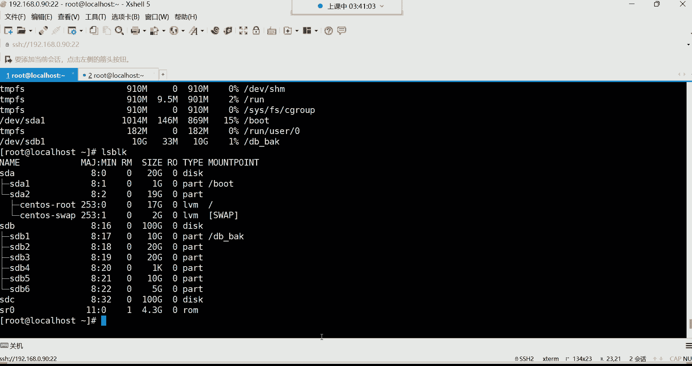

# 【小白入门必备】Linux运维进阶RHCSA+RHCE最全培训教程视频合集 - P24：红帽RHCSA-24.MBR分区、文件系统介绍、挂载介绍 - 洋洋得IE - BV1nN4y1X7Go

好那我们就开始，接下来呢来说说这个MBR这个分区格式怎么用，前面讲了非常多的理论，我们说这个MBR只能花只能去划分四个分区，然后呢又得去做什么扩展分区是吧，然后再在扩展分区里面去划分什么逻辑分区。

那这东西怎么分呢，你用哪条命令呢，用这个叫fdic for disco，这个命令用于查看磁盘的使用情况，跟磁盘分区的就是它既能看又能分区，但是我们用这条命啊，这最主要还是用它去什么分区啊。

而且是MBR的分区格式，用这条命令，那这个命令呢非常的简单，否定后面的跟上设备路径就可以了，这个设备路径。

这个硬盘呢一般不是都在div下面吗，看DV，所以你在分的时候，你得指定这个硬盘的所在位置，你看DV下面是不是有什么SDDSDC啊。

然后接下来呢，我记得我前面我我列了一个目录在这儿哈，在这里面呢，我是给大家准备了一个是DEV目录下的，文件详解，在这个DV目录下边呢，当然有很多东西呢，你自己去看看就行了。

你啊啊对我这个就想起来了这个HDID的设备，就是HD开头的，看了吗啊，还有一些软盘驱动设备，一般就是FD开头的。

然后MD开头就是软弱的设备，所以在这下边呢所有的硬件设备都在这个下边。

到时候你可以自己去看一看，你比如说我们在这个把这个拿过来看看。

有哪些是我们所认识的哈，拿出来以后呢，我们先找找这个有没有HD开头的，我就就是这样过滤的话呢，应该也过滤不到，比如说嗯嗯HD星没有是吧啊，没有HD开头的那SD开头，那肯定有了，我们换一个SD开头的好。

有这么多看了吗，这不就是我们那个硬盘吗，好硬盘SDSDDSDCSDA好，还有这个FD开头有没有呢，看DV下的DEVC的FD开头的，有啊，这是FD不对呀，这个0123不是哈啊，这是FB是吧。

FDFDFB嗯，0123啊，他给我们显示快捷方式，那没有，我是没有看到啊，我不知道是我的眼神的问题，还是我过过过滤的有问题，总之是没有看到，然后还有有没有这MD开头的呢，MD应该有MD型啊。

没有吗啊对我们没有做root，没有做read，那别的呢像这种什么回环设备，这个回旋设备有啊，那个卢卡尔look up，就这个哈，这个回音设备就是我们本地的那个回放网卡，L o。

那么本机不是有块回环网卡吗，if config config这个命令，那么就IPAS吧，可以看到是不是有一个LO啊，这个LO它是一个回环网卡，永远代表本机，那这个网卡呢它不也是一个硬件设备吗。

就他就这个哈，Look up，还有什么呢，还有这个，还有这个SR0给大家说说啊，这个SR0是什么呢，SR0是我们的那个系统的那个驱动，哪个驱动呢叫做镜像驱动，你啊那以前都叫光盘的驱动哈。

就是以前安装系统它是有一个什么呢，有一个那个放光盘的那个托啊，那其实那就是驱动器，你把那个呃一它一按一像早市的那个老电脑，你一摁呐，那个托儿就出来了啊，就弹出一个这个放光盘的那个什么呢，那个光驱对。

然后你把光盘放进去再摁回去啊，那个玩意呢就是我们所说的这个光驱光驱，然后在虚拟机里面SR0就代表那个光驱设备啊，它有一个快捷方式，对应的是seed room，睡着了嗯，真不错，你看啊。

你看啊这个SR0你直接看CDROM就行，你看CDROM的快捷方式是不是S0啊，所以他们俩是不是一模一样的呀，啊一样哈，还有哪些呢，还有像那个M1M内存设备，这种哈看到了吗，M1M的，这种就是内存设备。

然后，其实说白了就是你的内存条啊，就是你的内存条哈，还有什么呢，还有那个像NNNN这种代表是空设备，这个NN在这儿呢，NN还有这个for啊，这种都代表是这个空设备，一个是空设备设，一个是满设备。

我们说这个空设备跟满设备哈，什么叫空设备呢，我们也称之为叫黑洞设备，任何写入的数据都将被丢弃，这个首先你不能用普通命令去看一看，就直接乱码了，看不了哈，这种东西不能用cat去看。

所有的黄颜色的文件都不能用cat看，你比如我cat这个DV下的N你看了吗，无法访问，看不了哈，嗯打不开是啊，不是不是这个命命令错了吧，也不是说打不开，打开的看了吗，里面什么都没有吧。

这还没有还没有被乱码是吧，我跟你讲，你要看看别的，它就乱码了，你比如你像看这种什么DM开头的，你可以试一试什么SR0，你直接集齐就乱码了，DV下的S20，看到了吗，收这些乱码哈哈这些乱码了哈，第一位。

所以说这些东西都不能用命令直接看的啊，都是得需要去，后期我们要讲一个叫挂载的东西，挂载啊，完了后期我们说说为什么要挂载，那这个空设备呢，就是任何写入的内容都将被丢弃了。

这也就是我们前面在学习find的时候，有一条命令，我不知道大家还记不记得，是这样子的，就是我们用find去找一个文件find的，比如说我从这个VLOG下面，咱们去找一些文件是吧，日志文件。

然后是按照名字去找的时候，我们是找什么呢，找那些星点log的，没错吧，新点log的文件找到以后呢，我让你清空这个那些文件里的内容，然后我们是又加了一个大小，是不是大小，比如说加多少呢，加十兆啊。

就是十文件的大小是十兆以上的，然后我就清空它的内容，那怎么清空呢，是不是有一个EXEC啊啊额外的处理命令，但是正常来讲，你说我怎么清空呢，咱们前面已经试过了，echo不行，echo不行啊。

所以我们是这样用cat命令，然后结合一个对大括号，大括号是不是啊啊这开的什么呢，是cat把DEV下的，这个是DEV下的那个设备文件啊，是KY哈，我们是用拷贝对哈，CY拷贝拷贝这个文件的内容到什么呢。

到这个大括号里面没错吧，然后是这个左斜线分号结束了，我们是不是就那次就用到了这个黑洞设备啊，这个叫空设备呀，因为这个设备里面是空的，什么都没有，什么都没有的话，那就是你只要是给我拷贝。

我就是把这个一个空内容拷贝到你，我所查找到的文件里面去的话，是不是就我们所说的这个文件就被覆盖了呀，啊它其实就是一种覆盖机制，所以这叫空设备，还有一个叫满设备也一样，这个for啊。

满设备任何写入的数据也都将失败，就你写不进去，所以这个他们两个的功能是一样的，你用哪个都行，用哪个都行哈啊，还有像一些这个我们后期会用得到的。

什么TTY设备叫虚拟终端，你看我们现在看到这什么TTY1啊等等等等，这些黄色的是不是都是TDY开头啊，这叫虚拟终端，什么叫虚拟终端呢，就是我们想要登录系统，看我现在右击复制，我是不是又开了一个终端呢。

我现在又开的这个东西，我现在又开的这个终端，就是服务器给我提供的这个虚拟终端，我可以在这终端去管理这个系统是吧，啊就是这个时候你我每占用一个终端，其实就等于占用了这里面的一个设备，一个设备文件。

一个设备文件，这是额外的处理命令，就类似于管道一样，类似于管道的功能一样，可以让你在后边接其他的命令的啊，就是我每开一个终端，他都会帮我去占用一个最下面的一个设备文件。

所以说这个这个就叫做什么呢，就叫做虚拟终端设备总共是63个，也就是说我对一台服务器，我最多是可以远程连63个终端的，就对于这一台服务器啊，我可以用一个账号啊去同时开63个终端。

同时登录能列吧啊这T拍还有什么random，random的话呢，我们后面会讲在讲设有脚本的时候，在这呢random random呢叫随机数设备，这个随机数设备啊你也不能直接看哈，因为我们后期像这种东西。

都得通过一个叫变量的一个输出方式，把这里的东西给它取出来，所以这个呢先不过多介绍啊，什么这个u random那都是随机输入设备啊，port这是存取IO的一个端口啊，pot就是给我们提供这个服务器的。

一个端口的啊，这里面有吗，不找了哈，有证的哈，part有哈好，那以上呢就是我们所说的DV这个目录常用的呢，其实你像什么硬盘啊，这些是我们比较常用的硬盘表删了，还有后一些这个驱动。

我们在学习软件包管理的时候，这驱动呢也必须得用好。

那接下来呢咱们再继续说这个分区，我现在想分区。

那这时候我就得得指定那个设备路径是吧。

DV下的那个，那我这时候就否定刺客，指定我要对DV下的哪块盘呢，是不是SDD，SDA他已经没有空间让你划分了哈，我们来说一下啊，你看SDA那块盘，这块盘它的总共空间是不是就20个G，总共空间20个G啊。

然后你看下边是不是就有两个分区啊，SDA1跟SD2啊，其实你SDA1的空间，现在已经是用了19个G了啊，sorry哈，这SD1已经已经用了一个G了，然后SDA2已经用了19个G了。

再加一起不就20个G就没了呀，也就是说你这块盘已经没有空间，让你再去划分了，而且这块盘是什么盘的系统盘吗，你的跟咱们的根分区，不就在这个SD1这块盘里面的吗，啊所以这是系统盘，所以我们一般就不动不动哈。

所以我们一般分谁呢，分我们自己手动添加的这个硬盘，SDB跟SDC，所以这时候就否定四个DEV下的SSDB，先划分它，它总共不是100个G空间吗，我们现在要对它进行划分，回车注意回车就行了。

不用加什么选项，回车好，那现在我们会看到一个界面，这个界面啊，我们可以简单翻译一下哈，啊这个界面的话呢，大体的含义是什么呢，哦这翻译功能呢，哎呀这个设备啊，你说真真是让嗯，怎么感觉有有的时候它会失效呢。

我还以为是我这个频复制的太频繁了。

看来不是我还是把这个在勾选上吧，哈啊将选定的文本自动复制到剪贴板吧。

好吧是这样。

然后我再重新启动一下这个翻译工具吧。

重新启动一下吧，不好意思啊，我这个对，请三思是吧，主要是这个我这英语，你像我上学的时候，我英语是体育老师教的。

我确实是这个哈，确实我确实，我确实我得需要依赖这种这个翻译工具哈。

好看哈，如果好的话，还需要翻译吗是吧，如果好的话，不就直接给你们翻译了吗，不就口述了吗，看一下这个设备包不包含什么可识别的分区表，这这不用管了哈，我们这呃这个其实我跟你讲。

这搞搞技术的人呢没有几个英语好的啊，就在咱你像我很多同事，就我那很多同事，就我那很多同事啊，他们呢他们什么学历呢，有很多人都是，这个都是那个什么985211的哈，就以前哈嗯以前都是那个98521毕业。

那英语也不好，这都都那水平，可以这么说吧哈对一般我们搞计算机的，说白了也就认识点计算机常用的那个英，英文单词，所以一般英语都不是很好搞，技术也一样，但是如果你说你要是那些这个学专门学英语的。

人来学这个东西，他也不行是吧，所以我们一般都得借助一些翻译工具，这为啥计算机只要找英语的女朋友是吧，哈哈调琴是吧，嗯来说一下啊，这个我们现在做的操作呢，他告诉你了。

等会我们现在所有的更改都停留在内存当中，都在内存当中哈，嗯就是说我现在所有的操作都不会被什么呢，都不会及时生效，不会马上生效，等什么时候你决定将更改写入磁盘的时候，就是你什么时候保存的时候。

你的更改才生效，所以这时候呢我们就随便在里面分，怎么分都没事啊，只要你在没有退出保存，没有保存退出，怎怎么改都无所谓哈，所以随便练，现在哈哈你比较勤奋是吧，我对我确实有点比较勤奋，这个确实不是自夸哈。

我觉得我这确实一般呢，我这每天得工作十四五个小时，唉，成工作狂了啊，咱们这个说一下哈，怎么分呢，我们可以输入这个M获取帮助信息，因为对这个否第四个这条命令啊，我们也不知道怎么用是吧。

哎M呢获取一下帮助好了，获取帮助了，你学这个接受不了，主要是你英语不好，是不是没关系啊，就像我教你们的方法，翻译不就完事了吗，那对于这些这个帮助的话呢有非常多。

那你说这些帮助我们到底怎么办呢。

我们就一一个一个来吧哈，大多数呢翻译以后你也看看不太懂，杠A设置什么引导，扇区的设置为启动分区的这些听不懂吧。

所以翻译也没用，翻译也没什么用哈。

所以在这里边呢我给你们列举了几个呢，列举了常用的几个命令。

我们拿过来说一下，就说几个常用就可以哈，看第一个杠M杠M叫做获取帮助，这个在这里边是不是有啊啊给你打印帮助的，然后这个P是干什么的，P是显示磁盘分区表的，这个P我们来可以翻译一下这个P打印分区表。

这能看懂什么意思吗，就是你现在输入一个P回车在这里边哈，你一说P，它会帮你列出我当前那块磁盘有多少个分区，当然这里边呢呃会列出我们这个磁盘的大小啊，大小将近100个G啊，它是列不并不是很准确。

然后你这个磁盘总共有多少个扇区，这扇区你就不用去纠结了哈，这可以说是上亿个了，已经上亿个扇区，然后下边呢还有我这个磁盘啊，说每个扇区它的一个什么呢，一个大小，你看这告已经告诉你。

一个扇区可以帮你存储512个字节，这个我我们也不关心，然后这个磁盘的标签DOS是什么意思呢，它叫ms DOS，看就这个M代表是MBR的分区，而这个DOS就是你的一个标签类型。

其实你看到DOS你就能够马上就能够想到什么呢，就是这块硬盘的分区格式是MBR的，分区格式就行了，你们就记住哈，这个DOS就告诉你，你你这个分区，你这块硬盘是用MBR的分区格式划分的，就可以了。

那如果说你看到一块磁盘的标签是gt的，那就是用gt的分区格式去划分的，你说这有什么区别呢，在早期这两种分区格式是不兼容的，你比如我现在我有一块盘，我的这块盘呢是比如说我这个这块硬盘，我是用什么呢。

我是用那个MBR去划分的，甭管他多大哈，我划分了几个分区呢，我划分了两个分区，两个分区要存储数据，两个分区，但后来呢由于这个分区空间不够用了，我现在呢又想对它的空间啊，再去划分新的分区。

如果再想给他增加两个分区，再增加两个好，那这时候你要注意哈，你如果说再去划分这块硬盘的话，我们所说的这个MBR跟GBT不兼容，是因为什么呢，如果说你这两个分区是MBR的分区格式，然后这也一样。

MBR的分区格式，然后你再划分分区的时候，你用gt gt，那gt这个分区格式，它会把你原先使用BR划分的这个分区空间，给你格式化，有这里的数据没了，这就叫不兼容，也就是你这一块硬盘。

你只能选择一种分区格式，要么是MBR，要么就是GPT或者就是GP，总之这一块硬盘里面不允许出现两种分区格式，它就不兼容，能理解吧，这辈子能听懂吗，所以大家以后划分硬盘的时候，你要明白明白什么呢。

这一块硬盘就像我刚刚给你们介绍的，我说为什么要看那个磁盘标签呢，你比如说你到公司以后，你们公司这块硬盘呢，人家老板让你划分分区，你如果上去你看也不看，你就直接用这个，比如说那个你看这个硬盘。

如果说原先是MBR划分的，如果你上去，你就用GPT的分区格式去划分的话，那这块盘里面原先的分区的数据就没了，就被GBT给格式化掉了，那是不是数据就没了，那你怎么办，你这都跑路了吧，对啊对啊对。

就一山不容二虎，一个一个磁盘里面不允许有两种分区格式，只能有一种，所以这个磁盘标签类型，是不是就变得尤为重要了呀，好怎么看呢，在在这个用P就可以看哈，这个磁盘的标签好，然后下边呢这个标识符不用管啊。

这标识符跟我们没什么关系，然后下面这个设备，那设备的话呢在这里边现在呢就是一些什么呢，现在没有分区，没有分区哈，所以接下来呢我们可以划分一个分区，怎么划分呢，这个N这里面有个N，我们用M获取和帮助哈。

他这里边有个N，这N的话你看他说AD d new，你看这个啊，他说这是可以帮我们添加一个分区的，或者说增加一个新的分区，那这时候我们是不是，就可以用N来增加一个新的分区，回车回正哈，好。

那接下来他告诉我们什么呢，他告诉我们，首先你的分区类型，分区类型分为几种类型呢，就是分为两种哈，这个P呢就代表是主的意思，主的意思哈，privy嘛，private就主的意思，这个E呢代表是扩展的意思。

extend就扩展，所以说他现在有两种分区类型让你去划分，那你到底要划分主分区还是划分扩展分区，你说我上来就划分扩展可以吗，可以啊，就是你他这它是这样子的哈，咱说我这是一块硬盘，那MBR的话呢。

他不是说可以让我们划分四个分区吗，总共是不是，那你说我主分区我不要了，我上去就直直接来一个扩展，剩下我就直接在扩展分区里面去划分，可不可以呢，可以可以啊，没有任何问题的。

但如果你说我还要划分几个主分区也行，所以这就看你的需求，但默认的话呢，它是给你选择了这个P就这个主分区了啊，默认的default，默认默认主分区，所以说那你要不要就直接分主分区呢，如果是的话。

你就直接回车就行了回车，所以这辈子就直接回车了啊，我就要划分主分区，那接下来呢分区编号1~4，因为MBR啊，它就这特点，我最多就给你划分四个分区出来，所以编号就是从1~4，呵呵现在第一个编号就是一。

你要不要选择这个一作为你的分区编号，默认是不是一样好，回车就行了，它能识别到你这个磁盘，现在一个分区都没有，所以就直接给你分这个编号一好了，下面吃起始扇区，这个扇区我呃我在这边我给大家说一下哈。

就是它呢其实是从2048开始一个磁盘啊，从2048扇区开始，剩下的话呢就是你这个磁盘里面，总共可以划分这么多个扇区，你现在希望你的第一个分区划分多少个扇区，卧槽这他妈的，我如果要这样划分的话。

这磁盘我都不用分了，比如我现在我想划分十个G的空间，的一个分区的话，好那你如果按照扇区去算的话，你得自己去算一算，这十个G的空间到底得多个扇区，才能组成十个G空间呢。

你看这里边总共允许允许你划分多少个扇区呢，我们数一数啊，个十百千万十万百万千万亿，就我现在一个100个G的磁盘，我他允许我划分2亿多个扇区，那十个G的话，我得多少个扇区啊，要不要算一下呀，不算哈。

所以这位置不算哈，起始扇区就2048开始，那默认为2048是吧，然后这个位置哈，我们这个是不是敲错了这位置啊，然后这时候你按回车的话，你回删你回山就不行了哈，回删不了怎么办呢，按住CTRL键再回山。

注意啊，按住CTRL再回山，如果你直接回山的话不行，就变成这个效果了吗，所以按住CTRL再按，再按回车就可以了啊，那这边起始扇区不需要管哈，回车好，那你看默认就是从2048扇区开始，剩下的我往后去划分。

那接下来，那你这个空间去选择一个多大的空间呢，你可以通过扇区去选择，我们没有人去通过扇区去划分的哈，或者你看这or就是或者的意思，或者你通过这种加号，后面直接跟大小。

那个大小可以用这种K兆G的方式去指定大小，那这是不是就对于我们来讲就比较人性化了呀，你看我们就比如说，我现在要划分一个十个G的空间，我就这个加号代表添加的意思好，那后面那个size大小是吧。

那指定多大呀，哎十个单位是G诶，那就是他给你支持的单位K招G哈哈，那这样他就直接帮我们划分出一个，大小为十个G左右的一个分区出来了，然后分区一这是它的编号类型是LINUX类型的，大小为十个G。

那这时候我们再通过P去显示磁盘分区表的话，这时候你就可以看到，当前你这个磁盘里面有一个分区，那设备是在div下面，名字叫SDB1看到了吗，起始扇区2048开始结束扇区一直到一啊，一直都这么多。

但是这个大约多少个呢，应该是个十百千万10万百万千万，2000多万个扇区，也就是说咱们不是总共分了十个G的空间吗，是吧，那你这十个G的空间里面，如果说按照扇区去计算的话。

你这个里边是有2000多万个扇区，然后这2000多个扇区，一个扇区可以帮你存储，512个字节的数据，所以这些东西，我们说就没有必要去这样计算了呀，没错吧，不能这样记，不能这样算啊。

你就知道大小将近十个G就行了，这就可以了哈，将近十个G的空间，但是它这个设计呢默认也不是以这种K招啊，这个那种G的方式给你显示的，你发现它这里面好像看他，他这压根儿就不是什么呢啊，叫块儿是吧。

叫块儿读不懂读不懂，你自己划分的时候，你自己心里清楚就行了，能理解吧，好嗯这是第一个分区，是不是就除掉了呀，好那接下来呢我们还想划分吗，如果还想继续划分的话，就继续N就可以了，N回车好。

那下面那是不是还是继续选择你的分区类型，到底是主还是扩展呢，那么这不还是主啊，好那你要不要选择呢，如果是的话，你还要分主分区就回车啊，分区编号现在是从2~4了，默认是二，因为你已经有第一个分区了。

它已经识别到了，看到了吗，这就是你这个分区编号已经识别到了哈，接下来回城就默认就二就可以哈，那扇区这个扇区啊，你发现他现在从多少开始了呢，我们看最后结尾哈，六八结尾的吧。

这个六八结尾就是你上一个扇区的一个什么呢，一个结束啊，就是下一个扇区的结尾啊，对开开头，你上一个扇区的结束，就是你下一个扇区的起始啊，接下来呢它就会从这个编号删除的编号开始，往后面继续划分啊。

还现在允许你划分这么多个，是不是不用管呢啊回车对就可以了，接下来我们就指定大小呗，我再划分一个20个剂子，那就加20个G，注意单位可注意这个单位啊，一定不要忘了哈，单位不要忘了，如果你单位忘了啊。

默认就变成K了，还有20K了哈，能理啊，不是啊，默认就20个扇区了，如果这个这个你不加的话，默认就20个扇区，就你这一个分区里面就只有20个扇区的大小，那里吧，那20个扇区能存多少个字节。

是不是对单位不要忘了哈，好那现在第二个分区出来了，P回车看一下SDBSDB，那我还要不要划分，要划分就N回撤好，那现在还是分区类型为主，这个P是吧，主分区要不要呢，好回车还是主分区编号三回车扇区不用管。

回车大小加20个G回车，然后P查看一下第三个分区出来了吧，好那现在关键的时候来了，咱们不是说这个MBR，这个分区格式最多只允许我们划分四个分区吗，反正它甭管怎么样，你这个分区编号总总共是四个。

注意是主分区的编号哈，总共四个，那接下来我们再分哈，现在已经有三个了是吧，再再N回车，你看现在你发现这个默认的就不是P了，就什么就是E了，就变成扩展了，就变成x ten，变成扩展了吗，看到了吗。

变成扩展了哈，因为它已经识别到了，你已经有三个分区了，你已经有三个分区了哈，如果你再划分第四个分区为主分区的话，那你就真的是最多只能有四个分区了，你比如我现在我就非要划分第四个分区为主。

我就自己手动输入P我不用默认的了，我手动输入P回车好，那这时候扇区也不用管回车，那大小比如我加多少呢，加20个G回车再P查看，那现在是不总共四个分区就出来了，SDB1到SDB44个分区吧。

好那这四个分区现在有了之后，你说我这总共磁盘，怎么是将近100个G的空间呢，这并不是很准确，它显示是什么，107。4个G是吧，这总共就100个G左右，我们这100个G的空间，咱们想象一下。

你说我这个前边的这个这四个分区，分别是多少呢，2467，那才用了70个G的空间呢，是不是他们总共在加到一起，才70个G左右的空间呢，那我现在是不是还剩将近30个G，左右的空间呢。

那这30个G的空间我怎么办呢，我不能浪费呀，我不能白白浪费吧，那怎么办呢，我能不能给它扩容到某一个分区里面呢，或者我能不能再去划分一个新的分区，给他分30个G呢，来试一下哈，N回车，你发现就直接。

他说如果你要创建四个以上的分区，注意看哈，必须先将你的主分区替换为扩展分区，这句话什么意思，就你现在已经有四个分区了，SDB到SDB4，而我这个分区格式，我就最多只允许你有四个分区。

因为数量现在已经满了，唉就你再有划分已经不允许了，但如果你还想再去划分更多的分区的话，那怎么办呢，哎你得帮你得，现在必须得将你的主分区给它替换掉，替换成扩展分区了，能理解吧，替换成扩展分区了。

所以这个时候是不是就不能再去划分了呀，那你说我们前面是不是还剩30个G的空间呢，那怎么办呢，这30G的空间白白浪费了吧，用不了了，因为他没有办法扩容啊，这种普通分区没有办法往某一个分区里面扩容。

空间的这三轮就浪费了，而且你现在分区数量也最多只能有四个，能不能满足条件呢，如果不能，那也没有办法哎，所以这时候我们怎么办，是不替换呢，怎么替换呢，三删掉一个分区，把第四个这个主分区给它干掉。

哎怎么删呢，D叫删除一个分区，所以这时候我们就什么呢，就直接输入D，然后回车回车哈，唉这时候呢他就问你了，现在总共有四个分区，默认删除四要不要删，如果你就想删除第四个，你回车就行。

如果你说不想删除第四个，你手动指定编号就可以了，但是咱们不就想删除第四个吗，回车好，现在分区四是不是就没了呀，这时候你再P回车，现在是不是SDB1到SD3呢，三个主分区好，那这时候我再划分分区N回车诶。

现在长记性了吧，是不是应该划分这个扩展分区了呀，所以这时候我们就E啊，当然其实你就直接默认就可以哈，删除分区里面的数据，当然了，你分区都没了，数据就没了哈，数据就没了，好那就是我们默认回车就行了。

默认它不就是这个扩展分区吗，啊编号是四，也是我现在的第四个分区，我的第四个分区就是我的扩展分区了，现在哈第四分区好，那个扩展分区它它不就一容器吗，啊我们来看一下，那这个容器你也得给它分配空间呢。

因为这个扩展分区最终它里面要装，怕，我们是要在这个扩展分区里面去装这个，逻辑分区的东西，那我问你，你这扩展分区没有空间子，你怎么去装这个逻辑分区呢，是不是得给扩展分区划分空间呢，好给他多少空间呢。

那接下来我们扇区不用管，回车好，接下来大小大小的话，那现在我们应该还剩下多少空间呢，前三个分区我们看一下哈，这是20，应该是50个G空间没了，我前三个应该是50个G的空间已经没了，因为SDB1是十个G。

SDB2跟SDB3是分别20个G，总共50个G没了吧好，那现在我应该还剩余50个G空间，那这50个G的空间，我现在，应该怎么给这个扩展分区呢，应该怎么给呢，应该给他划分多少呢，你们觉得划分多少才合适啊。

啊直接搜花是吧对啊，这第四个分区，你注意一定要全都交给这个扩展分区，如果你不全都交给扩展分区，你比如我留个20个G空间好，那你这20个G空间放心，用不了了，就用不了了哈，因为最多分区数量就四个。

你留下来也没有意义，留下来用不了，最主要的是所以呢全都给他哈，那怎么全给啊，就是你现在什么看，你看到这默认了吗，看到默认了吗，默认为剩余的所有山区全都给这个分区诶，那你就不用管了吧。

直接拍回车就可以是吧，因为默认就给所有嘛，回车好，默认他把所有的剩余的空间，都交给了那个第四个分区，这时候你再P查看一下哦，那就是说你看它的类型不一样，叫XTEND，叫扩展的意思，成长不过了。

一路回车了对这真是一路回车了哈，分扩展的时候一路回车，而前三个呢是主分区啊，其实类型就是LINUX类型的，那就说白了就可以正常帮你存储数据的，就是LINUX类型的，而这个呢不能正常存储数据。

它是一个扩展好，那接下来，你说我这个扩展里面是50个G空间呢，那我得用啊，我是不是得在里面划分区啊，怎么划分呢，一样哈，N回车，这时候你看叫什么呀，叫逻辑分区五，这时候就是添加逻辑分区五了。

那其实就是我们在这个图里面，这是不是叫逻辑分区了呀。

因为你在扩展分区里边，我们划分的分区，它叫逻辑分区了啊，这叫为什么叫这名字，你甭管哈，就一名而已，这样你就不用去纠结，那你说这个逻辑分区五，我们现在分呃，现在划分的话，最终就是用来帮你存储数据的。

跟主分区的功能是一样的，所以这时候你就编号就不用管哈，呃然后他这个扇区呢，它这个空间用的就是你这个扩展分区里的空间，现在我所有的划分，都是从扩展分区里面分出来的，所以就默认扇区不用管回撤大小加多少啊。

比如说加十个G回车P看一下好，那现在你看我这个扩展这个SDP5，Sd b5，是不是这个正常存储数据的，就是LINUX类型的呀，啊大小将近十个G，那我现在还能不能划分呢，能呢。

因为你这个将近50个G空间呢，是不是你还划分，那就N回车，那你看现在再添加的话，是不是就编号就六了呀，好那咱们多少呢，咱们就继续回车，咱们少加点行吗，加五个G我们看最多可以划分多少个行吧。

五个G回车P看一下啊，现在第六个分区出来了，哎呦，但是我觉得他逻辑分区最多可以划分11个呢，那这个还有这么多分区，我觉得这有些麻烦了哈，到时候你们感兴趣可以详细自己试验一下，试验一下，你比如说给小点。

比如说给三个G啊，两个G啊，一个分区看你最多，然后你试验一下，最多它可以划分多少个分区出来啊，主要是验证我们这个现在SA的类型的磁盘，可以划分多少个分区啊，可以自己验证一下，十多个是没有问题的，好。

那现在我们是不是用我们我们现在这个啊，怎么查看分区属性为扩展，这儿呢这儿呢哈看到了吗，这不是S3吗，为扩展好，那现在我们这个分区现在已经这个什么呢，现在已经有了，现在我们就保存退出，注意啊。

我们现在就保存退出W就保存退出啊，怎么知道五跟六是扩展啊，五跟六的话不五跟六它不是扩展，五跟六它是正常的存储数据的分区，它不是扩展呢，它的类型也不是S，他也不是扩展类型的。

我们只不过是在这个扩展分区里面，划分的更多的分区而已，它不是扩展类型哈啊只有它是扩展类型的，第四个就是它不能存储数据，能理解吧，而这些存储数据的类型都是LINUX类型的，所以这就没有什么扩展所言了哈。

就名字不太一样而已啊，只不过它叫逻辑分区，这叫主分区，就是没有没什么差别，就都是帮你存储数据的，怎么区分主分句啊，这个嗯我们一般如果区分的话呢，你要是这样看，我们一般都得去按照我们的个人使用习惯。

去区分啊，我们一般按照自己的一个经验吧，可以这么说，就是你在看一个分区的时候，你比如我现在保存，我现在说保存了，保存以后呢，我现在用SSB了，K我现在一般通过分区的编号去看分区编号。

我通过分区编号怎么看呢，我一般呢我得看它这个分区的类型，我得先这样就是LSB了，K然后呢杠F啊。

这个还有一个选项哈，给大家说说，完了啊，这个否定4K有一杠选项啊，否定4K用否定词看。

有一个杠L选项跟上DV下的SDB，我这样是不是可以看出它的磁盘类型啊，注意哈，我是不是可以看出这个分区，是用什么方式划分出来的呀，可以看得出来是吧，然后具体呢我就可以看出在这个硬盘下边。

每个分区它的一个信息是吧，然后接下来呢他会告诉你啊，这里边如果有扩展，是不是就显示扩展了呀，有扩展就显示扩展了，那我其实我一搭眼我就知道啊，我的第四个分区是扩展是吧，那五六就是逻辑的。

五跟六就是逻辑了哈啊，就通过这种，就是一些完全是靠你自己的这种经验去判断，通过方法去判断就行了，你看你第四个分区是扩展，前三分区肯定是主分区，因为对于他的这种分区类型，它的风格就是这样的。

最多只为你划分四个分区，但你第四个分区是扩展，你切四个分区肯定是主分区了，能列吧，就就就这么判断哈哈就这么判断啊，但你要说你说了，真的我看看具体的分区类型看不出来吗，你比如说我这个用，用这样看啊。

Sdb1，你如果这样看的话呢，他也不会告诉你说啊，这我这个分区是逻辑分区，它没有，或者说我用IOS这加block杠F，你这样看也没用，他也不会给你显示，它只是给你显示分区名字能列吧。

所以说只能通过这种方式去看哈，你看首先看他是用什么格式划分的，你看你一看他用什么格式划分呢，其实你就了解他这个划分的风格了，剩下的就自己判断就就清楚了，你就比如现在对。

你就比如说现在我我现在就让你们判断，我现在就问你们，就现在这个分区，就假设你们在不知道的情况下，我现在问你们，就这从1~6这几个分区里面，你们只要了解这个MBR的分区类型。

你们自己能不能看得出来哪些是主分区，哪些是扩展，哪些是逻辑分区，能不能看得出来，能看得出来给我刷个一，啊能看出来是吧，唉对说明你们有经验了，说明什么，说明你对，如果你是正常画片都能看得出来。

说明你说明你们现在有经验了吗，就没什么问题哈，就这样看，然后接下来呢阿拉斯block对看一下啊，现在呢我们看SDB这块盘，它呢是总共是六个分区是吧啊，这六个分区里面呢，我们来说第四个分区这个空间哈。

空间那这1K呢不对哈不准，这其实就是扩展分区，扩展分区啊，所以你想看的话，你得用这个否第四个，这样看的会更加精准一些，否定词和杠跟上那块硬盘，你就可以清楚的知道哪个是扩展分区，就这样看哈，好那分区有了。

接下来这分区我现在想存储数据怎么办，你看我们现在是不是有很多的分区啊，也划分出来了，有非常多的分区，现在是分区一分区二分区三啊，然后一直到分区N啊，非常多的分区了哈分区。

那我现在我想用这些分区去存储数据，那怎么办呢，我怎么往这个分区里面存储数据啊，我们能够直接把文件直接给它放进去吗，能够直接能直接放进去吗，不现实吧，放不进去怎么放啊，咱们那我们就来说一说哈。

正常来讲我们怎么来使用这个LINUX系统吧，我们来我们怎么使用这个LINUX的一个系统，我们比如说我想存储一些文件，我进到那个我我这个进我创建个目录吧，再跟下哈，我ALEX看一下。

我在跟下创建一个哪个目录呢，那make dr，比如创建一个叫dB bi这个目录呢，我准备后期啊，专门去存储一些我数据库的备份数据，就存储一些备份的数据哈，数据库里的备份数据。

我以后要准备往这个分区里面存了，那正常，我是不是就把文件往这个目录里面拷贝啊，或者用tr命令压缩啊，是不是啊啊就是不是这样子的呀，就是这个文件是不是往目录里面存的呀。

你见过我们有直接把文件直接往DV下的，比如说这个SDB1里面存的吗，我能这样吗，CP比如我把这个哪个文件呢，就比如我把我当前路径下的文件给他，拷贝到DV下的SDB1吗，是这样玩的吗，啊哈哈哈，是我不开。

是这样的吗，好好像没有这么玩过吧，啊是不是没有这样玩过呀，我们好像没有直接把文件往这个分区里面去，装的吧，有吗没有吧，那你说好，我把文件存到这个分区里面，好像还没有提示分吗，报错是吧，好像能存进去吗。

touch在第一位向SDB1里面建个文件，比如叉叉叉叉点TT，可以这样玩嘛，啊这个这哪有这么玩的呀，是不是我直接在分区里面去直接建文件吗，那你说如果说咱就像刚刚研究，我拷贝好像没有出现什么问题是吧。

就算是没有问题，你怎么看呢，你说IOS吗，DV下的SDB1cat吗，是这样玩的吗，啊这这这哎你别说了，你们说嘿，你们看这里面还真有数据，是不是是不是好像真看到数据了吧，是不是我建个文件啊。

它是一个hello，点t t hello，在贴贴啊，然后我们往里面写个内容哈，写个内容，未找到命令安一个哈，不管了，就vi吧，Hello，点铁T写一个hello，保存退出，再验证一下拷贝，这样哈。

copy把这个文件给他，拷贝到DV下的DV下的SDBE要覆盖吗，要覆盖，然后这时候我们来看这个这事儿吗，这这是内容吗，你们发现这是内容吗，好像不是吧，而且我这看以后好像就直接出bug了。

看到没出bug了哈，是不是直接出bug了，这好像没有这么玩的吧，没有这么玩的，所以怎么用这个分区存储数据呢，你是不能直接用这个分区的啊，这没有，它不允许你这样直接用的这个分区。

现在SDB1虽然说是有了这儿呢，虽然说有了我们无法直接使用的，因为它没有一个口，什么口啊，入口没有一个入口让你直接用，那这个入口怎么我才能给他打开一个入口，让我使用这个分区的空间呢。

那这时候哈目录知道什么叫目录吗，你看我们正常使用系统的时候，咱们建文件做备份，是不是都是往目录里面，比如说我往这个目录里面建个文件，在目录里边呢，把文件给他拷贝到这个目录里面去啊，是不是啊。

但目录的本质是什么呀，其实目录的本质它就是一个入口。

什么入口呢，磁盘分区的入口，我们文件是往目录里面存，这没错，把文件存存到目录里边了啊，这确实是确实是这样用的这个目录哈，我把文件是往这个目录里面存是吧，但目录本身它能它有空间吗。

我问你目录本身它有存储空间吗，计算机的存储空间是什么，就硬盘还有内存，别的哪有哪有地方能帮你存储数据啊，哪有空间呢，所以怎么办呢，所以啊我们说这他是这样玩的，就是这时候我们是结合着这个我找一个标哈。

找一标好就拿它了，这时候他他怎么玩的呢，他是就是做一个叫挂载的操作，什么叫挂载，就是把这个分区跟这个目录给它相互关联一下，他们两个关联一下，关联一下哈，这是我的分区，然后这是我系统里面的一个目录。

看到吗，这个目录哈，而他们俩之间给它相互一关联的话，那这时候他这个怎么玩呢，就是我们这个文件啊，我们文件是不是往目录里面存的，比如我在mod里面建个文件，那这文件最终跑哪儿去了呢。

唉他说跑到这个分区里面去了，他是这样子的对，所以这叫挂载的操作呢，就是什么呢，什么叫挂载呀，前面啊，这什么叫挂载，首先呢在LINUX系统当中，用户无法直接使用这些硬件设备的，用不了。

因为硬件设备都是以只读的方式存在，就是你只能看他的信息，你不能直接使用它，所以必须得挂载，那是不是要挂载，挂载，就是给用户提供一个可以使用这个设备的，一个入口或者说接口，而这个接口是什么呢。

这个接口得是一个目录，你的挂载点必须得是一个目录，而且理论上还是一个空的目录，因为我们最终数据是往目录里面存的，没错吧，我们是不是这文件都得放到目录里面的，所以你的挂载点就必须得是一个目录。

然后接下来呢我们把文件放到目录里面，就等于说就直接干嘛呢，直接存到这个分区里面了，那很多人说老师，那我不是空目录，怎么办是吧，比如说我这个目录里面原先有一些文件，有些文件哈有两个文件，然后呢我就干嘛呢。

我就把这个分区跟这个目录给它相互关联了，那这时候它由于文件系统类型不一样，会导致你这个目录里面原先的文件给你覆盖掉，他不能说覆盖就暂时隐藏，就暂时隐藏起来，还不是山，也不是覆盖，就是这个分区。

他会帮你把你这个目录里面，原先存储的文件暂时隐藏起来，你找不到了没了，就它不是删，也不是覆盖就没了，那什么时候能出来呢，就是你把这个挂载点卸掉的时候，这个文件就回来了，哈哈就回来了哈。

所以说这个为什么理论上也是一个空目录，就是这个原因好，那这是第一个哈，我们说清楚了好，那第二个注意事项，一个文件系统不允许重复挂载的多个目录，什么叫一个文件系统，其实就一个分区不允许重复挂载多个目录。

你看我现在有几个分区呢，我现在有12344个分区是吧，比如我现在我这一个目录啊，我还想干嘛呢，我还想再挂载下面那个分区，可不可以挂在两个分区，一个目录往一个目录里的数据，往两个分区里面存，可不可以呢。

不可以，这个他不允许他不允许哈，没有，为什么他就不允许哈哈，不允许不允许你这一个目录同时挂在两个分区，这样不行啊，所以这种就不行，那第三种第三个注意事项，一个目录也不允许重复坏的多个文件系统。

也就是说我现在这个什么呢，现在这一个目录这个分区三哈，这是一啊这一个分区，比如我现在又有一个目录，我现在有两个目录，或者说很多个目录又来一个目录了哈，第二个目录我现在又来一个目录。

接下来我能不能再把这个分区三，再给它挂载到这个目录上面呢，可不可以不可以不允许哈，也就是说这一个分区，它也不允许你重复挂载到多个目录上面啊，1V1对哈，这种只能1V1能理解吧。

所以你到时候别说我这一个分区，我能不能再挂载到，别到挂载给别的目录，可不可以不可以啊，他不允许，这没有，为什么，那你空间不够了，咱们是吧，你空间如果你的，比如咱们就说这分区三空间不够用是吧。

比如100个G被我存满了，那怎么办呢，再去建新的分区，再去建新的分区，然后把这个挂载点给它卸掉，把这个目录跟这个分区的挂载点给它卸掉，那卸掉以后你的数据呢数据在分区里面呢，你这目录它只是一个。

我们说就类似于一个通道一样，这目录就一通道，你一卸载了数据就直接在分区里边呢，然后呢你再去准备新的分区，比如这分区我是我新划分的100个G，那这怎么办呢，这时候哎再往这个分区上挂载以后。

这就用这个分区再去继续存储数据，他他是这样玩的，这就是我们所说的那个物种，这种我们叫物理分区，就直接在物理硬盘上面划的，划分的分区叫物理分区，没有办法扩容空间不够了就满了，你只能再去划分新的分区。

再去存储数据，对如果你想要看以前的信息，还得挂回去，但是我们一般呢可以再新建一个目录吗，你新建个目录重新挂载不就可以了吗，是不是哈哈哈哈哈，或者说你想看以前的数据。

如果这个目录你说哎我们动不了某些程序呢，它默认就会往这个目录里面存，我动不了，不能动，没关系，你再把这个分区挂到一个新的目录，这数据呢就又跑到这个，你就又可以看了，以后从这个目录里面看。

就看的是这个分区里的数据，它是这样子的，啊这我们所说为什么要挂载，这挂载现在能听懂吗，我为什么要挂载，现在能理解吗，理解的话，给我刷个一挂载哈，就这目录它就一通道，任何的系统目录都是一通道。

这个通道呢会帮你把文件给它干嘛呢，给他传输到这个硬盘的分区里面去，因为通道，说清楚是吧，那接下来我们这个有了分区以后，我们是不是得挂载呀，那怎么挂呢。

用哪个命令挂载呢，mt mt这条命令是一个文件系统的挂载命令，那这命令格式呢也是比较简单啊，mt设备路径挂载点目录。

看一下啊，咱们现在是不是在跟下面建了一个目录啊，这个叫dB back这个目录啊，好那我现在mount指定把这个设备路径。

你得先指定，得先指定设备路径哈。

设备路径就是你的分区的路径，DV下的SDB1，这是你的设备路径，挂载到哪里呢，哎指定一个目录就可以了，因为这目录就是你新建的挂载到灯下的dB back，开这个目录上面去回车，这里面什么。

拉了一步哈拉了一步，挂载成功了，DF杠一次看一眼，啊没有挂载成功是吧，没有看到没有看到正在使用的一个信息是吧。

落了一步哈，这步啊光给大家讲这个讲那个挂载了，对前面少了一部叫格式化，格式化哈，就这个分区啊，咱说有了分区以后，他差什么东西呢，差一个叫文件系统的东西，所以说呢我们现在这个文件系统啊。

给大家讲讲干什么用的，文件系统又叫文件的管理系统，它呢是说白了哈要管理分区里的文件的，所以我们赋予分区的分区一个管理系统，这个分区里边文件里需要管理啊，比如文件的属性，文件一。

一个文件可以存储多少数据等等等等，都得需要一个管理者，所以这个文件管理系统，就是管理这个分区里的文件的，所以你得赋予它一个文件管理系统，分区才可以正常使用，然后有的时候你可能会听别人说。

什么我的根文件系统，我的什么boot文件系统，其实指的就是它的分区，指的就是它做它的这个分区，能理解吧，那下边呢由于这个文件系统有很多种类型，所以呢我们给大家说说，在早期4S5那个系统的时候。

这分区默认使用的文件系统叫EST系列，三版本，这个EST首先是个大的系列，它是一个大的系列哈，然后在这个系列里边，在这个大的系列里面呢，它又分不同的版本，像早期四和S5的版本。

那就是呃用的是EST系列三版本，然后现在呢，当然一这个3345你已经见不到了哈，你已经见现在都看不到这种系统了，六的话现在都非常少了，因为六都已经不维护了，而六这里面用的是etc的四版本的文件系统。

那这文件系统到底干什么用，怎么管理，给大家讲讲呃。

首先呢我们先说这个EST4，这个文件系统的特点哈。

EST4这个文件系统啊，我们就拿这个分区来说哈，拿这分拿这个分区，拿这些分区来说哈，比如现在我这个分区是这个，我划分了多少空间呢，划分了啊算了，先不说空间吧，哈不说空间了，这是一个分区。

如果说我给他格式化成一个EST系列的四，E4版本的一个文件系统，EST4的一个文件管理系统，文件管理系统，那它首先呢就是帮我管理这个分区里的，整个文件的，那首先它带有一个叫做日志记录的功能。

什么叫日志记录功能呢，可以避免数据丢失，就有的时候比如说你服务器也意外宕机了，你一般当机的话呢，可能说导致有些数据啊，在内存里边是不是没有被及时写，没有被及时的写到硬盘里面，因为数据得经过内存处理。

然后才能最后写到硬盘，那有的数据如果你没有及时的保存下来，那这数据是不是就丢了呀，但没关系，哎，这文件系统啊，它会帮你记录你这个服务器啊，在开机的时候都做了哪些写入的操作。

就哪些数据在内存里面准备要写入硬盘，他会给你记录啊，记录用记录有哪些操作，记录完了以后呢，比如说哎确实服务器意外宕机了，数据没有被机制保存下来，没关系，你服务器当系统再次重启的时候。

他能够去读取那个日志文件，帮你把没有保存的文件呢，给你再快速的恢复回来，然后保存保存下来，所以说最终就是帮你避免数据丢失的，这这这EST4啊，这种日志记录的功能默认就开启了，你不用管。

还有这种文件系统啊，它单个文件系统最大支持100000000B的分区容量，就是说我想给这个分区赋予一个文件管理系统，我这个分区呢由于空间比较大，我划分了，我当时给他分了1亿1亿B的容量。

那你可以用ET4帮你去管理这个分区啊，包括什么文件的存储啊，文件的读取啊，啊他都可以帮你去管理文件的属性，在这个分区里面都可以帮你去管理，还有在这个分区里面，比如说我这一个文件我可以存多少数据量啊。

单个文件最大可以存储16个T的数据量，已经很恐怖了哈，你想想一个文件存储16个T的数据，你看你自己电脑之后，你看看你自己的电脑，你总共你电脑的空间才多大呀，有的时候这一台服务器它的磁盘容量也没。

有时也用不到16个T的那么大的容量啊，所以说这种已经很恐怖了，一个文件可以帮你存储16个T，是不是就很恐怖，但一般不会存那么大的数据量，因为这16个T型数据都在一个文件里面，这我们怎么去查询呢。

这得你想这16个T的一个数据量，你比如我要查询某一个某一行内容的话，他得从上到下挨个去给你，把这16T的数据都给你翻一遍，找到以后呢还不行，还得继续往下翻，从头翻到尾，从头翻到尾，然后呢告诉你啊。

我找到了这一行，再给你反应回来，你这光查数据，你就得查个10分钟，8分钟的，能理解吗，哈哈哈啊，所以一般不会去存一份文件，不会存那么大的数据量哈，啊这是ext4的文件系统。

那还有一个文件系统呢叫做XFS，现在是比较主流的，在sin方X7这个系统里面，默认使用的是叫XFS的文件系统，这个XFS它也是开启了这种日志记录的功能，也是可以帮我们跟前面一样啊，避免数据丢失吗。

都是日志记录，都是避免数据丢失的，但是这个超FS它在数据恢复的时候，速度比EST4要快一些，怎么快呢，你可以这么去理解，这个每种文件系统都是有自己的内部算法的，这个差FS这个算法呢可能说比较简洁。

所以执行效率就比较高一些，所以数据恢复速度比较快一些，但是这种算法没有人去研究，因为科学家们研究出来以后，我们用就可以了啊，你没有办法去研究它这个算法，你就知道这个速度恢复，这个恢复速度比较快一些。

然后呢单个文件单个文件系统啊，说白了就是单个分区哈，这一个分区最大支持800000000B的分区容量，比如说呀我这个还有一个分区，我用的是插FS的文件管理系统，插FS文件管理系统。

那这时候在这个分区里面这一个文件啊，不是先说这个分区容量啊，它可以最大支持8EB的空间，这个分区我分的空间比较大一些，81B非常恐怖了吧，81B的容量好差，FS可以帮你管理，但是ESD4管理不了。

他没有那个能力啊，超出它的范围了，还在这个分区里面的文件，我建一个文件，我可以最多存储多少个数据呢，500个T的数据，一个文件可以帮你存储500个T，而下面这个呢16个T，这不是一个级别的是吧。

是不是不是一个级别的吧，没错就不是一个级别的，这是1亿笔分区容量，单个文件16个T空间，这是81B的分区容量，单个文件500个T的空间，这就是区别哈，而且数据恢复速度也比较快。

所以在sin pls7里边，在4note7里面，那个分区默认使用的文件系统类型，就差FS这个类型的能理解了吧，而这个读取速度也非常的快，它每秒读取速度可以达到四个G的数据量，这已经很快了，我跟你讲哈。

已经很快了，开始做系统的时候选过是吗，这是我们所说的这个XFS这个文件系统，也就是我们现在以及未来，比如说如果你学这个高级的版本的系统，比如说红帽的IHEL8版本的系统，用的也是X分区哈。

分区默认使用的文件，系统类型也是差FS类型的，能理解了吧，所以差这个差FS这个文件系统，现在是被业界称之为叫最主流的文件系统，所以我们7/4里面默认分区就是用，用的是这个OK啊，这就是呃什么叫文件系统。

但是得先格式化呀，怎么格式化呢，这个哈格式化的命令是MKFS。

我们刚刚啊没有格式化，所以他报错了，接下来呢你得你得给它格式化一下，这时候哈MKMKFS后边哈哈，你得跟上你的系统类型，EST4还是差FS，但是得中间加个点，比如说我要给他格式化成XFS的。

那后面就跟着插FS，最后指定DEV下载DEV下载SDB1回车好，有没有格化成功呢，怎么看呢，是不是iOS block呀，杠F跟上DV下的ST一直接看他的这个file system，文件系统。

插FS类型是不是有文件系统的呀，唉有了文件系统，那接下来咱们当然，这下面还有一个ET4的格式化命令啊，这大家作为了解就行。

作为了解哈，好接下来我们就要挂载挂载呢，mt mt挂载。

拿过来好，mt指定把DV下的我们直接给它调用过来哈，SDBE挂在哪里呢，根下的dB bike模回撤哎，这时候没有报错，你发现了吗，是不是挂载成功了吗，DF杠H看什么呢，看正在使用的分区信息回撤。

这时候看这个挂载点，先看挂载点哈，挂载点这里面是不是有一个叫dd bike呀，这个DB DB back，不就是我们刚刚自己手动挂载的吗，然后他的那个分区是哪个分区呢，看文件系统这个位置。

DEV下的SDB1，这个分区就在为这个目录在存储数据空间，容量是十个G的容量，然后呢已经使用多少，还可以使用多少，还可以使用设计，这已用33兆，这是文件系统，也有一些也需要占一些空间啊，这个没有多少。

是不是可以用了，那以后我是不是就可以往这个这个dB back，目录里面去存储数据了呀，跟下的bb back建100个文件，Hello，一点点100，这100文件是不是建在这个分区里。

建建在这个dB bc目录里面了呀，没错吧，好来我给你讲讲，我退出去，接下来呢比如说我这个空间被我存满了，比如这一比如说这十个G的空间被我存满了，存嗯嗯，就是现在文件没有办法再继续往里面存储了。

好那怎么办，我是不是得得用别的分区啊，阿拉斯block看所有的分区信息，那这时候我就再准备一个SDB2，这个分区我这时候啊想卸也行哈。

对那咱们卸载，咱们先给它卸掉哈，怎么卸载呢，叫幽梦u mt命令。

用于卸载文件系统的u mt，直接跟挂载点目录就行了，而接下来我们就u mt指定DP ma好，卸载了以后你再看这个dB的时候，你发现这里面没有东西了吧，空了是不是空了呀，没关系，我们在干嘛呀。

是不是再给他再搞一个别的分区啊，或者你不好，你或者你不好，你再新再新建一个目录，我看那个文件跑哪去了，我主要说那文件原先建了100个文件跑哪去了，我再建个目录MADR，我再建一个什么呢，再建个。

比如说dB by1杠一，这是我在mt指定把DEV下的，Sdb s d b e s s d b，一挂载到这个刚刚那个目录里面去啊，进到这个目录看到了吗，文件跑哪儿去了。

文件是不是跑到这个新建的这个目录来了，所以说这目录是什么呀，这目录能帮你存储数据吗，目录不能真正把你存储数据的是什么呀，是分区，而这个目录是什么呀，就一通道是不是就一通道好。

那以后你说我这个这个分区已经存满了呀，那以后怎么办，哎对就是一个门哈哈，那以后你的这个dB back，再可以再继续挂在别的分区就可以了，哪个分区呢，比如说block啊，SDB2还没用呢，是不是。

那接下来我就格式化MKFS，点差FS，对DEV下的DEV下的SDB2，这个分区格式化，然后alos block杠F看文件系统是不是有了呀，插FC类型的，接下来mt把DV下的SDB2挂载到这个模。

啊sorry哈，根下的dB，那以后我是不是就继续再往这个目录里面存，就可以了啊，那我再往这个目录里面存，是不是用的就是另外一个分区了呀，没错吧，所以说这样就像这种物理分区呢，你没有办法。

我当初比如我就给他分了多少G空间呢，我就给他分了十个G空间，它存满了就存满了，你只能用别的分区再继续去存储数据，能列吧啊但是数据丢没丢呢，没丢不丢哈，一直在这个分区里面放着，只要你不删。

它就不会丢啊啊这是我们所说的这个怎么去呃，这个用MBR的分区格式去划分硬盘，然后为什么要格式化文件系统，以及为什么要挂载啊，怎么去卸载，以及这个相关的一些概念，开机自动挂载，明天讲，还有GBT分区格式。

明天讲呃，逻辑卷呢也没听讲，本来我准备今天能够讲到逻辑卷的，但结果哈我觉得我们这讲的也什么呀，我觉得我们这节奏也也没拖沓呀是吧，但没想到啊，没想到哈哈，两个主分区一个扩展。

后面再弄一堆分区里面不知道哪个是主分区嗯。

这个就我前面不是说过这个事情吗，前面说过呀，就用这个看吧，用咱们拿另外一块硬盘来说啊，咱们呢SDC来说，我现在呢就这样哈啊，就否定思考否定斯科，我现在呢就直接对它做分区了哈。

DEV下的DEV一下的SDC分区，我直接给他分扩展行吗啊，或者你说的两个主分区，两个主分区哈，这个N回车啊，N然后回车分区一回车加20个G的空间啊，十个G吧，好第一个出来了吧，再分一个N主分区。

回车编号二，回车回车加十个G的空间，回车两个分区出来了吧，接下来再分，我要分扩展了哈，E回车编号三吗，好然后回车回车回车好，第三个分区是扩展是吧，是不是，第三个分区是扩是扩展了呀，好那接下来我再分N。

然后注意哈，你现在如果再分的话，那它还允许你再继续划分主分区呢，在允许你划分主分区哈，好那这个时候，我怎么办呢，看到了吗，自己选自己选了，如果你这样划分，其实按照我们的个人使用习惯来讲。

我就不能再去划分主分区了，其实我其实压根就没有这样玩的，压根儿没有这样玩的哈，我给你删，我告诉你，如果像你那样划分，你知道怎么分吗，我把这个三也删掉，我把这个二也删掉，我把这一页删掉，如果像你那样。

我们都不会说分两个主分区，我就直接就这样上来就扩展分区，分区上来就扩展，上来就扩展哈，是不是扩展了分区编号一一回车回车，所有空间给扩展，是不是，这一这个扩展分区是不是就占用所有空间了呀，那接下来干嘛呀。

分区我要主分区吗，不要主分区了，L扩展分区了，是不是，然后回车加十个GP看这扩展频的编号是五啊，快产品编号五编号是五哈，你说这234呢，234都是主，234都是主哈，所以它本质就允许你1234都是主。

只要有五以上的，从五开始都是什么叫逻辑分区，从五开始哈，往后都是逻辑分区，像你前面也一样，像你前面那种其实不是很符合逻辑，你说我分两个主分区，一二没关系，然后第三个分扩展了是吧，你分第四个的时候。

这编号你放心，也不可能让你手动去选择五的，知道吧，所以你就记住哈，你怎么去，或者说像这种方法就是怎么说呢，可能说大家比较好理解，如果像你真想知道说哪些分区就是逻辑分区，就看编号就行了。

如果是MBR的分区格式，五以上的包括五都是逻辑分区，能列了吧，就就这样去区分就行了，你但如果再划分逻辑分区编号，那就是六开始了，看了吗，比如再加十个G这样比较这样，这样可能对于你们来讲比较好区分是吧。

这样可以，是不是哎对这样比较好区分哈，明白了是吧，那我就Q哈，Q退出不保存哈，不保存也是这个磁盘呢，我们也并没有对它做实际的改变，明白了是吧，OK啊明白了，所以就看编号就可以了，今天就到这里吧，好吧。

各位我们明天再继续讲吧，看来这磁盘管理这内容还是怎么说呢。

还是蛮多的，录屏的。