# 【小白入门必备】Linux运维进阶RHCSA+RHCE最全培训教程视频合集 - P25：红帽RHCSA-25.开机自动挂载、GPT分区、LVM逻辑卷 - 洋洋得IE - BV1nN4y1X7Go

好那我们就继续开始了哈，咱们今天该讲哪一部分的内容了呢。

我们今天该讲这个，还是继续讲磁盘，我们昨天这个磁盘讲到了这个挂载，然后卸载呢，我们昨天也涉及了一点点是吧，那接下来我们在这儿来说一说这个我们昨天。

来看一下哈，我们昨天添加了那几块磁盘，用iOS block这条命令可以显示出所有的磁盘哈，你就拒绝了你的女朋友是吧，哈哈好样的，我们男人就应该这样子，接下来呢我们来看一看哈，我们昨天挂载的那个目录呢。

我们看一下哈，你看这是我们昨昨天分的那个区，这几个分区是不是啊，但你看那目录呢，这个昨天我这个SDB，我是不是挂载到一个目录上面来呀，但那目录呢哈哈我看目录在不在哈，这目录在呢哈。

你看跟下的dB bike是不是在这呢啊啊在这呢，但是这个为什么这个他自己卸掉了呢，我跟你讲哈，我们昨天这个挂载啊，我现在再给你们挂一遍，mt指定把DV下的SDB1挂载到那个根。

下的是dB back这个目录是吧，挂载以后呢，这个目录里面有文件，这是我们昨天建的文件。

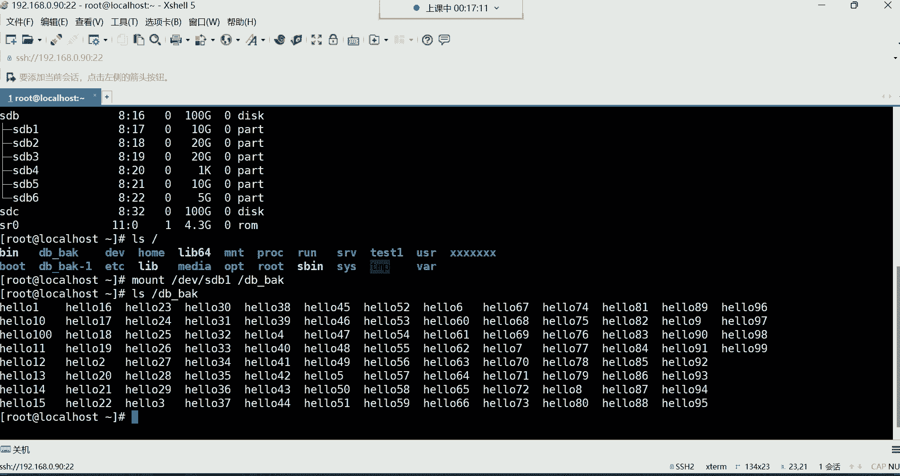

然后我给大家说说，我们昨天这种挂载叫什么挂载呢，叫临时挂载，mount这个命令啊是一个文件系统的挂载命令，而我们后期在学习这个软件包管理的时候，我们也会用到这条命令，然后嗯对就是临时挂载哈。

没有永久挂载，那命令格式是非常简单的mount，然后设备路径挂载点目录，就是我要把这个此啊，把这个分区挂载到我系统的哪个目录诶，这个顺序还是蛮正常的是吧，然后到此为止呢，我们来给大家做一个小总结，好吧。

这个总结呢就是我们对硬盘分区，再到最后的存储数据，我们经历了哪些个步骤呢，第一咱们是添加了硬盘了，添加硬盘以后呢，我们怎么看呢，用iOS block这条命令，可以直接去看这块硬盘。

到底有没有被系统识别到，然后接下来的硬盘识别到以后呢，是不是开始分区啊，那划分分区用的命令是这个叫否DISS，跟上那个硬盘的路径就可以了啊，然后就对它做分区，接下来呢就在里面一步一步的去划分分区。

那分区有了以后呢，想要存储数据是不是还需要格式化文件系统啊，哎这就是说得需要格式化文件系统，最后呢再做一个挂载的操作，这挂载你得先创建一个挂载点目录吧，好创建好目录以后呢。

我们再挂载用mt去挂载就可以了，最后呢查看分区的使用情况，是不是DF杠H这个T的话是也可以，顺便把那个分区的文件系统呢，一起给它显示出来啊，这个T我们昨天并没有用到。

是吧啊，就这样DF杠H加个大T就可以了，回车这样呢，它是把所有当前系统正在使用的磁盘信息，给我们列出来以后啊，这个这个位置还多了一个文件系统的类型，就是哪个分区用的文件系统是什么类型的。

这时候呢他们就都给你列出来了，你看这有的目录，你发现这有的目录怎么文件系统不太一样啊，哎他这个文件系统啊，我跟你们讲啊，就是分区是有自己的文件系统的，你比如说这个像我们自己挂的这个分区。

还有这个自己挂载的这个还有根目录像这种哈，这种是正常的普通的分区，一般会用这种插FS类型的文件系统而已，有的这个属性它不一样，你比如说像DV这个目录，DV这个目录放的是什么呀。

我们说一般都是硬件设备是吧，硬件设备呢它是有自己的文件系统类型的啊，像什么d v type f s，还有像这种这个有一些这个我看哈，你们找找像啊，bot都不算了，差不多吧，像这些文件系统类型呢。

呃这个你不用去纠结，这是系统啊，它自己去分配的，所以这个呢你简单了解一下就行，这个我们平时用不到的这些文件系统，我们是用不到的哈，我们用的话就会用这个IXFS，这是我们在分区的时候啊。

我们手动去格式化就可以了。

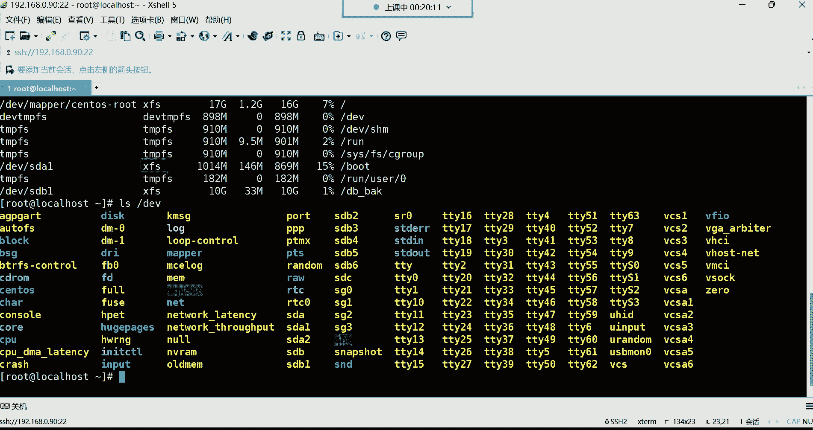

好那下边呢我们对于这个卸载的命令啊，我们前面说这个挂载，这挂载叫临时挂载是吧。

临时挂载就是它的优点就马上就生效了，你这样看的时候，他马上就生效了，就直接就给你挂载上了，但是缺点是什么呢，就是我们这个机器一关机，哎，下次再重启啊，这分区就掉了，这分区就自己掉了哈。

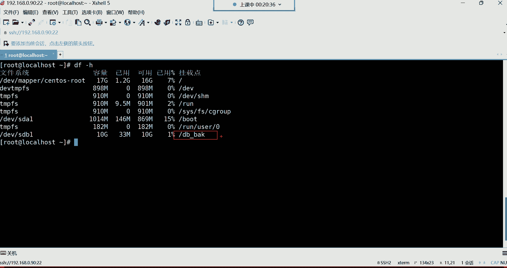

那掉了以后可不行啊，那接下来我们要给大家设计的，要设计一个叫做开机自动挂载，这个开机的自动挂载，就是我们想实现这个服务器啊，开机以后能不能够自动的帮我，把我想挂载的那些分区给它挂载上啊。

我不需要再去手动敲个mt命令了，唉这样呢也是可以的，这种呢我们就叫做就叫做开机自动挂载，那我们需要去修改它的配置文件，这个文件呢我们前面已经练习过很多次了，在etc有个叫f s table。

这个文件用于存放文件系统信息的，当系统启动的时候，系统就会自动读取这个文件的内容，将指定的文件系统挂载到指定的目录去，说白了。

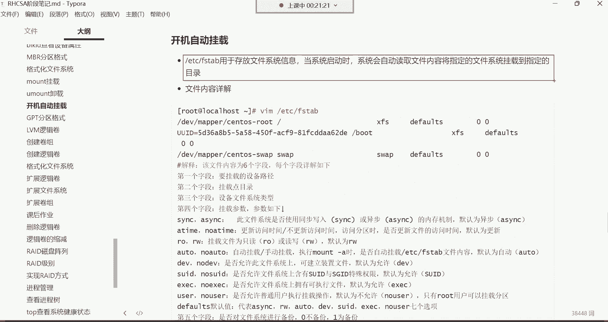

就是做开机自动挂载的，打开etc的f s table这个文件啊，我们没有V嗯，没有VM吗，啊算了vi吧，那就etc下的fs table，打开这个文件以后啊，他这个文件就是让我们做这个开机自动挂载的。

我看这里面他是个有没有详细的介绍，可以访问的文件系统，根据参数维护在DV下的DK这个路径下边啊，这个呢可能确实是这个读读的不是很读的，有些我们说叫稀里糊涂了是吧，我们就看内容吧好吧，因为他这个介绍的话。

你看他这个介绍确实是哈哈哈哈哈哈哈哈，你们看到了吗，什么水由水水网在3月时创造是吧，这个咱就别理解这些东西了哈，咱就说这个下面我们就说有用的配置哈，有效的配置几行呢，现在默认的情况下就三行。

然后这三行的话呢第一行是什么呀，第一行就是我们的根目录，我们的根目录哈，就那个挂载信息，也在这个文件里面的第一行放着呢，它这个格式我们怎么去什么呢。

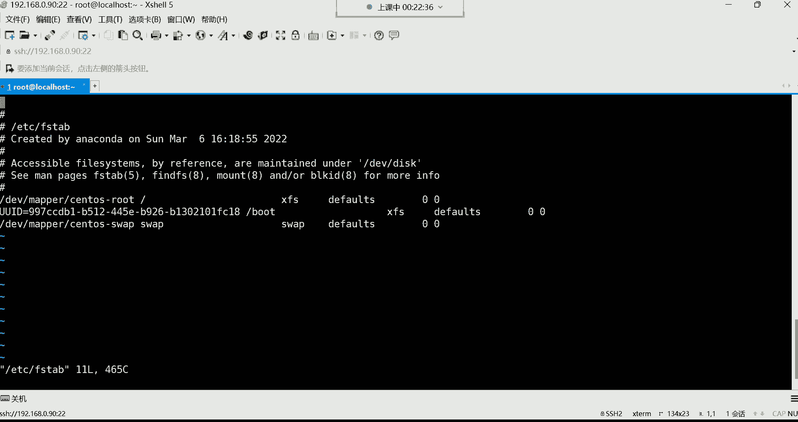

怎么去解读它这个配置文件的格式呢。

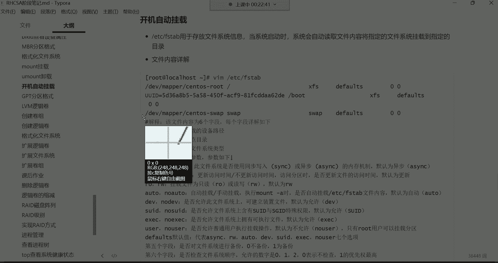

它这个每每个字段都不一样，我们拿过来他的每一行呢。

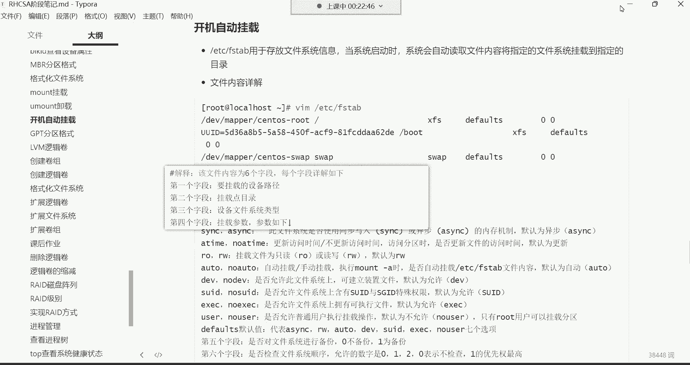

就代表一个自动挂载的参数，我们放到这，放到这儿，咱们来看一下每一行啊，都是一个挂载的参数，然后呢我们拿第一行来说，这个第一行啊，它是分字段的啊，当然也就是列的意思哈，然后我们从左往右数。

他这是用空格做了一个分隔符，那总共这有几部分呢，哈哈这算是一部分啊，这呢又是一部分了，第三部分，第四部分，然后第五部分，第六部分，那也就是说这个文件里面每一行总共是有六列，有六列哈。

那每一列是什么意思呢，我们先从第一页，从第一列来给大家说，第一列就是我要挂载的这个设备路径，我要挂载的设备路径，就是说我想对哪个分区挂载，那我们自己在下面往下写就可以了，我要对DEV下的谁呢。

SDB1做挂载好，挂载到哪个目录呢，主要这里面就不要敲MONT命令了哈，这里边你不需要敲MONT命令，它会自动帮你找到这个你的你想挂载的设备，自动帮你挂载上的，所以没有MONT命令，可那一说哈。

就指定设备路径，然后呢再指定第二列，第二列就是我的挂载点目录，就是我想把这个分区挂载到哪个路径下面，挂载到根下的dB back这个目录，那这里面就不能tab键了哈，你只能手写了。

那第三列这个就得你指定这个，你就得指定你这个分区的文件系统类型了，这就是你在格式化的时候，你格式化的那个文件系统是什么，你就写上去，文件系统呢是插FS类型的，这是我们格式化的时候插FS类型的好。

接下来呢第四列呢这个default，这default就是一些挂载的参数了，这个参数都有哪些呢，这个参数可非常多了，在这个里边哈，我们说一下这第四列，你看他这个文件里面是用default来代表的是吧。

那你知道这default它代表了多少个参数吗。

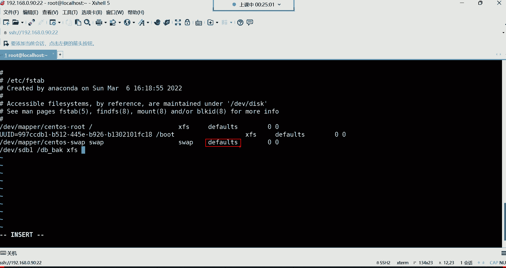

我们一会再说，如果你不用default的话，这挂载参数从这儿开始，一直到这都是我们可以手动指定的挂载参数，这里边呢你看比如像什么SYNC，这个就是用来表示如果这个参数你指定的话。

就是此文件系统是否同步写入或异步写入的，这种机制，什么意思呢，他这东西就是做一个同步的机制，但这个同步的话呢，我们一般呢肯定是就是选择默认的啊，就叫它默认是E叫做E不，他这个同步跟异步的关系呢。

我怎么给大家解释呢，其实这个呃不应该放在这个位置解释，因为这个位置解释有些乱啊，这个我们先不说哈，你就知道啊，这个异步写入就可以了，好然后还有这个下面这些参数，比如说是否更新文件系统，文件的访问时间。

默认为更新，就是别人在你这个分区里边查看哪些文件的话，你这个文件的时间要不要更新，要更新啊，还有像什么阿O阿达，这个RORW挂载文件系统的时候，你这个文件系统的权限是什么权限啊，RO呢就是读写权限啊。

sorry哈RO是只读权限，RW呢代表是读写权限，然后一般呢我们都是默认的读写权限，如果说没有写权限的话，这个文件你也存没有办法存到这个分区里边，能理解吧，所以像这种的默认即可，还有像这种这个凹凸啊。

NO or to什么自动挂载，手动挂载这些东西，你在执行这个mt杠一的时候，这个我们后面会讲这个MEI啊，是否帮我们自动挂载这个文件里面的一些内容，默认是自动的意思，就你一执行这条命令。

他就读这个e t c f s table这个文件啊，帮你把没有挂载的设备呢给你挂在上啊，那这些你看是不是都有一些默认的参数啊，所以说像这些总共多少个呢，12345678，总共是八个参数。

这八个参数如果说你想手动指定的话，比如说呃我希望我这分区不能往里面写入的话，那你可以手动指定这个RO这个参数啊，用逗号隔开就可以了，但是我们有我们能这样做吗，我们不能这样做吧，我们肯定是要干嘛呀。

我们可能是要让这个分区能够存储数据用啊，所以这所有的默认参数都是标准参数，那这些标准参数我们怎么去写啊，难道手动的一个一个写上去吗，什么SYNC，还有像这些那么rw auto。

然后中间每一部分用door割开吗，啊我们需要这样子吗，不需要有一个默认值叫default，这个default就是代表所有的参数的一个默认值，就以上这些参数它的默认的值是什么。

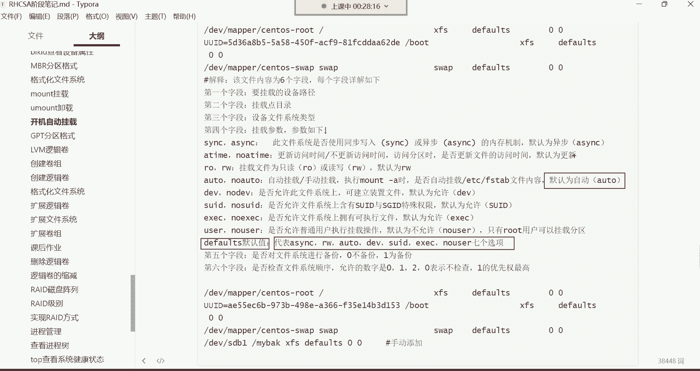

我default就全都代表了，所以你看这个配置文件里面这个default，你可以把它理解成是所有参数的一个标准，参数的一个代表方式，所以我们在用的时候呢，也就是default啊。

代表用所有参数的默认值就可以了，能理解吧，然后呢这后面两个零是什么意思啊，你看他后面都有两个零是吧，这两个零啊。

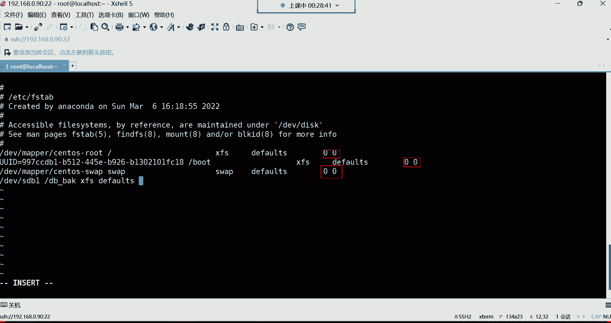

我们先说第一个零，也就是说第五个第五列，第一个零叫是否对文件系统进行备份，这零是不备份，一是备份什么意思呢。

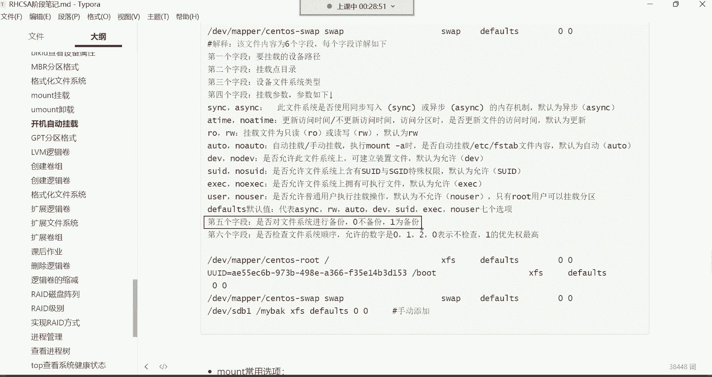

就是这个分区啊，这分区咱们不是用来存储数据的吗，那这个分区的数据存进去以后，我要不要对这个数据做一个再做一个备份啊，但是这个备份你想做也行，但是我们一般不会在这个里面去，做一些什么备份。

因为在企业里面你想备份的话，我们一般会自己单独去，比如说我是在企业里边，可能会有一个单独的服务器，这服务器是专门用来做数据的备份的，然后你可以把这个数据啊哎给他，到时候你给他传到专门的备份服务器里面。

去做一个备份，你这种备份它也没有必要啊，你怎么备份，它不都也是对这同一个分区的数据做备份吗，啊也没有那个必要，所以一般呢这都是零，我就不备份我的文件系统了啊，然后下面这个第六个。

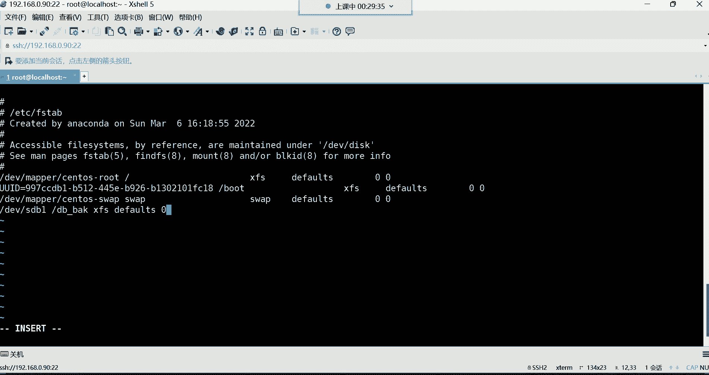

第六列叫是否检查文件系统的顺序，他这里面啊什么顺序呢，它这个顺序就是对谁先挂载。

你看它这里面是不是1234，那我们自己手写的是吧，哎1234他这边有个顺序。

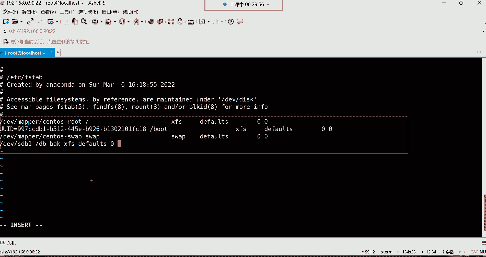

他这顺序呢有个优先级，这优先级呢哈哈允许的数字呢是从012开始，这零就代表不检查顺序。

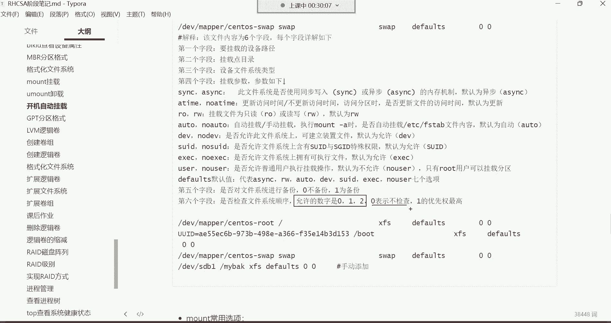

一呢就是一的U级最高他留言集啊，我们一般不会去设置这个零，就是说哎呀，我不检查我这个文件系统的挂载顺序怎么挂呢，就按照文件，你按照文件，你看这不是第一行吗，它这里边哈，这是不是第一行啊。

然后接下来呢这是第二行是吧，那没有顺序的话呢，它就是干嘛呢，哎先帮我们挂在第一行，然后再挂载第二行，然后第三行第四行，那那那这个顺序到底它体现在哪里啊，其实这个顺序你永远都得是根分区。

它的顺序是排在第一位的，因为你所有的数据都在根分区下边呢，所以肯定是不是肯定是要先挂在这个根分区的，你别的分区你先挂载的话呢，其实意义也不也并不是很大，因为你包括我们就这个目录。

它是不是也在根分区下边呢，所以我们肯定要先挂在根分区哈，所以说这个顺序不检查的话，他就干嘛，他就优先帮你把根分区挂上，然后再挂在别的分区，再挂在这个boot分区，因为不分区也是在根分区里边的呀。

所以你看他永远得先挂在根分区，所以就不用检查这个顺序就可以了，从上到下这顺序，你别说老师我，我把这我把我的这一行写到第一行，可以吗，你要把这个写写到第一行的话，那你就得要调整你的顺序了。

这时候你就得调整什么顺序呢，这时候你就得调整啊。

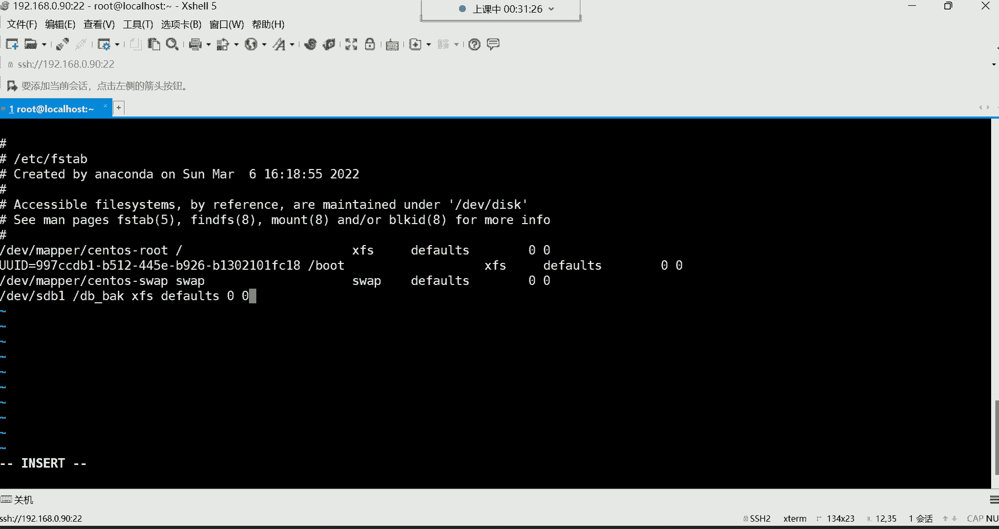

一的U1的优先权最高，这时候你就得把这个根分区的挂载。

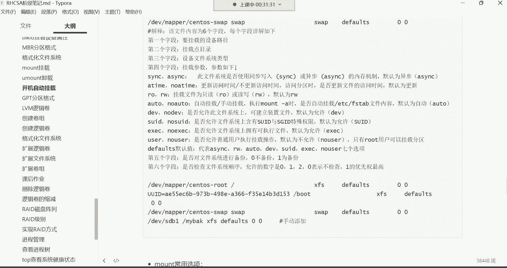

它的这个位置零，你要给它改成一，为什么呢，因为它一定要先挂在根分区啊，它这个优先级是这样子的嗯，就以此类推了零二吗，以此类推就先挂载谁再挂载谁。

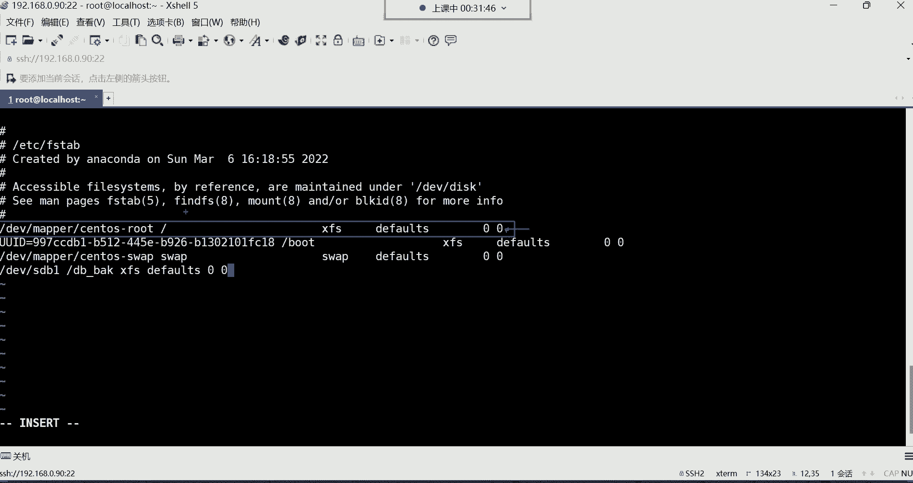

012吗，因为一一的又一是最高的吗，一是最高的，零就不检查了，012，所以说这种东西没有必要去指定的哈。

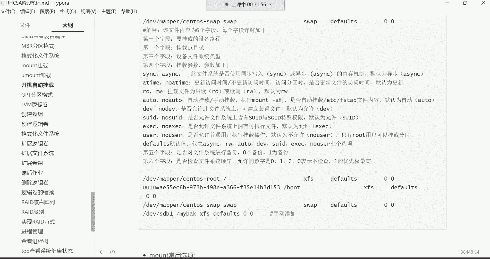

我们不指定，所以知道一下就行，那它这里面啊，你看他这里边只要你中间有一个空格就可以了，这个这个配置文件语法哈，但是如果你说老师，那我想按照别人的那个什么呢，这个排版我想让他对齐可不可以啊，可以可以哈。

这不就是空格吗，比如文件系统跟文件系统对齐，然后这个挂载参数跟挂载参数对齐，这两个零呢也是它对齐，是不是可以也可以哈，如果说你这人你说我就啊必须得这个让他看，这样看着舒服一些也可以可以。

但不对齐也无所谓哈，保存退出。

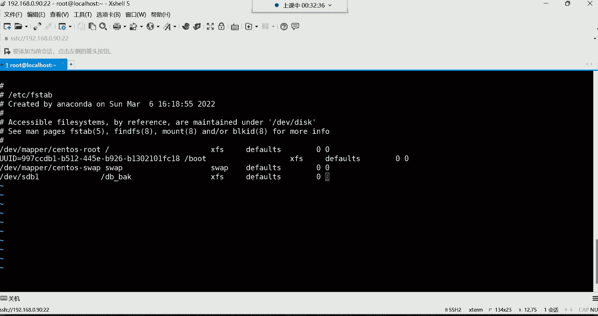

保存退出以后呢，这里边我们前面是不是涉及到什么一个执行，mount杠一时是否自动挂载etc f s table里文件呢，那接下来mt这条命令它有一个常用的选项，就是一个杠一，这个选项，杠A这个选项。

就是帮我们依照这个配置文件里的这个数据，将所有没挂载的那些磁盘都给你挂在上，所以这时候你可以用mount杠a mt干样。

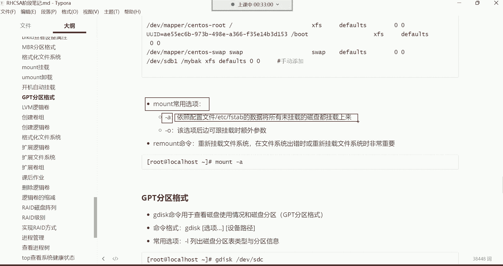

然后回车，这时候他就帮我们去读这个文件里的配置了，一看哪些分区没有挂载，它自动帮你挂载，那陈老师我怎么能验证啊，我先给你们卸掉哈，我先u mt，咱们把dB back给它卸掉，卸载了是吧，卸载以后呢。

我再用mt杠A注意看哈，回车，DF杠H，你看你看是不是挂载上了，是不是改成了，我再给你们写一遍啊，看一下啊，u mt杠A啊，sorry哈，U mont bb back，然后这是你在DF杠H是不是没有。

那个是不是这个已经被我们这个挂载电影，已经被我们给卸掉了呀，现在看已经看不到那个目录的挂载了吧，好那这时候我再这样mount杠A，这时候你在我们在DF杠H看一下哎，是不是又自动挂载上了呀。

就是这条命令会检测那个配置文件，一看哪些没有挂载，就帮你重新挂载上，一旦配置写到这个etc fs table那个文件里面了啊，对一旦写到那个配置文件里面以后呢，那开机就是我这个机器关机了。

下次又开机没关系哈，他一开机它就会读那个文件，它就会自动帮你把那个分区给你自动挂载上。

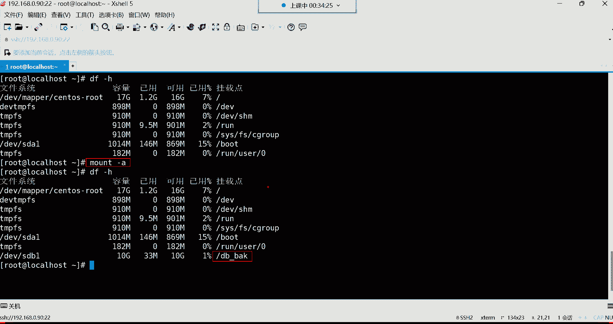

能理解了吧啊，所以这也叫开机自动挂载，这命令还有一个杠欧，这个杠欧这个选项，后面可以跟一些挂载时的额外参数，那这个呢，我们一般就是在什么时候会去用这个杠欧呢，就是我想修改一些参数的时候。

比如我这个咱们参数已经挂载上了。

然后我想去修改的时候，mount杠O后边可以跟一些你想修改的参数。

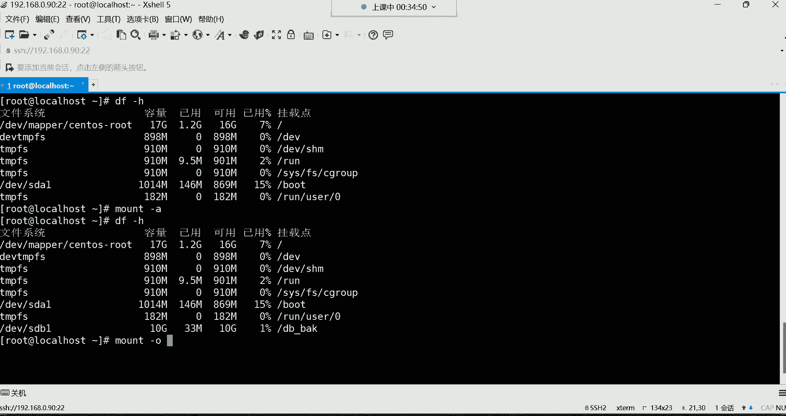

那这个参数你就得从这里面去找你，比如我想去修改哪些参数啊，这个到时候嗯，但是我们现在用不上啊，我们现在用不上，因为我们现在挂载的时候，我们都没有用过杠O，所以这钢欧呢什么时候能用得上呢。

这高欧一般在比如说你的这个机器，如果有一天发现啊，哎呦我的机器开机发现出现异常了，怎么异常了呢，就是好像，是随机挂载空目录吗，不是啊，是你配置文件里面指定的哈，是你就是它这个是量他mt杠A啊。

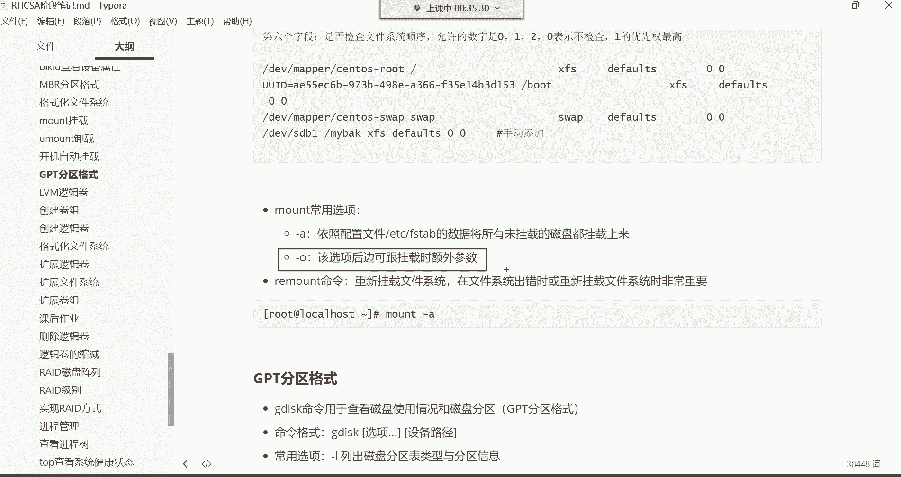

它它是帮你检测那个配置文件的，帮你帮你检测这个etc f s table这个配置文件哈，所以他就就是检测类文件，他一看哈，比如说这个没有挂载，他就把你挂载上一看，如果再有的话，那他就继续帮你检测。

继续帮你挂载，他是这么回事，他不是挂载空目录啊，你这目录即便有数据，他也因为你写到配置文件里呢，他也给你挂载，就这么回事儿，啊把对对对哈，就把那个文件里的内容给你执行一遍。

老板说一下这个杠欧哈杠O什么时候能用到呢。

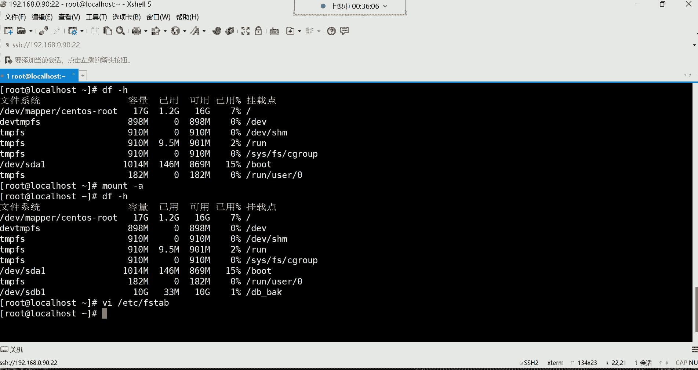

比如有一天你发现你这个系统启动的时候，好像出现异常了，无法正常进入系统了。

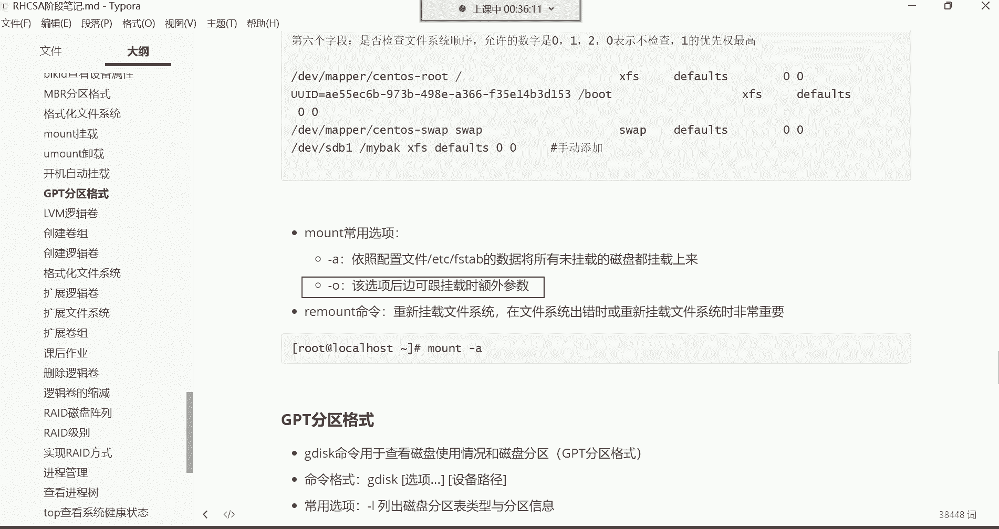

那可能是你系统里面的那个boot分区掉了，哪个bot分区呢，就是在一个文件里面的这个boot分区，它的挂载点可能是掉了掉了哈，因为你的系统内核就在这个boot分区里边存着呢。

这boot里边不就放一些内核的一些数据吗，跟下的boot看到了吗，这就是内核内核文件哈，所以说包括系统的启动程序，graph都在这个bot里边，因为我们咱们系统一启动，它首先要检测这个什么呢。

group那个引导程序啊，他得这个先去检测，比如说这个硬件，那是否都正常，然后他再去控制硬件，应该哪个硬件先启动哪个硬件后启动哎，这启动顺序都得有group控制，但如果有一天发现你这个机器开机诶。

无法正常进入系统的，那有可能是boot分区的挂载点没挂上，bot分区掉了哈，boot分区掉了，所以就系统无法正常启动了，那这时候我们就得采用什么呢，叫做维护模式啊，就root用户的维护模式是吧。

去进入系统，最后呢再把这个boot分区给它挂载上。

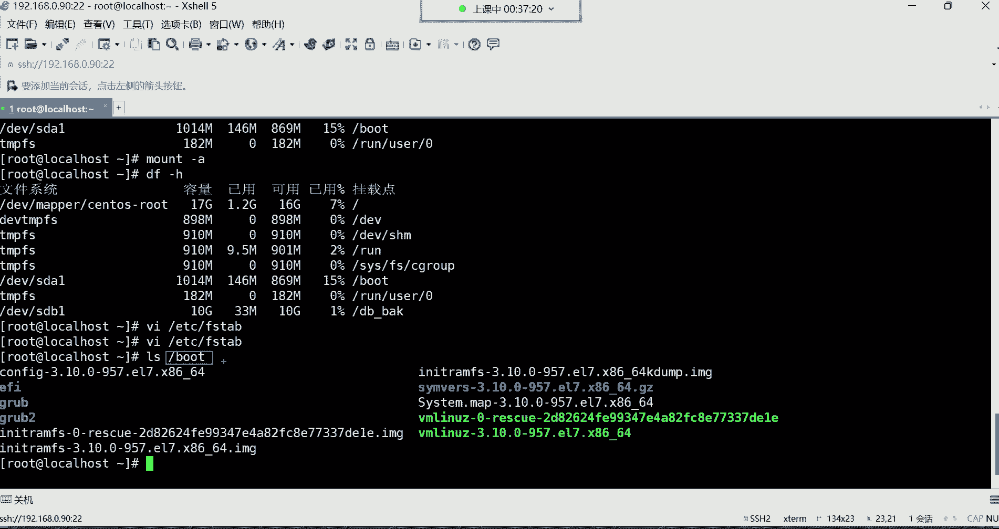

但这时候就得用到这个杠O，重新修改一些挂载参数。

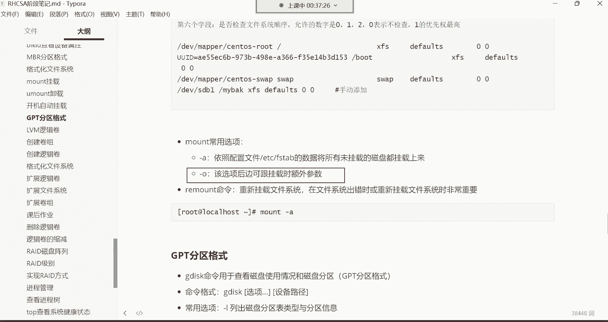

因为默认像这种参数的话呢，我们得去改，改完以后才可以啊，但是这个我们现在还用不到啊，我只是简单给大家聊一聊啊，让你们知道这个杠欧什么时候会用得到。

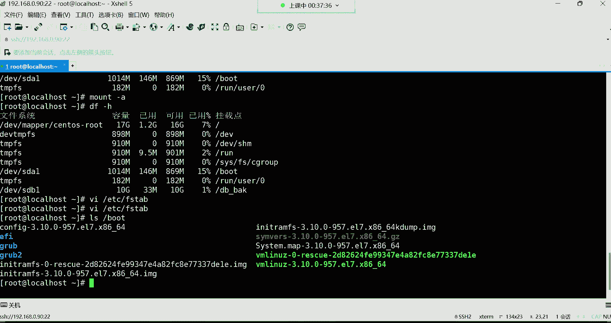

正常挂载用不到的干欧，这个好，然后但是你用高的时候嗯，看一下啊啊这还有一个REMT是吧，REMT叫重新挂载，这个我们也很少用啊，这一般就在文件系统出错时，或者说我需要重新挂载了啊，一般可以用到。

但一般用不到哈，用不到，我如果用的话，你就直接给它卸掉就可以了，你看你卸掉以后重新挂载不就可以了吗，就是我们所说的那个mt，所以对mt来讲呢，大家常用的就是mt杠a mount命令，结合杠A这个选项。

让他去把这个文件里边的内容给我重新读一遍，然后给我挂在上，对什么时候用mt杠，就是你修改过etc f s table文件了，你修改过这个文件以后，你就得MONT杠一下，让它识别一下就可以了啊。

别的选项嗯几乎是用不到的好，那接下来呢我们再来给大家说说，这个GPT分区，这个GPT分区就是我们前面所说的，可以最多允许分128个主分区，然后呢支持的磁盘容量呢也是非常的庞大的。

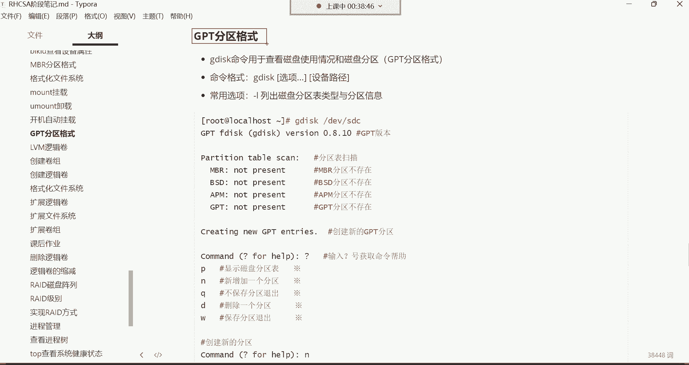

那个啊，那接下来咱们我看看还有磁盘吗，咱们还有一个SDC是吧，那SDC这块盘我们现在就要对它做分区了。

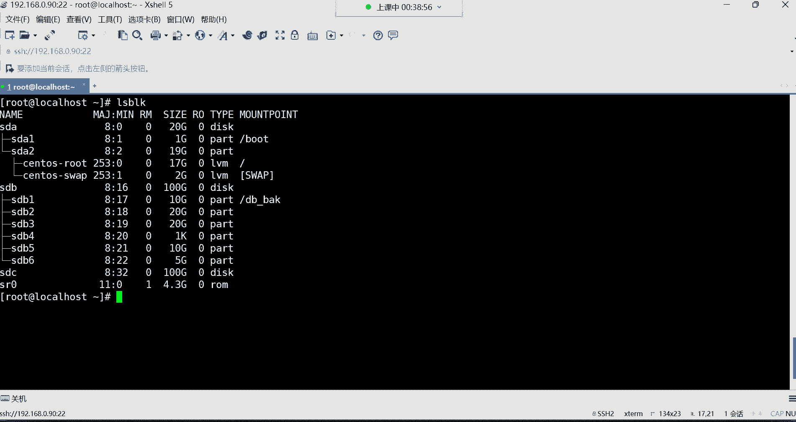

但是我现在要用GPT的分区格式去划分的好，那这个时候gt怎么划分呢，用的命令叫GD4K，你看前面那个MB的分区格式用哪个来着，叫否D4K是吧，F s f d i s k。

然后呢这个GPT格式呢就是GD4KDISK，那后边是一模一样的了哈，你指定我要对DEV下的DEV下的谁谁谁，比如SDC进行分区，然后就在里边做操作就可以了，命命令格式都一样。

包括它里边的一些我们在分区的时候，一些常用的一些命令也都是一模一样的。

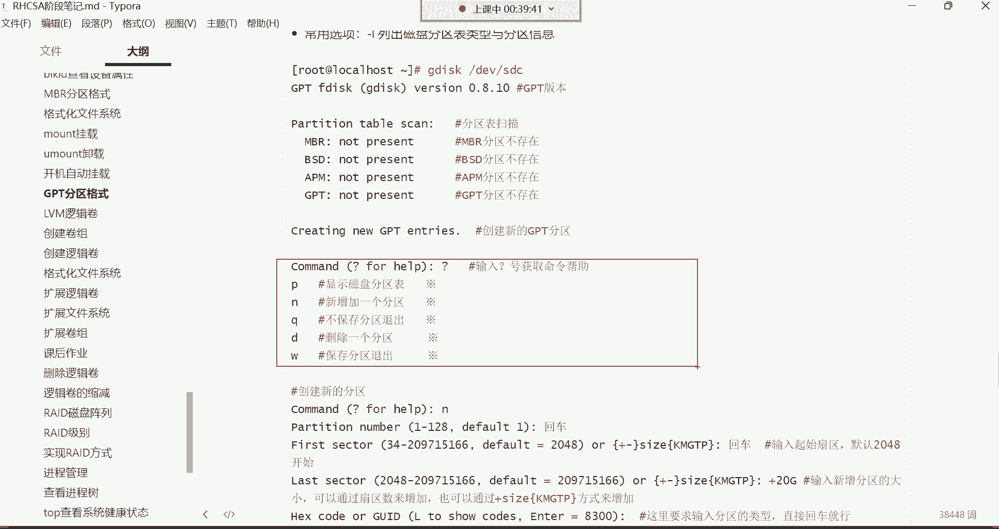

所以这个在学GBT啊，我们学完MBR分区格式，再学GBT就非常的容易了，即D4K指定我要对DEV下的SDC进行分区，回车啊，没有这条命令，那没有这条命令的话，那我这样我搜一下啊。

是不是PRIVD后面跟上GD4K啊，这样搜索这条命令是由哪个软件包提供的好，有这个软件包提供的好，那我们是不是就直接用YM杠y install，把这个包给它安装上了，G d4 k，好安装好了吧。

安装好了之后呢，我们就再对它进行分区，GD4K把DEV下的SDC啊写上去，分区在这个里边哈，我们来说一说哈，呃它这里边会有一些提示，但能不能看懂呢，创建新的GPT条目，然后上面这些的话呢，来看一下哈。

它首先呢会帮我们检测这个分区表，你看它这它是一个叫做分区表的扫描，这扫描什么呢，就扫描在这个硬盘里边啊，有没有一些这个分区存在有吗，没有看什么MBR的，什么都没有，是不是没有任何的分区存在，没有哈啊。

那没有的话，那接下来我们是不是就可以叫，创建GPP的分区了呀，那创建新的GPT分区，那这个时候要command他在这个位置啊，他是干嘛呢，叫命令命令的求助，他这个啊没声音了吗啊，各位有有声音是吧啊。

有声音啊，好的，那我们来看一下哈，在这个位置哈，我们说一下，你看命令求助，他这个命令求助输入什么才能求助，这个命令呢得输入问号，你看到了吗，他这里边啊，就是他跟那个MBR分区格式不一样。

MBR是M获取帮助是吧，这个是问号获取帮助，所以这时候你输入一个问号回车，嘿这时候他就把这个帮助信息给我们列出来了，然后它这里边你说这么多信息。

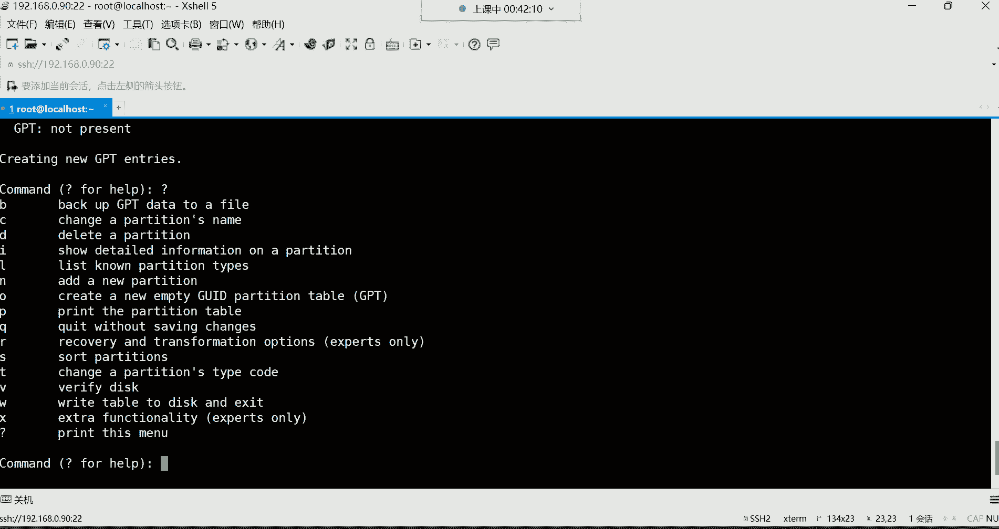

其实跟我们前面那个MBR那个命令啊，其实都一样，所以常用的呢也是那几个常用的。

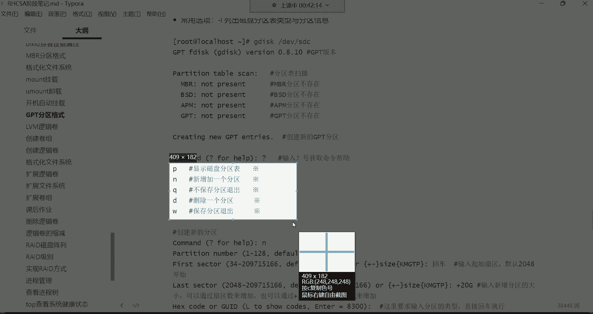

就是那几个就少了一个M，你就比如说在那边这个PP，正常来讲是显示磁盘分区表，那它这里面也一样，我们来看这个P哈，是不是叫输出分区信息呀，啊其实就是显示你这个磁盘有多少个分区啊，还有这个NN的话呢。

就是在这哈ADD看一下哈，ADD就是添加一个分区的意思，在这个里边就是添加一个分区啊，还有什么呢，还有这个Q这Q的话来看一下，Q叫做退出而不保存更改，这个就是你比如说我们在这个里边，当然现在所有的操作。

是不是都在内存里边操作呀，然后如果说我们做了一顿操作，但是我又不想去什么呢，不想去保存了，Q就退出了，就不会对他造成任何的改变啊，还有像这个D这个D的话呢，我们在这哈。

那delete delete1看就明白什么意思，叫删除分区，删除删除W就是保存了，在这保存并退出，在这里面是看到了将表写入磁盘，并且X的就退出，所以这常用的其实也就这几个，然后这个问号就是打印帮助了。

看到了吗，打印菜单这边，其他的话呢大家下去以后，如果感兴趣可以自己去看一看啊，其实常用的就这几个都已经给大家列出来了，所以咱们就按照这个常用的指令呢，对它进行分区，OK然后第一呢我们是不是要分区啊。

那是不是就N呢，N我要添加一个分区，那就输N回车啊，这时候我们来看一下它这个提示，分区号从1~128，默认编号是一，也就是我们现在你们看到吗，咱们说这GPT的特点是什么呀，这GPT。

我说最多允许你划分128个主分区，没错吧，那现在是不是128分区，你可以划分了呀，那编号一，那咱们就输入一，然后回车啊，那这个时候呢这个它也是一个什么呢，也是一个，哈我看一下哈，它它这其实也是扇区哈。

也是扇区，只不过他这里边呢啊，跟这个IMBR还是有略微差别哈，但是它是上去默认都是从2048开始，2048开始，然后他问你要不要从2048开始，默认是2048哈，所以啊为啥都从2048。

你说二那2048前边的那个扇区位，就是在2048前面的扇区位，是它用于干嘛呢，它这个啊你写34不行吗，不是他前面会用到，他前面不会用到哈。

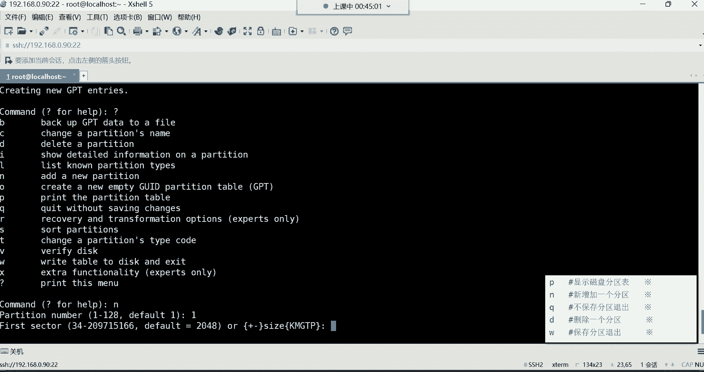

这时候你这种小疑问哈，其实2048个前面的扇区。

也存储不了多少数据，啊我们这种疑问是为啥嗯，磁盘扇区，默认从2048起始，看到了吧，这个哈，呃，它前面这个空间可能是会用存储一些，叫做引导文件，他这里边是有一些引导文件的，所以也需要空间去存储。

所以这时候前边那个就将近一兆走的空间啊，就留给他了哈，那你写34就不行，你要写34，到时候他空它空间不足，所以你这个引导文件就不行，他的遗照空间是用一些是存放一些引导代码的。

所以这就别纠结那一兆的空间了，OK吧哈哈你那个磁盘呢。

咱说这磁盘那那么大的空间，你在乎那一照吗是吧。

所以就默认2048起始，我们就回车就行了哈回车，然后那这个位置呢我们就开始选大小。

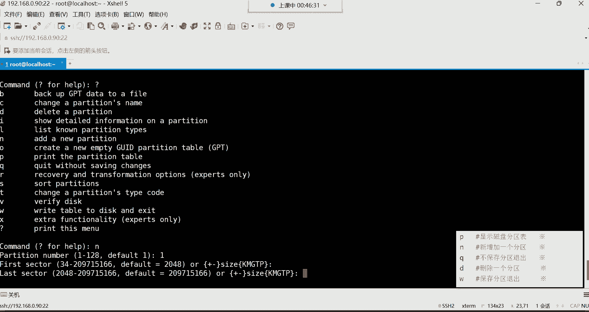

但这个大小哈看它这里边，他这里边啊，他跟那个GBT呢跟那个MBR它不太一样，我们在这直接就可以输入，这个新增分区的大小了。

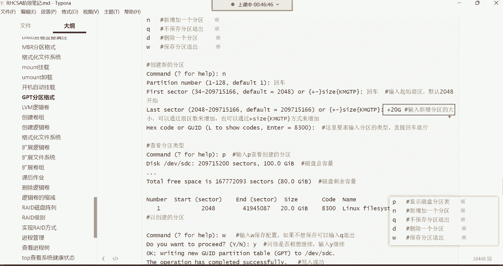

他好像少了一个步骤，少了一个环节哈，在那个MBR那个位置呢，在这个位置我记得还有一个环节呢，但是呃呃但是这个少少一个步骤没关系啊，你就加比如说加多少加十个G回车啊。

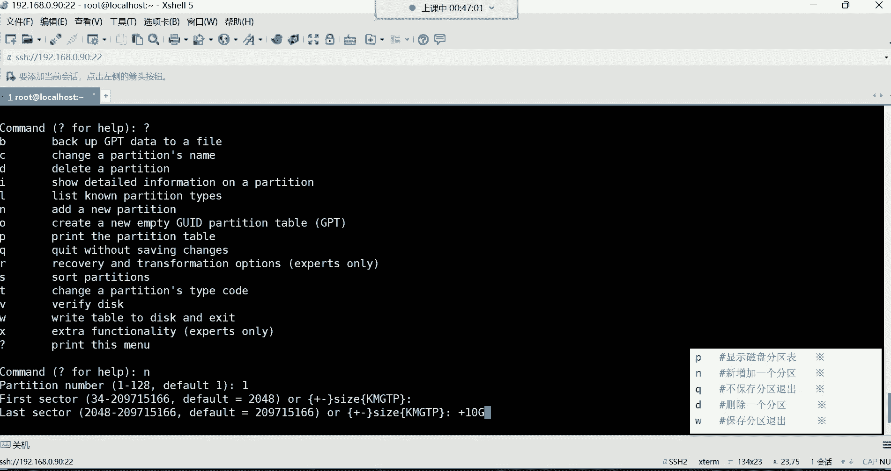

然后这一步他就是问你什么呢，问你的分区类型，在这里面最后一步要要求你输入分区类型，这分区类型啊你只需要默认即可。

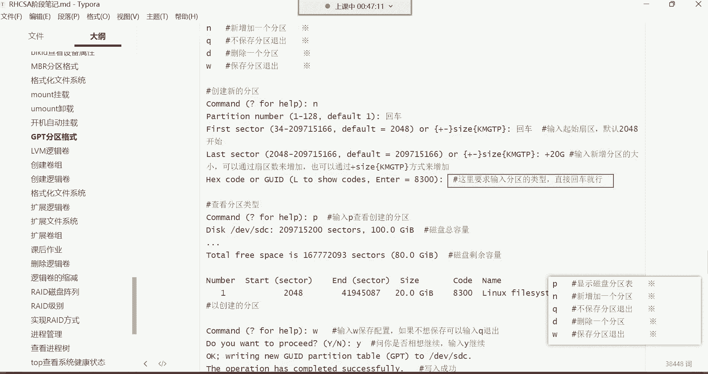

默认是什么类型的，其实默认的话就是LINUX类型的，如果这边你不输入的话，默认就是LINUX类型回撤好，看到了吗，默认的类型是LINUX类型的好，那现在第一个分区就出来了，出来以后呢，我们输入P。

这个P呢还是正常显示这个磁盘的信息，然后回撤，这时候我们可以看到呃，第一个分区就出来了，然后就是默认的起始扇区，然后结束扇区就是它这里边差不多吧，就是你现在还可以画啊，这个从这儿从这儿到这儿开始。

中间啊是有多少个扇区啊，其实看这就行了，不要看扇区啊，我们看大小，谁会看扇区，所以就关注这个位置就可以哈，关注大小，这是这这就是我们要关注的别的地方，你没有必要去关注它，就关注大小就可以了。

十个G第一个就是不就出来了呀，然后再分的话就N第二个编号看到吗，默认编号编号回车啊，回车扇区不用管，这扇区不就是上一个扇区的结束，就是下一个扇区的开始吗，所以这位置不用管了，回车接下来大小加十个G好。

回车类型不用管，回车P显示两个分区就出来了是吧，那我这样划分N回车，默认编号三回车扇区不用管，回车大小加十个G好回车回车，其实你发现GPT这个分区格式它也如此的简单，它比MBR还简单，简单到什么地步呢。

简单到你只需要知道这个，这里面的这个N是添加分区的，剩下只需要在这个位置是你需要什么呢，是你需要出手的地方类型类型，其实他这个不就是你的这个file system，这个分区的类型吗。

呃准确来说叫文件系统类型，其实就是这个分区类型，就跟那个什么呢，就跟那个我们前面MBR分区的，那个叫C斯特姆是一个意思哈，然后是下面是LINUX，就是你的分区类型是LINUX的类型的啊。

它这里面就显示的略略微有些不太一样哈，就分区类型，这就是LINUX类型的就正常，其实你把它理解成就是一个主分区，就正常存储数据的就行，这里边啊，那如果你想保存呢啊如果想保存，我就W保存分区并退出好啊。

在这一步啊，他还得跟你确认一遍，看了吗，就你想继续吗，就这这位置你得输入一个Y才可以，然后回车，本地磁盘是MBR，想要新建硬盘是不是也是MBR的格式嗯，本地磁盘是MBR，然后新建不是这个MBR。

它跟它不是磁盘，MBR它本身就是一种分区格式，它不是磁盘，磁盘没有MBR的，知道吧，嗯MBR分区新建硬不是你这个问题问的，有些我们说你这问题问的有有些冲突哈，让人无法理解，本地磁盘是MBR的分区。

新建硬盘是不是也是MBR分区，你新建的硬盘跟你与跟你的本地的MBR分区，它这两块硬盘它不一样的哈，嗯对，我们来看一下哈，这个阿拉斯block我们前面是不是这块硬盘，我们是用MBR分的呀。

这块硬盘是用GBT分的呀，哎这时候我们看一下哈，在这可能说有的同学还是有些混乱是吧，咱们现在两块硬盘，我想看那个SDB这块硬盘，我们就否定四个杠F啊，杠跟上DV下的SDB。

那你看他这个磁盘的标签是不是DOS啊，好然后我们再换SDC，那你看它的标签是不是叫gt了啊，就是你这个硬盘呢，你用什么类型的分区格式划分这个呀，无所谓无所谓哈，看你自己的需求没有严格要求。

只不过我前面不跟你们讲过吗，说这MBR它的特点是什么呀，就是容量的限制比较小呗，MBR最多允许你是2。2T，2。2T以内的磁盘，你可以用MB2去划分，但如果你有个大磁盘呢，那你就GPT呗是吧。

这种智慧可以灵活去选择呀，嗯对速率有影响吗，没有影响，这个速率完全是看什么呢，完全是看你硬盘的质量，看硬盘转速，你这你买硬盘的时候，你像你钱花到位了，你这硬盘转速它就快，它跟你的分区这种没有什么关系哈。

哎它不缺于读写速度，不取决于分区格式，那这个不用担心啊，那现在是不是这两个硬盘我们都给分区了。

然后两种分区格式那是不是都比较简单的，你发现这两种分区格式，其实大多数都是你一路回车，然后剩下的指定的大小就可以了啊，非常非常的简单，然后下边呢开始格式化文件系统，我想用这个分区的话。

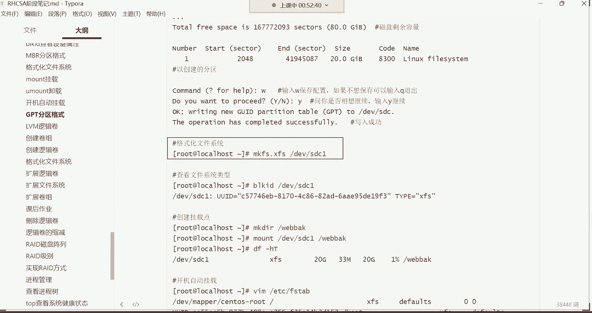

正常呢还是MKFS点差FS，对DV下的SDC1好格式化，然后否定4K啊，不是哈，l s blog杠F看它的文件系统类型好差，FS类型的看到了吧，OK那接下来呢就挂载呗，我们找个目录，用哪个目录呢。

我们建个目录，make dr在跟上建一个web back这么一个目录，这个目录我准备后期存储一些，我网站里的一些备份数据，那这时候我就mount啊，或者说你如果一直用的话。

咱直接就vi etc下的fs table，然后呢在配置文件里面写不就可以了吗，最后一行指定，我要把DV下的SDC1挂载到根下的web bike，这个目录。

然后文件系统类型差FS的挂载参数defaults，然后不备份文件系统，也不检测文件系统的顺序，保存，退出mt杠A让他重新过挂载一下DF杠H，看一下有没有挂载成功，好挂载成功了，是不是。

那以后这个目录是不是就用的这个分区，去存储数据了呀，那以后我在这个web back目录里边建的所有文件，比如我再建100个文件，web一点点100点TIT啊，那这100个文件是不是就存储在这个。

哪个分区来着，嗯存储在这个SDC这个分区里边那个啊，这就是后边就顺序都一样了，后边顺序就一样了哈，这个哈他这一用1%，就这个有33兆的空间，这里边会融合一些文件系统，文件系统也会占用一部分的空间啊。

所以它里面其实就是一个已用的百分比，1%，这不也是1%吗，因为毕竟前面这个33兆哈，在这里面可能显示不是很精细啊，这无所谓啊，无所谓，文件系统也会占用一部分空间。

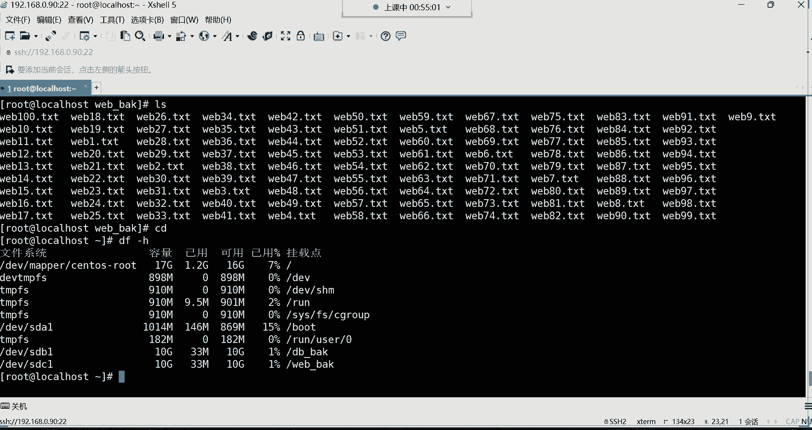

嗯其他的话呢就没什么了，这磁盘分区MBR怎么分哈哈，我们说这MBR怎么分，GPT怎么分，是不是都比较容易啊，啊这都不难哈啊你甭管怎么分剩下的步骤，你说我们怎么格式化文件系统，我怎么挂载。

我怎么让它实现开机自动挂载，这就都一样了哈，这不取决于说这个分区用是什么格式划分的啊，这顺序顺序都一样好，那接下来呢我们来再讲讲这个逻辑卷，这逻辑卷它对于这个磁盘管理，这方面也是非常的重要，逻辑卷啊。

它主要的功能是什么呢，我们先给大家说清楚，逻辑卷，逻辑卷简称叫LVM，它的全名叫logic v拉姆manager，叫逻辑卷的管理系统，主要的功能可以实现，将底层的物理硬盘分区，整合成一个大的虚拟硬盘啊。

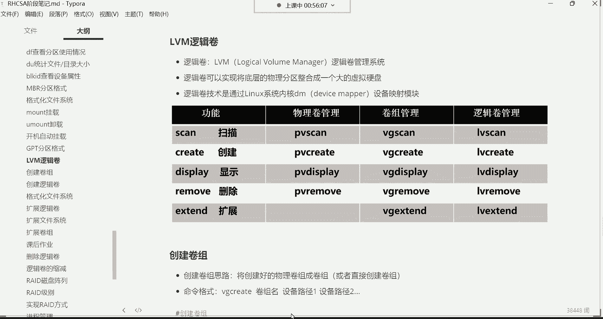

画图吧，啊这是硬盘分区，这是硬盘分区，然后呢，比如说啊我这也甭管用什么格式划分的分区，无所谓哈，分区好，分区一，然后分区二分区二，分区三，分区四，我现在有四个分区，这四个分区的空间呢。

假设每个分区的空间是100个G，每个分区都一样，100个G，那现在这四个分区啊，这叫物理分区，是我们直接在物理硬盘上面划分的这四个分区，那他们有有一个什么特点呢，就是我们现在正在使用的这些分区啊。

什么SDBESDCE哈，这些叫做物理分区，物理分区空间，咱们前面是不是给大家演示过，就是如果说空间一旦被你存满了，那这个数据是不是我们只能再去划分新的分区，往新的分区里面去存储啊，因为像这种分区的空间。

比如说你当初给了十个G，这十个G的空间是固定的，没有办法扩容，所以你们昨天就问了我一个问题，你说老师，那这个空间满了以后怎么办呢，然后我就跟你们说，我说那你没有办法，这空间满了，你只能再去划分新的分区。

然后呢，再把那个目录呢重新挂载到新的分区上面，继续往里面存储是吧，那这个逻辑卷可以帮我们解决什么问题呢，就是分区满了以后，我不想把数据分散存储，因为你想想，比如咱们最初的时候。

咱们就拿一些备份数据来说吧，比如这个目录，还有这个分区，一直存储的是我数据库的备份数据啊，一直用的是这同一个分区存的哈，但突然间有一天这分区存满了，我迫不得已我再去划分新的分区，我要往这个分区里面存储。

那你说原先存储在这个分区里的数据，跟存储在这个分区里的数据，它是不是就分分散存储了呀，分开了吧啊，那你说我在查询的时候，我怎么查呀，这数据存储在两个分区里边，我查的时候怎么查，这个分区查点。

这个分区查点没错吧，因为你这一个分区不允许你重复，重复挂载一个目录啊，所以你到时候你查的时候它也不方便，分分分区名可以改吗，不可以改，不可以改哈，所以这种东西呢我们就是我希望他能够帮我们。

或者说我们希望有一种方法哈，如果能够对这个分区的空间能够增加的话，逻辑卷就可以帮我们实现这种需求，逻辑卷呢你看它的这个功能。

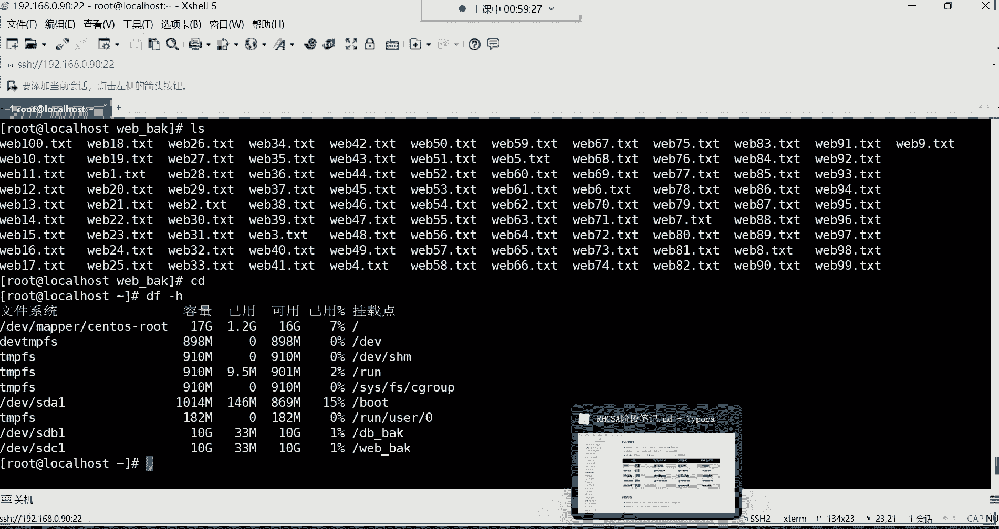

就是实现将底层的一些物理分区，整合成一个大的虚拟硬盘。

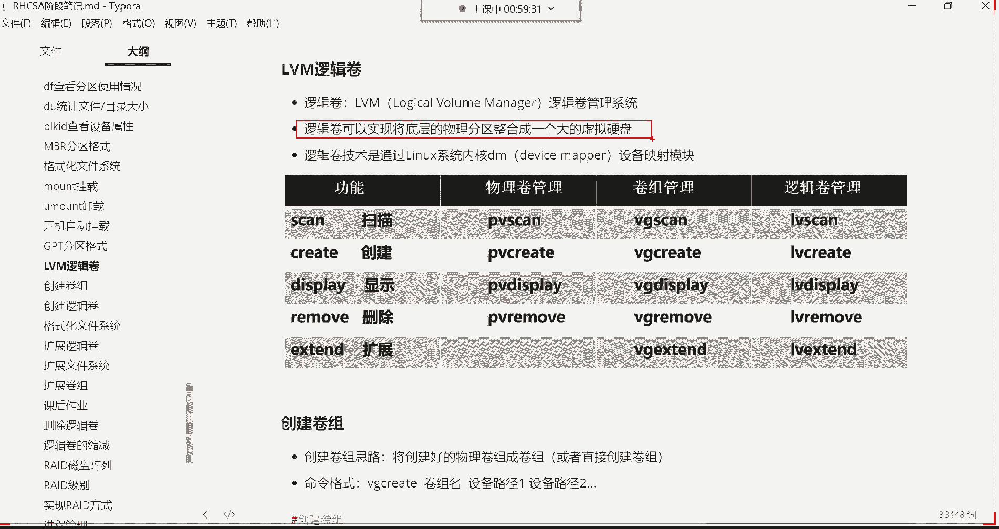

比如说我就有这种需求，我这个底层呢有很多个分区，但是呢嗯我就是后期我需要什么空间扩容的话，我怎么办呢，我就直接给他们整合成一个大的虚拟的硬盘，这个大的虚拟硬盘的话，它是一个空间的整合，这个空间整合以后。

你看这四个分区整合成一个大的，虚拟的硬盘的话，哎我们叫虚拟硬盘，假的吗，不是是由底层的物理分区啊，一个空间的整合出来的，那它的空间是不是就400个G，整合以后，你想它底层的空间过来的呀。

那空间就是400个G，这400个G空间就是怎么来的呢，就是从这底层的分区整合过来的，这虚拟硬盘好，那我们整合以后，这虚拟硬盘怎么用啊，或者说我在管理的时候，我怎么去管理呢，管理的时候你不需要去理。

你不需要去管理底层的这些物理分区了，这些我们叫做物理分区，加两个字哈啊物理分区，这物理分区是我们直接在物理硬盘上面，划分出来的，所以他就直接叫物理分区了，物理分区啊。

然后接下来呢整合整合成一个虚拟硬盘空间，变成400个计算，那后期我想存储数据，我们要在这个虚拟硬盘之上，这是一个虚拟的硬盘，我们要在这个虚拟的硬盘之上去，再去划分一个叫做什么东西呢，叫做逻辑分区的东西。

啊这是训营盘，想我这样吧，放到这儿整合成一个虚拟的硬盘了，400个G，接下来呢我们想划分分区，这时候我就在我这个虚拟硬盘里边去划分，一个叫什么的东西呢，叫逻辑卷的东西，这个东西叫做逻辑卷，逻辑卷。

那空间怎么给，空间给谁呢，空间给逻辑卷，比如说我给他多少呢，我给他呃，给他100个G的空间，这是一个逻辑卷哈，那你说那这个数据怎么存，数据就往逻辑卷里面存，这个逻辑卷最终是要挂载到一个目录上面的。

这个逻辑卷哈，最终你给它挂载到一个目录，啊这是逻辑卷，然后要给它挂载到一个目录上面，开始难起来了吧是吧，这一个目录，那数据我们最终是不是文件，就往这个目录里面存呢，是我们这个文件存到目录以后。

那这个文件最终就存到了一个虚拟硬盘里的，这个逻辑卷空间里面了，就是这样子的，所以这个过程现在不知道大家能不能理解，啊这个文件最终就往这个目录里面存啊，它是这样子的，好了哈，所以说那你说老师我们整合以后。

他有什么优势啊，你看啊，假设我们这个逻辑卷里的空间是100个G，它的空间是100个G，那我们想要存储数据的，我们这个随着数据不断的存储，比如这个文件啊，一直往里面存，一直往里面存存满了啊。

导致这个空间存满了，那它跟物理分区不太一样，它可以扩容，就这个逻辑卷，我当初分100G空间是吧，没关系，如果不够用，我再给你加多少呢，我再给你，比如说如果有需要的话，再给你加100个G可不可以呢。

可以啊，那它就变大了，它的空间变大了，它变成200个G了，你看是不是空间变大以后，我这个文件就不需要，再去往别的分区里面存了呀，我是不是还可以继续往这个分区里面存了，没错吧。

一直还往这一同一个分区里面存，哎这种机制好不好呢，这种机制是不是就可以解决我们前面那种，比如说哎呦，我这个数据不想分散存储，我我想对这个空间进行扩容啊，而且我一直往这个分区里面存，保证数据的一个完整性。

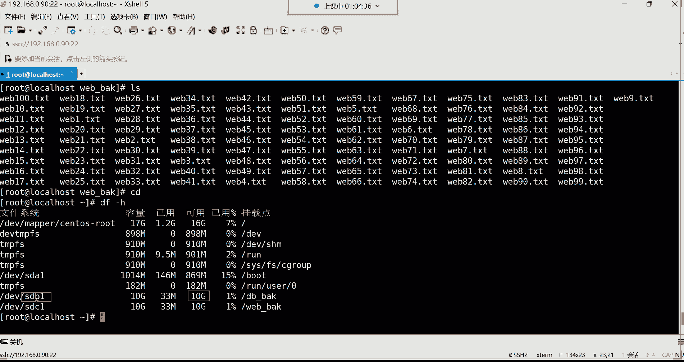

这就可以，所以逻辑卷现在就可以解决这种事情，解决这个不他跟阵列不一样哈，我们稍后给大家讲阵列的时候，我们再说阵列好吧，你先搞清楚这个逻辑卷，它其实主要的本质是什么呢，叫做空间扩容。

逻辑卷最重要的功能就是空间扩容，它可以让你这个分区不断的变大，不断变大，如果有一天你说我这个分区又不够用了，我再给你加100个G好，这300个G随着不断的存储又不够用了，好我再给你加。

我再给你加100个G可不可以呢，可以啊，400个G了，那你说再不够用了，再不用，我再给你加100G，但这时候还能加吗，好如果物理硬盘坏一块螺旋会怎么样，那那数据会损坏，数据会丢失。

