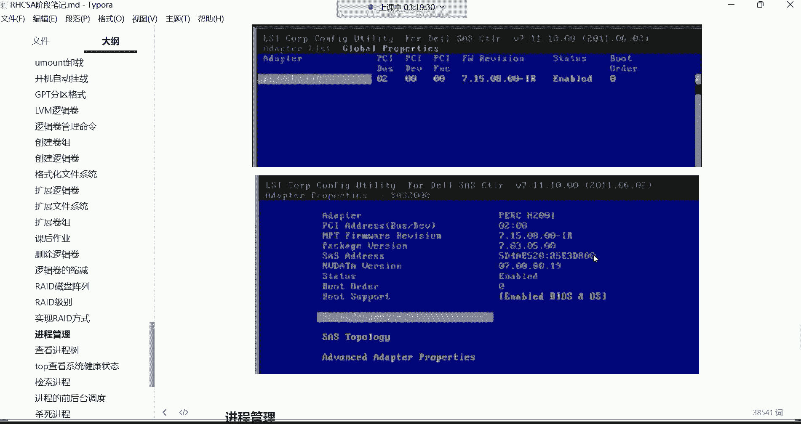

# 【小白入门必备】Linux运维进阶RHCSA+RHCE最全培训教程视频合集 - P28：红帽RHCSA-28.逻辑卷扩容、RAID磁盘阵列 - 洋洋得IE - BV1nN4y1X7Go

组成了一个re的零这么一个阵列了，好组成瑞的阵列以后，数据怎么存呢，看看这是一份文件吧，这一份文件它往左边盘里面存50，往右边盘里面存50，这效果有点像什么呀，这效果有点像我们说这个叫做并行写入。

注意哈，叫并行写入，它的特点是什么，看看这个瑞的零，它是同一份文档，等量存放在不同的磁盘，并行写入来提高读写的速度，就说这一你们想象一下这一份文件，比如说这一份文件是多少呢，是十个G，十个G的文件。

这十个G的文件如果说存到一块盘里边，这一个盘里面存十个G的话，正常来讲我们就假设需要多久呢，需要这个4分钟的时间，4分钟时间去存，但是如果我现在可以干嘛呢，可以将你把这一份文件分成两份，劈成两半哎。

撇成两半以后呢，我左边存50%，右边存50%，那是不是就说左边存了五个G，是不是右边再存五个G，但是它是并行存储的呀，优点是什么呀，啊各位优点是什么呀，说速度就翻倍了呀，原先用4分钟。

能够把这十个G的文件存到硬盘里面，那我现在是不是就直接2分钟就完事了呀，没错吧，因为它是并行写入啊，但并行写入你想想是不是速度提升了呀，是不是速度提升一倍了呀，翻倍了吧啊这辈子应该都能理解吧。

因为你看原先你一份文件，十个G存一个硬盘需要4分钟，但现在呢我并行写入我两块盘同时帮你存，是不是翻倍了呀，啊翻倍了哈，啥是冗余功能，冗余冗余就是多余，多余就是备份了，知道吧，什么叫冗余。

不就多余了吗是吧，这多余是什么呀，不就备份吗，啊这时候就说re0，它的特点是什么呢，瑞的零，可以帮我们来提高数据的读写速度，读写速度，但是呢它只是单纯提高了读写速度，并没有这个叫冗余的备份功能。

为什么呀，如果其中一块盘故障了，数据丢不丢，我们就假设现在你看这个图，在这图里边，我这个数据是左边50%，右边50%啊，唉分散存储，那如果说我的左边盘坏掉以后怎么办呢，那是不是这左边盘里的数据就丢了呀。

那就是剩数据，十个G的数据，只剩左右边那个盘子五个G了，丢了五个G的数据不可靠，有点危险是吧，对不安全啊，这个哈不安全，所以说瑞的零呢它就不适合存储一些什么呢，重要的数据在整个瑞的级别里面。

但是它的读写效率是最高的，速度最快，数据这个速度翻倍了哈，速度快，但是呢不安全，但有的时候呢我们说在企业里面我希望什么呀，速度还要快，然后呢还要给我有这种备份的功能，可不可以呢，其实也行啊。

我们再看看别的级别哈，还有一个叫瑞的一，这个级别瑞的一呢叫做完全的备份，到这个完全备份呢，它也是由至少得两块盘，但它是这样子的，它是同一个文档复制成多份存储在不同的磁盘，来提高可靠性，看来看这个图哈。

看这个图，因为这个图是我从网上截的，这图是从网上截的哈，而这图是这是我自己画的，所以我就从网上截的图上看起来并不是很清晰，能理解吧，所以咱们干嘛咱们自己画一个哈，然后自己画的话呢，怎么说呢，那这样吧哈。

我觉得这个，算了吧，我觉得这已经很不错了，我觉得这图已经很不错了哈，就这样吧哈挺好，咱看这个read1这个级别哈，read1特点是什么呢，这同一份文件哎，它叫完全备份，这完全备份的特点是体现了什么呢。

比如我现在还有一份文件，我这文件十个G10个G的大小哈，那这十个G大小的文件，我现在如果说往瑞的一这个阵列里面存的话，那瑞的一这个阵列的话，那它至少是不是有两块盘组成啊，左边一块，右边一块两块盘组成。

然后呢它存的时候它叫完全备份，就他会把这个文件呢，百分百的这个一份文件存到左边这个盘里面，存一份，然后再干嘛呢，再把这个百分百的数据量，在完全存到这个右边这个盘里面一份，这叫做什么呢，完全的备份级别。

这完全备份级别特点是什么呀，安全呢，你想想这文件是不是，我一共是比如这一个叉叉点TIT叉叉点TT啊，十个G的文件，那是不是read1，它的特点就是我左边有一个叉叉点，TT大小十个G。

右边我是不是还有一个插上的TT叉叉点，TT大小是不是还是十个G，那我问一下安不安全呢，左边这块盘如果有一天坏了，数据会丢吗，他不会，为什么呀，啊右边这块盘里面还有一个一模一样的文件，这是什么呀。

read1这种具有数据完全冗余的功能，就是冗余，就是备份的意思，完全冗余的功能适合存储重要的数据，为什么，因为它允许你换一块盘，对同步备份存的时候哎，左边跟右边跟你同时往里面存，但速度什么速度怎么样。

来给大家来说一下，比如这文件十个G实际大小哈，正常来讲，如果我往一块盘里面存，速度4分钟4分钟哈，好，但是它的特点是什么呀，它的特点是，虽然说安全性比较高了，你看左边这块盘得用4分钟去存吧，是不是啊。

右边这个盘是不是还得用4分钟啊，效率呢在数据的读写效率上没有任何提升，反而下降了，是不是反而下降了，没错吧，就是这样子的哈，就整体，如果说我想把这一份文件存到瑞的一里边，得需要8分钟，这边能听懂吗。

听懂给我刷个，一上来就说他读写效率没有任何提升，反而什么的速度还变慢了，但是呢安不安全，冗余了吧，说给你备份了，唉没错，你传一半儿坏坏一块盘怎么办，呃那他就没有办法再继续往里面传了。

它只能往另外一块盘里面传啊，嗯只能往另外一块盘里面传了，那没有办法，你坏了，他确实是没有办法往里面写了呀，所以说这个读写速度肯定是没有任何提升哈，没有任何提升，反而下降了，但是确实是安全非常的安全。

所以我就像这种的我这样吧哈我把这个图啊。

我觉得这个还是自己画的呀，比较符合什么呢啊，比较符合我们的一个理解能力是吧，看瑞的零，瑞的一，V的一，但这图呢我们也没有办法给他，干嘛给他这个，算了不往这里放了哈，因为往往这里面放的话。

在放什么放出来吧，到时候我把PPT发给你们好吧，PPT发给你们，因为放这图确实是对于你们来讲，你们看不到，呃没有影响没有影响哈，然后接下来我们再来给大家分析一下，再来分析一下哈。

就是你说这个read1啊，他这个虽然说是非常的安全非常安全，是不是这空间呢我们来假设，比如我这个左右两块盘，不是左边一个T1个T哈，右边也是一个T，也是一个T，那你知道最终可以使用的空间是多少吗。

最终可以用的空间就是一个T，就这个red的一对，最终可以让你用的空间就是一个T，就是它的一半，为什么呀，因为另外一半空间是备份了，你看正常来讲，我左边一个T，右边一个右边一个T合到一起。

应该这个瑞的一应该是两个T吧，没错吧，是按照我们的逻辑应该是这样子的，但是我告诉你没有，三块一个T的是吧，他不允许瑞的一没有办法用三块盘raid，一用不了三块盘哈，所以说呢像这种情况下。

我们就是最终可用的空间还是一个T，另外一个T的空间就是备份啊，这大家搞清楚哈，所以咱们说你做对的一，你说老师我这个多搞几块盘可以吗，你多少块盘最终可能空间都是它的一半，对四块盘可以。

你说我四块盘我组织的一可不可以，但是它最终可能空间还是一半嗯，还是一半哈，那接下来你说这个还有没有别的瑞的级别，有瑞的二，至少由三块盘组成，数据分散存储在不同的磁盘，在读写时。

这个需要检查它的数据的实时校验，当然这个read2这级别啊，read234都很少用哈，Read 2read3，还有这个read4，这都非常的少见了，而且很多的比如说什么瑞的卡呀。

还有像什么那个什么软件的方式去配对的，都不支持，都做不了这种瑞的234能理解吧，所以这些大家作为了解就行，你就比如说这个瑞德二至少有三块盘组成，数据分散存储在不同的磁盘，在读写数据时需要对数据进行校验。

由于采用的校验算法比较复杂，数据量比原来的数据增大，而且导致硬件开销比较大，什么意思呢啊如果是read2的话呢，大家说一下啊，三块盘组成一个瑞德二，然后一份文件同时存储在这三块盘里面啊。

可以说一啊一份盘存个30%多一些吧，30%啊，当然这就不具体去细算了哈，我们就假设啊，一个一个盘里面的存储个30%左右，右边也一样，30%左右啊，分散存储了，然后呢他在往里面存的时候，注意啊。

他存的时候，这盘里面是有一部分是校验数据的，就这个数据里面啊是有一部分空间，这一部分空间是存储的，是他这个数据的校验值，校验值哈，然后它的价值，由于采用的这个教育算法比较复杂，数据量比原来增大了。

什么意思呢，就你看我这个比如说是30%的数据，这里面可能还会附带多少呢，10%的一个校验数据，整体来讲就是这份数据是存到里面，就变成40%，数据量比原来增大，那你说比原来增大无所谓啊。

这增大就增大呗是吧，咱说这个也没增大多少空间，40%，但我跟你讲，他每次在读写的时候都得去干嘛，去查他的那个10%的校验数据，每次查的时候就会导致你这个硬盘的，这个我们说这个就是这个工作量要加大。

硬件开销比较大的话，就导致硬盘容易损坏唉性能下降，硬盘也容易损坏，所以瑞瑞的234这个没有人用，在企业里面是不用的，知道吧，所以我们就不过多去解释它234，然后这里面大家下去可以具体看一下234。

第三个，那就在企业里边，我们到底用哪个呀，你发现我们前面给大家讲的什么瑞的零瑞一，瑞的零特点是什么呢，瑞的零高效速度快，是不是提高效率了，但是呢没有冗余功能，完全是提速不安全，read1呢非常之安全。

完全备份，但是速度没有任何提升，反而下降了，我再补充一句话哈，数这个速度没有提升，反而是下降了，反而是下降，现在但是适合存储中的数据，是不是啊，这这俩你发现它就一极端，你就用过一五是吧。

对你发现这瑞的零跟瑞德一他俩真的是极端，一个是非常快，一个是非常安全，那能不能把它俩结合到一起呢，就是既能提高速度，又能保证数据的安全，可不可以呢，有啊还真有哈，read5RENO5哈。

read5的话呢是至少由三块盘组成，我们把这个图拿过来，所以大家记呢，我只给你们去干嘛呀。

放一些重要的一些这个图哈，这是瑞德五的这个图了。

咱们来说说瑞德五，先读一遍，了解一下它的特点，至少由三块磁盘组成，然后同一份文档分散写入不同的磁盘，这是这个三块盘啊，当然哈这是1233方法呢，我组成一个read5的阵列，然后接下来呢每个盘里边啊。

他在存储数据的时候，先同一份文档分散存储，这一份文档是这样的哈，看这一份文档呢，他这3号盘里面的你也你也可以这样理解，比如这个里面的30%多一点点哈，就不细算了，30%，这里边呢也是30%。

然后另外呢也是30%啊，总共呢把这一份文件呢，分散存到这三块盘里面的，那这每个盘里面它在存储的时候注意啊，它也有校验数据，校验数据哈，那其中这个校验数据，会占用磁盘的1/3的空间。

假设我的这块盘总空间30个G，最终这文件往里面存的时候注意哈，这总共间总空间30个G，但是这有十个G的空间是用来放校验数据的，要最终你可用空间原数据的空间是20个G诶，另外十个G呢是校验了。

那什么叫校验呢，这个校验有什么用，就业数据是它允许你同时坏掉一块硬盘，比如在我这三块盘里面，我的这个这块盘其中坏了哈，这块盘损坏了，这块盘坏了以后呢，没关系，其他盘里面是不是有校验数据啊。

那其他这两块盘有怎么能有，这个分别是有十个G的校验数据，没关系，这校验数据可以帮你把数据给它恢复回来，就这个盘里的数据全都丢失了，没关系，没关系哈，那其他这两块盘里的，它可以基于校验数据的算法算法。

你不用管哈，他会帮你干嘛呢，把其余的这块盘里面丢失的数据给你恢复回来，给你推算回来，那你说那我这个至少有三块盘组成，我坏掉一块盘，我剩两块盘还可以吗，不行这阵列就散了，阵列散了，所以在企业里面呢。

你想做绿豆五还要准备一个热备盘，还要准备一个热备盘，这个热备盘就是当你这个坏掉一块盘以后，这个热备盘呢就是这个read，就是我们说这个做瑞的时候，read有个功能，它会帮你把坏的这个盘给你踢出这个阵列。

这盘一旦坏了，好给你踢出去，然后接下来呢热备盘加入到我的整个阵列里面，然后恢复的时候，把这个数据恢复到这个热备盘里面，所以最终我还是有什么呢，三块盘阵列没有散，他咋知道丢，就在调取的时候。

你比如这个数据我你想想它在读取的时候，比如我得从这个盘里面往出读数据吧，是不是你想他读数据的时候，他发现数据读不出来，查不到数据，好丢了，是不是是不是丢了，你比如说你们家里面你找一个东西。

你把这东西找不到了，一啊，你比如说你走大门上，你发现我这兜里有50块钱，一摸啊没了，你说你咋知道丢的呢，他不在了呗，是不是哈哈他不在了啊，所以怎么办呢，所以这时候他就开始干嘛，把他踢出阵列T阵列哈。

T入阵列以后呢，热备盘加入阵列，然后把数据恢复到这个热备盘里面，所以这个read5呢，首先这一份文件是不是并行写入三块盘，这一个盘里面30%，是一个盘里面的30%，速度有没有提升呢。

并行写入是不是就速度提升了呀，没错吧，那接下来呢啊接下来这个有没有备份功能呢，有啊，就说3号盘里边这个数据都有一些校验值，允许你换掉一块盘，获得一块盘以后呢，数据也不丢失，是不是也达到了一个备份功能啊。

所以这个read5啊，它就是类似于什么，既能提高你的数据的读写速度，又给你提高一个冗余功能了啊，是这么回事啊，可以多个read5共用一个热备盘吗，这个没试过，这个真没试过哈，因为你在准备热备盘的时候。

你得指定这个热备盘绑给哪个read5，但你说多个瑞德五绑定一个热背盘，这个我还真真没试过，但是一般也不会这么干，不会这么干哈，啊你们这个问的问题呢，可能是有的时候是遇到过这种情况，还是怎么回事啊。

啊因为问他这种问题啊，简直让我有些呃，是我思考的少啊，还是这个这个呵呵呵，没有遇到过这种情况啊，一般不会出现这种情况啊，不会说这种情况，然后还有read6呢啊这个read6的话，那至少有四款分组成啊。

思想比较活跃是吧对啊，瑞的六是由四块盘组成，然后同一份文档呢分散写入到不同磁盘，还有一个read6，read6它长得这个样子哈，这是同一份文档呢，四块板组成，只不过呢一份文档呢分散存储在这四块盘里面。

然后每个盘里面也都有自己的校验数据，只不过采它采用的是校双校验算法，所以它的校验数据量是瑞德五的两倍，什么意思呢，就是比如说我这个这个瑞德五，是采用这个1/3啊，我说就是这个1/3哈，去干嘛呢。

去存放我的校验数据，那他呢两倍两倍就是2/6了，这是他的2/6了哈，所以说对于这个校验数据量非常大，所以他至少要占两块盘的空间，来存储这些校验数据，就是我总共四块盘，这4号盘，比如说我这个空间。

啊对无数个read5都可以哈，比如我这四块盘，我每个空间都是多少呢，都是一个T1个T的一个T，一个T，一个T，那你们知道最终可以用的空间是多少吗，两个黑两个T哈，为什么呀。

因为这两块盘的空间存储校验数据了，存储校验数据了哈啊可以说3/6吧，啊我刚刚比喻错了3/6，read5它会用13的空间存储间数据，而read6就是36，或者说1/3点五，这样可能比较好理解一些。

read6就是直接是翻倍13点五哈，所以read6的话呢就是，它性价比来讲吧，没有read5要高一些，没有瑞德五高哈，性性价比最高的还是RENO5，所以read6在钱里面用的也比较少，因为太费磁盘了。

太被磁盘了，但是它允许你同时画两块哼，你想想他这个四块盘里面，我用两块盘，至少两块盘的空间存储校验数据了，没关系啊，你这4号盘里边，你其中比如说这块盘跟这块盘坏了没关系啊，我这两块盘里的校验数据。

我还能给你推算出来嗯，冗余性非常之高，但速度没有热度，五快了就没有热度快哈，双校验算法了，所以read6呢用的也不多，哎还有一个read10，这REZ10啊，来我把这个图拿过来哈，这REZ10。

还有read7呢，还有read7呢哈这个read7的话呢，对于对于这个我很多企业来讲，一般不会用，因为它是需要花钱的，是一个美国叫SCC公司的一个专利啊，S公司一个专利哈。

然后这个下面还有一个叫瑞德一零的瑞的一零，Read50，read50我没用过哈，这个阿丹呐，这个read read50我确实没用过，如果大家感兴趣的，你可以去网上去搜一搜相关的资料。

OK吧啊这个我没用过，不能给你瞎说好，那咱们说说这个read10吧，瑞的幺零就是read，瑞的一零等于瑞的一加，瑞的零二和二为一了，就是说他怎么玩的呢，首先得咱们说瑞的一跟瑞的零。

是不是都是最少需要两块板组成的，那瑞的幺零就是你至少得需要四块盘，4号盘哈，然后这4号盘怎么用呢啊左边你就可以这样哈，左边这个两块盘我先组成一个瑞的一，右边这两块盘呢我也在组成一个瑞的一。

然后那这是不是又变成两块盘了呀，两个瑞德一也是也是两块盘，注意哈，但是瑞瑞的幺零是什么呢，就是我再把这两个锐的一给它组合成一个read0，这就叫做瑞的一零，就瑞的零加瑞的一。

先将四块盘两两组成一个绿的一，再将那两个绿的一组合成一个绿的零，就这效果啊，4号盘组成两个V的一，然后呢再把这两个瑞的一组成一个V的零，那这时候数据怎么往里面存，它是可以提高数据读写速度的。

存的时候咱们说瑞的零什么机制，瑞的零是一份文件撇成两半，是不是左边此50，右边此50速度数直接翻倍了呀，好没关系，唉这个存的时候翻倍，是不是数据数据存进去了，然后存到瑞的一的时候，瑞的一什么特点呢。

唉瑞的一它有备份的功能啊，唉read，一会把你的这个50%，这文件存到左边盘里面一份，再存到右边那个盘里面一份，诶，就是说这个数据我又给你做了一个，完全备份了啊，那右边那50%的也一样，哎日子也一样。

我再把这个右边50%的文件给你，存到这个一份再存，再往这里面存一份，就说这个文件最终有一个完全的备份了，就这一份文件在瑞德一里边，有一个有有一个什么一模一样的文件，然后在read。

在右边这个raid1里面还有一个一模一样的文件，不是但它的特点是什么，就是这里边到这儿来就是25%了，25%哈，啊等会我看一下，我这我应该怎么怎么给你们解释这个东西哈，我觉得25%他不是很对哈。

他是这样子，50%存到瑞的一里面以后啊，然后这50%，5%存一下，然后这也是50%跟50%啊，他这个不是25%，就是50%，就是50%哈，你就这么去理解这一份文件，他这个分散存储在这个瑞德一里面以后呢。

左边50%，右边50%，但它允许你什么呢，允许你坏掉哪些盘子，左边换一块没事，右边坏一块也没事，能理解吧，由四块盘组成，它允许你同时坏掉两块盘呢，像这种，你说我坏掉两块盘，我这数据不丢吗。

不丢你再想想哈，你说你这两块盘里面，是不是都是这一半的数据啊，一个完整的备份呢，唉那不行哈，他不如与你同时坏哈，他不如你这样坏，你说我如果左边两块都坏了可以吗，那不行，他就是你两边都坏了。

就说就等于说你数据丢一半了吗，这样就不行，但是他说与你什么呢，哎各坏一块盘，你想换一块方没事，这里面是不是有一个50%的，一个完整的备份，右边这个是不是又是一个完整的50%，这两个组合到一起。

是不是就一个百分百，百分百的一个完整的文件了呀，所以这个它允许你同时换四块盘，然后数据呢读写速度又快了，又达到一个数据的冗余备份，缺点就是可用容量是总容量一半，这可以理解，因为它底下有一个完全备份吗。

瑞德一有一个完全没份，所以最终你这个盘，比如说我都是每个盘一个T，这也是一个T啊，这一个T1个T1个T，怎么说最终我们可以用的空间是多少呢，就两个T最终啊这就两个T的空间可以用，就两个T，为什么呀。

那就另外那两个T呢，另外那两个T给你备份了，这两个T至少得有一半的空间是给你做备份了，啊对这个大阵列了哈，给大阵列，所以对这种情况呢，很多企业呢玩不起，太贵了，成本太高，成本太高了哈，其实也差不多嗯。

一般看情况吧哈一般看情况，所以在企业里边，如果你说我们用的话呢，其实还是比较喜欢用这个read5，这个呢对于企业来讲是比较喜欢的一种，re的级别，Read5，嗯对。

所以那你说老师这个read我怎我们怎么做呀，这个怎么才能实现这个read这个功能啊，是吧啊，这个功能的话，那我们怎么实现呢，就是这个嗯呵呵，以后发明一个瑞的五零是吧，讲实现read的方式呢有三种。

你看我们说一下啊，通常呢啊可以通过软件技术实现这个read，就是我们通过软件软件的话呢，就是你下载一个软件，但软件不不稳定，软件不是很稳定哈，为什么不稳定呢，因为这个软件你想想，我们是不是得把这软件。

下载到我们这个服务器上面的，这是我这个服务器，然后咱们往里面下载一个，这个可以帮我们去绑定rise的一款软件，但是它有个缺点，缺点是什么呢，就是如果你的服务器出现问题了，这软件不就关闭了吗。

软件功能也就关闭了哈，那软件功能一你比如你服务器出现故障，一关机，软件功能就关闭了，是不是，而且嗯很多软件也不稳定，很其实在这个市面上没有一些好的软件的，瑞的技术的，所以很多人不喜欢用这种软肋的嗯。

而应对的他不一样，硬瑞的呢我们通过瑞的卡，还有这种叫外接式磁盘阵列柜这种哈，这种是在大型的服务器上边，可以就比如一些这个那服务器不是分型号吗，啊，有这个小型服务器，中型服务器，大型服务器。

还有超级服务器，一般在大型服务器领域呢，还有或者说超级计算机领域，他们会用到这种叫做磁盘阵列柜，这个阵列柜啊非常之昂贵哈，一般企业是用不起的，所以一般很多企业就为了节约成本。

性价比比较高的就是瑞德真雷卡，这阵列卡有的服务器哈，是你直接买服务器的时候，那个服务器就直接给你带那种阵列卡，他就是在服务器主板上面有个小卡片，就一卡片啊，硬件卡片它分为服务器自带跟额外安装的。

服务器自带的是在服务器主板上面自带的，而额外安装的是你花钱买一个那个小卡片，直接自己给它插到服务器里面，你说有什么区别吗，主板上面呢一般没有额外安装的，要稳定一些主板的，而且有很多功能也不健全。

所以我们一般喜欢自己去额外安装的，花钱买一个阵列卡，对这个额外的阵列卡呢，你花钱买完以后呢，他们比较稳定啊，他比如软件要稳定，为什么很多瑞典卡带有一些缓存功能，知道什么叫缓存吗，就会帮你存储一些数据。

瑞德卡里面啊，就像内存条一样啊，会帮你缓存一些数据，那缓存数据，而且还有带有电池功能，什么叫电池啊，你比如我这个服务器啊，意外宕机了，意外断电了哈，关机了，关机以后呢。

那个瑞德瑞德真列卡它是不是有缓存功能啊，好缓存功能再加电池，它能够一般帮你这个卡片呢，会帮你再继续工作多久呢，工作个24小时就一天的时间吧，那电池也就能维持能维持个一天时间，在这一天时间里边。

在瑞德卡的缓存里的数据不丢失，就它会保证你数据不会丢失，啊而且它也会急于缓存功能，帮你把，帮你把这个数据啊给你及时的存储在硬盘里面，因为你想咱说服务器一断电，服务器马上就关机，一关机。

内存里的数据不可能被及时写入到你底层的硬，盘的内存里的数据就丢了，但瑞德卡呢它有缓存功能，它会帮你把这个数据缓存到我的这个什么呢，小卡片里面，诶然后呢你服务器关机没事，我小卡片可以正常工作呀。

哎我再把这个什么呢，再把这个数据给你往硬盘里面写，哎直到完全写进去啊，或者我再或者说我可以帮你帮你帮你保留一天，保留24小时啊，当你服务器在开机呢，数据还在，他不会丢失，能理解吧。

所以一般的企业喜欢什么呢，这种额外安装那种阵列卡，可以买个二手的，可以买个二手的，用不了多少钱。

那罗老师read卡我怎么用哎，一般的应对的就应瑞的，我们叫read卡啊。

怎么用呢，他那小卡片，你在服务器开机的时候有很多的快捷操作，比如说什么CTRL加R，一般的每种瑞的卡的，这个都是由不同的厂商研发出来的，然后到时候呢它有具体的说明书，然后你看说明书它有一个快捷键。

你按那个快捷键啊，它就有点类似于进入到一个什么呢，叫rap那个界面，在GRP那个界面里面啊，UPS是吧，嗯在那个界面里面，你可以去用你的鼠标上下左右去选择了。

学完以后呢，你比如说我要配个瑞兹啊，这个时候看到了吧，唉就你可以选择瑞的级别，在这里面就可以选择我要配瑞的几的级别了，但具体说说到底哪个快捷键呢，啊这个快捷键你得问人家那个什么呢。

就是他们那个买绿的卡的时候，他有说明书，这玩意就像你买个电饭锅一样，你买个电饭锅，他会告诉你我这电饭锅智能电饭锅是吧，怎么样能够让你定时啊等等等等是吧，就这样子的哈啊一般都是CTRL加R是吧。

对差不多啊，差不多都是CTRL加R就看到这个界面了，看到界面以后，你就按照说明书，鼠标上下左右键，你说老师，那我这说明书都看不懂怎么办，说明书看不懂，你就收拾回家种地去吧，这行业就不太适合你了，知道吧。

所以说这个这种东西都比较简单哈，嗯如果实在不行，你就给厂家客服打电话，哈哈你给厂家客服打电话，你说这个这个，你们家这个瑞的到底怎么配的是吧，你说能不能给我派一个这个呃技术支持，来帮我配一配。

哈哈哈也可以哈哈也可以哈也可以，所以这就是瑞的怎么配哈哈哈哈，比较简单，那说明书都是中文的。

中文的，那那玩意还不会配吗，所以最常用的就是额外安装的这种，那有的企业，你说老师，这个有有这有的企业不舍得花钱怎么办，不舍得花钱，就用服务器自带的也可以对吧，也可以都行哈啊这是瑞的，所以没有什么实操。

因为软件在前面用的比较少，比较少一些嗯行这是我们这个两天，我们两天光讲光给大家讲磁盘了是吧，啊我们这两天是从这个打包开始啊，从压缩开始，从压缩，然后再到打包，一直到哪儿，一直到罗，其实有实操的。

就是一直到这逻辑卷，那瑞的呢就是没有什么实操，主要大家就是作为理解就好，你得知道它的级别啊，要知道每种raid的一个特性就行，记不住没关系，记不住，到时候看一看哈，看一看就可以。

我你就知道最常用的就是read5能理解吧，就是绿的五，多少讲shell是吧啊，讲show得快了快了哈，我估计啊，我们下周呢下周两节课能把这些给它结束掉，然后就讲19小本编程了，下周两节课哈。

去哪找个服务器玩玩，这服务器有什么可玩的，你可以去哪儿，你想买服务器的话，如果你是自己家的话，你可以去闲鱼上买一买，闲鱼上你花个1000多块钱，你能买一个配置不错的服务器，那内存至少都得是32个G的。

内存都得是32个G的服务器啊，或者说64G的硬盘都得几个T的CPU，那基本上都得是呃多少盒呢啊，那至少得是这个CPU，怎么也得是个八核，八核以上的，交不起电费，什么用不了多少电哈，那种东西。

就那种服务器买回来以后，你说老师我安装什么系统，安装一个windows，那服务器就跟就跟我们的这个电脑一样，你买买个服务器，它只不过配置就高一些呗，然后往里面安装一个windows系统，而剩下安虚拟机。

安软件，接个显示屏不就完事了吗，可以哈，呵呵呵呵啊，就是电费比较贵是吧，对你要你说我说你没看人家那个谁呢，你就是你没看人家王思聪，因为王思聪，人家打游戏，人从来不用这种普通的这种小小电脑。

人家都是花钱买的那种物理服务器，买一台物理服务器，这物理服务器自己再额外接个显示器，接一个那种高清的显示器就完事了，你只只不过里面的CPU内存条磁盘配置非常高，没有办法跟人家比，是不是，哈哈哈哈啊。

是我不能跟人家比是吧，但是我们你说老师，我就想体验体验服务器这东西怎么用是吧，那时候我就想体验体验服务器，这东西它到底咋用啊，这玩意啊，这没关系啊，这玩意这个你可以去这个买个二手的，1000多块钱。

1000多块钱，这个应该没啥问题，是不是，哈哈哈哈哈嗯对啊。

他打游戏确实他这个哈哈。

你看他就是直接有一个显示器嘛，但是它连的是服务器，它连的是服务器哈。

它可不是我们普通的那种显示器哈，哎。

行了，那么今天就讲这么多吧好吧，然后你们这周呢我来我来给你们总结一下，你们这周哪些需要掌握这个压缩的话呢，一般不需要去额外去学习了，只需要去什么呢学习这个套就可以了，因为tr的话呢是在打包的过程中。

我们直接调用各种压缩工具，你们呢就不需要再去额外去记这些什么，这个具体的压缩了哈，所以就记这个tar命令啊，要着重掌握，然后剩下的理论性的东西，什么这个文件系统啊，分区格式啊，还有挂载呀。

这些理论性的东西呢，只要知道就行，不需要去额外去，怎么说呢，去浪费脑脑细胞，去背它，你只要知道我们为什么要给他格式化文件系统，为什么要挂载就可以了啊，以及磁盘类型都有哪些，分区格式都有哪些。

这只只需要了解的哈，剩下就长的命令，就这几个命令，Alex block df do，统计这些命令啊，常用的给他多敲一敲，多练练，剩下就是MBR分区格式，还有这个GPT的分区格式，剩下就是格怎么格式化。

怎么挂载，这些呢都得掌握，然后剩下就是对于LYMLYM逻辑卷的操作，这个呢要要掌握，然后怎么去创建逻辑，怎么创建卷组，怎么创建逻辑卷，怎么格式化，然后怎么去扩展，怎么扩展卷组，怎么扩展逻辑卷。

扩展文件系统，这些都要掌握，然后在这个课后作业里面，大家下去多练习练习就可以了啊，多练习练习就可以了哈，嗯嗯然后接下来呢我们这个在这个里边，我只给大家留了一道题哈，这道题是什么呢，是为根分区扩容。

注意哈，你看咱们这个根分区是不是就是逻辑卷呢。

根分区根分区是不是就逻辑卷呢，空间是不是17个G啊，那现在就假设根分区不够用了，我让你给他加40个G的空间，你会你现在学完逻辑卷了，你现在自己能不能看看把这个空间给它扩容了，好了行了。

那接下来呢我们今天就讲这么多，OK看看还有什么问题，没有什么问题给我刷波六啊，我对今天笔记我重新上传一下，然后我会把PDF也更新一下，啊没有没有什么问题是吧，嗯没有什么问题。

