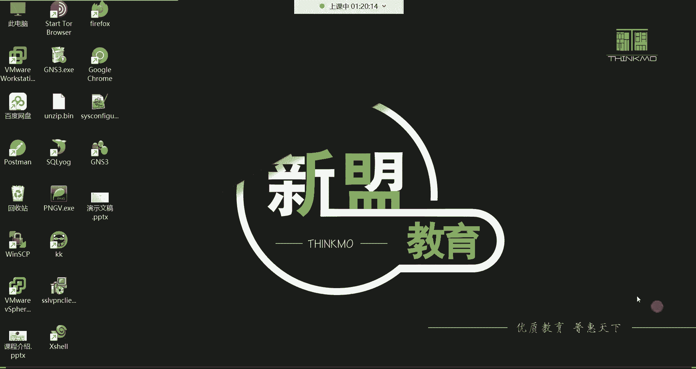
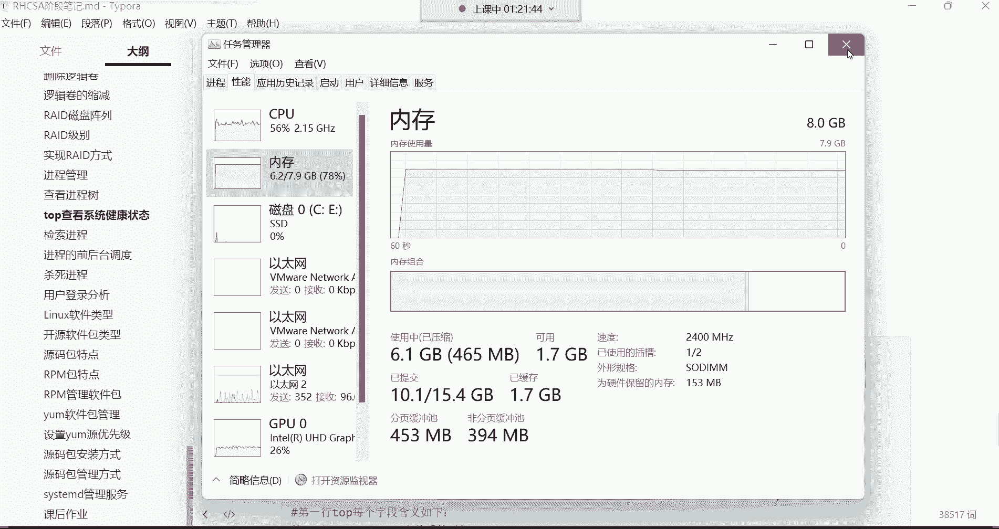
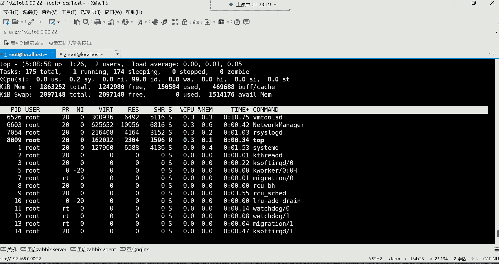
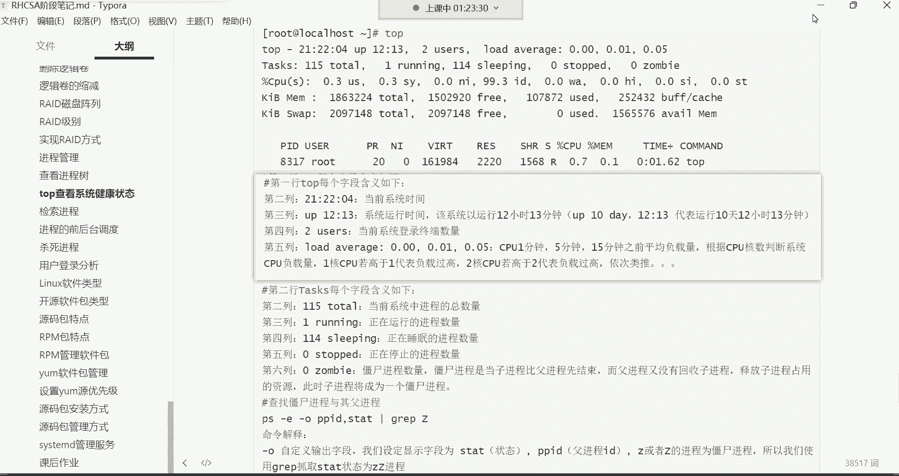
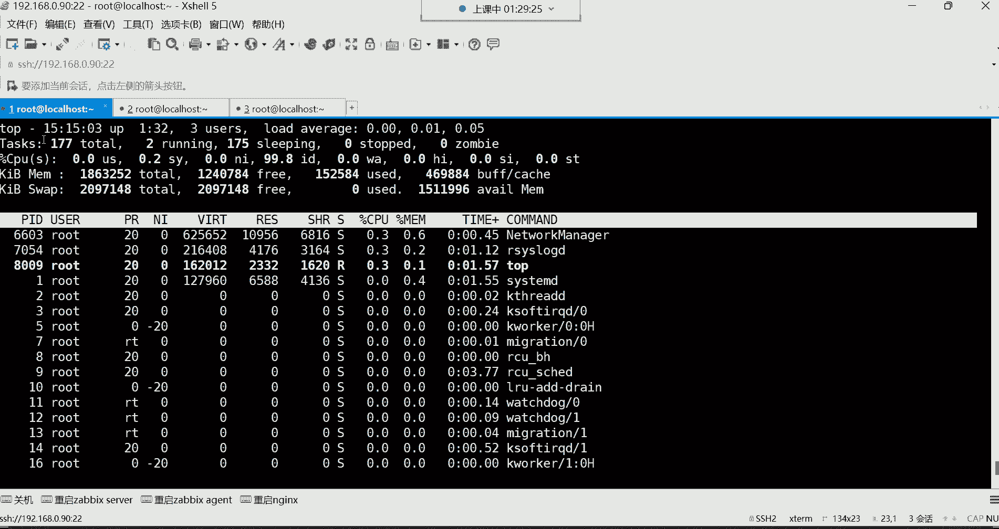
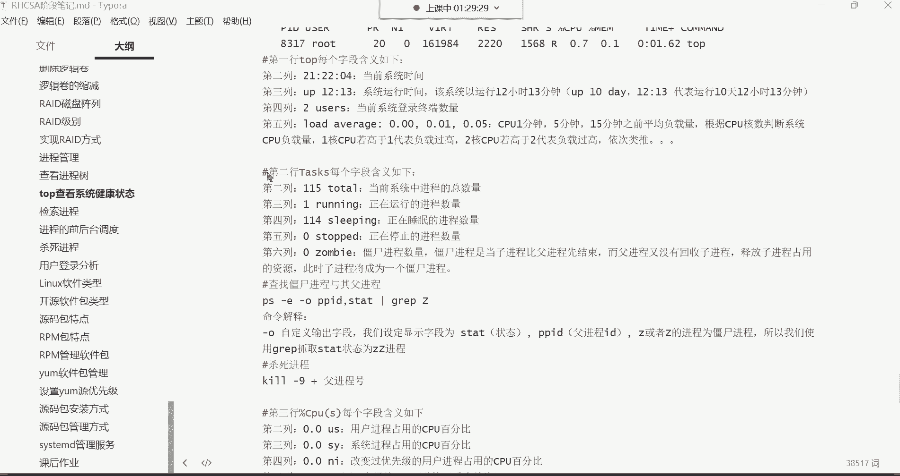
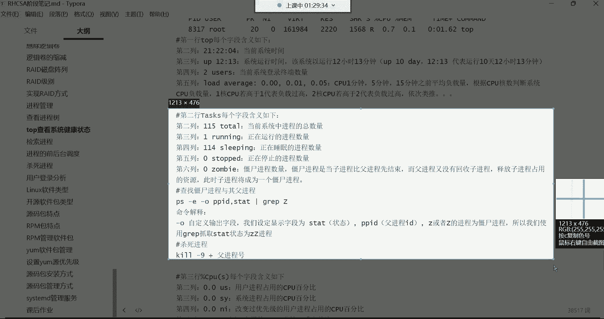
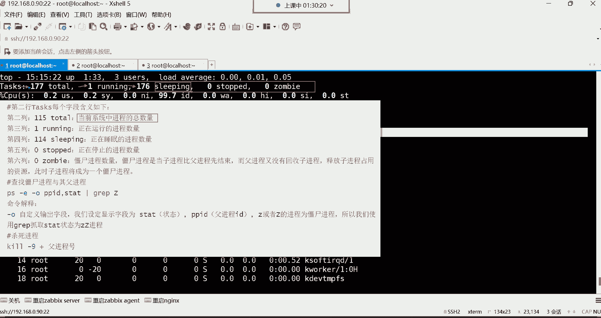
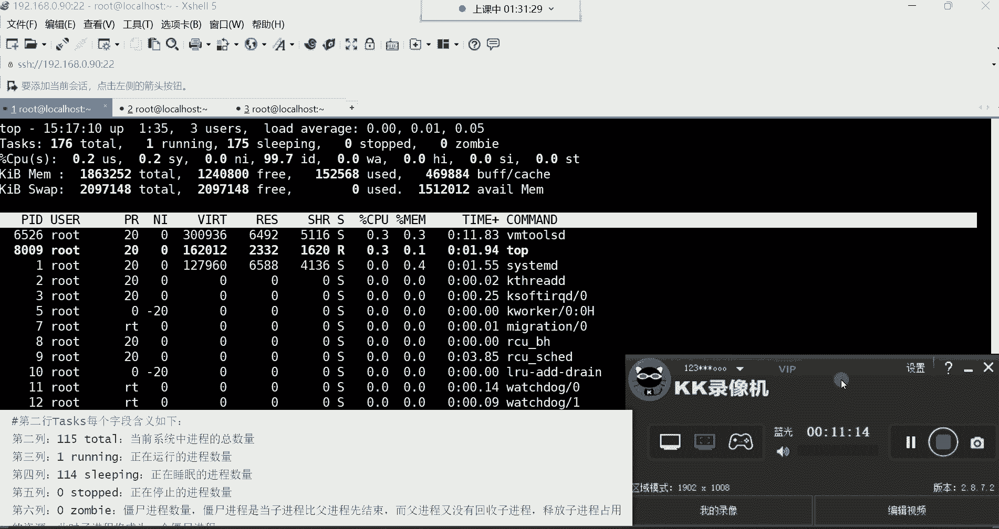

# 【小白入门必备】Linux运维进阶RHCSA+RHCE最全培训教程视频合集 - P29：红帽RHCSA-29.top系统健康检查 - 洋洋得IE - BV1nN4y1X7Go

好都回来了吗，各位我们继续吧，喂喂喂，好，都回来了是吧好，那下面呢我们来给大家讲解一个top命令，top命令，它主要功能是用来调动态查看系统的性能，跟系统的运行状态的。

类似于windows里的那个资源管理器，也就是说我们在用windows的时候，我想看我系统里面的一些资源的话，可以通过资源管理器啊，这个任务管理器来看哈，PS是静态的，PS是静态哈，它是动态的。

而且呀还有还有很多信息PS显示不出来，所以top命令呢它就像一个资源管理器一样，它可以帮你分析你系统当前的一个，比如说我的一个性能，这个性能里边可以有哪些呢，比如说我当前的一个系统的一个内存CPU。

看到没有内存的，有磁盘的，有网络的，有CPU的，看到了吗，唉这些信息呢都可以从这里面看，这是不是就top命令啊，啊不是，这是不是叫做这个任务管理器啊，那top命令干的事跟他是一样的。

那他是不是比PS4要强大，PS你能够分析出来，比如说我这个当前什么什么网络之类的，可这可以吗，分析不出来是吧啊，就是top也top也分析不出来，但是一般他也不用分析网络，但是它是动态的。

它可以实时的观测我当前的CPU内存，还有这个嗯其他的进程信息都可以，所以这方面你直接敲的话呢来看啊。

top回车，它就给你显示这样的效果了，但是它是动态的，你看了吗，这个界面，当前是不是就已经被top命令给占用了呀，而且你看他是不是一直在动啊，看到吗，一直在动哈。

而PS呢PS你看我们说这个我们再开一个终端哈，在这啊，不用安包哈，不用安包本这种东西，系统自带这玩意就跟windows里那个任务管理器一样，那windows任务管理器需要你自己额外安装吗。

不需要你安装系统的时候，他就给你安装上了，然后就是PSAUX，你发现它就不一样嘛，这PSAUS，它主要就是给你看系统里面的一些进程信息，看到了吗，它可以帮你列出每个进程占用多少，CPU占用多少内存。

但是有很多信息他列不出来哪些信息呢，你比如说我们在top里边多少行呢，哈哈一行两行三行四行五行，再加上下面这个六行，第六行才是那个PSUAUS，那个命令列出来的是PSAUX，你敲一下。

它会帮我列出来每个进程的PID，然后用户是谁啊，包括进程的状态，看到了吗，占用CPU百分比，占用内存百分比，哪个V能产生的，第六条，第六条数据才是第六条哈，才是PSUS这个命令呢，我可以把我们列出来了。

但是上边1~5，你发现PS这条命令列不出来，能理解吧，那第一行到第五行，这个代表是什么意思呢。

这每一行啊，这信息啊都非常非常的多，我先来说第一行哈。

每次讲到这儿啊，哎呀我都感觉哎呀都都能把自己给讲困了，这几乎没有操作啊，你只需要去知道每一行的，每一列代表什么意思就行了，我们来从第一行开始啊，就从第一行开始说，第一行看了吗，就top命令这一行。

然后第一行第一列代表什么意思呢，就这第一列这个代表当前的系统时间，那么当前系统现在是几点呢，15：04分看到了吗，然后后面这up是什么意思呢，这up它代表是你系统已经运行了多久了，系统的运行时间。

那这个位置啊，如果是一冒号27就一小时27分钟，这个位置一冒号27就是一小时27分钟，但是在生产环境下的企业服务器，它可能运行的时间要比这个要长好，那企业服务器一般它怎么表示呢，一般呢用天数来表示。

比如说我这个服务器我已经运行一年了，那运行一年的话，他怎么表示呢，叫365D，365d，后边呢再跟上具体的，比如说多少个小时，比如说四小时，然后冒号多少分钟，四小时，20分钟，它是这么表示的。

所以在这个行业里面就有很多人喜欢干嘛呢，把自己服务器的这个运行时间给它，发布到网络当中做一个炫耀，比如说我这个服务器已经运行了多久了呢，啊这服务器现在已经运行了，这个比如说你看他那天数哈。

嗯天数比如说哎1000多天了，1000多天了，就是嗯我们说这一年365天一啊，一年365天不是20年，没有那么夸张哈，那个两年多没有关机，很正常的，对一个服务器来讲，两年多不关机不重启。

所以这位置呢它的天数应该是1000多天，就证明说他维护的好，我这服务器都没有重启过，哈哈能理解吧啊这作为一个炫耀哈，然后还有一个用户二，这个2U44代表的意思是，当前登录系统的终端数量，它是终端啊。

就是你当前有几个终端再登录这个系统，它就显示几它不是用户数量哈，我现在如果说同一个用户再开再开一个终端，他这数它也变现在三个终端了吧，你看那这个位置的时候就变成三了呀，就是当前几个终端再登录它就显示几。

然后右边这个load，嗯这个呢叫做平均负载量啊，叫这个CPU的一五十五的平均负载量，这个一五十五是从左往右哈，这是一分钟的负载，这是5分钟的负载，这是15分钟的负载，那对于这些负载量的话呢。

也是我们衡量一个服务器忙与不忙的，一些非常重要的数据了，比如我当前服务器如果比较忙的话，你怎么才能知道他忙啊，你不能听声，你说哎呦，我这服务器这风扇转的转的太快了，这声音太大了。

我这服务器当前是不是太忙了呀，你不能通过风扇的转速去判断他忙不忙，你得看CPU，所以怎么判断呢，唉就看这三个值对，就是说在最近一分钟之内，我的CPU的负载达到什么程度了，在最近5分钟的时间内。

我的CPU负载达到什么程度，但是他永远都是最近的时间，注意哈，永远都是最近时间，然后呢，最近15分钟，我的CPU负载达到一个什么的程度啊，但是他这个数怎么我们去怎么去计算呢，哈这样算。

他得根据CPU的核数来判断系统的CPU负载量，你比如说我这CPU多少核，我CPU4核的，如果CPU4核心的话，四核心如果CPU4核心的话，那这个位置如果说达到一的话，它代表是一个核心的负载量等于百分百。

他是这么计算的，能理解吧啊，所以说他这个数的，如果是比如说是这个1。0了，在这个位置哈，如果变成1。0的话，1。0它是代表说E核心的CPU是百分百的状态，那如果这位变成2。0呢，那如果是2。0的话。

那他这个位置就代表两个核心，两个核心的CPU当前是属于百分百，啊那如果你说我电脑里面我一共四个核心，那如果说我一共四个核心的话，哎，那这个位置我应该怎么判断我CPU的这个什么呢，负载已经是超负荷了呢。

唉4。0，如果这边是4。0的话，就证明你这个CPU现在已经是严重超负荷了，但如果是2。0没事，还有两个核心，因为CPU它因为这个CPU他在用的时候呢，他怎么用的一个核心，一个核心就用。

比如我一个核心用完了，我再用第二核心，第二核心满了，再用第三个，第三个版，再用第四个，他是这么回事儿，能力吧，如果你发现这位置A才2。0，没事，我还有很多个核心可以用，是这么回事哈啊这是具体的时间。

它永远都是最近最近一分钟，最近5分钟，最近15分钟啊，这是CPU的一个平均负载量好，那这是第一行给大家说清楚了吧，是不是当前的系统的本地时间，当前系统已经运行了多久了，然后有多少个终端在登录。

然后CPU的一个平均负载量啊，our range啊，就load our range啊，那第二行代表什么意思啊。

这第二行。

叫塔斯克斯对塔斯克斯啊。

这是代表进程信息的第二行啊，哈在这个第二行里边呢，我们从左往右给大家说每一个列哈，第一列177，total啊，这代表什么意思呢，这代表当前系统中的进程的总数量，就是我当前系统里面有多少个进程。

这个位置177个，就是总共的进程数量好，那多少个进程在运行，一个进程在运行，只有一个在运行，我这一那也就是说我现在有176个进程，干嘛呀，在sleep看了吗，在休眠呢，在睡觉呢，哈哈在后台睡觉哈。

现在只有一个进程在运行哪个进程啊，我通过下面可以看得到吗，哦手机的问题是吗，我把手机拿拿走啊，现在还有电流声吗，我把手机放远了，这电流声，还有是吗，怎么会有这种电流声，那我们现在哦。

那我们现在不能乱动啊，它是不是一阵儿一阵儿的呀，是一阵一阵的呢，如果说这个是一阵一阵的呢，我们得先坚持一下，等下课以后呢，我把这个麦克风哈重新插一遍，不然我现在不能动，现在一动。

我们这个这节课的录屏就没声音了，又来了是吗，我看一下哈。

还有是吧。