# 【小白入门必备】Linux运维进阶RHCSA+RHCE最全培训教程视频合集 - P2：红帽RHCSA-2.VMware安装CentOS系统 - 洋洋得IE - BV1nN4y1X7Go

喂喂喂，哈喽哈喽，兄弟们都回来了吗，回来的话给我刷波一，我们来继续啊，继续安装系统好，都回来了是吧行，那接下来呢咱们开始安装操作系统哈，那我们安装哪个系统呢，啊我们安装这个渗透OS，安装它。

安装这个渗透S，那对于这个啊外卖刚到上没事儿，你就边吃边听吧，哈这都不影响这个我们啊，就是我们在学习的阶段呢，我们以这个sin s为主啊，但是呢我要给大家说说。

那since跟这个red hat他们两个之间的关系哈，就是他们两个是怎么回事呢，你可以这么去理解吧，呃就是有啊，有些电流是吧啊，等一下啊，调一调，好喂喂喂喂喂喂，没有了吧，消除一下哈，降噪O嗯好了。

然后接下来我们说说就这两个系统呢，这个渗透S我们为什么要学它，因为第一它是因为免费的是吧，呃这个很好理解啊，人嘛是我们对于免费的东西，都没有任何的抵抗力，而且呢也是用在企业服务器领域啊。

也是我们主要学习的领域啊的一个操作系统，这两个关系呢red hat这个系统啊，我跟你讲，森达斯就是从他克隆过来的，你们知道什么叫克隆吗，这克隆的话其实就是一个模子，知道吧。

所以说这这两个系统呢你学哪个都行啊，那以后到企业里边，那如果这个企业用的是这个red hat，怎么办呢啊那这个时候没关系啊，他们两个命令都一样，从操作使用方面也都是一样的，所以呢你学哪个都行。

那咱们还是以这个免费的四男四为主啊，因为毕竟他在企业里面用的比较多呀是吧，因为还是大部分企业呢不喜欢花钱啊，所以说我们以sin为主啊，OK吧啊，但是这两个系统呢完全是一样的哈，完全一样的好。

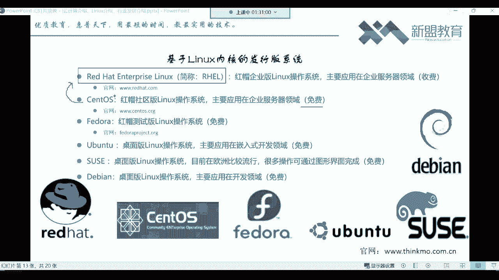

那我们安装它的话呢，咱们先说一说这个安装嗯，安装怎么安呢，第一呢，我们这个是不是给你们发了一个VIP大礼包啊，呃学习工具，好找一下啊。

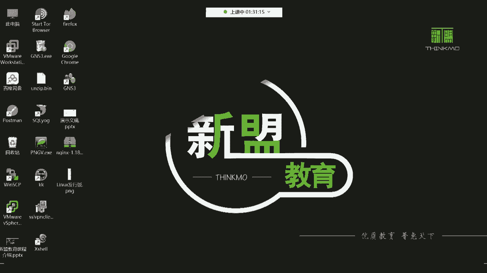

VIP大礼包都领到了吧，在这个群公告里边，诶，嗯展开一下哈啊这这里面是不是有个VIP大礼包。

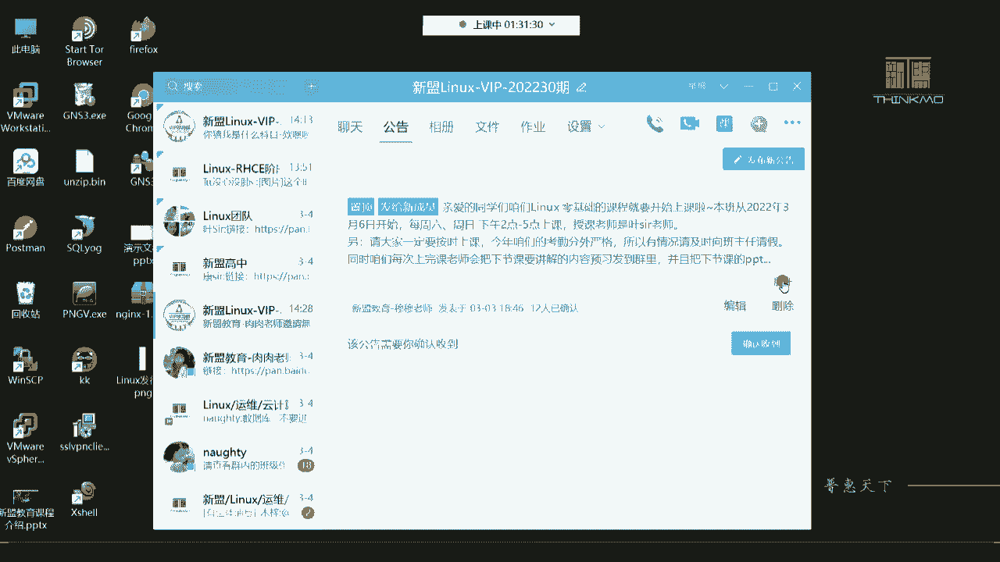

然后点一下点一下，你装的是7。9的，没关系啊，7。9也可以，然后跟你们说这VIP大礼包里面都有哪些东西，没关系哈，有问题的话，我今天带着你们一起装一遍，提取码错了吗啊，好点一下哈，点进去啊。

这里边就是VIP大礼包，然后这里边有这个什么，这哈云计算简介及这个视频安装，那云计算简介的话呢，这个删掉啊，删掉哈，啊没事儿，一会儿我再删吧哈，然后这个不好，我们这是安装教程那个系统的镜像呢。

啊学习工具里面啊，这呢哈这里边有一个叫什么呢，有一个叫做系统班的学习工具啊，安装系统的时候的一个学习工具哈，然后在这个里边有这个WAM威尔啊，这是一个什么呢，一个虚拟机软件啊。

一会儿给你们介绍这个VM威尔这个软件哈，VMVR虚拟机软件介绍，然后这里边呢还有这个软件呃，你在安装的时候呢，需要的一个叫做激活码的一个密钥啊，这个激活码就是你在安装这个软件的时候，他给你要一个码。

那个码呢你从文件里面找找到以后呢，然后呢到时候输入进去就可以安装成功了，OK然后这里面还有个叫x shell啊，这是一个什么，这是一个远程的连接工具，这个连接工具。

如果啊你有自己的这个像什么查成已经有的话，没关系，你就用自己就可以了哈，没有的话呢，这个呢然后你给它下载到你的电脑里边，这个也都下载到你的电脑上面哈，下载上去，然后我们用哪个呢，这个这叫渗透S7。

这个镜像看到了吧，这个啊可以哈可以哈，呃这个镜像的话呢，就说我们一会安装系统的时候，我们不是要安装一个sin cos的系统吗，那这时候呢哎我们就要用这个镜像，那这里面还有一个叫real8啊。

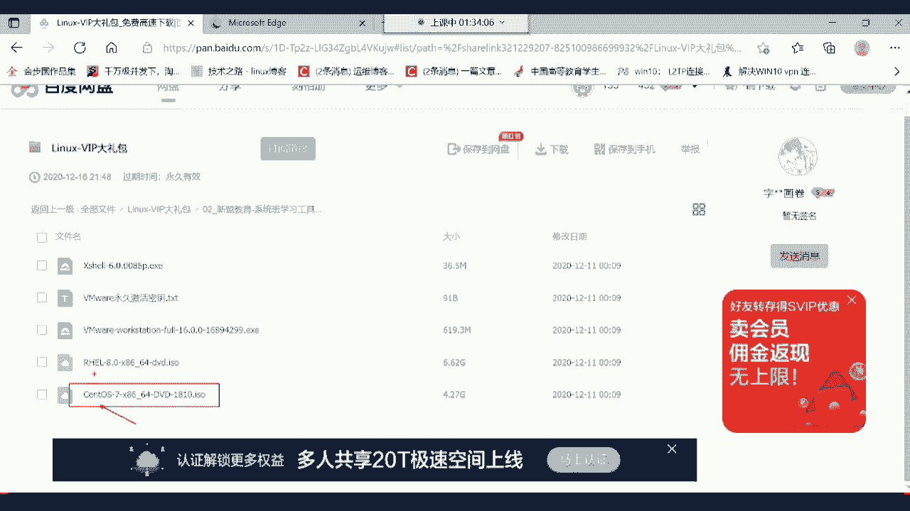

这个real8，就是我们前面给你们介绍的这个红帽企业版的，这个啊，就是简称IHEL嘛，然后版本是八版本的，然后我们不安装这个八版本的哈，不安装八的，为什么呢，因为这个八在企业里边。

那SNS也有800万的，但是4S这个八在七里面现在已经什么呢，已经这个没有人用了，因为它已经超过他的一个维护期了，那就八现在官方不维护了，所以我们现在能用的就是SLS7啊。

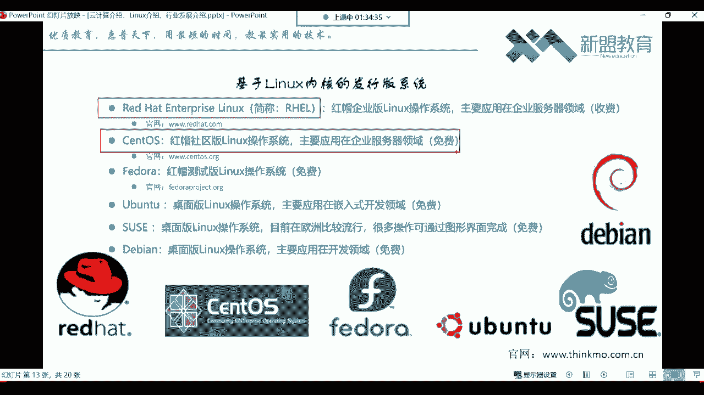

这个版本的系统，所以大家就下这个啊，我这个是7。6的，然后你们也可以用跟我一起的，如果你们自己有，只要是七以上的版本都可以哈，什么7。9的呀，7。6的呀等等都可以，没关系啊，图图形界面也无所谓。

OK然后你们知道下哪些吗，这个哈哎这是我们要下载的，都给它下载到你的电脑上面。

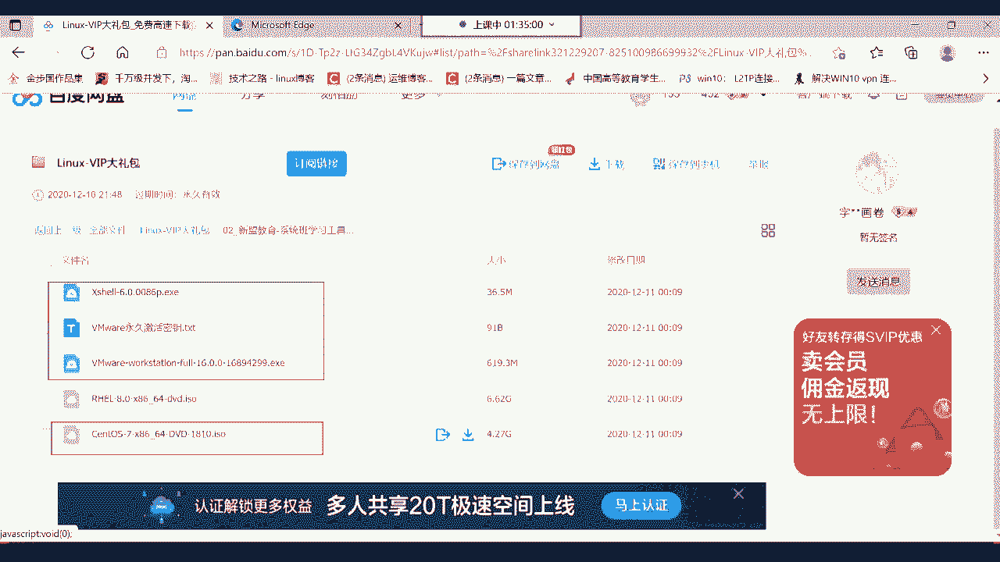

知道吧，这个哈要下载的，标记一下哈。

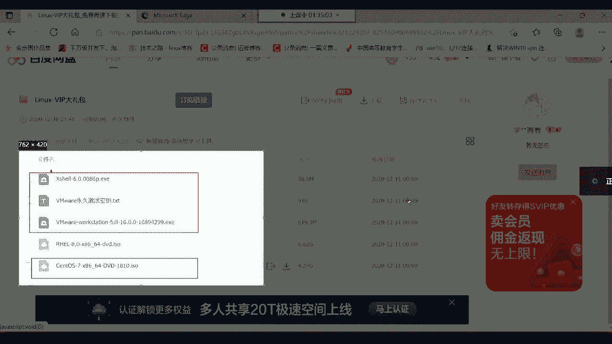

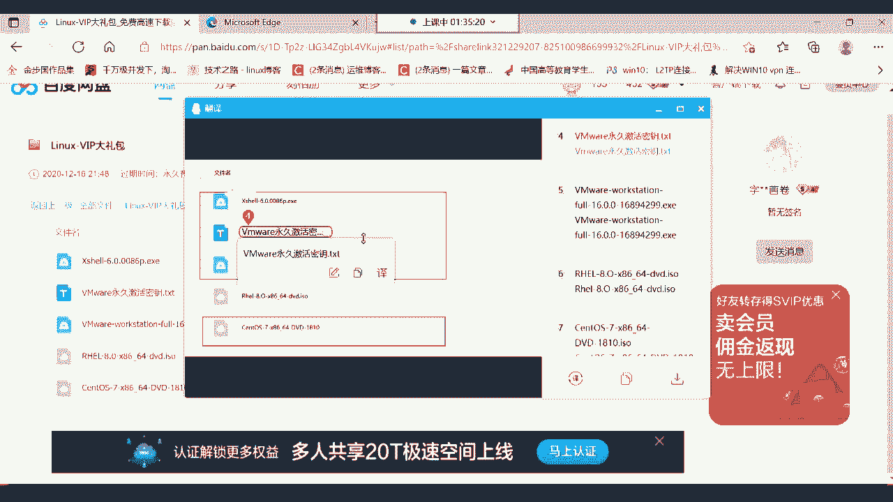

等一下啊，我给你们截个图哈，这是在这个VIP大礼包里面，然后下载哪些东西，这是VIP大礼包，然后在这边嗯，需要下载的都给你们框起来哈啊，还有这个。

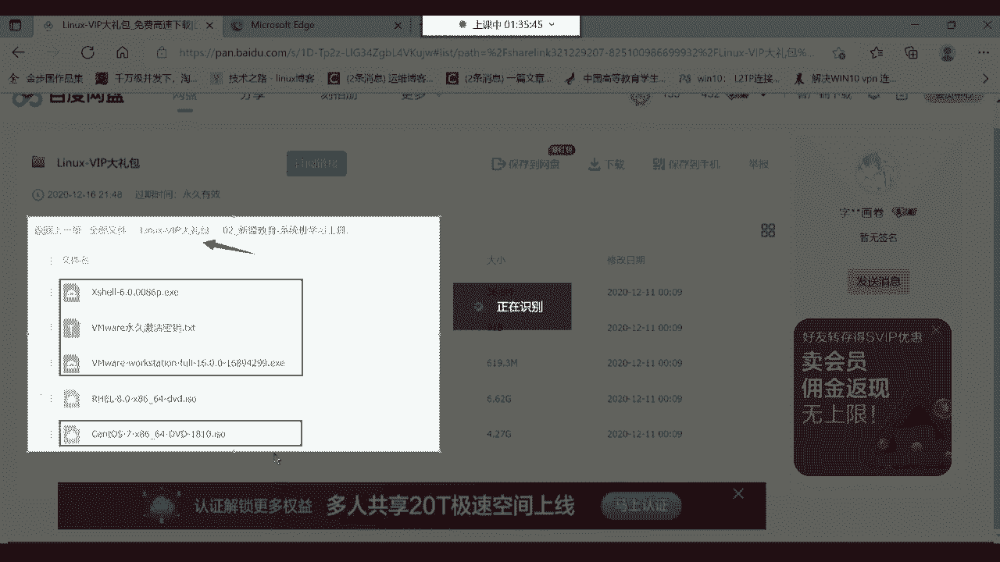

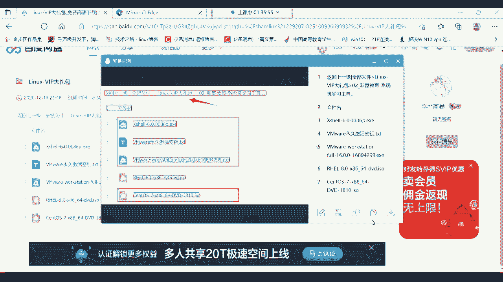

这截图怎么，下载嗯红框内的软件到电脑。

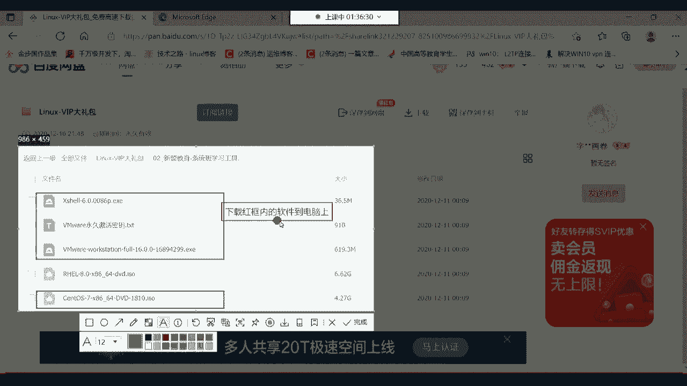

来哈在网盘里边哈，这个呢我也给你们发到群里面去嗯，知道了吧，唉你都下好了是吧，这个八的话呢是给考试人准备的，如果有人你说你想考红帽认证啊，你可以下载一个八的，不影响啊，不影响。

再把这个七呢下载一下就可以了。

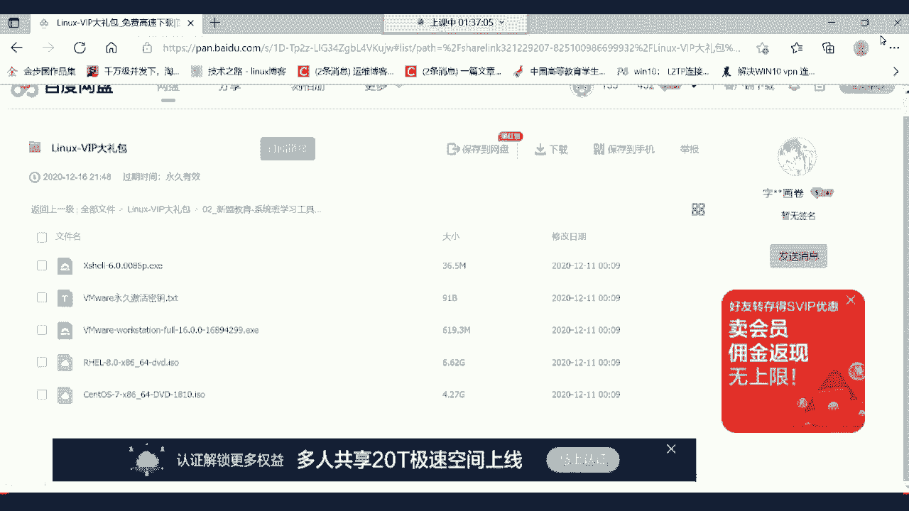

但是你们啊先不用着急哈，不用急，因为你你们课后安装系统的，是看着我的录屏啊去安装啊，跟我一起安的话，那可能跟不上我的节奏，所以你们课后再去按啊，今天呢你们也不用担心跟不上哈。

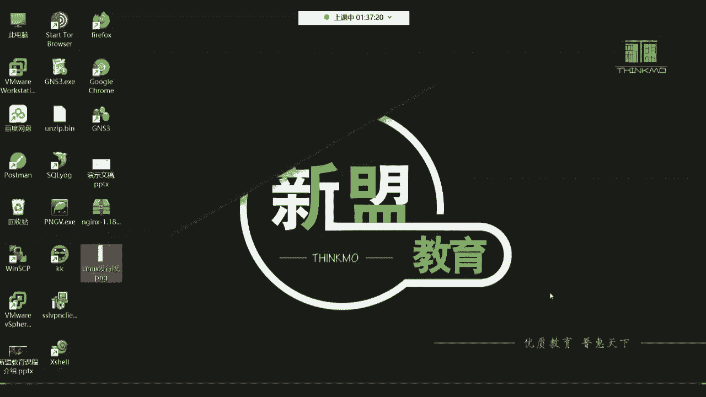

一会儿呢我给大家讲讲这个呃，好的学习方法好吧，好的学习方法啊，好的学习方式吧。

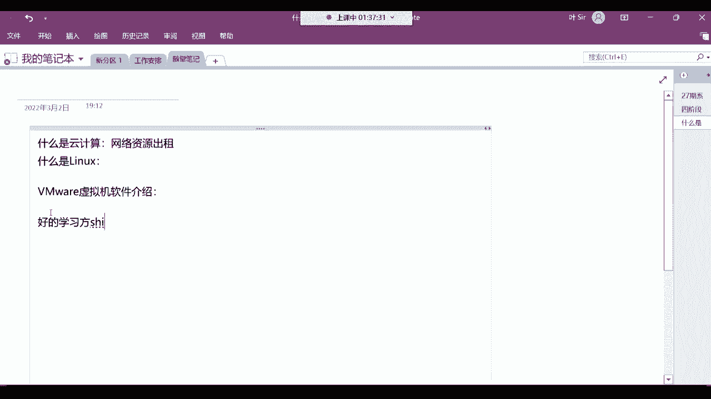

行，那我们说说这个虚拟机软件，你给它下载到你电脑里面以后呢，就是就是这个哈，就这个图标看到叫well，Where are workstation，然后呢双击打开它。

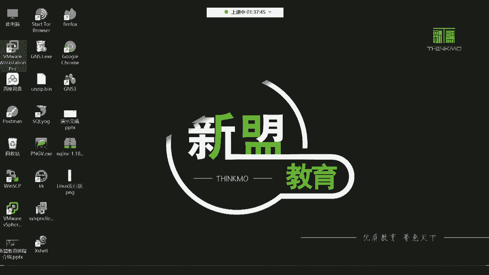

因为要安装系统，它得需要就是特别是系统在安装的时候，它这个需要时间还是蛮长的，所以我们先安装上，然后呢再去干嘛，再去讲我们后面的内容啊，这样呢我们可以什么呢，把这个时间给它合理的利用上。

呃这个软件你首次打开的话呢，你看到的可跟我的界面是不一样的哈，因为我这个里面，我已经提前创建过很多台虚拟机了啊，你们可以看到我这个左侧，左侧呢是这个虚拟机的名称，这里面是不是有很多的虚拟机了呀。

啊啊有这个STOS的就好几台是吧，还有这个MYSQL数据库的，还有红包的real8的啊，还有这个上一个班的虚拟机啊，这个有很多哈，而你们左边什么都没有啊，所以呢什么都没有呢。

我们要选择什么叫创建新的虚拟机啊，第一步创建新的虚拟机点，然后在这个里面呢，我们就来到了这个创建的向导界面，那他现在就问我了，他说你希望使用什么类型的配置，那创建虚拟机嘛是吧啊。

分为这个典型啊跟自定义这两种方式啊，那我们选择哪种呢，我们选择这种典型的典型的话，那你看通过几个简单的步骤，就可以创建一个虚拟机出来，然后下边呢呃如果自定义呢，现在暂时用不到哈，没有特殊需求。

我们用不到，所以说呢我们就选择典型默认就可以啊，默认就典型，所以选择下一步啊，点击下一步哈啊，接下来呢在这里边安装客户机的操作系统，也说，现在你可以选择给这个虚拟机安装一个，什么样的系统了啊。

那安装方式呢看看可以选择用光盘去安装啊，也可以选择用那个叫做光盘的映像文件去安装，这光盘的话是适合在什么样的环境去安装呢，就比如说物理机，注意哈，如果你给物理机安装一个啊渗透S的操作系统。

那你可以去通过光盘去安装，因为物理机嘛物理机你想想啊，它有叫光驱设备，就是一些老式的台式机啊，你们嗯应该都接触过那种，这个像很多年以前那种台式机啊，它下面有一个像什么呢。

嗯有一个就像这个DVD插光盘的地方，你按个按钮就弹出来一个什么叫光驱设备，然后把光盘放进去啊，把那个光驱给它推进去，这时候呢那光盘就有这个操作系统啊，你可以通过光盘启动啊，就帮你去用光盘去安装。

但是虚拟机咱没有光驱，是不是，本来咱们咱们是通过软件虚拟的一个机器，所以说呢你不能选择用这个光盘去安装，你就只能选择什么呢，用映像文件去安装啊，所以我刚刚给你们截图的那个东西，就是映像文件啊。

系统的镜像文件那里面就有一个SSE4的系统，但是呢我们也不从这儿选，不从这选，我们选择稍后安装系统，唉，你先去给我创建一个虚拟机，然后呢再包含一个空白硬盘啊，为什么我要稍后安装呢。

因为我们有很多东西是需要我们自定义的，知道吧，所以这时候呢选择下一步，而接下来呢选择客户机的操作系统啊，我们要安装一个什么样的系统呢，那这里边有windows的，有LINUX的啊。

有这个后期的这个就是叫e xi啊，那我们呢选择这个LINUX哈，然后版本呢在这里面选，那你你看这里边啊，他给你支持的系统的版本有sent os的是吧，有得办的，有匪段的啊，还有这个SUC的。

还有oracle的，还有红帽red hat的，看到了非常多吧，是不是啊，看这里非常多哈，OK但是那包括乌班图的都有啊，那我们选哪个呢，我们选择渗透S的系统往上滑在这，然后找到对应的版本。

你看那SINT啊，在上面STOS分为567，我们选择这个七版本，我一会给你们介绍啊，这个现在这个操作系统的版本，操作系统的版本介绍介绍什么，介绍这个红帽的跟这个渗透S，它分为这个567版本。

红包也是567567，然后cs呢也是567版本，然后这个位置呢选好的话，那我们直接选择下一步啊，然后在这边那叫命名虚拟机，这就是让我们给这个虚拟取个名，这就是左边的名字哈，这个名字呢你随便起啊。

叫什么都行，中文英文都可以，你比如说我我就知道它叫什么叫37，然后系统班学习啊，我我让叫教学用机，教学机可以吧，然后后面呢再指定一个他的IP地址啊，IP地址现在还没有配，我们后期再配哈。

IP呢我让它变成多少呢，变成那就是啊我们后期会会给他配个IP啊，IP地址的最后一位就给他配成90啊，IP多少，我们一会再说好吧，你们可以先按照我这样去什么呢去命名，然后接下来安装位置，那安装位置的话。

那这个你可以自由选择了哈，在预览里边，你觉得你电脑里边看你的哪块盘比较富裕啊，就空间比较充裕，看到了吧啊，此电脑你这里边你觉得你对你的C盘充裕啊，还是你的别的盘比较充裕啊是吧。

你就给它安装在哪个盘上面就可以了，然后如果C盘你的空间如果已经怎么说呢，占用比较高的话啊，对哈，最好是放到固态里面，因为它快嗯，所以呢嗯你就尽量吧尽量能放到C盘，就放到C盘，为什么，因为C盘啊。

就是如果你电脑是固态硬盘，你的C盘肯定是固态的啊，如果空间充裕的话，放在C盘，如果空间不充不充裕，那就别放在C盘了，毕竟C盘在windows里面，C盘就是你的系统盘啊，就是系统在启动的时候。

系统在运行的时候啊，它的相关的重要文件都在C盘里面，所以如果你的C盘空间太臃肿的话，会影响你系统的运行速度，啊所以看情况啊，你们就看情况安我呢就安装我的，安装到我的C盘，那我的C盘我还可用空间。

还有一一百七十五个G呢啊，所以我随便随便用哈，OK那默认就在C盘了，看到了C盘这个路径，然后选择下一步，OK然后指定磁盘容量啊，这个磁盘容量默认是他给我们分配了，20个G的空间。

这20个G的空间是从哪来的呢，注意哈，它是虚拟机，你看它给我们虚拟一个磁盘，然后呢这个磁盘是20个G的空间，那这个虚拟的磁盘空间，那最终他得从我的真机啊，就是我的windows电脑的空间去干嘛呢。

去划分出20个G的空间给这个虚拟机去用，能理解我说的意思吧，你比如说我这个我的电脑，总共100个G的空间啊，那这时候呢我给虚拟机分配了20个G啊，那他就会从我的100个G里面去划走20个G。

分配给虚拟机，能理解了吧，那我的电脑还剩多少呢，是不是还剩80个G啊，没错吧啊是这样子的哈，但是我告诉你这个空间呢，他不是说一次性就划走，你给他800没事哈，他不是一次性就全都把空间分配给虚拟机啊。

它是这样子的，就是随着不断的使用，然后呢再一点一点的给这个虚拟机分配空间，你比如虚拟机运行，总共需要占用两个G的什么呢，磁盘空间，那这个时候唉我们这个真机啊，就会给他分配两个G，能理解吧。

啊虚拟机如果说随着不断的使用啊，需要三个G，那就给它分配三个G，他不是说一次性把20个G全都给他啊，就是随着不断的使用啊，去干嘛呢啊，去给他分配这个使用量，是这么回事，所以呢啊你们也不要担心。

你说我我给他分配100个G，那时候我真机电脑就没有空间用的，还不是，那这个空间其实是什么呢，这个空间是最多唉，你可以使用我20个G空间唉，也就是说我最多会给你分配20个G啊，然后随着不断的使用呢，1。

1点分配给你能列了吧啊，所以这个你不要担心分大分小都无所谓，在这位置，然后下边呢啊，你到底是将虚拟磁盘拆分为多个文件还给他啊，存储为单个文件，那这个有什么区别，他就告诉你了，他如果拆分磁盘以后呢。

可以更轻松的在计算机之间移动虚拟机啊，但可能会降低大容量磁盘的性能啊，这个你不用去管了哈，你就存储为单个文件就行了啊，这个我们几乎不会去移动虚拟机的，能理解吧啊所以选择下一步。

然后接下来呢这个位置哈还是蛮重要的哈，叫自定义硬件，所以选择自定义硬件，什么叫自定义硬件啊，啊这个时候呢我们就要涉及到虚拟机的本质，哎这个虚拟机软件介绍，软虚拟机软件干什么用的呀。

它是帮我们虚拟出一套完整的硬件平台，然后呢我们是在这个硬件平台之上去安装什么，安装操作系统，这个应该比较好理解吧，你比如说你从外面你花钱买个电脑回来，你这个电脑里面有什么呀。

你电脑里面无非不就是一堆硬件吗，哪些硬件啊，内存条是不是还有什么呀，还有磁盘像砖头一样是磁盘，有网卡，是不是啊，哎硬盘嗯啊等会磁盘就硬盘啊，还有什么显卡之类的，没错吧，哎鼠标啊。

键盘是不是这如果你从外边花钱买个电脑，你的电脑里面不就是这一堆硬件吗，是不是就一堆硬件哈，然后呢你是在这一堆硬件之上去干嘛呀，哎去才能安装操作系统，因为操作系统是需要底层的硬件资源。

他才能够安装成功的啊，因为系统最终是安装在你的磁盘里面，那你没有磁盘，你怎么安装系统啊，是不是，那你没有内存的话，你这个系统也开不开机呀，是不是啊，你没有显卡，你想你怎么看呢，是不是啊。

嗯显卡声卡之类的，是不是，那你看啊什么网卡，显卡声卡之类的，没错吧，哎这不就一堆硬件吗，所以虚拟机他干的事，就是帮我们虚拟出一套完整的硬件平台出来，哎有了硬件平台了，咱们再去干嘛呢。

再去安装系统就可以了，所以你看我们前面干的事干了什么事，就是创建了一个虚拟机出来，知道吧，那这个虚拟机，它不就是帮我们虚拟出了一个内存条，是CPU，还有什么呢啊，这是一个叫DVD啊。

这是虚拟出一个驱动啊，光驱设备哈，当然了，我们一会再说好吧，还有网络适配器，这叫网卡啊，帮我们虚拟出一个网卡出来了啊，USB控制器啊，就是USB接口，那虚拟出一个声卡来啊，打印机的接口啊。

显示器看到了吗，这不就是虚拟他干的事儿吗，啊但是没有什么鼠标键盘哈，这里边儿，接下来我们就得选择一下啊，我们对这一堆硬件，你比如说内存啊，你希望这个虚拟机的内存空间是多大的，内存呢，哎这个就蛮重要了。

你看那虚拟机呢啊就是我们改啊，就是你的对于这个虚拟机注意事项啊，注意事项，我们在这个什么呢，在学习的环境和学习环境，我们是通过虚拟机去安装操作系统的，安装LINUX的系统嗯。

但是呢我们对于我们真机的一个内存啊，其实我还是什么呢，还是建议哈建议在16个G以上，为什么呢，因为这个虚拟机特别消耗内存，虚拟机就比较消耗内存，呃其实也不能说虚拟机消耗内存，而什么呢。

而是本身我们的电脑内存就比较少，没错吧，你看我，你知道我电脑多少内存吗，我的电脑给你们看一看哈，我的我的电脑总共八个G内存，八个G的内存，来给你们看一下，你看我的内存就八个G看了吗，8G内存的哈。

那对8G内存，那我们在创建虚拟机的时候，你看我电脑总共8G内存，我电脑一运行是吧，我起了所有的软件吃，都是吃我这八个G内存的，那这八个G内存的话，比如我这个虚拟机我分配两个G内存好。

一台虚拟机分为两个G，那后期你看我这左边我创建了多少台虚拟机啊，1234567台是不是在那再创建，那这台是第是第八台了，那我如果一个虚拟机，我给他分配两个G内存，我28116G，我16G内存没了。

是不是那个我电脑总共才8G内存，我上哪去去淘这16G内存，确这怎么办呢，呃所以我建议大家内存还是稍微大一点啊，16G以上，特别是后期再做一些这个，比如大型的环境的时候啊，部署集群的时候。

我们都得需要好几台虚拟机，三四台四五台虚拟机，那如果你内存小的话，你真的是跑不起来，这实验你就没有办法去做，能理解吧，所以内存要求呢还是这个大一点啊，对CPU什么的硬盘那无所谓了哈。

硬盘我们基本上都是至少都是几百个G，起步是吧，有的同学硬盘都几个T没错吧，所以内存大一点，但是呢我们分配内存的话，我给你讲讲，你比如说对于这个虚拟机，你看默认的是此虚拟机，使用内存10241个G吧。

是啊一个G啊，没有后面那个八一个G这一个G的话呢，它也是像磁盘一样啊，特点是一样哈，就是随着不断的使用呢，给这个虚拟机去最多分配一个G内存啊，注意啊是最多分配一个G内存，也不是说一次性就给这虚拟机。

给这个虚拟机一个G内存了，还有就是这个虚拟如果你一关机的话，那它是不会消耗你的内存的，只有开机的时候才会消耗内存，如果一关机的内存呢，啊这个还是在你的真机上面能理解吧，啊所以这个没有关系哈。

你看这机器如果都关机，是不消耗我的我的物理机的内存的啊，所以这个呢你分配一个G也行，分配两个G也行，咱们就直接2048，2048大点儿安装系统速度也快一点好吧，2048，然后接下来呢选择处理器。

这处理器是什么，处理器就是CPU的意思啊，CPU就是处理器啊，全名叫中央处理器啊，就是计算机里的核心啊，中央嘛是吧，在你那个呃电脑的主板上面的最中间啊，就是什么，就是CPU啊，叫中央处理器。

CPU干什么事了呢，CP我们后面再说啊，啊接下来呢你要给这个虚拟机分配啊多少个CPU，那这CPU的数量几个呀，这个根据你真机去分配，我的真机就一个CPU，就一个CPU啊，所以那给虚拟机呢也分配一个。

那你分配俩也没用，为什么，因为最多他以你的真机为准，能理解吧，接下来那每个CPU的核心数量啊，就是这个CPU不是有有什么四核八核的吗，是不是啊，那你要给这个虚拟机分配几个核，那一个核就可以了，两个核吧。

分为两个和好吧，但是这东西也是根据我们这个电脑的真机，去分配，你比如说我电脑总共四个核，是不是你CPU总共四盒，那你的虚拟机你也不能分配超过四核，能理解吧啊咱就分配两盒。

一会儿让它安装系统的时候速度快一点，那接下来呢那正常来讲一个核就够用了哈，那么接下来呢这个叫新CDDVD啊，这个位置就还是蛮重要的哈，这位置就是我们要选择如何安装系统了。

那这个位置呢我们前面并没有安装系统，并没有安装是吧，只是前面你看我们创建了一个空白硬盘，加一个虚拟机，但并没有安装系统，那接下来在这个位置我们要选择安装系统，第一种方式使用物理驱动器。

什么叫物理驱动器啊，有人知道吗，物理驱动器是啥呀，就是那个，U盘啊，U盘哈，就是现在服务器安装系统是通过U盘去安装啊，就是你把那个系统下载到你的U盘里边，然后给它插到你的服务器那个USB。

那个USB的接口上面，然后到时候就可以去通过这个U盘，去安装系统啊，但是但是呢咱们并不会通过U盘去安装，是不是啊，嗯那我们用什么呢，唉我们就选择下面那个使用ISO的，硬像文件安装啊，硬像文件还有光盘。

U盘都是叫物理驱动器，然后接下来呢，你看我们选择使用映像文件的时候，那映像文件你得找到那个印象文件呢，那接下来浏览好，在浏览里边这时候往下滑啊，你就找到你的那个SRS那个镜像文件下。

下载到你电脑到哪个位置了，你就选择一下，你看我这个呢是在我电脑里边的这个E盘，看到了吗，那这个时候呢我就选择一下呗，然后打开，OK那现在就什么呢，到时候呢我一开机注意哈，我一开机。

到时候它就会通过这个文件去帮我去安装一个，渗透OS的系统，就这么回事，嗯好了，那接下来呢这个系统选择好了是吧，下边网卡的配置，这叫网络适配器，嗯这个网络适配器它是干什么用的呢。

就是决定我这台虚拟机跟我这个真机之间，那他们如何通信，自定硬件哈，我怎么退出了呢，啊前面都选好了是吧，网络适配器，那接下来呢我们这里边有三种网络连接模式，三种网络连接模式，这个怎么去理解来哈。

我们得画一图说啊，最后啊给你们在哪画个图呢，在这儿啊，我给你们画一个图，然后你看这是一台虚拟机，一会儿的吧哈，我这样我给你们，我给你们找一个图给插进去哈，这是我们的windows电脑，是不是好。

这是一台windows电脑，放大点哈，然后接下来呢我们是不是在这个电脑里边，咱们自己去创建了一台虚拟机，啊啊这是在里边，这是一台虚拟机，我们换个颜色，换个黄色，虚拟机，字体换成黑色，OK这是一台虚拟机。

那虚拟机呢正常来讲啊，这台虚拟机，你看我们的电脑本身是不是有网卡呀，这是我们的真机网卡，这样看，真机的网卡，那虚拟机里面的虚拟它它也是有网卡的，那这时候啊虚拟机里边有网卡，这是虚拟里的网卡。

好放到这儿哈，虚拟的网卡，那这个虚拟的这个虚拟机呢，你看正常来讲，我们在使用它，在学习的时候，我们要干嘛呢，有的时候需要连接到外网去，注意哈，连到这个外网，嗯比如说虚拟机呢，我想去从这个某一个网站下边。

去下载一些软件包啊，到我的虚拟机里边，那这个时候它这个效果是什么效果呢，嗯这是外部网络哈，好OK，那这个虚拟机他想访问这个外网的话怎么办呢，那这个时候他得通过你的真机，才能够去访问外网，能理解吧。

因为毕竟虚拟机嘛是吧，包括网卡都是虚拟出来的，那这时候想去用它真正去访问互联网的话，得通过你的真机啊，还有一个问题就是虚拟机我想跟这个什么呢，唉我想跟我的真机之间相互通信，那这时候他们之间怎么去通信呢。

啊那这时候呢就是我所说的这叫网络模式，哎所以这网络模式就是用来决定你的虚拟机，他跟你真机之间用什么样的方式去通信，还有一个你虚拟机通过一个怎样的方式，去访问互联网啊，所以这就属于叫网络连接模式三种。

第一种呢叫做桥接模式，桥接模式呢它给的解释也非常通俗了，直接连接物理网络，什么叫桥接，桥接就是嫁接的意思啊，如果是桥接模式，它是干嘛呀，就是把这个虚拟的网卡跟你真机的网卡，给你绑定到一起了，注意哈。

绑定到一起了，那特点是什么呢，特点就是如果说你的真机啊，你比如说我用的IP地址是这个192。1，68。0这个网段的，比如点0。10。00网段的哈，那这个时候虚拟机你想跟你真机之间通信的话。

那这个时候你的IP地址也要改成，跟你真机的这个网卡在同一个网段啊，那你虚拟的网卡也要改成什么呢，比如说11只要是这个零网段的就可以哈啊，要求要在同一个网段嗯，然后桥接模式调节模式，那这个时候呢。

如果你的真机它可以访问互联网的话，比如你的真机可以访互联网好，那你的虚拟机也可以干嘛呢啊，也可以通过你的真机去访问互联网啊，是这么回事，这样哈就这个意思能理解吧，所以这叫桥接模式啊。

要虚拟的网卡跟你的真G网卡呢，给他做一个叫绑定啊，绑定到一起了，然后呢到时候去那绑定到一起，IP也需要在同一个网段是吧，那他们可以通过相互通信啊，他也可以反映互联网是这么回事，这种叫做叫做桥接模式。

小鸡模式，那NET模式呢啊，但这种模式它有有一些这个缺点哈，什么缺点呢，缺点就是如果你说唉呀，那我的真机，比如说你你的这个真机啊，如果是个笔记本，你比如说你换网络了，你去公司了。

那你们公司有可能是哪个网站呢，172这个网站的，你不是我们公司是172。16哎这个网段的，那你看你真机的IP地址给你虚拟机，是不是他不在同一个网段，是不是啊，那不在同一个网段。

那你虚拟机就连不上你的真机了，知道吧，就没有办法帮你什么呢，呃帮你绑定，因为不在同一个网络，所以这时候怎么办呢，这就要求你虚拟的地址也要改啊，虚拟的地址也得改成172这个网站的啊。

给你的真机的网卡都要在同一个网段啊，这样才可以，所以这就是桥接模式的缺点，那缺点就是如果你的真机的网络需要频繁啊，去什么呢去更换的话啊，它的环境会频繁更换的话，那就不要选择这种桥接模式，那用什么模式啊。

啊叫NAT模式，现在不是才28期，不是啊，不是28期，37了哈，因为这个咱们初级叫二十二十二十七，那还有高级二十八二十九呢啊这就是30，然后那这个NT是什么意思呢，用于共享主机的IP地址啊。

这个共享主机的IP啊，它的特点是这样子的，就是这个虚拟机里边呢啊，他这个我们把这个虚拟机啊安装啊，这个都是一样的吗，啊类似哈功能都一样，但是方法还是有略微差别，就是我们怎么说呢。

我们把这个虚拟机安装在我们的电脑里面，以后，你的电脑里边啊会产生两块网卡，第一个呢叫啊vm net8，就是网卡，啊叫vm net8，这会儿网卡在我这个电脑里边，然后还有一个叫vm net1这块网卡。

等会儿，还有叫vm net1net一，那这两块网卡啊，对台式机就用调节啊，笔记本呢就用NET，那这个这两块网卡呢在你真机里边，你看右击选择网络跟internet设置，点这个哈。

然后你看你往下滑往下滑的话呢，我给你找找哈，你们电脑里面也有，你看你的，你看你的这个网卡信息的时候啊，你就可以发现你的电脑里面就多出来了什么呢，就这个东西这个叫做vm net1啊。

跟这个v m net8这两块网卡看了吧，这两块网卡哈，那这两块网卡干什么用的呢，就是虚拟机跟真机之间的一个什么呢，呃算是交换机吧，你这么去理解，你把它可以理解成是一个交换机或者网关都行，它是这样子的啊。

就是你看我们这个如果我选择的网络模式啊，虚拟机里边我用的网络模式是这个NT的模式，NAT的网络模式，那这个时候它叫做网络地址转换啊，它怎么转换的呢，你看它叫网网络地址转换，用于共享主机地址的。

首先呢AT模式它呢是比如说啊你的真机啊，网卡跟你的虚拟网卡呢，比如说不在同一个网段，你放心，他们之间呢是通过什么呢，是通过这个东西，是通过这个vm net8这块网卡，注意哈，通过这块网卡去什么呢。

去做一个相互的通信，你比如说你看看，比如你你这个机器是个什么呢，是这个哪个网站的呢，比如说172网段的，但我虚拟机里面，比如我就用192的网站可以吗，192。1680网站没有任何问题啊，为什么呀。

他们也能通信，是因为啊这两块网卡啊，都插到同一个交换机上面了啊，他们是通过交换机，注意哈，那都绑在同一个交换机上面，那他们就能通信，啊都插在同一个交换机上面，那所以说它跟桥接的差别。

就是它是得需要一个什么呢，呃这个中间的一个网卡的啊，或者是一个中间人做一个什么，做一个转换的意思啊，做一个转换啊，你虚拟机想跟他通信干嘛呢，哎你通过vm net8啊才能跟这个真机通信啊，做做了一个转换。

OK那做转换以后呢，那如果你的虚拟想访问外网怎么办呢，啊虚拟机想访问外网没没有关系哈，呃那虚拟的里的地址呢，它可以啊，通过你的真机网卡的地址也去访问这个互联网，那也是NET模式啊，也是可以访问外网的。

能理解吧，那第三种叫什么，第三种叫做仅主机模式，这仅主机模式叫与主机共享的一个专用网络啊，新主机模式呢它是通过这个vm net1这块网卡，啊通过vm net1这块网卡，然后干嘛呢。

通过这块网卡跟你的真机网卡去通信，在这儿哈啊，这样跟真机网卡去通信，诶诶诶哦这样哈，换个颜色啊，啊跟真机去送信，那嗯，来说一下哈，但是呢它有个问题哈，你看它叫什么呢，它叫做一个专用网络。

什么叫专用网络呀，其实就是一个局域网的意思，局域网哈，也就是说这个V，如果你选择的是这个仅主机模式，那你的虚拟机跟你的真机啊，他们通过web net1啊是可以相互通信的。

但是这个虚拟机啊它没有办法访问互联网啊，虚拟机是访问访问不了互联网的哈，因为是一个专用网络嘛，啊所以这个你们要搞清楚，好这以上呢就是给你们所说的这个什么呢，就是三种网络模式。

那现在你看我们总结一下第一种调节模式是吧，一呢就是可以跟你的真机啊去相互通信，你真机访问外网，但是呢虚拟机也可以访问外网，前提要保证他们得在同一个地址段啊，所以适合什么呢，适合你的这个台式机去用。

要网络不频繁更换的环境下可以用它，那如果你的网络频繁更换，比如说个笔记本啊，来回要换网，那这时候呢你选择AT模式，AT模式呢没关系哈，虚拟机跟你的真机，你不需要在这个必须得在同一个网段。

他们通过AT方式给你做做了一个转换啊，主要是通过VMNET8那会儿网卡啊，可以进行相互通信，然后也可以去访问外网啊，只要你的真机可以访问外网，那你的虚拟机也可以反外网。

而这个仅主机模式呢一般呢就是只适合什么呢，就是虚拟机和真机之间通信啊，但是虚拟机不能访问外网，所以由此可见我们用哪个呀啊我是笔记本，我就用AT，那你们也用AT吧是吧，咱都环境给它配一样咯，OK吧啊。

所以选择AT模式，那下边啊USB接口，声卡打印机这些东西啊统统删掉，用不到哈，这些东西也都是虚拟出来的，那虚拟出来的话呢，但是呢我们用虚拟机里面，根本不会用到什么USB接口，也不会用到声卡。

也不会用到打印机，所以这些东西呢咱们就没有必要浪费它是吧，选择移除啊，选择以后下边叫移除看吧，声卡移除唉，打印机移除好，那显卡移除不了了哈，就放这吧，然后接下来呢选择关闭，那硬件定义好了，是不是啊。

你看我们现在需要哪些硬件，就硬盘内存网卡是不是CPU没了，然后选择完成，OK那一台虚拟机就创建好了，注意哈，现在这一个虚拟机就创建好了，而且硬件呢我们我们也都选择完事了，那选择完事以后呢。

我们选择叫开启虚拟机，这时候他就干嘛呀，他就去帮你去干嘛呢，去安装系统了，注意哈，等一下哈，这时候呢他就会读这个镜像文件，去帮我们，通过这个镜像文件去把这个系统给我安装上。

所以这时候呢我们就直接选择开启虚拟机。

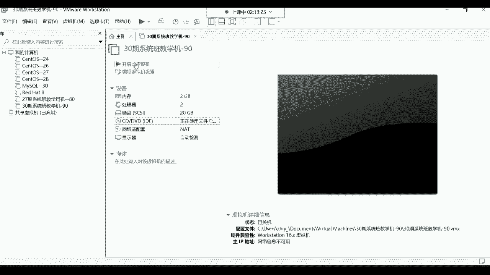

等一下哈，然后来到这个界面呢，这是一个菜单啊，菜单界面什么叫菜单啊，就可以让你选的，那这时候呢啊你就选择，那先把鼠标点到虚拟机里边哈，看我这个鼠标现在外面点进去，点进去就看不到了是吧，看不到以后呢。

用键盘上下键看到了吗，哎我这个光标当前在哪儿呢，哪儿就显示白色，看到了吗，哎来回可以看看得到是吧，OK啊选择第一行叫in store sto7，就是直接安装这个STOS7系统。

那第二行呢啊叫测试我的这个系统，并且在安装它要不要测试呢，不用测试啊，他想测试你的那个什么呢，镜像文件啊，看看是否这个完整，那不用啊，直接in到S4S7，然后开个回车就行了，这时候就开始安装。

OK然后你们注意看哈，现在在我这个虚拟机这个黑界面上边，下边有一小部分黄色的提示，这个提示它提示什么呢，他说你按CTRL加alt可释放鼠标，什么意思啊，就我现在这个鼠标没有载，我的真机是在虚拟机里面的。

能理解吧，所以呢你想用你的鼠标的话，你得把这个鼠标从虚拟机里面给它干嘛呢，释放出来，所以这时候按CTRL加alt键啊，你看现在我这个鼠标就回来了，看到了吗，你再点进去啊，又跑到虚拟机里面了。

那这时候你再Ctrl alt诶，又出来了，能理解了吧，这时候是在真机点进去，就在虚拟机里面啊，Ctrl alt啊，下面这个提示是吧，然后下面这一步呢，什么我已完成安装这个你先不用管哈，叉掉就行。

擦掉就行，那就是一个提示而已，不影响哈一个提示，然后来到这个界面呢，我们要选择一些什么呢啊就是语言，首先呢就是叫安装界面的语言，我们安装系统呢会这个做一些一系列的操作啊。

所以这时候啊你的安装界面选择语言，那这时候呢默认是英文的哈，那这个这无所谓，你可以选择中文啊，下边哈下拉看到这里叫中文安装界面嘛，无所谓，右边简体中文默认就行了是吧，然后继续。

OK那就是我们刚刚选择中文以后呢，这个界面就是以中文的形式给我们展现了啊，这样呢你看起来不能看得懂吗，是吧啊，然后在这个界面我们需要做哪些事情呢，呃第一呢，就是把我们当前的这个系统的日期和时间呢啊。

给他啊调整一下啊，调整到我们一个当前的正确的时间点击，那现在日期时间就调整好了，然后接着键盘汉语啊，这就不用管了，默认就行，语言支持简体中文，OK然后下边啊这也不用管哈，安装戒指这个位置我们要点进去。

哎呀等会啊，这不用管哈，安装戒指本地安装啊，这确实是从本地的那个镜像文件安装的，所以这边也不用动不用动，然后软件选择这边点进去，这里边呢，你看我们可以选择这个系统是最小化的安装啊。

还是呃带一些这个比如说啊丰富的功能啊，啊一般对于企业来讲，企业喜欢最小安装，看了吗，告诉你了，如果是最小安装，它就给你带一些最基本的功能，但有的时候你说哎呀，我们你说我们第一次安装这个系统是吧。

可能说如果最好安装呢，我们对这个系统不熟悉，后期遇到一些比如说需求的时候，你发现这个有些工具啊，这个系统里面没有，那怎么办呢，如果没有的话呢，我们可以选择这个啊叫做，呃呃当然选择一个带叫带GI的服务器。

这个带GY的服务器呢，你看右边这个可以给你带的功能就有些多了，是不是有哪些啊啊你看包括系统的管理工具啊，还有一些开发工具，你看基本的开发环境看了吧啊，安全工具啊等等等等。

然后这种东西啊啊什么java平台这些啊，支持java的，包括一些什么FTP啊，这些文件共享服务，电子邮件啊，DN这些东西，哎呦如果你需要这些的话，他也会帮你安装上，但你得先勾选上，注意哈，但这些东西呢。

我们通常来讲我们不需要去在这个位置去选择，因为这东西后期我们会随着不断的学习的，自己去手动去安装，能理解吧，所以这边大家还不用管你干嘛呢啊，我们在这哈哈选择最基本的系统管理工具，但是我还要给大家说一下。

这个带GI的服务器是什么呀，带GUI的服务器是一个用于操作网络，基础设施的一个服务，就主要是它带图形界面啊，下面一样，你看gloom，Gloom k d e，他们都是给你带一个啊。

非常直观友好的桌面环境，这种哈看到了什么，跟norm也一样啊，非常直观的友好的桌面环境，那对于我们来讲，咱们最小安装吧，好吧，兄弟们，嗯咱们就最小安装吧，然后自带一些系统管理工具。

后期呢咱们随着不断的学习，比如这个系统里面缺少什么东西，咱们自己再去安是吧，唉因为我们不需要图形啊，啊不需要，那就最小安装啊，所以选择完成，因为在企业里面都是最小安装啊，选择完成。

OK然后带一些最基本的工具就可以了，OK因为往期的话呢，我都是会带领大家安装一个，什么图形化界面的啊，其实我觉得没有必要，因为毕竟在企业里面，我们不需要这种图形，OK然后下边呢看安装位置啊。

这位置得点进去啊，安装位置是什么呢，就是你的这个系统安装在虚拟机里的哪块硬盘，我们虚拟机里面不就一块硬盘吗，20个G的是吧，双击一下出现一个对勾就可以了哈，好那这个硬盘分区的话。

那就先让它自动分区就可以了，因为我们现在并不会分区啊，这边是让它自动分，然后接下来完成，而下边的这个是叫做内核的崩溃转储机制啊，这它默认已经开启了，这个你就不用管了，嗯然后这这也不用管哈。

这都是那一些这个对于系统的一些，这个使用协议了哈，你就不用管，完成把下边网络和主机点进去，网络和主机这里边看哈，首先呢这里边可以给你这个机器取个名，看到了主机名默认叫local host是吧，注意哈。

这主机名不是左边这个左边这叫虚拟机的名字，知道吧，这个是我们安装系统以后，进到系统里面的那个主机名啊，所以这个默认就叫这个名字，你先不用管啊，后期通过命令的去改它就可以了啊，到玩命令的有点紧张了。

有啥可紧张的呀，好然后接下来呢我们这个网络要配置，注意这是网卡看了吗，这个以太网ENS32，这是我们虚拟里的一块网卡，那个网卡呢没有IP地址，那我们得我们得给他配个IP，所以呢选择配置在这哈配置好。

然后接下来呢在这哈啊，以太网是吧，然后这时候选择IPV4设置啊，我要给他配个IPV4的地址，然后接下来呢方法呢下拉选择手动啊，手动拍P，然后ADD啊添加一个地址，那我们用的地址是192。168。0。

这个网段的，然后呢最后一位咱们就用什么呢，用这个九零啊，虚拟机我在命名的时候是不是让他叫九零啊，那这时候那我就把他IP也给他设置成九零，为什么呀，因为你看机器多的时候，你比如我想连这个机器。

如果你不知道这个机器的IP的话，你得先开机啊，然后呢用这个虚拟机登录，然后才能看到他的IP地址，然后再去远程连接，这就有些麻烦了，所以你还不如这些干嘛呢，唉在创建虚拟机的时候，就直接把他的IP想好是吧。

然后放到虚拟机的名字后边以后呢，你看一看到这个机器，你就知道啊，我这个机器它的IP地址是什么呢，哎192。168。0。90啊，反正我们所有的地址用的都是这个，192这个网段的啊。

具体用剩下就看最后一位了啊，九零那以后就是一一看到我就知道他IP是多少，K好，那下边的子网掩码，这个点一下子网掩码24位啊，然后网关我们用这个哈，192。168点点0。254啊，这个IP地址。

子网掩码网关之类的，这个应该呃都了解吗，有没有一点网络知识都没有的呀，啊一点网络基础都没有的，给我刷个一上来，啊一点网络基础都没有的啊，你们这属于一点网络基础都没有是吧，比如什么IP地址，IP地址啊。

啊子网掩码网关，这到底是干什么的，可能也不是很清楚是吧，好没关系哈，这个呢我也是嗯对，就先跟着我配哈，先跟着我配，这个呢我也考虑到了是吧，你们那个这种确实是网络也不太懂的。

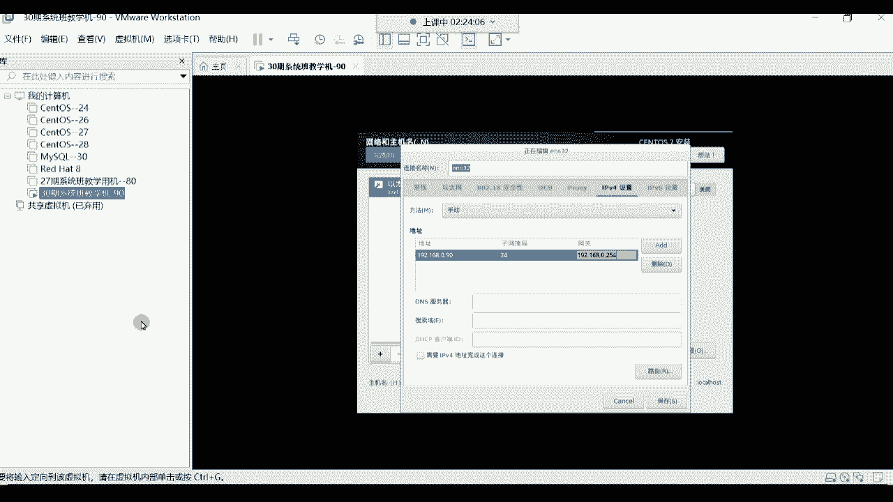

那怎么办呢，VIP大礼包哈，说一下，没关系哈，这种东西没事看一看就可以了，不需要网络，不需要掌握太多，只需要把IP地址是，还有一些这个OSI7层模型了解就可以了，看这个VIP大礼包里边啊，看了吗。

点进去，你不用换算IP的，现在不用你换算，你换算它干嘛呀，这里面有有一个什么呢，有一个叫做，哎呀哎我我给你们哦，我知道了哈，然后我得跟你们说一下，如果你们没有没有网络基础的呢，学习工具命令软件大礼包啊。

这软件大礼包用不上了哈，为什么呢，软件大礼包大多数我们都是在线下载的啊，所以没关系，稍后我再删吧。

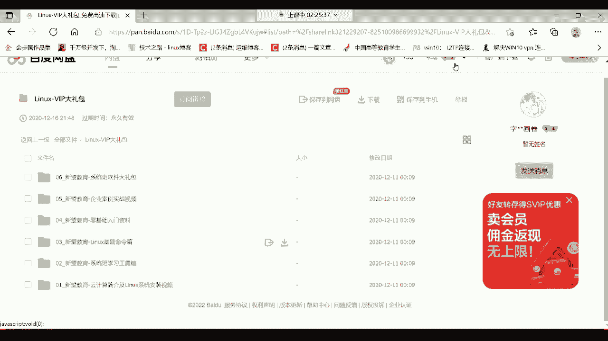

如果说没有网络基础的，到时候我这样吧哈，我发一个网络的视频啊，考完C就去干IE了，呵呵别扇是吧，我们整个学习阶段，我们用到的所有软件包都是可以在线下载啊。

啊讲的课每天都会上传哈。

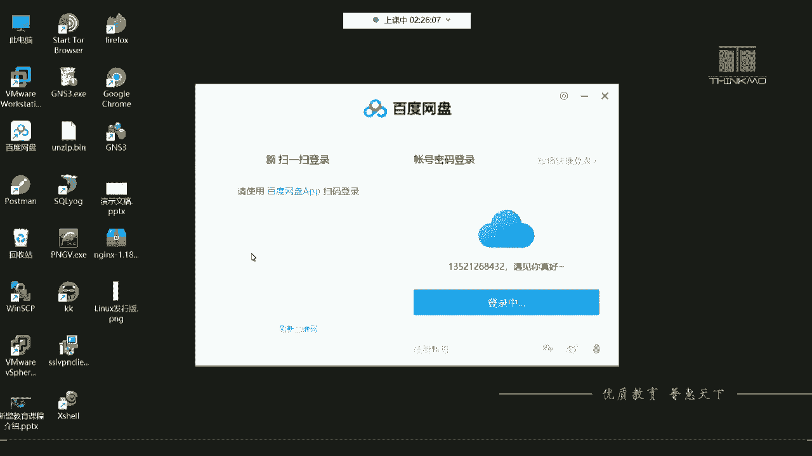

看看讲完就上传，包括我们讲课用到的课件笔记啊，以及相关的所有东西啊。

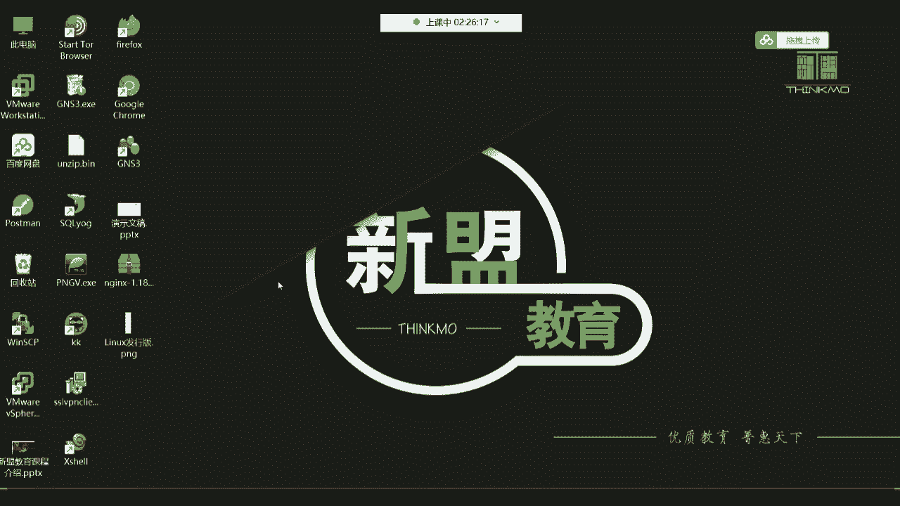

只要课上用到的啊，都会上传，大礼包里边这里边有一个什么呢，这里边有一个，华为的啊HCA的一个什么呢，一个网络课程哈，这网络课程里边就有什么呢，啊就有这个IP地址啊，网络相关的内容去做的一个详细讲解。

我给你们找找哈，这里边啊看到了吗，这第几节呢，你看第五节课网络层IP地址分类看了吗，唉这就是给你讲IP地址了，这里边讲IP地址，子网掩码，看到了吗，哎等等等等的，然后你们看到哪儿呢。

啊还有什么NT看到了吗，哎如果你们有时间的话呢，你们就全都看看吧，OK吧啊有时间去多看看，没有时间的可以先看前前边看到哪儿呢，看到这个网络模型啊，一直看到这个这个啊，这哈一直一啊一直看到这儿吧。

哈一直看到第十节课，只需要看，不需要跟着练，OK吧，网络呢你只需要了解就行啊，你别到时候咱们学运维，你连个IP地址啊你都不知道怎么配，是不是啊，连个网网络模型O这个OSI模型你都不知道。

连个TCP协议你都不知道，那你这不行，能理解吧啊所以可以看到第十集啊，看到第十节课哈，这我都跟你们说说清楚了是吧啊，到时候我会把这个网络的课程，放到我们这个公告里面，华为网络录屏课啊，永久有效创建链接。

复制关闭啊，放到了群公告里面，37的群公告，IE还要报班吗，你要学IE，你如果要学IE的话，那你就得再重新报IE的啊，这是华为啊，网络初级看录屏课，放到这哈，到时候呢啊自己去看前十节哈，发布新公告。

补补一补网络的基础就可以了，OK吧好行了，那放进去了吧。

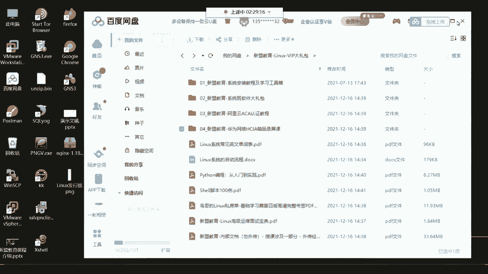

嗯那接下来我们再回过头来再说啊。

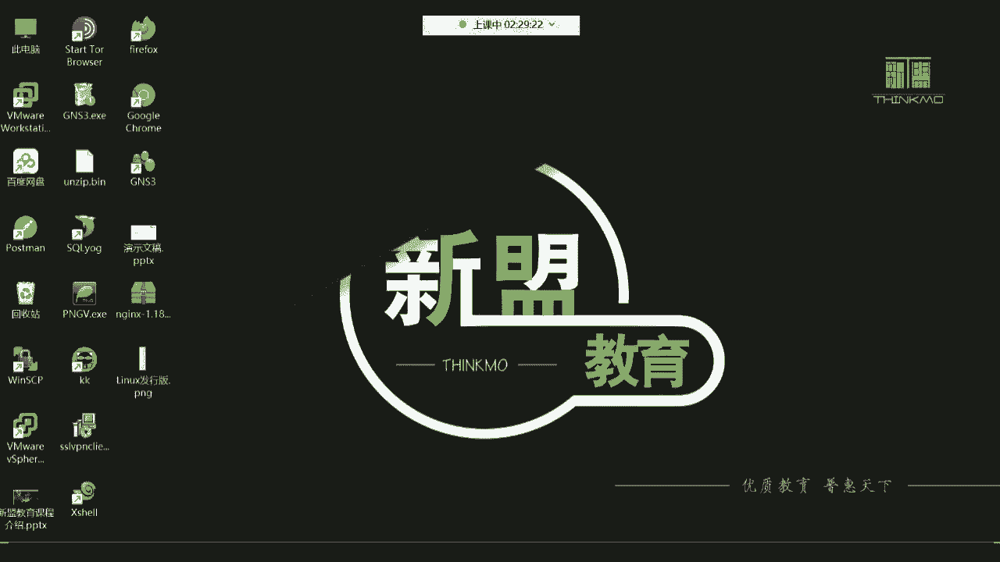

IP地址网关什么的都配好了是吧啊，下边DNS呢咱也配一个，配这个多少呢，233。5。5。5啊，这个谷歌的是二啊，不是这个阿里的是233还是二三来着，我忘了哈，你们知道这个阿里的这个DNS。

到底是223还是233来着，233是吧，对那就233。5。5。5哈行，然后接着它保存就可以了，保存然后选择开启看到吗，那这时候就可以看到什么呢，我们IP地址192。168。0。90是吧，子网掩码路由啊。

然后DS然后完成完成啊，差不多吧，什么一四之类的，然后选择开始安装，这时候开始安装哈，那这时候他就开始帮我们安装系统了，然后这时候呢，我们呃这还有一个叫root密码未设置。

这个时候我们要把这个密码给它设置一下，这个密码主要是干嘛呢，就后期我们在登录系统的时候，我们登录系统啊，是得有一个账号去登录的，然后这个系统呢给我们提供了一个账号叫root啊，这是系统里的超级管理员。

对于他呢我们后期会详细介绍啊，今天呢暂时也啊，现在也暂时先不过多去说他哈，你就先给他设置个密码就行，密码呢不要搞得太复杂啊，但是也不要搞得太简单啊，完反正这种东西就是你自己用的，是不是啊。

你自己记得住就可以了啊，一是吧，那咱们就来个一对好一哎一好，然后完成两下哈，两下完成就可以了，然后要不要创建一个用户呢，也可以点一下创建个用户，比如说我就让他叫test test用户哈哈。

然后呢给他设置个密码，密码也是一啊，一完成完成，嗯得创建一个普通用户哈，这是呃系统呢他的要求的，啊223是吧啊不是233吧，哈哈没事儿吧，没事儿啊，他现在都已经安装了，改不了了哈，改也改不了了。

到时候我们只能跑到系统里边啊，打开它的那个配置文件啊，去改，哎呀这就有些麻烦了，那你们在配的时候注意哈啊你们那个DNS啊，我这位置D，你这DS要改成二三，千万别跟着我一样配上233了哈，二三行。

那这时候他总共会安装多少个包呢，看总共会安装314个包啊，能不创建用户，不创建不行，他得需要一个普通用户啊，所以你还得创建一个总共安装200啊。

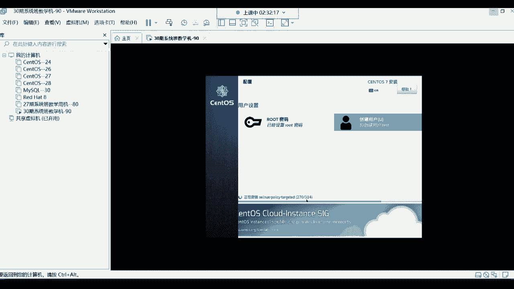

300多个包，现在已经安装270个了，然后这时候先让它安装上吧，先让它装上哈，啊装的话呢，我看现在我们想多久了啊，一个小时了是吧，那咱歇歇一下吧，是不是歇一下哈，嗯卸下卸一下的话，那我们一会儿回来再来。

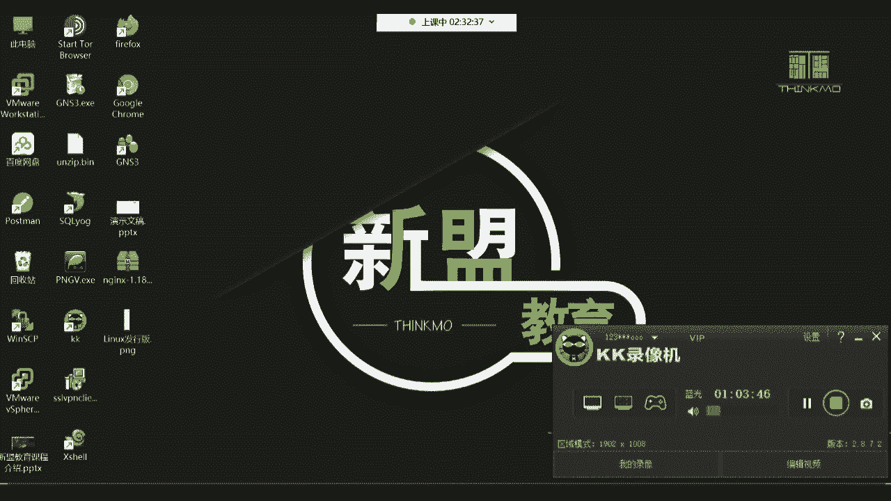

再来给大家讲讲前面这些东西啊，就是嗯对于这个LINUX啊。

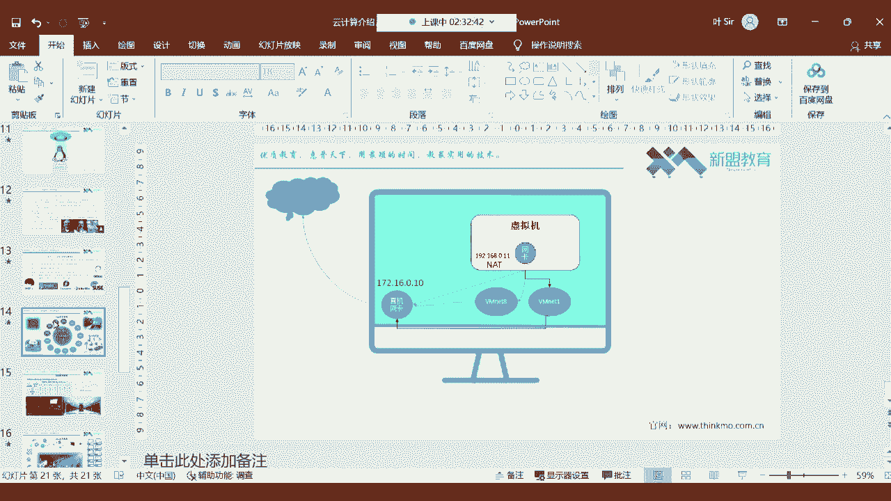

他这个应用的领域是吧，我们还并没有说的，是不是嗯一会儿再说好吧。

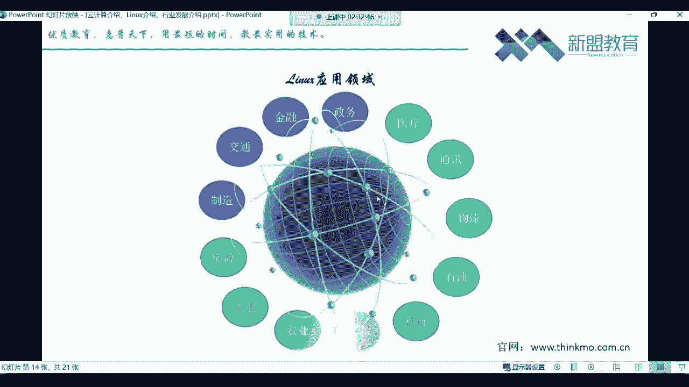

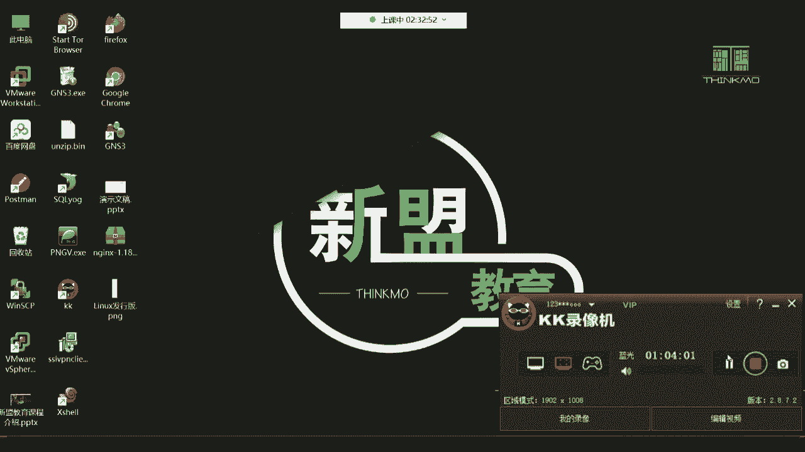