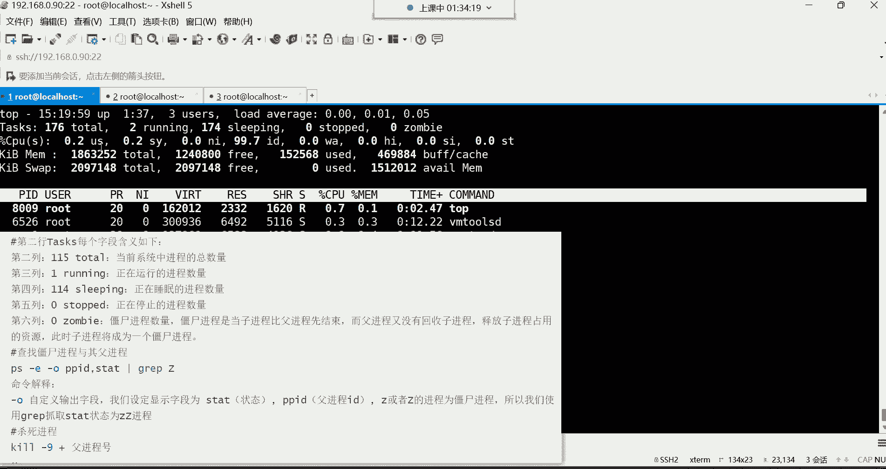

# 【小白入门必备】Linux运维进阶RHCSA+RHCE最全培训教程视频合集 - P30：红帽RHCSA-30.进程前后台调度、杀死进程、用户登录分析 - 洋洋得IE - BV1nN4y1X7Go

喂喂喂好，现在还有吗，现在还有这种电流的声音吗，嗯好没好点，感觉好了是吧好，那我们继续哈，我们来说一说啊，这个位置，现在只有一个进程在运行是吧，谁啊，谁在运行啊，就top，因为我们说是不是可以看。

通过这个位置看它的一个当前的状态呀，R不就是running在运行吗，所以只有top命令这个进程在运行着，其他的都属于休眠状态，然后那我们再来说，有多少进程是属于一个休眠的，那174个。

然后下边多少个进程在停止零个哎，这个位置看到吗，这就是僵尸进程，这个哈这就是僵尸进程，然后现在有几个呢，一个都没有，就现在没有这种僵尸进程，其实你也可以通过这个什么呢。

通过这个top命令直接就看那个位置就可以了，你说这样看，是不是感觉比我们那个通过PS那个命令，直接去那种一个一个翻要痛快的多呀，没错吧，所以你到时候想判断，你系统里面到底有没有僵尸进程。

是不是可以直接从这看了呀，看数字就行了，因为他也是直接帮我们就从这个位置去看的，如果有的话，他就直接把数给你显示过来了，一旦找到僵尸，一旦发现诶这里边有僵尸进程了，怎么办呢，把这个命令拿过去过滤一些。

过滤一遍，过滤完之后怎么办，直接Q掉它的附近乘号附近，让它id就可以了，这怎么去查找这个僵尸进城怎么杀，中僵尸进城，啊这是对于这个进程，的每一行的一个每一列的讲解。

主要是每一列的讲解哈，那现在是不是也知道，这每一列代表什么意思了呀，当前系统的总进程的数量，正在运行的进程的数量，然后正在休眠的进程的数量，正在停止的进程数量，僵尸进程数量好，然后这个是CPU的嗯。

对于这个CPU来讲呢。

我们其实就没有那么太多需要关注的了，在第三行里边呢。

这个拿过来给大家说一下，对对于这个CPU的信息，哈哈这个第一列，第一列它代表是用户进程占用的CPU百分比，就是我们用户自己在系统里边起的那些进程，占的CPU它的一个百分比，然后第二列SY。

这其实就是系统了，叫系统进程占用的CPU的一个百分比，系统自己起的进程，这样的CPU，因为其实大多数也都是系统自己的进程啊，我们也没我们几乎也没有怎么起进程，就起个top，好然后第三列，第三列。

改变过优先级的用户进程占用的CP百分比，因为这个进程啊确实可以改变优先级，我跟你讲哈，这就是进程的优先级，怎么为了这个他这个优先级就是进程，哪个进程先启动哪个进程后启动啊，可以改变它的优先级。

但这个呢怎么改呢，咱们先咱们这个今天也先甭管它，你就知道一般我们不用改哈，一般不用改系统的进程，你需要去改吗，你不需要去改呃，一般改进程也都是开发人家开发，在开发程序的时候。

这个程序他应该这个基于哪一个进程之后启动，或者说在哪个进程之前启动而开发的事儿，一般运维啊，这活干不了，能理解吧，因为毕竟这程序不是你开发的，所以这这这活儿你一般是改变不了的，但你就知道如果有的话。

那在这位置呢他还给你显示，总之就这个改变过优先级的这个进程，占用CPU的一个数量数量一个，当然它也是百分比哈，那在这行里面，我们最关注的就是这个不要关注这个第几列呢，1234，第四列。

这第四列第五列了吧啊，这第五列123啊，第五列哈，当然这也是哈，第五列，第五列的话呢，这代表诶是好看一下啊，是这儿哈，这小字儿啊来看这哈，第五列就这个哈，后面有个ID这个关键字的。

叫空闲的CPUM比这是需要重点关注一下的，嗯为什么要重点关注这个呢，因为它叫空闲的呀，如果这个值你比如说现在空闲多少呢，比如现在空闲10%，如果这个值如果这个值啊是十的话，那代表什么呢。

代表这CPU太忙了，因为他这个位置如果说空闲的越多的话，就证明你的CPU他没忙，能理解吧，你看我们这是不是都已经是达到什么了，就99。7了，就证明我这CPU非常的鲜，非常的咸哈，那99。8了。

几乎CPU没有任何的工作量可言了，所以在生产环境的这个位置，肯定值会相对低一些，因为CPU一直在处理数据嘛，所以这点这些值就比较低一些的，但是你重点关注就是它别太低，太低的话就证明CPU太忙了。

好这是我们需要关注的，那后边这些呢就没有什么太多可关注的了，像什么等待输入输出的硬中断，软中断虚拟时间，这个没有什么太多可说的哈，这种东西，而下边内存的swap分区的这种东西呢。

都是那个低于多少就能换服务器了，不是他不是低于多少，是他这个低的话，你得看你服务器到底是因为什么原因，CPU才这么忙，你想想，如果你服务器，如果真的是这个你们服务器接收的用户，访问量非常大的话。

那可能说你就得增加服务器了，不能换服务器，可能是确实放量，当前已经现有的服务器无法满足了啊，然后我们再来说下面那个，MEM是内存跟swap交换分区这两个数据，但看内存的一般从而看不好看。

因为你从那看的话，你看哎呦，他以KB给你显示，这就非常非常的让人头疼，你得自己去换算一下，这KB我们自己换算，非常头疼哈，那我们还不如直接干嘛呀，是不是自己福瑞杠H自己敲个命令，自己看还不好吗是吧。

他直接就以这种赵记的方式给我显示出来，福瑞啊，福瑞DF是看看磁盘的，所以这样看哈，看总内存，已使用的内存，还剩余内存，这样看多好啊是吧，所以看内存就没有必要从这儿看了哈，所以在这里面大家有两行。

有说最下面这两行呢你不需要去关注它，不需要关注哈，而我们所需要关注的是几行呢啊，前三行，前三行里边，第一行可以说是没有那些不重要的数据，第一行没有不重要的数据哈，第二行也没有不重要的数据，第三行。

重点关注的是这个带有id关键字的这一列，如果这个值太低，就证明你的服务器太忙了，CPU太忙了，你得看看到底是由于什么原因，是不是哪个进程太消耗你的CPU了，啊所以这是不是说清楚了top命令啊。

每一列它分别代表什么意思啊，做一个小做一个小的总结哈，当前系统的本地时间，当前系统已经运行的时间，多少个终端在登录CPU一五十五的平均负载量，然后当前系统的总共的进程的数量，正在运行的进程数量。

正在休眠的进程数量，正在停止的进程数量，僵尸进程数量，然后以及我的CPU的空闲时间百分比啊，空闲的百分比好了，那下边这个就没有什么太多可介绍了，这个是那个PS那条命令，AUX显示出来的就是下面这些信息。

这就不介绍了哈，这top命令是不是，我们后期就可以通过top，去分析系统的一些状态了呀。

然后Q就是退出Q就退出了哈，然后对top命令呢，这里边我给大家说说这个，首先呢它杠D是指定刷新秒数的。

默认是三秒刷新一次，这个没有必要去指的，就是我们在使用top命令的时候，你发现他为什么一直在动呢，是因为上面那个时间你发现现在是十十，你看现在变成13了，一会儿呢16哎，三秒刷新一次哈，三秒刷新一次啊。

这指导一下。

那没有必要去改变它啊，就默认就三秒就可以啊，这是top命令嗯，其他的话呢在这里面还可以给大家说说，这个当然杠H叫做获取交互的帮助。

那一般也很少用，在这里边拿过来，你输入个H呢，可以获取我当前可以使用哪些命令，在这个里边，而常用的有一个大，有一个大M。

大M跟这个大P我看看能不能在那边找得到哈。

嗯大P往下翻一翻哈，嗯非常多哈，你看这个选项看到了吗，大M，算了我就不找了哈，因为确实是嗯，就不找了就不找了哈，然后我给你们说一下哈，大M可以帮我们按内存去排序。

这两个选项拿过来给大家说一下。

就后期啊你可能会发现你这个服务器，比如说他比较忙，但忙的话，你也不知道是哪个进程在占用我的这个CPU，或者占用我的内存，你这儿就可以直接用动态的方式去看一看，所以它这里边呢我们就可以这样去排序。

大写的P按CPU的一个使用资源去排序，我输入大写的P的时候，就是他会把占用CPU最高的那个进程，给你排在第一位，哪个进程占用CPU最高，他就给你排在前边了，这样你就可以知道，如果你发现诶我CPU这么忙。

但是到底是哪个进程消耗我的CPU的资源呢，你就可以去排序看一看，那如果你发现这进程它并没有一些实际的作用，但是呢还占用我CPU资源，那可能就有问题了，你就得干嘛给他干掉，能理解吧啊这是按照CPU去排序。

你看他永远都是把CPU消耗最多的排在前面了，那如果说我想看哪个进程占用内存最多呢，大M按照内存去排序，输入DM啊，这时候他就会把那这样内存最高的这个进程，给你排在第一位了，这就不是按照CPU去排了哈。

看了吗啊，这按照内存去拍，所以就这两个是最常用的这两个，所以大家记的话就记这个，所以你就可以通过这种方式去分析，你当前服务器的一个健康状态，那你说我们当前这服务器的健康吗，我们当前服务器太健康了。

他可以说没有任何的负载可言呢是吧，好Q就退出了，就是top命令应该都讲清楚了吧。

每一行每一列是不是都给大家解释清楚了呀，那接下来有一个叫检索进程呃，检索进程呢叫p rap，p rip是通过匹配进程的名字，我们去检索啊，这个检索的话呢。

这个检索我们前面这个PSOS也可以，你没看见输入M你看不到，输入不显示，我输入大批，你也看不到，你看不到哈，但是它确实给你排序的PSAUX，比如我想干嘛呢，我想直接过滤某个进程，比如SHD的，那不行啊。

得结合管道加GRA，哎，这样就可以了，这时候呢他就把我们列出来，我当前系统里面有多少个SSHD的一个进程，然后每个进程的一个id号看到了吗，然后p rap也可以，p rap跟上SSH d也可以看到吗。

但是PRAP呢他在帮我们过滤的时候，你发现他信息好像没有PSAUS过滤的详细，没错吧啊，所以说你想简洁的过滤，你可以用p rap屁股在爬，然后后边呢再可以结合一些选项，哪些选项呢。

比如说这些选项常用的选项在这。

第一个选项杠L输出进程名与pad，如果我们直接这样过滤的话，你发现它只有ID号，没有进程名，所以这时候你可以这样再加一个杠L，选项杠L哎，这时候他就帮我们列出来，就是这个进程的对应的id号是多少。

因为这个id号同一个进程名，他id是不一样的，IDB样哈名字都是同一个进程，但是呢这一个进程又很多id号，啊杠大U叫检索指定用户的进程啊，这样呢也可以哈，我们可以这样就杠大U跟上。

比如跟上test这个用户有test用户吗，TE用户没有登录系统是吧，test呢我们用test登录一下，我直接竖杠吧，切换到test用户，那太子用户我一旦切换了之后，我再过滤过滤出来了，看到吗。

但是这时候我还得加一个L选项，但是加了显示，你发这怎么不认识了吗，说什么呀，叫无效的用户名吗，不是哈L啊，有个位置要求，这样就好了，看到了吗，所以他这里边就是什么，就是那个确实是会出现这种情况。

这种情况就是选项位置哈，要有一个严格的要求，选项位置哈，能力了吧，OK然后这样就过滤出来这个test的用户，他在系统里面起了哪些进程了，其实对于我们来讲啊，我们这条命令呢是可选的哈，你不一定非得记得住。

你并不一定非要记这条命令哈，因为毕竟这条命令的用的还并不是并不是很多，显示信息呢也并不是很很详细啊，并不是很详细，所以一般呢看情况吧，毕竟看进程信息有很多种方法，就是看你想看详细的，还是想看一些简洁的。

想看简洁的就p rap就可以了，然后还有一个杠T选项，这杠体选项叫检索指定终端的进程，这时候我们当然我们说这个每个用户都性，是不是都有一个终端呢啊，那这时候你直接来个T这个终端呢。

你得知道这个终端怎么看哈，因为这个终端像这种情况下，你看是终端号PTS代表是远程终端，一呢就代表是第二个终端，因为它是是这样排的，012看到吗，0120代表第一个一代表第二个，二代表第三个。

所以你比如说，我现在我想看这个终端起了哪些进程，拿过来回车起来下起了一个BT啊，我想看这个第一个终端，那换成零啊，也起了一个外置，那我想看看第几个呢，第二个终端一是二啊，起了起了三个。

这是batch又竖了一下，然后又来1B，这应该能看明白了吧，现在第一个batch是谁呢，是root的root登录系统分配了一个batch，然后root又素谁呢，又输了这个太字用户。

然后pad用户呢又有一个batch，所以这你看到的就是就是这样子，看某个终端的进程，如果这种方式你看的话，你用PS traps tra看的话，P你这样看非常清晰，看到了吧，这样看你就可以看它的进程数了。

因为这同一个SSH进程，是不是他给现在起了三个紫禁城啊，这三个紫禁城就是给我们提供了三个终端，三个终端哈，然后现在这每个终端下边都起了哪些进程，第一个终端看到吗，第一个终端给分配了一个SSH。

然后呢用户呢在这个终端敲一个PST命令，那第二终端呢啥也没干，就只占一个BH这个进程了，第三只要下面那个呢，你发现在拜师这个进程里边，又执行了一个宿命令，然后又切换到了另外一个batch环境。

他就这样看的，就这样看的哈哈，所以这样你可以通过PS脆来看到，会它这个结构看的会更加清晰一些，这是p rap，还有一个杠大X，所以这条命令啊不是你必须要掌握的哈，不是你必须要掌握的杠杠大S是叫精确匹配。

因为这条命令不是精确匹配哈，我给你们来演示一下p rap，比如我直接S回车可不可以呢，再加一个杠哈，可以看到吗，精确吗，不精确，因为它是模糊匹配，模糊匹配，就是只要包含包含SH这两个字母的进程。

就都给过滤出来了，但是我想精确匹配，就是这个名字就得叫SS的什么，前面也不能有多余的字符，后面也不能有多余的字符X就可以了，有吗，没有啊，这叫精确匹配，也必须必须得叫这个名字，那就没有。

但如果你说我想精确，比如叫SHD的呢。

这就有看到了吗，这就是这条命令哈，所以这条命令呢不一定非得记得住，只需要知道一下就行，信息呢不是很详细哈，不是很详细，然后下面还有一个叫进程的前后台调度，这个进程的前后台调度啊，嗯主要是让大家了解一下。

这个进程分为前台跟后台，这个我们先说一下，这个我们怎么把一个进程放后台吧，用and符将进程放后台。

有一条命令啊，前面学了，但是他一直没怎么用，叫sleep，sleep命令呢，它是一个休眠的命令，就是唯一执行，比如说五回车，它会让我当前终端休眠五秒钟，看到了吗，你们数一下哈，那我再死再争一遍哈。

死了泡芙，那我当前终端是不是休眠五，就在休眠五秒钟呢，那像这种呢就是叫前台进程，这个就是他命令一执行，它会占我的前台终端，我的前台终端就被他给占用了，我就不能用了，所以有的时候呢这个进程我希望它运行。

但是我不希望它占我的前台终端，我拿sleep来给大家演示，大家感受一下，感受一下啊，这时候呢我就可以通过这个and的符文，你看我这样sleep，然后这样五后边呢跟上一个and符就行了，回车。

这样你发现它并没有占我的前台终端吧，我的终端是不是没有被它占用了，我可以正常敲命令，那进程有没有运行呢，有他在后台运行的，但由于是五秒钟，估计已经是运行结束了，我们来长点哈，Sleep。

我这样我5M5分钟，让它在后台运行5分钟回车，那这时候他首先没有占我的前台终端，能理解吧，没有占用前台终端哈，那这时候我怎么看呢，叫ob js当L啊，那就是反了GOBS啊，这样哈哈好了吗。

这条命令呢可以帮我们查看，我们用户自己放在后台运行的这些进程，注意是我们用户自己哈放在后台运行的，那这时候大家可以看到，后台是不是有个sleep啊啊他的id号，这是在后台的一个编号哈，一。

然后这时候呢这是他的id号，进程的id号，然后状态是运行中运行多久呢，这是你在让它运行的时候指定的5分钟，他现在会在后台一直运行5分钟，但如果这个我不给他放在后台的话，那你我告诉你。

他就会一直在前台占用我的终端5分钟。

啊这是给它放在后台运行，那放在后台的运行啊，放在后台运行的进程，我们怎么看呢，这样看啊，Job s，然后查看后台的进程列表，这样就列出来了，当然我们还可以给它做一个调度，怎么调度呢。

就是将后台进程给他调度到前台，让他继续在前台运行。

叫FGFG，这时候跟上它的编号就可以了，你看它在后台的编号是一是吧，我就FG1回撤，他现在又在前台运行了，但是他只要在前台运行，它是不是就占我前台终端了啊，那我这中端就用不了了，看到了吗。

被他占用了哈啊，所以这就是前后台的调度，想结束怎么结束呢，CTRLCCTRLC可以结束在前台运行的这个进程，呃敲命令的时候休眠时间是不是暂停了，敲命令的时候休眠时间，是不是不是。

他他这个进程就会让我当前的终端去休眠，好这次做一个前做，做一个前后台的调度，是不是怎么把这个进程放在后台，怎么敲呢，是不是sleep，还有变成一个时间，比如说4M4M放到后台。

你说呢这种东西我什么时候能用得到啊，什么什么时候能用得到呢，比如我现在我想拼啊，我现在想想测试一下主机，先拼其他的机器的一个这个一个连通性，这拼命令它有个特点啊，比如说拼百度3W点，百度点com。

你看他是不是一直占我的前台终端呢，拼通了他也占用，拼不通他也占用，能理解吧，那一般拼呢我一般不在命令行拼，我一般会自己后期写一个脚本，我们通过脚本呢去测试，比如测试我当前的整个网段从多少呢。

从一一直到254，整个网段的IP，你把这个拼命令写到脚本里面了，然后通过脚本呢去自动化去拼这所有的地址，但是你即便说放到脚本里面了，他有个问题，什么问题呢，就是拼每台机器的时候。

它都会把拼的那个结果显示在我的屏幕上面，那我当前这个终端也用不了，所以怎么办呢，我就可以让他在后台默默的去过去，测试这些主机的连通性别，占我的前台终端，你在后台默默的拼，拼完以后的话呢。

哎我自己去看结果就行了，能理解吧，对对，这种东西怎么给它放在后台运行，这后边才能够给大家实际的演示，所以现在你先知道我们这个按钮符，它主要应用场景是什么，那放到后台是不是安符啊。

那如果前面如果是通过脚本的话，那你前面去写脚本的名字，如果是命令的话呢，我们一般就sleep，sleep3M就3分钟放到后台了，然后GOBS杠L看一下，那这个时候他在后台运行，我想给它调动到前台。

那就FG后面跟着它的编号，FG跟编号标准一好，他现在又在前台了，那现在在前台不行，我又希望它在后台运行，CTRLZ按CTRL再按Z，那首先呢先把这个进程给它停掉，停掉以后呢，我这时候可以叫做BGBG。

后面跟着他的编号回车，他现在又在后台运行了，这种BG就是再给他激活被挂起的进程。

就是我们CTRLZ组合的时候是把它挂起了，就暂停的状态了，那挂起以后呢，我诱饵我诱饵让它运行了，好FG跟进程的在后台的挂起的编号就可以了，这样就是怎么做一个进程的前后台的调度，主要就是按的符用的最多。

他用的最多哈，然后这个查看下面这些用的就并不是很多了，and的符，这个大家一定要记住哈，这是前后台的一个调度，然后那接下来呢怎么杀进程呢，杀进程，比如说有些进程想给它结束掉。

想给他自己呢不结束，我想手动给它结束掉，那这时候怎么办呢，我来给大家演示一下呃，我们现在多运行几个进程，我们看看后台现在有一个是吧，那再来几个哈，Sleep，来一个4M的，放到后台。

来一个5M的放到后台，来一个6M的运行6分钟，运行7分钟，好多少个了，好几个了是吧，看一下现在我这后台啊，你看叫sleep，这个进程有七个五个哈，12345有五个好，那有五个的话呢，我现在我想给他杀掉。

因为它在后台运行，我们没有办法正常结束了，现在你已经它在后台运行，你现在正常在命令行里面，你已经控制不了它了。

控制不了了，我想给它结束掉，怎么办呢，那下面沙子进城的命令呢。

来哈常用的第一个呢叫Q。

这个杀死竞争方式，首先CTRL加C这个组合键它也可以，但是它的特点是什么呢，就结束当前的命令程序，当前的就比如我现在拼拼调过来哈，拼，这个拼音它是不是在我的当前终端在运行啊，我想给它结束掉好。

CTRLC好就直接结束了，但是这个后台如果一旦跑到后，如果这进程一旦跑到后台运行的话，我还想给他结束，CTRLC是无能为力的，所以一般我们就得这样用，专门去可以杀死后台进程的这个命令。

就比如说Q就可以了，那Q的话呢它是根据pad去杀这个进程，是不是有自己的id号啊，哎他可以根据这个id号去杀，你想杀哪个进程，你就指定他的ID就行了，所以这时候比较简单啊，Q因为跟id号。

比如我要杀后台的这个叫8113的这个进程，回车嗯，没有这个进程，这个进程可能已经结束了哈，8115吧，Q8115回车没有任何提示，马上看哈，你发现是8115这个进程已终止了呀。

可以看得到是不是已经已经被我们终止了呀，那这时候你如果再看的话呢，没了那8115这个id号的进程没了，是不是被我们杀死了，那我现在要杀这个杀那个啊，8117的，8117回车，然后马上看。

没了817没了是吧，我然后再杀哈，再杀8116，然后马上看回收是不是得先终止啊，然后再把它给资源给它回收掉，这直接就给他杀了哈，你就是再看就没了，因为他需要时间，他需要时间啊，不是说马上就要杀死的。

因为什么呢，因为我们这种方法杀进程，他有信号，它是这样子的哈，杀进程的时候常用的信号，这里面有很多，给你们慢一下，慢Q这条命令，这条命令啊，它有非常多的信号，好几十个信号啊，大家看一下哈，等一下哈。

等一下嗯，开启一个功能哈，好大家来看一下哈，它这个信号啊，就是，看到了吗，什么零啊一啊，下面还有很多选项是吧，像前面，他这信号怎么看来着，我都忘了他这信号，哎呀他这信号怎么看的啊，是不是这样哈。

Q杠杠help，啊无效那就还玩啊无效，info呢哎算了吧哈哈算了吧，他有很多个信号哈。

上次我是怎么搜的来着，我给忘了，但是大家没有必要去记太多，这里边呢，我给你们已经标注了几个常用的信号了，然后这里面其中杠一这个信号要重启进程，当然一般对于对于这个一些应用的话。

应用的进程我一般会重启的哈，不是应用一般没有必要去用杠一重启它，所以这个呢我想重启一个服务，可以使用杠一，但一般比较少见一些，因为服务有自己的重启命令，杠九呢叫强制杀死进程，强杀杠15叫正常杀。

默认就是这个杠15是正常杀的。

所以我们刚刚这种杀进程的方式，没有加什么信号的话，默认就是杠15，所以我在杀的时候，大家可以能够什么的，通过一个短暂的时间，可以看到他是先把这些精神给他先终止，然后呢再给它结束掉。

但如果我们现在再给大家演示杠九的话，强杀什么时候会用到强杀呢，就是僵尸进程无法正常结束的时候要强杀，那我们现在再在后台运行几个进程嗯，还有一个是吧，我们再运行几个哈，sleep5M放到后台。

6M放到后台，8M放到后台，好这时候呢我们来看一下哈啊5678，现在是那个有四个进程是吧，那这时候我在杀哈，我们加杠九，我们加杠九哈，加杠九我杀谁呢，杀8118的那个8118，这个进程回车马上看什么呀。

直接杀死了，看到了吗，什么叫强杀啊，这打游戏还不知道什么叫强杀吗，上去直接就干死，都不会说给你任何的一个喘息的机会的，而这种普通的杀呢，普通商你比如说8137啊，对越塔是吧。

那这种8837我如果这样杀你以后，你马上看，你发现他是先终止先终止，然后你再看的话，这进程就没了，再看哈就没了，所以这种是属于什么呢，就是他会给你一个缓冲的时间。

缓冲的时间就不是说这个马上就直接给你上去，就给你干死了，不是，对于这种，这个我们说这种就属于叫优雅的杀死啊，优雅的结束掉，优雅的结束就是他会先通知这个进程啊，我要结束你了。

你呢啊把你所有的工作呢处理完毕以后呢，啊你就自己结束就可以了，但有的进程你正常结束，他结束不了，你只能上去强杀，这不多此一举吗是吗。

啊然后这是Q但是它是什么呢，它是按照PID去查，你要注意哈，他是按照一个进程的PID去查，而下面那个呢Q2Q2呢是按照进程名去杀。

唯一的区别就是Q2呢杀了为什么呢。

更加的彻底一些，怎么彻底呢，按照名字啥我们来看一下啊，现在后台有几个进程呢，有两个我再起几个，3M放到后台，4M放到后台，5M放到后台，看一下，现在，比如说我想把所有叫sleep的进程都给他杀掉。

如果你按照PAD杀，那我这进程如果有几十个怎么办呢，如果有几十个进程，你一个一个去杀吗，不现实是吧，那就Q2Q2跟上进程名就行了，哎sleep只要叫sleep的进程都给他杀掉，回车哎。

这时候就我们说是不是杀得更彻底一些，只要叫这个名字的就全杀死，这时候你再看的话呢，没了后台的进程全都被我们给杀死了，啊不杀死以后内存里面没有数据，他你怎怎么杀它，内存里面的数据都不会保留哈。

只不过就是一般这种这个区别就在于哪里呢，就是对于一些应用来讲，对于一些应用来讲哈，就是有的进程他可能说正在处理某些事情的，而这个进程如果正在处理某些事情，你正常杀的话呢。

一般他会把自己的这个工作正常给他结束掉，然后他再去自杀能力吧，哎他把自己的手里的工作尽量处理完毕，然后呢自己再去自杀，但如果强杀呢，哪怕这个进程正在手里面有工作，没关系，直接就结束掉了。

就这工作处理到什么程度，他不管这些就结束了，能列吧，这是唯一的区别，一般对于网站应用来讲，一般你想想，比如说我们拿一个网站来说，一台网站服务器，如果说呢它接收用户请求的时候，在这儿哈。

如果他在接受用户请求的时候，你就比如说那进程是不是得响应用户的请求啊，因为最终我们说这个你访问网站进程，去接受你的请求，哦这是网站的一个进程，那这个进程他在响应用户请求的时候。

比如我现在就给了一个进程发了一个信号，告诉你，我要把你结束掉，那这个进程呢它已经接收到用户的请求了，他会尽量把这个用户的请求处理完毕，给用户返回他想看的东西，然后他们自己再去结束掉，是这么回事。

但如果是强杀呢，你直接上来就直接把进程资源回收了，对用户来讲诶，直接中断了，能理解了吧，直接中断了，你看这就是它的唯一和区别呃，如果对，有可能啊，如果是你，比如说我在这个上传一些东西没错。

那进程他会尽量把你的文件给你上传完毕，给你能够正常断开，能够正常给你断开哈，啊尽量把把它工作处理完毕，但如果你是强杀就直接中断了，是这么回事儿哈，对有个容错好，然后我们再来说这个Q2Q2的话呢。

就是它是按照名字去杀，杀的更彻底是吧，他也有信号，杠九这个信号也都是强杀的意思，比如说我们不加杠九，都是属于叫做优雅的给它结束，如果加加杠九呢，就是我们叫暴力的给他结束掉，非常暴力了，就所以这个时候呢。

我们再来演示一下这个暴力的结束，sleep4M放到后台，然后5M放到后台5分钟，6分钟啊，这时候我们来看三个进程是吧，好那我们现在就加个杠9Q2，然后杠九强杀叫sleep的这个进程，回车直接杀死了。

你看跟前面不一样，前面是不是先中止，先终止，然后呢下边呢就直接杀死，这叫强杀，就直接你去死吧，就这意思，嗯Q1杠9MYSQL，这种夹心可可以不能可以啊，可以哈，就只要是MYSQL开头的。

后面叫什么全都傻，可以哈，呵呵星号是支持任何的命令去给你匹配的，但是你是要干嘛呀，你要把数据库进程对对干掉啊，这是Q2啊，然后还可以杀死某一个用户的进程，大家看一下这个Q2，这有个更优的选项。

后面跟用户名，比如现在这个test这个用户在登录系统，没错吧，好它在登录系统的哈，好那现在我想给他踢出去哎，注意听哈，test的用户现在正在登录系统呢，比如正在改某些文件呢。

怎么叉叉OO点TT叉叉O点TT，我说我们是不是可以看呢，我们可以通过这样PS，然后呢去过滤它啊，杠P过滤这个test用户，好看好，我们可以过滤这个test用户，在系统里面正在做哪些事情是吧。

你加个A的话呢，你加个A啊，连他用用，连它打开哪个文件你都能看得到了啊，他在编辑这个文件好，那你突然间觉得这个人他妈的思想不纯洁呀，怎么会往这个文件里面写东西呢是吧。

那这时候你就觉得这人可能是啊有点问题了啊，这人严重有问题哈，那怎么办呢，我想给他踢出去啊，踢出去哈，那这时候我就这样，Q2杠九必须得强踢了，现在哈你不能给他缓冲时间了，Q2杠九，然后呢杠U用户叫什么呢。

叫test的没错，杀死了杀死了，你看他现在诶诶诶你看出现问题了哈，看到了他现在直接怎么了，他他现在你发现这有问题了哈，他有问题了，现在他被你踢出终端了，所以你看他这界面，就就感觉有些有些不太对劲了。

看到了吗，无法正常使用了啊，无法正常使用了，终端都废了，就这终端都废了，看到了吗，出现异常了，这种他当前的终端就这个用户正在使用，终端都废了，所以他就只能是结束掉，只能结束掉哈。

然后我看我们系统有没有受到影响，A u x，嗯直接过滤那个SHD，咱们看看哈啊没有，你看咱们系统没有啥影响，都是root在登录，没错吧，但是你看不到太子的信息了，test用户是不是直接被你踢出去了。

哈哈直接踢出去了哈，所以我们说这个是不是这个杀进程，其实咱们杀进城，你比如我想把一个用户剔除系统，你只要是把用户在登录系统时，那个进程给结束掉不就可以了吗，结束谁呀，你想它登录系统必须要起的进程是谁啊。

是不是BH，但别的进程你想想它不起没关系，但是首次登录系统，它的终端就得终端都是by，是给他提供的，这是他必须要起的进程吧，啊你把它掰扯，进程一结束好，这用户直接出去，所以后期你比如说你在企业里边。

你说这个你发现有一些用户在非法登录系统，那你作为一个超级管理员，你怎么就你人家非法当中，你怎么样才能给他踢出去呢，是不是就可以通过这种手段呢，把他所有的进程都给他结束掉，然后给他推出去。

最后呢再把这个账号的密码，乃至这个账号给他删掉，啊这是杀进程，因为这个系统里面任何的应用，它想要运行都得需要起进程。

然后下面还有一个叫PQPQ呢，这个主要是可以按照终端去杀。

按照终端啥，这个有点意思了，比如我们现在拿这个test用来说，他再登录一下用户名，台词啊，又上来了，那他现在在哪个终端呢，我们怎么看终端呢，在这儿啊，有一条命令叫hw h o who，回车。

后面的呢可以看，当就是你当前系统所有的用户，用的哪个终端在登录系统，然后在什么时间登录上来的，看到了吧，然后通过哪个IP连上来的，这时候你比如我想把test这个用户推出去。

那test用户可能说他好几个终端，我再复制一个终端，两个终端哈，我们在乎你发现这test用户是不是有两个中文呢，你看test一个是PTS1，一个是PTS3，两个熔断，我现在我想把test用户的这个。

在第三个终端给它贴出去，那这时候我就可以这样叫PQPQ杠，九强T这样的杠T指定终端，哪个终端呢，PTS3这个终端拿过来回车，终端直接掉了，看到了吗，是不是直接退了呀，所以这种就是什么呢。

可以按照终端去提，按照终端提哈。

但这就是可选的了，一般看情况了，哼看情况哈，一般你如果想踢他，我管你哪个终端呢，是不是就全都给你踢出去，是这样的，啊这怎么去杀进程，然后下面还有一个叫用户的登录分析，然后对杀进程呢，大家记哪个呀。

小的总结哈，我想精确的去杀某一个进程，用Q加上进程的id号，我想结束所有叫同一个名字的进程，那就Q2跟进程名，只要是叫这个名字的进程全都杀，我想提出某个用户啊，把它从我的系统里面给他踢出去。

那就可以通过这种方式去踢了好，然后接下来用户登录分析。

那用户登录分析呢，这里面有几条命令，然后来给大家说一说。

对于用户登录分析呢是这样子的，就是我想知道我当前系统有哪些用户在登录，其中有一条命令就是who命令，who命令呢当然除了who以外呢，其实有三条命令，第一个叫users，第二叫who。

第三叫W这三条命令啊，首先呢嗯功能都一样，但是呢详细度不一样，都可以看已登录的用户信息的，注意，它叫已登录，所以这时候我们先来看us回车，它就比较简洁，就是只告诉你当前你的系统有哪些用户在登录。

把用户名给你列出来了，不详细，我想看看用户什么时间登录的，在哪个终端，那who命令回车看了吗，哎root这个用户通过哪个终端，就是现在在占用我的哪个终端，然后什么时间登录的，看了吗。

2022年4月16号不就今天吗，1。46登录的，然后通过哪个IP连过来了，连过来的这IP是我们那个虚拟网卡，那个vm net8呀，是不是VM0T八那块网卡登录过来的，因为毕竟我们的真机跟虚拟通信。

全依赖于这块网卡嘛，所以通过这块网卡连到我们的虚拟机上面的啊，所有的用户都一样，然后下面就是每个用户的终端了，PTS是不是远程终端呢，TTY就是本地终端，TTY就是本机的终端，这是互命令。

那还有一个WW命令，你别看你别到最短小，这短小啊，它往往就是我们最精干，你看这W命令它显示的信息都是都是什么呢，这就是top命令的第一行，top命令的第一行是什么呀，呵呵真的呀，你看这就是短小精干呐。

你看到了吗，就一个W，但你看人显得显示的信息，当前系统的本地时间，当前系统已经运行多久了，有多少个用户啊，当时多少终端在登录CPU卡，Load arrange，CPU的一五十五的平均负载量。

还有下边就是用户名终端哪个IP地址起始时间，当前已经持续多久了啊，这个哈啊这个就还有这个包括CPU的信息啊，然后这个就CPU处理这个进程的时间，看到了吗，都有，你发现这个确实是这个W命中最最详细。

啊我看你那个，W啊你的你的W命令不好用啊，啊呵呵呵呵啊。

你们看了吗，他这WV0不好用哈，看到了吗，他这个有点问题哈，什么问题呢，windows意思，这怎么，出来什么windows了呀，你这个。

别的同学，别的同学敲W命令是不是跟我的也是一样的呀，他这个有些不太对劲哈，确实呵呵，我们翻译一下哈，一一样是吧，对就他那不对，对你看就他那不对是吧，什么你看什么窗口太窄，什么什么窗口太窄。

什么提示啊啊啊窗口啊，窗口叉烧的问题是吗，啊他啊叉shell啊。

他查shell的问题哈，然后这里面具体什么意思啊，我这边写了哈，登录时间，用户空闲时间，就是这个用户在这个终端，已经多久没有做一些操作了，然后该终端所有的进程占用CPU的处理时间。

看了吗，这里边这个用户什么时间登录的用户，当前他已经空闲了多久了，然后这个用户的这个进程，占用CPU的处理时间是多久。

那个PCPU呢PCPU我看一下啊，就当前正在执行的任务啊，不是啊，这进程执行以后消耗的CPU时间。

这个就没有太太细节了，没有必要去研究了哈，这就没有必要了哈，总之W命呢它主要是可以帮我们显示这个，这个上面这个这个信息能理解吧，所以他是最详细的，那除了这个可以看登录成功的用户以外呢，还可以看什么呢。

唉还可以看就是蜡像LAS跟lb来看一下啊，当前这条命令，我们说一下，这三条命令是不是叫已登录的用户啊，查看已登录的那曾经登录过的呢，我能不能看一看呀，就曾经登录成功过的，所以它可以帮我显示。

显示历史登录成功过的用户的，这里面应该加个历史两个字，历史知道什么意思吗，看一下啊，Last，推车就是你这个系统至今为止，哪些用户登录成功过，这叫历史，这叫历史啊，看到了吗。

这是我们当前系统是从什么时候开始算呢，12月14号吧，啊是从十呃，诶不是哈，这是时间哈，这得翻译一下哈，这是英文的一个日日期，英文的日期哈，其实其实嗯什么玩意儿，就是啊他是这是3月，我们可以看到是3月。

3月4月看到吗，3月4月，这3月份不就是我那个机器的创建时间吗，然后几点呢，这是一个，就是它有具体的日志的，你要从这儿看呢，还不如从哪儿看呢，从这个VLOG下面有个日志，它那个日志就是loss的日志。

嗯我搜一下哈，默写的log有一个叫他叫last log，看了吗，这个文件就是记录了那个，刚刚那条命令里的信息哈，这个文件，啊这个文件还不能用这种命令打开，这有些尴尬了，这有些尴尬了哈，Last log。

他不要那么打开，这不好玩儿了哈，不好玩了，那就这样看吧，last的吧，反正他这个日期是英文的，3月4月，但是这年份好像没有显示，是不是年份没有显示，你看他这里面年份显示的不是很准确。

但是这个确实是月份月份哈，跟这个日期显示的还是蛮对的，然后面是具体的时间嗯，但是他这个，年份不显示，这这太阳都出来了，你看到了吗，这太阳都出来了，有些真有些看得不是很清晰了哈，不是很清晰的嗯，算了，那。

不是呃，周日是吗啊他他他在里面代表的是周日吗是吗，啊是这个意思啊，啊明白了哈，但是他年份没有呃，那这个是表示年份吗，啊是年啊，这是年哈，这是年了，看了吧，年利率哈，但是4月不是4月哈，是这是这是3月。

上面是4月，但是但是它年份呢它没有年份呢，它没有年份，对呀，就没有年份嘛，就是这就有点可能是可可能没有年份，就显示是今年的吧，那我们就可以这样去理解吧，好吧呃它没有年份，就是今年的。

然后剩下的就是具体的一个呃，比如说这个几月啊，4月3月，然后星期几星期几，然后剩下的就是具体的这个几号，然后具体的时间了，那就那就这样吧，就这样看吧哈确实没有年份了，所以这里边就是可以看到在什么时候。

然后有哪些用户登录成功过，当然啊，当然它这里边只是记录登录成功的用户，登陆成功的哈，那除了这些用户以外呢，还有一个叫last b，我们来敲一下哈，它是显示失败的，Last b。

你发现这怎么没有任何显示呢，这个lab它就显示登录失败的用户是吧，好我这样哈，我退出，我退出哈，嗯然后这时候呢我再登录一下，登录一下，但是我在登录的时候，比如我用test登录，我输入密码的时候。

我估计输入错哈，12345，我是不是输入错了，第一次，然后我再来一遍，123456两次错误了吧，好再来一遍，1234567再来一遍，好三次错误，OK那接下来这边我再敲这个拉丝币的时候。

你看这边他他就给我记录了哈，记录什么呢，它记录了pass的这个用户啊，会会报错哈，会报错test这个用户，然后呢，他想SSH登录我们当前登录，我们当前的一个系统，但是呢它是有叫NO t t y是吧。

这NO t t y是什么意思呢，就是没有终端，因为他没有登录成功嘛，所以就没有给他分配这个终端叫NO t t y，然后从哪个地址连过来的，然后这里面也是没有年份，没有年份，可能就是今年啊。

具体这就是我们说这个今天啊今天吧啊，4月份今天，16号不是，那不对，这应该是周六啊，这个哈这个I这应该是显示周六吧，不应该是周日吧，啊是是周六哈，这个是这个4月4月16号，周六星期六。

然后这个位置是几点啊，他持续多久呢，没有持续，也就是说这个人他登陆失败了，然后连续三次都已经登陆失败了，是不是都已经记录上了呀，啊那如果你说再搞一个不存在的用户呢，随便搞一个AABC密码一，看了吗。

再来个一确定都错了吧，因为好像都没有这个用户，所以我们这边再这样再这样，然后再看一下lb，哎你看是不是也记录啊，就是你搞一个不存在的用户，他也会帮你记的，因为只要是有人，他想通过SSH登录我们这个系统。

只要是他输入用户名了，都记住，因为它不是有一个日志文件吗，比如在BRT的log下面吗，last b啊，Last log，只不过这个文件你用普通命令你还看不了，你用K他看不了。

他可能就是害怕有人会销毁这些消息吧，但是我觉得如果想销毁，直接把这文件删了不就行了，不让看，啊是吗，说实话啊。

你看他这个哈，这是这是它的云服务器是吧，你看他的云服务器就是好多人都没有登录成功，是不是。

磕了吧，这个号就属于登录失败的哈。

行，这是lb这条命，然后这就是用户的登录分析了啊，其实常用的命令呢也就这几条，也就这一条，到时候大家可以看一看哪些用户登录成功过，哪些用户登录失败过，登录失败过啊，都可以去看一看，行了，歇会儿吧。

歇会儿。

