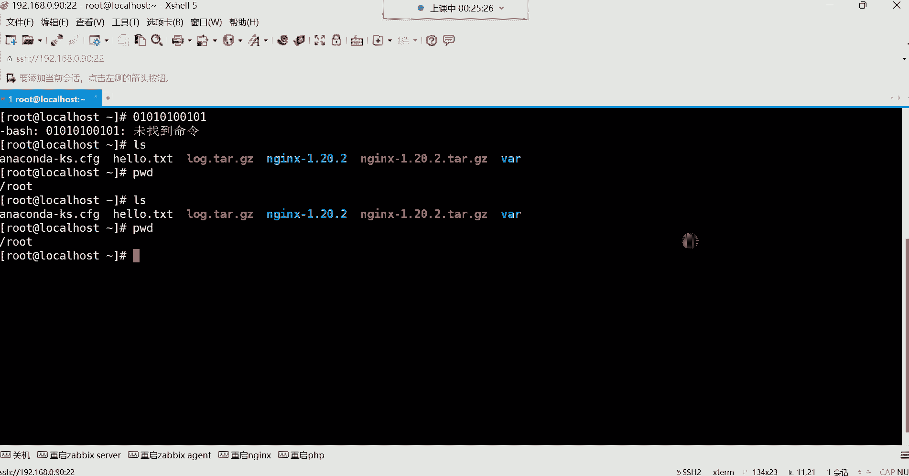
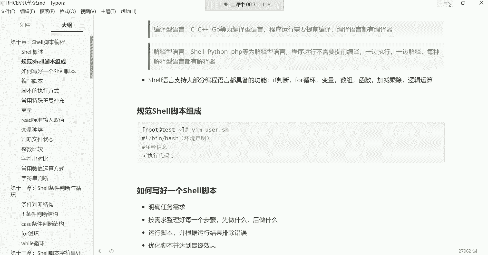

# 【小白入门必备】Linux运维进阶RHCSA+RHCE最全培训教程视频合集 - P36：红帽RHCE-1.shell脚本概念介绍、脚本编写规范 - 洋洋得IE - BV1nN4y1X7Go

好录屏打开，那我们就正式开始上课了，那我们本周呢正式开始了IHCE阶段的内容。

然后上周是直接把IHCC我们给结束了，然后有很多cs的小伙伴呢，我们在这个课堂里面也看不到了，然后成为我们怀念的一些同学了哈，然后我们这个IHCE阶段呢，前面还没有复习班，没有关系啊，我们这个继续讲。

然后你们这个有时间再复习哈，我们这个IHCE阶段开始的时候，是从事有脚本开始讲，然后一直讲到哪里呢，我们一直要讲到后边的ANCIBLE，自动化运维的工具，然后在整个的这个学习过程中呢。

私有脚本是我们学习啊，在基础阶段吧，可以算可以算是非常非常有难度的一部分内容，它难度体现在哪里呢，就是这个编程啊，这个编程对于很多这个小白啊，是计算机小白来讲啊，他没有，比如说没有一些这个基础经验。

没有一些编程的思维逻辑，那其实这个课程就听起来就不太好容易理解，所以说这也是为什么很多人去搞开发的时候，他觉得开发比较难，因为开发就是需要非常强的一个思维逻辑啊，但是没有办法，对于室有脚本呢。

现在这个很多时候不是这个，你能够花这个一天两天，一周两周，一个月，两个月就能够给他学明白的一门技能，能理解吧，有PDF笔记吗，有的话到时候我给大家导出PDF，大家可以去放到手机里面去看，好吧好。

那接下来呢我们学习是有脚本的，我可能会从头开始给大家去讲解，所以你们也不要担心啊，我会带领大家了解这个室友脚本的相关概念，然后怎么去学习这个室友脚本啊，啊这个笔记是这个笔记，我到时候会发给大家好吧。

我会发给你们，然后你们等你们到时候来跟我领取，好注意哈，强调一遍哈，笔记呢我们这个不上传到网盘了，到时候大家来私聊我啊，私聊我来给我领取笔记哈，然后录屏我还会造成上传到网盘，之前啊人感觉少了一些是吧。

没错啊，为什么呢，因为这个HCSA阶段有很多人嗯啊哈嗯，很多人呢就是为了学点基础啊，就为了学点基础哈，但是呢如果你光学点基础，对于我来呃，对于对于我在这个行业里边的经验告诉我。

那点基础不足以让你能够找到一份工作啊，不足以让你能够在这个行业里边，能够混口饭吃啊，那因为那点东西根本就不算什么哈哈，根本就不算什么，可以这么说吧，啊对，那个IHCC阶段。

还有很多同学是属于那种免费赠的课啊，免是免费赠他们的，所以说这个结束了啊，结束了好了，那我们就正式开始课程内容了哈，那我们对这个事有脚本来讲，我们先来说说这个嗯什么是shell，它能做什么。

然后我们为什么要学习它shell，它本身是什么，它本身是一门编程语言，注意哈，它本身是一门编程语言，它就像计算机里边的那些C语言，C加加java p p Python go这些编程语言呢。

类似那编程语言干嘛的呢，我们说编程语言是跟计算机打交道的，我们仍想去管理这个计算机，想要这个控制这个计算机。

我们得干嘛呀，我们得去说计算机能够听得懂的语言。

就是我想跟谁交流，你得说谁能听得懂的语言，你比如说你想跟老外交流，你跟老外交流，你说中国话他听不懂，那你们两个能交流吗，交流不了，不是不是这样啊，你想跟小动物交流，那你那你这个你跟他说中文。

小动物听不懂，那怎么办啊，你得说小动物能听得懂的语言，而计算机也一样，我们想跟计算机交流，那计算机的语言是什么，是二进制，010101这些二进制数啊，你我们别觉得这种二进制数怎么交流啊，啊这哈哈哈嗯。

我告诉你啊，计算机就喜欢这东西啊，计算机你跟他说，给我创建个文件，你用中文告诉他，那计算机他可不懂，计算机也不知道你要干嘛，所以呢哎我们得说计算机能听懂，能听得懂的语言，就是这些二进制数嗯。

但是呢我们在学习这个系统的时候，我们并没有通过这种二进制，去管理的一个计算机，是不是啊，如果这样的话，你看计算机他也不懂，我们都是通过各种命令，什么i s cat之类的，是不是诶，这为什么呢。

为什么我们说这些ABCD的英文字母，计算机他也能认识呢，难道说这ABCD的英文字母也可以，不不可以啊，就是英文字母计算机它其实也不认识，他不认识啊，计算机只认识二进制。

那为什么英文字母可以跟计算机交流呢，因为这些英文字母是属于编程语言里边的，能够识别的字母。

所以说这个编程语言它又分为这种编译型语言，跟这种解释型的语言，注意哈，我们说这个编译型语言和解释型语言，的区别是什么呢，你像C语言，C加加go这些呢，我们称之为叫编译型语言。

这种编译型语言程序运行之前需要提前编译它，然后编译语言都有自己的编译器嗯，像这种编译型语言，像C语言C加加这一类的，比如有人用C用C语言开发出一款软件，这个哈开发出一款软件。

那我想让这个软件能够运行起来得干嘛呀，得把这个软件给它编译成二进制，你不编译计算机最终也不认识啊，你看我们前面在原，我们前面在学习软件包管理的时候，源码包是不是需要我们自己编译。

我我们对于这个NINX来讲，我们是不是通这个通过那个GCC那个编译器，DCC这个编译器，把NINX给它编译成计算机认识的，这些二进制语言啊，所以说像这种东西呢，嗯典型的就是像C语言。

C加加go这些就属于这种编译型语言，当然你说老师呢这个很多的软件我没有编译，很多软件，你没编译，是别人帮你编译的，你就包括那种RPL包也一样，RPL包二进制包，二进制包。

比如说人家给你这个转换成二进制的时候，是人家官方给你编译好了，给你编译成010101这二进制数了，而我们拿出来直接安装的，能理解吧，但总之都得需要提前编译，不编译，安装不上啊。

这是最典型的前面ANGX我们安装的时候，是不是安装这个源码包的时候，我们自己编译，如果安装RPL包呢啊官方给你编译好了，但是得需要添编译哈，这样才可以，那还有一类语言叫做解释型的语言。

像这种解释型的语言，你比如说像shell语言，Python语言，PQP这些语言就称之为叫解释型的语言，唉这个解释型语言它的特点是什么呢，就是比如说有人用这个什么呢，用Python开发出了一款软件。

那这个软件在运行之前，不需要提前给它编译成计算机认识的那个，二进制数，那它是怎么回事呢，是这个软件他一边自己在执行的时候，他一边解释，然后他通过什么呢，通过解释器，每一种解释型语言都有自己的解释器。

那也就是说像这种Python p2p shell这种语言，他们是一边执行一边解释的，一边执行一边翻译，一边执行一边翻译，但这个过程我们看不到，注意哈，这个过程我们是看不到的，那对于我们来讲。

我们学习运维的这个相关的技能，那我们到底用什么语言呢，你说我们一直在跟计算机打交道，没错吧，我们一直在跟这个系统打交道。

那我们用的语言是到底是哪个语言呢，你说我们敲到什么IOS命令，PWD这些命令到底是属于什么语言呢，我告诉你啊，这叫show源，谁有语言，也就是说其实我们也是在不知不觉中啊，在学习一门计算机里的编程语言。

只不过这门语言呢，它不适合用来去开发一些软件，适合什么呢，呃适合去对系统的做一些维护，能理解吧，啊所以说计算机里面的语言有一门就叫社员，而我们现在学的就是，我们敲的什么IOS命令PWD命令。

我们前面所有的命令都是属于show语言，里面的命令，能理解吧啊都是属于私有语言里面的命令，所以你们你也学习了一门计算机里的语言了。

因为你们也知道怎么跟计算机打交道了，是不是啊，这shell脚本是学会自己编写吗，对啊，我们可以通过这门语言，自己去编写一些小程序啊，但是这个小程序我们就叫做shell脚本，那可以干嘛呢，啊做的事情很多。

像社会语言，它支持大部分编程语言里面的都具备的功能，能有哪些呢，你像if判断for循环变量，数组函数加减乘除，逻辑运算等等等等，所有语言都支持，那也就是说呃shell语言功能非常强大，非常强大哈。

那这些语言就什么这些功能什么，if判断for循环这些功能，那以上这些编程语言都具备，而show呢它也具备，所以我们用社会语言可以做哪些事情呢，啊比如说我们对于服务器的一些批量的维护啊，批量的维护。

还有比如说一些自动化的部署啊，对于这个软件的自动安装，服务器的自动初始化，还有这个比如说自动做一些这个，对于系统的一些这个故障检测的一些脚本啊，然后做一些监控的脚本啊，监控到比如说哪些这个故障的时候。

给我触发一个报警通知，这些室友脚本都可以实现，所以说室友脚本很强大很强大，只要你呃只要你的，只要你有那个想象力，只要你有那个思维逻辑，就是能够通过它实现非常强大的功能，但是呢对于shell语言里边啊。

对于show这一门语言，它的众多的编程语言里面，他算是比较什么呢，比较高级的语言哦，这个什么叫高级语言呢，就是离人比较近的语言啊，离人比较近的语言，我们叫高级语言，而你像C语言，像C语言。

还有像C加加java这类语言，我们叫什么呢，我们叫底层的语言啊，什么叫底层呢，就离计算机比较近的语言，那就是比较接近于计算机的硬件了，这个时候我们就称之为叫低级语言啊，叫底层语言。

而像这种show呢属于高级语言，就是离我们用户非常近，我们用户用起来非常方便，其实java都不算，java都算是都算是高级语言，java都算是高级语言哈，而C语言呢是偏底层的语言，偏底层语言。

你比如说如果你是学习C语言的，你就会发现这种东西根本不适合人类去学习。

为什么呢，你看我我我们现在用shell语言，比如我想看个文件好，cat看一个文件内容，这样没有任何问题吧，这也打开这个文件了，但如果说你是学习C语言的，你说我想用C语言看一个文件的内容。

你知道你得先干嘛吗，你得先去写一个像cat这样的程序，通过这个程序你写出来之后再去看这个文件，而且你看我们学习shell的时候，这cat这个程序是你写的吗，不是吧，IOS这个程序是你写的吗。

PWD程序是你写的吗，不是如果你要是你如果你要是学习C语言呢，你要是学习C语言这些东西，你自己去写吧啊你要看看目录好，你自己写一个IOS的功能好，我要去看当前的所在位置好，你自己写一个。

写一个PWPWD这种命令的功能去，这就是我们说这个这个呃，C语言是非常非常难的，而java不一样，java它有很多的类库啊，很多的类库就是在java里面，我们叫库，什么叫库呢，就是功能在java里面。

比如我想实现一个功能，好调用别人给你写好的那个库就行了啊，它是一个一个的类库，一个这个内裤就是一个一个的小功能，能理解吧，啊比如说我比如说我想用java去这个什么呢，去实现一些功能。

好调用人家这个小内裤就行了，好那比如说我是学习Python的，Python叫模块，Python叫模块，这个模块是什么呢，模块就是一个一个的小功能，比如我想用Python去实现一个功能。

好调用人家给你开发好的现成的模块，直接用就可以了，这些都属于什么，这些都属于叫做高级语言，就离人比较近，人用的比较简单，你用什么直接调用就行了，那你这C语言呢，好C语言，我想比如说我想看一个文件。

不好意思，你想看文件啊，你自己写个命令去吧，那java呢啊我要我要用java语言看文件，你直接调用就可以了，调用人家给你写好的那个类库能理解吧，Python呢我想看文件，调用别人给你写好的那个模块。

就捡现成的，这叫叫捡现成的了，而是有语言不也一样吗，所以为什么说是语言属于高级语言呢，就是人用起来比较方便简单，很多东西别人给你已经实现了，你拿过来用就行了，pip3是Python的吗。

啊是Python的，呃我我们是开始自己写编程脚本了，嗯没错哈，对对对哈，seal就是别人干嘛呢，别人别人给你已经准备好了很多东西，你需要的话，你可以给它组合到一起去使用就行了，这就是15元。

但是呢你想把千万不要觉得shift这门语言简单，嗯因为这任何的一门语言都不简单，只不过啊像这像这种东西。

它功能也是非常强大的哈，很强大呃，所以你看很多人说这个去学编程，学编程，为什么学编程难呢。

为什么很多搞开发的说哎呀这搞开发的辛苦啊，累啊，掉头发呀，为啥呀，因为它难呢，就因为它难呢，很多人学着学着都想自杀嗯，所以这个随着不断的发展，在企业里边不用说他企业吧。

是在这个行业里边给程序员，就是想要让程序员提高它的这个代码质量，怎么样才能提高程序员的这种这个，比如说对于工作的热情啊，怎么样才能提高他的这个写写代码的效率，提高它的质量呢。

哎这行业当中有一个岗位叫做程序员鼓励师，叫程序员鼓励师，程序员鼓励师是个啥职业呢，可能大家都没有见过，也没有听过，哼哼哼哼哼，在岗位，程序员鼓励师，嗯哼哼哼啊，程序员鼓励师是个啥职业啊，我们看这个。

看到了吗，看到了吗，这叫程序员鼓励师，这程序员他关键没事，天天在这录代码啊，他撸代码，他工作压力大呀，他压力大的话，你想想比如说在开发一个新的功能的时候，这新的功能突然间就没有思路了。

那没有思路了怎么办，那你说比如说企业里边再赶一个项目的时候，就这个项目，人家这个这个要求必须在一个月的时间，要把这个项目给我完成啊，一个月时间要把项目给我完成，那你你公司里边如果开发人员不够用怎么办。

如果开发人员不够用好，那就用现有的开发人员吧，让他们熬夜加班啊，让他们熬夜加班写代码，是不是那熬夜加班写代码，那怎么样才能让他们心甘情愿的熬夜加班，写代码，怎么样才能心甘情愿的呢。

啊就是给他们找一些这种啊这个鼓励师，你看像这种鼓励师看到了吗，这标配仨，一个程序员，标配三个三个孤立石，这个在程序员，比如说这个，你看这这看到了吗，心情没落的时候，在心情没落的时候。

没有思没有思维的时候，不知道这个代码该怎么写了，这个妹子上去给你看，一个人给你这个这个揉揉肩，摸摸这摸摸那的是吧，然后可能说这瞬间灵感就来了，你看啊哈哈，这瞬间灵感不就来了嘛，这可能说这效率直接就翻倍。

原先可能说这一个项目得用三个月，三个月的时间啊，得用三个月的时间能够给他完成，但是呢由于这个哈哈哈哈哈哈哈哈哈哈，由于这个古利斯，你看这样，你看你看你看这样了吗，都就这样都不愿意回家。

就等都已经熬成这样了，就不愿回家，为什么，因为加班现在已经变成一种幸福了，看到了吗，这种就是都不回家了，这回家干嘛呀，是不是，所以我们说这叫什么，这叫不求肤白貌美，大长腿啊，只求温柔体贴，善解人意。

这叫程序员鼓励师，所以你看这种在你心情低落的时候，呵呵呵呃，给你谈谈人生，谈谈理想，熬成这样了，也不回家，你就必须听，必须得熬夜加班撸代码，看到了吗，回家干嘛呀，是不是哈哈哈，你看这女程序员看到了吗。

看到了吗，这女程序员都有男鼓励师啊，就比如说这女程序员她也需要鼓励呀，你不能说呃，到时候这个女程序员找女成员去去去鼓励她呀，是不是啊，女成员到时候找这种男鼓励师，没事儿给她揉揉肩，揉揉被子。

两个人谈谈人生，谈谈理想啊，谈谈生人之类的这种东西，相互鼓励一下，是不是啊，这还这谁回家呀，但是这种程序员鼓励师，一般你得需要懂点什么呢，你得需要懂点那个就是那那那个呃你得懂点，你得懂点计算机啊。

你不能上去，你你说你如果你如果不懂计算机的话，你跟人程序员你没话可聊啊是吧，你没有话可聊，你上学你就跟人聊聊，聊吃喝聊吃喝玩乐，聊这个什么呀，聊这个这个这聊些有的没的，这也不行，看了吗，要求是吧。

入职条件，入职条件就是长相清晰，声线甜美，微笑常在，人见人爱啊，然后善于倾听呃，算不算沟通不重要，但是能忍受it工程师死宅的性格，然后还有什么呀啊，耍不耍脾气也不重要。

要善于发现每个程序员暖男的天性要成啊，要能够驯服它啊，还要这个嗯了解点，你看他他都说了，要了解点互联网吗，你不然聊起来云里雾里的，这工程师他也容易容易受到打击啊，工程师我这一个功能研究不出来好。

你总跟我聊一些吃的喝的是吧，这他也受不了啊，嗯所以说这看到了吗，所以这个很多为为什么说搞编程的搞编程的呀，这个呵呵呵呵呵呵呵行了，高一是吧对，所以说为什么说这搞编程的人，他这个哈哈哈，搞编程的人。

他这个一般容易掉头发呢，他确实你不安慰一下，他确实容易掉头发哈，有没有被服务过，没有啊，没有啊哈哈哈，没有哈哈好了哈，嗯好行了，大哥我们就接着讲课吧，以后这个以后你们就知道，这个别往程序员方向发展。

这些都熬成啥样了，家都不想回，是不是，呵呵好，那接下来我们学习cl脚本哈，这是这个你们主要是得知道C有脚本这个东西，它涉及到编程，一旦涉及到编程，他可能需要你这个人的思维逻辑非常强，能理解吧。

啊但没关系啊，慢慢来嘛，这个谁也不是天生就有这种思维逻辑的，扛不住是吧，扛不住很正常，好那接下来呢我们这个来这个说，所以说这个一个规范的脚本组成，规范的脚本组成呢，首先呢就是我们写脚本呢。

就是其实说白了就是把命令啊，给他写到一个文件里边，注意哈脚本的本质就是一个命令的堆积啊，注意我注意我跟你们说的哈。

脚本的本质就是命令的堆积，什么意思呢，正常来讲，我们都是把命令写到这个，在命令行终端去敲命令，比如说我要做什么事情，我要安包是吧，安装软件包这些，或者说我要做其他的事情。

我们是不是都是在命令行里敲命令啊，啊那比如现在有个需求什么需求呢，我现在希望你在这台服务器里边给我部署一个，比如说呃，后期大家会学到一个叫做LNMP的，这么一个架构平台啊，架构平台注意这是一整套平台。

这里面涉及的技术有什么呢，有L就是LINUX的系统，然后N呢就是NDEX的web服务器软件啊，用来搭建网站平台的，然后M呢是MYSQL的数据库，P呢就是P2P的解释器啊。

可以说是P2P也可以是Python啊，我让你同时在这一台服务器，给我部署这么一个平台出来，而且这种工作可能说还需要什么呢，还需要你经常的做，比如说你们公司每次有新的服务器，一投入到生产环境。

都需要你在这个服务器里面去，给我部署这么一套环境出来啊，然后再对这个服务器做一些初始化嗯，那怎么办，你想想，那我们应该怎么办呢，我不能说每次有新的服务器上线好，我自己手动在命令行里面撸撸一遍这些命令吧。

手动撸一边命令，手动撸一边命令可不可以呢，可以你要想练手速呢，这也没人能阻止的了，但是我们说这没有必要吧，你有的时间，你还不如跟你们公司那个前台的小姑娘，去聊聊天，畅谈畅谈人生，是不是没事儿。

咱儿撸这些相同的命令没有任何的意义，所以怎么办呢，唉写一个把这个部署这个平台的所有命令干嘛，写到文件里面，注意哈，写到文件里边，用什么命令，按照一个什么呢，按照一个顺序写到文件里边。

然后当你们公司再有新服务器上线，需要你在做这些事情的时候，部署这个平台好，直接把这个文件拿到服务器上边跑一遍，注意哈，把文件拿到服务器跑一遍之后干嘛，这文件里面是什么，文件里面不就是一堆命令吗。

这个命令可以帮我们部署这么一个平台出来，到时候这文件就会自动帮你去执行，这里边的命令，从上到下执行一条一条，执行效率非常的高，比你手敲要快多了，那这个时候执行完之后，好平台出来了。

你呢你都不知道干嘛去了，你早跟人家这个你们公司的小姑娘在一起，是不是谈谈人生，谈理想，谈未来了，能理解吧，所以这个是有脚本，就是可以让我们的工作效率呢，呃提升不知有多少倍啊。

能够让我们的工作啊变得更加的幸福一些啊，对自动化就自动化，所以脚本的本质是什么，脚本的本质就是把一堆命令往文件里面写，让然后到时候执行文件，文件从上到下帮你执行，而你呢你不用管了，这文件一执行的时候。

你干嘛去啊，文件一执行的时候，比如这文件里面有100条命令好，这100条命令可能说你如果手敲的话，可能得需要半天时间，没关系啊，让文件自动帮你去执行，而你呢你干嘛去啊，你就该干嘛干嘛，你喝了小咖啡。

吹着小空调，拿着小手机聊着小妹子，你你爱干嘛干嘛，总之工作也没耽误，能理解了吧，哎这服务器这个平台我给你部署出来了，而我呢啊也过得非常幸福是吧，嘿嘿嗯，又比如说我们在企业里边，有一个非常常见的需求。

什么对服务器做备份，我们对服务器做备份，一般什么时候备份呢，一般都是在服务器不忙的时候，在服务器不忙的时候，我们要对这个服务器做备份，哎什么时候不忙呢，没错，凌晨或者半夜嗯，一般不啊。

一般很少周末对他做备份，就是一般在凌晨，你看你们在这个有没有玩过游戏，什么王者荣耀，什么英雄联盟，那些游戏在更新的时候，你看他什么时间段，他哪个时间段更新的，你看他是大白天的更新吗。

你看他是周六周日更新吗，不是哎都是12点以后，是不是哎12点以后关服了，干嘛呀，我要维护了，没错吧，哎所有人都无法上线了，那时候他要维护，为什么呢，因为12点以后人都睡觉了呀，对呀。

按照按照我们中国人的这个作息习惯，12点以后人大多数都睡觉了，哎你好，你们睡觉，我开始对服务器做做一些，比如说数据备份，因为做数据备份它会严重消耗服务器性能啊，你想想这服务器如果你一边让用户去访问。

一边你在做备份，那备份它会消耗CPU的，那备份不是说就直接这个一点资源都不消耗的，它会消耗CPU去帮计算数据量，然后去做备份，得先你像你做备份，首先CPU会干嘛。

CPU会从硬盘里边把那个数据放到内存里边，这底层硬盘，CPU得从硬盘里面把数据放到内存里面好，然后还得计算这个内存可以存储多大的数据量，然后放到内存之后呢，再做备份。

然后再给它备份到其他的那个硬盘里面啊，但是得先放到这个什么呢，比如你往别地备份，得先放到那个内存，那个服务器的内存，然后再往这个服务器的硬盘里面去存，这之间过程我跟你讲需要很多个步骤的，谁去处理啊。

谁去计算呢，CPU去CPU去计算呢，那CPU计算一下，那你CPU又要接受用户访问，要做备份，累死了是吧，哎一般就是什么呢，哎不忙的时候，你不能影响用户访问的用，你也。

你想你这个大白天的用户都在访问服务器呢，在你服务服务器里面这个什么呢，比如说做各种各样的操作呢，那你的服务器他又忙又要做备份，累死了，是不是啊，所以一般呢凌晨做备份，一般都得凌晨后半夜三点。

凌晨三点作为分，那凌晨三点作为分，谁备份呢，好运维作为份，那运维做备份，你可能在公司里边凌晨三点不回家吗，好我零，我在公司待到凌晨三点，然后呢我敲一个拷贝的命令拷贝啊，把这个什么叉叉叉点文件是吧。

然后呢拷贝到某一个目录是吧，拷贝到某一个目录，或者拷贝到另外一台服务器上面，你可能说在凌晨三点去敲这么一条，拷贝的命令吗，可能吗，或者说我我这个通过这种压缩方式都行，tar命令压缩压缩。

把这个文件压缩以后传到别的服务器，传到这种专门的备份服务器，现实吗也行也可以，那你凌晨三点备份完以后呢，你再回家回家之后呢，然后你在睡觉，早上八点起来在上班啊，那这个可能说你比开发还要累了。

那确实你应该跟公司的老板申请一个，我也需要一个运维鼓励师啊，我的这个心情也很郁闷，我的工作量也也很辛苦，是不是嗯嗯但一般这也不太现实啊，是不是，嘿老板说，那咋的，你就做个小备份，还得需要给你配个鼓励师。

是不是，嘿嘿嘿，所以说这怎么办，所以呵呵呵呵呵，一所以一般我们都干嘛呢，哎我们一般就是通过脚本哈，哎通过脚本，就是我把备份的操作写到一个文件里面，这个文件里面就是我所有的备份操作，然后干嘛呀。

然后到时候我们后期还会学一个什么呢，叫做计划任务的东西，叫计划任务，老板娘来鼓励是吧，嗯啊叫计划任务的这么一个技能，计划任务就像一个闹钟一样，它像一个闹钟，可以让我们干嘛呢，哎可以让我们定时。

比如我定时在凌晨三点给我执行这个文件，那个文件如果是里边都是备份的命令，好凌晨三点自动备份，能理解吧，但前提是脚本可以帮我实现这个功能，所以知道脚本的这个重要性了吗。

对啊这脚本你不能让老板给你派运维鼓励时啊。

你这不太现实，是不是，所以这脚本还是蛮重要的哈，啊它可以让我们的这个运维的幸福指数啊，可以又提升那么一点点嗯啊那脚本怎么写啊，现在你们知道脚本的功能了，是不是啊，那怎么写这个脚本呢。

往文件里面写，这时候我们自己去我们建个目录哈，我们所有的脚本的练习都放在一个目录里面，再跟一下建一个script啊，就是脚本的意思，共享哈，笔记共享给你们，到时候这个注意啊，你们领取本。

领取领取笔记的话，来私聊我，我把笔记发给大家好吧，私聊我哈，笔记不上传到网盘了，OK吧好啊，需要领取笔记，到时候来私聊我，然后呢我们这个这个来说一说哈，我们进到这个目录脚本怎么写。

就是通过BM这种东西去打开一个文件，就普通文件他就打开一个普通文件，那个文件叫什么名字呢，前面叫什么都行，它一般见名之意，比如说我这脚本我就是部署一个LNLP的，LLNLP的这么一个呃环境的一个脚本。

那一般前面的名字我就知道叫INFP，那后边加个后缀点SH，好那现在重点是为什么要加这个后缀，这个后缀的意义是什么呢，这个后缀的意义就是我一看这个文件，我就知道是一个shell脚本。

它这个点SH是什么意思呢，就是shell的意思，shell的意思，那后期如果大家学习Python的话，你比如说你用Python写个脚本，你比如我用Python写个爬虫的脚本好，那一般前面叫什么无所谓。

后边DRPY结尾的干嘛呢，给我们自己看，我们自己一看就知道这是一个Python的脚本，能理解吗，我一看就知道这个Python写的脚本好，那如果你是学习java的呢，你如果是学习java的。

我就用java语言写了一个什么，写了一个程序，那用前面叫什么无所谓，后边点JSP的JAVASCRIPT，点JSP，那如果你是学习C语言的呢，好我C语言写脚本啊，就写一个程序，前面叫什么无所谓。

你自己怎么开心，你自己怎么叫，你能理解吧，你前面叫什么无所谓，但后边点C结尾让别人一看就知道啊，这是个C语言写出来的文件，能理解吧，啊所以这些后缀名干嘛呀，给我们自己看，这脚本一旦写好了。

比如我自己写一个lap平台的，可以可以这个通过脚本一键部署，这个lap平台的一个脚本，这脚本如果别人觉得非常不错，哎羡慕你啊，希望能够干嘛呢，哎希望能够这个获取你的劳动成果啊，他想拿回去捡现成的去用。

可不可以呢，啊可以你把这脚本拿给他，他可以拿过来，直接也可以用了，能理解吧，这个脚本如果说这个你觉得这种东西呢，可以拿给别人免费去用的话，没关系，你就拿给他，他拿过来一看好点，SH结尾的他就知道啊。

这是有语言写出来的，能理解吧啊他一看A点PY结尾的啊，Python语言写出来的太能理解了吧，啊一看诶点P2P结尾的表示P2P结尾的好，那P2P语言写出来的，所以这些后缀名都是我们自己看的对，让人看的哈。

那我们一般前面见名之意啊，我们比如说我现在要写一个什么呢，就是入门级别的脚本，这个入门级别的脚本干嘛呢，就是比如说我想通过脚本呢输出一个hello world，那前面比如我就让他叫hello。

点ISH可不可以呢，可以你前边完全是看自己的心情，我想让他叫什么，他就叫什么，后面也看自己心情，你说那老师，那我写个脚本，我不加这个点SH可以吗，我不想让别人发现我这是show脚本，可以也行。

你不加也无所谓，你能理解吧哈，你不加也没有关系的，也可以正常去使用它的，所以这个看自己哈，加也行，不加也行，好回车回车好，那接下来我们就干嘛呢，我们就在这个脚本里边，我们应该怎么写呢。

脚本分为这个很多个步骤嗯。

但是呢前面的顺序一定要这样写，第一脚本里面有环境的声明。

等一下哈。

这个脚本里边啊要有这个环境的声明，什么叫环境的声明，就是咱们说show语言，它有个风格，什么风格呢，我前面是不是给大家说了，这show语言是属于一种解释型的语言呢，解释型语言一边执行一边解释。

就是说我们敲的什么LS命令系统，不是不认识吗，他得给他得解释成这种二进制，这样才可以，那解释成二进制的话，谁去给他解释啊，谁去解释这个命令啊，解释给计算机听啊，谁去解释呢，哎解释器。

所以我们在写脚本的时候，你得干嘛要在这个文件里边标记一下，用哪个解释器去解释，我这个文件里的那一堆命令能理解吧，所以这环境声明就是指定你的解释器是哪一个，我们一般呢就是B下的Y值，那怎么指定呢。

井号叹号连到一起。

井号叹号连在一起叫环境的声明啊，一一个井号它的语法是注释，井号叹号加一起就要环境的声明了，声明一下，我的解释器是B下的BH这个解释器，这个解释器我们前面有有没有详细讲过呀，有吗，就叫环境声明啊。

这井号叹号连在一起叫环境声明，如果你没有叹号，光有一个井号，这叫注释，能理解吧，这叫注释，但你加了叹号了哎这就叫环境声明，叹号就代表环境的声明，但得他们两个连到一起哈，那如果你说我光一个叹号行吗。

BBH那不行，那不行，那不行哈，所以这井号碳上连到一起叫环境声明，那解释器都在我们系统的哪个位置存放着呢，啊在etc有个SHELES这个文件，注意这是一个文件，我们用cut来看这个文件。

你看这个文件里边，环境声明啥意思，声明我的解释器解释器哈，就解释这个文件里的命令呢，比如我后期往文件里面噼里啪啦写了一堆命令，那这个命令谁去解释，谁去解释啊，唉就是这个解释器却给我解释下边的命令。

能理解吧，那我们在命令行里面敲的这些命令，你知道为什么我没有指定解释器呢，那是因为你在命令行里敲命令，系统会直接调用by，是这个解释器去给你解释，能理解吧，所以在脚本里边我们得指定一下啊。

你得自己指定啊，用哪个解释器去解释里面的命令，到时候系统就会自动去调用这个解释器，帮你解释下边的这一堆命令是怎么回事啊，这叫环境的声明，那这个时候我们这个看哈解释器呢，像早期的SH这个解释器。

这是最古老的解释器的，这个解释器是在哪个系统里面呢，是在这个UNIX系统里面，现在仍然在使用的一款解释器，大家也没有用过UNIX，那没关系，我可以给你们演示一下U的风格，怎么演示呢。

你就直接把这个解释器拿过来执行一遍回车，这就是unit的风格，unit风格是什么风格呢，这就叫命令行终端了，它的命令行终端就是这样子的，SH杠4。2，然后来一个小井号，那在这个UNIX系统里边。

你想判断一个用户是不是超级管理员，首先你得看这个结这个命令命令提示符的结尾，得看它的结尾啊，如果是普通用户，它的结尾就是dollar符，但是因为这个命令行，它不给你显示当前登录的用户是谁。

他也不显示你当前在哪，在哪个路径，你比如我现在切换个路径，切换到etc，你得自己看我当前用户是谁，你得自己看，看到了吗，id看自己当前的用户，然后呢看自己当前在哪个路径啊，敲个发现也没颜色，看到了吗啊。

没有颜色，我也不知道这些是目录，到底是文件怎么办，好用LLL看它的属性啊，还没有L呢，你得LS杠好看属性吧，好我一看这个啊，前面是D开头的好，但是它是一个目录，看到了吗啊好横杠开头的，这是一个文件。

你自己这样去看吧，这就是UNIX风格，而BH的风格呢啊我们退出哈，X的退出，回到b ch的风格，BH的风格你就敲个LS，它有颜色，最起码我一看就知道这是个目录了是吧，这白色是个文件，这是个压缩包。

是不是，所以说这个你们现在能够感受到，etc的shells，你们现在能够感受到这个解释器了吗，就是我们当前登录系统的这个命令，命令提示符就是有解释器提供的好，你一登录好，我给你分配这个解释器。

那你敲的所有命令都有这个解释器去负责解释，解释给谁听呢，解释给内核定区分大小写，区分大小写啊，这个系统本身就是严格区分大小写，那就像小写的L和大写的I，它就是不是同一个东西啊，严格区分大小写哈。

好你比如说我这样，我用这个batch帮我解释一个什么呢，S的命令嗯，无法执行啊，sorry哈，这不行，没有这样玩的哈，没有这样玩的，对这些都是解释器，你看SH的解释器跟BH解释器。

那下边怎么还有一个同名的呀，什么SH跟BH啊，这两个是什么意思呢，路径不一样，注意哈，路径不一样，在bin下边的，在bin这个目录下面的，是不是都是那个链接文件的，你看一下在bin下面的那个SH。

这是链接在B下的那个batch也是链接啊，这个变向的batch不是链接，那SH是链接，链接的是谁的呢，你看一下并下的S1H，啊他就链接的这个batch啊。

但这个batch是其实是在这个USB下的batch能力吧，啊是这个S2，你们看到了吗，这SH它指向的也是BH，指向的这个一指向的也是BH，但是风格还是不太一样哈，还是不太一样，有SH的那右侧，并且SH。

所以说不同的解释器的风格不一样的话，你就知道别的东西你不用关心，你就知道对于解释器来讲，我们用的是什么呢，是并且的batch这个解释器，这是标准解释器，而这个系统还有很多解释器呢，还有什么呀。

还有像什么cs h tcs h z s h，这些都是解释器，哼都是解释器哈，嗯还有什么KSH这些，那就这么多解释器到底用哪个呀，啊就默认这个系统用的就是BH解释器，这个解释器是是谁研究出来的呢。

我们可以这样RPM杠QI看一下这个，看这样可以看吗，可以看，BT本身是一个软件包，大家来看一下啊，BH这个解释器它的名字叫BH，然后属于哪一个组织的呢，属于那个格斗组织的，这里面我看能不能这哈。

看到吗，属于格斗这个组织，我把翻译软件打开哈。

格斗组织研发出来的这个解释器是免费的，就是我我们用的话是免费的，而我前面给你们列举的有一些你像哪些呢。

什么KSH，还有那个ZS，是这些都是收费的，解释器，收费的哈，那你说收费跟这个BT这种免费的解释器，体现在哪里呢，就是从功能方面来讲，可能说这种会更加的强大一些，功能更强大，让你用起来呢更加的舒服一些。

但是没有必要，但是跟你要钱呢不是吗，所以我们一般也是不会去太干嘛呢，不会去太纠结，就是败着节气已经很人性化了，已经很人性化了哈啊然后是格斗组织啊，我看一下哈，这有个概要啊，这是属于哪一个组织的。

这个嗯要钱的都不舒服，呵呵对，所以说这个by是解释器，是在红帽在这个LINUX系统当中的一个默认解释器，好的，那这个解释器，我们敲的所有命令都是由BH解释的，包括我们当前登录的终端，你们现在也知道了吧。

是谁提供的呢啊是BH提供的batch，你登录的时候，我给你提供一个batch的解释器的终端，那你切到所有命令全都用batch帮你解释，那么写脚本写脚本是不是也得需要解释，你不解释，那系统它不认识啊。

系统都不认识，就像你跟老外对话一样，你跟老外对话。

那老外比如说跟你说一句英文，你跟他说一句中文，你发现你你们两个语言不通啊，你们两个语言不通，你这怎么交流啊是吧。

你看到一个老外波涛汹涌的，你那个就想这个撩人家，你一撩人家，这是不是你说这个哈哈喽，你好性感，那老外听不懂啊，是不是。

所以一般怎么办怎么办，你就得说他听得懂的语言吗。

所以那他也听不懂你，你也不会，那怎么办，你俩之间可以找一个翻译吗，是不是，你说这是你你跟老外之间交流，你说那老外也听不懂你的话，好那你说唉最好的方法咱们找一个翻译，是不是谁是翻译呢。

唉这个中间人就是翻译官，他给你翻译一下，你把你要说的话先干嘛呢，嗯先先让翻译翻译一遍，翻译知道你要干嘛了，知道你要表达爱意了，然后翻译给他，这不就可以了吗，是不是啊，所以这个翻译是谁啊。

翻译就是那个B给你翻译的，负责给你翻译的，然后这个是谁呀，这个是我们用户，我们用户我们用户敲的所有命令，翻译给谁呀，翻译给计算机，翻译给计算机听计算机就知道你要干嘛了，能列吧，就比如说我敲一个LS啊。

那这时候LS默认计算机是不认识的，计算机怎么知道这个LS它到底要干嘛呀，不认识，那怎么办，BT把它给直接翻译成二进制，二进制，一旦翻译成二进制计算机，计算机就知道了哦，原来他要看啊。

他看文件的那个什么呢，看文件的详细信息了，好那计算机就帮你去执行这个操作，能理解吧，唉这是他们之间的关系，所以知道这个BH的功能了吗。

呵呵呵呵啊，那接下来呢我们这个写脚本，你是不是得指定我的解释器是谁啊，谁给我翻译命令啊，那不然计算机他也不知道你这个一堆命令，到底要干什么事情啊，所以这时候得翻译，那翻译的话，我们指定完了之后。

我的翻译官就是并行的办事，这个翻译官好，那接下来敲命令啊。

这是这些敲命令吗，也不是啊，可以加一些注释，这个注释信息井号开头。

井号开头的代表注释，这个注释完全就是看你的心情写，比如说啊这个作者是谁，作者整的叉叉叉，然后艾特留留个联系方式啊，163点com可不可以啊，然后再加个注释啊，具体的功能啊，比如说这个随便写啊。

支持中文注释不生效，在这个文件里面注释是不生效的，你想怎么写就怎么写，中文也行，英文也行，无所谓的，你比如说啊具体的功能啊，是这个输出输出，Hello word，可不可以也可以，这注释可以写很多行啊。

你们知道吗，在在开发的，在这个企业当中，比如说你是搞开发的，如果你是搞开发的，你写代码，这注释是非常重要的，为什么呢，这注释就是解释，就是解释，解释什么呢，就是用来解释，比如说我接下来的这个代码。

它可以实现什么功能，我们来看看系统里面的一些配置文件哈，比如我打开那个etc f s table这个文件，大家看一下这个文件里面有有多少行解释，1234有四行解释。

他就会他就会解释一下这个文件去那干嘛的啊，这是由谁，你看到了吗，这个文件是做挂载的，然后是由谁谁谁创建的，看到了吗，然后这个还告诉你这个文件可以可访问的文件，系统被维护在哪一个目录下边啊，查看手册页。

就是看一些帮助，可以了解更多的信息，这些东西叫什么呢，叫描述信息，描述一下我这个文件的功能，这个文件可以做什么用，因为在企业里面搞开发也一样，你在企业里面你你比如说那些开发是写代码，他妈的。

可能说这个由于这个精神上边，非常的这个什么呢，非非常的这个已经是被安慰的，非常非常的满足了，然后这个一一夜之间撸了好几，撸了好几千行代码，但是呢就没写注释，这代码可以用吗，不可以用，为什么呢。

因为这个对于代码来讲都有严格的要求的，几行代码要加注释，知道吧，就你这个多少行代码一定要就加注释了，而且在这个就是代码量里边，必须得有多少行注释存在才行，有严格要求，不是说你就直接把代码往里面写就行了。

不是的，因为这种东西后期要让别人去看的，不是说光你自己懂就行，别人也要懂，能理解吧，所以注释对开发来讲是必须要写的啊，就几行代码就得加注释，几行代码就得加注释，人家是有严格要求的，不是说你开心看你心情。

我想加就加，不想加就不加了，他不是那么回事，哈哈哈啊，所以家族式呢是个好习惯，你比如说我们需求非常多，我自己写脚本写了好几百行啊，那得好几好几百行的代码，我如果说来个注释的话，以后是不是自己看也可以嗯。

你比如说我现在我给你们看一看，我们后面会用到的一些脚本。

嗯给大家找一个哈，找一个。

哪个脚本就拿这个脚本来说吧。

我们就拿这个脚本来说哈。

你看桌面这脚本拖进来。

这个脚本的话呢，注意啊，他是一个普通的文件，看到了吗，但是它是点SH作为结尾的，这点SH作为结尾的，我一看就知道这个是有脚本，好的，一看是个shift脚本，那这个脚本干嘛用的呢啊一般前面见面之一啊。

叫做this is config啊，就是呃配置系统环境的啊，当然这种名字你自己随便写，你自己写的东西，你还不如想想怎么取名就怎么取名啊，是不是打开来看一眼，你看这里边上来呢，做个环境声明声明什么呢。

声明一下我的解释器是哪一个，接下来呢我还在脚本里面输出了一些信息呢，我并没有加入，但是我会通过EQ输出一些输出一些信息，这个信息一输出，这个会显示在屏幕上面的，会显示在我们当前的这个屏幕上边啊。

如果它一执行第一步，他就EO这个叫系统初始化环境脚本，然后接下来看哈，接下来第二步就开始做一些事情，然后做哪些事情看到吗，然后接下来都会都会让别人知道，这个脚本做了哪些事情啊，再往下翻一翻啊。

啊看到了吗，这些做了哪些事情都会清楚地告诉我们的，如果这个脚本我拿过来一执行，大家来感受一下哈，比如我现在想执行的怎么执行呢，这是一个普通文件哈，得需要给他一个执行权限，我给它移动到哪呢。

给它移动到根下的script这个目录好吧，移过去，我们把所有的脚本都放在这个目录啊，这个移动的话，那纯属是为了归类哈，纯属就是为了归类，这样以后所有的脚本，我都来到系统的这个目录去找不就行了吗。

是用什么找什么，然后接下来呢我就给他一个执行权限，因为它需要执行权限，称之mod加一个X好，变绿了吧，已经变绿了哈，那我这样加的执行权限，是不是任何人都可以执行了呀，没关系哈，那我就直接点杠。

这点杠代表当前的路径，这脚本你想执行第一步，你如果已经在这个脚本路径了，如果已经在这个路径了，你可以直接这样点杠，点是不是代表当前路径，杠呢是当前路径的一个分隔符，后边指定哎哪个文件名，如果你不止。

你说我直接输入文件名可以吗，不好用，你如果中直接输入文件名，我问你系统会认为什么呀，系统是不是会识别它是一个命，它是一个命令呢，因为只有命令才可以这样执行，是不是对，是指定解释器哈。

不在当前路径怎么执行，不在当前路径就指定它的绝对路径，如果在当前路径就指定点杠就行了，通过点杠来定，但是你坚决不能这样指，你坚决不能直接指脚本的名字，如果你直接指脚本名字，就像我们敲IOS一样。

能理解吧，系统会认为这是一条命令，因为这些只有命令才可以这样执行，而它是命令吗，各位我问你他是吗，他不是命令吧，他是不是一个文件呢啊所以怎么办，怎么样才能让系统知道它是一个文件呢，哎点杠代表当前路径。

哎当前路径的这个文件干嘛呀，一回车他就给执行了，哎一回车，你看是不是告别这脚本，做什么事情叫系统初始化环境，叫系统环境初始化脚本，接下来呢做了什么事情，关闭防火墙，创建阿里仓库，看了吗，一步一步说。

非常幸福啊，幸不幸福的这种脚本，看接下来设置时区了，看到没设置时区了，并同步时间了，开始，看到了吗，这一步一步先做什么再做什么，是不是非常的有有规律呀，好，好接下来看这哈。

这种叫设置系统最大打开文件数量，系统内核优化，看到了吧，这些什么减少swap的使用，好安装系统性能分析工具及其他好，看到了吗，这脚本是不是拿过来，别人一看就知道诶做了哪些事情呢。

即便说这个里边你不加注释，最起码你把你，你把这个你做的事情是不是告诉给别人了呀，那别人是不是就知道这个脚本做了哪些事情啊，没错吧。

这叫什么，这叫脚本，就是说以后有了这种功能了，比如你们你们公司有这么一堆服务器，你们公司现在有这么一堆服务器，他他要干嘛呢，诶他要让你给每一台服务器，都给我做相同的事情干嘛，就像刚刚那样。

我们刚刚做了哪些事情，是不是啊，服务器初始化，然后又什么创建阿里仓库内核优化，这个那个的做了好多事情是吧。

那你想想如果给你这么一堆服务器，如果说给你一这么一堆服务器，让你去做相同的事情，你能说在每个服务器这边都敲一遍这个命令吗，你们能说都挨个敲一遍命令吗，那里面命令可不少啊，那里边的命令非常多啊。

一个服务器敲一遍，一个服务器敲一遍，那可能说如果这活儿换做会写脚本的人，如果人家会写脚本，可能说就这样活啊，人家5分钟就搞定了，而你呢干一天，那你这你你这一天就疯狂敲命令。

那别人呢别人一天就是就就是拿着手机是吧，嗯喝点小咖啡，跟你们公司的前台的小妹子在一起聊天了，而你呢在那哭逼哈哈的在那敲命令，是不是啊，这叫啥呀，这不就是我说这幸福指数严重下降，是不是嗯哼哼哼哼哼哼。

是不是嗯不啊，同样的活儿啊，就同样的活就对，结果你还能敲错啊，你手你手动敲命，你还容易敲错呢，关键是是不是哈哈哈，那怎么办啊，脚本脚本不会错呀，是不是对呀，等你敲了，人家妹子也忽悠到手了，是不是。

人家下班出去吃饭去了，而你呢你可能还没敲完呢，是不是哈哈哈。

所以说我们说这脚本是不是能够，让我们的这个运维的工作变得更加幸福一些呀，对你看你经常敲错命令吧，所以你看像这种东西哎，事儿干完了，我就5分钟的事，就5分钟别人干一天嗯，那你剩下的时间。

你是不是想是不是想干嘛就干嘛了呀，所以说这种东西是不是非常幸福啊，这就脚本吗，所以对脚本来讲，我们说这注释一般你写上也行，不写也行，但最主要是下边的什么呢，命令啊，最主要是下面的命令对。

这就是脚本的魅力啊，然后你说老师那脚本我不行啊，我这个好多命令都不会写不出来呀，就跟那个谁说的，是不是，关键是这这么多脚本里的命令都不会啊，这得学嘛，哪有人哪有人天生下来就会的，这你得学。

你不学怎么可能会啊，是不是这种东西写脚本的人也不是天生就会的，就是啊对脚本不能补钱，脚本不能用tab键哈，脚本里边命令都是手敲的，知道吧，你比如我我要关防火墙啊，当然我们还没有学习防火墙。

你比如我建个文件，好踏实一个文件，或者说我做什么事情，我安装个包，这里边没有tab键啊，完全得靠你记命令了，给安装一个包，接下来呢给它起服务，啊就得，然后再设置服务，随机自启，完全得靠你手敲了哈。

这就是这就考验你平时单身的手速，练得快慢了啊，如果你自己啊还单身，你还不练手速，那确实没有办法了，明天有课啊，明天有课，Ok，对echo就相当于输出哎，那你比如现在我要做什么事情。

我我想通过脚本在屏幕给我输出一个什么呢，Hello word，那正常来讲，我们说其实脚本的本质是一个命令的堆积，脚脚本的本质是命令堆积的话，我现在想通过脚本输出一个hello world。

你得知道在屏幕怎么输出，是不echo hello world就可以了呀，你EQ什么，你EOABCD，它就你输出ABCD，你echo1234给你输出1234，你echo叉叉O他就给你输出叉叉O是不是来。

那你说我们想通过脚本实现这个功能怎么办，是不是命令往里面写EO，Hello word，没错吧，这就写好了，注意哈，就把命令往脚本里面写就行了，看到了吗，你在命令行里面，你想实现什么功能。

咱们是不是命令就直接写到文件里面了呀，原先是在命令行里面敲的，现在呢是往是现在是往文件里面写了，就这么简单，脚本就这么简单，保存退出就行了，保存退出，他是一个普通文件，普通文件。

你如果说我点杠hello，点IS是行吗，不行，因为它没有执行权限，没有执行权限哈，那怎么办，唉得给它加一个执行权限，如果你说我就希望所有者可以执行，那就U加X，如果你希望所有人都可以执行。

那就加X就代表所有了，回车，接下来呢你看一下它变绿了吗，是不是变绿了，变绿之后就点杠指定hello，点SH回车诶，看到了吗，是不是给我说出hello world了呀，就这么简单，这就是所谓的脚本啊。

这所谓的脚本这是不是本质是个命令的堆积啊，注意啊，你们看一下它的本质是命令的堆积，没错吧。

好大家可以思考一下啊，可以思考一下这脚本哎，先思考一下，OK吧，让我们稍稍作休息。

